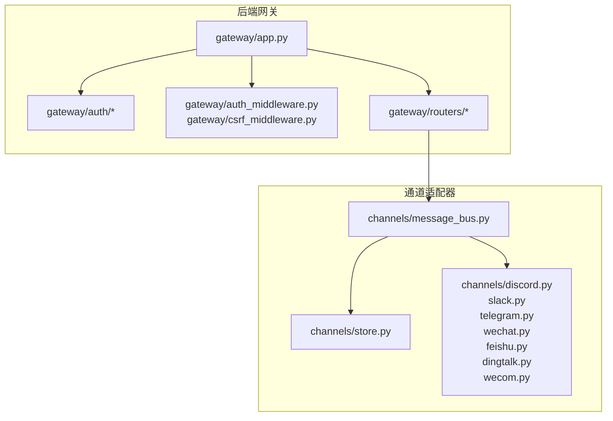
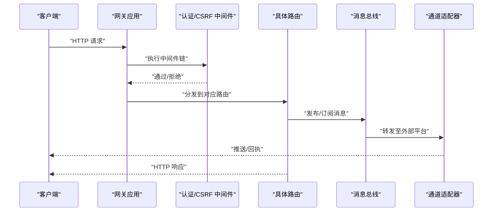
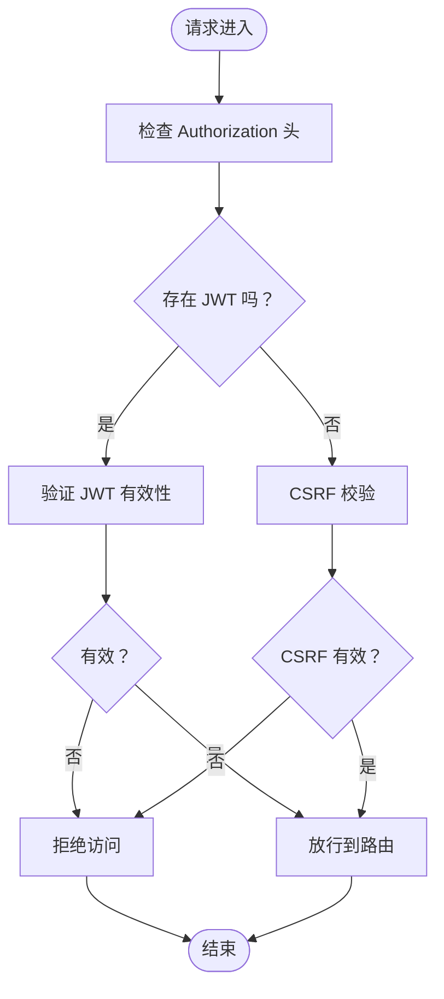
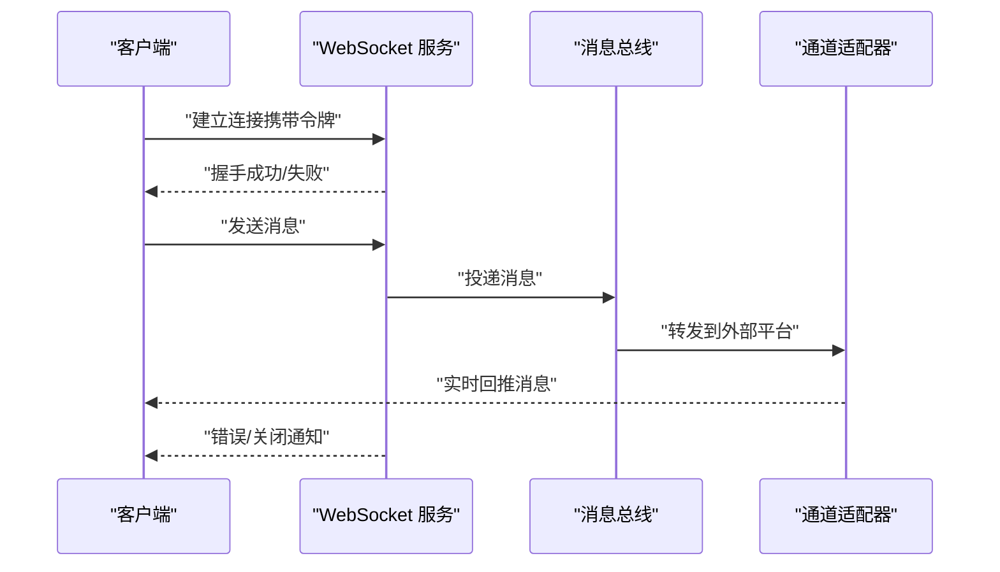
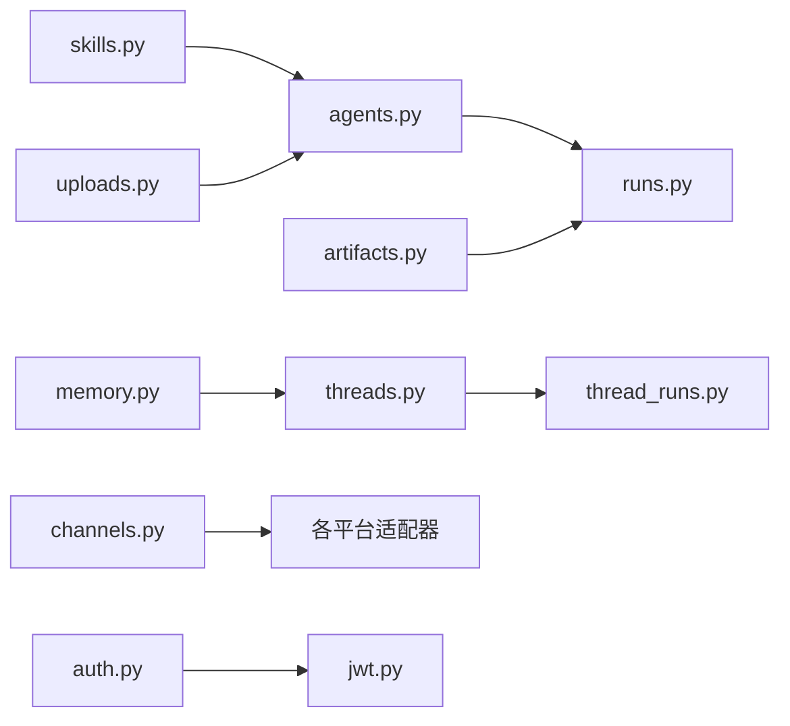
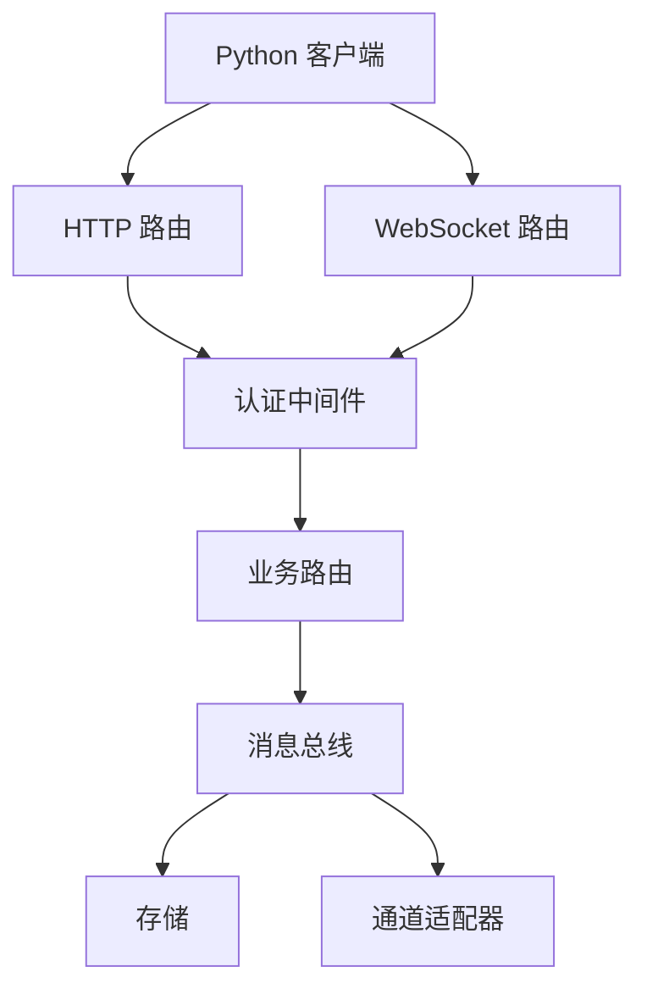

# API 参考

<cite>
**本文引用的文件**
- [API.md](file://backend/docs/API.md)
- [client.py](file://backend/packages/harness/deerflow/client.py)
- [mcp_client.py](file://backend/packages/harness/deerflow/mcp/client.py)
- [agents.py](file://backend/app/gateway/routers/agents.py)
- [artifacts.py](file://backend/app/gateway/routers/artifacts.py)
- [auth.py](file://backend/app/gateway/routers/auth.py)
- [channels.py](file://backend/app/gateway/routers/channels.py)
- [memory.py](file://backend/app/gateway/routers/memory.py)
- [models.py](file://backend/app/gateway/routers/models.py)
- [runs.py](file://backend/app/gateway/routers/runs.py)
- [skills.py](file://backend/app/gateway/routers/skills.py)
- [suggestions.py](file://backend/app/gateway/routers/suggestions.py)
- [thread_runs.py](file://backend/app/gateway/routers/thread_runs.py)
- [threads.py](file://backend/app/gateway/routers/threads.py)
- [uploads.py](file://backend/app/gateway/routers/uploads.py)
- [jwt.py](file://backend/app/gateway/auth/jwt.py)
- [errors.py](file://backend/app/gateway/auth/errors.py)
- [auth_middleware.py](file://backend/app/gateway/auth_middleware.py)
- [csrf_middleware.py](file://backend/app/gateway/csrf_middleware.py)
- [message_bus.py](file://backend/app/channels/message_bus.py)
- [store.py](file://backend/app/channels/store.py)
- [discord.py](file://backend/app/channels/discord.py)
- [slack.py](file://backend/app/channels/slack.py)
- [telegram.py](file://backend/app/channels/telegram.py)
- [wechat.py](file://backend/app/channels/wechat.py)
- [feishu.py](file://backend/app/channels/feishu.py)
- [dingtalk.py](file://backend/app/channels/dingtalk.py)
- [wecom.py](file://backend/app/channels/wecom.py)
- [commands.py](file://backend/app/channels/commands.py)
- [base.py](file://backend/app/channels/base.py)
- [manager.py](file://backend/app/channels/manager.py)
- [service.py](file://backend/app/channels/service.py)
- [API.md（数据采集）](file://deerflow_extensions/data_collection/API.md)
</cite>

## 目录
1. [简介](#简介)
2. [项目结构](#项目结构)
3. [核心组件](#核心组件)
4. [架构总览](#架构总览)
5. [详细组件分析](#详细组件分析)
6. [依赖关系分析](#依赖关系分析)
7. [性能考虑](#性能考虑)
8. [故障排查指南](#故障排查指南)
9. [结论](#结论)
10. [附录](#附录)

## 简介
本文件为 DeerFlow API 的权威参考文档，覆盖以下方面：
- RESTful API 设计：端点设计规范、请求/响应格式、错误码定义、认证与授权流程
- WebSocket 实时接口：连接管理、消息格式、错误处理
- 嵌入式 Python 客户端：SDK 方法、参数与返回值规范
- 具体调用示例、SDK 使用指南与集成模式
- 版本管理、向后兼容性与性能优化建议

## 项目结构
后端采用分层网关架构，路由集中在 gateway/routers 下，认证与中间件位于 gateway/auth 与 gateway 下，通道（Channel）适配器位于 app/channels。

图表来源
- [app.py](file://backend/app/gateway/app.py)
- [auth_middleware.py](file://backend/app/gateway/auth_middleware.py)
- [csrf_middleware.py](file://backend/app/gateway/csrf_middleware.py)
- [message_bus.py](file://backend/app/channels/message_bus.py)
- [store.py](file://backend/app/channels/store.py)
- [discord.py](file://backend/app/channels/discord.py)
- [slack.py](file://backend/app/channels/slack.py)
- [telegram.py](file://backend/app/channels/telegram.py)
- [wechat.py](file://backend/app/channels/wechat.py)
- [feishu.py](file://backend/app/channels/feishu.py)
- [dingtalk.py](file://backend/app/channels/dingtalk.py)
- [wecom.py](file://backend/app/channels/wecom.py)

章节来源
- [app.py](file://backend/app/gateway/app.py)
- [auth_middleware.py](file://backend/app/gateway/auth_middleware.py)
- [csrf_middleware.py](file://backend/app/gateway/csrf_middleware.py)
- [message_bus.py](file://backend/app/channels/message_bus.py)
- [store.py](file://backend/app/channels/store.py)

## 核心组件
- 网关应用与路由：REST API 的入口与各资源路由集合
- 认证与授权：JWT、本地凭据、权限控制与中间件
- 通道适配器：Discord、Slack、Telegram、微信、飞书、钉钉、企业微信等多平台消息桥接
- 消息总线与存储：统一的消息发布/订阅与持久化
- 嵌入式 Python 客户端：SDK 封装 HTTP/WS 调用，便于在 Python 环境中集成

章节来源
- [agents.py](file://backend/app/gateway/routers/agents.py)
- [artifacts.py](file://backend/app/gateway/routers/artifacts.py)
- [auth.py](file://backend/app/gateway/routers/auth.py)
- [channels.py](file://backend/app/gateway/routers/channels.py)
- [memory.py](file://backend/app/gateway/routers/memory.py)
- [models.py](file://backend/app/gateway/routers/models.py)
- [runs.py](file://backend/app/gateway/routers/runs.py)
- [skills.py](file://backend/app/gateway/routers/skills.py)
- [suggestions.py](file://backend/app/gateway/routers/suggestions.py)
- [thread_runs.py](file://backend/app/gateway/routers/thread_runs.py)
- [threads.py](file://backend/app/gateway/routers/threads.py)
- [uploads.py](file://backend/app/gateway/routers/uploads.py)
- [jwt.py](file://backend/app/gateway/auth/jwt.py)
- [errors.py](file://backend/app/gateway/auth/errors.py)
- [client.py](file://backend/packages/harness/deerflow/client.py)
- [mcp_client.py](file://backend/packages/harness/deerflow/mcp/client.py)

## 架构总览
下图展示从客户端到后端网关、认证中间件、路由与通道适配器的整体交互。

图表来源
- [app.py](file://backend/app/gateway/app.py)
- [auth_middleware.py](file://backend/app/gateway/auth_middleware.py)
- [csrf_middleware.py](file://backend/app/gateway/csrf_middleware.py)
- [message_bus.py](file://backend/app/channels/message_bus.py)
- [discord.py](file://backend/app/channels/discord.py)
- [slack.py](file://backend/app/channels/slack.py)
- [telegram.py](file://backend/app/channels/telegram.py)
- [wechat.py](file://backend/app/channels/wechat.py)
- [feishu.py](file://backend/app/channels/feishu.py)
- [dingtalk.py](file://backend/app/channels/dingtalk.py)
- [wecom.py](file://backend/app/channels/wecom.py)

## 详细组件分析

### REST API 设计总览
- 统一的资源命名与版本化：路由模块按资源划分（如 agents、threads、runs、skills 等），便于扩展与维护
- 错误码与响应格式：遵循一致的错误结构与状态码映射，便于前端与 SDK 处理
- 认证与授权：支持 JWT 令牌与内部鉴权，路由级权限控制与 CSRF 保护

章节来源
- [API.md](file://backend/docs/API.md)
- [agents.py](file://backend/app/gateway/routers/agents.py)
- [threads.py](file://backend/app/gateway/routers/threads.py)
- [runs.py](file://backend/app/gateway/routers/runs.py)
- [skills.py](file://backend/app/gateway/routers/skills.py)
- [auth.py](file://backend/app/gateway/routers/auth.py)
- [jwt.py](file://backend/app/gateway/auth/jwt.py)
- [errors.py](file://backend/app/gateway/auth/errors.py)

### 认证与授权
- JWT 签发与校验：提供令牌生成、解析与失效处理
- 认证中间件：拦截请求，验证令牌有效性与权限
- CSRF 保护：防止跨站请求伪造
- 错误处理：统一的认证异常类型与错误码

图表来源
- [auth_middleware.py](file://backend/app/gateway/auth_middleware.py)
- [csrf_middleware.py](file://backend/app/gateway/csrf_middleware.py)
- [jwt.py](file://backend/app/gateway/auth/jwt.py)
- [errors.py](file://backend/app/gateway/auth/errors.py)

章节来源
- [auth_middleware.py](file://backend/app/gateway/auth_middleware.py)
- [csrf_middleware.py](file://backend/app/gateway/csrf_middleware.py)
- [jwt.py](file://backend/app/gateway/auth/jwt.py)
- [errors.py](file://backend/app/gateway/auth/errors.py)

### WebSocket 接口与实时通信
- 连接管理：基于会话与令牌的握手与心跳维持
- 消息格式：统一的事件/消息结构，支持文本、附件与流式输出
- 错误处理：断连重试、超时处理与错误广播
- 通道适配：消息总线将内部事件转发至各外部平台适配器

图表来源
- [message_bus.py](file://backend/app/channels/message_bus.py)
- [store.py](file://backend/app/channels/store.py)
- [discord.py](file://backend/app/channels/discord.py)
- [slack.py](file://backend/app/channels/slack.py)
- [telegram.py](file://backend/app/channels/telegram.py)
- [wechat.py](file://backend/app/channels/wechat.py)
- [feishu.py](file://backend/app/channels/feishu.py)
- [dingtalk.py](file://backend/app/channels/dingtalk.py)
- [wecom.py](file://backend/app/channels/wecom.py)

章节来源
- [message_bus.py](file://backend/app/channels/message_bus.py)
- [store.py](file://backend/app/channels/store.py)
- [discord.py](file://backend/app/channels/discord.py)
- [slack.py](file://backend/app/channels/slack.py)
- [telegram.py](file://backend/app/channels/telegram.py)
- [wechat.py](file://backend/app/channels/wechat.py)
- [feishu.py](file://backend/app/channels/feishu.py)
- [dingtalk.py](file://backend/app/channels/dingtalk.py)
- [wecom.py](file://backend/app/channels/wecom.py)

### 嵌入式 Python 客户端（SDK）
- 功能概览：封装 HTTP 与 WebSocket 调用，提供会话管理、令牌刷新与错误重试
- 方法清单：初始化、登录、创建/查询线程、启动运行、上传文件、接收流式事件等
- 参数与返回值：标准化的输入输出结构，便于与后端保持一致

章节来源
- [client.py](file://backend/packages/harness/deerflow/client.py)
- [mcp_client.py](file://backend/packages/harness/deerflow/mcp/client.py)

### 关键路由与资源
- 代理（Agents）、工件（Artifacts）、记忆（Memory）、模型（Models）、运行（Runs）、技能（Skills）、建议（Suggestions）、线程（Threads）、线程运行（Thread Runs）、上传（Uploads）、通道（Channels）、认证（Auth）

图表来源
- [agents.py](file://backend/app/gateway/routers/agents.py)
- [artifacts.py](file://backend/app/gateway/routers/artifacts.py)
- [auth.py](file://backend/app/gateway/routers/auth.py)
- [channels.py](file://backend/app/gateway/routers/channels.py)
- [memory.py](file://backend/app/gateway/routers/memory.py)
- [models.py](file://backend/app/gateway/routers/models.py)
- [runs.py](file://backend/app/gateway/routers/runs.py)
- [skills.py](file://backend/app/gateway/routers/skills.py)
- [suggestions.py](file://backend/app/gateway/routers/suggestions.py)
- [thread_runs.py](file://backend/app/gateway/routers/thread_runs.py)
- [threads.py](file://backend/app/gateway/routers/threads.py)
- [uploads.py](file://backend/app/gateway/routers/uploads.py)
- [jwt.py](file://backend/app/gateway/auth/jwt.py)

章节来源
- [agents.py](file://backend/app/gateway/routers/agents.py)
- [artifacts.py](file://backend/app/gateway/routers/artifacts.py)
- [auth.py](file://backend/app/gateway/routers/auth.py)
- [channels.py](file://backend/app/gateway/routers/channels.py)
- [memory.py](file://backend/app/gateway/routers/memory.py)
- [models.py](file://backend/app/gateway/routers/models.py)
- [runs.py](file://backend/app/gateway/routers/runs.py)
- [skills.py](file://backend/app/gateway/routers/skills.py)
- [suggestions.py](file://backend/app/gateway/routers/suggestions.py)
- [thread_runs.py](file://backend/app/gateway/routers/thread_runs.py)
- [threads.py](file://backend/app/gateway/routers/threads.py)
- [uploads.py](file://backend/app/gateway/routers/uploads.py)

### 数据采集扩展 API
- 用途：面向数据采集场景的扩展接口，提供导出格式、质量仪表盘与格式校验能力
- 与主 API 的关系：作为独立扩展模块，可按需启用

章节来源
- [API.md（数据采集）](file://deerflow_extensions/data_collection/API.md)

## 依赖关系分析
- 路由到通道：各业务路由通过消息总线与存储模块解耦，最终由适配器落地到外部平台
- 认证到路由：认证中间件在路由前统一拦截，确保安全访问
- 客户端到网关：SDK 通过 HTTP/WS 与网关交互，遵循统一的错误与事件模型

图表来源
- [client.py](file://backend/packages/harness/deerflow/client.py)
- [auth_middleware.py](file://backend/app/gateway/auth_middleware.py)
- [message_bus.py](file://backend/app/channels/message_bus.py)
- [store.py](file://backend/app/channels/store.py)
- [discord.py](file://backend/app/channels/discord.py)
- [slack.py](file://backend/app/channels/slack.py)
- [telegram.py](file://backend/app/channels/telegram.py)
- [wechat.py](file://backend/app/channels/wechat.py)
- [feishu.py](file://backend/app/channels/feishu.py)
- [dingtalk.py](file://backend/app/channels/dingtalk.py)
- [wecom.py](file://backend/app/channels/wecom.py)

章节来源
- [client.py](file://backend/packages/harness/deerflow/client.py)
- [auth_middleware.py](file://backend/app/gateway/auth_middleware.py)
- [message_bus.py](file://backend/app/channels/message_bus.py)
- [store.py](file://backend/app/channels/store.py)

## 性能考虑
- 流式传输：优先使用 SSE/WS 流式输出，降低延迟与内存占用
- 批量操作：合并上传与批量写入，减少往返次数
- 缓存策略：对只读数据与配置进行缓存，减轻数据库压力
- 并发限制：在路由与适配器层设置并发上限，避免过载
- 超时与重试：合理设置超时与指数退避重试，提升稳定性

## 故障排查指南
- 认证失败：检查令牌是否过期或格式错误；确认中间件是否正确注入用户上下文
- CSRF 拒绝：确认请求头与 Cookie 配置；检查同源策略
- 通道异常：查看适配器日志与外部平台回调；核对凭证与权限范围
- WebSocket 断连：检查心跳与重连逻辑；定位网络波动或限流

章节来源
- [errors.py](file://backend/app/gateway/auth/errors.py)
- [auth_middleware.py](file://backend/app/gateway/auth_middleware.py)
- [csrf_middleware.py](file://backend/app/gateway/csrf_middleware.py)
- [discord.py](file://backend/app/channels/discord.py)
- [slack.py](file://backend/app/channels/slack.py)
- [telegram.py](file://backend/app/channels/telegram.py)
- [wechat.py](file://backend/app/channels/wechat.py)
- [feishu.py](file://backend/app/channels/feishu.py)
- [dingtalk.py](file://backend/app/channels/dingtalk.py)
- [wecom.py](file://backend/app/channels/wecom.py)

## 结论
DeerFlow 提供了清晰的 REST API 与实时通信能力，并通过统一的认证中间件与通道适配器实现多平台互通。嵌入式 Python 客户端简化了集成流程，配合完善的错误处理与性能建议，能够满足从开发测试到生产部署的多样化需求。

## 附录
- 版本管理与兼容性：遵循语义化版本，变更记录见项目文档与扩展说明
- 集成模式：推荐先使用 SDK 快速集成，再根据需要扩展自定义适配器
- 示例与最佳实践：结合各路由与适配器实现，参考数据采集扩展的导出示例