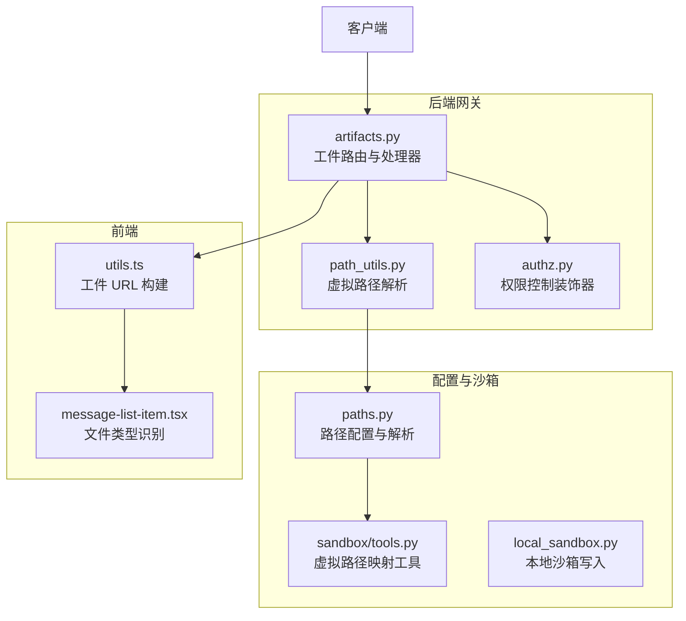
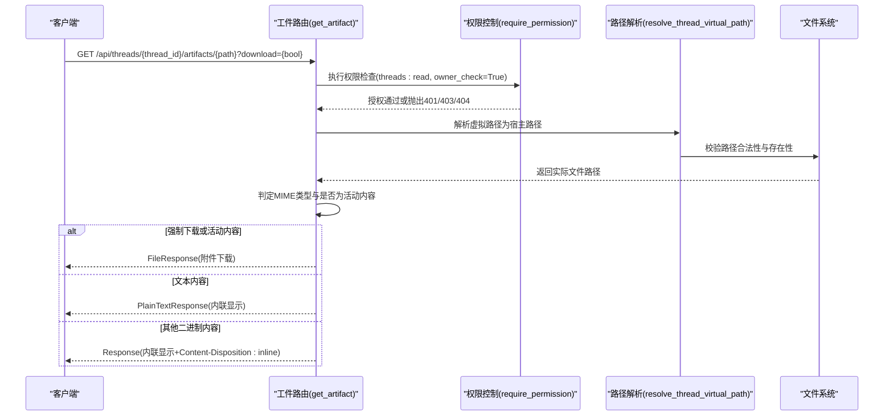
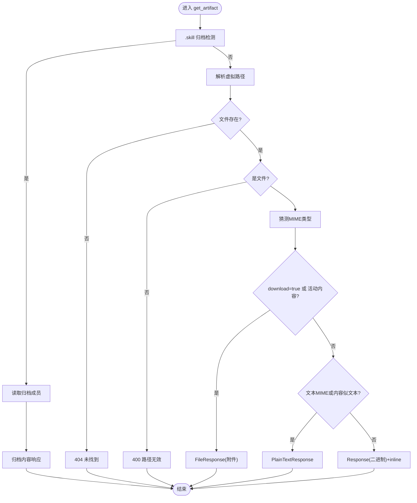
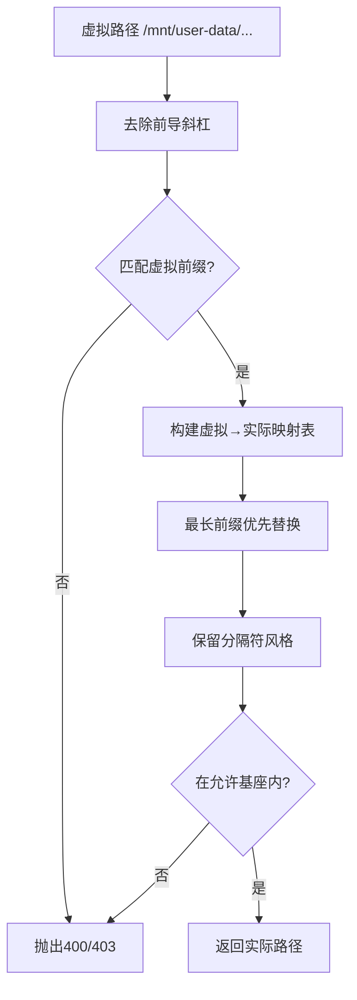
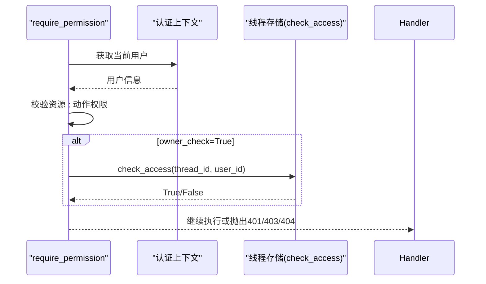
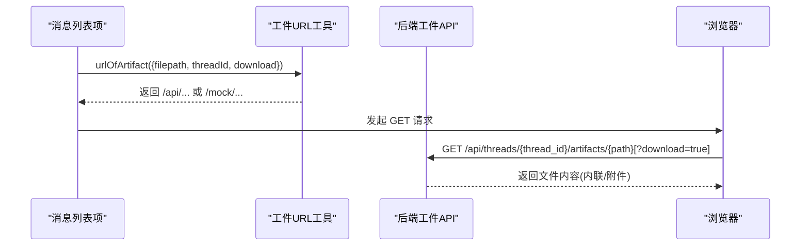
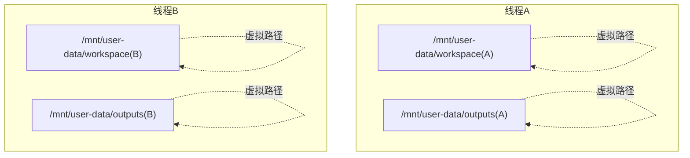
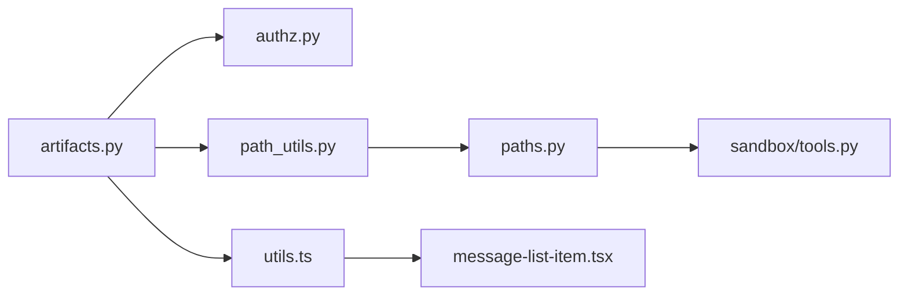

# 工件 API 参考文档

<cite>
**本文档引用的文件**
- [artifacts.py](file://backend/app/gateway/routers/artifacts.py)
- [path_utils.py](file://backend/app/gateway/path_utils.py)
- [authz.py](file://backend/app/gateway/authz.py)
- [paths.py](file://backend/packages/harness/deerflow/config/paths.py)
- [tools.py](file://backend/packages/harness/deerflow/sandbox/tools.py)
- [local_sandbox.py](file://backend/packages/harness/deerflow/sandbox/local/local_sandbox.py)
- [utils.ts](file://frontend/src/core/artifacts/utils.ts)
- [message-list-item.tsx](file://frontend/src/components/workspace/messages/message-list-item.tsx)
- [generate_review.py](file://skills/public/skill-creator/eval-viewer/generate_review.py)
- [AUTH_DESIGN.md](file://backend/docs/AUTH_DESIGN.md)
- [test_artifacts_router.py](file://backend/tests/test_artifacts_router.py)
- [test_paths_user_isolation.py](file://backend/tests/test_paths_user_isolation.py)
- [test_local_sandbox_virtual_path_contract.py](file://backend/tests/test_local_sandbox_virtual_path_contract.py)
</cite>

## 目录
1. [简介](#简介)
2. [项目结构](#项目结构)
3. [核心组件](#核心组件)
4. [架构概览](#架构概览)
5. [详细组件分析](#详细组件分析)
6. [依赖关系分析](#依赖关系分析)
7. [性能考量](#性能考量)
8. [故障排除指南](#故障排除指南)
9. [结论](#结论)
10. [附录](#附录)

## 简介
本文件为 DeerFlow 工件 API 的权威参考文档，聚焦于工件获取、下载与管理的完整端点设计。重点阐释以下方面：
- GET /api/threads/{thread_id}/artifacts/{path} 端点的路径解析、文件访问控制与内容类型处理
- 虚拟路径映射机制、沙箱隔离与用户权限验证
- 工件访问示例：直接查看、强制下载与预览功能
- 工件生命周期管理、存储优化与安全访问控制策略
- 不同文件类型的处理方式与浏览器兼容性考虑

## 项目结构
工件 API 的实现分布在后端网关路由层、路径解析工具、权限控制模块以及前端工具函数中，并与沙箱虚拟路径映射机制紧密耦合。

**图表来源**
- [artifacts.py:1-202](file://backend/app/gateway/routers/artifacts.py#L1-L202)
- [path_utils.py:1-29](file://backend/app/gateway/path_utils.py#L1-L29)
- [authz.py:198-302](file://backend/app/gateway/authz.py#L198-L302)
- [paths.py:291-309](file://backend/packages/harness/deerflow/config/paths.py#L291-L309)
- [tools.py:493-524](file://backend/packages/harness/deerflow/sandbox/tools.py#L493-L524)
- [local_sandbox.py:408-429](file://backend/packages/harness/deerflow/sandbox/local/local_sandbox.py#L408-L429)
- [utils.ts:1-47](file://frontend/src/core/artifacts/utils.ts#L1-L47)
- [message-list-item.tsx:339-390](file://frontend/src/components/workspace/messages/message-list-item.tsx#L339-L390)

**章节来源**
- [artifacts.py:1-202](file://backend/app/gateway/routers/artifacts.py#L1-L202)
- [path_utils.py:1-29](file://backend/app/gateway/path_utils.py#L1-L29)
- [authz.py:198-302](file://backend/app/gateway/authz.py#L198-L302)
- [paths.py:291-309](file://backend/packages/harness/deerflow/config/paths.py#L291-L309)
- [tools.py:493-524](file://backend/packages/harness/deerflow/sandbox/tools.py#L493-L524)
- [local_sandbox.py:408-429](file://backend/packages/harness/deerflow/sandbox/local/local_sandbox.py#L408-L429)
- [utils.ts:1-47](file://frontend/src/core/artifacts/utils.ts#L1-L47)
- [message-list-item.tsx:339-390](file://frontend/src/components/workspace/messages/message-list-item.tsx#L339-L390)

## 核心组件
- 工件路由处理器：负责解析路径、执行权限检查、判定内容类型并返回相应响应。
- 路径解析工具：将虚拟路径转换为宿主实际路径，同时进行路径遍历检测与隔离。
- 权限控制装饰器：基于资源与动作进行权限校验，并支持所有者检查。
- 虚拟路径映射：将 /mnt/user-data 下的虚拟目录映射到各线程的用户数据目录。
- 前端工具：构建工件访问 URL，支持直接查看与强制下载模式。

**章节来源**
- [artifacts.py:105-202](file://backend/app/gateway/routers/artifacts.py#L105-L202)
- [path_utils.py:11-29](file://backend/app/gateway/path_utils.py#L11-L29)
- [authz.py:198-302](file://backend/app/gateway/authz.py#L198-L302)
- [paths.py:291-309](file://backend/packages/harness/deerflow/config/paths.py#L291-L309)
- [tools.py:493-524](file://backend/packages/harness/deerflow/sandbox/tools.py#L493-L524)
- [utils.ts:5-34](file://frontend/src/core/artifacts/utils.ts#L5-L34)

## 架构概览
下图展示了工件访问的关键流程：客户端请求 → 权限校验 → 虚拟路径解析 → 内容类型判定 → 响应生成。

**图表来源**
- [artifacts.py:105-202](file://backend/app/gateway/routers/artifacts.py#L105-L202)
- [authz.py:279-296](file://backend/app/gateway/authz.py#L279-L296)
- [path_utils.py:25-29](file://backend/app/gateway/path_utils.py#L25-L29)

**章节来源**
- [artifacts.py:105-202](file://backend/app/gateway/routers/artifacts.py#L105-L202)
- [authz.py:279-296](file://backend/app/gateway/authz.py#L279-L296)
- [path_utils.py:25-29](file://backend/app/gateway/path_utils.py#L25-L29)

## 详细组件分析

### 工件路由处理器（GET /api/threads/{thread_id}/artifacts/{path}）
- 路径解析：通过 resolve_thread_virtual_path 将虚拟路径映射到宿主实际路径，并进行用户上下文注入。
- 访问控制：使用 require_permission("threads","read",owner_check=True) 进行权限与所有者检查。
- 内容类型处理：
  - 强制下载：download=true 或活动内容（text/html, application/xhtml+xml, image/svg+xml）始终以附件形式下载。
  - 文本内容：优先使用文本 MIME 类型，未知类型尝试 UTF-8 解码后以 text/plain 返回。
  - 二进制内容：以字节流返回，并设置 Content-Disposition:inline 以便浏览器预览。
- 错误处理：非法路径、路径遍历、非文件路径、文件不存在分别返回 400/403/404。

**图表来源**
- [artifacts.py:138-202](file://backend/app/gateway/routers/artifacts.py#L138-L202)

**章节来源**
- [artifacts.py:105-202](file://backend/app/gateway/routers/artifacts.py#L105-L202)

### 路径解析与虚拟路径映射
- 虚拟路径前缀：/mnt/user-data 下的 workspace、uploads、outputs 三类目录映射到各线程的用户数据目录。
- 用户隔离：resolve_virtual_path 支持 user_id 参数，确保不同用户对同一虚拟路径解析到不同的宿主路径。
- 路径遍历防护：在虚拟路径映射过程中严格校验相对路径，防止越权访问。

**图表来源**
- [paths.py:291-309](file://backend/packages/harness/deerflow/config/paths.py#L291-L309)
- [tools.py:493-524](file://backend/packages/harness/deerflow/sandbox/tools.py#L493-L524)
- [tools.py:291-313](file://backend/packages/harness/deerflow/sandbox/tools.py#L291-L313)

**章节来源**
- [paths.py:291-309](file://backend/packages/harness/deerflow/config/paths.py#L291-L309)
- [tools.py:493-524](file://backend/packages/harness/deerflow/sandbox/tools.py#L493-L524)
- [tools.py:291-313](file://backend/packages/harness/deerflow/sandbox/tools.py#L291-L313)

### 权限验证与所有者检查
- 装饰器 require_permission 自动完成认证与授权检查，并在 owner_check=True 时对线程元数据进行所有者验证。
- 读操作对“未追踪的旧线程”保持兼容，写/删操作使用 require_existing=True 严格限制。

**图表来源**
- [authz.py:279-296](file://backend/app/gateway/authz.py#L279-L296)

**章节来源**
- [authz.py:198-302](file://backend/app/gateway/authz.py#L198-L302)
- [AUTH_DESIGN.md:161-218](file://backend/docs/AUTH_DESIGN.md#L161-L218)

### 前端工件访问与预览
- URL 构建：根据 isStaticWebsiteOnly 与 isMock 选择后端真实接口或 mock 接口，并自动附加 download 查询参数。
- 文件类型识别：前端根据扩展名识别图片、PDF 等类型，便于选择合适的展示方式。
- 示例：直接查看 /api/threads/{thread_id}/artifacts/mnt/user-data/outputs/report.pdf；强制下载 /api/threads/{thread_id}/artifacts/mnt/user-data/outputs/report.pdf?download=true。

**图表来源**
- [utils.ts:5-34](file://frontend/src/core/artifacts/utils.ts#L5-L34)
- [message-list-item.tsx:345-376](file://frontend/src/components/workspace/messages/message-list-item.tsx#L345-L376)

**章节来源**
- [utils.ts:5-34](file://frontend/src/core/artifacts/utils.ts#L5-L34)
- [message-list-item.tsx:345-376](file://frontend/src/components/workspace/messages/message-list-item.tsx#L345-L376)

### 沙箱隔离与生命周期管理
- 每个线程拥有独立的用户数据目录，虚拟路径解析保证跨线程隔离。
- 本地沙箱写入时进行路径解析与只读保护，Agent 写入的文件被跟踪以便后续反解析。
- 测试覆盖了多线程隔离、路径映射一致性与 trailing slash 保持等关键行为。

**图表来源**
- [test_local_sandbox_virtual_path_contract.py:170-180](file://backend/tests/test_local_sandbox_virtual_path_contract.py#L170-L180)
- [local_sandbox.py:408-429](file://backend/packages/harness/deerflow/sandbox/local/local_sandbox.py#L408-L429)

**章节来源**
- [test_paths_user_isolation.py:173-184](file://backend/tests/test_paths_user_isolation.py#L173-L184)
- [test_local_sandbox_virtual_path_contract.py:170-180](file://backend/tests/test_local_sandbox_virtual_path_contract.py#L170-L180)
- [local_sandbox.py:408-429](file://backend/packages/harness/deerflow/sandbox/local/local_sandbox.py#L408-L429)

## 依赖关系分析
- 工件路由依赖权限控制装饰器与路径解析工具。
- 路径解析依赖配置模块与沙箱映射工具，确保虚拟路径到宿主路径的正确映射。
- 前端工具依赖后端基础 URL 与静态网站模式判断，决定请求目标与参数。

**图表来源**
- [artifacts.py:10-11](file://backend/app/gateway/routers/artifacts.py#L10-L11)
- [path_utils.py:7-8](file://backend/app/gateway/path_utils.py#L7-L8)
- [paths.py:291-309](file://backend/packages/harness/deerflow/config/paths.py#L291-L309)
- [tools.py:493-524](file://backend/packages/harness/deerflow/sandbox/tools.py#L493-L524)
- [utils.ts:1-2](file://frontend/src/core/artifacts/utils.ts#L1-L2)
- [message-list-item.tsx:1-3](file://frontend/src/components/workspace/messages/message-list-item.tsx#L1-L3)

**章节来源**
- [artifacts.py:10-11](file://backend/app/gateway/routers/artifacts.py#L10-L11)
- [path_utils.py:7-8](file://backend/app/gateway/path_utils.py#L7-L8)
- [paths.py:291-309](file://backend/packages/harness/deerflow/config/paths.py#L291-L309)
- [tools.py:493-524](file://backend/packages/harness/deerflow/sandbox/tools.py#L493-L524)
- [utils.ts:1-2](file://frontend/src/core/artifacts/utils.ts#L1-L2)
- [message-list-item.tsx:1-3](file://frontend/src/components/workspace/messages/message-list-item.tsx#L1-L3)

## 性能考量
- 大文件传输：对于超大工件，建议使用强制下载模式减少内存占用与浏览器渲染压力。
- 缓存头：响应可附加缓存头以提升重复访问性能（当前实现主要关注安全与兼容性）。
- MIME 类型猜测：依赖系统 MIME 映射，必要时可结合内容探测增强准确性。
- 归档读取：.skill 归档采用分块读取与大小限制，避免内存峰值过高。

[本节为通用指导，无需特定文件来源]

## 故障排除指南
- 401 未认证：确认已登录并通过认证中间件。
- 403 权限不足：检查用户对目标线程的所有者身份，或资源权限配置。
- 404 线程不存在：线程元数据缺失且 owner_check 使用 require_existing=True 时会返回 404。
- 400/403 路径错误：检查虚拟路径是否以 /mnt/user-data 开头，是否存在路径遍历风险。
- 404 文件不存在：确认工件路径正确且文件存在于 outputs 目录。
- 归档成员读取失败：检查 .skill 文件完整性与成员路径。

**章节来源**
- [authz.py:260-296](file://backend/app/gateway/authz.py#L260-L296)
- [path_utils.py:25-29](file://backend/app/gateway/path_utils.py#L25-L29)
- [test_artifacts_router.py:73-87](file://backend/tests/test_artifacts_router.py#L73-L87)

## 结论
DeerFlow 工件 API 通过严格的虚拟路径映射与权限控制，实现了安全、隔离且高效的工件访问体验。其设计兼顾浏览器兼容性与安全性，支持多种文件类型的灵活展示与下载，并提供了完善的测试覆盖以保障行为一致性。

[本节为总结性内容，无需特定文件来源]

## 附录

### API 定义与示例
- 端点：GET /api/threads/{thread_id}/artifacts/{path}
- 查询参数：
  - download: 是否强制以附件下载（默认 false）
- 响应：
  - 文本内容：text/* MIME，内联显示
  - 活动内容（HTML/XHTML/SVG）：强制附件下载
  - 其他二进制内容：内联显示并带 inline Content-Disposition
- 示例：
  - 直接查看：/api/threads/{thread_id}/artifacts/mnt/user-data/outputs/report.pdf
  - 强制下载：/api/threads/{thread_id}/artifacts/mnt/user-data/outputs/report.pdf?download=true

**章节来源**
- [artifacts.py:99-137](file://backend/app/gateway/routers/artifacts.py#L99-L137)
- [utils.ts:5-34](file://frontend/src/core/artifacts/utils.ts#L5-L34)

### 文件类型处理与浏览器兼容性
- 图片与 PDF：建议内联显示以便预览；若浏览器不支持，可回退为下载。
- 文档与代码：优先以文本形式内联显示，便于复制与阅读。
- 活动内容：始终强制下载，避免脚本在应用源上下文中执行。

**章节来源**
- [message-list-item.tsx:345-376](file://frontend/src/components/workspace/messages/message-list-item.tsx#L345-L376)
- [generate_review.py:154-195](file://skills/public/skill-creator/eval-viewer/generate_review.py#L154-L195)