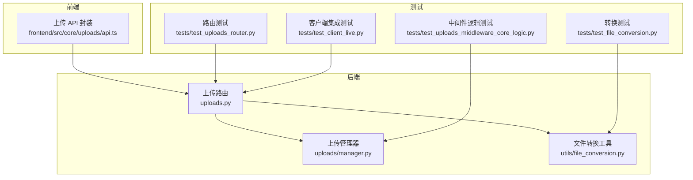
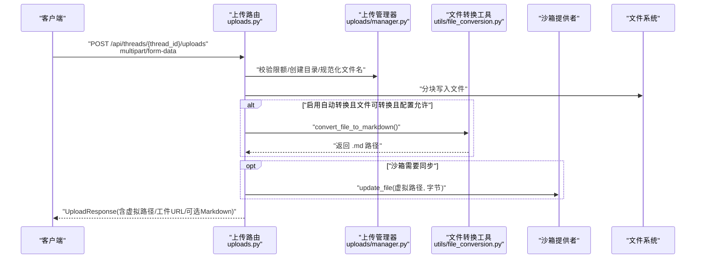
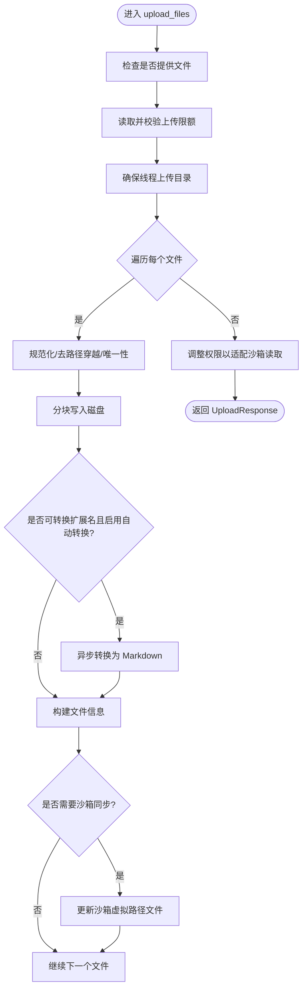
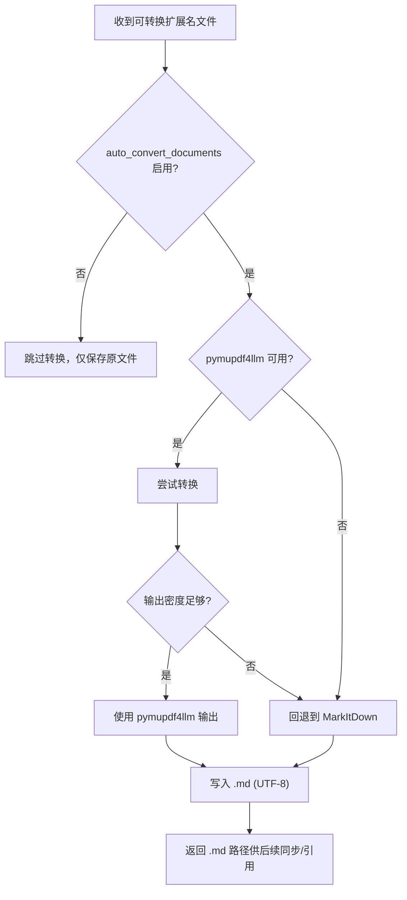
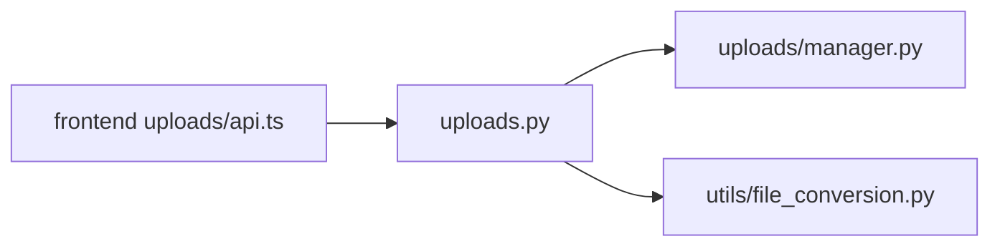

# 文件上传 API

<cite>
**本文引用的文件**
- [backend/app/gateway/routers/uploads.py](file://backend/app/gateway/routers/uploads.py)
- [backend/docs/FILE_UPLOAD.md](file://backend/docs/FILE_UPLOAD.md)
- [frontend/src/core/uploads/api.ts](file://frontend/src/core/uploads/api.ts)
- [backend/packages/harness/deerflow/uploads/manager.py](file://backend/packages/harness/deerflow/uploads/manager.py)
- [backend/packages/harness/deerflow/utils/file_conversion.py](file://backend/packages/harness/deerflow/utils/file_conversion.py)
- [backend/tests/test_uploads_router.py](file://backend/tests/test_uploads_router.py)
- [backend/tests/test_client_live.py](file://backend/tests/test_client_live.py)
- [backend/tests/test_file_conversion.py](file://backend/tests/test_file_conversion.py)
- [backend/tests/test_uploads_middleware_core_logic.py](file://backend/tests/test_uploads_middleware_core_logic.py)
- [frontend/tests/unit/core/uploads/file-validation.test.ts](file://frontend/tests/unit/core/uploads/file-validation.test.ts)
- [config.example.yaml](file://config.example.yaml)
</cite>

## 更新摘要
**变更内容**
- 更新了主机侧上传转换的安全合规要求，现在默认禁用
- 新增了显式配置选项以启用主机侧转换
- 增强了安全警告和风险说明
- 更新了配置示例和默认值

## 目录
1. [简介](#简介)
2. [项目结构](#项目结构)
3. [核心组件](#核心组件)
4. [架构总览](#架构总览)
5. [详细组件分析](#详细组件分析)
6. [依赖分析](#依赖分析)
7. [性能考量](#性能考量)
8. [故障排查指南](#故障排查指南)
9. [结论](#结论)
10. [附录](#附录)

## 简介
本文件为 DeerFlow 文件上传 API 的权威参考文档，覆盖以下能力：
- 多文件上传：POST /api/threads/{thread_id}/uploads，使用 multipart/form-data
- 文件列表查询：GET /api/threads/{thread_id}/uploads/list
- 单文件删除：DELETE /api/threads/{thread_id}/uploads/{filename}
- **安全合规的可选文档转换**：对 PDF、PPT、Excel、Word 在主机侧可选转换为 Markdown
- 安全与隔离：线程级目录隔离、路径穿越防护、沙箱权限适配
- 元数据与工件 URL：虚拟路径映射、Markdown 转换结果、Artifacts 访问 URL
- 大文件与并发：分块写入、阈值触发异步转换、线程池避免阻塞事件循环

**重要更新**：主机侧上传转换现默认禁用，需要显式配置以符合安全合规要求。

## 项目结构
- 后端路由层：定义并实现上传相关端点
- 上传管理器：负责目录创建、文件命名、虚拟路径与工件 URL 生成、列表增强等
- 文件转换工具：根据扩展名自动将文档转为 Markdown
- 前端上传 API：封装上传、列出、删除的调用
- 测试：覆盖路由行为、转换逻辑、安全与隔离策略



**图表来源**
- [backend/app/gateway/routers/uploads.py:1-209](file://backend/app/gateway/routers/uploads.py#L1-L209)
- [backend/packages/harness/deerflow/uploads/manager.py:1-311](file://backend/packages/harness/deerflow/uploads/manager.py#L1-L311)
- [backend/packages/harness/deerflow/utils/file_conversion.py:1-316](file://backend/packages/harness/deerflow/utils/file_conversion.py#L1-L316)
- [frontend/src/core/uploads/api.ts:1-108](file://frontend/src/core/uploads/api.ts#L1-L108)
- [backend/tests/test_uploads_router.py:250-289](file://backend/tests/test_uploads_router.py#L250-L289)
- [backend/tests/test_client_live.py:183-216](file://backend/tests/test_client_live.py#L183-L216)
- [backend/tests/test_file_conversion.py:105-318](file://backend/tests/test_file_conversion.py#L105-L318)
- [backend/tests/test_uploads_middleware_core_logic.py:77-98](file://backend/tests/test_uploads_middleware_core_logic.py#L77-L98)

**章节来源**
- [backend/app/gateway/routers/uploads.py:1-209](file://backend/app/gateway/routers/uploads.py#L1-L209)
- [backend/docs/FILE_UPLOAD.md:1-315](file://backend/docs/FILE_UPLOAD.md#L1-L315)
- [frontend/src/core/uploads/api.ts:1-108](file://frontend/src/core/uploads/api.ts#L1-L108)

## 核心组件
- 上传路由与控制器
  - POST /api/threads/{thread_id}/uploads：接收 multipart/form-data，执行限额检查、写入磁盘、**可选转换**、沙箱同步、权限调整、返回统一响应
  - GET /api/threads/{thread_id}/uploads/list：列出当前线程上传目录中的文件，补充虚拟路径与工件 URL
  - DELETE /api/threads/{thread_id}/uploads/{filename}：安全删除指定文件及关联的 Markdown 转换产物
  - GET /api/threads/{thread_id}/uploads/limits：返回当前生效的上传限额配置
- 上传管理器
  - 目录与路径：确保线程上传目录存在、解析沙箱内上传目录、生成虚拟路径与工件 URL
  - 文件操作：规范化文件名、唯一性保障、列表增强、安全删除
- 文件转换工具
  - 支持扩展：.pdf、.ppt、.pptx、.xls、.xlsx、.doc、.docx
  - **安全默认**：主机侧自动转换默认禁用，需要显式配置启用
  - 自动模式：优先使用 pymupdf4llm，若输出稀疏则回退 MarkItDown；大文件通过线程池异步转换
- 前端上传 API
  - 封装上传、列表、删除的 fetch 请求，错误读取与抛错

**章节来源**
- [backend/app/gateway/routers/uploads.py:87-209](file://backend/app/gateway/routers/uploads.py#L87-L209)
- [backend/packages/harness/deerflow/uploads/manager.py:287-311](file://backend/packages/harness/deerflow/uploads/manager.py#L287-L311)
- [backend/packages/harness/deerflow/utils/file_conversion.py:26-40](file://backend/packages/harness/deerflow/utils/file_conversion.py#L26-L40)
- [frontend/src/core/uploads/api.ts:44-108](file://frontend/src/core/uploads/api.ts#L44-L108)

## 架构总览
下图展示从浏览器到后端、再到沙箱与存储的关键交互，包括新的安全合规流程。



**图表来源**
- [backend/app/gateway/routers/uploads.py:87-209](file://backend/app/gateway/routers/uploads.py#L87-L209)
- [backend/packages/harness/deerflow/uploads/manager.py:287-311](file://backend/packages/harness/deerflow/uploads/manager.py#L287-L311)
- [backend/packages/harness/deerflow/utils/file_conversion.py:138-168](file://backend/packages/harness/deerflow/utils/file_conversion.py#L138-L168)

## 详细组件分析

### POST /api/threads/{thread_id}/uploads
- 请求体
  - Content-Type: multipart/form-data
  - 字段: files (可多值)
- 行为与流程
  - 限额检查：文件数量、单文件大小、总大小
  - 目录准备：确保线程上传目录存在
  - 写入策略：分块读取，累计大小与单文件大小校验
  - 文件名处理：规范化、去路径穿越、唯一性保障
  - **安全转换**：仅当配置允许且文件可转换扩展名时，自动转 Markdown，UTF-8 写入
  - 沙箱同步：非挂载模式下将文件同步至沙箱虚拟路径
  - 权限适配：保证沙箱可读；必要时设置可写以完成同步
  - 响应：统一 UploadResponse，包含每个文件的虚拟路径与工件 URL，以及可选的 Markdown 元数据
- 错误处理
  - 400：无文件、线程 ID 非法、路径穿越、硬链接/符号链接风险
  - 413：文件过多、单文件超限、总大小超限
  - 500：写入失败、沙箱不可用、转换异常
- 安全与隔离
  - 路径穿越检测与清理
  - 线程级目录隔离
  - 沙箱权限位调整，避免容器内无法读取
  - **主机侧解析风险控制**：默认禁用，需要显式配置启用



**图表来源**
- [backend/app/gateway/routers/uploads.py:87-209](file://backend/app/gateway/routers/uploads.py#L87-L209)

**章节来源**
- [backend/app/gateway/routers/uploads.py:87-209](file://backend/app/gateway/routers/uploads.py#L87-L209)
- [backend/tests/test_uploads_router.py:255-289](file://backend/tests/test_uploads_router.py#L255-L289)
- [backend/tests/test_uploads_router.py:69-96](file://backend/tests/test_uploads_router.py#L69-L96)

### GET /api/threads/{thread_id}/uploads/list
- 行为
  - 列出线程上传目录中的所有文件
  - 对每个文件补充：字符串化大小、虚拟路径、工件 URL
  - 返回 { files: [...], count: number }
- 安全
  - 仅允许线程拥有者访问
- 前端集成
  - 使用 listUploadedFiles() 获取列表

**章节来源**
- [backend/app/gateway/routers/uploads.py:173-189](file://backend/app/gateway/routers/uploads.py#L173-L189)
- [frontend/src/core/uploads/api.ts:72-86](file://frontend/src/core/uploads/api.ts#L72-L86)

### DELETE /api/threads/{thread_id}/uploads/{filename}
- 行为
  - 删除指定文件；若存在同名 Markdown 转换产物，一并删除
  - 返回 { success: boolean, message: string }
- 安全
  - 路径穿越保护、不存在文件返回 404
- 前端集成
  - 使用 deleteUploadedFile(thread_id, filename)

**章节来源**
- [backend/app/gateway/routers/uploads.py:192-209](file://backend/app/gateway/routers/uploads.py#L192-L209)
- [backend/tests/test_uploads_router.py:624-634](file://backend/tests/test_uploads_router.py#L624-L634)
- [frontend/src/core/uploads/api.ts:91-108](file://frontend/src/core/uploads/api.ts#L91-L108)

### 文件类型支持与自动转换机制
- 支持的扩展名：.pdf、.ppt、.pptx、.xls、.xlsx、.doc、.docx
- **安全默认配置**
  - 主机侧自动转换默认禁用：`auto_convert_documents: false`
  - 需要显式配置启用：`auto_convert_documents: true`
  - 仅在受信任部署中启用，避免主机侧解析风险
- 转换策略
  - **条件转换**：仅当配置允许且文件扩展名在支持列表中时才转换
  - 自动模式：优先使用 pymupdf4llm；若输出稀疏则回退 MarkItDown
  - 大文件：超过阈值（约 1MB）在后台线程池转换，避免阻塞事件循环
  - 编码：生成的 .md 文件使用 UTF-8 写入
- 端到端验证
  - 路由层在上传成功后可选生成 Markdown 并同步到沙箱
  - 测试覆盖了自动模式选择、回退逻辑、异常处理与编码正确性



**图表来源**
- [backend/packages/harness/deerflow/utils/file_conversion.py:138-168](file://backend/packages/harness/deerflow/utils/file_conversion.py#L138-L168)
- [backend/tests/test_file_conversion.py:105-136](file://backend/tests/test_file_conversion.py#L105-L136)
- [backend/tests/test_file_conversion.py:137-140](file://backend/tests/test_file_conversion.py#L137-L140)
- [backend/tests/test_file_conversion.py:286-318](file://backend/tests/test_file_conversion.py#L286-L318)

**章节来源**
- [backend/packages/harness/deerflow/utils/file_conversion.py:26-40](file://backend/packages/harness/deerflow/utils/file_conversion.py#L26-L40)
- [backend/app/gateway/routers/uploads.py:145-160](file://backend/app/gateway/routers/uploads.py#L145-L160)
- [backend/tests/test_file_conversion.py:105-318](file://backend/tests/test_file_conversion.py#L105-L318)

### 元数据结构与虚拟路径映射
- 上传响应字段
  - filename、size、path、virtual_path、artifact_url
  - 若启用自动转换：markdown_file、markdown_path、markdown_virtual_path、markdown_artifact_url
  - original_filename（当原始文件名被规范化时）
- 虚拟路径与工件 URL
  - 虚拟路径前缀固定为 /mnt/user-data/uploads/{filename}
  - 工件 URL 为 /api/threads/{thread_id}/artifacts/mnt/user-data/uploads/{filename}
- 列表接口
  - 返回 files 数组，每个元素包含上述字段（字符串化 size）

**章节来源**
- [backend/docs/FILE_UPLOAD.md:27-46](file://backend/docs/FILE_UPLOAD.md#L27-L46)
- [backend/packages/harness/deerflow/uploads/manager.py:287-311](file://backend/packages/harness/deerflow/uploads/manager.py#L287-L311)
- [backend/app/gateway/routers/uploads.py:135-160](file://backend/app/gateway/routers/uploads.py#L135-L160)

### 安全与隔离要点
- 路径穿越防护
  - 输入路径会被规范化并剥离危险前缀，最终只保留基础文件名
- 硬链接/符号链接
  - 禁止写入到硬链接目标或指向缺失目标的符号链接
- 线程隔离
  - 每个 thread_id 对应独立上传目录
- 沙箱兼容
  - 为容器内进程添加必要的读取权限位；在需要时将文件同步到沙箱虚拟路径
- **主机侧解析安全**
  - 默认禁用主机侧自动转换，避免不受信任上传的解析风险
  - 仅在受信任环境中显式启用，需要操作员明确接受风险

**章节来源**
- [backend/tests/test_uploads_middleware_core_logic.py:77-98](file://backend/tests/test_uploads_middleware_core_logic.py#L77-L98)
- [backend/tests/test_uploads_router.py:551-598](file://backend/tests/test_uploads_router.py#L551-L598)
- [backend/app/gateway/routers/uploads.py:298-312](file://backend/app/gateway/routers/uploads.py#L298-L312)

### 前端集成与最佳实践
- 上传
  - 使用 FormData 附加多个 files 字段
  - 读取后端 /limits 接口动态调整前端选择与提示
- 列表与删除
  - 使用 listUploadedFiles 与 deleteUploadedFile
- 不支持的文件类型
  - 前端对 macOS Finder 风格 .app 包进行拦截与提示

**章节来源**
- [frontend/src/core/uploads/api.ts:44-108](file://frontend/src/core/uploads/api.ts#L44-L108)
- [frontend/tests/unit/core/uploads/file-validation.test.ts:1-53](file://frontend/tests/unit/core/uploads/file-validation.test.ts#L1-L53)
- [backend/app/gateway/routers/uploads.py:325-333](file://backend/app/gateway/routers/uploads.py#L325-L333)

## 依赖分析
- 组件耦合
  - 路由层依赖上传管理器与文件转换工具
  - 上传管理器提供虚拟路径与工件 URL 生成、列表增强
  - 文件转换工具与路由层通过函数调用解耦
- 外部依赖
  - FastAPI 路由装饰器与 Pydantic 数据模型
  - 沙箱提供者用于非挂载场景下的文件同步
- 循环依赖
  - 未发现循环导入；模块职责清晰



**图表来源**
- [backend/app/gateway/routers/uploads.py:1-30](file://backend/app/gateway/routers/uploads.py#L1-L30)
- [backend/packages/harness/deerflow/uploads/manager.py:1-29](file://backend/packages/harness/deerflow/uploads/manager.py#L1-L29)
- [backend/packages/harness/deerflow/utils/file_conversion.py:1-15](file://backend/packages/harness/deerflow/utils/file_conversion.py#L1-L15)
- [frontend/src/core/uploads/api.ts:1-10](file://frontend/src/core/uploads/api.ts#L1-L10)

**章节来源**
- [backend/app/gateway/routers/uploads.py:1-30](file://backend/app/gateway/routers/uploads.py#L1-L30)
- [backend/packages/harness/deerflow/uploads/manager.py:1-29](file://backend/packages/harness/deerflow/uploads/manager.py#L1-L29)
- [backend/packages/harness/deerflow/utils/file_conversion.py:1-15](file://backend/packages/harness/deerflow/utils/file_conversion.py#L1-L15)
- [frontend/src/core/uploads/api.ts:1-10](file://frontend/src/core/uploads/api.ts#L1-L10)

## 性能考量
- 分块写入
  - 默认 8KB 块大小，降低内存占用
- 异步转换
  - 大于阈值的文件在后台线程池转换，避免阻塞事件循环
- 并发上传
  - 单请求内顺序处理文件，但转换阶段异步化；建议前端分批上传以提升吞吐
- 存储优化
  - **智能转换**：默认不转换，仅在配置允许时生成 .md；减少不必要的 IO
  - 沙箱非挂载模式下按需同步，避免不必要的网络传输

**章节来源**
- [backend/app/gateway/routers/uploads.py:36-39](file://backend/app/gateway/routers/uploads.py#L36-L39)
- [backend/packages/harness/deerflow/utils/file_conversion.py:37-48](file://backend/packages/harness/deerflow/utils/file_conversion.py#L37-L48)
- [backend/tests/test_client_live.py:183-216](file://backend/tests/test_client_live.py#L183-L216)

## 故障排查指南
- 413 Payload Too Large
  - 可能原因：文件数超限、单文件过大、总大小超限
  - 解决：调整 config.yaml 中 uploads.max_files、uploads.max_file_size、uploads.max_total_size；或减少上传批次
- 400 Bad Request
  - 可能原因：线程访问受限、路径穿越、硬链接/符号链接风险
  - 解决：确认线程所有权与权限；避免提交危险路径或 .app 包
- 500 Internal Server Error
  - 可能原因：沙箱不可用、写入失败、转换异常
  - 解决：检查沙箱状态与磁盘空间；查看后端日志定位具体异常
- 删除后仍可见
  - 确认是否启用了自动转换：删除 PDF 时会同时删除同名 .md；若未生成 .md，仅删除原文件
- 前端提示
  - 前端会对 .app 包进行拦截并提示，避免上传不支持的文件类型
- **主机侧转换问题**
  - 确认已在 config.yaml 中设置 `auto_convert_documents: true`
  - 检查转换依赖是否正确安装：`uv add pymupdf4llm`
  - 查看转换日志获取详细错误信息

**章节来源**
- [backend/app/gateway/routers/uploads.py:108-129](file://backend/app/gateway/routers/uploads.py#L108-L129)
- [backend/tests/test_uploads_router.py:255-289](file://backend/tests/test_uploads_router.py#L255-L289)
- [backend/tests/test_uploads_router.py:624-634](file://backend/tests/test_uploads_router.py#L624-L634)
- [frontend/tests/unit/core/uploads/file-validation.test.ts:1-53](file://frontend/tests/unit/core/uploads/file-validation.test.ts#L1-L53)

## 结论
DeerFlow 文件上传 API 提供了安全、可扩展、与沙箱环境兼容的多文件上传能力，并支持对常见办公文档的**安全合规的可选** Markdown 转换。通过严格的限额控制、路径穿越防护与线程隔离，配合虚拟路径与工件 URL 的标准化输出，既满足 Agent 的自动感知需求，也为前端与外部系统提供了清晰的集成接口。

**关键安全改进**：主机侧上传转换现默认禁用，需要显式配置启用，有效降低了不受信任上传的解析风险，符合现代安全合规要求。

## 附录

### API 定义概览
- POST /api/threads/{thread_id}/uploads
  - 请求体：multipart/form-data，字段 files（可多值）
  - 响应：UploadResponse，包含每个文件的元数据与可选 Markdown 元数据
- GET /api/threads/{thread_id}/uploads/list
  - 响应：{ files: [...], count: number }
- DELETE /api/threads/{thread_id}/uploads/{filename}
  - 响应：{ success: boolean, message: string }
- GET /api/threads/{thread_id}/uploads/limits
  - 响应：{ max_files, max_file_size, max_total_size }

### 配置示例
**主机侧转换配置**
```yaml
uploads:
  # 自动 Office/PDF 转换在应用到沙箱隔离之前在后端主机上运行
  # 仅在完全可信的来源且您有意接受主机侧解析风险时保持启用
  auto_convert_documents: false  # 默认禁用
  # 控制 PDF 到 Markdown 转换器的选择，当 PDF 转换启用时
  # 自动上传转换通过单独的 auto_convert_documents 进行门控
  # auto        — 当安装时首选 pymupdf4llm；对图像型或加密 PDF 回退到 MarkItDown（推荐默认）
  # pymupdf4llm — 始终使用 pymupdf4llm（必须安装：uv add pymupdf4llm）
  # markitdown  — 始终使用 MarkItDown（原始行为，无需额外依赖）
  pdf_converter: auto
```

**章节来源**
- [backend/app/gateway/routers/uploads.py:87-209](file://backend/app/gateway/routers/uploads.py#L87-L209)
- [backend/docs/FILE_UPLOAD.md:15-46](file://backend/docs/FILE_UPLOAD.md#L15-L46)
- [config.example.yaml:503-516](file://config.example.yaml#L503-L516)