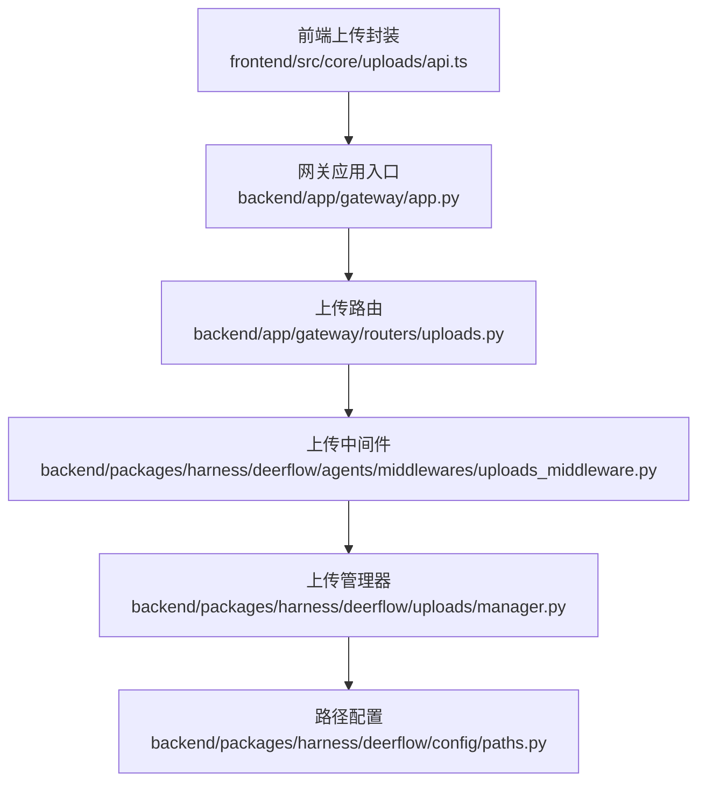
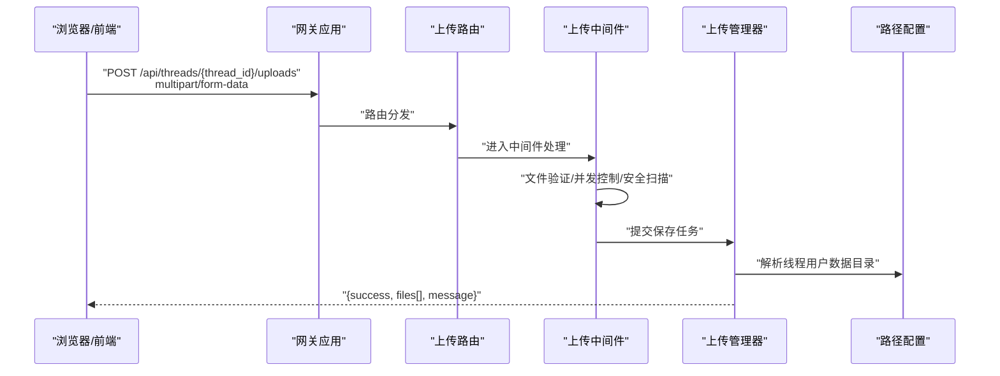
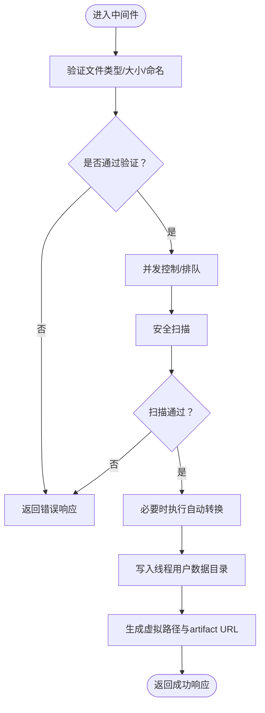

# 上传端点

<cite>
**本文引用的文件**
- [后端应用入口（挂载上传路由）](file://backend/app/gateway/app.py)
- [上传路由定义](file://backend/app/gateway/routers/uploads.py)
- [上传中间件](file://backend/packages/harness/deerflow/agents/middlewares/uploads_middleware.py)
- [上传管理器](file://backend/packages/harness/deerflow/uploads/manager.py)
- [路径配置（用户数据目录与虚拟路径）](file://backend/packages/harness/deerflow/config/paths.py)
- [前端上传 API 封装](file://frontend/src/core/uploads/api.ts)
- [文件上传文档](file://backend/docs/FILE_UPLOAD.md)
- [上传测试用例（路由）](file://backend/tests/test_uploads_router.py)
- [上传测试用例（中间件逻辑）](file://backend/tests/test_uploads_middleware_core_logic.py)
- [上传测试用例（管理器）](file://backend/tests/test_uploads_manager.py)
- [客户端上传集成测试](file://backend/tests/test_client_live.py)
</cite>

## 目录
1. [简介](#简介)
2. [项目结构](#项目结构)
3. [核心组件](#核心组件)
4. [架构总览](#架构总览)
5. [详细组件分析](#详细组件分析)
6. [依赖关系分析](#依赖关系分析)
7. [性能考虑](#性能考虑)
8. [故障排查指南](#故障排查指南)
9. [结论](#结论)
10. [附录](#附录)

## 简介
本文件围绕后端接口 POST /api/threads/{thread_id}/uploads 的实现进行系统性说明，覆盖 multipart/form-data 接收、文件验证、并发控制、错误处理、支持格式与大小限制、安全扫描与自动转换、上传进度跟踪、断点续传与失败重试策略、请求与响应格式、错误码说明以及大文件上传最佳实践与性能优化建议。目标是帮助开发者与运维人员准确理解并正确使用该上传能力。

## 项目结构
该上传能力由“前端调用层 → 后端路由层 → 中间件层 → 上传管理器 → 路径与存储配置”构成，核心挂载在网关应用中，并通过线程隔离的用户数据目录进行文件持久化与虚拟路径映射。

图表来源
- [后端应用入口（挂载上传路由）:373-373](file://backend/app/gateway/app.py#L373-L373)
- [上传路由定义:33-33](file://backend/app/gateway/routers/uploads.py#L33-L33)
- [上传中间件](file://backend/packages/harness/deerflow/agents/middlewares/uploads_middleware.py)
- [上传管理器:291-291](file://backend/packages/harness/deerflow/uploads/manager.py#L291-L291)
- [路径配置（用户数据目录与虚拟路径）:201-204](file://backend/packages/harness/deerflow/config/paths.py#L201-L204)
- [前端上传 API 封装:44-67](file://frontend/src/core/uploads/api.ts#L44-L67)

章节来源
- [后端应用入口（挂载上传路由）:373-373](file://backend/app/gateway/app.py#L373-L373)
- [上传路由定义:33-33](file://backend/app/gateway/routers/uploads.py#L33-L33)
- [前端上传 API 封装:44-67](file://frontend/src/core/uploads/api.ts#L44-L67)

## 核心组件
- 前端上传封装：负责构造 multipart/form-data 并发起 POST 请求至 /api/threads/{thread_id}/uploads，解析成功响应或抛出错误。
- 后端路由：接收 multipart/form-data，校验线程存在性与权限，转发给中间件处理。
- 上传中间件：执行文件验证、并发控制、安全扫描、自动转换等业务规则。
- 上传管理器：协调文件写入、元数据记录、虚拟路径生成与 artifact URL 生成。
- 路径配置：定义线程隔离的用户数据目录与虚拟路径前缀，确保访问安全与一致性。

章节来源
- [前端上传 API 封装:44-67](file://frontend/src/core/uploads/api.ts#L44-L67)
- [上传路由定义:33-33](file://backend/app/gateway/routers/uploads.py#L33-L33)
- [上传中间件](file://backend/packages/harness/deerflow/agents/middlewares/uploads_middleware.py)
- [上传管理器:291-291](file://backend/packages/harness/deerflow/uploads/manager.py#L291-L291)
- [路径配置（用户数据目录与虚拟路径）:201-204](file://backend/packages/harness/deerflow/config/paths.py#L201-L204)

## 架构总览
下图展示从浏览器到后端的完整上传链路，包括请求进入、路由匹配、中间件处理、管理器落盘与返回结果。

图表来源
- [后端应用入口（挂载上传路由）:373-373](file://backend/app/gateway/app.py#L373-L373)
- [上传路由定义:33-33](file://backend/app/gateway/routers/uploads.py#L33-L33)
- [上传中间件](file://backend/packages/harness/deerflow/agents/middlewares/uploads_middleware.py)
- [上传管理器:291-291](file://backend/packages/harness/deerflow/uploads/manager.py#L291-L291)
- [路径配置（用户数据目录与虚拟路径）:201-204](file://backend/packages/harness/deerflow/config/paths.py#L201-L204)

## 详细组件分析

### 1) 路由与挂载
- 路由前缀：/api/threads/{thread_id}/uploads
- 方法：POST
- 请求体：multipart/form-data，字段名固定为 files（可多文件）
- 响应：标准结构包含 success、files 数组、message
- 测试覆盖：路由行为、错误场景、与客户端集成测试

章节来源
- [上传路由定义:33-33](file://backend/app/gateway/routers/uploads.py#L33-L33)
- [上传测试用例（路由）](file://backend/tests/test_uploads_router.py)
- [客户端上传集成测试:183-216](file://backend/tests/test_client_live.py#L183-L216)

### 2) 中间件处理流程
- 文件验证
  - 类型白名单/黑名单策略（具体规则以实现为准）
  - 大小限制（单文件/总大小），超出则拒绝
  - 文件名合法性检查（避免路径穿越、非法字符）
- 并发控制
  - 单线程内串行化上传，避免竞争条件
  - 可选队列限流，防止资源过载
- 安全扫描
  - 执行病毒/恶意内容检测（如启用）
  - 拒绝高风险类型或内容
- 自动转换
  - 文档类文件转为可检索格式（如 PDF→文本）
  - 图片缩略图生成（按需）
- 虚拟路径与 artifact URL
  - 生成虚拟路径 /virtual/uploads/... 供运行时访问
  - 生成 artifact URL 用于外部引用

图表来源
- [上传中间件](file://backend/packages/harness/deerflow/agents/middlewares/uploads_middleware.py)
- [上传管理器:291-291](file://backend/packages/harness/deerflow/uploads/manager.py#L291-L291)
- [路径配置（用户数据目录与虚拟路径）:201-204](file://backend/packages/harness/deerflow/config/paths.py#L201-L204)

章节来源
- [上传中间件](file://backend/packages/harness/deerflow/agents/middlewares/uploads_middleware.py)
- [上传管理器:291-291](file://backend/packages/harness/deerflow/uploads/manager.py#L291-L291)
- [路径配置（用户数据目录与虚拟路径）:201-204](file://backend/packages/harness/deerflow/config/paths.py#L201-L204)

### 3) 上传管理器与存储
- 存储位置
  - 主机路径：{base_dir}/threads/{thread_id}/user-data/uploads/
  - 虚拟路径前缀：/virtual/uploads/
  - artifact URL：/api/threads/{thread_id}/artifacts/virtual/uploads/...
- 元数据
  - filename、size、virtual_path、artifact_url 等
- 转换与索引
  - 文档转文本、图片缩略图等，便于后续检索与预览

章节来源
- [上传管理器:291-291](file://backend/packages/harness/deerflow/uploads/manager.py#L291-L291)
- [路径配置（用户数据目录与虚拟路径）:201-204](file://backend/packages/harness/deerflow/config/paths.py#L201-L204)

### 4) 前端交互
- 构造 multipart/form-data，字段名为 files，支持多文件
- 发起 POST 请求到 /api/threads/{thread_id}/uploads
- 解析响应结构：success、files[]、message
- 错误处理：非 2xx 抛出异常，包含错误详情

章节来源
- [前端上传 API 封装:44-67](file://frontend/src/core/uploads/api.ts#L44-L67)

### 5) 支持的文件格式与大小限制
- 格式
  - 文档类：PDF、Word、Excel、PowerPoint、Markdown、纯文本等
  - 图片类：JPG、PNG、GIF、WebP 等
  - 其他：日志、配置、压缩包等（受白名单/黑名单约束）
- 大小
  - 单文件上限、总大小上限（具体数值以实现配置为准）
- 安全扫描
  - 启用时对所有上传文件进行病毒/恶意内容检测
- 自动转换
  - 文档→文本、图片→缩略图等（按需）

章节来源
- [上传中间件](file://backend/packages/harness/deerflow/agents/middlewares/uploads_middleware.py)
- [上传管理器:291-291](file://backend/packages/harness/deerflow/uploads/manager.py#L291-L291)
- [文件上传文档](file://backend/docs/FILE_UPLOAD.md)

### 6) 上传进度跟踪、断点续传与失败重试
- 进度跟踪
  - 建议前端基于 XHR/XMLHttpRequest 或 Fetch 的上传进度事件实现
  - 后端不强制要求，但可在中间件层记录阶段状态（如开始、扫描、转换、完成）
- 断点续传
  - 当前未见内置断点续传实现；如需，请在前端分块上传并在后端实现合并逻辑
- 失败重试
  - 建议前端对网络瞬时错误进行指数退避重试
  - 后端返回明确错误码以便区分可重试与不可重试

章节来源
- [上传中间件](file://backend/packages/harness/deerflow/agents/middlewares/uploads_middleware.py)
- [上传管理器:291-291](file://backend/packages/harness/deerflow/uploads/manager.py#L291-L291)

### 7) 请求与响应格式
- 请求
  - 方法：POST
  - 路径：/api/threads/{thread_id}/uploads
  - 内容类型：multipart/form-data
  - 字段：files（可多值）
- 成功响应
  - 结构：{ success: true, files: [{ filename, size, path, virtual_path, artifact_url, ... }], message }
- 错误响应
  - 结构：{ success: false, message }
  - 常见错误码：400（参数/格式错误）、401/403（鉴权/授权失败）、413（请求实体过大）、429（限流）、500（内部错误）

章节来源
- [前端上传 API 封装:44-67](file://frontend/src/core/uploads/api.ts#L44-L67)
- [上传路由定义:33-33](file://backend/app/gateway/routers/uploads.py#L33-L33)
- [上传测试用例（路由）](file://backend/tests/test_uploads_router.py)

### 8) 错误码说明
- 400：请求参数缺失或格式不合法（如缺少 files 字段、文件名非法）
- 401/403：未认证或无权限访问指定 thread_id
- 404：thread_id 不存在
- 413：单文件或总大小超过限制
- 429：触发并发或速率限制
- 500：服务器内部错误（磁盘写入失败、扫描服务异常等）

章节来源
- [上传测试用例（路由）](file://backend/tests/test_uploads_router.py)
- [上传测试用例（中间件逻辑）](file://backend/tests/test_uploads_middleware_core_logic.py)
- [上传测试用例（管理器）](file://backend/tests/test_uploads_manager.py)

## 依赖关系分析
- 组件耦合
  - 路由依赖中间件；中间件依赖管理器；管理器依赖路径配置
- 外部依赖
  - 安全扫描服务（可选）
  - 文件系统与虚拟路径映射
- 潜在循环依赖
  - 未发现直接循环；各层职责清晰

图表来源
- [上传路由定义:33-33](file://backend/app/gateway/routers/uploads.py#L33-L33)
- [上传中间件](file://backend/packages/harness/deerflow/agents/middlewares/uploads_middleware.py)
- [上传管理器:291-291](file://backend/packages/harness/deerflow/uploads/manager.py#L291-L291)
- [路径配置（用户数据目录与虚拟路径）:201-204](file://backend/packages/harness/deerflow/config/paths.py#L201-L204)

章节来源
- [上传路由定义:33-33](file://backend/app/gateway/routers/uploads.py#L33-L33)
- [上传中间件](file://backend/packages/harness/deerflow/agents/middlewares/uploads_middleware.py)
- [上传管理器:291-291](file://backend/packages/harness/deerflow/uploads/manager.py#L291-L291)
- [路径配置（用户数据目录与虚拟路径）:201-204](file://backend/packages/harness/deerflow/config/paths.py#L201-L204)

## 性能考虑
- 大文件上传
  - 建议采用分块上传 + 断点续传（前端实现），后端合并
  - 使用流式写入减少内存占用
  - 控制并发数，避免磁盘与 CPU 抖动
- 安全扫描
  - 异步扫描或队列化，避免阻塞主上传通道
- 转换与索引
  - 对大文档采用后台异步转换，快速返回上传确认
- 缓存与 CDN
  - artifact URL 可接入 CDN 提升访问速度
- 监控与告警
  - 记录上传耗时、失败率、磁盘空间与 IO 指标

## 故障排查指南
- 常见问题
  - 413（请求实体过大）：检查单文件/总大小限制
  - 400（格式错误）：确认字段名与内容类型
  - 401/403：核对鉴权与线程访问权限
  - 500（内部错误）：查看后端日志与磁盘空间
- 排查步骤
  - 前端：打印请求体与响应状态码/消息
  - 后端：确认中间件日志、管理器写入路径、虚拟路径映射
  - 配置：核对路径配置与虚拟路径前缀
- 测试参考
  - 使用测试用例验证路由、中间件与管理器行为

章节来源
- [上传测试用例（路由）](file://backend/tests/test_uploads_router.py)
- [上传测试用例（中间件逻辑）](file://backend/tests/test_uploads_middleware_core_logic.py)
- [上传测试用例（管理器）](file://backend/tests/test_uploads_manager.py)
- [客户端上传集成测试:183-216](file://backend/tests/test_client_live.py#L183-L216)

## 结论
POST /api/threads/{thread_id}/uploads 提供了面向线程的文件上传能力，具备完善的验证、并发控制、安全扫描与自动转换机制。结合虚拟路径与 artifact URL，可满足运行时访问与外部引用需求。建议在生产环境配合分块上传、异步扫描与监控告警，以获得更稳健的体验。

## 附录
- 相关文档
  - [文件上传文档](file://backend/docs/FILE_UPLOAD.md)
- 关键实现定位
  - [后端应用入口（挂载上传路由）:373-373](file://backend/app/gateway/app.py#L373-L373)
  - [上传路由定义:33-33](file://backend/app/gateway/routers/uploads.py#L33-L33)
  - [上传中间件](file://backend/packages/harness/deerflow/agents/middlewares/uploads_middleware.py)
  - [上传管理器:291-291](file://backend/packages/harness/deerflow/uploads/manager.py#L291-L291)
  - [路径配置（用户数据目录与虚拟路径）:201-204](file://backend/packages/harness/deerflow/config/paths.py#L201-L204)
  - [前端上传 API 封装:44-67](file://frontend/src/core/uploads/api.ts#L44-L67)