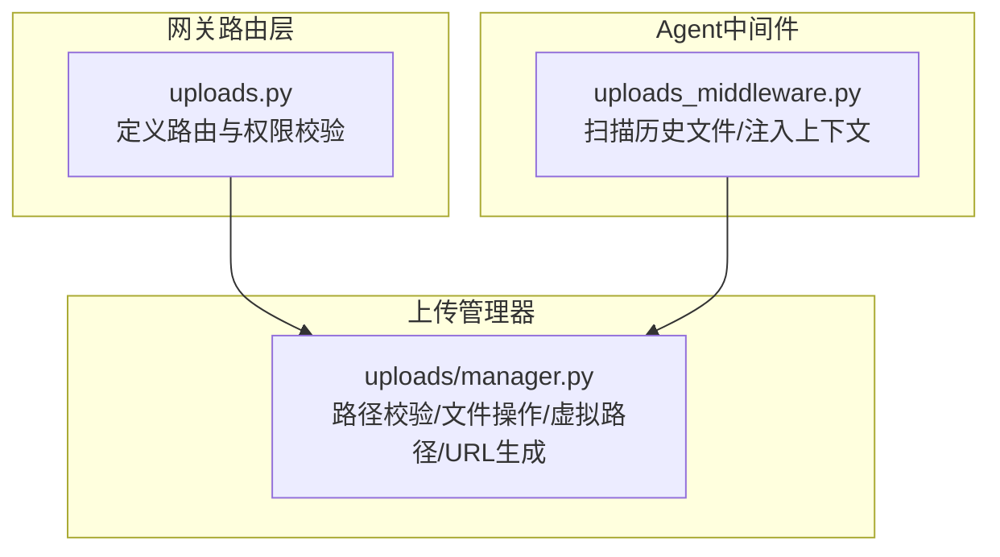
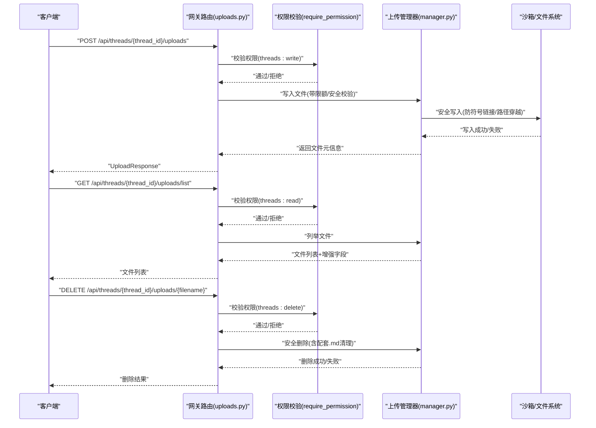
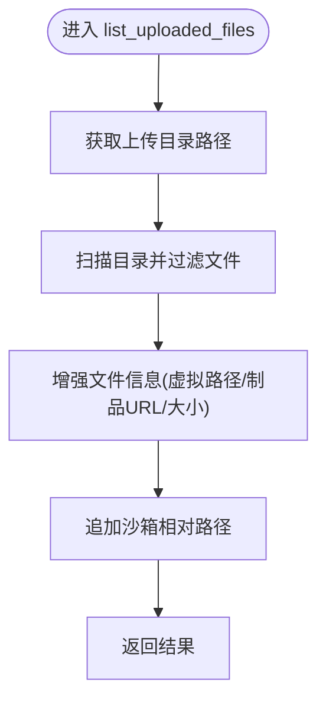
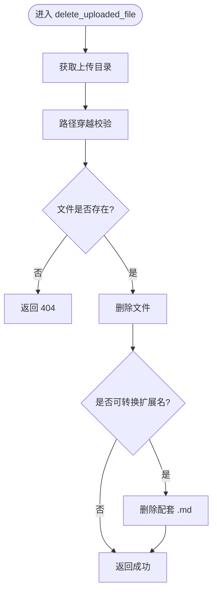

# 上传管理

<cite>
**本文引用的文件**
- [backend/app/gateway/routers/uploads.py](file://backend/app/gateway/routers/uploads.py)
- [backend/packages/harness/deerflow/uploads/manager.py](file://backend/packages/harness/deerflow/uploads/manager.py)
- [backend/packages/harness/deerflow/agents/middlewares/uploads_middleware.py](file://backend/packages/harness/deerflow/agents/middlewares/uploads_middleware.py)
- [backend/docs/FILE_UPLOAD.md](file://backend/docs/FILE_UPLOAD.md)
- [backend/docs/PATH_EXAMPLES.md](file://backend/docs/PATH_EXAMPLES.md)
- [backend/tests/test_uploads_router.py](file://backend/tests/test_uploads_router.py)
- [backend/tests/test_uploads_manager.py](file://backend/tests/test_uploads_manager.py)
- [backend/tests/test_uploads_middleware_core_logic.py](file://backend/tests/test_uploads_middleware_core_logic.py)
</cite>

## 目录
1. [简介](#简介)
2. [项目结构](#项目结构)
3. [核心组件](#核心组件)
4. [架构总览](#架构总览)
5. [详细组件分析](#详细组件分析)
6. [依赖关系分析](#依赖关系分析)
7. [性能考量](#性能考量)
8. [故障排查指南](#故障排查指南)
9. [结论](#结论)
10. [附录](#附录)

## 简介
本文件围绕“文件上传管理”主题，系统性梳理后端上传路由与上传管理器的实现，重点覆盖以下目标：
- 深入解释文件列表查询与删除操作的实现细节
- 详解 GET /api/threads/{thread_id}/uploads/list 的分页机制、过滤选项与排序功能
- 阐述 DELETE /api/threads/{thread_id}/uploads/{filename} 的安全校验、权限检查与数据清理流程
- 提供完整的管理操作示例与批量处理指南
- 说明文件存储策略、清理机制与存储配额管理

## 项目结构
上传管理由三层协作构成：
- 路由层（FastAPI）：负责请求接入、参数解析、权限校验与调用业务逻辑
- 上传管理器（纯业务逻辑）：提供路径校验、文件写入、列举、删除等核心能力
- 中间件（Agent侧上下文注入）：将上传文件信息注入到智能体执行上下文中

图表来源
- [backend/app/gateway/routers/uploads.py:1-372](file://backend/app/gateway/routers/uploads.py#L1-L372)
- [backend/packages/harness/deerflow/uploads/manager.py:1-311](file://backend/packages/harness/deerflow/uploads/manager.py#L1-L311)
- [backend/packages/harness/deerflow/agents/middlewares/uploads_middleware.py:1-310](file://backend/packages/harness/deerflow/agents/middlewares/uploads_middleware.py#L1-L310)

章节来源
- [backend/app/gateway/routers/uploads.py:1-372](file://backend/app/gateway/routers/uploads.py#L1-L372)
- [backend/packages/harness/deerflow/uploads/manager.py:1-311](file://backend/packages/harness/deerflow/uploads/manager.py#L1-L311)
- [backend/packages/harness/deerflow/agents/middlewares/uploads_middleware.py:1-310](file://backend/packages/harness/deerflow/agents/middlewares/uploads_middleware.py#L1-L310)

## 核心组件
- 上传路由（FastAPI）
  - 定义上传、列表、删除、限额查询等端点
  - 使用权限装饰器进行资源级权限校验
  - 调用上传管理器完成实际文件操作
- 上传管理器（纯业务逻辑）
  - 路径与文件名安全校验
  - 安全写入（防符号链接劫持）
  - 文件列举与结果增强（虚拟路径、制品URL）
  - 安全删除（路径穿越校验、配套文件清理）
- Agent上传中间件
  - 扫描线程历史上传文件，提取大纲/预览
  - 将文件清单注入到人类消息内容中，辅助智能体使用

章节来源
- [backend/app/gateway/routers/uploads.py:1-372](file://backend/app/gateway/routers/uploads.py#L1-L372)
- [backend/packages/harness/deerflow/uploads/manager.py:1-311](file://backend/packages/harness/deerflow/uploads/manager.py#L1-L311)
- [backend/packages/harness/deerflow/agents/middlewares/uploads_middleware.py:1-310](file://backend/packages/harness/deerflow/agents/middlewares/uploads_middleware.py#L1-L310)

## 架构总览
下图展示从客户端到后端服务的整体交互与职责划分。

图表来源
- [backend/app/gateway/routers/uploads.py:189-371](file://backend/app/gateway/routers/uploads.py#L189-L371)
- [backend/packages/harness/deerflow/uploads/manager.py:118-284](file://backend/packages/harness/deerflow/uploads/manager.py#L118-L284)

## 详细组件分析

### 1) 文件列表查询：GET /api/threads/{thread_id}/uploads/list
- 权限要求：threads.read，且需为拥有者或具备相应权限
- 处理流程
  - 解析 thread_id 并定位上传目录
  - 列举目录中的文件（仅文件，不递归目录）
  - 对结果进行增强：添加虚拟路径、制品URL、字符串化大小等
  - 追加沙箱相对路径字段，便于运行时访问
- 分页机制
  - 当前实现未提供分页参数；返回目录内全部文件
  - 若需分页，请在上层前端或代理层自行切片
- 过滤选项
  - 未内置过滤条件；可基于返回的扩展字段（如扩展名、修改时间）在客户端侧筛选
- 排序功能
  - 列举时按文件名排序（字典序）

图表来源
- [backend/app/gateway/routers/uploads.py:336-352](file://backend/app/gateway/routers/uploads.py#L336-L352)
- [backend/packages/harness/deerflow/uploads/manager.py:220-250](file://backend/packages/harness/deerflow/uploads/manager.py#L220-L250)
- [backend/packages/harness/deerflow/uploads/manager.py:300-310](file://backend/packages/harness/deerflow/uploads/manager.py#L300-L310)

章节来源
- [backend/app/gateway/routers/uploads.py:336-352](file://backend/app/gateway/routers/uploads.py#L336-L352)
- [backend/packages/harness/deerflow/uploads/manager.py:220-250](file://backend/packages/harness/deerflow/uploads/manager.py#L220-L250)
- [backend/packages/harness/deerflow/uploads/manager.py:300-310](file://backend/packages/harness/deerflow/uploads/manager.py#L300-L310)

### 2) 删除文件：DELETE /api/threads/{thread_id}/uploads/{filename}
- 权限要求：threads.delete，且文件必须存在
- 安全校验
  - 路径穿越检测：确保目标文件位于允许的基础目录内
  - 文件存在性校验：不存在则返回 404
- 数据清理
  - 删除主文件
  - 若主文件扩展名为可转换类型，则同时删除同名 .md 兄弟文件（如有）
- 错误处理
  - 非法路径：400
  - 未找到：404
  - 其他异常：500

图表来源
- [backend/app/gateway/routers/uploads.py:355-371](file://backend/app/gateway/routers/uploads.py#L355-L371)
- [backend/packages/harness/deerflow/uploads/manager.py:253-284](file://backend/packages/harness/deerflow/uploads/manager.py#L253-L284)

章节来源
- [backend/app/gateway/routers/uploads.py:355-371](file://backend/app/gateway/routers/uploads.py#L355-L371)
- [backend/packages/harness/deerflow/uploads/manager.py:253-284](file://backend/packages/harness/deerflow/uploads/manager.py#L253-L284)

### 3) 上传与配额限制
- 上传端点：POST /api/threads/{thread_id}/uploads
- 限额配置
  - 最大文件数：max_files
  - 单文件最大大小：max_file_size
  - 总上传大小上限：max_total_size
  - 支持从配置读取，若配置无效则回退到默认值
- 写入流程
  - 校验文件数量与限额
  - 安全写入：防符号链接、路径穿越、独占打开
  - 自动转换：当启用且文件可被转换时，生成配套 .md，并同步到沙箱
  - 权限调整：确保沙箱可读
- 清理机制
  - 请求过程中任一环节失败，会回滚已写入的文件

章节来源
- [backend/app/gateway/routers/uploads.py:108-129](file://backend/app/gateway/routers/uploads.py#L108-L129)
- [backend/app/gateway/routers/uploads.py:142-171](file://backend/app/gateway/routers/uploads.py#L142-L171)
- [backend/app/gateway/routers/uploads.py:189-322](file://backend/app/gateway/routers/uploads.py#L189-L322)
- [backend/packages/harness/deerflow/uploads/manager.py:118-217](file://backend/packages/harness/deerflow/uploads/manager.py#L118-L217)

### 4) Agent侧文件上下文注入
- 扫描历史文件：遍历上传目录，提取大纲或内容预览
- 注入规则：将文件清单前置到人类消息内容，保留原始附加字段
- 作用：帮助智能体理解可用文件、快速定位内容

章节来源
- [backend/packages/harness/deerflow/agents/middlewares/uploads_middleware.py:188-310](file://backend/packages/harness/deerflow/agents/middlewares/uploads_middleware.py#L188-L310)

## 依赖关系分析
- 路由层依赖上传管理器提供的安全写入、列举、删除等纯业务函数
- Agent中间件依赖上传目录结构与转换后的 .md 文件
- 三者之间耦合度低，职责清晰，便于测试与演进

图表来源
- [backend/app/gateway/routers/uploads.py:1-30](file://backend/app/gateway/routers/uploads.py#L1-L30)
- [backend/packages/harness/deerflow/agents/middlewares/uploads_middleware.py:1-17](file://backend/packages/harness/deerflow/agents/middlewares/uploads_middleware.py#L1-L17)

章节来源
- [backend/app/gateway/routers/uploads.py:1-30](file://backend/app/gateway/routers/uploads.py#L1-L30)
- [backend/packages/harness/deerflow/agents/middlewares/uploads_middleware.py:1-17](file://backend/packages/harness/deerflow/agents/middlewares/uploads_middleware.py#L1-L17)

## 性能考量
- 列表查询
  - 当前未分页，若单线程上传文件数量巨大，可能影响响应时间与内存占用
  - 建议在上层增加分页参数并在客户端分批加载
- 写入流程
  - 使用固定块大小进行流式写入，避免一次性加载大文件
  - 在沙箱非挂载模式下，写入完成后同步到沙箱，注意网络与IO开销
- 删除流程
  - 删除操作为O(1)，但若存在配套 .md 文件，额外一次删除为O(1)
- 权限与安全
  - 路径穿越与符号链接防护在写入阶段完成，减少后续运行时风险

## 故障排查指南
- 上传失败（413）
  - 可能原因：超过单文件大小或总大小限制
  - 处理建议：检查配置项与客户端上传大小
- 上传失败（500）
  - 可能原因：写入过程异常或清理失败
  - 处理建议：查看日志，确认磁盘空间与权限
- 删除失败（404）
  - 可能原因：文件不存在或已被清理
  - 处理建议：先调用列表接口确认文件状态
- 删除失败（400）
  - 可能原因：路径穿越或非法文件名
  - 处理建议：检查文件名与路径合法性
- 列表为空
  - 可能原因：线程无上传文件或目录尚未创建
  - 处理建议：先上传文件再查询

章节来源
- [backend/app/gateway/routers/uploads.py:108-129](file://backend/app/gateway/routers/uploads.py#L108-L129)
- [backend/app/gateway/routers/uploads.py:142-171](file://backend/app/gateway/routers/uploads.py#L142-L171)
- [backend/app/gateway/routers/uploads.py:355-371](file://backend/app/gateway/routers/uploads.py#L355-L371)

## 结论
- 上传管理以“安全优先”为核心：严格的路径穿越与符号链接防护、独占写入、权限位调整
- 列表查询简洁高效，但当前未提供分页与过滤；可在上层补充
- 删除操作具备完备的安全校验与配套清理，保障一致性
- Agent中间件增强了文件上下文注入，提升智能体使用体验

## 附录

### A. 端点一览与行为摘要
- GET /api/threads/{thread_id}/uploads/list
  - 权限：threads.read
  - 行为：列举文件并增强字段；未分页
- DELETE /api/threads/{thread_id}/uploads/{filename}
  - 权限：threads.delete
  - 行为：安全删除并清理配套 .md（如存在）

章节来源
- [backend/app/gateway/routers/uploads.py:336-352](file://backend/app/gateway/routers/uploads.py#L336-L352)
- [backend/app/gateway/routers/uploads.py:355-371](file://backend/app/gateway/routers/uploads.py#L355-L371)

### B. 存储策略与清理机制
- 存储位置
  - 通过路径解析器确定线程上传目录，结合用户上下文隔离不同用户的数据
- 清理机制
  - 删除主文件时，若扩展名为可转换类型，则删除配套 .md
  - 写入失败时，按逆序清理已创建的临时文件
- 配额管理
  - 通过配置项控制最大文件数、单文件大小与总大小
  - 写入过程中实时累计，超限时立即拒绝

章节来源
- [backend/packages/harness/deerflow/uploads/manager.py:253-284](file://backend/packages/harness/deerflow/uploads/manager.py#L253-L284)
- [backend/packages/harness/deerflow/uploads/manager.py:118-217](file://backend/packages/harness/deerflow/uploads/manager.py#L118-L217)
- [backend/app/gateway/routers/uploads.py:108-129](file://backend/app/gateway/routers/uploads.py#L108-L129)

### C. 管理操作示例与批量处理指南
- 示例参考
  - 上传与列表：见文档示例
  - 删除：调用删除端点后刷新列表
- 批量处理建议
  - 列表接口返回全部文件，可在客户端侧进行批量选择与删除
  - 注意：删除端点为单文件操作，批量删除需循环调用

章节来源
- [backend/docs/FILE_UPLOAD.md:275-315](file://backend/docs/FILE_UPLOAD.md#L275-L315)
- [backend/docs/PATH_EXAMPLES.md:194-267](file://backend/docs/PATH_EXAMPLES.md#L194-L267)

### D. 测试要点
- 上传路由测试
  - 验证覆盖：重复上传、替换行为、沙箱挂载模式下的写入
- 上传管理器测试
  - 路径穿越、符号链接、独占写入、列举与删除
- Agent中间件测试
  - 历史文件扫描、大纲提取、内容注入

章节来源
- [backend/tests/test_uploads_router.py:607-635](file://backend/tests/test_uploads_router.py#L607-L635)
- [backend/tests/test_uploads_manager.py](file://backend/tests/test_uploads_manager.py)
- [backend/tests/test_uploads_middleware_core_logic.py](file://backend/tests/test_uploads_middleware_core_logic.py)