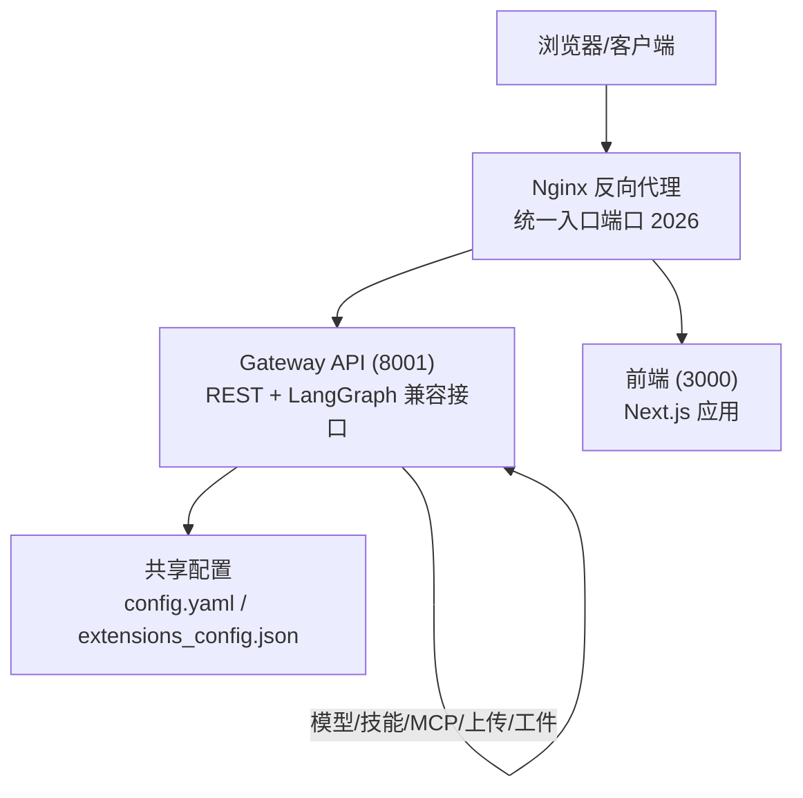
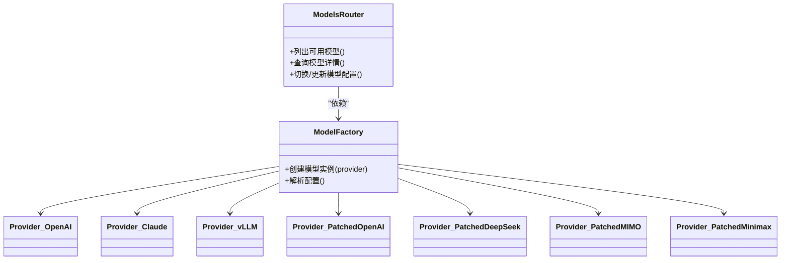
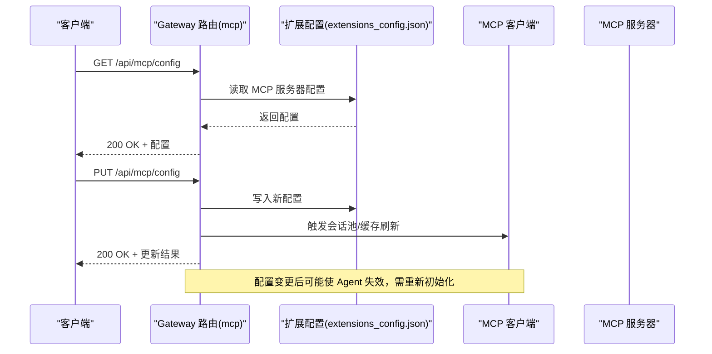
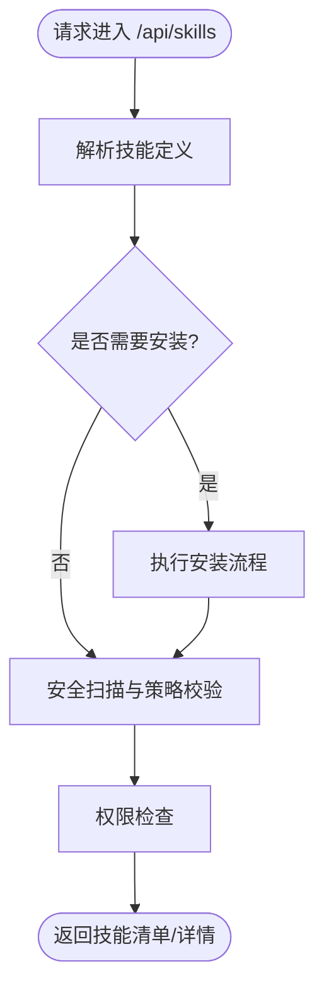
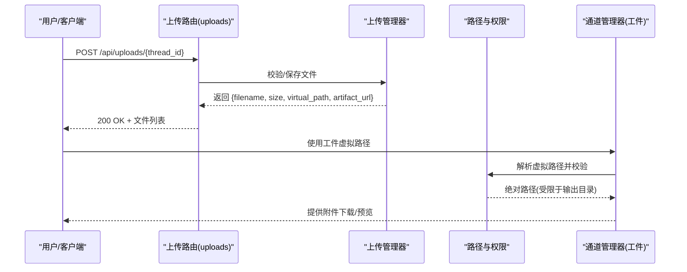
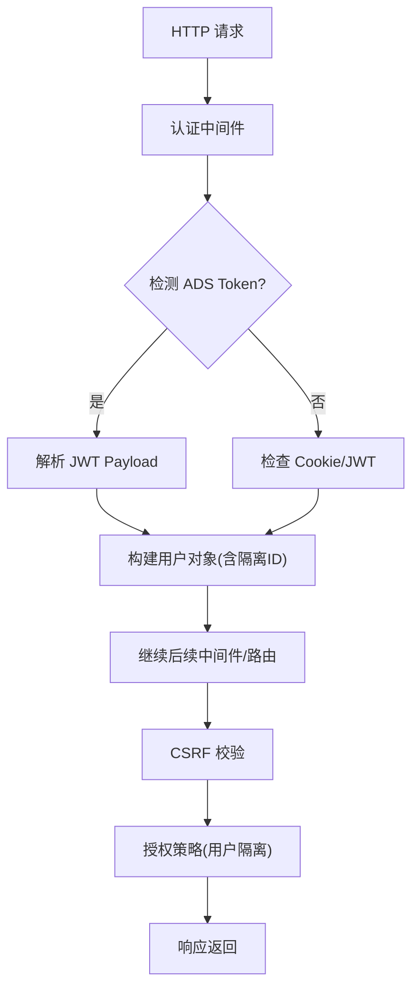
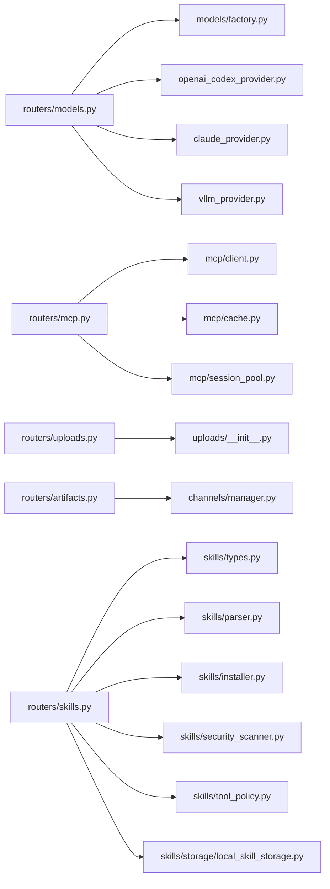

# 网关 API

<cite>
**本文引用的文件**
- [backend/app/gateway/app.py](file://backend/app/gateway/app.py)
- [backend/app/gateway/routers/models.py](file://backend/app/gateway/routers/models.py)
- [backend/app/gateway/routers/mcp.py](file://backend/app/gateway/routers/mcp.py)
- [backend/app/gateway/routers/skills.py](file://backend/app/gateway/routers/skills.py)
- [backend/app/gateway/routers/uploads.py](file://backend/app/gateway/routers/uploads.py)
- [backend/app/gateway/routers/artifacts.py](file://backend/app/gateway/routers/artifacts.py)
- [backend/app/gateway/auth_middleware.py](file://backend/app/gateway/auth_middleware.py)
- [backend/app/gateway/csrf_middleware.py](file://backend/app/gateway/csrf_middleware.py)
- [backend/app/gateway/auth/config.py](file://backend/app/gateway/auth/config.py)
- [backend/app/gateway/auth/models.py](file://backend/app/gateway/auth/models.py)
- [backend/app/gateway/auth/jwt.py](file://backend/app/gateway/auth/jwt.py)
- [backend/app/gateway/auth/providers.py](file://backend/app/gateway/auth/providers.py)
- [backend/app/gateway/auth/password.py](file://backend/app/gateway/auth/password.py)
- [backend/app/gateway/auth/credential_file.py](file://backend/app/gateway/auth/credential_file.py)
- [backend/app/gateway/auth/reset_admin.py](file://backend/app/gateway/auth/reset_admin.py)
- [backend/app/gateway/auth/errors.py](file://backend/app/gateway/auth/errors.py)
- [backend/app/gateway/auth/local_provider.py](file://backend/app/gateway/auth/local_provider.py)
- [backend/app/gateway/authz.py](file://backend/app/gateway/authz.py)
- [backend/app/gateway/deps.py](file://backend/app/gateway/deps.py)
- [backend/app/gateway/internal_auth.py](file://backend/app/gateway/internal_auth.py)
- [backend/app/gateway/langgraph_auth.py](file://backend/app/gateway/langgraph_auth.py)
- [backend/app/gateway/utils.py](file://backend/app/gateway/utils.py)
- [backend/docs/API.md](file://backend/docs/API.md)
- [backend/docs/AUTH_DESIGN.md](file://backend/docs/AUTH_DESIGN.md)
- [backend/docs/FILE_UPLOAD.md](file://backend/docs/FILE_UPLOAD.md)
- [backend/docs/MCP_SERVER.md](file://backend/docs/MCP_SERVER.md)
- [backend/packages/harness/deerflow/uploads/__init__.py](file://backend/packages/harness/deerflow/uploads/__init__.py)
- [backend/packages/harness/deerflow/mcp/client.py](file://backend/packages/harness/deerflow/mcp/client.py)
- [backend/packages/harness/deerflow/mcp/cache.py](file://backend/packages/harness/deerflow/mcp/cache.py)
- [backend/packages/harness/deerflow/mcp/oauth.py](file://backend/packages/harness/deerflow/mcp/oauth.py)
- [backend/packages/harness/deerflow/mcp/session_pool.py](file://backend/packages/harness/deerflow/mcp/session_pool.py)
- [backend/packages/harness/deerflow/mcp/tools.py](file://backend/packages/harness/deerflow/mcp/tools.py)
- [backend/packages/harness/deerflow/models/factory.py](file://backend/packages/harness/deerflow/models/factory.py)
- [backend/packages/harness/deerflow/models/openai_codex_provider.py](file://backend/packages/harness/deerflow/models/openai_codex_provider.py)
- [backend/packages/harness/deerflow/models/claude_provider.py](file://backend/packages/harness/deerflow/models/claude_provider.py)
- [backend/packages/harness/deerflow/models/vllm_provider.py](file://backend/packages/harness/deerflow/models/vllm_provider.py)
- [backend/packages/harness/deerflow/models/patched_openai.py](file://backend/packages/harness/deerflow/models/patched_openai.py)
- [backend/packages/harness/deerflow/models/patched_deepseek.py](file://backend/packages/harness/deerflow/models/patched_deepseek.py)
- [backend/packages/harness/deerflow/models/patched_mimo.py](file://backend/packages/harness/deerflow/models/patched_mimo.py)
- [backend/packages/harness/deerflow/models/patched_minimax.py](file://backend/packages/harness/deerflow/models/patched_minimax.py)
- [backend/packages/harness/deerflow/skills/types.py](file://backend/packages/harness/deerflow/skills/types.py)
- [backend/packages/harness/deerflow/skills/parser.py](file://backend/packages/harness/deerflow/skills/parser.py)
- [backend/packages/harness/deerflow/skills/installer.py](file://backend/packages/harness/deerflow/skills/installer.py)
- [backend/packages/harness/deerflow/skills/security_scanner.py](file://backend/packages/harness/deerflow/skills/security_scanner.py)
- [backend/packages/harness/deerflow/skills/tool_policy.py](file://backend/packages/harness/deerflow/skills/tool_policy.py)
- [backend/packages/harness/deerflow/skills/storage/local_skill_storage.py](file://backend/packages/harness/deerflow/skills/storage/local_skill_storage.py)
- [backend/app/channels/manager.py](file://backend/app/channels/manager.py)
- [backend/tests/test_client.py](file://backend/tests/test_client.py)
- [backend/tests/test_client_live.py](file://backend/tests/test_client_live.py)
- [frontend/src/content/zh/harness/mcp.mdx](file://frontend/src/content/zh/harness/mcp.mdx)
- [frontend/src/content/en/harness/mcp.mdx](file://frontend/src/content/en/harness/mcp.mdx)
</cite>

## 目录
1. [简介](#简介)
2. [项目结构](#项目结构)
3. [核心组件](#核心组件)
4. [架构总览](#架构总览)
5. [详细组件分析](#详细组件分析)
6. [依赖关系分析](#依赖关系分析)
7. [性能考量](#性能考量)
8. [故障排查指南](#故障排查指南)
9. [结论](#结论)
10. [附录](#附录)

## 简介
本文件为 DeerFlow Gateway API 的权威参考文档，覆盖以下核心资源与能力：
- Models：模型工厂与多提供商适配（含 OpenAI、Claude、vLLM、DeepSeek、MIMO、Minimax 等）
- MCP：Model Context Protocol 工具服务器集成与会话管理
- Skills：技能解析、安装、权限与安全扫描
- 文件上传与工件管理：上传、虚拟路径、附件解析与访问控制
- 认证与授权：JWT、本地/外部提供方、内部信任链、CSRF 保护与用户隔离
- API 版本与兼容性：基于扩展配置的运行时更新与向后兼容策略
- 最佳实践：安全、性能与可维护性建议

## 项目结构
Gateway API 基于 FastAPI 应用，路由按资源域划分，认证中间件与授权策略贯穿全局；前端通过 Next.js 提供交互界面，MCP 文档位于前端内容页。

```mermaid
graph TB
subgraph "网关应用"
APP["app.py<br/>应用入口与路由挂载"]
MW_AUTH["auth_middleware.py<br/>认证中间件"]
MW_CSRF["csrf_middleware.py<br/>CSRF 中间件"]
AUTHZ["authz.py<br/>授权策略"]
ROUTERS["routers/*<br/>资源路由模块"]
end
subgraph "认证子系统"
CFG["auth/config.py"]
MODELS["auth/models.py"]
JWT["auth/jwt.py"]
PROVIDERS["auth/providers.py"]
LOCAL["auth/local_provider.py"]
PASSWD["auth/password.py"]
CRED["auth/credential_file.py"]
RESET["auth/reset_admin.py"]
ERR["auth/errors.py"]
end
subgraph "扩展与运行时"
MCP_CLI["packages/harness/deerflow/mcp/client.py"]
MCP_CACHE["packages/harness/deerflow/mcp/cache.py"]
MCP_OAUTH["packages/harness/deerflow/mcp/oauth.py"]
MCP_POOL["packages/harness/deerflow/mcp/session_pool.py"]
MCP_TOOLS["packages/harness/deerflow/mcp/tools.py"]
UPLOADS_API["packages/harness/deerflow/uploads/__init__.py"]
MODELS_H["packages/harness/deerflow/models/*<br/>模型工厂与提供商"]
SKILLS["packages/harness/deerflow/skills/*<br/>技能解析/安装/权限"]
end
APP --> ROUTERS
APP --> MW_AUTH
APP --> MW_CSRF
APP --> AUTHZ
ROUTERS --> MODELS_H
ROUTERS --> MCP_CLI
ROUTERS --> UPLOADS_API
ROUTERS --> SKILLS
MW_AUTH --> MODELS
MW_AUTH --> JWT
MW_AUTH --> PROVIDERS
MW_AUTH --> LOCAL
MW_AUTH --> PASSWD
MW_AUTH --> CRED
MW_AUTH --> RESET
MW_AUTH --> ERR
```

图表来源
- [backend/app/gateway/app.py](file://backend/app/gateway/app.py)
- [backend/app/gateway/routers/models.py](file://backend/app/gateway/routers/models.py)
- [backend/app/gateway/routers/mcp.py](file://backend/app/gateway/routers/mcp.py)
- [backend/app/gateway/routers/skills.py](file://backend/app/gateway/routers/skills.py)
- [backend/app/gateway/routers/uploads.py](file://backend/app/gateway/routers/uploads.py)
- [backend/app/gateway/routers/artifacts.py](file://backend/app/gateway/routers/artifacts.py)
- [backend/app/gateway/auth_middleware.py](file://backend/app/gateway/auth_middleware.py)
- [backend/app/gateway/csrf_middleware.py](file://backend/app/gateway/csrf_middleware.py)
- [backend/app/gateway/authz.py](file://backend/app/gateway/authz.py)
- [backend/packages/harness/deerflow/mcp/client.py](file://backend/packages/harness/deerflow/mcp/client.py)
- [backend/packages/harness/deerflow/mcp/cache.py](file://backend/packages/harness/deerflow/mcp/cache.py)
- [backend/packages/harness/deerflow/mcp/oauth.py](file://backend/packages/harness/deerflow/mcp/oauth.py)
- [backend/packages/harness/deerflow/mcp/session_pool.py](file://backend/packages/harness/deerflow/mcp/session_pool.py)
- [backend/packages/harness/deerflow/mcp/tools.py](file://backend/packages/harness/deerflow/mcp/tools.py)
- [backend/packages/harness/deerflow/uploads/__init__.py](file://backend/packages/harness/deerflow/uploads/__init__.py)
- [backend/packages/harness/deerflow/models/factory.py](file://backend/packages/harness/deerflow/models/factory.py)

章节来源
- [backend/app/gateway/app.py](file://backend/app/gateway/app.py)
- [backend/docs/ARCHITECTURE.md](file://backend/docs/ARCHITECTURE.md)

## 核心组件
- 应用入口与路由挂载：集中注册各资源路由与中间件
- 认证中间件：支持 Cookie/JWT 与 ADS Token 自动识别，生成用户上下文
- CSRF 中间件：跨站请求伪造防护
- 授权策略：基于用户隔离与资源边界控制
- 扩展配置：MCP 服务器与技能配置独立于主配置，支持运行时热更新

章节来源
- [backend/app/gateway/app.py](file://backend/app/gateway/app.py)
- [backend/app/gateway/auth_middleware.py](file://backend/app/gateway/auth_middleware.py)
- [backend/app/gateway/csrf_middleware.py](file://backend/app/gateway/csrf_middleware.py)
- [backend/app/gateway/authz.py](file://backend/app/gateway/authz.py)

## 架构总览
下图展示客户端、反向代理、网关与前端的关系，以及网关内各子系统的职责分工。

图表来源
- [backend/docs/ARCHITECTURE.md](file://backend/docs/ARCHITECTURE.md)

## 详细组件分析

### Models（模型）
Models 路由负责模型工厂与多提供商适配，支持 OpenAI、Claude、vLLM、DeepSeek、MIMO、Minimax 等。模型选择与调用通过工厂与提供商抽象实现，具备版本化与可插拔特性。

- 关键要点
  - 工厂模式：根据配置选择具体提供商
  - 多提供商适配：统一对外接口，屏蔽底层差异
  - 版本与兼容：通过配置切换与回滚，保障向后兼容
  - 错误处理：提供统一的异常映射与降级策略

图表来源
- [backend/app/gateway/routers/models.py](file://backend/app/gateway/routers/models.py)
- [backend/packages/harness/deerflow/models/factory.py](file://backend/packages/harness/deerflow/models/factory.py)
- [backend/packages/harness/deerflow/models/openai_codex_provider.py](file://backend/packages/harness/deerflow/models/openai_codex_provider.py)
- [backend/packages/harness/deerflow/models/claude_provider.py](file://backend/packages/harness/deerflow/models/claude_provider.py)
- [backend/packages/harness/deerflow/models/vllm_provider.py](file://backend/packages/harness/deerflow/models/vllm_provider.py)
- [backend/packages/harness/deerflow/models/patched_openai.py](file://backend/packages/harness/deerflow/models/patched_openai.py)
- [backend/packages/harness/deerflow/models/patched_deepseek.py](file://backend/packages/harness/deerflow/models/patched_deepseek.py)
- [backend/packages/harness/deerflow/models/patched_mimo.py](file://backend/packages/harness/deerflow/models/patched_mimo.py)
- [backend/packages/harness/deerflow/models/patched_minimax.py](file://backend/packages/harness/deerflow/models/patched_minimax.py)

章节来源
- [backend/app/gateway/routers/models.py](file://backend/app/gateway/routers/models.py)
- [backend/packages/harness/deerflow/models/factory.py](file://backend/packages/harness/deerflow/models/factory.py)

### MCP（模型上下文协议）
MCP 路由用于管理 MCP 服务器配置与工具发现，支持运行时更新与会话池复用。前端内容页说明了 MCP 的作用与配置方式。

- 关键要点
  - 配置来源：extensions_config.json，独立于主配置
  - 支持类型：stdio、sse 等
  - 工具可用性：连接后与内置工具同等可见
  - 会话管理：会话池与缓存提升工具调用效率
  - OAuth：可选的 OAuth 流程集成

图表来源
- [backend/app/gateway/routers/mcp.py](file://backend/app/gateway/routers/mcp.py)
- [backend/packages/harness/deerflow/mcp/client.py](file://backend/packages/harness/deerflow/mcp/client.py)
- [backend/packages/harness/deerflow/mcp/cache.py](file://backend/packages/harness/deerflow/mcp/cache.py)
- [backend/packages/harness/deerflow/mcp/session_pool.py](file://backend/packages/harness/deerflow/mcp/session_pool.py)
- [backend/packages/harness/deerflow/mcp/oauth.py](file://backend/packages/harness/deerflow/mcp/oauth.py)
- [frontend/src/content/zh/harness/mcp.mdx](file://frontend/src/content/zh/harness/mcp.mdx)
- [frontend/src/content/en/harness/mcp.mdx](file://frontend/src/content/en/harness/mcp.mdx)

章节来源
- [backend/app/gateway/routers/mcp.py](file://backend/app/gateway/routers/mcp.py)
- [backend/packages/harness/deerflow/mcp/client.py](file://backend/packages/harness/deerflow/mcp/client.py)
- [backend/packages/harness/deerflow/mcp/cache.py](file://backend/packages/harness/deerflow/mcp/cache.py)
- [backend/packages/harness/deerflow/mcp/session_pool.py](file://backend/packages/harness/deerflow/mcp/session_pool.py)
- [backend/packages/harness/deerflow/mcp/oauth.py](file://backend/packages/harness/deerflow/mcp/oauth.py)
- [frontend/src/content/zh/harness/mcp.mdx](file://frontend/src/content/zh/harness/mcp.mdx)
- [frontend/src/content/en/harness/mcp.mdx](file://frontend/src/content/en/harness/mcp.mdx)

### Skills（技能）
Skills 路由负责技能的安装、解析、权限与安全扫描，支持公共与自定义技能仓库。

- 关键要点
  - 解析：从目录加载技能元数据与脚本
  - 安装：支持本地与远程技能安装
  - 权限：基于角色与策略的访问控制
  - 安全扫描：对技能进行安全评估与策略匹配
  - 类型与存储：统一的技能类型定义与本地存储

图表来源
- [backend/app/gateway/routers/skills.py](file://backend/app/gateway/routers/skills.py)
- [backend/packages/harness/deerflow/skills/parser.py](file://backend/packages/harness/deerflow/skills/parser.py)
- [backend/packages/harness/deerflow/skills/installer.py](file://backend/packages/harness/deerflow/skills/installer.py)
- [backend/packages/harness/deerflow/skills/security_scanner.py](file://backend/packages/harness/deerflow/skills/security_scanner.py)
- [backend/packages/harness/deerflow/skills/tool_policy.py](file://backend/packages/harness/deerflow/skills/tool_policy.py)
- [backend/packages/harness/deerflow/skills/types.py](file://backend/packages/harness/deerflow/skills/types.py)
- [backend/packages/harness/deerflow/skills/storage/local_skill_storage.py](file://backend/packages/harness/deerflow/skills/storage/local_skill_storage.py)

章节来源
- [backend/app/gateway/routers/skills.py](file://backend/app/gateway/routers/skills.py)
- [backend/packages/harness/deerflow/skills/parser.py](file://backend/packages/harness/deerflow/skills/parser.py)
- [backend/packages/harness/deerflow/skills/installer.py](file://backend/packages/harness/deerflow/skills/installer.py)
- [backend/packages/harness/deerflow/skills/security_scanner.py](file://backend/packages/harness/deerflow/skills/security_scanner.py)
- [backend/packages/harness/deerflow/skills/tool_policy.py](file://backend/packages/harness/deerflow/skills/tool_policy.py)
- [backend/packages/harness/deerflow/skills/types.py](file://backend/packages/harness/deerflow/skills/types.py)
- [backend/packages/harness/deerflow/skills/storage/local_skill_storage.py](file://backend/packages/harness/deerflow/skills/storage/local_skill_storage.py)

### 文件上传与工件（Uploads & Artifacts）
- 文件上传
  - 支持多文件上传，返回虚拟路径与可访问的工件 URL
  - 安全：路径规范化、唯一命名、线程隔离与沙箱输出目录限制
  - 生命周期：列表、删除、清理
- 工件管理
  - 将线程输出目录中的文件作为工件暴露
  - 附件解析：仅允许来自输出目录的安全路径，防止路径穿越

图表来源
- [backend/app/gateway/routers/uploads.py](file://backend/app/gateway/routers/uploads.py)
- [backend/app/gateway/routers/artifacts.py](file://backend/app/gateway/routers/artifacts.py)
- [backend/packages/harness/deerflow/uploads/__init__.py](file://backend/packages/harness/deerflow/uploads/__init__.py)
- [backend/app/channels/manager.py](file://backend/app/channels/manager.py)
- [backend/docs/FILE_UPLOAD.md](file://backend/docs/FILE_UPLOAD.md)

章节来源
- [backend/app/gateway/routers/uploads.py](file://backend/app/gateway/routers/uploads.py)
- [backend/app/gateway/routers/artifacts.py](file://backend/app/gateway/routers/artifacts.py)
- [backend/packages/harness/deerflow/uploads/__init__.py](file://backend/packages/harness/deerflow/uploads/__init__.py)
- [backend/app/channels/manager.py](file://backend/app/channels/manager.py)
- [backend/docs/FILE_UPLOAD.md](file://backend/docs/FILE_UPLOAD.md)
- [backend/tests/test_client_live.py](file://backend/tests/test_client_live.py)

### 认证与授权机制
- 认证中间件
  - 支持 Cookie/JWT 与 ADS Token 自动识别，生成用户上下文
  - 用户 ID 基于用户名派生，确保可重复且隔离
- 授权策略
  - 基于用户隔离的资源边界控制
  - 内部信任链与 LangGraph 认证桥接
- CSRF 保护
  - 专用中间件拦截跨站请求
- 密码与凭据
  - 本地提供方与凭据文件支持
  - 管理员重置流程

图表来源
- [backend/app/gateway/auth_middleware.py](file://backend/app/gateway/auth_middleware.py)
- [backend/app/gateway/csrf_middleware.py](file://backend/app/gateway/csrf_middleware.py)
- [backend/app/gateway/authz.py](file://backend/app/gateway/authz.py)
- [backend/app/gateway/internal_auth.py](file://backend/app/gateway/internal_auth.py)
- [backend/app/gateway/langgraph_auth.py](file://backend/app/gateway/langgraph_auth.py)
- [backend/app/gateway/auth/config.py](file://backend/app/gateway/auth/config.py)
- [backend/app/gateway/auth/models.py](file://backend/app/gateway/auth/models.py)
- [backend/app/gateway/auth/jwt.py](file://backend/app/gateway/auth/jwt.py)
- [backend/app/gateway/auth/providers.py](file://backend/app/gateway/auth/providers.py)
- [backend/app/gateway/auth/local_provider.py](file://backend/app/gateway/auth/local_provider.py)
- [backend/app/gateway/auth/password.py](file://backend/app/gateway/auth/password.py)
- [backend/app/gateway/auth/credential_file.py](file://backend/app/gateway/auth/credential_file.py)
- [backend/app/gateway/auth/reset_admin.py](file://backend/app/gateway/auth/reset_admin.py)
- [backend/app/gateway/auth/errors.py](file://backend/app/gateway/auth/errors.py)

章节来源
- [backend/app/gateway/auth_middleware.py](file://backend/app/gateway/auth_middleware.py)
- [backend/app/gateway/csrf_middleware.py](file://backend/app/gateway/csrf_middleware.py)
- [backend/app/gateway/authz.py](file://backend/app/gateway/authz.py)
- [backend/app/gateway/internal_auth.py](file://backend/app/gateway/internal_auth.py)
- [backend/app/gateway/langgraph_auth.py](file://backend/app/gateway/langgraph_auth.py)
- [backend/app/gateway/auth/config.py](file://backend/app/gateway/auth/config.py)
- [backend/app/gateway/auth/models.py](file://backend/app/gateway/auth/models.py)
- [backend/app/gateway/auth/jwt.py](file://backend/app/gateway/auth/jwt.py)
- [backend/app/gateway/auth/providers.py](file://backend/app/gateway/auth/providers.py)
- [backend/app/gateway/auth/local_provider.py](file://backend/app/gateway/auth/local_provider.py)
- [backend/app/gateway/auth/password.py](file://backend/app/gateway/auth/password.py)
- [backend/app/gateway/auth/credential_file.py](file://backend/app/gateway/auth/credential_file.py)
- [backend/app/gateway/auth/reset_admin.py](file://backend/app/gateway/auth/reset_admin.py)
- [backend/app/gateway/auth/errors.py](file://backend/app/gateway/auth/errors.py)

## 依赖关系分析
- 路由到服务层：各资源路由依赖对应的运行时包（模型、MCP、上传、技能）
- 认证与授权：贯穿所有路由，确保用户隔离与安全
- 配置解耦：MCP 与技能配置独立于主配置，便于运行时热更新

图表来源
- [backend/app/gateway/routers/models.py](file://backend/app/gateway/routers/models.py)
- [backend/app/gateway/routers/mcp.py](file://backend/app/gateway/routers/mcp.py)
- [backend/app/gateway/routers/skills.py](file://backend/app/gateway/routers/skills.py)
- [backend/app/gateway/routers/uploads.py](file://backend/app/gateway/routers/uploads.py)
- [backend/app/gateway/routers/artifacts.py](file://backend/app/gateway/routers/artifacts.py)
- [backend/packages/harness/deerflow/models/factory.py](file://backend/packages/harness/deerflow/models/factory.py)
- [backend/packages/harness/deerflow/mcp/client.py](file://backend/packages/harness/deerflow/mcp/client.py)
- [backend/packages/harness/deerflow/mcp/cache.py](file://backend/packages/harness/deerflow/mcp/cache.py)
- [backend/packages/harness/deerflow/mcp/session_pool.py](file://backend/packages/harness/deerflow/mcp/session_pool.py)
- [backend/packages/harness/deerflow/uploads/__init__.py](file://backend/packages/harness/deerflow/uploads/__init__.py)
- [backend/packages/harness/deerflow/skills/types.py](file://backend/packages/harness/deerflow/skills/types.py)
- [backend/packages/harness/deerflow/skills/parser.py](file://backend/packages/harness/deerflow/skills/parser.py)
- [backend/packages/harness/deerflow/skills/installer.py](file://backend/packages/harness/deerflow/skills/installer.py)
- [backend/packages/harness/deerflow/skills/security_scanner.py](file://backend/packages/harness/deerflow/skills/security_scanner.py)
- [backend/packages/harness/deerflow/skills/tool_policy.py](file://backend/packages/harness/deerflow/skills/tool_policy.py)
- [backend/packages/harness/deerflow/skills/storage/local_skill_storage.py](file://backend/packages/harness/deerflow/skills/storage/local_skill_storage.py)
- [backend/app/channels/manager.py](file://backend/app/channels/manager.py)

章节来源
- [backend/app/gateway/routers/models.py](file://backend/app/gateway/routers/models.py)
- [backend/app/gateway/routers/mcp.py](file://backend/app/gateway/routers/mcp.py)
- [backend/app/gateway/routers/skills.py](file://backend/app/gateway/routers/skills.py)
- [backend/app/gateway/routers/uploads.py](file://backend/app/gateway/routers/uploads.py)
- [backend/app/gateway/routers/artifacts.py](file://backend/app/gateway/routers/artifacts.py)

## 性能考量
- MCP 会话池与缓存：减少重复握手与初始化开销
- 上传与工件：虚拟路径与输出目录限制降低磁盘扫描成本
- 模型工厂：按需加载与配置缓存，避免频繁 IO
- CSRF 与鉴权：中间件短路失败请求，减少无效负载

## 故障排查指南
- 认证失败
  - 检查 Cookie/JWT 是否正确传递
  - ADS Token 是否过期或格式错误
- CSRF 拒绝
  - 确认请求携带正确的 CSRF 凭据
- 上传失败
  - 检查线程 ID 与上传目录权限
  - 确认未触发路径穿越防护
- MCP 更新后 Agent 失效
  - 配置变更会触发 Agent 重建，需重新初始化
- 技能安装/权限问题
  - 查看安全扫描与策略匹配日志

章节来源
- [backend/app/gateway/auth_middleware.py](file://backend/app/gateway/auth_middleware.py)
- [backend/app/gateway/csrf_middleware.py](file://backend/app/gateway/csrf_middleware.py)
- [backend/app/gateway/routers/uploads.py](file://backend/app/gateway/routers/uploads.py)
- [backend/app/gateway/routers/artifacts.py](file://backend/app/gateway/routers/artifacts.py)
- [backend/app/gateway/routers/mcp.py](file://backend/app/gateway/routers/mcp.py)
- [backend/app/gateway/routers/skills.py](file://backend/app/gateway/routers/skills.py)

## 结论
Gateway API 以清晰的分层与解耦设计，提供了模型、MCP、技能、上传与工件的完整能力集。通过认证中间件与授权策略实现用户隔离，结合 CSRF 保护与安全路径解析，确保在开放生态中保持稳健与可控。扩展配置的独立性与运行时更新能力，为系统演进与兼容性提供了坚实基础。

## 附录

### API 端点概览与规范

- 模型（Models）
  - 方法与路径
    - GET /api/models：列出可用模型
    - GET /api/models/{name}：查询模型详情
    - PUT /api/models：更新模型配置
  - 请求参数
    - 查询参数：无
    - 请求体：模型配置对象（字段依据具体提供商）
  - 响应格式
    - 成功：200 OK + 模型信息
    - 失败：4xx/5xx + 错误码与消息
  - 错误码
    - 400：配置非法
    - 401：未认证
    - 403：无权限
    - 404：模型不存在
    - 500：内部错误

- MCP（MCP）
  - 方法与路径
    - GET /api/mcp/config：获取 MCP 服务器配置
    - PUT /api/mcp/config：更新 MCP 服务器配置
  - 请求参数
    - 请求体：mcp_servers 映射（键为服务器名，值为配置对象）
  - 响应格式
    - 成功：200 OK + 新配置
    - 失败：4xx/5xx + 错误码与消息
  - 错误码
    - 400：配置非法
    - 401：未认证
    - 403：无权限
    - 500：内部错误

- 技能（Skills）
  - 方法与路径
    - GET /api/skills：列出技能
    - GET /api/skills/{name}：获取技能详情
    - POST /api/skills：安装技能
    - DELETE /api/skills/{name}：卸载技能
  - 请求参数
    - 查询参数：无
    - 请求体：安装/更新参数（如来源、版本等）
  - 响应格式
    - 成功：200 OK + 技能信息
    - 失败：4xx/5xx + 错误码与消息
  - 错误码
    - 400：参数非法
    - 401：未认证
    - 403：无权限
    - 404：技能不存在
    - 500：内部错误

- 文件上传（Uploads）
  - 方法与路径
    - POST /api/uploads/{thread_id}：上传文件
    - GET /api/uploads/{thread_id}：列出已上传文件
    - DELETE /api/uploads/{thread_id}/{filename}：删除指定文件
  - 请求参数
    - 路径参数：thread_id
    - 表单：multipart/form-data，字段为 file[]
  - 响应格式
    - 成功：200 OK + 文件列表（包含 filename、size、virtual_path、artifact_url）
    - 失败：4xx/5xx + 错误码与消息
  - 错误码
    - 400：文件非法/路径穿越
    - 401：未认证
    - 403：无权限
    - 404：线程不存在
    - 500：内部错误

- 工件（Artifacts）
  - 方法与路径
    - GET /api/artifacts/{thread_id}：列出工件
    - GET /api/artifacts/{thread_id}/attachments：解析附件（受控路径）
  - 请求参数
    - 路径参数：thread_id
    - 查询参数：可选过滤条件（如类型、时间范围）
  - 响应格式
    - 成功：200 OK + 工件列表（包含虚拟路径与 MIME 类型）
    - 失败：4xx/5xx + 错误码与消息
  - 错误码
    - 400：路径非法
    - 401：未认证
    - 403：无权限
    - 404：线程不存在
    - 500：内部错误

- 认证与授权
  - 认证方式
    - Cookie/JWT：标准认证
    - ADS Token：自动识别与解析
  - CSRF 保护
    - 中间件拦截跨站请求
  - 用户隔离
    - 基于用户 ID 的资源边界控制
  - 管理员重置
    - 通过专用流程重置管理员凭据

章节来源
- [backend/app/gateway/routers/models.py](file://backend/app/gateway/routers/models.py)
- [backend/app/gateway/routers/mcp.py](file://backend/app/gateway/routers/mcp.py)
- [backend/app/gateway/routers/skills.py](file://backend/app/gateway/routers/skills.py)
- [backend/app/gateway/routers/uploads.py](file://backend/app/gateway/routers/uploads.py)
- [backend/app/gateway/routers/artifacts.py](file://backend/app/gateway/routers/artifacts.py)
- [backend/app/gateway/auth_middleware.py](file://backend/app/gateway/auth_middleware.py)
- [backend/app/gateway/csrf_middleware.py](file://backend/app/gateway/csrf_middleware.py)
- [backend/app/gateway/authz.py](file://backend/app/gateway/authz.py)
- [backend/docs/API.md](file://backend/docs/API.md)
- [backend/docs/AUTH_DESIGN.md](file://backend/docs/AUTH_DESIGN.md)
- [backend/docs/FILE_UPLOAD.md](file://backend/docs/FILE_UPLOAD.md)
- [backend/docs/MCP_SERVER.md](file://backend/docs/MCP_SERVER.md)

### JSON Schema 与字段说明（示例）

- 模型配置对象（示例字段）
  - name：字符串，模型标识
  - provider：字符串，提供商名称
  - endpoint：字符串，服务地址
  - credentials：对象，凭据信息
  - params：对象，调用参数
- MCP 服务器配置对象（示例字段）
  - enabled：布尔，是否启用
  - type：字符串，连接类型（如 stdio、sse）
  - url：字符串，服务器地址
  - headers：对象，请求头
  - command/args/env：进程启动参数（当 type=stdio 时）
- 技能对象（示例字段）
  - name：字符串，技能名称
  - description：字符串，描述
  - category：枚举，分类（public/custom）
  - license：字符串，许可证
  - enabled：布尔，是否启用
- 上传响应对象（示例字段）
  - filename：字符串，原始文件名
  - size：整数，字节数
  - virtual_path：字符串，虚拟路径
  - artifact_url：字符串，可访问 URL
- 工件对象（示例字段）
  - virtual_path：字符串，虚拟路径
  - actual_path：字符串，实际路径
  - mime_type：字符串，MIME 类型
  - size：整数，字节数

章节来源
- [backend/tests/test_client.py](file://backend/tests/test_client.py)
- [backend/tests/test_client_live.py](file://backend/tests/test_client_live.py)