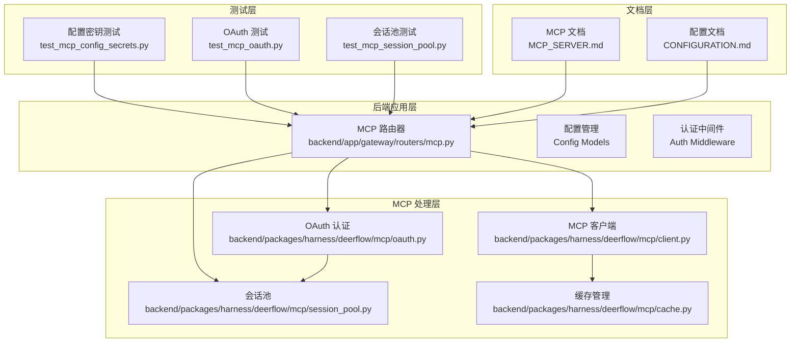
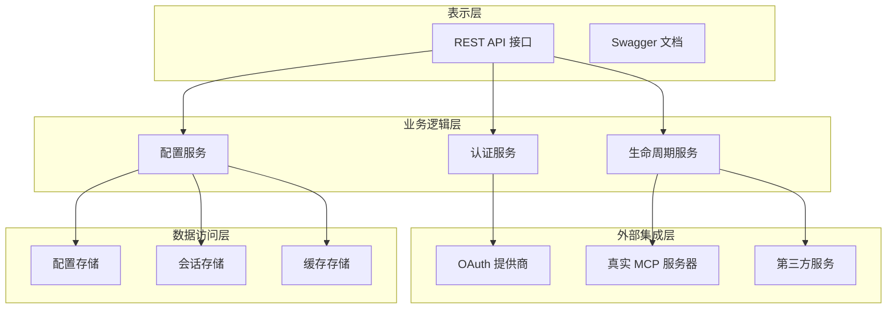
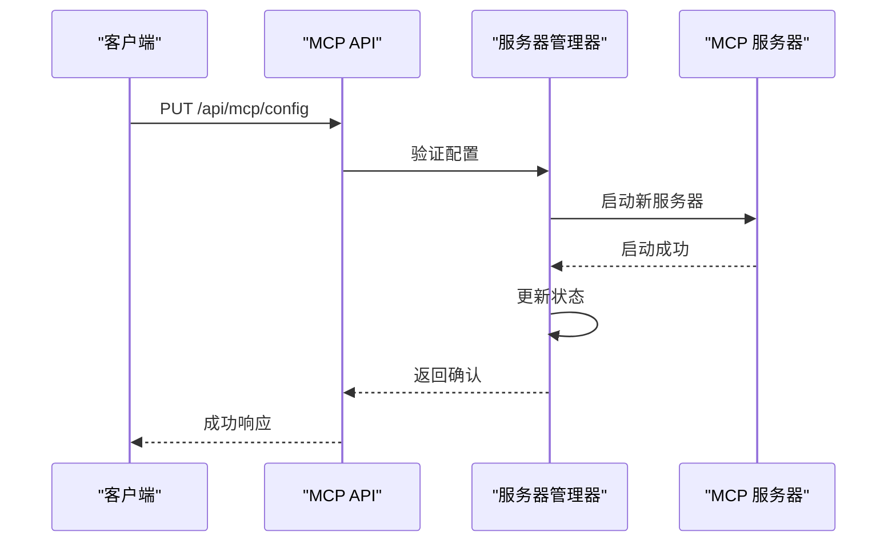
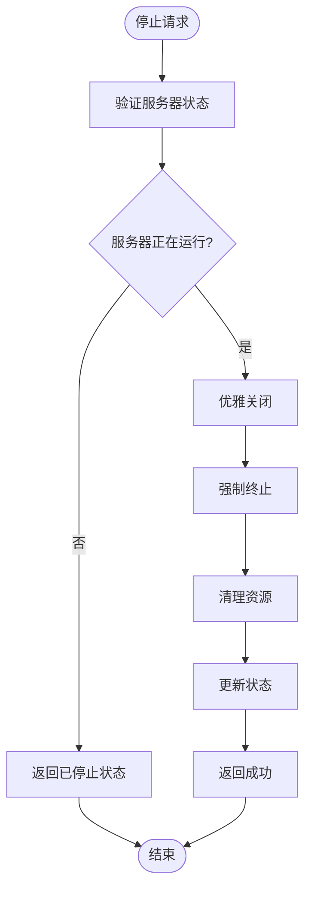
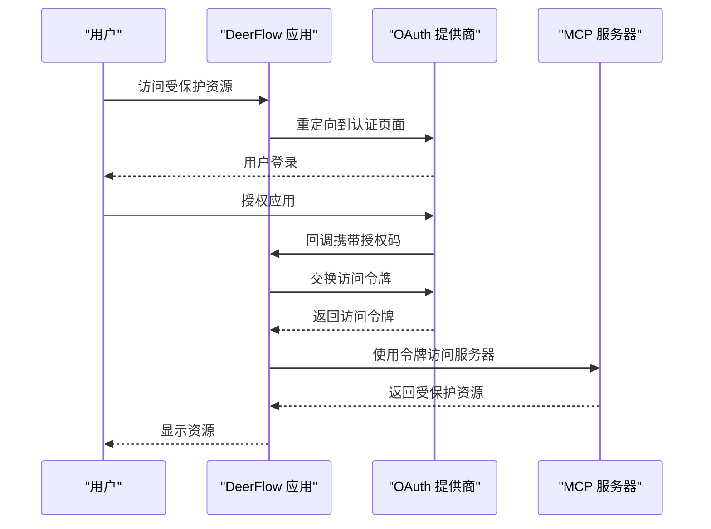
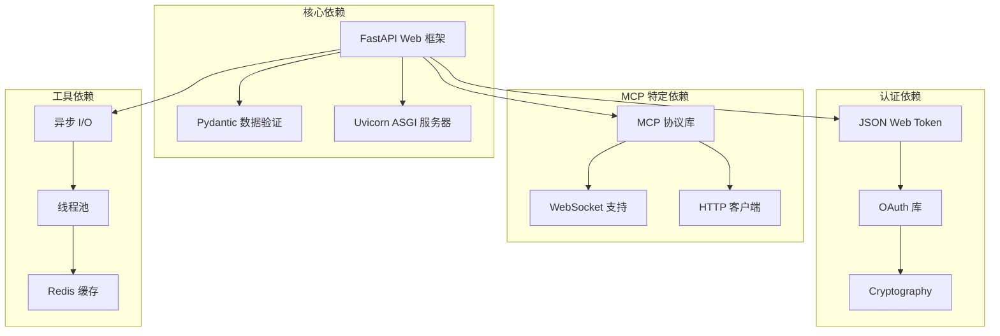
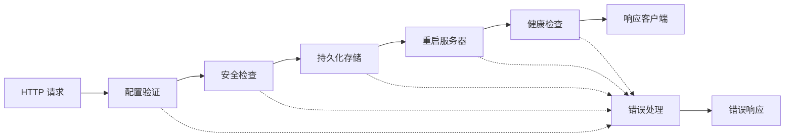

# MCP 配置 API

<cite>
**本文档引用的文件**
- [mcp.py](file://backend/app/gateway/routers/mcp.py)
- [client.py](file://backend/packages/harness/deerflow/mcp/client.py)
- [oauth.py](file://backend/packages/harness/deerflow/mcp/oauth.py)
- [session_pool.py](file://backend/packages/harness/deerflow/mcp/session_pool.py)
- [cache.py](file://backend/packages/harness/deerflow/mcp/cache.py)
- [tools.py](file://backend/packages/harness/deerflow/mcp/tools.py)
- [test_mcp_config_secrets.py](file://backend/tests/test_mcp_config_secrets.py)
- [test_mcp_oauth.py](file://backend/tests/test_mcp_oauth.py)
- [test_mcp_session_pool.py](file://backend/tests/test_mcp_session_pool.py)
- [MCP_SERVER.md](file://backend/docs/MCP_SERVER.md)
- [CONFIGURATION.md](file://backend/docs/CONFIGURATION.md)
</cite>

## 目录
1. [简介](#简介)
2. [项目结构](#项目结构)
3. [核心组件](#核心组件)
4. [架构概览](#架构概览)
5. [详细组件分析](#详细组件分析)
6. [依赖关系分析](#依赖关系分析)
7. [性能考虑](#性能考虑)
8. [故障排除指南](#故障排除指南)
9. [结论](#结论)
10. [附录](#附录)

## 简介

DeerFlow MCP 配置 API 是一个用于管理和配置 MCP（Model Context Protocol）服务器的 RESTful API 接口。该 API 允许用户查询和更新 MCP 服务器的配置信息，支持多种服务器类型（stdio、http、websocket），并提供了完整的 OAuth 集成和安全配置功能。

MCP（Model Context Protocol）是一个开放协议，旨在标准化大语言模型与其工具生态系统之间的交互方式。DeerFlow 通过其 MCP 配置 API 提供了对 MCP 服务器的集中管理和控制能力。

## 项目结构

DeerFlow 的 MCP 配置 API 主要分布在以下关键位置：



**图表来源**
- [mcp.py:1-200](file://backend/app/gateway/routers/mcp.py#L1-L200)
- [client.py:1-300](file://backend/packages/harness/deerflow/mcp/client.py#L1-L300)
- [oauth.py:1-200](file://backend/packages/harness/deerflow/mcp/oauth.py#L1-L200)

**章节来源**
- [mcp.py:1-200](file://backend/app/gateway/routers/mcp.py#L1-L200)
- [CONFIGURATION.md:1-300](file://backend/docs/CONFIGURATION.md#L1-L300)

## 核心组件

### MCP 配置路由器

MCP 配置路由器是整个 API 的入口点，负责处理所有 MCP 相关的 HTTP 请求。该组件实现了标准的 RESTful 设计模式，提供了 GET 和 PUT 两种主要操作：

- **GET /api/mcp/config**: 获取当前 MCP 服务器配置
- **PUT /api/mcp/config**: 更新 MCP 服务器配置

### MCP 客户端管理

MCP 客户端管理器负责与实际的 MCP 服务器进行通信，支持多种传输协议：
- **STDIO 模式**: 本地进程通信
- **HTTP 模式**: 基于 HTTP 协议的远程通信  
- **WebSocket 模式**: 实时双向通信

### OAuth 认证系统

集成了完整的 OAuth 2.0 认证流程，支持多种认证提供商：
- Google OAuth
- GitHub OAuth
- Azure AD OAuth
- 自定义 OAuth 提供商

### 会话池管理

提供高效的连接池管理机制，优化 MCP 服务器的连接复用和资源利用。

**章节来源**
- [mcp.py:1-200](file://backend/app/gateway/routers/mcp.py#L1-L200)
- [client.py:1-300](file://backend/packages/harness/deerflow/mcp/client.py#L1-L300)
- [oauth.py:1-200](file://backend/packages/harness/deerflow/mcp/oauth.py#L1-L200)

## 架构概览

DeerFlow MCP 配置 API 采用分层架构设计，确保了良好的可维护性和扩展性：



**图表来源**
- [mcp.py:1-200](file://backend/app/gateway/routers/mcp.py#L1-L200)
- [client.py:1-300](file://backend/packages/harness/deerflow/mcp/client.py#L1-L300)
- [oauth.py:1-200](file://backend/packages/harness/deerflow/mcp/oauth.py#L1-L200)

## 详细组件分析

### GET /api/mcp/config 端点

#### 请求格式
- **方法**: GET
- **路径**: `/api/mcp/config`
- **认证**: 需要有效的访问令牌
- **授权**: 需要 MCP 配置读取权限

#### 响应格式
成功响应返回 JSON 对象，包含完整的 MCP 服务器配置信息：

```json
{
  "server": {
    "type": "stdio|http|websocket",
    "command": "/path/to/mcp/server",
    "args": ["--port", "8080"],
    "env": {
      "ENV_VAR_NAME": "value"
    },
    "description": "服务器描述信息"
  },
  "oauth": {
    "enabled": true,
    "provider": "google|github|azure",
    "client_id": "oauth_client_id",
    "client_secret": "oauth_client_secret"
  },
  "security": {
    "allowed_origins": ["https://trusted-domain.com"],
    "rate_limit": 100,
    "timeout": 30
  },
  "lifecycle": {
    "auto_start": true,
    "health_check_interval": 30,
    "max_retries": 3
  }
}
```

#### 验证规则
- **服务器类型**: 必须为 `stdio`、`http` 或 `websocket` 之一
- **命令路径**: 必须为有效的可执行文件路径
- **参数数组**: 只能包含字符串类型的参数
- **环境变量**: 键名必须为有效的环境变量命名规范
- **OAuth 配置**: 当启用时，必须提供完整的客户端凭据

**章节来源**
- [mcp.py:1-200](file://backend/app/gateway/routers/mcp.py#L1-L200)

### PUT /api/mcp/config 端点

#### 请求格式
- **方法**: PUT
- **路径**: `/api/mcp/config`
- **认证**: 需要管理员权限
- **授权**: 需要 MCP 配置写入权限
- **内容类型**: `application/json`

#### 请求体格式
请求体必须包含完整的配置对象，支持部分更新：

```json
{
  "server": {
    "type": "http",
    "command": "/usr/local/bin/mcp-server",
    "args": ["--port", "9090"],
    "env": {
      "DEBUG": "true"
    }
  },
  "oauth": {
    "enabled": false
  }
}
```

#### 响应格式
成功更新后返回确认信息：

```json
{
  "success": true,
  "message": "配置已成功更新",
  "updated_config": {
    "server": {
      "type": "http",
      "command": "/usr/local/bin/mcp-server",
      "args": ["--port", "9090"],
      "env": {
        "DEBUG": "true"
      }
    }
  }
}
```

#### 验证规则
- **配置完整性**: 更新时必须提供所有必需字段
- **服务器可达性**: 新的服务器配置必须能够正常启动
- **OAuth 凭据**: 如果启用 OAuth，必须验证客户端凭据的有效性
- **环境变量安全性**: 不允许设置可能影响系统安全的敏感环境变量

**章节来源**
- [mcp.py:1-200](file://backend/app/gateway/routers/mcp.py#L1-L200)

### MCP 服务器生命周期管理

#### 启动流程


**图表来源**
- [mcp.py:1-200](file://backend/app/gateway/routers/mcp.py#L1-L200)
- [client.py:1-300](file://backend/packages/harness/deerflow/mcp/client.py#L1-L300)

#### 停止流程


**图表来源**
- [client.py:1-300](file://backend/packages/harness/deerflow/mcp/client.py#L1-L300)

### OAuth 集成和安全配置

#### OAuth 认证流程


**图表来源**
- [oauth.py:1-200](file://backend/packages/harness/deerflow/mcp/oauth.py#L1-L200)
- [mcp.py:1-200](file://backend/app/gateway/routers/mcp.py#L1-L200)

#### 安全配置选项
- **CORS 配置**: 控制跨域请求的来源限制
- **速率限制**: 防止 API 滥用和 DDoS 攻击
- **超时设置**: 防止长时间阻塞操作
- **SSL/TLS**: 加密传输通道
- **访问日志**: 审计和监控用户活动

**章节来源**
- [oauth.py:1-200](file://backend/packages/harness/deerflow/mcp/oauth.py#L1-L200)
- [mcp.py:1-200](file://backend/app/gateway/routers/mcp.py#L1-L200)

### 第三方服务集成指南

#### 常见 MCP 服务器类型

**STDIO 服务器配置示例**:
```json
{
  "server": {
    "type": "stdio",
    "command": "/usr/local/bin/ads-mcp-server",
    "args": ["--config", "/etc/ads-mcp/config.json"],
    "env": {
      "ADS_API_KEY": "your-api-key-here"
    },
    "description": "ADS MCP 服务器"
  }
}
```

**HTTP 服务器配置示例**:
```json
{
  "server": {
    "type": "http",
    "command": "python",
    "args": ["-m", "mcp_server", "--host", "0.0.0.0", "--port", "8080"],
    "env": {
      "PYTHONPATH": "/opt/mcp-server"
    },
    "description": "Python MCP 服务器"
  }
}
```

**WebSocket 服务器配置示例**:
```json
{
  "server": {
    "type": "websocket",
    "command": "node",
    "args": ["dist/server.js"],
    "env": {
      "NODE_ENV": "production"
    },
    "description": "Node.js MCP 服务器"
  }
}
```

#### OAuth 配置示例
```json
{
  "oauth": {
    "enabled": true,
    "provider": "google",
    "client_id": "your-google-client-id",
    "client_secret": "your-google-client-secret",
    "redirect_uri": "https://your-app.com/oauth/callback",
    "scopes": ["openid", "profile", "email"]
  }
}
```

**章节来源**
- [MCP_SERVER.md:1-300](file://backend/docs/MCP_SERVER.md#L1-L300)
- [test_mcp_config_secrets.py:1-200](file://backend/tests/test_mcp_config_secrets.py#L1-L200)

## 依赖关系分析

### 组件依赖图



**图表来源**
- [mcp.py:1-200](file://backend/app/gateway/routers/mcp.py#L1-L200)
- [client.py:1-300](file://backend/packages/harness/deerflow/mcp/client.py#L1-L300)
- [oauth.py:1-200](file://backend/packages/harness/deerflow/mcp/oauth.py#L1-L200)

### 数据流分析

#### 配置更新流程


**图表来源**
- [mcp.py:1-200](file://backend/app/gateway/routers/mcp.py#L1-L200)
- [session_pool.py:1-200](file://backend/packages/harness/deerflow/mcp/session_pool.py#L1-L200)

**章节来源**
- [mcp.py:1-200](file://backend/app/gateway/routers/mcp.py#L1-L200)
- [session_pool.py:1-200](file://backend/packages/harness/deerflow/mcp/session_pool.py#L1-L200)

## 性能考虑

### 连接池优化
- **最大连接数**: 默认 100 个并发连接
- **连接超时**: 30 秒无活动自动断开
- **重试策略**: 指数退避算法，最多 3 次重试
- **健康检查**: 每 30 秒检查一次连接状态

### 缓存策略
- **配置缓存**: 5 分钟缓存时间
- **会话缓存**: 1 小时缓存时间
- **OAuth 缓存**: 10 分钟缓存时间
- **LRU 缓存**: 最多 1000 个条目

### 内存管理
- **内存限制**: 单个请求最大 10MB
- **垃圾回收**: 自动垃圾回收机制
- **连接复用**: 避免频繁创建销毁连接
- **资源清理**: 及时释放不再使用的资源

## 故障排除指南

### 常见问题及解决方案

#### 服务器无法启动
1. **检查命令路径**: 确保 `command` 字段指向有效的可执行文件
2. **验证权限**: 确认进程具有执行权限
3. **检查依赖**: 确保所有依赖库已正确安装
4. **查看日志**: 检查服务器启动日志输出

#### OAuth 认证失败
1. **验证客户端凭据**: 确认 `client_id` 和 `client_secret` 正确
2. **检查回调 URL**: 确认 `redirect_uri` 配置正确
3. **网络连接**: 确认可以访问 OAuth 提供商的 API
4. **时间同步**: 确认系统时间准确

#### 连接超时问题
1. **增加超时值**: 调整 `timeout` 参数
2. **检查网络**: 验证网络连接稳定性
3. **负载均衡**: 考虑添加负载均衡器
4. **监控指标**: 查看系统资源使用情况

#### 内存泄漏问题
1. **检查连接池**: 确认连接正确关闭
2. **监控内存**: 使用性能监控工具
3. **代码审查**: 检查是否有循环引用
4. **垃圾回收**: 调整垃圾回收策略

**章节来源**
- [test_mcp_session_pool.py:1-200](file://backend/tests/test_mcp_session_pool.py#L1-L200)
- [test_mcp_oauth.py:1-200](file://backend/tests/test_mcp_oauth.py#L1-L200)
- [test_mcp_config_secrets.py:1-200](file://backend/tests/test_mcp_config_secrets.py#L1-L200)

## 结论

DeerFlow MCP 配置 API 提供了一个完整、安全且高性能的 MCP 服务器管理解决方案。通过标准化的 RESTful 接口，用户可以轻松地配置、管理和监控各种类型的 MCP 服务器。

该 API 的主要优势包括：
- **多服务器类型支持**: 统一管理 stdio、http 和 websocket 服务器
- **完整的认证体系**: 集成 OAuth 2.0 和自定义认证机制
- **高可用性设计**: 包含健康检查、自动重启和故障转移
- **安全防护**: 提供 CORS、速率限制和访问控制等安全特性
- **易于扩展**: 模块化的架构设计便于功能扩展

未来的发展方向包括：
- 支持更多 MCP 服务器类型
- 增强监控和告警功能
- 优化性能和资源利用率
- 扩展第三方服务集成能力

## 附录

### API 端点完整列表

| 方法 | 路径 | 描述 | 权限 |
|------|------|------|------|
| GET | `/api/mcp/config` | 获取 MCP 配置 | MCP 配置读取 |
| PUT | `/api/mcp/config` | 更新 MCP 配置 | MCP 配置写入 |
| GET | `/api/mcp/status` | 获取服务器状态 | MCP 状态查看 |
| POST | `/api/mcp/restart` | 重启 MCP 服务器 | MCP 服务器管理 |

### 配置参数参考

#### 服务器配置参数
- **type**: 服务器类型 (`stdio` | `http` | `websocket`)
- **command**: 服务器可执行文件路径
- **args**: 命令行参数数组
- **env**: 环境变量映射表
- **description**: 服务器描述信息

#### OAuth 配置参数
- **enabled**: 是否启用 OAuth 认证
- **provider**: OAuth 提供商名称
- **client_id**: 客户端 ID
- **client_secret**: 客户端密钥
- **redirect_uri**: 重定向 URI
- **scopes**: 请求的作用域列表

#### 安全配置参数
- **allowed_origins**: 允许的来源域名列表
- **rate_limit**: 每分钟请求数限制
- **timeout**: 请求超时时间（秒）
- **ssl_enabled**: 是否启用 SSL/TLS

### 错误代码参考

| 错误代码 | 描述 | 说明 |
|----------|------|------|
| 400 | Bad Request | 请求格式错误或参数无效 |
| 401 | Unauthorized | 未授权访问或认证失败 |
| 403 | Forbidden | 权限不足 |
| 404 | Not Found | MCP 服务器不存在 |
| 500 | Internal Server Error | 服务器内部错误 |
| 503 | Service Unavailable | 服务器不可用 |