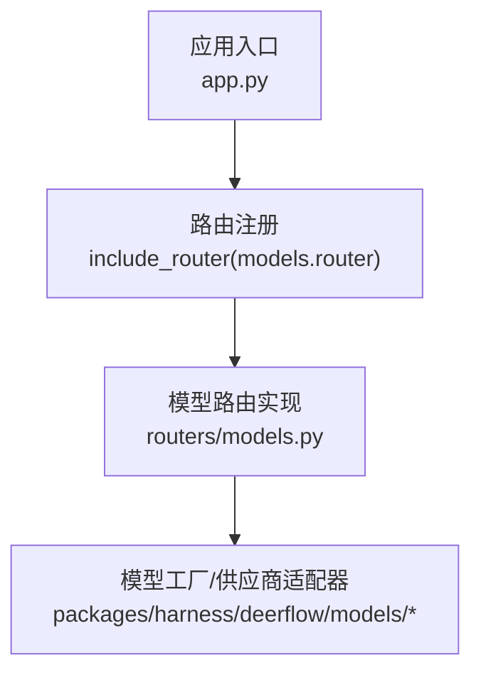
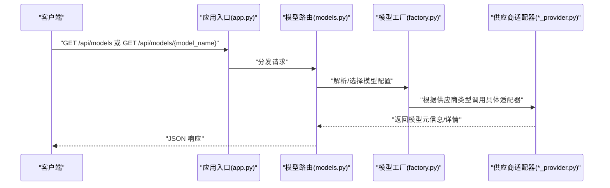
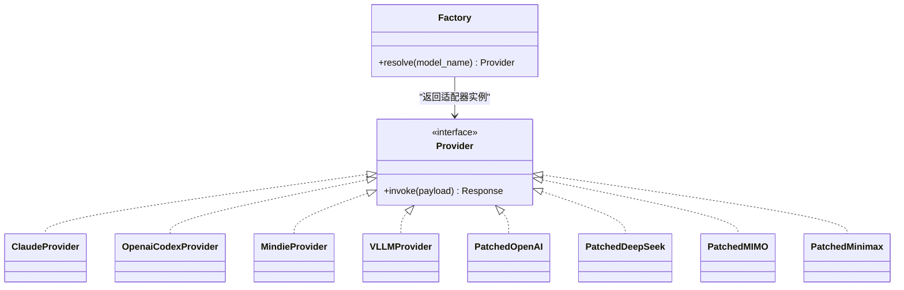
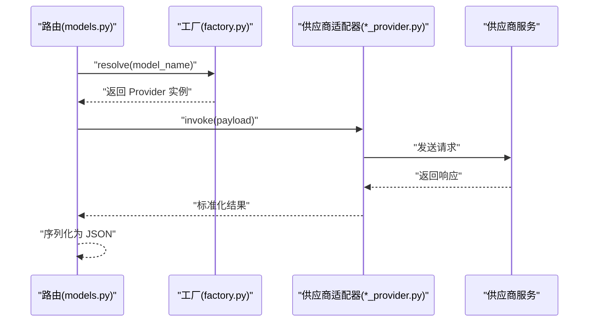
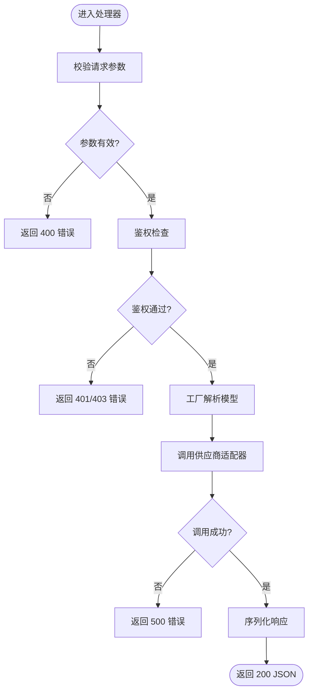
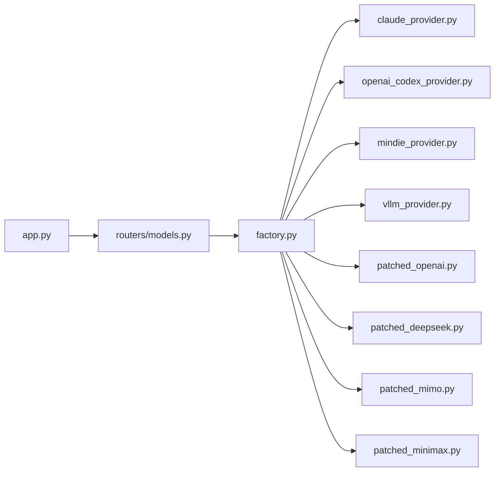

# 模型 API

<cite>
**本文引用的文件**
- [app.py](file://backend/app/gateway/app.py)
- [models.py](file://backend/app/gateway/routers/models.py)
- [models.py](file://backend/app/gateway/auth/models.py)
- [factory.py](file://backend/packages/harness/deerflow/models/factory.py)
- [claude_provider.py](file://backend/packages/harness/deerflow/models/claude_provider.py)
- [openai_codex_provider.py](file://backend/packages/harness/deerflow/models/openai_codex_provider.py)
- [mindie_provider.py](file://backend/packages/harness/deerflow/models/mindie_provider.py)
- [vllm_provider.py](file://backend/packages/harness/deerflow/models/vllm_provider.py)
- [patched_openai.py](file://backend/packages/harness/deerflow/models/patched_openai.py)
- [patched_deepseek.py](file://backend/packages/harness/deerflow/models/patched_deepseek.py)
- [patched_mimo.py](file://backend/packages/harness/deerflow/models/patched_mimo.py)
- [patched_minimax.py](file://backend/packages/harness/deerflow/models/patched_minimax.py)
- [README.md](file://backend/docs/API.md)
- [README.md](file://backend/README.md)
</cite>

## 目录
1. [简介](#简介)
2. [项目结构](#项目结构)
3. [核心组件](#核心组件)
4. [架构总览](#架构总览)
5. [详细组件分析](#详细组件分析)
6. [依赖关系分析](#依赖关系分析)
7. [性能考虑](#性能考虑)
8. [故障排查指南](#故障排查指南)
9. [结论](#结论)
10. [附录](#附录)

## 简介
本文件为 DeerFlow Models API 的权威参考文档，聚焦于以下两个核心端点的设计与实现：
- GET /api/models：列出可用模型清单
- GET /api/models/{model_name}：按名称获取模型详情

文档将详细说明：
- 请求参数与响应格式
- 错误处理机制
- 模型配置管理与供应商集成
- 性能优化策略
- 实际 cURL 示例与客户端集成要点
- 完整 JSON Schema 定义（含模型名称、显示名称、功能特性等字段）

## 项目结构
Models API 在后端网关中通过路由模块对外暴露，并由应用入口统一挂载。其核心位置如下：
- 应用入口挂载：在应用启动时将模型路由挂载到 /api/models
- 路由实现：位于网关路由器目录下的 models.py
- 认证相关模型：位于网关认证模块下的 models.py（与权限/令牌相关）
- 模型工厂与供应商适配器：位于 harness 包的 models 子包，负责模型解析、选择与调用

图表来源
- [app.py:358-360](file://backend/app/gateway/app.py#L358-L360)
- [models.py](file://backend/app/gateway/routers/models.py)

章节来源
- [app.py:358-360](file://backend/app/gateway/app.py#L358-L360)

## 核心组件
- 应用入口与路由挂载：应用在启动阶段将模型路由挂载至 /api/models，确保外部可通过该路径访问模型 API。
- 路由处理器：在 routers/models.py 中定义 GET /api/models 与 GET /api/models/{model_name} 两个端点的处理逻辑。
- 认证模型：网关认证模块中的 models.py 提供与权限/令牌相关的数据结构，用于保护或鉴权模型 API。
- 模型工厂与供应商适配器：harness 包下的 factory.py 与各 provider 文件（如 claude_provider.py、openai_codex_provider.py、mindie_provider.py、vllm_provider.py 及多个 patched_* 适配器）负责模型解析、供应商对接与调用封装。

章节来源
- [app.py:358-360](file://backend/app/gateway/app.py#L358-L360)
- [models.py](file://backend/app/gateway/routers/models.py)
- [models.py](file://backend/app/gateway/auth/models.py)
- [factory.py](file://backend/packages/harness/deerflow/models/factory.py)
- [claude_provider.py](file://backend/packages/harness/deerflow/models/claude_provider.py)
- [openai_codex_provider.py](file://backend/packages/harness/deerflow/models/openai_codex_provider.py)
- [mindie_provider.py](file://backend/packages/harness/deerflow/models/mindie_provider.py)
- [vllm_provider.py](file://backend/packages/harness/deerflow/models/vllm_provider.py)
- [patched_openai.py](file://backend/packages/harness/deerflow/models/patched_openai.py)
- [patched_deepseek.py](file://backend/packages/harness/deerflow/models/patched_deepseek.py)
- [patched_mimo.py](file://backend/packages/harness/deerflow/models/patched_mimo.py)
- [patched_minimax.py](file://backend/packages/harness/deerflow/models/patched_minimax.py)

## 架构总览
下图展示了从客户端请求到模型服务的调用链路，以及与认证、工厂与供应商适配器的交互关系：

图表来源
- [app.py:358-360](file://backend/app/gateway/app.py#L358-L360)
- [models.py](file://backend/app/gateway/routers/models.py)
- [factory.py](file://backend/packages/harness/deerflow/models/factory.py)
- [claude_provider.py](file://backend/packages/harness/deerflow/models/claude_provider.py)
- [openai_codex_provider.py](file://backend/packages/harness/deerflow/models/openai_codex_provider.py)
- [mindie_provider.py](file://backend/packages/harness/deerflow/models/mindie_provider.py)
- [vllm_provider.py](file://backend/packages/harness/deerflow/models/vllm_provider.py)

## 详细组件分析

### 端点：GET /api/models
- 功能：返回当前可用模型的列表
- 请求参数
  - 查询参数：无
  - 头部：遵循通用 API 规范（如 Content-Type、Accept、鉴权头等）
- 响应格式
  - 成功：200 OK，返回 JSON 数组，数组元素为模型对象
  - 错误：根据异常处理返回相应状态码与错误体
- 数据模型（简化说明）
  - 模型对象包含但不限于：名称、显示名称、供应商、是否支持思考模式、是否支持视觉能力等字段
- 错误处理
  - 未授权/鉴权失败：返回 401/403
  - 服务器内部错误：返回 500
  - 其他业务异常：返回对应业务状态码与错误信息

章节来源
- [models.py](file://backend/app/gateway/routers/models.py)

### 端点：GET /api/models/{model_name}
- 功能：按模型名称返回模型详情
- 请求参数
  - 路径参数：model_name（模型唯一标识）
  - 头部：遵循通用 API 规范
- 响应格式
  - 成功：200 OK，返回单个模型对象
  - 错误：根据异常处理返回相应状态码与错误体
- 数据模型（简化说明）
  - 模型对象包含但不限于：名称、显示名称、供应商、是否支持思考模式、是否支持视觉能力、供应商特定配置等
- 错误处理
  - 未授权/鉴权失败：返回 401/403
  - 模型不存在：返回 404
  - 服务器内部错误：返回 500

章节来源
- [models.py](file://backend/app/gateway/routers/models.py)

### JSON Schema 定义
以下为模型对象的 JSON Schema 字段说明（基于仓库中模型工厂与供应商适配器的职责范围抽象归纳）：
- 名称（name）
  - 类型：字符串
  - 必填：是
  - 描述：模型在系统内的唯一标识
- 显示名称（display_name）
  - 类型：字符串
  - 必填：否
  - 描述：面向用户的展示名称
- 供应商（provider）
  - 类型：字符串
  - 必填：是
  - 描述：模型所属供应商（如 openai、claude、mindie、vllm 等）
- 支持思考模式（supports_thinking）
  - 类型：布尔值
  - 必填：否
  - 默认：false
  - 描述：是否支持“思考模式”
- 支持视觉能力（supports_vision）
  - 类型：布尔值
  - 必填：否
  - 默认：false
  - 描述：是否支持视觉输入/输出
- 供应商特定配置（provider_config）
  - 类型：对象
  - 必填：否
  - 描述：供应商相关的额外配置项（如 API Key、Endpoint、版本等），由具体供应商适配器决定
- 其他元信息（如 created_at、updated_at、tags 等）
  - 类型：依据具体实现
  - 必填：视实现而定
  - 描述：用于记录与检索的附加信息

注意：以上 Schema 为概念性定义，具体字段以实际实现为准；建议在生产环境中通过 OpenAPI/Swagger 文档或接口契约进行约束。

### 模型配置管理
- 工厂模式：通过 factory.py 统一解析与选择模型配置，屏蔽不同供应商差异
- 供应商适配器：各 *_provider.py 文件负责对接具体供应商的 API/SDK，封装调用细节
- 修补适配器：patched_* 文件用于对特定供应商的兼容性修复或增强
- 配置来源：通常来源于配置文件或环境变量，由工厂加载并注入到适配器

图表来源
- [factory.py](file://backend/packages/harness/deerflow/models/factory.py)
- [claude_provider.py](file://backend/packages/harness/deerflow/models/claude_provider.py)
- [openai_codex_provider.py](file://backend/packages/harness/deerflow/models/openai_codex_provider.py)
- [mindie_provider.py](file://backend/packages/harness/deerflow/models/mindie_provider.py)
- [vllm_provider.py](file://backend/packages/harness/deerflow/models/vllm_provider.py)
- [patched_openai.py](file://backend/packages/harness/deerflow/models/patched_openai.py)
- [patched_deepseek.py](file://backend/packages/harness/deerflow/models/patched_deepseek.py)
- [patched_mimo.py](file://backend/packages/harness/deerflow/models/patched_mimo.py)
- [patched_minimax.py](file://backend/packages/harness/deerflow/models/patched_minimax.py)

### 供应商集成与调用流程
- 解析阶段：工厂根据 model_name 与配置选择合适的 Provider
- 调用阶段：Provider 封装供应商 API 调用，处理认证、重试、超时等
- 返回阶段：将供应商返回的数据转换为统一的模型对象结构

图表来源
- [models.py](file://backend/app/gateway/routers/models.py)
- [factory.py](file://backend/packages/harness/deerflow/models/factory.py)
- [claude_provider.py](file://backend/packages/harness/deerflow/models/claude_provider.py)
- [openai_codex_provider.py](file://backend/packages/harness/deerflow/models/openai_codex_provider.py)
- [mindie_provider.py](file://backend/packages/harness/deerflow/models/mindie_provider.py)
- [vllm_provider.py](file://backend/packages/harness/deerflow/models/vllm_provider.py)

### 错误处理流程
- 参数校验：对 model_name 进行合法性检查
- 权限校验：结合认证模型与中间件进行鉴权
- 供应商错误：捕获并转换为统一的错误响应
- 降级策略：在供应商不可用时返回可预期的错误码与消息

图表来源
- [models.py](file://backend/app/gateway/routers/models.py)
- [models.py](file://backend/app/gateway/auth/models.py)

## 依赖关系分析
- 应用入口依赖路由模块，路由模块依赖工厂与适配器
- 路由层不直接耦合具体供应商，通过工厂解耦
- 供应商适配器之间相互独立，便于扩展与替换

图表来源
- [app.py:358-360](file://backend/app/gateway/app.py#L358-L360)
- [models.py](file://backend/app/gateway/routers/models.py)
- [factory.py](file://backend/packages/harness/deerflow/models/factory.py)
- [claude_provider.py](file://backend/packages/harness/deerflow/models/claude_provider.py)
- [openai_codex_provider.py](file://backend/packages/harness/deerflow/models/openai_codex_provider.py)
- [mindie_provider.py](file://backend/packages/harness/deerflow/models/mindie_provider.py)
- [vllm_provider.py](file://backend/packages/harness/deerflow/models/vllm_provider.py)
- [patched_openai.py](file://backend/packages/harness/deerflow/models/patched_openai.py)
- [patched_deepseek.py](file://backend/packages/harness/deerflow/models/patched_deepseek.py)
- [patched_mimo.py](file://backend/packages/harness/deerflow/models/patched_mimo.py)
- [patched_minimax.py](file://backend/packages/harness/deerflow/models/patched_minimax.py)

## 性能考虑
- 缓存策略：对模型列表与常用模型详情进行缓存，降低工厂与适配器调用频率
- 并发控制：限制并发调用数量，避免供应商限流或过载
- 超时与重试：为供应商调用设置合理超时与指数退避重试
- 序列化优化：仅返回必要字段，避免冗余数据传输
- 依赖预热：在应用启动时预热常用模型的工厂与适配器实例

## 故障排查指南
- 401/403：检查鉴权头与权限配置，确认认证模型与中间件生效
- 404：确认 model_name 是否正确，是否存在该模型
- 500：查看供应商适配器日志，定位调用异常；检查网络连通性与凭据有效性
- 列表为空：检查配置文件与环境变量，确认模型已正确注册到工厂

章节来源
- [models.py](file://backend/app/gateway/routers/models.py)
- [models.py](file://backend/app/gateway/auth/models.py)

## 结论
DeerFlow Models API 通过清晰的路由层、工厂与适配器解耦设计，实现了对多供应商模型的统一接入与管理。配合完善的错误处理与性能优化策略，能够稳定支撑上层应用的模型查询与调用需求。建议在生产环境中进一步完善 OpenAPI 文档与契约测试，确保接口一致性与可维护性。

## 附录

### cURL 示例
- 获取模型列表
  - curl -X GET "{{baseUrl}}/api/models" -H "Authorization: Bearer YOUR_TOKEN"
- 获取指定模型详情
  - curl -X GET "{{baseUrl}}/api/models/{model_name}" -H "Authorization: Bearer YOUR_TOKEN"

说明
- Authorization 头需根据实际鉴权方式配置
- baseUrl 为应用部署地址

### 客户端集成指南
- 鉴权：在请求头中携带必要的鉴权信息（如 Bearer Token）
- 错误处理：针对 401/403/404/500 等状态码进行差异化处理
- 缓存：对模型列表与热点模型详情进行本地缓存，提升响应速度
- 超时与重试：为供应商调用设置合理的超时与重试策略
- 日志：记录关键调用链路与错误信息，便于问题定位

章节来源
- [README.md](file://backend/docs/API.md)
- [README.md](file://backend/README.md)