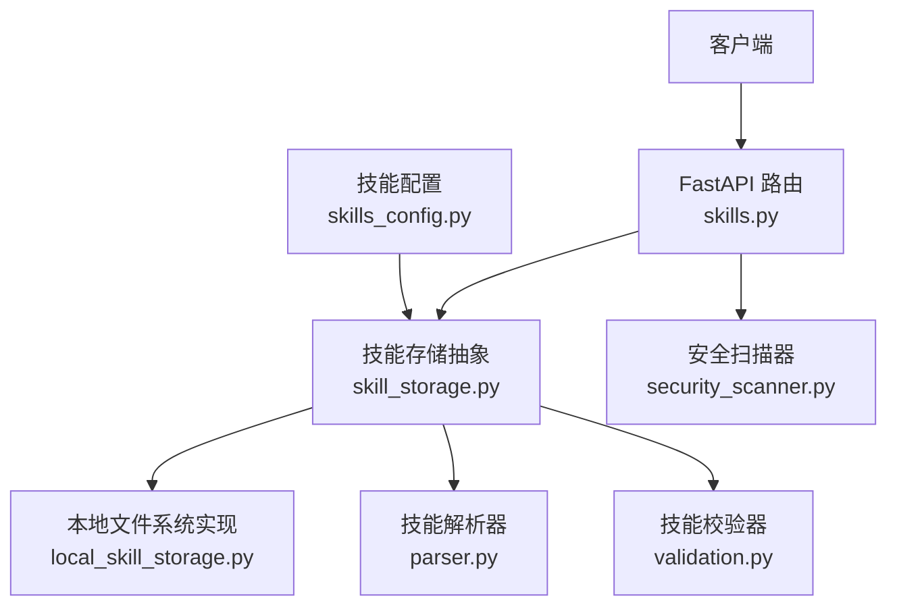
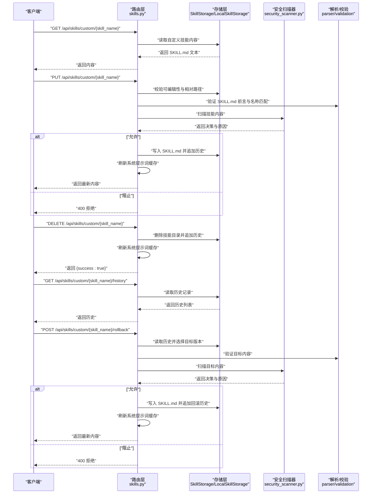
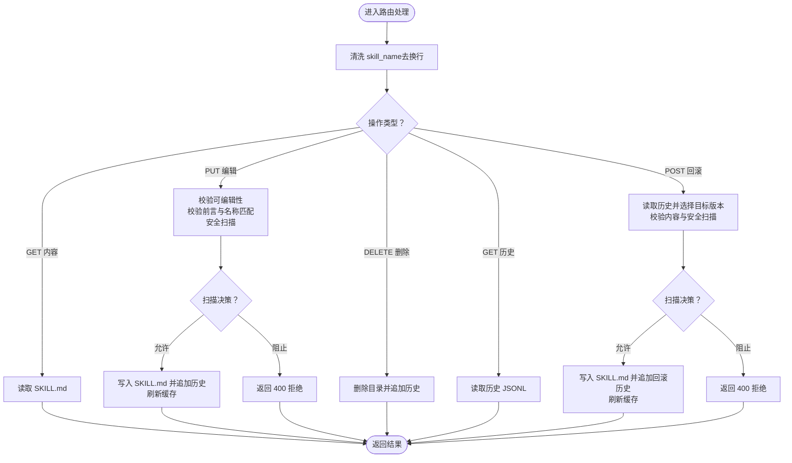
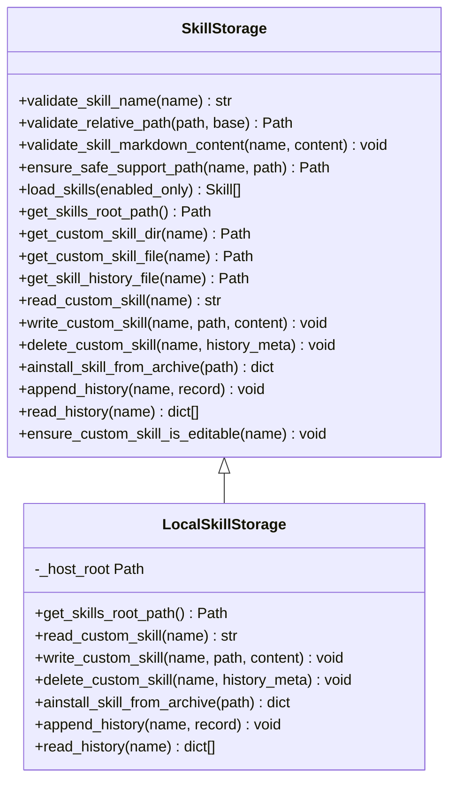
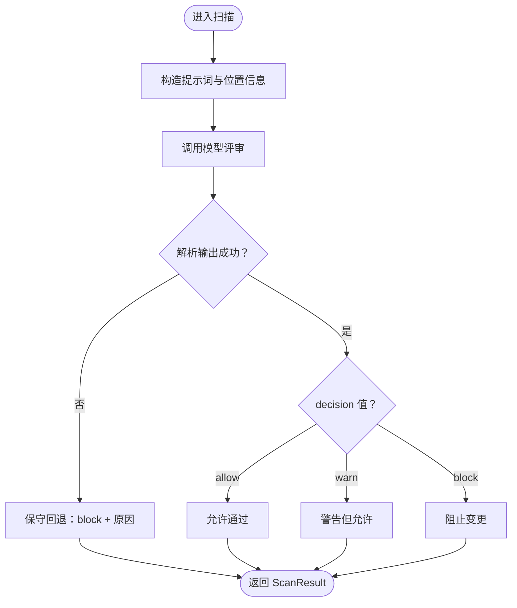
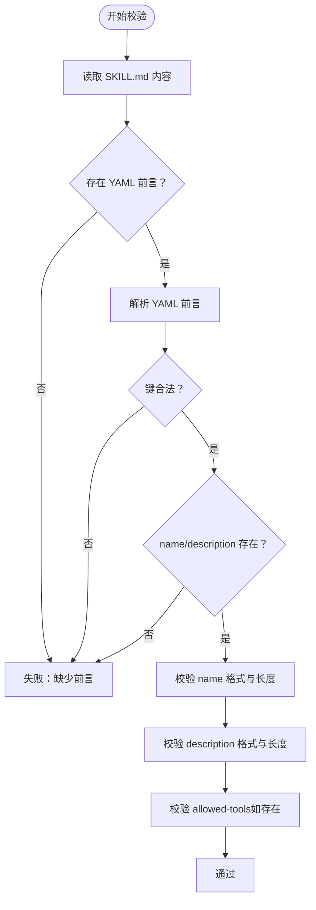
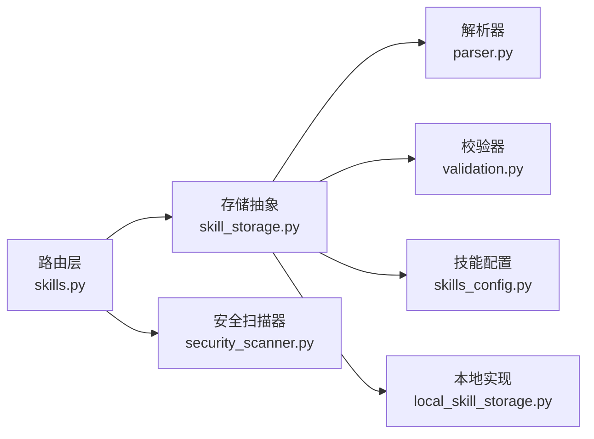

# 自定义技能管理

<cite>
**本文引用的文件**
- [backend/app/gateway/routers/skills.py](file://backend/app/gateway/routers/skills.py)
- [backend/packages/harness/deerflow/skills/security_scanner.py](file://backend/packages/harness/deerflow/skills/security_scanner.py)
- [backend/packages/harness/deerflow/skills/storage/skill_storage.py](file://backend/packages/harness/deerflow/skills/storage/skill_storage.py)
- [backend/packages/harness/deerflow/skills/storage/local_skill_storage.py](file://backend/packages/harness/deerflow/skills/storage/local_skill_storage.py)
- [backend/packages/harness/deerflow/skills/types.py](file://backend/packages/harness/deerflow/skills/types.py)
- [backend/packages/harness/deerflow/skills/parser.py](file://backend/packages/harness/deerflow/skills/parser.py)
- [backend/packages/harness/deerflow/skills/validation.py](file://backend/packages/harness/deerflow/skills/validation.py)
- [backend/packages/harness/deerflow/config/skills_config.py](file://backend/packages/harness/deerflow/config/skills_config.py)
</cite>

## 目录
1. [简介](#简介)
2. [项目结构](#项目结构)
3. [核心组件](#核心组件)
4. [架构总览](#架构总览)
5. [详细组件分析](#详细组件分析)
6. [依赖分析](#依赖分析)
7. [性能考虑](#性能考虑)
8. [故障排查指南](#故障排查指南)
9. [结论](#结论)
10. [附录](#附录)

## 简介
本文件面向“自定义技能管理”的完整生命周期，覆盖以下接口与能力：
- 列表：GET /api/skills/custom
- 内容：GET /api/skills/custom/{skill_name}
- 编辑：PUT /api/skills/custom/{skill_name}
- 删除：DELETE /api/skills/custom/{skill_name}
- 历史：GET /api/skills/custom/{skill_name}/history
- 回滚：POST /api/skills/custom/{skill_name}/rollback

同时，文档深入说明安全扫描机制（编辑与回滚前的风控）、历史版本管理与回滚流程，并提供自定义技能开发的工作流与最佳实践。

## 项目结构
自定义技能管理由后端路由层、技能存储抽象与实现、安全扫描器、解析与校验工具组成。核心目录与职责如下：
- 路由层：提供 REST 接口，负责请求参数校验、调用存储层并返回标准化响应。
- 存储层：抽象出 SkillStorage 接口，本地实现 LocalSkillStorage，负责文件系统操作、历史记录写入与读取。
- 安全扫描：异步调用 LLM 进行内容安全评审，输出允许/警告/阻止决策。
- 解析与校验：解析 SKILL.md 前言元数据，校验命名与字段合法性。
- 配置：技能根路径与容器挂载路径配置。

图表来源
- [backend/app/gateway/routers/skills.py:1-353](file://backend/app/gateway/routers/skills.py#L1-L353)
- [backend/packages/harness/deerflow/skills/storage/skill_storage.py:1-255](file://backend/packages/harness/deerflow/skills/storage/skill_storage.py#L1-L255)
- [backend/packages/harness/deerflow/skills/storage/local_skill_storage.py:1-198](file://backend/packages/harness/deerflow/skills/storage/local_skill_storage.py#L1-L198)
- [backend/packages/harness/deerflow/skills/security_scanner.py:1-110](file://backend/packages/harness/deerflow/skills/security_scanner.py#L1-L110)
- [backend/packages/harness/deerflow/skills/parser.py:1-111](file://backend/packages/harness/deerflow/skills/parser.py#L1-L111)
- [backend/packages/harness/deerflow/skills/validation.py:1-94](file://backend/packages/harness/deerflow/skills/validation.py#L1-L94)
- [backend/packages/harness/deerflow/config/skills_config.py:1-73](file://backend/packages/harness/deerflow/config/skills_config.py#L1-L73)

章节来源
- [backend/app/gateway/routers/skills.py:1-353](file://backend/app/gateway/routers/skills.py#L1-L353)
- [backend/packages/harness/deerflow/skills/storage/skill_storage.py:1-255](file://backend/packages/harness/deerflow/skills/storage/skill_storage.py#L1-L255)
- [backend/packages/harness/deerflow/skills/storage/local_skill_storage.py:1-198](file://backend/packages/harness/deerflow/skills/storage/local_skill_storage.py#L1-L198)
- [backend/packages/harness/deerflow/skills/security_scanner.py:1-110](file://backend/packages/harness/deerflow/skills/security_scanner.py#L1-L110)
- [backend/packages/harness/deerflow/skills/parser.py:1-111](file://backend/packages/harness/deerflow/skills/parser.py#L1-L111)
- [backend/packages/harness/deerflow/skills/validation.py:1-94](file://backend/packages/harness/deerflow/skills/validation.py#L1-L94)
- [backend/packages/harness/deerflow/config/skills_config.py:1-73](file://backend/packages/harness/deerflow/config/skills_config.py#L1-L73)

## 核心组件
- 路由层（skills.py）
  - 提供自定义技能的 CRUD 与历史查询、回滚接口。
  - 对输入进行清洗（去除换行符）与异常转换为 HTTP 错误码。
  - 调用存储层执行业务逻辑，并在成功后刷新系统提示词缓存。
- 抽象存储（skill_storage.py）
  - 定义技能目录布局、路径计算、名称与相对路径校验、历史记录读写等协议。
  - 统一加载技能列表、合并启用状态、排序与过滤。
- 本地存储（local_skill_storage.py）
  - 实现具体文件系统操作：读写 SKILL.md、删除技能、安装 .skill 归档、历史追加与读取。
  - 使用临时文件原子写入，确保一致性；对写入路径进行沙箱只读权限调整。
- 安全扫描（security_scanner.py）
  - 异步调用模型对技能内容进行安全评审，输出决策与原因。
  - 在不可用或输出不可解析时采用保守回退策略。
- 解析与校验（parser.py、validation.py）
  - 解析 SKILL.md 的 YAML 前言，提取元数据并校验字段与命名规范。
- 类型与配置（types.py、skills_config.py）
  - 定义技能类别、容器路径、技能对象结构与技能根路径解析。

章节来源
- [backend/app/gateway/routers/skills.py:1-353](file://backend/app/gateway/routers/skills.py#L1-L353)
- [backend/packages/harness/deerflow/skills/storage/skill_storage.py:1-255](file://backend/packages/harness/deerflow/skills/storage/skill_storage.py#L1-L255)
- [backend/packages/harness/deerflow/skills/storage/local_skill_storage.py:1-198](file://backend/packages/harness/deerflow/skills/storage/local_skill_storage.py#L1-L198)
- [backend/packages/harness/deerflow/skills/security_scanner.py:1-110](file://backend/packages/harness/deerflow/skills/security_scanner.py#L1-L110)
- [backend/packages/harness/deerflow/skills/parser.py:1-111](file://backend/packages/harness/deerflow/skills/parser.py#L1-L111)
- [backend/packages/harness/deerflow/skills/validation.py:1-94](file://backend/packages/harness/deerflow/skills/validation.py#L1-L94)
- [backend/packages/harness/deerflow/skills/types.py:1-69](file://backend/packages/harness/deerflow/skills/types.py#L1-L69)
- [backend/packages/harness/deerflow/config/skills_config.py:1-73](file://backend/packages/harness/deerflow/config/skills_config.py#L1-L73)

## 架构总览
下图展示自定义技能管理的端到端交互：客户端通过路由层发起请求，路由层调用存储层执行业务，必要时触发安全扫描，最终返回结果并更新系统提示词缓存。

图表来源
- [backend/app/gateway/routers/skills.py:138-278](file://backend/app/gateway/routers/skills.py#L138-L278)
- [backend/packages/harness/deerflow/skills/storage/skill_storage.py:63-99](file://backend/packages/harness/deerflow/skills/storage/skill_storage.py#L63-L99)
- [backend/packages/harness/deerflow/skills/storage/local_skill_storage.py:77-177](file://backend/packages/harness/deerflow/skills/storage/local_skill_storage.py#L77-L177)
- [backend/packages/harness/deerflow/skills/security_scanner.py:70-110](file://backend/packages/harness/deerflow/skills/security_scanner.py#L70-L110)
- [backend/packages/harness/deerflow/skills/parser.py:35-111](file://backend/packages/harness/deerflow/skills/parser.py#L35-L111)
- [backend/packages/harness/deerflow/skills/validation.py:18-94](file://backend/packages/harness/deerflow/skills/validation.py#L18-L94)

## 详细组件分析

### 路由层：自定义技能生命周期接口
- GET /api/skills/custom
  - 返回所有自定义技能的简要信息（名称、描述、许可证、分类、启用状态）。
- GET /api/skills/custom/{skill_name}
  - 返回指定自定义技能的原始 SKILL.md 内容。
- PUT /api/skills/custom/{skill_name}
  - 更新自定义技能内容。流程包含：可编辑性检查、内容前言校验、安全扫描、写入文件、追加历史、刷新缓存。
- DELETE /api/skills/custom/{skill_name}
  - 删除自定义技能目录，追加删除历史条目，刷新缓存。
- GET /api/skills/custom/{skill_name}/history
  - 读取该技能的历史记录（JSONL），每条记录包含时间戳、动作、作者、文件路径、前后内容、扫描结果等。
- POST /api/skills/custom/{skill_name}/rollback
  - 从历史中选择一个版本回滚。流程包含：读取历史、选择目标版本、内容校验、安全扫描、写入并追加回滚历史、刷新缓存。

图表来源
- [backend/app/gateway/routers/skills.py:138-278](file://backend/app/gateway/routers/skills.py#L138-L278)

章节来源
- [backend/app/gateway/routers/skills.py:88-353](file://backend/app/gateway/routers/skills.py#L88-L353)

### 存储层：抽象与本地实现
- 抽象接口（SkillStorage）
  - 规范化技能名称与相对路径、校验支持文件路径、加载技能列表（含启用状态合并）、路径计算（自定义目录、历史文件）、历史读写。
- 本地实现（LocalSkillStorage）
  - 文件系统操作：读取/写入 SKILL.md、删除技能目录、安装 .skill 归档（解压、校验、移动）、历史追加与读取。
  - 原子写入使用临时文件替换，避免部分写入；写入后调整权限以满足沙箱只读要求。
  - 容错：对只读/权限失败的场景记录告警并继续删除流程。

图表来源
- [backend/packages/harness/deerflow/skills/storage/skill_storage.py:18-255](file://backend/packages/harness/deerflow/skills/storage/skill_storage.py#L18-L255)
- [backend/packages/harness/deerflow/skills/storage/local_skill_storage.py:25-198](file://backend/packages/harness/deerflow/skills/storage/local_skill_storage.py#L25-L198)

章节来源
- [backend/packages/harness/deerflow/skills/storage/skill_storage.py:1-255](file://backend/packages/harness/deerflow/skills/storage/skill_storage.py#L1-L255)
- [backend/packages/harness/deerflow/skills/storage/local_skill_storage.py:1-198](file://backend/packages/harness/deerflow/skills/storage/local_skill_storage.py#L1-L198)

### 安全扫描：编辑与回滚前的内容风控
- 扫描输入：位置信息（技能名/SKILL.md）、是否可执行、内容正文。
- 扫描逻辑：构造系统提示词与用户提示，调用模型异步评审，期望单行 JSON 输出（decision: allow|warn|block, reason: ...）。
- 回退策略：当模型不可用或输出不可解析时，采用保守策略（block），并给出明确原因。
- 路由层在编辑与回滚前均执行扫描，若被阻止则拒绝变更并记录历史。

图表来源
- [backend/packages/harness/deerflow/skills/security_scanner.py:70-110](file://backend/packages/harness/deerflow/skills/security_scanner.py#L70-L110)

章节来源
- [backend/packages/harness/deerflow/skills/security_scanner.py:1-110](file://backend/packages/harness/deerflow/skills/security_scanner.py#L1-L110)

### 解析与校验：SKILL.md 元数据与命名规范
- 解析器（parser.py）
  - 提取 YAML 前言块，解析元数据，校验必需字段（name、description），规范化字符串，解析 allowed-tools。
- 校验器（validation.py）
  - 校验前言键集合、name 与 description 的类型与长度限制、命名格式（小写字母、数字、短横线，不含连续短横线，不超过 64 字符）、description 不得包含尖括号且长度限制、allowed-tools 合法性。

图表来源
- [backend/packages/harness/deerflow/skills/parser.py:35-111](file://backend/packages/harness/deerflow/skills/parser.py#L35-L111)
- [backend/packages/harness/deerflow/skills/validation.py:18-94](file://backend/packages/harness/deerflow/skills/validation.py#L18-L94)

章节来源
- [backend/packages/harness/deerflow/skills/parser.py:1-111](file://backend/packages/harness/deerflow/skills/parser.py#L1-L111)
- [backend/packages/harness/deerflow/skills/validation.py:1-94](file://backend/packages/harness/deerflow/skills/validation.py#L1-L94)

### 类型与配置：技能类别与容器路径
- 类型定义（types.py）
  - SkillCategory：public/custom；Skill：包含名称、描述、许可证、目录路径、相对路径、类别、允许工具、启用状态等。
- 配置（skills_config.py）
  - SkillsConfig：解析技能根路径（优先显式配置、环境变量、项目默认、回退到仓库根兼容路径），提供容器挂载路径与技能容器路径拼接。

章节来源
- [backend/packages/harness/deerflow/skills/types.py:1-69](file://backend/packages/harness/deerflow/skills/types.py#L1-L69)
- [backend/packages/harness/deerflow/config/skills_config.py:1-73](file://backend/packages/harness/deerflow/config/skills_config.py#L1-L73)

## 依赖分析
- 路由层依赖存储抽象与安全扫描器，通过统一接口访问文件系统与执行安全评审。
- 存储层依赖解析与校验模块，保证写入内容符合规范。
- 配置模块为存储层提供技能根路径与容器路径，影响文件系统布局与容器挂载。

图表来源
- [backend/app/gateway/routers/skills.py:1-353](file://backend/app/gateway/routers/skills.py#L1-L353)
- [backend/packages/harness/deerflow/skills/storage/skill_storage.py:1-255](file://backend/packages/harness/deerflow/skills/storage/skill_storage.py#L1-L255)
- [backend/packages/harness/deerflow/skills/storage/local_skill_storage.py:1-198](file://backend/packages/harness/deerflow/skills/storage/local_skill_storage.py#L1-L198)
- [backend/packages/harness/deerflow/skills/security_scanner.py:1-110](file://backend/packages/harness/deerflow/skills/security_scanner.py#L1-L110)
- [backend/packages/harness/deerflow/skills/parser.py:1-111](file://backend/packages/harness/deerflow/skills/parser.py#L1-L111)
- [backend/packages/harness/deerflow/skills/validation.py:1-94](file://backend/packages/harness/deerflow/skills/validation.py#L1-L94)
- [backend/packages/harness/deerflow/config/skills_config.py:1-73](file://backend/packages/harness/deerflow/config/skills_config.py#L1-L73)

章节来源
- [backend/app/gateway/routers/skills.py:1-353](file://backend/app/gateway/routers/skills.py#L1-L353)
- [backend/packages/harness/deerflow/skills/storage/skill_storage.py:1-255](file://backend/packages/harness/deerflow/skills/storage/skill_storage.py#L1-L255)
- [backend/packages/harness/deerflow/skills/storage/local_skill_storage.py:1-198](file://backend/packages/harness/deerflow/skills/storage/local_skill_storage.py#L1-L198)
- [backend/packages/harness/deerflow/skills/security_scanner.py:1-110](file://backend/packages/harness/deerflow/skills/security_scanner.py#L1-L110)
- [backend/packages/harness/deerflow/skills/parser.py:1-111](file://backend/packages/harness/deerflow/skills/parser.py#L1-L111)
- [backend/packages/harness/deerflow/skills/validation.py:1-94](file://backend/packages/harness/deerflow/skills/validation.py#L1-L94)
- [backend/packages/harness/deerflow/config/skills_config.py:1-73](file://backend/packages/harness/deerflow/config/skills_config.py#L1-L73)

## 性能考虑
- 历史记录采用 JSONL 追加写入，避免大文件重载；读取时按行解析，内存占用可控。
- 安全扫描为异步调用，路由层等待结果后再决定是否写入；建议在高并发场景下评估模型调用延迟与限流策略。
- 文件写入使用临时文件替换，减少锁竞争与部分写入风险。
- 加载技能列表时会重新读取启用状态配置，确保多进程共享配置的一致性。

## 故障排查指南
- 400 错误
  - 编辑/回滚被安全扫描阻止：检查扫描原因，修正内容后重试。
  - 输入参数非法：检查 skill_name 是否为空或包含换行，检查历史索引是否越界。
- 404 错误
  - 技能不存在：确认技能名大小写与拼写，确认是否位于 custom 目录。
- 409 错误
  - 安装 .skill 归档时已存在同名技能：先删除旧技能或修改归档内技能名。
- 权限问题
  - 只读文件系统或权限不足导致历史写入失败：检查存储根路径权限，确保可写；删除流程会记录告警并继续清理。
- 缓存未刷新
  - 若更新后系统提示词未变化：确认刷新缓存逻辑是否执行，或重启服务。

章节来源
- [backend/app/gateway/routers/skills.py:115-125](file://backend/app/gateway/routers/skills.py#L115-L125)
- [backend/app/gateway/routers/skills.py:182-188](file://backend/app/gateway/routers/skills.py#L182-L188)
- [backend/app/gateway/routers/skills.py:210-216](file://backend/app/gateway/routers/skills.py#L210-L216)
- [backend/app/gateway/routers/skills.py:224-231](file://backend/app/gateway/routers/skills.py#L224-L231)
- [backend/app/gateway/routers/skills.py:240-247](file://backend/app/gateway/routers/skills.py#L240-L247)
- [backend/packages/harness/deerflow/skills/storage/local_skill_storage.py:163-176](file://backend/packages/harness/deerflow/skills/storage/local_skill_storage.py#L163-L176)

## 结论
自定义技能管理通过清晰的路由层、抽象存储层与安全扫描机制，实现了从创建、编辑、删除到历史与回滚的完整生命周期闭环。解析与校验保障了元数据的合法性与一致性，配置模块提供了灵活的路径管理。建议在生产环境中结合限流与审计日志，持续优化扫描模型与缓存刷新策略。

## 附录

### 自定义技能开发工作流与最佳实践
- 开发步骤
  - 准备 SKILL.md：编写 YAML 前言（name、description 必填，license 可选，allowed-tools 可选），正文为技能说明与使用指南。
  - 命名规范：仅使用小写字母、数字与短横线，不以短横线开头或结尾，不包含连续短横线，长度不超过 64。
  - 支持文件：可放置于 references、templates、scripts、assets 子目录，路径必须相对且不越界。
  - 安全合规：避免包含敏感信息、外部 API 密钥或潜在危险指令；尽量使用平台提供的受控工具集。
- 发布与维护
  - 使用 .skill 归档进行安装，确保归档内包含正确的 SKILL.md 与资源文件。
  - 编辑前先备份，利用历史记录与回滚功能进行版本控制。
  - 定期审查 allowed-tools 与描述信息，保持与实际能力一致。
- 最佳实践
  - 将复杂逻辑拆分为脚本或模板，便于复用与测试。
  - 在 SKILL.md 中提供示例调用方式与预期输出，提升可读性。
  - 对外暴露的工具需谨慎配置 allowed-tools，遵循最小权限原则。
  - 使用历史记录追踪每次变更，保留扫描结果与作者信息，便于审计。