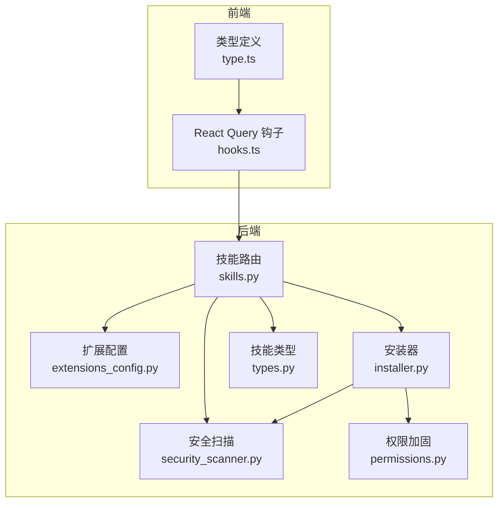
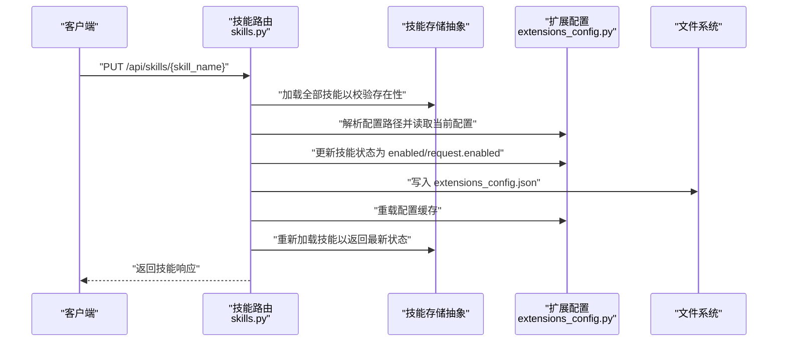
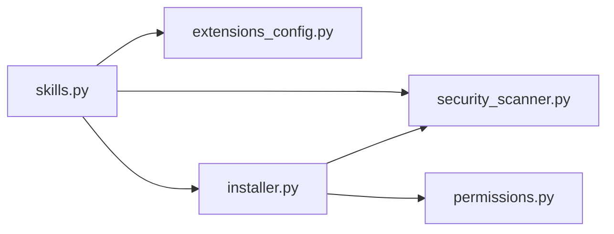

# 技能控制操作

<cite>
**本文引用的文件**
- [backend/app/gateway/routers/skills.py](file://backend/app/gateway/routers/skills.py)
- [backend/packages/harness/deerflow/skills/installer.py](file://backend/packages/harness/deerflow/skills/installer.py)
- [backend/packages/harness/deerflow/skills/security_scanner.py](file://backend/packages/harness/deerflow/skills/security_scanner.py)
- [backend/packages/harness/deerflow/skills/permissions.py](file://backend/packages/harness/deerflow/skills/permissions.py)
- [backend/packages/harness/deerflow/skills/types.py](file://backend/packages/harness/deerflow/skills/types.py)
- [backend/packages/harness/deerflow/config/extensions_config.py](file://backend/packages/harness/deerflow/config/extensions_config.py)
- [backend/app/gateway/auth_middleware.py](file://backend/app/gateway/auth_middleware.py)
- [frontend/src/core/skills/hooks.ts](file://frontend/src/core/skills/hooks.ts)
- [frontend/src/core/skills/type.ts](file://frontend/src/core/skills/type.ts)
- [backend/tests/test_skills_custom_router.py](file://backend/tests/test_skills_custom_router.py)
- [backend/tests/test_skills_installer.py](file://backend/tests/test_skills_installer.py)
- [backend/docs/ARCHITECTURE.md](file://backend/docs/ARCHITECTURE.md)
</cite>

## 目录
1. [简介](#简介)
2. [项目结构](#项目结构)
3. [核心组件](#核心组件)
4. [架构总览](#架构总览)
5. [详细组件分析](#详细组件分析)
6. [依赖分析](#依赖分析)
7. [性能考量](#性能考量)
8. [故障排查指南](#故障排查指南)
9. [结论](#结论)
10. [附录](#附录)

## 简介
本文件面向“技能控制操作”的实现与使用，重点覆盖以下内容：
- 技能启用/禁用的端点工作原理与状态变更流程
- 权限验证与安全考虑（含安全扫描、权限加固）
- 依赖检查与冲突处理策略
- 完整的操作示例与常见问题解决方案
- 批量操作与自动化管理的实现建议

## 项目结构
技能系统由后端路由层、配置与存储抽象、安全扫描与权限工具、前端交互钩子等组成。核心路径如下：
- 后端路由：/api/skills 路由定义与控制逻辑
- 配置中心：统一扩展配置（MCP 服务器与技能开关）
- 安全扫描：对技能内容进行 LLM 驱动的安全评审
- 权限工具：对已安装技能树进行只读加固
- 前端：技能列表与启用/禁用的用户交互

图示来源
- [backend/app/gateway/routers/skills.py:1-353](file://backend/app/gateway/routers/skills.py#L1-L353)
- [backend/packages/harness/deerflow/config/extensions_config.py:1-267](file://backend/packages/harness/deerflow/config/extensions_config.py#L1-L267)
- [backend/packages/harness/deerflow/skills/installer.py:1-207](file://backend/packages/harness/deerflow/skills/installer.py#L1-L207)
- [backend/packages/harness/deerflow/skills/security_scanner.py:1-110](file://backend/packages/harness/deerflow/skills/security_scanner.py#L1-L110)
- [backend/packages/harness/deerflow/skills/permissions.py:1-35](file://backend/packages/harness/deerflow/skills/permissions.py#L1-L35)
- [backend/packages/harness/deerflow/skills/types.py:1-69](file://backend/packages/harness/deerflow/skills/types.py#L1-L69)
- [frontend/src/core/skills/hooks.ts:1-31](file://frontend/src/core/skills/hooks.ts#L1-L31)
- [frontend/src/core/skills/type.ts:1-7](file://frontend/src/core/skills/type.ts#L1-L7)

章节来源
- [backend/docs/ARCHITECTURE.md:305-342](file://backend/docs/ARCHITECTURE.md#L305-L342)
- [backend/app/gateway/routers/skills.py:1-353](file://backend/app/gateway/routers/skills.py#L1-L353)

## 核心组件
- 技能路由与控制
  - 提供 GET/POST/PUT/DELETE/GET 历史等接口，支持列出、安装、查询、编辑、删除、回滚自定义技能，以及更新技能启用状态。
  - 更新技能启用状态通过修改扩展配置文件并重载缓存实现。

- 扩展配置（MCP 与技能）
  - 统一管理 MCP 服务器与技能启用状态；支持从多处解析配置文件路径，并提供默认启用策略。

- 安全扫描
  - 对技能内容（含脚本与提示输入）进行 LLM 驱动的三态判定（允许/警告/阻止），并具备回退策略。

- 权限加固
  - 将已安装技能树设置为沙箱可读，避免写权限带来的风险。

- 技能类型与存储抽象
  - 抽象出技能元数据、容器内路径计算、分类（公共/自定义）等能力。

章节来源
- [backend/app/gateway/routers/skills.py:24-353](file://backend/app/gateway/routers/skills.py#L24-L353)
- [backend/packages/harness/deerflow/config/extensions_config.py:51-207](file://backend/packages/harness/deerflow/config/extensions_config.py#L51-L207)
- [backend/packages/harness/deerflow/skills/security_scanner.py:70-110](file://backend/packages/harness/deerflow/skills/security_scanner.py#L70-L110)
- [backend/packages/harness/deerflow/skills/permissions.py:7-35](file://backend/packages/harness/deerflow/skills/permissions.py#L7-L35)
- [backend/packages/harness/deerflow/skills/types.py:19-69](file://backend/packages/harness/deerflow/skills/types.py#L19-L69)

## 架构总览
下图展示“更新技能启用状态”端点的调用链路与关键参与者：

图示来源
- [backend/app/gateway/routers/skills.py:304-353](file://backend/app/gateway/routers/skills.py#L304-L353)
- [backend/packages/harness/deerflow/config/extensions_config.py:71-150](file://backend/packages/harness/deerflow/config/extensions_config.py#L71-L150)

## 详细组件分析

### 端点：PUT /api/skills/{skill_name}
- 功能概述
  - 接收请求体中的 enabled 字段，更新指定技能的启用状态。
  - 写入扩展配置文件并重载缓存，随后刷新系统提示词缓存，确保运行时生效。

- 关键行为
  - 输入清洗：去除换行符，避免路径注入。
  - 存在性校验：若技能不存在，返回 404。
  - 配置落盘：将技能状态写入 JSON 并持久化到磁盘。
  - 缓存刷新：重载扩展配置缓存并刷新系统提示词缓存。
  - 返回值：返回更新后的技能信息。

- 错误处理
  - 未找到：404
  - 其他异常：500

章节来源
- [backend/app/gateway/routers/skills.py:304-353](file://backend/app/gateway/routers/skills.py#L304-L353)

### 权限验证与安全考虑
- 认证中间件
  - 对非公开路径采用“失败关闭”策略，要求有效会话与 JWT 校验。
  - 技能路由属于受保护路径，需通过认证中间件。

- 安全扫描（安装与编辑）
  - 安装前扫描：对 SKILL.md 与脚本/提示输入文件进行扫描，拒绝嵌套 SKILL.md、不合规内容或可执行文件的阻断判定。
  - 自定义技能编辑/回滚：先进行内容校验与扫描，若判定为阻止则拒绝变更并记录历史。

- 权限加固
  - 安装完成后对技能树应用只读权限，避免沙箱写入风险。

章节来源
- [backend/app/gateway/auth_middleware.py:46-61](file://backend/app/gateway/auth_middleware.py#L46-L61)
- [backend/packages/harness/deerflow/skills/installer.py:152-195](file://backend/packages/harness/deerflow/skills/installer.py#L152-L195)
- [backend/packages/harness/deerflow/skills/security_scanner.py:70-110](file://backend/packages/harness/deerflow/skills/security_scanner.py#L70-L110)
- [backend/packages/harness/deerflow/skills/permissions.py:18-35](file://backend/packages/harness/deerflow/skills/permissions.py#L18-L35)

### 依赖检查与冲突处理
- 依赖检查
  - 安装器对归档包进行安全校验：拒绝绝对路径、目录穿越、符号链接、超大压缩包等。
  - 对脚本与提示输入文件进行选择性扫描，确保内容安全。

- 冲突处理
  - 若目标技能已存在，抛出“已存在”错误，防止覆盖。
  - 若扫描结果为阻止，安装/编辑/回滚均被拒绝，并记录历史。

章节来源
- [backend/packages/harness/deerflow/skills/installer.py:33-124](file://backend/packages/harness/deerflow/skills/installer.py#L33-L124)
- [backend/tests/test_skills_installer.py:221-320](file://backend/tests/test_skills_installer.py#L221-L320)

### 技能激活与系统提示词缓存
- 更新启用状态后，系统会刷新技能系统提示词缓存，确保后续对话中按最新启用状态注入技能描述与位置信息。

章节来源
- [backend/app/gateway/routers/skills.py:337-338](file://backend/app/gateway/routers/skills.py#L337-L338)

### 前端交互与类型定义
- 类型定义：技能对象包含名称、描述、许可证、分类与启用状态。
- 钩子：提供查询与启用/禁用的 Mutation，成功后自动失效并刷新技能列表缓存。

章节来源
- [frontend/src/core/skills/type.ts:1-7](file://frontend/src/core/skills/type.ts#L1-L7)
- [frontend/src/core/skills/hooks.ts:1-31](file://frontend/src/core/skills/hooks.ts#L1-L31)

## 依赖分析
- 路由层依赖
  - 扩展配置：用于解析与写入配置文件，判断技能启用状态。
  - 安全扫描：用于安装与编辑场景的内容审核。
  - 存储抽象：用于加载/安装/读写技能文件。

- 安装器依赖
  - 安全扫描：对归档内容逐文件扫描。
  - 权限工具：安装后对技能树进行只读加固。

图示来源
- [backend/app/gateway/routers/skills.py:1-353](file://backend/app/gateway/routers/skills.py#L1-L353)
- [backend/packages/harness/deerflow/config/extensions_config.py:1-267](file://backend/packages/harness/deerflow/config/extensions_config.py#L1-L267)
- [backend/packages/harness/deerflow/skills/installer.py:1-207](file://backend/packages/harness/deerflow/skills/installer.py#L1-L207)
- [backend/packages/harness/deerflow/skills/security_scanner.py:1-110](file://backend/packages/harness/deerflow/skills/security_scanner.py#L1-L110)
- [backend/packages/harness/deerflow/skills/permissions.py:1-35](file://backend/packages/harness/deerflow/skills/permissions.py#L1-L35)

## 性能考量
- 配置写入与缓存重载
  - 写入 JSON 文件与重载缓存为轻量 I/O 操作，通常毫秒级完成。
- 安全扫描
  - 使用 LLM 进行内容审核，耗时取决于模型响应时间与内容长度；建议在批量操作时合并请求以减少重复调用。
- 前端缓存
  - 使用 React Query 的查询缓存与失效策略，避免频繁拉取相同数据。

## 故障排查指南
- 404 未找到技能
  - 确认技能名称正确且存在于已加载的技能列表中。
  - 参考：[后端路由校验逻辑:312-318](file://backend/app/gateway/routers/skills.py#L312-L318)

- 500 写入/重载失败
  - 检查扩展配置文件路径解析与写入权限。
  - 参考：[配置解析与写入:319-333](file://backend/app/gateway/routers/skills.py#L319-L333)、[配置解析实现:71-150](file://backend/packages/harness/deerflow/config/extensions_config.py#L71-L150)

- 安装/编辑被阻止
  - 查看扫描结果与原因，修正内容后重试。
  - 参考：[安装扫描规则:177-195](file://backend/packages/harness/deerflow/skills/installer.py#L177-L195)、[安全扫描实现:70-110](file://backend/packages/harness/deerflow/skills/security_scanner.py#L70-L110)

- 权限问题导致无法写入
  - 确保运行用户对技能根目录具有写权限；安装后权限会被加固为只读。
  - 参考：[权限加固:18-35](file://backend/packages/harness/deerflow/skills/permissions.py#L18-L35)

- 前端未刷新
  - 确认 Mutation 成功回调触发了查询失效。
  - 参考：[前端钩子:15-31](file://frontend/src/core/skills/hooks.ts#L15-L31)

章节来源
- [backend/app/gateway/routers/skills.py:304-353](file://backend/app/gateway/routers/skills.py#L304-L353)
- [backend/packages/harness/deerflow/config/extensions_config.py:71-150](file://backend/packages/harness/deerflow/config/extensions_config.py#L71-L150)
- [backend/packages/harness/deerflow/skills/installer.py:177-195](file://backend/packages/harness/deerflow/skills/installer.py#L177-L195)
- [backend/packages/harness/deerflow/skills/security_scanner.py:70-110](file://backend/packages/harness/deerflow/skills/security_scanner.py#L70-L110)
- [frontend/src/core/skills/hooks.ts:15-31](file://frontend/src/core/skills/hooks.ts#L15-L31)

## 结论
- PUT /api/skills/{skill_name} 是技能启用/禁用的唯一入口，流程清晰、安全可控。
- 安全扫描与权限加固贯穿安装与编辑生命周期，有效降低风险。
- 扩展配置的集中管理与缓存重载保证了运行时一致性。
- 建议在自动化场景中合并批量请求、复用扫描结果，并结合前端缓存策略提升体验。

## 附录

### 操作示例（概念性步骤）
- 启用技能
  - 步骤：调用 PUT /api/skills/{skill_name}，请求体 enabled=true。
  - 结果：配置文件更新，缓存重载，系统提示词刷新。
  - 参考：[更新技能启用状态:304-353](file://backend/app/gateway/routers/skills.py#L304-L353)

- 禁用技能
  - 步骤：调用 PUT /api/skills/{skill_name}，请求体 enabled=false。
  - 结果：同上，但技能不再注入到系统提示词。
  - 参考：[更新技能启用状态:304-353](file://backend/app/gateway/routers/skills.py#L304-L353)

- 批量操作与自动化管理建议
  - 合并请求：将多个技能的状态变更合并为单次请求，减少多次写入与缓存重载。
  - 复用扫描：对同一内容的多次变更复用扫描结果，避免重复调用 LLM。
  - 前端缓存：使用前端查询失效策略，确保 UI 与后端状态一致。
  - 参考：[前端钩子:15-31](file://frontend/src/core/skills/hooks.ts#L15-L31)、[安全扫描:70-110](file://backend/packages/harness/deerflow/skills/security_scanner.py#L70-L110)