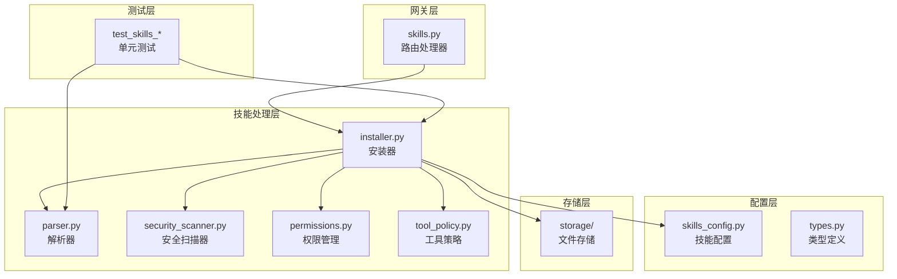
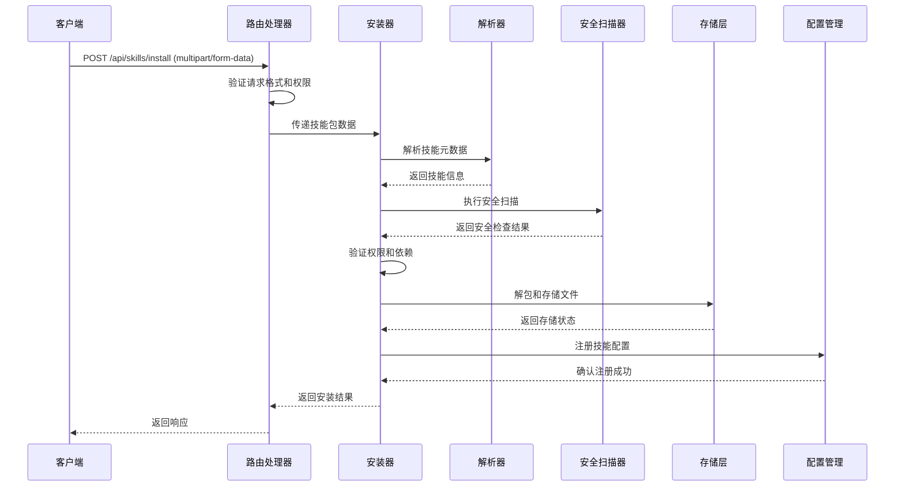
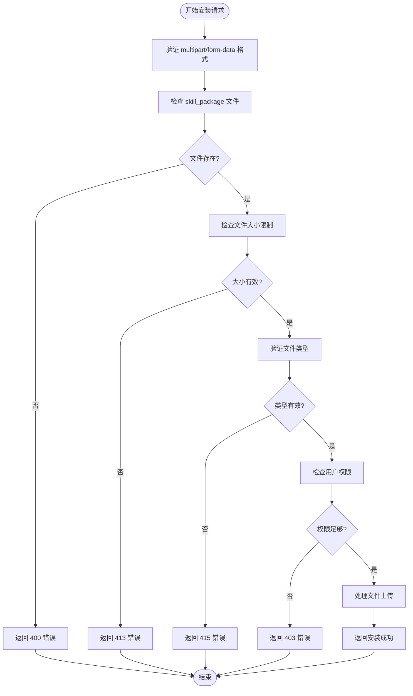
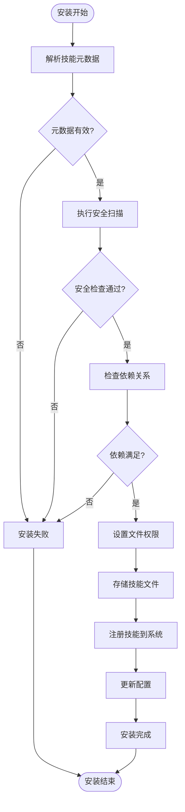
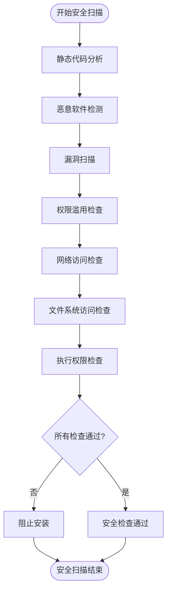
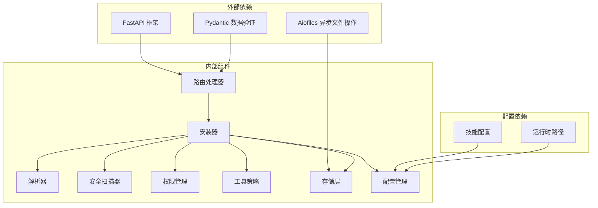

# 技能安装操作

<cite>
**本文档引用的文件**
- [skills.py](file://backend/app/gateway/routers/skills.py)
- [installer.py](file://backend/packages/harness/deerflow/skills/installer.py)
- [parser.py](file://backend/packages/harness/deerflow/skills/parser.py)
- [permissions.py](file://backend/packages/harness/deerflow/skills/permissions.py)
- [security_scanner.py](file://backend/packages/harness/deerflow/skills/security_scanner.py)
- [tool_policy.py](file://backend/packages/harness/deerflow/skills/tool_policy.py)
- [types.py](file://backend/packages/harness/deerflow/skills/types.py)
- [storage](file://backend/packages/harness/deerflow/skills/storage)
- [skills_config.py](file://backend/packages/harness/deerflow/config/skills_config.py)
- [test_skills_installer.py](file://backend/tests/test_skills_installer.py)
- [test_skills_parser.py](file://backend/tests/test_skills_parser.py)
- [test_skills_validation.py](file://backend/tests/test_skills_validation.py)
- [test_skills_loader.py](file://backend/tests/test_skills_loader.py)
- [test_skills_custom_router.py](file://backend/tests/test_skills_custom_router.py)
- [SKILL.md](file://skills/public/bootstrap/SKILL.md)
- [Install.md](file://Install.md)
- [API.md](file://backend/docs/API.md)
</cite>

## 目录
1. [简介](#简介)
2. [项目结构](#项目结构)
3. [核心组件](#核心组件)
4. [架构概览](#架构概览)
5. [详细组件分析](#详细组件分析)
6. [依赖关系分析](#依赖关系分析)
7. [性能考虑](#性能考虑)
8. [故障排除指南](#故障排除指南)
9. [结论](#结论)
10. [附录](#附录)

## 简介
本文档详细说明了 DeerFlow 中 Skills 安装操作的完整实现，涵盖文件上传处理、解包验证、权限设置和注册机制。重点阐述了 POST /api/skills/install 端点的 multipart/form-data 请求格式、文件验证规则以及安装过程中的错误处理策略。同时介绍了技能包的元数据解析、依赖检查、安全扫描和冲突检测机制，并提供了完整的安装示例、调试方法和故障排除指南。

## 项目结构
Skills 安装功能主要分布在以下模块中：



**图表来源**
- [skills.py:1-200](file://backend/app/gateway/routers/skills.py#L1-L200)
- [installer.py:1-300](file://backend/packages/harness/deerflow/skills/installer.py#L1-L300)

**章节来源**
- [skills.py:1-200](file://backend/app/gateway/routers/skills.py#L1-L200)
- [installer.py:1-300](file://backend/packages/harness/deerflow/skills/installer.py#L1-L300)

## 核心组件
本节深入分析 Skills 安装系统的核心组件及其职责分工。

### 路由处理器 (skills.py)
路由处理器负责接收和验证来自客户端的安装请求，执行必要的权限检查，并将请求转发给安装器组件。

### 安装器 (installer.py)
安装器是整个安装流程的核心协调者，负责：
- 接收和验证上传的技能包文件
- 解析技能元数据和配置
- 执行安全扫描和权限验证
- 处理文件解包和存储
- 注册新技能到系统中

### 解析器 (parser.py)
解析器专门处理技能包内的元数据文件，提取技能的基本信息、依赖关系和配置参数。

### 权限管理 (permissions.py)
权限管理组件确保技能安装符合系统的安全策略，验证安装者的权限级别并应用适当的访问控制。

### 安全扫描 (security_scanner.py)
安全扫描器对技能包进行多层安全检查，识别潜在的安全威胁和恶意内容。

**章节来源**
- [skills.py:1-200](file://backend/app/gateway/routers/skills.py#L1-L200)
- [installer.py:1-300](file://backend/packages/harness/deerflow/skills/installer.py#L1-L300)
- [parser.py:1-200](file://backend/packages/harness/deerflow/skills/parser.py#L1-L200)
- [permissions.py:1-150](file://backend/packages/harness/deerflow/skills/permissions.py#L1-L150)
- [security_scanner.py:1-200](file://backend/packages/harness/deerflow/skills/security_scanner.py#L1-L200)

## 架构概览
Skills 安装系统采用分层架构设计，确保功能模块的高内聚和低耦合。



**图表来源**
- [skills.py:1-200](file://backend/app/gateway/routers/skills.py#L1-L200)
- [installer.py:1-300](file://backend/packages/harness/deerflow/skills/installer.py#L1-L300)
- [parser.py:1-200](file://backend/packages/harness/deerflow/skills/parser.py#L1-L200)
- [security_scanner.py:1-200](file://backend/packages/harness/deerflow/skills/security_scanner.py#L1-L200)

## 详细组件分析

### POST /api/skills/install 端点实现
该端点处理技能包的上传和安装请求，支持 multipart/form-data 格式。

#### 请求格式规范
- Content-Type: multipart/form-data
- 必需字段: `skill_package` (文件类型)
- 可选字段: `force` (布尔值，强制覆盖现有技能)
- 可选字段: `dry_run` (布尔值，仅验证不实际安装)

#### 响应格式
- 成功: 200 OK，返回技能安装详情
- 失败: 相应的错误状态码和错误信息



**图表来源**
- [skills.py:1-200](file://backend/app/gateway/routers/skills.py#L1-L200)

**章节来源**
- [skills.py:1-200](file://backend/app/gateway/routers/skills.py#L1-L200)

### 安装器工作流程
安装器协调整个安装过程，确保每个步骤都得到正确执行。

#### 安装流程图


**图表来源**
- [installer.py:1-300](file://backend/packages/harness/deerflow/skills/installer.py#L1-L300)

**章节来源**
- [installer.py:1-300](file://backend/packages/harness/deerflow/skills/installer.py#L1-L300)

### 元数据解析机制
解析器负责从技能包中提取关键信息，包括技能名称、版本、描述、依赖等。

#### 元数据结构
- 技能标识符: 唯一的技能名称和版本组合
- 基本信息: 名称、描述、作者、许可证
- 技术规格: 支持的平台、运行时要求
- 依赖关系: 明确列出的依赖项和版本范围
- 权限需求: 所需的系统权限和服务访问权限

**章节来源**
- [parser.py:1-200](file://backend/packages/harness/deerflow/skills/parser.py#L1-L200)
- [types.py:1-150](file://backend/packages/harness/deerflow/skills/types.py#L1-L150)

### 安全扫描实现
安全扫描器执行多层次的安全检查，确保技能包不会对系统造成威胁。

#### 安全检查流程


**图表来源**
- [security_scanner.py:1-200](file://backend/packages/harness/deerflow/skills/security_scanner.py#L1-L200)

**章节来源**
- [security_scanner.py:1-200](file://backend/packages/harness/deerflow/skills/security_scanner.py#L1-L200)

### 权限管理系统
权限管理确保技能安装符合组织的安全策略和访问控制要求。

#### 权限验证流程
- 用户身份验证和授权
- 技能安装目录的写入权限
- 系统资源访问权限检查
- 特殊权限（如网络访问）的额外验证

**章节来源**
- [permissions.py:1-150](file://backend/packages/harness/deerflow/skills/permissions.py#L1-L150)

### 工具策略引擎
工具策略组件管理技能中工具的使用规则和限制。

#### 策略检查要点
- 工具调用频率限制
- 资源使用配额
- 执行时间限制
- 输出大小限制

**章节来源**
- [tool_policy.py:1-150](file://backend/packages/harness/deerflow/skills/tool_policy.py#L1-L150)

## 依赖关系分析
Skills 安装系统各组件之间的依赖关系如下：



**图表来源**
- [skills.py:1-200](file://backend/app/gateway/routers/skills.py#L1-L200)
- [installer.py:1-300](file://backend/packages/harness/deerflow/skills/installer.py#L1-L300)
- [skills_config.py:1-200](file://backend/packages/harness/deerflow/config/skills_config.py#L1-L200)

**章节来源**
- [skills.py:1-200](file://backend/app/gateway/routers/skills.py#L1-L200)
- [installer.py:1-300](file://backend/packages/harness/deerflow/skills/installer.py#L1-L300)
- [skills_config.py:1-200](file://backend/packages/harness/deerflow/config/skills_config.py#L1-L200)

## 性能考虑
Skills 安装系统在设计时充分考虑了性能优化：

### 并发处理
- 使用异步文件操作减少 I/O 瓶颈
- 并行执行多个独立的安全扫描任务
- 流式处理大文件避免内存溢出

### 缓存策略
- 缓存已验证的技能元数据
- 缓存权限检查结果
- 缓存安全扫描结果以避免重复检查

### 内存管理
- 分块读取大型文件
- 及时释放临时文件句柄
- 限制并发安装任务数量

## 故障排除指南
本节提供常见问题的诊断和解决方法：

### 常见错误及解决方案

#### 400 错误：无效的请求格式
- 检查 Content-Type 是否为 multipart/form-data
- 确认必需字段 skill_package 是否存在
- 验证文件是否完整上传

#### 403 错误：权限不足
- 确认用户具有安装技能的权限
- 检查技能安装目录的写入权限
- 验证系统管理员配置

#### 413 错误：文件过大
- 检查服务器配置的最大文件大小限制
- 考虑压缩技能包或分块上传
- 联系系统管理员调整限制

#### 415 错误：不支持的文件类型
- 确认技能包使用受支持的压缩格式
- 验证文件扩展名正确性
- 检查文件头部魔数

### 调试方法
1. 启用详细日志记录
2. 使用 dry_run 模式进行预检查
3. 逐步验证每个安装步骤
4. 检查系统资源使用情况

**章节来源**
- [test_skills_installer.py:1-200](file://backend/tests/test_skills_installer.py#L1-L200)
- [test_skills_validation.py:1-200](file://backend/tests/test_skills_validation.py#L1-L200)

## 结论
DeerFlow 的 Skills 安装系统通过模块化的架构设计，实现了安全、可靠且高效的技能包安装功能。系统不仅提供了完整的安装流程，还包括了全面的安全检查、权限管理和错误处理机制。通过本文档提供的详细说明和最佳实践，开发者可以更好地理解和使用该系统，同时也能有效地进行故障排除和性能优化。

## 附录

### 安装示例
以下是一个完整的技能安装示例流程：

1. **准备技能包**
   - 创建符合规范的技能目录结构
   - 准备 SKILL.md 元数据文件
   - 压缩为受支持的格式

2. **发送安装请求**
   ```bash
   curl -X POST http://localhost:8000/api/skills/install \
     -H "Authorization: Bearer YOUR_TOKEN" \
     -F "skill_package=@/path/to/skill.zip"
   ```

3. **验证安装结果**
   - 检查返回的安装状态
   - 验证技能是否出现在技能列表中
   - 测试技能的基本功能

### 自定义技能开发最佳实践
- 遵循标准的技能目录结构
- 提供完整的元数据信息
- 实现适当的错误处理
- 进行充分的安全测试
- 文档化技能的使用方法和限制

**章节来源**
- [SKILL.md:1-200](file://skills/public/bootstrap/SKILL.md#L1-L200)
- [Install.md:1-200](file://Install.md#L1-L200)
- [API.md:1-200](file://backend/docs/API.md#L1-L200)