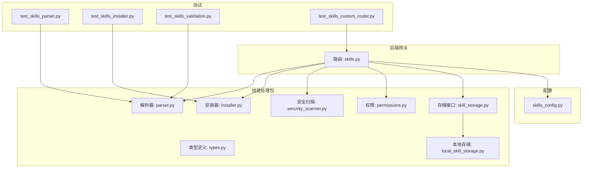
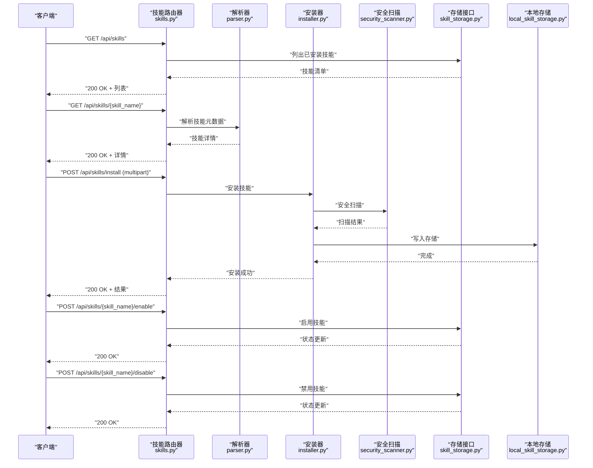
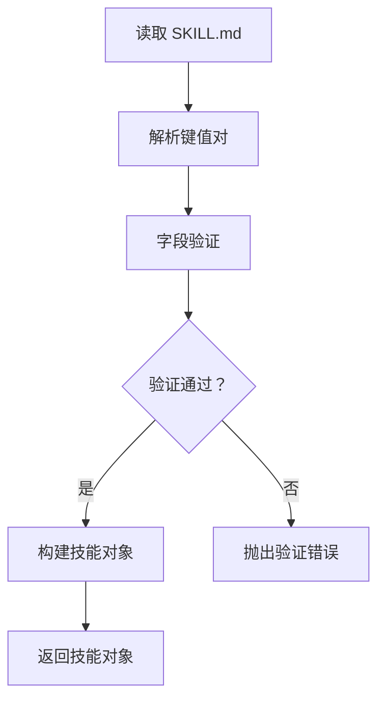
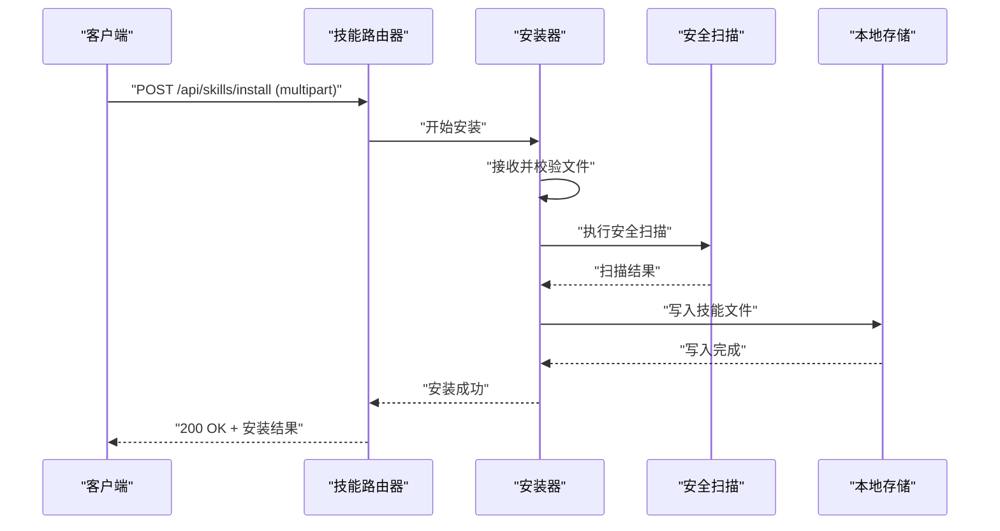
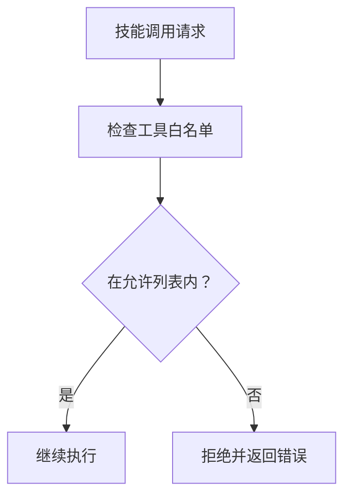
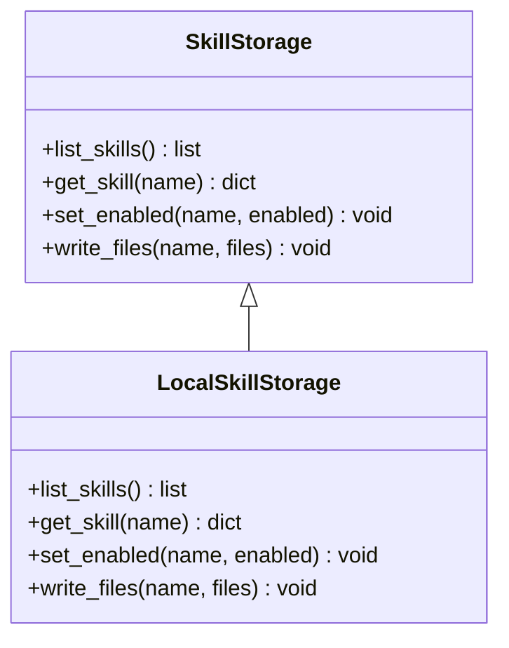
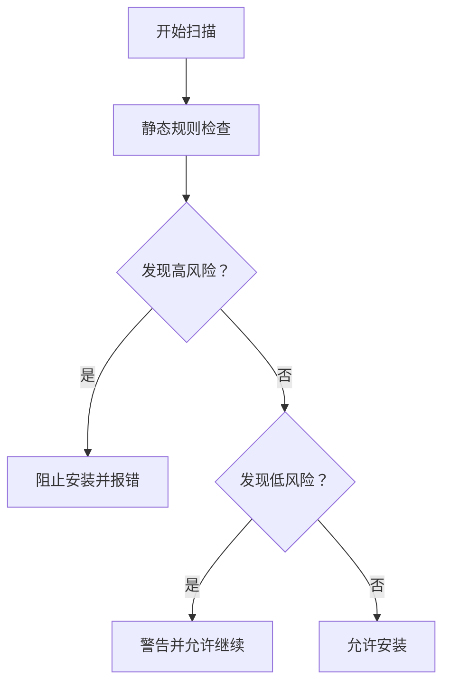
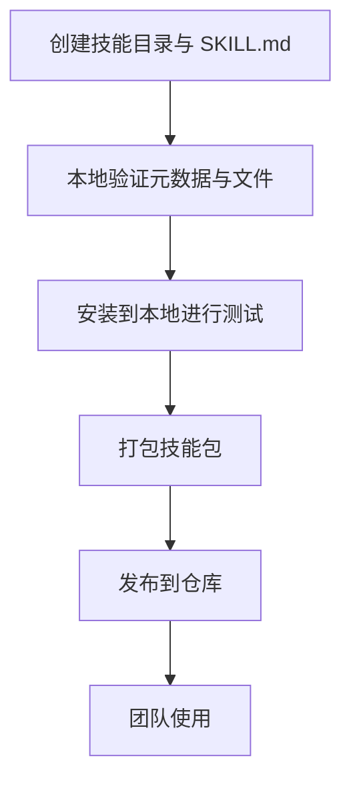
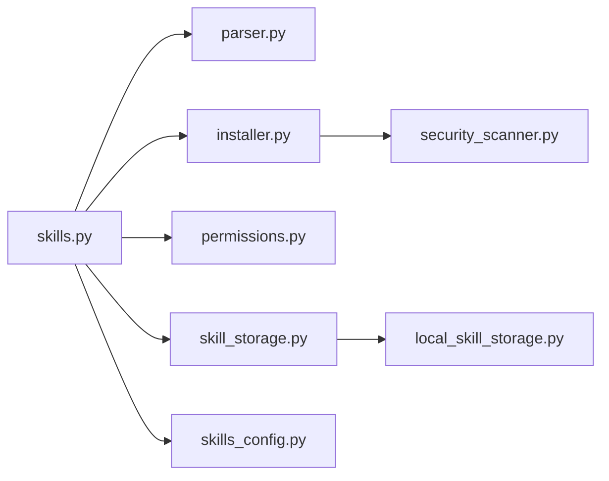

# 技能管理 API

<cite>
**本文档引用的文件**
- [skills.py](file://backend/app/gateway/routers/skills.py)
- [installer.py](file://backend/packages/harness/deerflow/skills/installer.py)
- [parser.py](file://backend/packages/harness/deerflow/skills/parser.py)
- [permissions.py](file://backend/packages/harness/deerflow/skills/permissions.py)
- [security_scanner.py](file://backend/packages/harness/deerflow/skills/security_scanner.py)
- [types.py](file://backend/packages/harness/deerflow/skills/types.py)
- [local_skill_storage.py](file://backend/packages/harness/deerflow/skills/storage/local_skill_storage.py)
- [skill_storage.py](file://backend/packages/harness/deerflow/skills/storage/skill_storage.py)
- [skills_config.py](file://backend/packages/harness/deerflow/config/skills_config.py)
- [test_skills_parser.py](file://backend/tests/test_skills_parser.py)
- [test_skills_installer.py](file://backend/tests/test_skills_installer.py)
- [test_skills_validation.py](file://backend/tests/test_skills_validation.py)
- [test_skills_custom_router.py](file://backend/tests/test_skills_custom_router.py)
- [SKILL.md](file://skills/public/bootstrap/SKILL.md)
- [SKILL.md](file://skills/public/skill-creator/SKILL.md)
- [SKILL.md](file://skills/public/systematic-literature-review/SKILL.md)
</cite>

## 目录
1. [简介](#简介)
2. [项目结构](#项目结构)
3. [核心组件](#核心组件)
4. [架构总览](#架构总览)
5. [详细组件分析](#详细组件分析)
6. [依赖关系分析](#依赖关系分析)
7. [性能考虑](#性能考虑)
8. [故障排除指南](#故障排除指南)
9. [结论](#结论)
10. [附录](#附录)

## 简介
本文件为 DeerFlow Skills Management API 的权威参考文档，覆盖技能管理的完整端点设计与实现细节，包括：
- 技能列表查询：GET /api/skills
- 技能详情获取：GET /api/skills/{skill_name}
- 启用技能：POST /api/skills/{skill_name}/enable
- 禁用技能：POST /api/skills/{skill_name}/disable
- 安装新技能：POST /api/skills/install（支持文件上传）

文档同时阐述技能元数据结构、权限管理、版本控制与安全扫描机制，并提供自定义技能开发与发布的完整流程。

## 项目结构
技能管理相关代码主要分布在后端网关路由层与技能处理包中：
- 路由层：/backend/app/gateway/routers/skills.py 提供 REST API 入口
- 技能处理包：/backend/packages/harness/deerflow/skills 下包含解析、安装、权限、存储等模块
- 配置：/backend/packages/harness/deerflow/config/skills_config.py
- 测试：/backend/tests 下多处针对技能解析、安装、验证与路由的测试



**图表来源**
- [skills.py](file://backend/app/gateway/routers/skills.py)
- [parser.py](file://backend/packages/harness/deerflow/skills/parser.py)
- [installer.py](file://backend/packages/harness/deerflow/skills/installer.py)
- [security_scanner.py](file://backend/packages/harness/deerflow/skills/security_scanner.py)
- [permissions.py](file://backend/packages/harness/deerflow/skills/permissions.py)
- [types.py](file://backend/packages/harness/deerflow/skills/types.py)
- [skill_storage.py](file://backend/packages/harness/deerflow/skills/storage/skill_storage.py)
- [local_skill_storage.py](file://backend/packages/harness/deerflow/skills/storage/local_skill_storage.py)
- [skills_config.py](file://backend/packages/harness/deerflow/config/skills_config.py)
- [test_skills_parser.py](file://backend/tests/test_skills_parser.py)
- [test_skills_installer.py](file://backend/tests/test_skills_installer.py)
- [test_skills_validation.py](file://backend/tests/test_skills_validation.py)
- [test_skills_custom_router.py](file://backend/tests/test_skills_custom_router.py)

**章节来源**
- [skills.py](file://backend/app/gateway/routers/skills.py)
- [skills_config.py](file://backend/packages/harness/deerflow/config/skills_config.py)

## 核心组件
- 路由器：提供技能管理的 HTTP 接口，负责参数校验、调用业务逻辑并返回标准化响应
- 解析器：从技能目录读取并解析 SKILL.md 元数据，生成技能描述对象
- 安装器：处理技能安装流程，包括解压、校验、写入存储与注册
- 权限模块：管理技能访问控制与工具授权策略
- 存储层：抽象技能存储接口，提供本地存储实现
- 安全扫描：对安装的技能进行安全检查，阻断高风险内容
- 类型定义：统一技能数据结构与枚举

**章节来源**
- [skills.py](file://backend/app/gateway/routers/skills.py)
- [parser.py](file://backend/packages/harness/deerflow/skills/parser.py)
- [installer.py](file://backend/packages/harness/deerflow/skills/installer.py)
- [permissions.py](file://backend/packages/harness/deerflow/skills/permissions.py)
- [security_scanner.py](file://backend/packages/harness/deerflow/skills/security_scanner.py)
- [types.py](file://backend/packages/harness/deerflow/skills/types.py)
- [skill_storage.py](file://backend/packages/harness/deerflow/skills/storage/skill_storage.py)
- [local_skill_storage.py](file://backend/packages/harness/deerflow/skills/storage/local_skill_storage.py)

## 架构总览
下图展示技能管理 API 的端到端交互流程，从客户端请求到后端处理再到存储与安全检查：



**图表来源**
- [skills.py](file://backend/app/gateway/routers/skills.py)
- [parser.py](file://backend/packages/harness/deerflow/skills/parser.py)
- [installer.py](file://backend/packages/harness/deerflow/skills/installer.py)
- [security_scanner.py](file://backend/packages/harness/deerflow/skills/security_scanner.py)
- [skill_storage.py](file://backend/packages/harness/deerflow/skills/storage/skill_storage.py)
- [local_skill_storage.py](file://backend/packages/harness/deerflow/skills/storage/local_skill_storage.py)

## 详细组件分析

### 路由器与端点设计
- GET /api/skills
  - 功能：返回所有已安装技能的简要信息（名称、显示名、描述、许可证、路径、是否启用）
  - 响应：数组，元素为技能对象
- GET /api/skills/{skill_name}
  - 功能：返回指定技能的完整元数据与运行时信息
  - 参数：路径参数 skill_name
  - 响应：技能对象
- POST /api/skills/{skill_name}/enable
  - 功能：启用指定技能
  - 参数：路径参数 skill_name
  - 响应：状态更新结果
- POST /api/skills/{skill_name}/disable
  - 功能：禁用指定技能
  - 参数：路径参数 skill_name
  - 响应：状态更新结果
- POST /api/skills/install
  - 功能：安装新技能，支持 multipart/form-data 上传压缩包或脚本集合
  - 请求体：multipart 表单字段
    - file：必填，技能包文件（zip/tar.gz 等）
    - overwrite：可选，布尔值，是否覆盖同名技能
  - 响应：安装结果与错误信息

```mermaid
flowchart TD
Start(["请求进入"]) --> Route{"选择端点"}
Route --> |GET /api/skills| List["列举技能"]
Route --> |GET /api/skills/{name}| Detail["获取详情"]
Route --> |POST /api/skills/{name}/enable| Enable["启用技能"]
Route --> |POST /api/skills/{name}/disable| Disable["禁用技能"]
Route --> |POST /api/skills/install| Install["安装技能"]
List --> ReturnList["返回技能列表"]
Detail --> ReturnDetail["返回技能详情"]
Enable --> UpdateStatus["更新状态"]
Disable --> UpdateStatus
Install --> Upload["接收文件上传"]
Upload --> Parse["解析元数据"]
Parse --> Scan["安全扫描"]
Scan --> Store["写入存储"]
Store --> Done["返回安装结果"]
```

**图表来源**
- [skills.py](file://backend/app/gateway/routers/skills.py)

**章节来源**
- [skills.py](file://backend/app/gateway/routers/skills.py)

### 技能元数据结构
技能元数据通过解析 SKILL.md 生成，典型字段包括：
- 名称：技能唯一标识符（小写、连字符）
- 显示名称：用于 UI 展示的人类可读名称
- 描述：技能用途与能力概述
- 许可证：开源许可证类型
- 路径：技能在文件系统中的根路径
- 允许工具列表：该技能可使用的工具白名单
- 版本：技能版本号（语义化版本）
- 作者/维护者：联系信息
- 依赖：其他技能或外部资源依赖
- 运行参数：可配置的运行时参数

上述字段来源于公共技能示例文件，如 bootstrap、skill-creator、systematic-literature-review 等的 SKILL.md。

**章节来源**
- [SKILL.md](file://skills/public/bootstrap/SKILL.md)
- [SKILL.md](file://skills/public/skill-creator/SKILL.md)
- [SKILL.md](file://skills/public/systematic-literature-review/SKILL.md)

### 解析器与验证
- 解析器：读取 SKILL.md 并提取键值对，构建技能描述对象；处理多语言描述与复杂字段
- 验证器：确保元数据完整性（必需字段）、格式正确性（版本号、URL、邮箱等）与一致性（名称与路径匹配）



**图表来源**
- [parser.py](file://backend/packages/harness/deerflow/skills/parser.py)
- [test_skills_parser.py](file://backend/tests/test_skills_parser.py)
- [test_skills_validation.py](file://backend/tests/test_skills_validation.py)

**章节来源**
- [parser.py](file://backend/packages/harness/deerflow/skills/parser.py)
- [test_skills_parser.py](file://backend/tests/test_skills_parser.py)
- [test_skills_validation.py](file://backend/tests/test_skills_validation.py)

### 安装器与文件上传处理
- 文件上传：支持 multipart/form-data，要求包含 file 字段；可选 overwrite 控制覆盖行为
- 安装流程：
  1. 接收并校验上传文件
  2. 解析元数据（SKILL.md）
  3. 安全扫描（见安全扫描章节）
  4. 写入本地存储（目标目录由配置决定）
  5. 注册技能（更新索引/缓存）
  6. 返回安装结果



**图表来源**
- [skills.py](file://backend/app/gateway/routers/skills.py)
- [installer.py](file://backend/packages/harness/deerflow/skills/installer.py)
- [security_scanner.py](file://backend/packages/harness/deerflow/skills/security_scanner.py)
- [local_skill_storage.py](file://backend/packages/harness/deerflow/skills/storage/local_skill_storage.py)

**章节来源**
- [installer.py](file://backend/packages/harness/deerflow/skills/installer.py)
- [test_skills_installer.py](file://backend/tests/test_skills_installer.py)

### 权限管理与工具策略
- 工具白名单：每个技能可声明允许使用的工具列表，未在白名单内的工具调用将被拒绝
- 角色与域：结合全局权限策略，限制不同用户/会话对技能的访问范围
- 策略评估：在技能执行前评估当前上下文是否满足工具使用条件



**图表来源**
- [permissions.py](file://backend/packages/harness/deerflow/skills/permissions.py)
- [tool_policy.py](file://backend/packages/harness/deerflow/skills/tool_policy.py)

**章节来源**
- [permissions.py](file://backend/packages/harness/deerflow/skills/permissions.py)
- [tool_policy.py](file://backend/packages/harness/deerflow/skills/tool_policy.py)

### 存储与版本控制
- 存储接口：抽象技能文件与元数据的持久化方式
- 本地存储：默认实现，将技能写入本地文件系统，按名称与版本组织
- 版本控制：同一技能的不同版本共存，安装时可选择覆盖或保留旧版本（受 overwrite 影响）



**图表来源**
- [skill_storage.py](file://backend/packages/harness/deerflow/skills/storage/skill_storage.py)
- [local_skill_storage.py](file://backend/packages/harness/deerflow/skills/storage/local_skill_storage.py)

**章节来源**
- [skill_storage.py](file://backend/packages/harness/deerflow/skills/storage/skill_storage.py)
- [local_skill_storage.py](file://backend/packages/harness/deerflow/skills/storage/local_skill_storage.py)

### 安全扫描机制
- 扫描范围：安装前对上传文件进行静态扫描，识别潜在恶意脚本、危险命令与不合规内容
- 处理策略：发现高风险内容时拒绝安装并返回错误；低风险内容可提示但允许继续
- 配置开关：可通过配置启用/禁用扫描或调整严格程度



**图表来源**
- [security_scanner.py](file://backend/packages/harness/deerflow/skills/security_scanner.py)

**章节来源**
- [security_scanner.py](file://backend/packages/harness/deerflow/skills/security_scanner.py)

### 自定义技能开发与发布流程
- 开发准备：创建技能目录，编写 SKILL.md（包含名称、显示名、描述、许可证、允许工具列表等），准备脚本与模板
- 本地验证：使用解析器与验证器检查元数据与文件结构
- 安装测试：通过 POST /api/skills/install 将技能安装到本地环境进行功能验证
- 发布准备：打包为压缩包，遵循版本命名规范
- 上线发布：将技能包提交至公共仓库或内部镜像源，供团队共享



**章节来源**
- [SKILL.md](file://skills/public/bootstrap/SKILL.md)
- [SKILL.md](file://skills/public/skill-creator/SKILL.md)
- [test_skills_custom_router.py](file://backend/tests/test_skills_custom_router.py)

## 依赖关系分析
- 路由器依赖解析器、安装器、权限模块与存储接口
- 安装器依赖解析器与安全扫描器
- 存储接口由本地存储实现
- 配置模块提供技能存储根路径与行为开关



**图表来源**
- [skills.py](file://backend/app/gateway/routers/skills.py)
- [parser.py](file://backend/packages/harness/deerflow/skills/parser.py)
- [installer.py](file://backend/packages/harness/deerflow/skills/installer.py)
- [security_scanner.py](file://backend/packages/harness/deerflow/skills/security_scanner.py)
- [permissions.py](file://backend/packages/harness/deerflow/skills/permissions.py)
- [skill_storage.py](file://backend/packages/harness/deerflow/skills/storage/skill_storage.py)
- [local_skill_storage.py](file://backend/packages/harness/deerflow/skills/storage/local_skill_storage.py)
- [skills_config.py](file://backend/packages/harness/deerflow/config/skills_config.py)

**章节来源**
- [skills.py](file://backend/app/gateway/routers/skills.py)
- [skills_config.py](file://backend/packages/harness/deerflow/config/skills_config.py)

## 性能考虑
- 列表与详情查询：建议对技能目录进行缓存，避免频繁 IO；对大型仓库可分页返回
- 安装过程：并发上传可能导致磁盘争用，建议限制并发数并采用队列化处理
- 安全扫描：扫描时间与文件大小成正比，建议异步扫描并在安装完成后返回进度
- 存储写入：批量写入优于逐文件写入，减少文件系统开销

## 故障排除指南
- 安装失败
  - 检查上传文件格式与大小限制
  - 查看解析错误日志，确认 SKILL.md 格式正确
  - 确认安全扫描未拦截可疑内容
- 启用/禁用失败
  - 检查存储权限与磁盘空间
  - 确认技能名称拼写正确且存在
- 详情为空
  - 确认技能已安装并处于启用状态
  - 检查解析器是否能正确读取元数据

**章节来源**
- [test_skills_parser.py](file://backend/tests/test_skills_parser.py)
- [test_skills_installer.py](file://backend/tests/test_skills_installer.py)
- [test_skills_validation.py](file://backend/tests/test_skills_validation.py)
- [test_skills_custom_router.py](file://backend/tests/test_skills_custom_router.py)

## 结论
Skills Management API 提供了从安装、解析、权限控制到安全扫描与存储的完整闭环。通过标准化的 SKILL.md 元数据与严格的安装流程，确保技能生态的安全与可维护性。建议在生产环境中开启安全扫描、合理设置权限白名单，并对安装流程进行异步化与缓存优化以提升用户体验。

## 附录
- 端点一览
  - GET /api/skills：获取技能列表
  - GET /api/skills/{skill_name}：获取技能详情
  - POST /api/skills/{skill_name}/enable：启用技能
  - POST /api/skills/{skill_name}/disable：禁用技能
  - POST /api/skills/install：安装技能（multipart/form-data）
- 请求参数与响应格式
  - 列表与详情：返回技能对象数组/单个对象，包含名称、显示名、描述、许可证、路径、允许工具列表、启用状态等
  - 安装：请求体为 multipart 表单，包含 file 与可选 overwrite；响应包含安装状态与错误信息
- 元数据字段参考
  - 必需字段：名称、显示名称、描述、许可证、允许工具列表
  - 可选字段：版本、作者、依赖、运行参数等