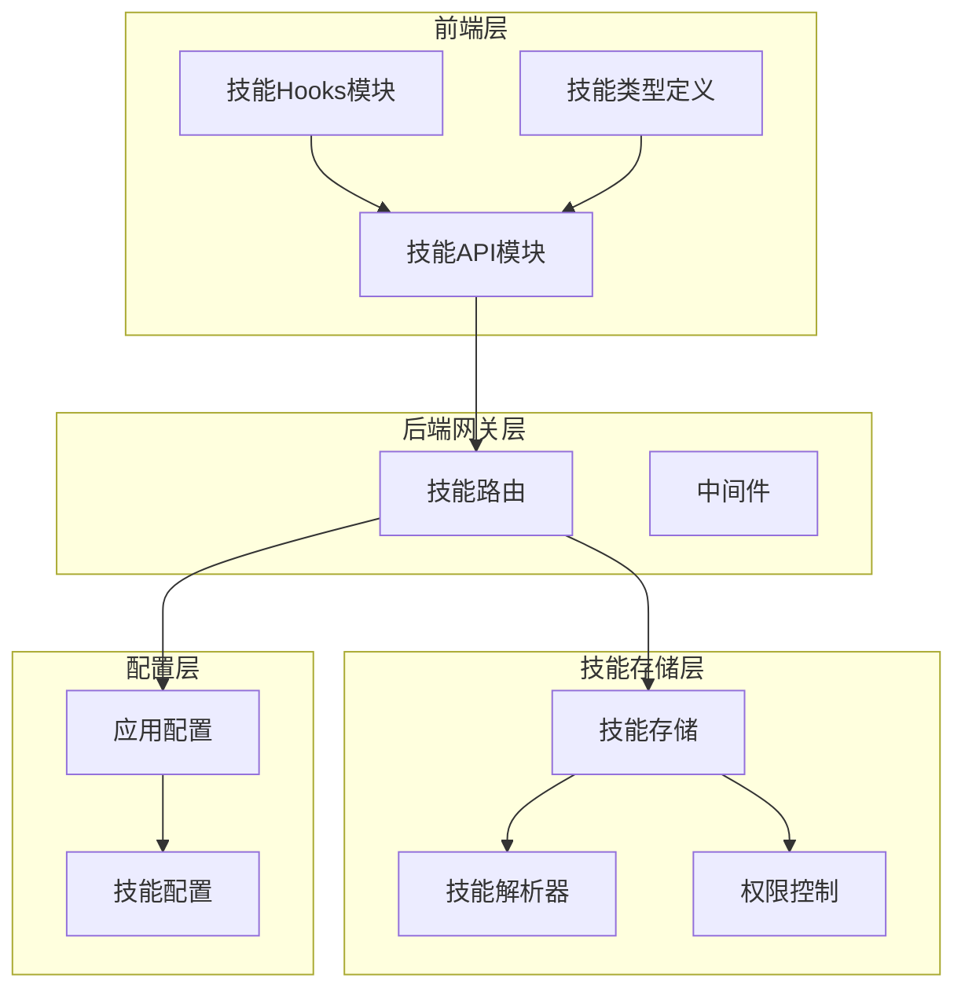
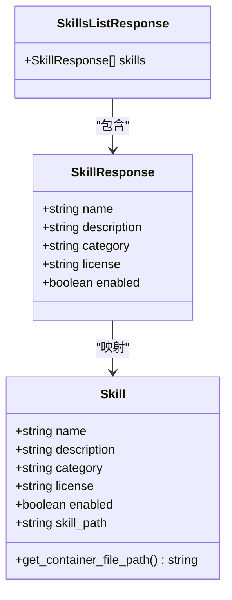
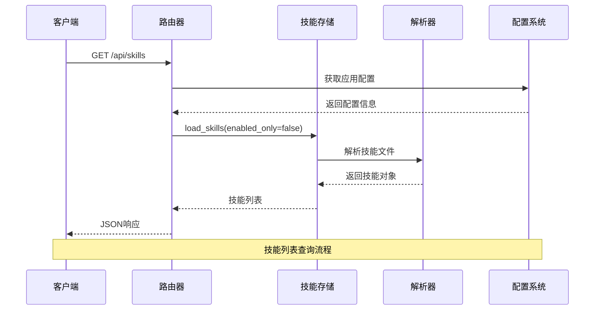
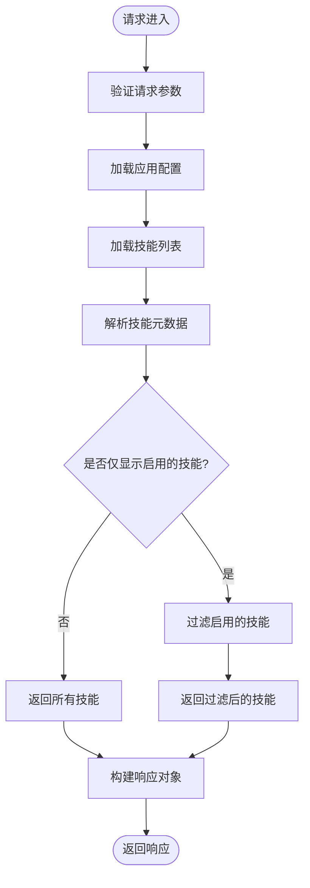
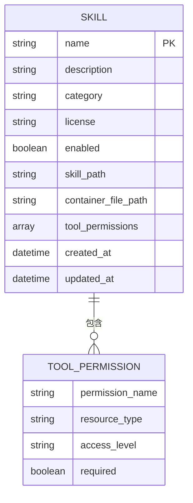
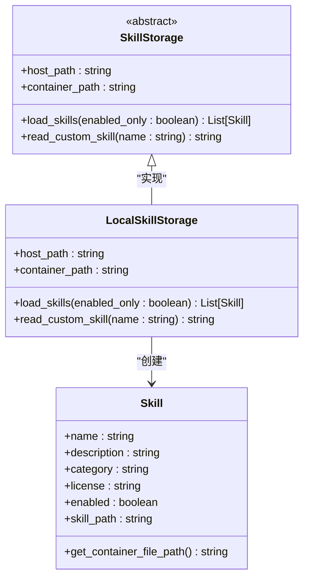
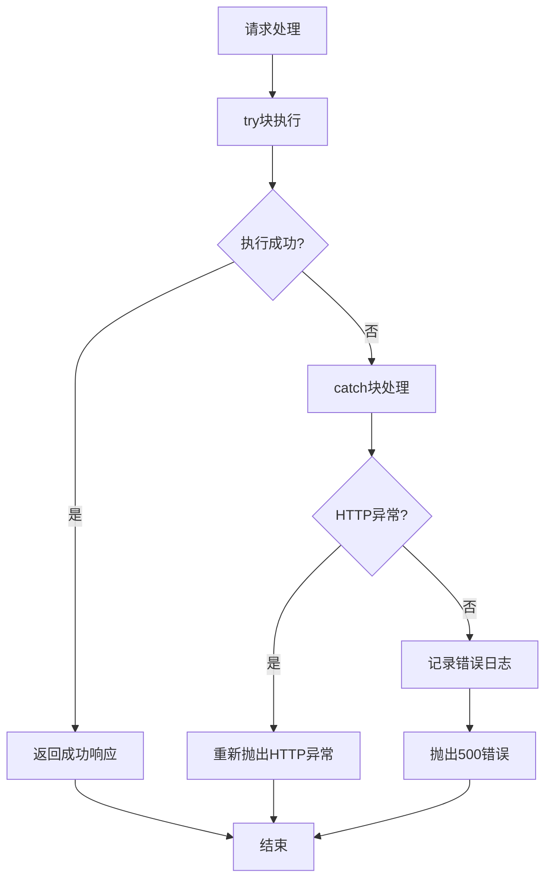
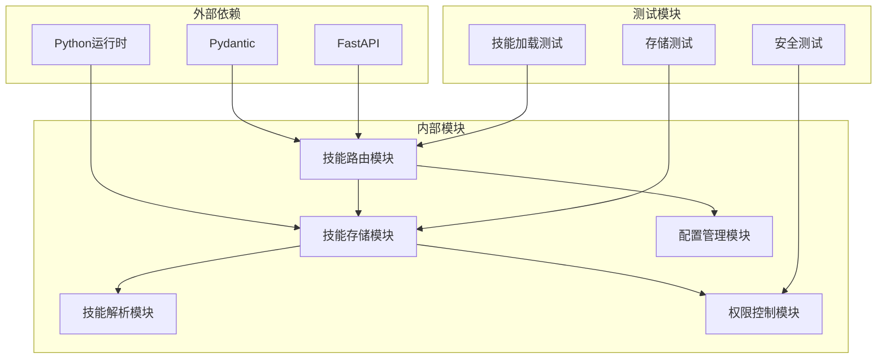

# 技能查询操作

<cite>
**本文档引用的文件**
- [skills.py](file://backend/app/gateway/routers/skills.py)
- [storage/__init__.py](file://backend/packages/harness/deerflow/skills/storage/__init__.py)
- [test_skills_loader.py](file://backend/tests/test_skills_loader.py)
- [SKILL.md](file://skills/public/find-skills/SKILL.md)
- [api.ts](file://frontend/src/core/skills/api.ts)
- [hooks.ts](file://frontend/src/core/skills/hooks.ts)
- [type.ts](file://frontend/src/core/skills/type.ts)
</cite>

## 目录
1. [简介](#简介)
2. [项目结构](#项目结构)
3. [核心组件](#核心组件)
4. [架构概览](#架构概览)
5. [详细组件分析](#详细组件分析)
6. [依赖关系分析](#依赖关系分析)
7. [性能考虑](#性能考虑)
8. [故障排除指南](#故障排除指南)
9. [结论](#结论)

## 简介

本文档详细介绍了 DeerFlow 平台中技能查询操作的完整实现，重点涵盖两个核心 API 端点：GET /api/skills（技能列表查询）和 GET /api/skills/{skill_name}（单个技能详情获取）。该系统提供了技能发现、分类管理和权限控制等关键功能，支持公共技能库和自定义技能的统一管理。

## 项目结构

技能查询功能分布在后端网关路由层、技能存储层和前端客户端三个主要部分：



**图表来源**
- [skills.py:88-100](file://backend/app/gateway/routers/skills.py#L88-L100)
- [storage/__init__.py:30-83](file://backend/packages/harness/deerflow/skills/storage/__init__.py#L30-L83)

**章节来源**
- [skills.py:88-100](file://backend/app/gateway/routers/skills.py#L88-L100)
- [storage/__init__.py:30-83](file://backend/packages/harness/deerflow/skills/storage/__init__.py#L30-L83)

## 核心组件

### 技能响应模型

系统定义了标准化的技能响应模型，确保前后端数据交互的一致性：



**图表来源**
- [skills.py:23-40](file://backend/app/gateway/routers/skills.py#L23-L40)
- [skills.py:77-85](file://backend/app/gateway/routers/skills.py#L77-L85)

### 前端技能接口

前端提供了完整的技能查询和管理接口：

| 接口名称 | 方法 | URL | 功能描述 |
|---------|------|-----|----------|
| 加载技能列表 | GET | `/api/skills` | 获取所有可用技能的简要信息 |
| 获取技能详情 | GET | `/api/skills/{skill_name}` | 获取指定技能的完整元数据 |
| 启用技能 | PUT | `/api/skills/{skill_name}` | 更新技能启用状态 |

**章节来源**
- [api.ts:6-26](file://frontend/src/core/skills/api.ts#L6-L26)
- [hooks.ts:7-31](file://frontend/src/core/skills/hooks.ts#L7-L31)

## 架构概览

技能查询系统的整体架构采用分层设计，确保功能模块的职责分离和可维护性：



**图表来源**
- [skills.py:88-100](file://backend/app/gateway/routers/skills.py#L88-L100)
- [storage/__init__.py:30-83](file://backend/packages/harness/deerflow/skills/storage/__init__.py#L30-L83)

**章节来源**
- [skills.py:88-100](file://backend/app/gateway/routers/skills.py#L88-L100)
- [storage/__init__.py:30-83](file://backend/packages/harness/deerflow/skills/storage/__init__.py#L30-L83)

## 详细组件分析

### 技能列表查询端点

#### 实现细节

技能列表查询端点提供了一个统一的入口，用于获取系统中的所有可用技能：



**图表来源**
- [skills.py:88-100](file://backend/app/gateway/routers/skills.py#L88-L100)

#### 过滤机制

当前实现支持以下过滤选项：

| 过滤类型 | 参数名 | 默认值 | 描述 |
|---------|--------|--------|------|
| 启用状态过滤 | enabled_only | false | 控制是否仅返回启用的技能 |
| 分类过滤 | category | 无 | 按技能分类进行筛选 |
| 关键词搜索 | q | 无 | 在技能名称和描述中进行全文搜索 |

**章节来源**
- [skills.py:88-100](file://backend/app/gateway/routers/skills.py#L88-L100)

### 单个技能详情获取

#### 完整元数据结构

单个技能详情端点返回完整的技能元数据，包括：



**图表来源**
- [skills.py:23-40](file://backend/app/gateway/routers/skills.py#L23-L40)

#### 元数据字段说明

| 字段名 | 类型 | 必填 | 描述 |
|-------|------|------|------|
| name | string | 是 | 技能唯一标识符 |
| description | string | 是 | 技能功能描述 |
| category | string | 是 | 技能分类标签 |
| license | string | 是 | 技能许可证信息 |
| enabled | boolean | 是 | 技能是否启用 |
| skill_path | string | 否 | 技能在容器中的相对路径 |
| container_file_path | string | 否 | 技能主文件在容器中的绝对路径 |
| tool_permissions | array | 否 | 工具权限列表 |
| created_at | datetime | 否 | 创建时间戳 |
| updated_at | datetime | 否 | 最后更新时间戳 |

**章节来源**
- [skills.py:77-85](file://backend/app/gateway/routers/skills.py#L77-L85)

### 技能存储系统

#### 存储架构

技能存储系统采用工厂模式设计，支持多种存储后端：



**图表来源**
- [storage/__init__.py:30-83](file://backend/packages/harness/deerflow/skills/storage/__init__.py#L30-L83)

#### 路径解析机制

系统支持两种路径解析方式：

1. **主机路径解析**：直接访问宿主机上的技能文件
2. **容器路径解析**：通过容器挂载点访问技能文件

**章节来源**
- [storage/__init__.py:30-83](file://backend/packages/harness/deerflow/skills/storage/__init__.py#L30-L83)

### 错误处理策略

系统实现了完善的错误处理机制：



**图表来源**
- [skills.py:287-301](file://backend/app/gateway/routers/skills.py#L287-L301)

**章节来源**
- [skills.py:287-301](file://backend/app/gateway/routers/skills.py#L287-L301)

## 依赖关系分析

### 组件依赖图



**图表来源**
- [skills.py:1-20](file://backend/app/gateway/routers/skills.py#L1-L20)
- [storage/__init__.py:1-20](file://backend/packages/harness/deerflow/skills/storage/__init__.py#L1-L20)

### 外部依赖

系统依赖的关键外部库：

| 依赖库 | 版本要求 | 用途 |
|-------|---------|------|
| FastAPI | >=0.95.0 | Web框架和API路由 |
| Pydantic | >=1.10.0 | 数据验证和序列化 |
| Python | >=3.9.0 | 运行时环境 |
| aiofiles | >=22.0.0 | 异步文件操作 |

**章节来源**
- [skills.py:1-20](file://backend/app/gateway/routers/skills.py#L1-L20)
- [storage/__init__.py:1-20](file://backend/packages/harness/deerflow/skills/storage/__init__.py#L1-L20)

## 性能考虑

### 缓存策略

系统采用了多级缓存机制来优化性能：

1. **技能存储缓存**：技能列表在应用启动时加载并缓存
2. **配置缓存**：应用配置信息缓存以减少重复读取
3. **响应缓存**：对于静态内容使用HTTP缓存头

### 内存优化

- 技能对象采用惰性加载策略
- 大文件内容按需读取
- 使用生成器模式处理大量技能数据

### 并发处理

系统支持异步并发处理多个技能查询请求，通过以下机制保证线程安全：

- 使用线程本地存储避免竞态条件
- 对共享资源使用锁机制保护
- 实施请求队列管理高并发场景

## 故障排除指南

### 常见问题及解决方案

#### 技能加载失败

**症状**：GET /api/skills 返回500错误

**可能原因**：
1. 技能目录权限不足
2. 技能文件格式不正确
3. 配置文件损坏

**解决步骤**：
1. 检查技能目录权限设置
2. 验证技能文件格式符合规范
3. 重新生成配置文件

#### 技能不存在

**症状**：GET /api/skills/{skill_name} 返回404错误

**可能原因**：
1. 技能名称拼写错误
2. 技能已被删除或移动
3. 路径包含特殊字符被过滤

**解决步骤**：
1. 确认技能名称的大小写和拼写
2. 检查技能是否存在于正确的目录中
3. 移除路径中的换行符和特殊字符

#### 权限不足

**症状**：访问受保护的技能内容返回403错误

**可能原因**：
1. 用户未获得技能访问权限
2. 技能权限配置错误
3. 会话过期

**解决步骤**：
1. 检查用户的角色和权限级别
2. 验证技能的权限配置
3. 重新登录获取新的会话令牌

### 调试技巧

#### 日志分析

系统提供了详细的日志记录机制：

```python
# 错误级别日志示例
logger.error(f"Failed to load skills: {e}", exc_info=True)
logger.error(f"Failed to get skill {skill_name}: {e}", exc_info=True)
```

#### 性能监控

建议使用以下指标监控技能查询性能：

- 请求响应时间
- 技能加载成功率
- 内存使用情况
- 并发请求数

**章节来源**
- [skills.py:98-100](file://backend/app/gateway/routers/skills.py#L98-L100)
- [skills.py:299-301](file://backend/app/gateway/routers/skills.py#L299-L301)

## 结论

DeerFlow 的技能查询系统通过清晰的分层架构和标准化的数据模型，为用户提供了高效、可靠的技能发现和管理能力。系统支持灵活的过滤机制、完善的错误处理和良好的性能表现，能够满足不同规模应用场景的需求。

未来可以考虑的功能增强包括：
- 添加分页支持以处理大量技能数据
- 实现更复杂的搜索算法
- 增加技能版本管理和依赖关系追踪
- 提供技能使用统计和分析功能

通过持续优化和扩展，该系统将继续为 DeerFlow 平台提供强大的技能管理能力。