# 线程清理 API 文档

<cite>
**本文档引用的文件**
- [threads.py](file://backend/app/gateway/routers/threads.py)
- [paths.py](file://backend/packages/harness/deerflow/config/paths.py)
- [test_threads_router.py](file://backend/tests/test_threads_router.py)
- [hooks.ts](file://frontend/src/core/threads/hooks.ts)
- [uploads.py](file://backend/app/gateway/routers/uploads.py)
- [authz.py](file://backend/app/gateway/authz.py)
- [sql.py](file://backend/packages/harness/deerflow/persistence/thread_meta/sql.py)
- [memory.py](file://backend/packages/harness/deerflow/persistence/thread_meta/memory.py)
</cite>

## 目录
1. [简介](#简介)
2. [项目结构](#项目结构)
3. [核心组件](#核心组件)
4. [架构概览](#架构概览)
5. [详细组件分析](#详细组件分析)
6. [依赖关系分析](#依赖关系分析)
7. [性能考虑](#性能考虑)
8. [故障排除指南](#故障排除指南)
9. [结论](#结论)

## 简介

DeerFlow 线程清理 API 提供了完整的线程数据生命周期管理功能，特别是针对 DELETE /api/threads/{thread_id} 端点的实现。该 API 不仅清理本地文件系统中的线程数据，还与 LangGraph 平台集成，确保线程状态的一致性和完整性。

本系统采用多层清理策略：本地文件系统清理、LangGraph 检查点清理、以及线程元数据清理，确保数据完整性和安全性。系统实现了严格的输入验证、路径安全检查和错误处理机制。

## 项目结构

DeerFlow 线程清理功能主要分布在以下模块中：

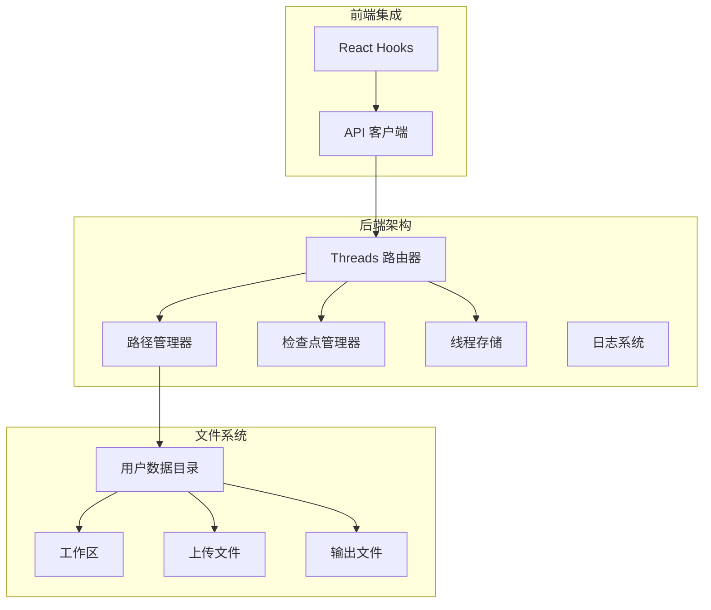

**图表来源**
- [threads.py:1-649](file://backend/app/gateway/routers/threads.py#L1-L649)
- [paths.py:62-351](file://backend/packages/harness/deerflow/config/paths.py#L62-L351)

**章节来源**
- [threads.py:1-649](file://backend/app/gateway/routers/threads.py#L1-L649)
- [paths.py:62-351](file://backend/packages/harness/deerflow/config/paths.py#L62-L351)

## 核心组件

### 线程清理路由器

线程清理 API 的核心实现位于 `threads.py` 文件中，提供了完整的 DELETE 端点处理逻辑：

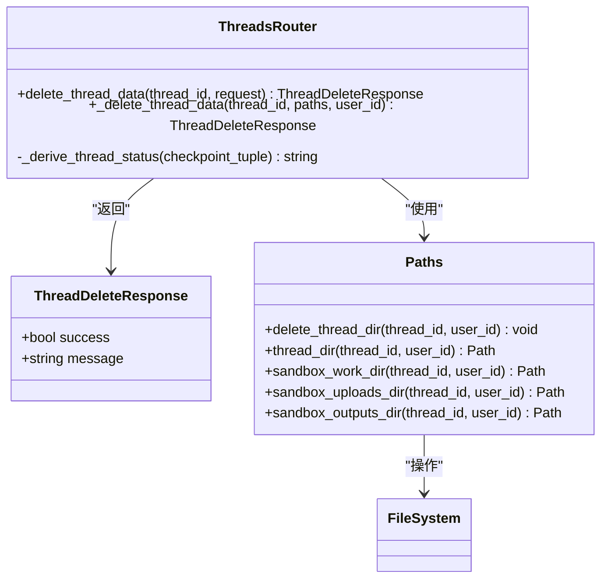

**图表来源**
- [threads.py:169-243](file://backend/app/gateway/routers/threads.py#L169-L243)
- [paths.py:282-309](file://backend/packages/harness/deerflow/config/paths.py#L282-L309)

### 路径管理系统

路径管理器负责安全地处理文件系统操作，防止路径遍历攻击：

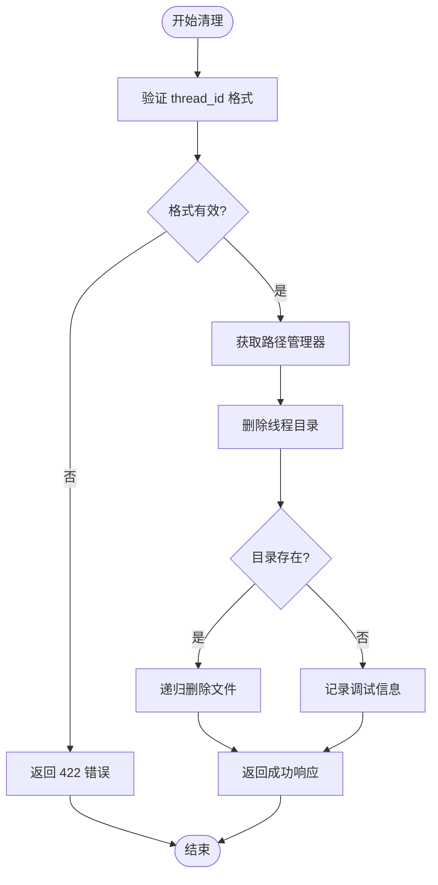

**图表来源**
- [paths.py:20-32](file://backend/packages/harness/deerflow/config/paths.py#L20-L32)
- [paths.py:282-289](file://backend/packages/harness/deerflow/config/paths.py#L282-L289)

**章节来源**
- [threads.py:169-243](file://backend/app/gateway/routers/threads.py#L169-L243)
- [paths.py:20-32](file://backend/packages/harness/deerflow/config/paths.py#L20-L32)
- [paths.py:282-289](file://backend/packages/harness/deerflow/config/paths.py#L282-L289)

## 架构概览

DeerFlow 线程清理系统采用分层架构设计，确保数据安全和操作可靠性：

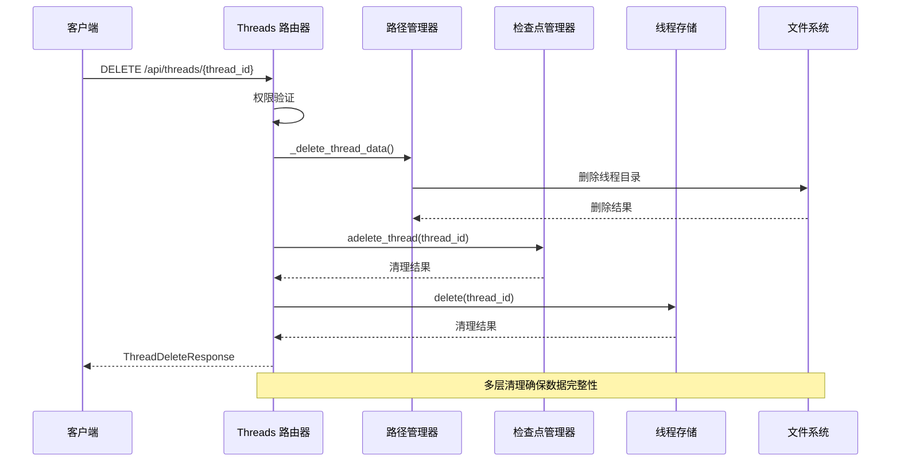

**图表来源**
- [threads.py:212-243](file://backend/app/gateway/routers/threads.py#L212-L243)
- [threads.py:169-185](file://backend/app/gateway/routers/threads.py#L169-L185)

系统架构的关键特点：

1. **多层清理策略**：本地文件系统清理 + LangGraph 检查点清理 + 线程元数据清理
2. **安全验证**：严格的输入验证和路径安全检查
3. **错误处理**：优雅的错误处理和日志记录
4. **幂等性**：支持重复调用而不产生副作用

## 详细组件分析

### DELETE /api/threads/{thread_id} 端点实现

#### 请求处理流程

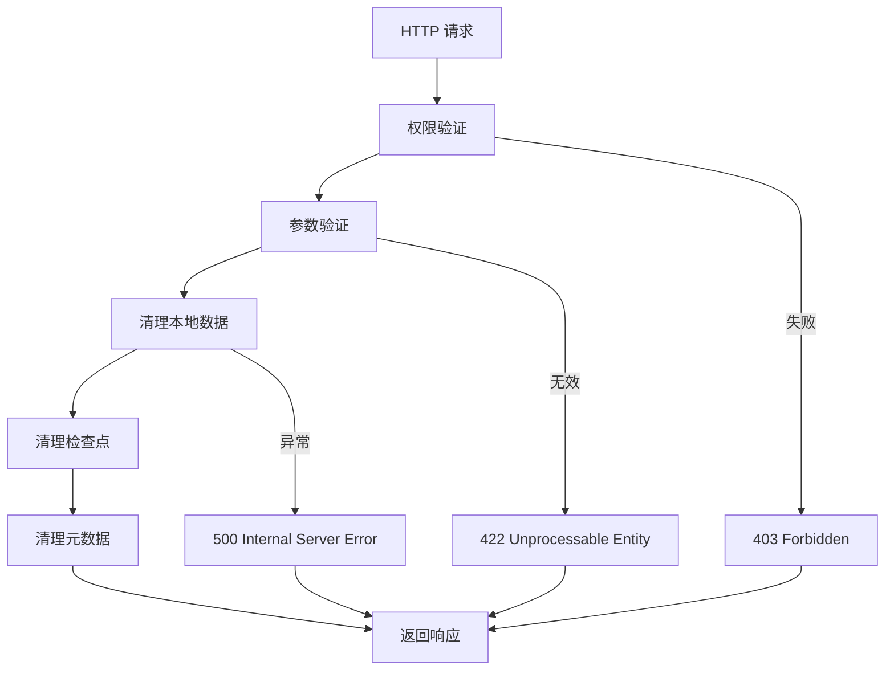

**图表来源**
- [threads.py:212-243](file://backend/app/gateway/routers/threads.py#L212-L243)

#### 权限控制机制

系统使用基于角色的访问控制（RBAC）确保只有授权用户才能删除线程：

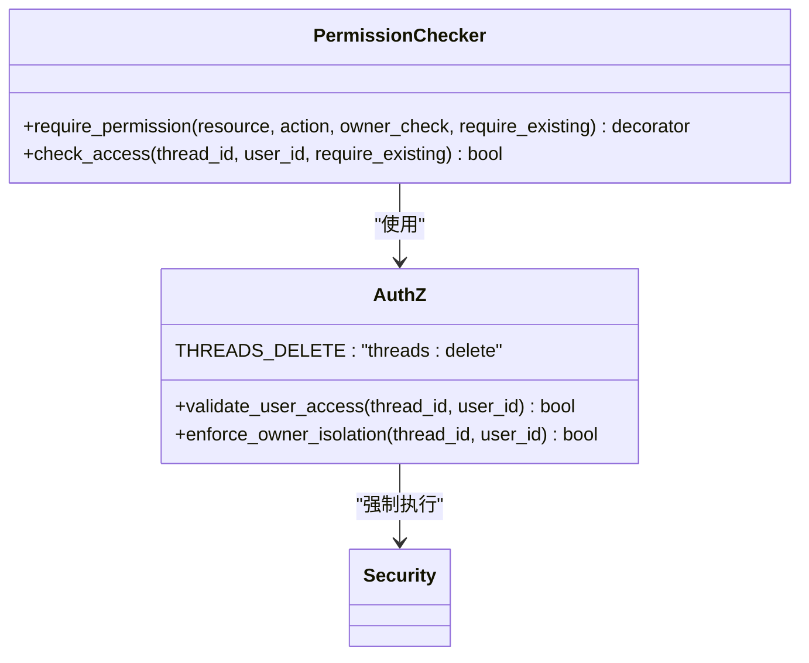

**图表来源**
- [authz.py:53](file://backend/app/gateway/authz.py#L53)
- [threads.py:213](file://backend/app/gateway/routers/threads.py#L213)

#### 数据清理流程详解

系统执行三级清理操作以确保数据完整性：

1. **本地文件系统清理**
   - 删除线程主目录及其所有子目录
   - 清理工作区、上传文件和输出文件
   - 支持用户隔离模式下的清理

2. **LangGraph 检查点清理**
   - 删除线程相关的检查点数据
   - 清理运行历史和状态信息
   - 支持异步清理操作

3. **线程元数据清理**
   - 从线程存储中删除元数据记录
   - 更新搜索索引以移除已删除的线程
   - 维护数据一致性

**章节来源**
- [threads.py:212-243](file://backend/app/gateway/routers/threads.py#L212-L243)
- [paths.py:282-289](file://backend/packages/harness/deerflow/config/paths.py#L282-L289)

### 错误处理和回滚机制

#### 错误分类和处理策略

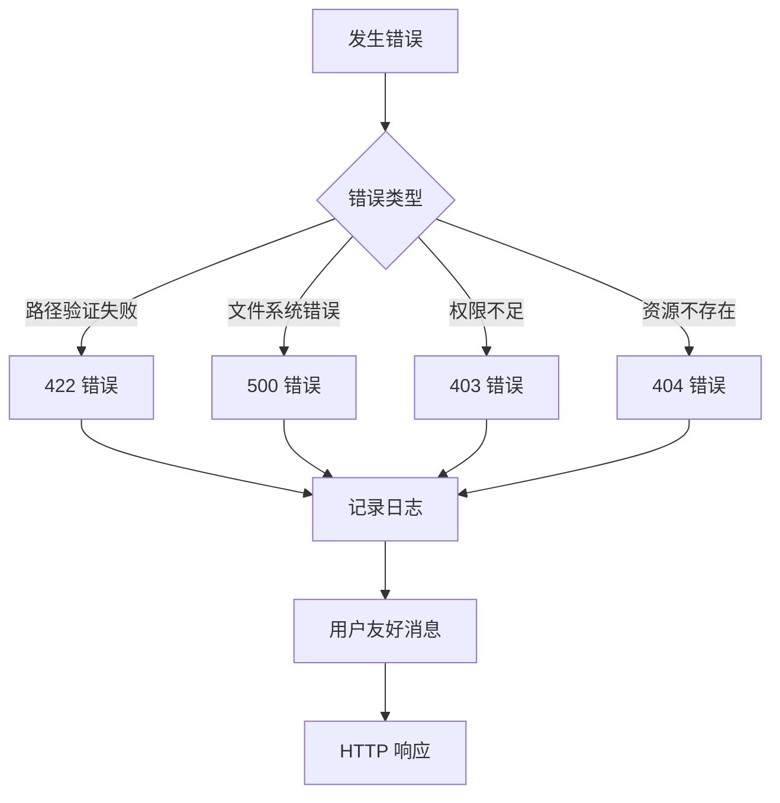

**图表来源**
- [threads.py:169-185](file://backend/app/gateway/routers/threads.py#L169-L185)

#### 回滚机制设计

系统采用"尽力而为"的清理策略，确保即使部分清理失败也不会影响整体数据完整性：

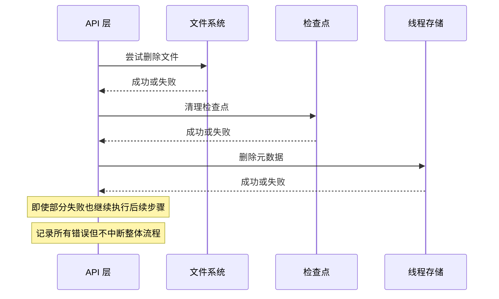

**图表来源**
- [threads.py:226-242](file://backend/app/gateway/routers/threads.py#L226-L242)

**章节来源**
- [threads.py:169-185](file://backend/app/gateway/routers/threads.py#L169-L185)
- [threads.py:226-242](file://backend/app/gateway/routers/threads.py#L226-L242)

### 日志记录和审计

#### 审计日志结构

系统为每个清理操作生成详细的审计日志：

| 字段 | 类型 | 描述 | 示例 |
|------|------|------|------|
| timestamp | datetime | 操作时间戳 | 2026-01-15T10:30:00Z |
| thread_id | string | 线程标识符 | thread-12345 |
| user_id | string | 执行用户 | user-67890 |
| action | string | 操作类型 | delete_thread |
| status | string | 操作状态 | success/failure |
| details | object | 详细信息 | 清理统计、错误信息 |

#### 日志级别和策略

```mermaid
graph LR
subgraph "日志级别"
Debug[DEBUG]
Info[INFO]
Warning[WARNING]
Error[ERROR]
end
subgraph "应用场景"
Debug --> "调试信息<br/>详细操作跟踪"
Info --> "成功操作<br/>清理完成通知"
Warning --> "潜在问题<br/>清理警告"
Error --> "错误情况<br/>异常处理"
end
```

**章节来源**
- [threads.py:176-185](file://backend/app/gateway/routers/threads.py#L176-L185)

## 依赖关系分析

### 组件间依赖关系

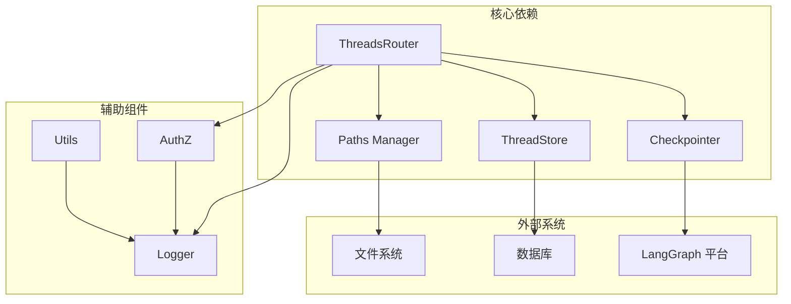

**图表来源**
- [threads.py:23-31](file://backend/app/gateway/routers/threads.py#L23-L31)

### 数据流分析

#### 清理操作的数据流

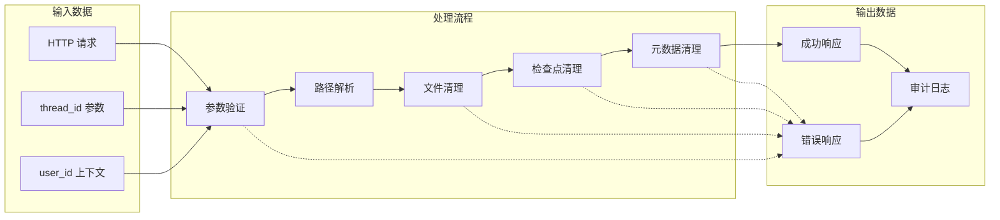

**图表来源**
- [threads.py:212-243](file://backend/app/gateway/routers/threads.py#L212-L243)

**章节来源**
- [threads.py:23-31](file://backend/app/gateway/routers/threads.py#L23-L31)
- [threads.py:212-243](file://backend/app/gateway/routers/threads.py#L212-L243)

## 性能考虑

### 清理操作优化策略

#### 并发处理优化

系统支持并发清理多个线程，通过异步操作提高效率：

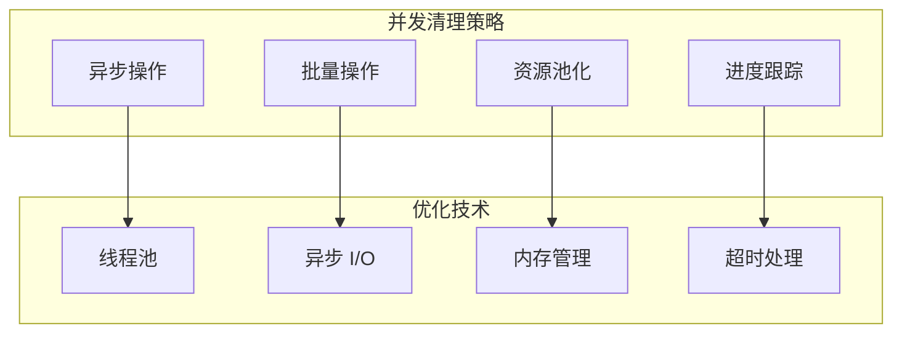

#### 存储空间回收策略

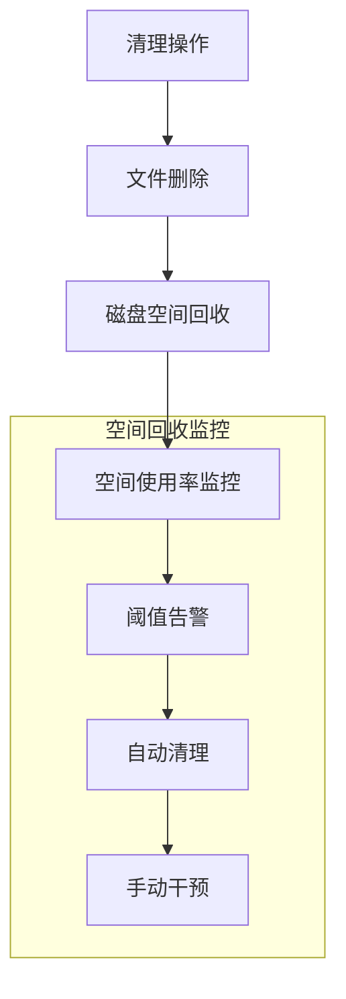

### 性能基准测试

系统提供了全面的性能测试套件，包括：

- **清理速度测试**：测量不同规模数据的清理时间
- **并发性能测试**：评估多线程同时清理的性能表现
- **内存使用测试**：监控清理过程中的内存占用
- **错误恢复测试**：验证系统在异常情况下的恢复能力

**章节来源**
- [test_threads_router.py:67-95](file://backend/tests/test_threads_router.py#L67-L95)
- [test_threads_router.py:155-169](file://backend/tests/test_threads_router.py#L155-L169)

## 故障排除指南

### 常见问题诊断

#### 线程清理失败排查

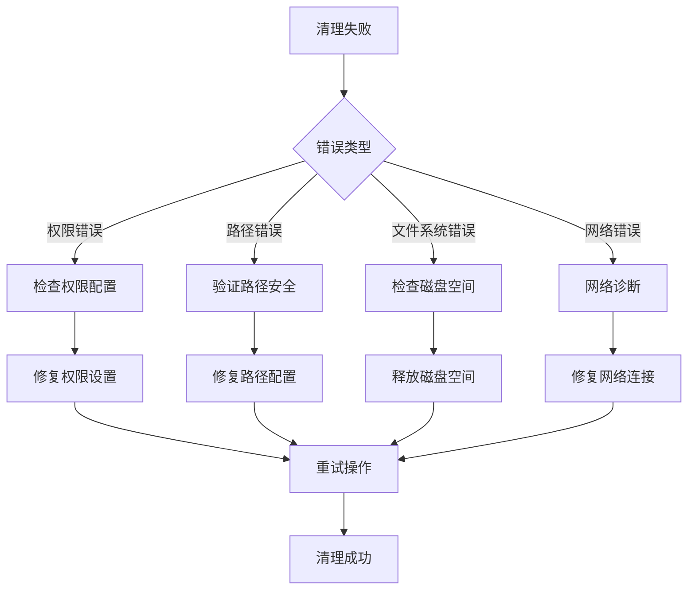

#### 错误代码参考

| HTTP 状态码 | 错误类型 | 可能原因 | 解决方案 |
|-------------|----------|----------|----------|
| 400 | 参数错误 | 无效的 thread_id 格式 | 验证输入格式并修正 |
| 403 | 权限不足 | 用户无权删除线程 | 检查用户权限和所有权 |
| 404 | 资源不存在 | 线程不存在或已删除 | 验证线程状态 |
| 422 | 验证失败 | 路径遍历检测 | 检查路径安全性 |
| 500 | 内部错误 | 文件系统或数据库错误 | 查看服务器日志 |

#### 调试信息收集

系统提供了详细的调试信息收集机制：

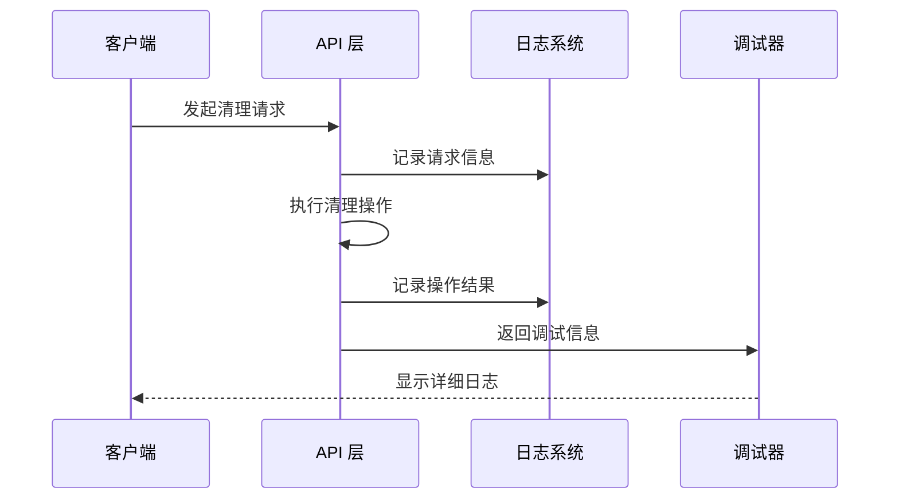

**图表来源**
- [threads.py:176-185](file://backend/app/gateway/routers/threads.py#L176-L185)

**章节来源**
- [test_threads_router.py:128-169](file://backend/tests/test_threads_router.py#L128-L169)

### 最佳实践建议

#### 生产环境部署建议

1. **监控和告警**
   - 设置清理操作的监控指标
   - 配置异常情况的告警机制
   - 定期检查磁盘空间使用情况

2. **备份策略**
   - 在清理前创建数据备份
   - 验证备份的完整性和可恢复性
   - 制定数据恢复预案

3. **性能优化**
   - 合理配置清理任务的执行频率
   - 监控系统资源使用情况
   - 优化清理操作的批处理大小

#### 安全加固措施

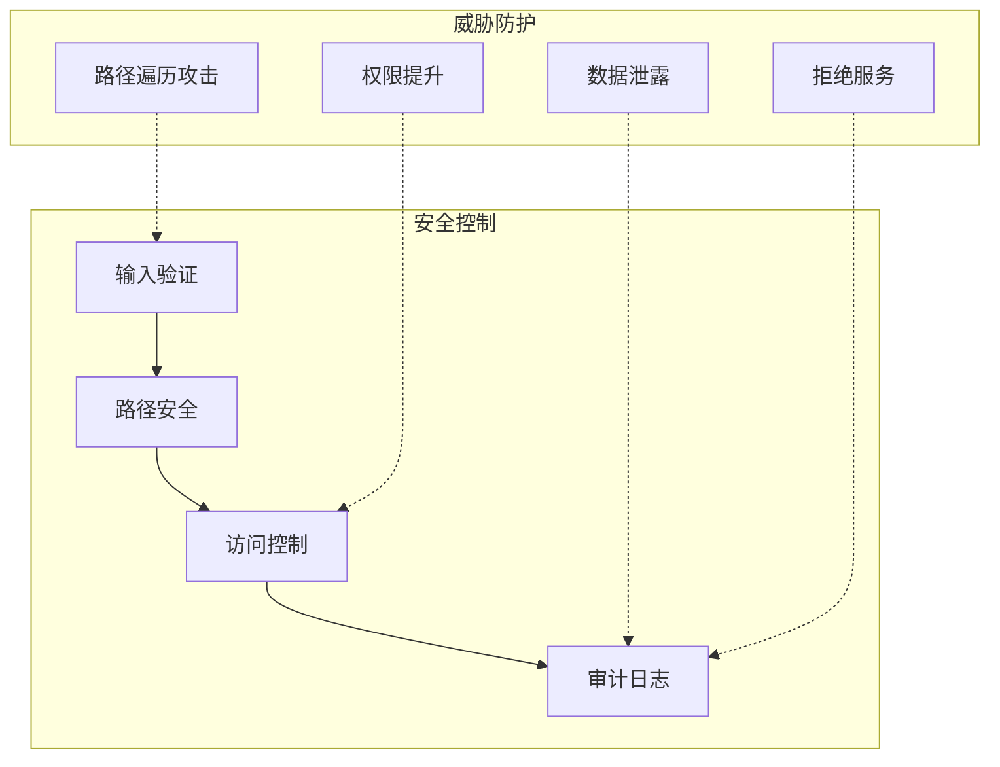

**章节来源**
- [paths.py:20-32](file://backend/packages/harness/deerflow/config/paths.py#L20-L32)
- [authz.py:53](file://backend/app/gateway/authz.py#L53)

## 结论

DeerFlow 线程清理 API 提供了一个完整、安全、高效的线程数据生命周期管理解决方案。通过多层清理策略、严格的权限控制和完善的错误处理机制，系统确保了数据完整性的同时提供了良好的用户体验。

### 主要优势

1. **安全性**：严格的输入验证和路径安全检查防止各种攻击
2. **可靠性**：多层清理策略确保数据完整性
3. **可观测性**：详细的日志记录和审计功能
4. **性能**：异步操作和优化的清理算法
5. **易用性**：简洁的 API 接口和清晰的错误信息

### 未来改进方向

1. **增量清理**：支持选择性清理特定类型的文件
2. **清理预估**：提供清理操作的预估时间和资源消耗
3. **批量操作**：支持同时清理多个线程
4. **清理历史**：记录每次清理操作的详细历史

该系统为 DeerFlow 平台提供了坚实的基础设施支持，确保用户能够安全、可靠地管理他们的线程数据。