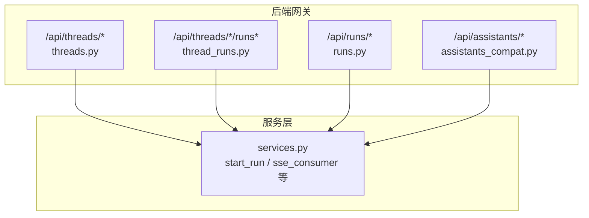
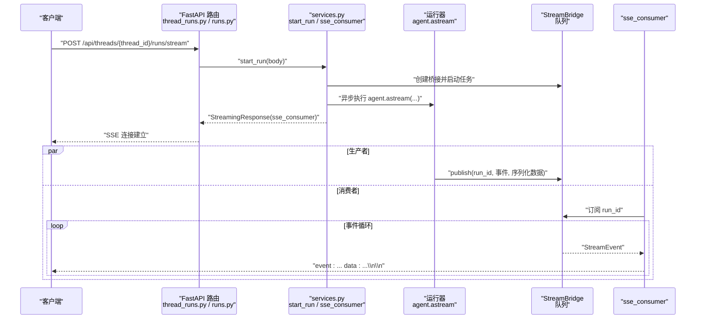
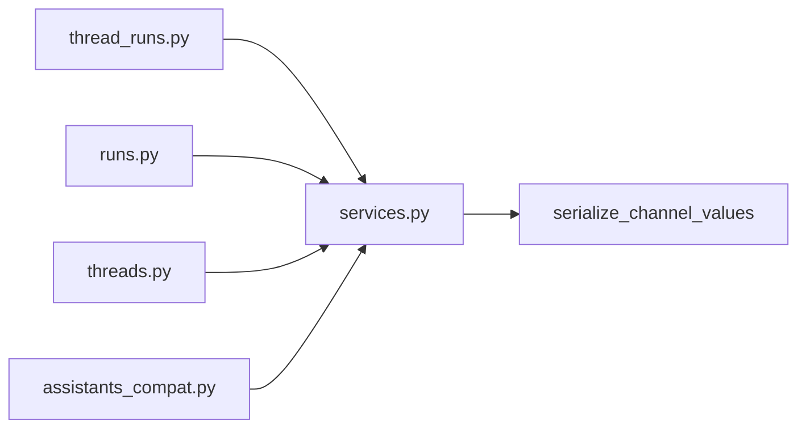

# LangGraph 兼容 API

<cite>
**本文引用的文件**
- [threads.py](file://backend/app/gateway/routers/threads.py)
- [runs.py](file://backend/app/gateway/routers/runs.py)
- [thread_runs.py](file://backend/app/gateway/routers/thread_runs.py)
- [assistants_compat.py](file://backend/app/gateway/routers/assistants_compat.py)
- [services.py](file://backend/app/gateway/services.py)
- [STREAMING.md](file://backend/docs/STREAMING.md)
</cite>

## 目录
1. [简介](#简介)
2. [项目结构](#项目结构)
3. [核心组件](#核心组件)
4. [架构总览](#架构总览)
5. [详细组件分析](#详细组件分析)
6. [依赖关系分析](#依赖关系分析)
7. [性能考量](#性能考量)
8. [故障排查指南](#故障排查指南)
9. [结论](#结论)
10. [附录](#附录)

## 简介
本文件为 DeerFlow LangGraph 兼容 API 的权威参考文档，覆盖与 LangGraph 平台兼容的 Threads（对话线程）与 Runs（执行任务）两大能力域。内容涵盖：
- 端点设计与路径规范
- 请求参数、响应格式与错误码
- 流式传输机制（Server-Sent Events）
- 递归限制与流模式兼容性
- 与 LangGraph SDK 的完全兼容说明与迁移建议

## 项目结构
与 LangGraph 兼容 API 相关的核心路由位于后端网关模块，按功能分层组织：
- Threads：线程创建、查询、状态读写、历史查询等
- Runs：无状态运行（直接流式或等待完成）、基于线程的运行管理、消息与事件查询、令牌用量统计
- Assistants 兼容：最小化助手列表与图/Schema 查询，满足 SDK 初始化需求

图表来源
- [threads.py:1-649](file://backend/app/gateway/routers/threads.py#L1-L649)
- [thread_runs.py:1-439](file://backend/app/gateway/routers/thread_runs.py#L1-L439)
- [runs.py:1-144](file://backend/app/gateway/routers/runs.py#L1-L144)
- [assistants_compat.py:1-150](file://backend/app/gateway/routers/assistants_compat.py#L1-L150)
- [services.py:46-379](file://backend/app/gateway/services.py#L46-L379)

章节来源
- [threads.py:1-649](file://backend/app/gateway/routers/threads.py#L1-L649)
- [thread_runs.py:1-439](file://backend/app/gateway/routers/thread_runs.py#L1-L439)
- [runs.py:1-144](file://backend/app/gateway/routers/runs.py#L1-L144)
- [assistants_compat.py:1-150](file://backend/app/gateway/routers/assistants_compat.py#L1-L150)

## 核心组件
- Threads 路由（/api/threads）：提供线程生命周期管理、状态读取与更新、历史查询、元数据合并等能力。
- Thread Runs 路由（/api/threads/*/runs）：围绕指定线程的运行管理，包括创建、流式输出、等待完成、取消、加入现有流、消息/事件查询、令牌用量聚合。
- Stateless Runs 路由（/api/runs）：无需预建线程即可发起运行，自动复用或临时创建线程，支持 SSE 流式与阻塞等待。
- Assistants 兼容路由（/api/assistants）：返回默认与自定义助手清单，以及最小化的图与 Schema 描述。

章节来源
- [threads.py:246-484](file://backend/app/gateway/routers/threads.py#L246-L484)
- [thread_runs.py:138-220](file://backend/app/gateway/routers/thread_runs.py#L138-L220)
- [runs.py:34-88](file://backend/app/gateway/routers/runs.py#L34-L88)
- [assistants_compat.py:88-150](file://backend/app/gateway/routers/assistants_compat.py#L88-L150)

## 架构总览
下图展示从客户端到运行器再到 SSE 消费者的完整链路，体现与 LangGraph SDK 的兼容性与断连重连能力。

图表来源
- [thread_runs.py:146-171](file://backend/app/gateway/routers/thread_runs.py#L146-L171)
- [runs.py:34-56](file://backend/app/gateway/routers/runs.py#L34-L56)
- [services.py:373-379](file://backend/app/gateway/services.py#L373-L379)
- [STREAMING.md:104-164](file://backend/docs/STREAMING.md#L104-L164)

## 详细组件分析

### Threads（对话线程）
- 端点概览
  - 创建线程：POST /api/threads
  - 搜索线程：POST /api/threads/search
  - 获取线程详情：GET /api/threads/{thread_id}
  - 更新线程元数据：PATCH /api/threads/{thread_id}
  - 删除线程本地数据：DELETE /api/threads/{thread_id}
  - 获取线程状态：GET /api/threads/{thread_id}/state
  - 更新线程状态：POST /api/threads/{thread_id}/state
  - 获取线程历史：POST /api/threads/{thread_id}/history

- 关键行为
  - 线程元数据写入与检查点初始化，确保状态端点可用
  - 状态序列化遵循 LangGraph wire 协议，保证 SDK 使用的兼容性
  - 历史查询仅对最新检查点携带消息，避免重复

- 请求与响应模型要点
  - 创建请求：可选 thread_id、assistant_id、metadata；metadata 中服务器保留键会被剥离
  - 状态响应：values、next、metadata、checkpoint、checkpoint_id、parent_checkpoint_id、created_at、tasks
  - 历史条目：checkpoint_id、parent_checkpoint_id、metadata、values、created_at、next

- 错误码
  - 400：搜索过滤器不合法
  - 404：线程不存在
  - 422：删除线程本地数据失败（参数不合法）
  - 500：创建/获取线程或状态失败

- 示例（请求/响应路径）
  - 创建线程请求体字段说明：见 [threads.py:75-82](file://backend/app/gateway/routers/threads.py#L75-L82)
  - 线程状态响应字段说明：见 [threads.py:116-127](file://backend/app/gateway/routers/threads.py#L116-L127)
  - 历史查询请求体字段说明：见 [threads.py:157-162](file://backend/app/gateway/routers/threads.py#L157-L162)

章节来源
- [threads.py:246-484](file://backend/app/gateway/routers/threads.py#L246-L484)
- [threads.py:434-484](file://backend/app/gateway/routers/threads.py#L434-L484)
- [threads.py:577-648](file://backend/app/gateway/routers/threads.py#L577-L648)

### Thread Runs（基于线程的运行）
- 端点概览
  - 创建运行：POST /api/threads/{thread_id}/runs
  - 流式运行：POST /api/threads/{thread_id}/runs/stream
  - 等待完成：POST /api/threads/{thread_id}/runs/wait
  - 列出运行：GET /api/threads/{thread_id}/runs
  - 获取运行详情：GET /api/threads/{thread_id}/runs/{run_id}
  - 取消运行：POST /api/threads/{thread_id}/runs/{run_id}/cancel
  - 加入现有运行：GET /api/threads/{thread_id}/runs/{run_id}/join
  - 复合流控：POST /api/threads/{thread_id}/runs/{run_id}/stream（支持先取消再流）

- 关键行为
  - 流式响应包含 Content-Location 头，指向运行资源 URL，供 SDK 提取元信息
  - 支持断连重连（Last-Event-ID）、心跳与多订阅者 fan-out
  - 支持中断前/后节点、子图事件、可恢复 SSE、并发策略等高级选项

- 请求与响应模型要点
  - 运行创建请求：assistant_id、input、command、metadata、config、context、webhook、checkpoint_id、checkpoint、interrupt_before、interrupt_after、stream_mode、stream_subgraphs、stream_resumable、on_disconnect、on_completion、multitask_strategy、after_seconds、if_not_exists、feedback_keys
  - 运行响应：run_id、thread_id、assistant_id、status、metadata、kwargs、multitask_strategy、created_at、updated_at、token 统计等

- 错误码
  - 404：运行不存在或不属于该线程
  - 409：运行不可取消或不可流式（非活动 worker）
  - 202/204：取消成功（立即返回或等待完成后返回）

- 示例（请求/响应路径）
  - 运行创建请求体字段说明：见 [thread_runs.py:36-57](file://backend/app/gateway/routers/thread_runs.py#L36-L57)
  - 运行响应字段说明：见 [thread_runs.py:59-77](file://backend/app/gateway/routers/thread_runs.py#L59-L77)

- 流式传输机制（SSE）
  - 事件帧格式：event、data、id（可选），与 LangGraph SDK 一致
  - 默认流模式：values；可通过 stream_mode 指定多个模式
  - 断连与恢复：支持 Last-Event-ID 与缓冲回放

章节来源
- [thread_runs.py:138-220](file://backend/app/gateway/routers/thread_runs.py#L138-L220)
- [thread_runs.py:258-330](file://backend/app/gateway/routers/thread_runs.py#L258-L330)
- [thread_runs.py:338-438](file://backend/app/gateway/routers/thread_runs.py#L338-L438)
- [services.py:46-59](file://backend/app/gateway/services.py#L46-L59)
- [services.py:373-379](file://backend/app/gateway/services.py#L373-L379)
- [STREAMING.md:81-164](file://backend/docs/STREAMING.md#L81-L164)

### Stateless Runs（无状态运行）
- 端点概览
  - 流式运行：POST /api/runs/stream
  - 等待完成：POST /api/runs/wait
  - 运行消息查询：GET /api/runs/{run_id}/messages
  - 运行反馈查询：GET /api/runs/{run_id}/feedback

- 关键行为
  - 若请求中未提供 thread_id，则自动创建临时线程；若提供则复用
  - 等待完成接口在完成后返回最终状态的通道值

- 示例（请求/响应路径）
  - 流式运行请求体字段说明：见 [runs.py:26-31](file://backend/app/gateway/routers/runs.py#L26-L31)
  - 等待完成响应：最终状态通道值或运行状态/错误

章节来源
- [runs.py:34-88](file://backend/app/gateway/routers/runs.py#L34-L88)
- [runs.py:105-143](file://backend/app/gateway/routers/runs.py#L105-L143)

### Assistants 兼容（最小化实现）
- 端点概览
  - 搜索助手：POST /api/assistants/search
  - 获取助手：GET /api/assistants/{assistant_id}
  - 获取助手图：GET /api/assistants/{assistant_id}/graph
  - 获取助手 Schema：GET /api/assistants/{assistant_id}/schemas

- 关键行为
  - 返回默认 lead_agent 与自定义 agent 清单
  - 图与 Schema 返回最小占位结构，满足 SDK 初始化校验

章节来源
- [assistants_compat.py:88-150](file://backend/app/gateway/routers/assistants_compat.py#L88-L150)

## 依赖关系分析
- 路由到服务
  - 所有运行相关路由均依赖 services.start_run 与 services.sse_consumer
  - 流式输出统一通过 StreamingResponse 返回 text/event-stream
- 模型与序列化
  - 状态与消息序列化遵循 deerflow.runtime.serialize_channel_values，确保与 LangGraph wire 协议一致
- 权限控制
  - 使用 require_permission 注解，按 threads/runs/read/write/create/cancel 等维度进行权限校验

图表来源
- [thread_runs.py:1-26](file://backend/app/gateway/routers/thread_runs.py#L1-L26)
- [runs.py:1-21](file://backend/app/gateway/routers/runs.py#L1-L21)
- [threads.py:1-29](file://backend/app/gateway/routers/threads.py#L1-L29)
- [services.py:1-25](file://backend/app/gateway/services.py#L1-L25)

章节来源
- [thread_runs.py:1-26](file://backend/app/gateway/routers/thread_runs.py#L1-L26)
- [runs.py:1-21](file://backend/app/gateway/routers/runs.py#L1-L21)
- [threads.py:1-29](file://backend/app/gateway/routers/threads.py#L1-L29)
- [services.py:1-25](file://backend/app/gateway/services.py#L1-L25)

## 性能考量
- 流式传输
  - 使用 asyncio.Queue 作为 StreamBridge，支持断连重连与多订阅者 fan-out，降低连接抖动影响
  - SSE 帧格式与事件顺序严格遵循 LangGraph 协议，减少客户端解析成本
- 并发与策略
  - multitask_strategy 支持 reject、rollback、interrupt、enqueue，按需选择并发处理策略
- 资源回收
  - on_completion 控制临时线程清理策略，避免无界资源增长

## 故障排查指南
- 常见问题
  - 运行不可取消：检查运行状态是否为 pending/running，否则返回 409
  - 运行不可流式：若 run.store_only 为真且未提供 action 参数，返回 409
  - 线程状态为空：检查检查点是否存在，或确认线程是否已创建
- 日志与定位
  - 服务层记录异常堆栈，便于定位具体失败环节
- 建议流程
  - 先验证线程与运行存在性
  - 再确认权限与并发策略
  - 最后检查 SSE 连接与 Last-Event-ID 设置

章节来源
- [thread_runs.py:223-255](file://backend/app/gateway/routers/thread_runs.py#L223-L255)
- [thread_runs.py:258-330](file://backend/app/gateway/routers/thread_runs.py#L258-L330)
- [threads.py:377-431](file://backend/app/gateway/routers/threads.py#L377-L431)

## 结论
DeerFlow 通过标准化的 LangGraph 兼容 API，实现了从线程管理到运行流式的全链路能力，并在 SSE、断连重连、模式兼容与权限控制等方面与 LangGraph SDK 保持一致。开发者可据此无缝迁移与扩展。

## 附录

### 端点一览与兼容性对照
- Threads
  - POST /api/threads → 创建线程
  - POST /api/threads/search → 搜索线程
  - GET /api/threads/{thread_id} → 获取线程
  - PATCH /api/threads/{thread_id} → 更新元数据
  - DELETE /api/threads/{thread_id} → 删除本地数据
  - GET /api/threads/{thread_id}/state → 获取状态
  - POST /api/threads/{thread_id}/state → 更新状态
  - POST /api/threads/{thread_id}/history → 获取历史
- Thread Runs
  - POST /api/threads/{thread_id}/runs → 创建运行
  - POST /api/threads/{thread_id}/runs/stream → 流式运行
  - POST /api/threads/{thread_id}/runs/wait → 等待完成
  - GET /api/threads/{thread_id}/runs → 列表运行
  - GET /api/threads/{thread_id}/runs/{run_id} → 获取运行
  - POST /api/threads/{thread_id}/runs/{run_id}/cancel → 取消运行
  - GET /api/threads/{thread_id}/runs/{run_id}/join → 加入现有运行
  - POST /api/threads/{thread_id}/runs/{run_id}/stream → 复合流控（可先取消）
  - GET /api/threads/{thread_id}/messages → 线程消息（含反馈）
  - GET /api/threads/{thread_id}/runs/{run_id}/messages → 运行消息
  - GET /api/threads/{thread_id}/runs/{run_id}/events → 运行事件
  - GET /api/threads/{thread_id}/token-usage → 线程令牌用量
- Stateless Runs
  - POST /api/runs/stream → 无状态流式运行
  - POST /api/runs/wait → 无状态等待完成
  - GET /api/runs/{run_id}/messages → 运行消息
  - GET /api/runs/{run_id}/feedback → 运行反馈
- Assistants 兼容
  - POST /api/assistants/search → 搜索助手
  - GET /api/assistants/{assistant_id} → 获取助手
  - GET /api/assistants/{assistant_id}/graph → 获取图
  - GET /api/assistants/{assistant_id}/schemas → 获取 Schema

### 流式传输（SSE）与模式兼容
- 事件帧字段
  - event：事件类型（如 metadata/values/end 等）
  - data：JSON 数据负载
  - id：可选事件 ID，用于断连重连
- 默认与可选模式
  - 默认模式：values
  - 可通过 stream_mode 指定多种模式（如 messages-tuple、values 等）
- 断连与恢复
  - 支持 Last-Event-ID 与缓冲回放，确保客户端可观测到连续事件流

章节来源
- [services.py:46-59](file://backend/app/gateway/services.py#L46-L59)
- [services.py:67-76](file://backend/app/gateway/services.py#L67-L76)
- [STREAMING.md:81-164](file://backend/docs/STREAMING.md#L81-L164)

### 迁移指南（LangGraph SDK → DeerFlow）
- 端点映射
  - SDK 的 threads 与 runs 对应 DeerFlow 的 /api/threads 与 /api/threads/*/runs
  - 无状态运行对应 /api/runs
- 流式模式
  - 若使用 DeerFlowClient（同步/进程内），传入模式为 "messages"
  - 若通过 HTTP SDK（langgraph-sdk），传入模式为 "messages-tuple"
- 断连与恢复
  - 使用 Content-Location 头与 Last-Event-ID 实现断连重连
- 元数据与状态
  - 确保 metadata 不包含服务器保留键（如 owner_id、user_id），由服务端自动剥离
  - 状态序列化遵循 serialize_channel_values，保证消息对象转为 JSON 安全字典

章节来源
- [threads.py:44-48](file://backend/app/gateway/routers/threads.py#L44-L48)
- [STREAMING.md:81-164](file://backend/docs/STREAMING.md#L81-L164)