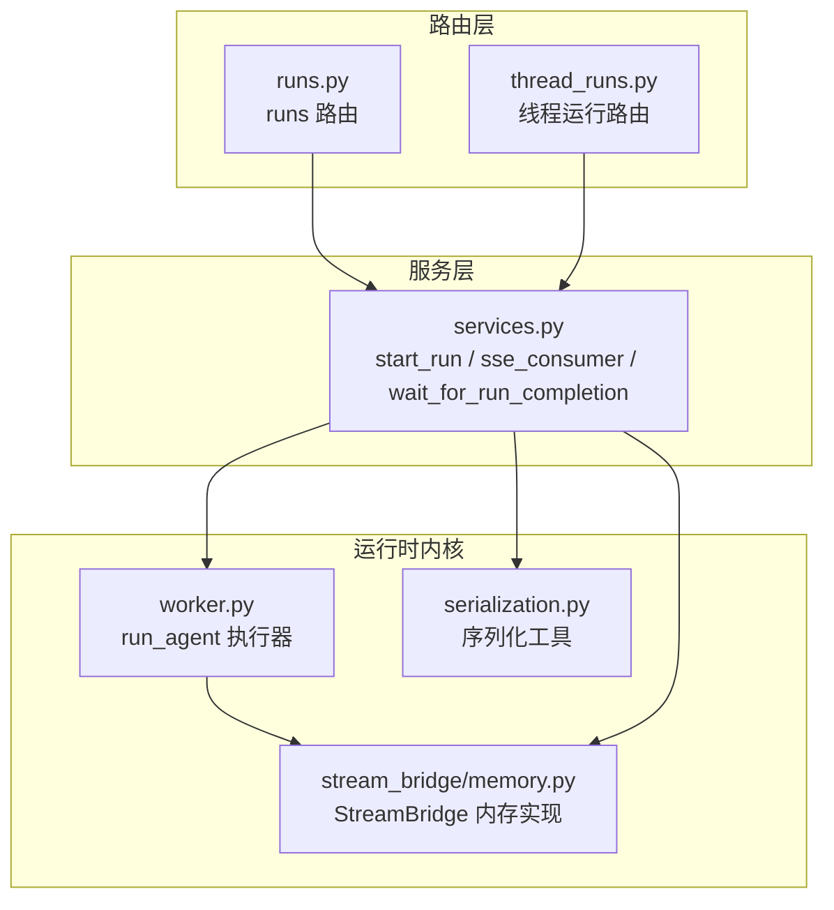
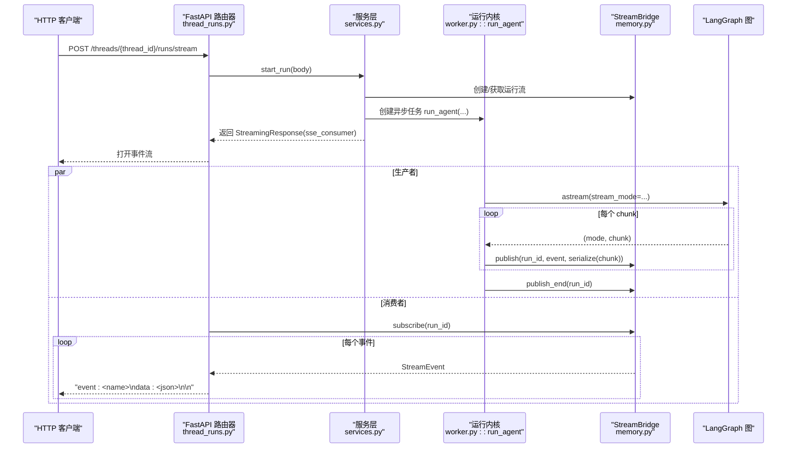
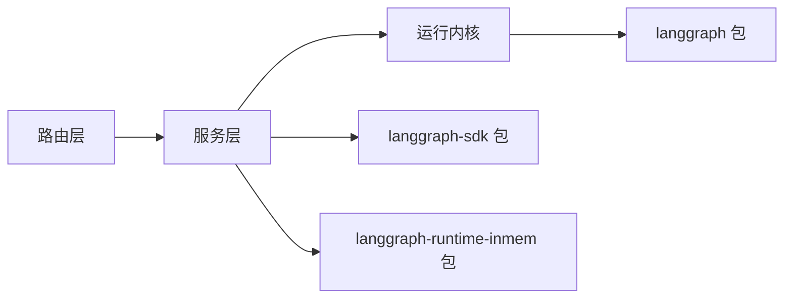

# Runs API

<cite>
**本文引用的文件**
- [runs.py](file://backend/app/gateway/routers/runs.py)
- [thread_runs.py](file://backend/app/gateway/routers/thread_runs.py)
- [services.py](file://backend/app/gateway/services.py)
- [STREAMING.md](file://backend/docs/STREAMING.md)
- [worker.py](file://backend/packages/harness/deerflow/runtime/runs/worker.py)
- [stream_bridge/memory.py](file://backend/packages/harness/deerflow/runtime/stream_bridge/memory.py)
- [serialization.py](file://backend/packages/harness/deerflow/runtime/serialization.py)
- [__init__.py](file://backend/packages/harness/deerflow/runtime/runs/__init__.py)
- [test_runs_api_endpoints.py](file://backend/tests/test_runs_api_endpoints.py)
- [test_runtime_lifecycle_e2e.py](file://backend/tests/test_runtime_lifecycle_e2e.py)
- [test_cancel_run_idempotent.py](file://backend/tests/test_cancel_run_idempotent.py)
- [test_client.py](file://backend/tests/test_client.py)
- [test_client_e2e.py](file://backend/tests/test_client_e2e.py)
- [test_client_live.py](file://backend/tests/test_client_live.py)
- [test_openapi_operation_ids.py](file://backend/tests/test_openapi_operation_ids.py)
- [uv.lock](file://backend/uv.lock)
</cite>

## 目录
1. [简介](#简介)
2. [项目结构](#项目结构)
3. [核心组件](#核心组件)
4. [架构总览](#架构总览)
5. [详细组件分析](#详细组件分析)
6. [依赖关系分析](#依赖关系分析)
7. [性能考量](#性能考量)
8. [故障排查指南](#故障排查指南)
9. [结论](#结论)
10. [附录](#附录)

## 简介
本文件为 DeerFlow Runs API 的权威参考文档，聚焦“执行任务管理”的核心能力，覆盖以下关键端点与行为：
- 创建运行（Create Run）
- 获取运行历史（Get Run History）
- 流式运行（Stream Run）

文档将详细说明每个端点的 HTTP 方法、URL 模式、请求参数、响应格式与错误码；并提供完整的请求/响应示例路径、输入格式（messages 数组）、配置选项（recursion_limit、configurable）、流模式兼容性、Server-Sent Events（SSE）流式传输机制、递归限制配置、流模式选择与错误处理策略。最后给出与 LangGraph SDK 的完全兼容性说明与迁移指南。

## 项目结构
Runs API 的实现由三层协作完成：
- 路由层（FastAPI 路由器）：定义 HTTP 接口与参数解析
- 服务层（业务逻辑）：封装运行生命周期、SSE 格式化、断连处理
- 运行时内核（LangGraph 集成）：执行图计算、事件序列化、桥接流

图表来源
- [runs.py](file://backend/app/gateway/routers/runs.py)
- [thread_runs.py](file://backend/app/gateway/routers/thread_runs.py)
- [services.py](file://backend/app/gateway/services.py)
- [worker.py](file://backend/packages/harness/deerflow/runtime/runs/worker.py)
- [stream_bridge/memory.py](file://backend/packages/harness/deerflow/runtime/stream_bridge/memory.py)
- [serialization.py](file://backend/packages/harness/deerflow/runtime/serialization.py)

章节来源
- [runs.py](file://backend/app/gateway/routers/runs.py)
- [thread_runs.py](file://backend/app/gateway/routers/thread_runs.py)
- [services.py](file://backend/app/gateway/services.py)

## 核心组件
- 路由器（runs.py、thread_runs.py）：暴露 HTTP 端点，负责参数校验、鉴权与调用服务层
- 服务层（services.py）：集中运行生命周期逻辑，包括启动运行、SSE 格式化、断连取消策略
- 运行内核（worker.py、stream_bridge/memory.py、serialization.py）：执行 LangGraph 图、序列化事件并通过 StreamBridge 发布
- 兼容性与版本（uv.lock）：声明对 langgraph、langgraph-sdk、langgraph-runtime-inmem 等包的依赖

章节来源
- [__init__.py](file://backend/packages/harness/deerflow/runtime/runs/__init__.py)
- [uv.lock](file://backend/uv.lock)

## 架构总览
下图展示从客户端到 LangGraph 的完整调用链路，以及 SSE 事件的产生与消费过程：

图表来源
- [STREAMING.md](file://backend/docs/STREAMING.md)
- [services.py](file://backend/app/gateway/services.py)
- [worker.py](file://backend/packages/harness/deerflow/runtime/runs/worker.py)
- [stream_bridge/memory.py](file://backend/packages/harness/deerflow/runtime/stream_bridge/memory.py)

## 详细组件分析

### 端点：创建运行（Create Run）
- HTTP 方法：POST
- URL 模式：/threads/{thread_id}/runs
- 请求体字段（示例路径）
  - messages：数组，元素为消息对象（如角色、内容、工具调用等），用于初始化图状态
  - configurable：可选对象，传递给 LangGraph runnable 的可配置项
  - recursion_limit：可选整数，控制递归深度限制
  - 其他运行配置：如流模式、断连策略等（见“配置选项”）
- 响应格式
  - 成功：返回 RunRecord 结构（包含 run_id、status、thread_id、config 等）
  - 错误：返回标准错误响应（见“错误码”）
- 示例路径
  - 请求示例：[test_runs_api_endpoints.py](file://backend/tests/test_runs_api_endpoints.py)
  - 响应示例：同上测试文件中对应断言

章节来源
- [runs.py](file://backend/app/gateway/routers/runs.py)
- [test_runs_api_endpoints.py](file://backend/tests/test_runs_api_endpoints.py)

### 端点：获取运行历史（Get Run History）
- HTTP 方法：GET
- URL 模式：/threads/{thread_id}/runs
- 查询参数
  - limit：可选，限制返回条目数量
  - cursor：可选，分页游标
- 响应格式
  - 成功：返回 RunRecord 列表与分页信息
  - 错误：返回标准错误响应
- 示例路径
  - 请求/响应示例：[test_runs_api_endpoints.py](file://backend/tests/test_runs_api_endpoints.py)

章节来源
- [runs.py](file://backend/app/gateway/routers/runs.py)
- [test_runs_api_endpoints.py](file://backend/tests/test_runs_api_endpoints.py)

### 端点：流式运行（Stream Run）
- HTTP 方法：POST
- URL 模式：/threads/{thread_id}/runs/stream
- 请求体字段（示例路径）
  - messages：数组，初始化图状态
  - configurable：可选，传给 runnable 的可配置项
  - recursion_limit：可选，递归限制
  - 流模式：可选，如 values/messages/custom 等（见“流模式兼容性”）
- 响应格式：SSE（Server-Sent Events）
  - 事件类型：包含多个自定义事件（如 values、messages、custom 等），以“event: <name>”标识
  - 数据格式：JSON 字符串，经序列化后发送
  - 结束事件：event=end 表示运行结束
- 断连与重连
  - 支持 Last-Event-ID 头进行断连重连
  - 心跳事件：定期发送“: heartbeat”
  - 断连策略：根据 on_disconnect 配置决定取消或继续运行
- 示例路径
  - SSE 流示例与断连测试：[test_runtime_lifecycle_e2e.py](file://backend/tests/test_runtime_lifecycle_e2e.py)
  - OpenAPI 中区分 GET/POST 的操作 ID：[test_openapi_operation_ids.py](file://backend/tests/test_openapi_operation_ids.py)

章节来源
- [thread_runs.py](file://backend/app/gateway/routers/thread_runs.py)
- [services.py](file://backend/app/gateway/services.py)
- [test_runtime_lifecycle_e2e.py](file://backend/tests/test_runtime_lifecycle_e2e.py)
- [test_openapi_operation_ids.py](file://backend/tests/test_openapi_operation_ids.py)

### 流式消费与 SSE 格式化
- SSE 格式化函数：将内部事件转换为标准 SSE 文本帧
- 消费者循环：持续订阅 StreamBridge，遇到 END_SENTINEL 结束
- 心跳与断连：周期性发送心跳，检测客户端断连后按策略取消后台任务
- 示例路径
  - SSE 消费实现：[services.py](file://backend/app/gateway/services.py)

章节来源
- [services.py](file://backend/app/gateway/services.py)

### 运行内核与事件序列化
- 运行执行器：run_agent 在独立任务中调用 agent.astream，按指定流模式产出事件
- 序列化：serialize 将不同模式的 chunk 序列化为 JSON，messages 模式下会打包元数据
- StreamBridge：内存实现，支持多订阅者、断连缓冲、心跳与事件 ID
- 示例路径
  - 运行执行器与模式选择：[worker.py](file://backend/packages/harness/deerflow/runtime/runs/worker.py)
  - 序列化工具：[serialization.py](file://backend/packages/harness/deerflow/runtime/serialization.py)
  - StreamBridge 实现：[stream_bridge/memory.py](file://backend/packages/harness/deerflow/runtime/stream_bridge/memory.py)

章节来源
- [worker.py](file://backend/packages/harness/deerflow/runtime/runs/worker.py)
- [serialization.py](file://backend/packages/harness/deerflow/runtime/serialization.py)
- [stream_bridge/memory.py](file://backend/packages/harness/deerflow/runtime/stream_bridge/memory.py)

### 配置选项详解
- messages 数组
  - 作用：初始化 LangGraph 图的状态，作为输入消息序列
  - 结构：每条消息包含角色、内容、工具调用等字段
- configurable
  - 作用：向 runnable 注入可配置参数（如工具开关、提示词模板等）
- recursion_limit
  - 作用：限制运行中的递归深度，防止无限循环
- 流模式（stream_mode）
  - 支持：values、messages、custom 等
  - 选择：由请求体或默认策略决定
- 断连策略（on_disconnect）
  - cancel：客户端断连时取消运行
  - continue：允许运行继续，丢弃事件
- 示例路径
  - 运行执行器中的模式与日志：[worker.py](file://backend/packages/harness/deerflow/runtime/runs/worker.py)
  - SSE 消费中的断连策略：[services.py](file://backend/app/gateway/services.py)

章节来源
- [worker.py](file://backend/packages/harness/deerflow/runtime/runs/worker.py)
- [services.py](file://backend/app/gateway/services.py)

### 错误码与错误处理
- 常见错误
  - 409 冲突：运行仍在进行中，无法重复创建
  - 404 未找到：thread_id 或 run_id 不存在
  - 422 参数校验失败：请求体格式不正确
  - 500 服务器内部错误：运行异常或系统故障
- 断连与取消
  - 客户端断连时，根据 on_disconnect 策略取消运行
  - 取消幂等：重复取消不会报错
- 示例路径
  - 断连与取消测试：[test_cancel_run_idempotent.py](file://backend/tests/test_cancel_run_idempotent.py)
  - SSE 断连超时与尾部转储：[test_runtime_lifecycle_e2e.py](file://backend/tests/test_runtime_lifecycle_e2e.py)

章节来源
- [test_cancel_run_idempotent.py](file://backend/tests/test_cancel_run_idempotent.py)
- [test_runtime_lifecycle_e2e.py](file://backend/tests/test_runtime_lifecycle_e2e.py)

### 与 LangGraph SDK 的兼容性与迁移指南
- 兼容性
  - 使用 langgraph 1.x 与 langgraph-sdk 0.3.x，确保端点语义与事件结构一致
  - SSE 事件名称与数据结构与 LangGraph 平台保持一致
- 迁移建议
  - 将原 LangGraph SDK 的 client.stream(...) 替换为本项目的 /threads/{thread_id}/runs/stream
  - 若使用同步客户端，可参考 DeerFlowClient 的 in-process 流式路径
- 版本声明
  - langgraph、langgraph-sdk、langgraph-runtime-inmem 等依赖版本详见 uv.lock
- 示例路径
  - 客户端 in-process 流式调用示例：[test_client.py](file://backend/tests/test_client.py)
  - 端到端流式测试：[test_client_e2e.py](file://backend/tests/test_client_e2e.py)
  - 实时 Live 测试：[test_client_live.py](file://backend/tests/test_client_live.py)

章节来源
- [uv.lock](file://backend/uv.lock)
- [test_client.py](file://backend/tests/test_client.py)
- [test_client_e2e.py](file://backend/tests/test_client_e2e.py)
- [test_client_live.py](file://backend/tests/test_client_live.py)

## 依赖关系分析
- 组件耦合
  - 路由器仅负责参数与鉴权，业务逻辑集中在服务层
  - 服务层通过 RunManager、StreamBridge 与运行内核解耦
- 外部依赖
  - langgraph、langgraph-sdk、langgraph-runtime-inmem 提供图执行与 SSE 支持
- 循环依赖
  - 无直接循环依赖，模块职责清晰
- 示例路径
  - 依赖声明：[uv.lock](file://backend/uv.lock)

图表来源
- [uv.lock](file://backend/uv.lock)

章节来源
- [uv.lock](file://backend/uv.lock)

## 性能考量
- 流式传输
  - 使用 SSE 异步推送，避免长连接阻塞
  - StreamBridge 支持多订阅者与断连缓冲，降低丢包风险
- 序列化成本
  - 按模式序列化，避免不必要的数据膨胀
- 资源隔离
  - 运行在独立 asyncio 任务中，便于资源控制与取消
- 建议
  - 控制单次运行的消息规模与递归深度
  - 合理设置断连策略，平衡用户体验与资源占用

## 故障排查指南
- SSE 流未结束
  - 现象：客户端未收到 event=end
  - 排查：检查服务端是否发布 END_SENTINEL；确认客户端是否正确处理事件
  - 参考：[test_runtime_lifecycle_e2e.py](file://backend/tests/test_runtime_lifecycle_e2e.py)
- 断连后运行未取消
  - 现象：客户端断连后服务端仍继续运行
  - 排查：确认 on_disconnect 配置；检查断连检测逻辑
  - 参考：[services.py](file://backend/app/gateway/services.py)
- 重复创建运行冲突
  - 现象：返回 409 冲突
  - 排查：确认当前 run_id 是否仍在运行；必要时先取消或等待
  - 参考：[test_cancel_run_idempotent.py](file://backend/tests/test_cancel_run_idempotent.py)
- 客户端 in-process 流异常
  - 现象：本地流式调用抛出异常
  - 排查：对比 LangGraph SDK 的 stream_mode 与 configurable 传参
  - 参考：[test_client.py](file://backend/tests/test_client.py)

章节来源
- [test_runtime_lifecycle_e2e.py](file://backend/tests/test_runtime_lifecycle_e2e.py)
- [services.py](file://backend/app/gateway/services.py)
- [test_cancel_run_idempotent.py](file://backend/tests/test_cancel_run_idempotent.py)
- [test_client.py](file://backend/tests/test_client.py)

## 结论
DeerFlow Runs API 通过清晰的三层架构实现了与 LangGraph 的完全兼容，提供了稳定可靠的流式执行体验。其 SSE 机制、断连处理与配置灵活性，使其既能满足前端实时交互需求，也能适配后端批量处理场景。建议在生产环境中结合断连策略、递归限制与流模式选择，获得最佳性能与稳定性。

## 附录
- 请求/响应示例路径
  - 创建运行：[test_runs_api_endpoints.py](file://backend/tests/test_runs_api_endpoints.py)
  - 流式运行：[test_runtime_lifecycle_e2e.py](file://backend/tests/test_runtime_lifecycle_e2e.py)
  - 客户端 in-process 流式：[test_client.py](file://backend/tests/test_client.py)
- 关键流程图
  - SSE 生命周期：[STREAMING.md](file://backend/docs/STREAMING.md)
  - 运行执行器与序列化：[worker.py](file://backend/packages/harness/deerflow/runtime/runs/worker.py)，[serialization.py](file://backend/packages/harness/deerflow/runtime/serialization.py)