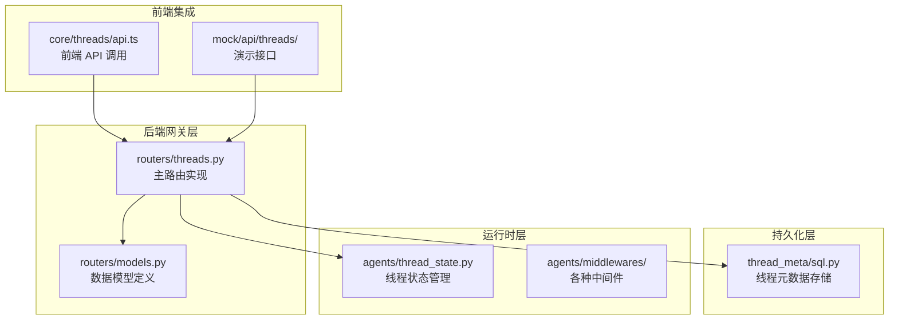
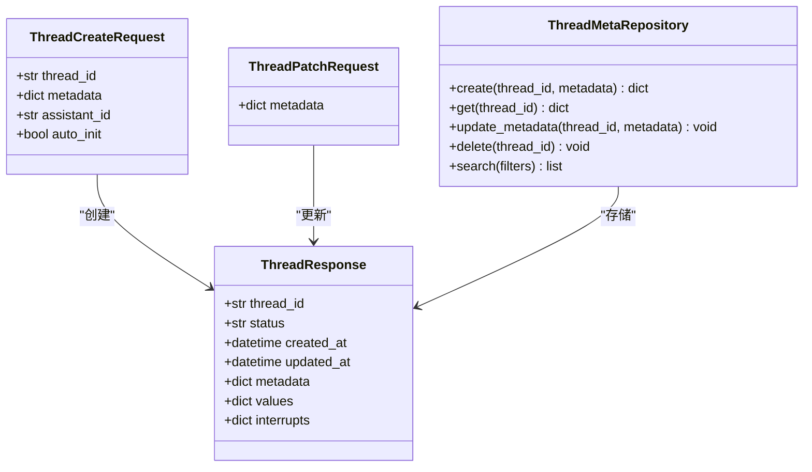
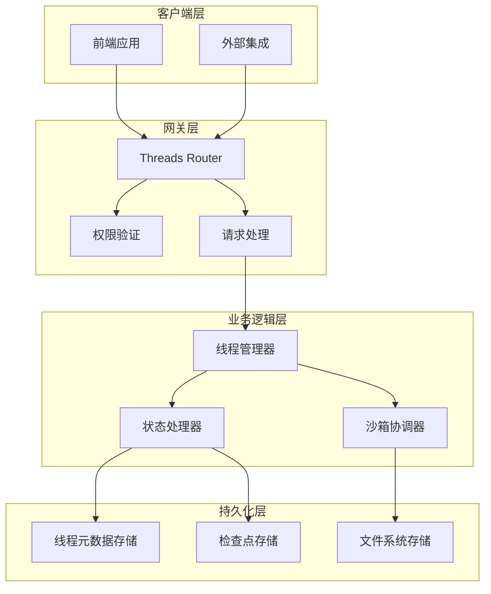
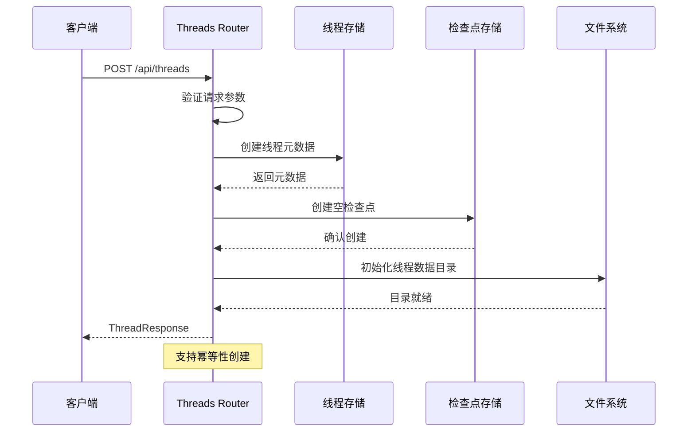
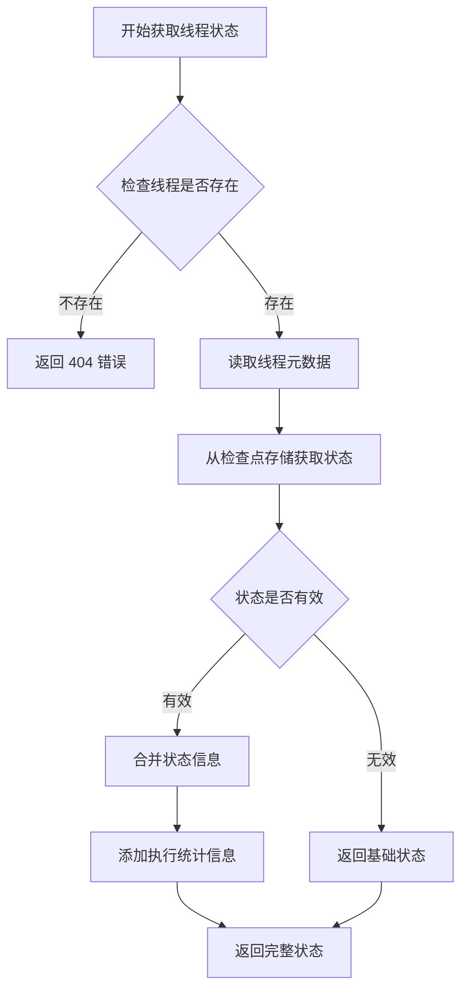
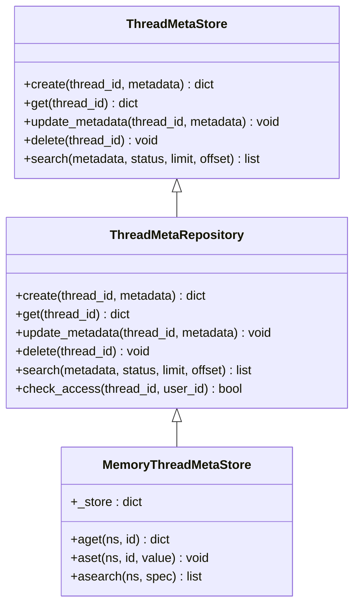
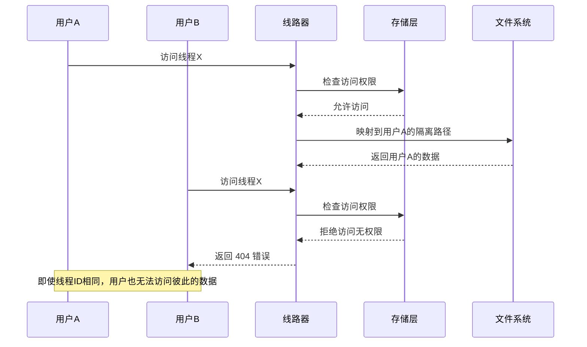
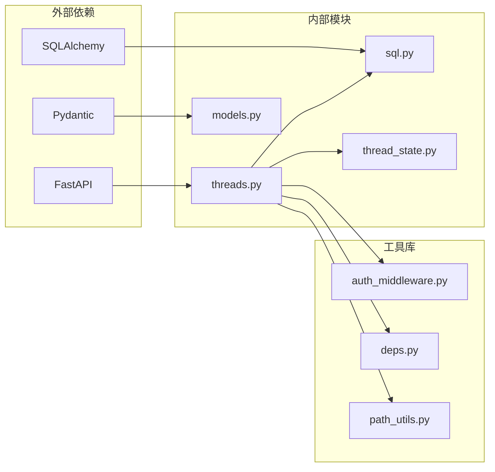

# Threads API 参考文档

<cite>
**本文档引用的文件**
- [threads.py](file://backend/app/gateway/routers/threads.py)
- [models.py](file://backend/app/gateway/routers/models.py)
- [sql.py](file://backend/packages/harness/deerflow/persistence/thread_meta/sql.py)
- [thread_state.py](file://backend/packages/harness/deerflow/agents/thread_state.py)
- [ARCHITECTURE.md](file://backend/docs/ARCHITECTURE.md)
- [test_threads_router.py](file://backend/tests/test_threads_router.py)
- [api.ts](file://frontend/src/core/threads/api.ts)
- [route.ts](file://frontend/src/app/mock/api/threads/[thread_id]/history/route.ts)
</cite>

## 目录
1. [简介](#简介)
2. [项目结构](#项目结构)
3. [核心组件](#核心组件)
4. [架构概览](#架构概览)
5. [详细组件分析](#详细组件分析)
6. [依赖关系分析](#依赖关系分析)
7. [性能考虑](#性能考虑)
8. [故障排除指南](#故障排除指南)
9. [结论](#结论)

## 简介

DeerFlow Threads API 是一个强大的对话线程管理系统，提供了完整的线程生命周期管理功能。该 API 支持创建、查询、更新和删除对话线程，同时集成了智能状态管理、用户隔离机制和沙箱环境支持。

本系统基于 LangGraph 架构构建，扩展了线程状态管理能力，包括消息跟踪、工件存储、沙箱环境管理和自动标题生成等功能。所有操作都遵循严格的安全策略，确保用户数据的隔离性和完整性。

## 项目结构

Threads API 的实现分布在多个关键模块中：



**图表来源**
- [threads.py:1-500](file://backend/app/gateway/routers/threads.py#L1-L500)
- [models.py:1-300](file://backend/app/gateway/routers/models.py#L1-L300)
- [sql.py:1-250](file://backend/packages/harness/deerflow/persistence/thread_meta/sql.py#L1-L250)

**章节来源**
- [threads.py:1-500](file://backend/app/gateway/routers/threads.py#L1-L500)
- [models.py:1-300](file://backend/app/gateway/routers/models.py#L1-L300)

## 核心组件

### 线程状态结构

DeerFlow 的线程状态是一个扩展的 AgentState 结构，包含以下核心字段：

| 字段名 | 类型 | 描述 | 必需 |
|--------|------|------|------|
| values | dict | 线程的核心状态值，包含标题等信息 | 否 |
| messages | list | 对话消息历史记录 | 否 |
| sandbox | dict | 沙箱环境配置信息 | 否 |
| artifacts | list[str] | 生成的工件文件路径列表 | 否 |
| thread_data | dict | 线程数据目录结构 | 否 |
| title | str | 自动生成的对话标题 | 否 |

### 数据模型定义

系统使用 Pydantic 模型来确保数据完整性和类型安全：



**图表来源**
- [models.py:1-300](file://backend/app/gateway/routers/models.py#L1-L300)
- [sql.py:37-228](file://backend/packages/harness/deerflow/persistence/thread_meta/sql.py#L37-L228)

**章节来源**
- [models.py:1-300](file://backend/app/gateway/routers/models.py#L1-L300)
- [ARCHITECTURE.md:129-180](file://backend/docs/ARCHITECTURE.md#L129-L180)

## 架构概览

Threads API 采用分层架构设计，确保了良好的可维护性和扩展性：



**图表来源**
- [threads.py:246-386](file://backend/app/gateway/routers/threads.py#L246-L386)
- [sql.py:37-228](file://backend/packages/harness/deerflow/persistence/thread_meta/sql.py#L37-L228)

## 详细组件分析

### 线程创建流程

线程创建是整个系统的核心操作，涉及多个步骤的协调：



**图表来源**
- [threads.py:246-260](file://backend/app/gateway/routers/threads.py#L246-L260)

#### 请求参数规范

| 参数名 | 类型 | 必需 | 描述 |
|--------|------|------|------|
| thread_id | string | 否 | 线程唯一标识符，未提供时自动生成 |
| metadata | object | 否 | 线程元数据，包含用户自定义键值对 |
| assistant_id | string | 否 | 关联的助手标识符 |
| auto_init | boolean | 否 | 是否自动初始化线程状态 |

#### 响应格式

```json
{
  "thread_id": "string",
  "status": "idle",
  "created_at": "2026-01-01T00:00:00Z",
  "updated_at": "2026-01-01T00:00:00Z",
  "metadata": {},
  "values": {
    "title": "string"
  },
  "interrupts": {}
}
```

**章节来源**
- [threads.py:246-260](file://backend/app/gateway/routers/threads.py#L246-L260)
- [models.py:1-150](file://backend/app/gateway/routers/models.py#L1-L150)

### 线程状态获取

线程状态获取提供了灵活的状态查询能力：



**图表来源**
- [threads.py:377-386](file://backend/app/gateway/routers/threads.py#L377-L386)

#### 端点详情

- **HTTP 方法**: GET
- **URL 模式**: `/api/threads/{thread_id}`
- **权限要求**: 需要读取权限且必须是线程所有者
- **响应类型**: ThreadResponse

**章节来源**
- [threads.py:377-386](file://backend/app/gateway/routers/threads.py#L377-L386)

### 线程元数据管理

系统提供了完整的元数据管理功能，支持精确的过滤和搜索：



**图表来源**
- [sql.py:37-228](file://backend/packages/harness/deerflow/persistence/thread_meta/sql.py#L37-L228)

#### 元数据过滤规则

| 过滤条件 | 类型 | 描述 |
|----------|------|------|
| metadata | object | JSON 对象，支持嵌套键值匹配 |
| status | string | 线程状态过滤器 |
| limit | integer | 结果数量限制，默认 100 |
| offset | integer | 分页偏移量，默认 0 |

**章节来源**
- [sql.py:111-120](file://backend/packages/harness/deerflow/persistence/thread_meta/sql.py#L111-L120)

### 用户隔离机制

系统实现了严格的用户隔离策略，确保多租户环境下的数据安全：



**图表来源**
- [sql.py:81-109](file://backend/packages/harness/deerflow/persistence/thread_meta/sql.py#L81-L109)

**章节来源**
- [sql.py:81-109](file://backend/packages/harness/deerflow/persistence/thread_meta/sql.py#L81-L109)

## 依赖关系分析

Threads API 的依赖关系体现了清晰的关注点分离：



**图表来源**
- [threads.py:1-50](file://backend/app/gateway/routers/threads.py#L1-L50)
- [models.py:1-50](file://backend/app/gateway/routers/models.py#L1-L50)

### 核心依赖特性

| 组件 | 依赖项 | 用途 |
|------|--------|------|
| Threads Router | FastAPI, Pydantic | Web 服务框架和数据验证 |
| ThreadMetaStore | SQLAlchemy | 数据持久化 |
| ThreadState | LangGraph | 状态管理 |
| Auth Middleware | JWT, 权限系统 | 安全控制 |
| Dependencies | 服务容器 | 依赖注入 |

**章节来源**
- [threads.py:1-50](file://backend/app/gateway/routers/threads.py#L1-L50)
- [models.py:1-50](file://backend/app/gateway/routers/models.py#L1-L50)

## 性能考虑

### 缓存策略

系统采用了多层次的缓存机制来优化性能：

1. **检查点缓存**: 频繁访问的线程状态缓存在内存中
2. **元数据缓存**: 线程元数据在进程内缓存
3. **响应缓存**: 常用查询结果进行短期缓存

### 并发处理

- 使用异步 I/O 操作避免阻塞
- 实现连接池管理数据库连接
- 采用乐观锁处理并发更新

### 扩展性设计

- 支持水平扩展的无状态设计
- 可插拔的存储后端
- 模块化的中间件架构

## 故障排除指南

### 常见错误及解决方案

| 错误代码 | 错误类型 | 可能原因 | 解决方案 |
|----------|----------|----------|----------|
| 400 | 请求参数错误 | 无效的 JSON 格式或缺少必需字段 | 验证请求体格式，检查必填字段 |
| 401 | 未授权访问 | 缺少有效的认证令牌 | 检查 JWT 令牌有效性 |
| 403 | 权限不足 | 用户无权访问目标线程 | 验证用户权限和线程所有权 |
| 404 | 资源不存在 | 线程 ID 无效或已被删除 | 确认线程存在性 |
| 500 | 内部服务器错误 | 数据库连接失败或文件系统异常 | 检查服务日志和系统资源 |

### 调试技巧

1. **启用详细日志**: 在开发环境中启用调试模式
2. **监控指标**: 使用 Prometheus 指标监控 API 性能
3. **错误追踪**: 实现统一的错误处理和追踪机制

**章节来源**
- [test_threads_router.py:165-193](file://backend/tests/test_threads_router.py#L165-L193)

## 结论

DeerFlow Threads API 提供了一个功能完整、安全可靠的对话线程管理解决方案。通过精心设计的架构和严格的安全策略，该系统能够满足企业级应用的需求。

主要优势包括：
- 完整的线程生命周期管理
- 强大的用户隔离机制  
- 灵活的状态管理能力
- 可扩展的架构设计
- 丰富的中间件生态系统

未来的发展方向包括：
- 更高级的并发处理能力
- 增强的监控和可观测性
- 更丰富的状态序列化选项
- 改进的性能优化策略