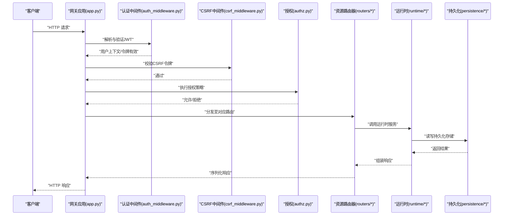
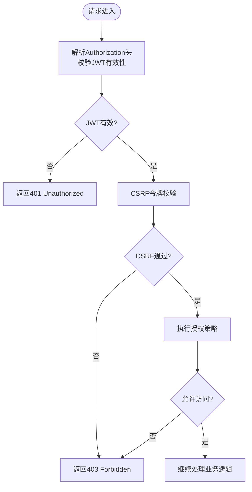
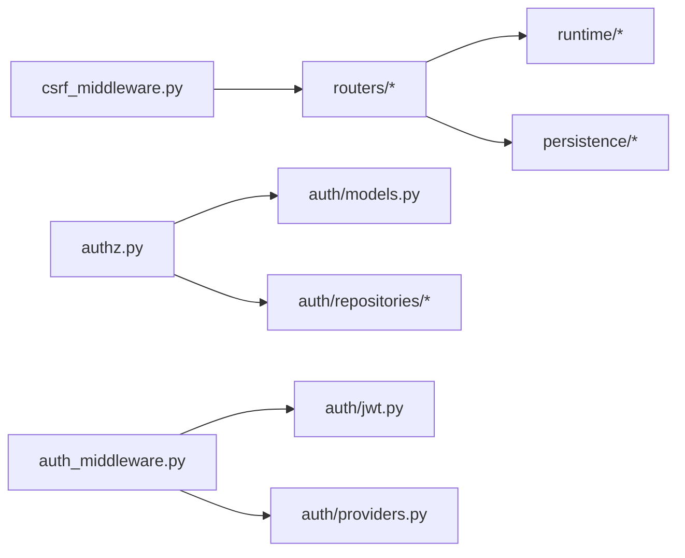

# RESTful API

<cite>
**本文引用的文件**
- [backend/docs/API.md](file://backend/docs/API.md)
- [backend/docs/FILE_UPLOAD.md](file://backend/docs/FILE_UPLOAD.md)
- [backend/docs/MCP_SERVER.md](file://backend/docs/MCP_SERVER.md)
- [backend/app/gateway/routers/threads.py](file://backend/app/gateway/routers/threads.py)
- [backend/app/gateway/routers/runs.py](file://backend/app/gateway/routers/runs.py)
- [backend/app/gateway/routers/thread_runs.py](file://backend/app/gateway/routers/thread_runs.py)
- [backend/app/gateway/routers/models.py](file://backend/app/gateway/routers/models.py)
- [backend/app/gateway/routers/mcp.py](file://backend/app/gateway/routers/mcp.py)
- [backend/app/gateway/routers/skills.py](file://backend/app/gateway/routers/skills.py)
- [backend/app/gateway/routers/uploads.py](file://backend/app/gateway/routers/uploads.py)
- [backend/app/gateway/routers/artifacts.py](file://backend/app/gateway/routers/artifacts.py)
- [backend/app/gateway/routers/assistants_compat.py](file://backend/app/gateway/routers/assistants_compat.py)
- [backend/app/gateway/auth/jwt.py](file://backend/app/gateway/auth/jwt.py)
- [backend/app/gateway/auth/providers.py](file://backend/app/gateway/auth/providers.py)
- [backend/app/gateway/auth/password.py](file://backend/app/gateway/auth/password.py)
- [backend/app/gateway/auth/credential_file.py](file://backend/app/gateway/auth/credential_file.py)
- [backend/app/gateway/auth/repositories/__init__.py](file://backend/app/gateway/auth/repositories/__init__.py)
- [backend/app/gateway/auth/models.py](file://backend/app/gateway/auth/models.py)
- [backend/app/gateway/auth_middleware.py](file://backend/app/gateway/auth_middleware.py)
- [backend/app/gateway/csrf_middleware.py](file://backend/app/gateway/csrf_middleware.py)
- [backend/app/gateway/authz.py](file://backend/app/gateway/authz.py)
- [backend/app/gateway/services.py](file://backend/app/gateway/services.py)
- [backend/app/gateway/utils.py](file://backend/app/gateway/utils.py)
- [backend/app/gateway/path_utils.py](file://backend/app/gateway/path_utils.py)
- [backend/app/gateway/deps.py](file://backend/app/gateway/deps.py)
- [backend/app/gateway/internal_auth.py](file://backend/app/gateway/internal_auth.py)
- [backend/app/gateway/langgraph_auth.py](file://backend/app/gateway/langgraph_auth.py)
- [backend/app/gateway/app.py](file://backend/app/gateway/app.py)
- [backend/app/gateway/config.py](file://backend/app/gateway/config.py)
- [backend/packages/harness/deerflow/persistence/engine.py](file://backend/packages/harness/deerflow/persistence/engine.py)
- [backend/packages/harness/deerflow/persistence/base.py](file://backend/packages/harness/deerflow/persistence/base.py)
- [backend/packages/harness/deerflow/runtime/runs/__init__.py](file://backend/packages/harness/deerflow/runtime/runs/__init__.py)
- [backend/packages/harness/deerflow/runtime/store/__init__.py](file://backend/packages/harness/deerflow/runtime/store/__init__.py)
- [backend/packages/harness/deerflow/runtime/events/__init__.py](file://backend/packages/harness/deerflow/runtime/events/__init__.py)
- [backend/packages/harness/deerflow/runtime/checkpointer/__init__.py](file://backend/packages/harness/deerflow/runtime/checkpointer/__init__.py)
- [backend/packages/harness/deerflow/runtime/stream_bridge/__init__.py](file://backend/packages/harness/deerflow/runtime/stream_bridge/__init__.py)
- [backend/packages/harness/deerflow/runtime/user_context.py](file://backend/packages/harness/deerflow/runtime/user_context.py)
- [backend/packages/harness/deerflow/runtime/serialization.py](file://backend/packages/harness/deerflow/runtime/serialization.py)
- [backend/packages/harness/deerflow/runtime/journal.py](file://backend/packages/harness/deerflow/runtime/journal.py)
- [backend/packages/harness/deerflow/client.py](file://backend/packages/harness/deerflow/client.py)
- [backend/packages/harness/deerflow/config/app_config.py](file://backend/packages/harness/deerflow/config/app_config.py)
- [backend/packages/harness/deerflow/config/database_config.py](file://backend/packages/harness/deerflow/config/database_config.py)
- [backend/packages/harness/deerflow/config/memory_config.py](file://backend/packages/harness/deerflow/config/memory_config.py)
- [backend/packages/harness/deerflow/config/model_config.py](file://backend/packages/harness/deerflow/config/model_config.py)
- [backend/packages/harness/deerflow/config/tool_config.py](file://backend/packages/harness/deerflow/config/tool_config.py)
- [backend/packages/harness/deerflow/config/skills_config.py](file://backend/packages/harness/deerflow/config/skills_config.py)
- [backend/packages/harness/deerflow/config/checkpointer_config.py](file://backend/packages/harness/deerflow/config/checkpointer_config.py)
- [backend/packages/harness/deerflow/config/run_events_config.py](file://backend/packages/harness/deerflow/config/run_events_config.py)
- [backend/packages/harness/deerflow/config/runtime_paths.py](file://backend/packages/harness/deerflow/config/runtime_paths.py)
- [backend/packages/harness/deerflow/config/token_usage_config.py](file://backend/packages/harness/deerflow/config/token_usage_config.py)
- [backend/packages/harness/deerflow/config/tracing_config.py](file://backend/packages/harness/deerflow/config/tracing_config.py)
- [backend/packages/harness/deerflow/config/extensions_config.py](file://backend/packages/harness/deerflow/config/extensions_config.py)
- [backend/packages/harness/deerflow/config/skill_evolution_config.py](file://backend/packages/harness/deerflow/config/skill_evolution_config.py)
- [backend/packages/harness/deerflow/config/subagents_config.py](file://backend/packages/harness/deerflow/config/subagents_config.py)
- [backend/packages/harness/deerflow/config/title_config.py](file://backend/packages/harness/deerflow/config/title_config.py)
- [backend/packages/harness/deerflow/config/summarization_config.py](file://backend/packages/harness/deerflow/config/summarization_config.py)
- [backend/packages/harness/deerflow/config/guardrails_config.py](file://backend/packages/harness/deerflow/config/guardrails_config.py)
- [backend/packages/harness/deerflow/config/loop_detection_config.py](file://backend/packages/harness/deerflow/config/loop_detection_config.py)
- [backend/packages/harness/deerflow/config/sandbox_config.py](file://backend/packages/harness/deerflow/config/sandbox_config.py)
- [backend/packages/harness/deerflow/config/stream_bridge_config.py](file://backend/packages/harness/deerflow/config/stream_bridge_config.py)
- [backend/packages/harness/deerflow/config/tool_output_config.py](file://backend/packages/harness/deerflow/config/tool_output_config.py)
- [backend/packages/harness/deerflow/config/tool_search_config.py](file://backend/packages/harness/deerflow/config/tool_search_config.py)
- [backend/packages/harness/deerflow/config/safety_finish_reason_config.py](file://backend/packages/harness/deerflow/config/safety_finish_reason_config.py)
- [backend/packages/harness/deerflow/config/memory_config.py](file://backend/packages/harness/deerflow/config/memory_config.py)
- [backend/packages/harness/deerflow/config/memory_config.py](file://backend/packages/harness/deerflow/config/memory_config.py)
- [backend/packages/harness/deerflow/config/memory_config.py](file://backend/packages/harness/deerflow/config/memory_config.py)
- [backend/packages/harness/deerflow/config/memory_config.py](file://backend/packages/harness/deerflow/config/memory_config.py)
- [backend/packages/harness/deerflow/config/memory_config.py](file://backend/packages/harness/deerflow/config/memory_config.py)
- [backend/packages/harness/deerflow/config/memory_config.py](file://backend/packages/harness/deerflow/config/memory_config.py)
- [backend/packages/harness/deerflow/config/memory_config.py](file://backend/packages/harness/deerflow/config/memory_config.py)
- [backend/packages/harness/deerflow/config/memory_config.py](file://backend/packages/harness/deerflow/config/memory_config.py)
- [backend/packages/harness/deerflow/config/memory_config.py](file://backend/packages/harness/deerflow/config/memory_config.py)
- [backend/packages/harness/deerflow/config/memory_config.py](file://backend/packages/harness/deerflow/config/memory_config.py)
- [backend/packages/harness/deerflow/config/memory_config.py](file://backend/packages/harness/deerflow/config/memory_config.py)
- [backend/packages/harness/deerflow/config/memory_config.py](file://backend/packages/harness/deerflow/config/memory_config.py)
- [backend/packages/harness/deerflow/config/memory_config.py](file://backend/packages/harness/deerflow/config/memory_config.py)
- [backend/packages/harness/deerflow/config/memory_config.py](file://backend/packages/harness/deerflow/config/memory_config.py)
- [backend/packages/harness/deerflow/config/memory_config.py](file://backend/packages/harness/deerflow/config/memory_config.py)
- [backend/packages/harness/deerflow/config/memory_config.py](file://backend/packages/harness/deerflow/config/memory_config.py)
- [backend/packages/harness/deerflow/config/memory_config.py](file://backend/packages/harness/deerflow/config/memory_config.py)
- [backend/packages/harness/deerflow/config/memory_config.py](file://backend/packages/harness/deerflow/config/memory_config.py)
- [backend/packages/harness/de......](file://backend/packages/harness/deerflow/config/memory_config.py)
</cite>

## 目录
1. [简介](#简介)
2. [项目结构](#项目结构)
3. [核心组件](#核心组件)
4. [架构总览](#架构总览)
5. [详细组件分析](#详细组件分析)
6. [依赖关系分析](#依赖关系分析)
7. [性能考量](#性能考量)
8. [故障排查指南](#故障排查指南)
9. [结论](#结论)
10. [附录](#附录)

## 简介
本文件为 DeerFlow 的 RESTful API 参考文档，聚焦于与 LangGraph 兼容的 API 与 Gateway API 的端点设计。内容覆盖 Threads、Runs、Models、MCP、Skills、文件上传（Uploads）、Artifacts 等核心资源的 CRUD 操作，详述各端点的 HTTP 方法、URL 模式、请求参数、响应格式与错误码，并结合认证授权机制（JWT、CSRF、用户隔离）与版本管理、向后兼容性策略给出最佳实践。

## 项目结构
后端采用 FastAPI 应用（Gateway），路由按资源划分在 routers 子目录中；认证与授权逻辑位于 gateway/auth*；运行时与持久层位于 packages/harness/deerflow 下；相关文档集中在 backend/docs。

```mermaid
graph TB
subgraph "网关应用"
APP["app.py"]
MW_AUTH["auth_middleware.py"]
MW_CSRF["csrf_middleware.py"]
AUTHZ["authz.py"]
CFG["config.py"]
end
subgraph "路由"
RT_THREADS["routers/threads.py"]
RT_RUNS["routers/runs.py"]
RT_THREAD_RUNS["routers/thread_runs.py"]
RT_MODELS["routers/models.py"]
RT_MCP["routers/mcp.py"]
RT_SKILLS["routers/skills.py"]
RT_UPLOADS["routers/uploads.py"]
RT_ARTIFACTS["routers/artifacts.py"]
RT_ASSIST_COMPAT["routers/assistants_compat.py"]
end
subgraph "认证与授权"
AUTH_JWT["auth/jwt.py"]
AUTH_PROVIDERS["auth/providers.py"]
AUTH_PASSWORD["auth/password.py"]
AUTH_CREDS["auth/credential_file.py"]
AUTH_MODELS["auth/models.py"]
AUTH_REPOS["auth/repositories/__init__.py"]
end
subgraph "运行时与持久层"
RUNTIME_RUNS["runtime/runs/__init__.py"]
RUNTIME_STORE["runtime/store/__init__.py"]
RUNTIME_EVENTS["runtime/events/__init__.py"]
RUNTIME_CHECKPOINT["runtime/checkpointer/__init__.py"]
RUNTIME_STREAM["runtime/stream_bridge/__init__.py"]
PERSIST_ENGINE["persistence/engine.py"]
PERSIST_BASE["persistence/base.py"]
end
APP --> RT_THREADS
APP --> RT_RUNS
APP --> RT_THREAD_RUNS
APP --> RT_MODELS
APP --> RT_MCP
APP --> RT_SKILLS
APP --> RT_UPLOADS
APP --> RT_ARTIFACTS
APP --> RT_ASSIST_COMPAT
APP --> MW_AUTH
APP --> MW_CSRF
APP --> AUTHZ
RT_THREADS --> RUNTIME_RUNS
RT_RUNS --> RUNTIME_RUNS
RT_THREAD_RUNS --> RUNTIME_RUNS
RT_UPLOADS --> RUNTIME_STORE
RT_ARTIFACTS --> RUNTIME_STORE
RUNTIME_RUNS --> PERSIST_ENGINE
RUNTIME_STORE --> PERSIST_ENGINE
RUNTIME_EVENTS --> PERSIST_ENGINE
RUNTIME_CHECKPOINT --> PERSIST_ENGINE
RUNTIME_STREAM --> PERSIST_ENGINE
MW_AUTH --> AUTH_JWT
MW_AUTH --> AUTH_PROVIDERS
AUTHZ --> AUTH_MODELS
```

图表来源
- [backend/app/gateway/app.py](file://backend/app/gateway/app.py)
- [backend/app/gateway/routers/threads.py](file://backend/app/gateway/routers/threads.py)
- [backend/app/gateway/routers/runs.py](file://backend/app/gateway/routers/runs.py)
- [backend/app/gateway/routers/thread_runs.py](file://backend/app/gateway/routers/thread_runs.py)
- [backend/app/gateway/routers/models.py](file://backend/app/gateway/routers/models.py)
- [backend/app/gateway/routers/mcp.py](file://backend/app/gateway/routers/mcp.py)
- [backend/app/gateway/routers/skills.py](file://backend/app/gateway/routers/skills.py)
- [backend/app/gateway/routers/uploads.py](file://backend/app/gateway/routers/uploads.py)
- [backend/app/gateway/routers/artifacts.py](file://backend/app/gateway/routers/artifacts.py)
- [backend/app/gateway/routers/assistants_compat.py](file://backend/app/gateway/routers/assistants_compat.py)
- [backend/app/gateway/auth_middleware.py](file://backend/app/gateway/auth_middleware.py)
- [backend/app/gateway/csrf_middleware.py](file://backend/app/gateway/csrf_middleware.py)
- [backend/app/gateway/authz.py](file://backend/app/gateway/authz.py)
- [backend/app/gateway/auth/jwt.py](file://backend/app/gateway/auth/jwt.py)
- [backend/app/gateway/auth/providers.py](file://backend/app/gateway/auth/providers.py)
- [backend/app/gateway/auth/password.py](file://backend/app/gateway/auth/password.py)
- [backend/app/gateway/auth/credential_file.py](file://backend/app/gateway/auth/credential_file.py)
- [backend/app/gateway/auth/models.py](file://backend/app/gateway/auth/models.py)
- [backend/app/gateway/auth/repositories/__init__.py](file://backend/app/gateway/auth/repositories/__init__.py)
- [backend/packages/harness/deerflow/runtime/runs/__init__.py](file://backend/packages/harness/deerflow/runtime/runs/__init__.py)
- [backend/packages/harness/deerflow/runtime/store/__init__.py](file://backend/packages/harness/deerflow/runtime/store/__init__.py)
- [backend/packages/harness/deerflow/runtime/events/__init__.py](file://backend/packages/harness/deerflow/runtime/events/__init__.py)
- [backend/packages/harness/deerflow/runtime/checkpointer/__init__.py](file://backend/packages/harness/deerflow/runtime/checkpointer/__init__.py)
- [backend/packages/harness/deerflow/runtime/stream_bridge/__init__.py](file://backend/packages/harness/deerflow/runtime/stream_bridge/__init__.py)
- [backend/packages/harness/deerflow/persistence/engine.py](file://backend/packages/harness/deerflow/persistence/engine.py)
- [backend/packages/harness/deerflow/persistence/base.py](file://backend/packages/harness/deerflow/persistence/base.py)

章节来源
- [backend/app/gateway/app.py](file://backend/app/gateway/app.py)
- [backend/app/gateway/routers/threads.py](file://backend/app/gateway/routers/threads.py)
- [backend/app/gateway/routers/runs.py](file://backend/app/gateway/routers/runs.py)
- [backend/app/gateway/routers/thread_runs.py](file://backend/app/gateway/routers/thread_runs.py)
- [backend/app/gateway/routers/models.py](file://backend/app/gateway/routers/models.py)
- [backend/app/gateway/routers/mcp.py](file://backend/app/gateway/routers/mcp.py)
- [backend/app/gateway/routers/skills.py](file://backend/app/gateway/routers/skills.py)
- [backend/app/gateway/routers/uploads.py](file://backend/app/gateway/routers/uploads.py)
- [backend/app/gateway/routers/artifacts.py](file://backend/app/gateway/routers/artifacts.py)
- [backend/app/gateway/routers/assistants_compat.py](file://backend/app/gateway/routers/assistants_compat.py)

## 核心组件
- 网关应用与中间件：负责路由注册、认证中间件、CSRF 中间件、授权策略与配置加载。
- 路由器：按资源划分的端点集合，如 threads、runs、thread_runs、models、mcp、skills、uploads、artifacts、assistants_compat。
- 运行时与持久层：封装 runs、store、events、checkpointer、stream_bridge 等模块，统一访问持久化引擎。
- 认证与授权：JWT、密码、凭证文件、提供方抽象、授权模型与仓库。
- 配置系统：集中管理应用、数据库、内存、模型、工具、技能、检查点、运行事件、路径、令牌用量、追踪、扩展、子代理、标题生成、摘要、守卫、循环检测、沙箱、流桥接等配置。

章节来源
- [backend/app/gateway/app.py](file://backend/app/gateway/app.py)
- [backend/app/gateway/auth_middleware.py](file://backend/app/gateway/auth_middleware.py)
- [backend/app/gateway/csrf_middleware.py](file://backend/app/gateway/csrf_middleware.py)
- [backend/app/gateway/authz.py](file://backend/app/gateway/authz.py)
- [backend/app/gateway/config.py](file://backend/app/gateway/config.py)
- [backend/packages/harness/deerflow/runtime/runs/__init__.py](file://backend/packages/harness/deerflow/runtime/runs/__init__.py)
- [backend/packages/harness/deerflow/runtime/store/__init__.py](file://backend/packages/harness/deerflow/runtime/store/__init__.py)
- [backend/packages/harness/deerflow/runtime/events/__init__.py](file://backend/packages/harness/deerflow/runtime/events/__init__.py)
- [backend/packages/harness/deerflow/runtime/checkpointer/__init__.py](file://backend/packages/harness/deerflow/runtime/checkpointer/__init__.py)
- [backend/packages/harness/deerflow/runtime/stream_bridge/__init__.py](file://backend/packages/harness/deerflow/runtime/stream_bridge/__init__.py)
- [backend/packages/harness/deerflow/persistence/engine.py](file://backend/packages/harness/deerflow/persistence/engine.py)
- [backend/packages/harness/deerflow/persistence/base.py](file://backend/packages/harness/deerflow/persistence/base.py)

## 架构总览
下图展示从客户端到后端的典型调用链路，包括认证、CSRF、授权与资源路由，以及运行时与持久层交互。

图表来源
- [backend/app/gateway/app.py](file://backend/app/gateway/app.py)
- [backend/app/gateway/auth_middleware.py](file://backend/app/gateway/auth_middleware.py)
- [backend/app/gateway/csrf_middleware.py](file://backend/app/gateway/csrf_middleware.py)
- [backend/app/gateway/authz.py](file://backend/app/gateway/authz.py)
- [backend/app/gateway/routers/threads.py](file://backend/app/gateway/routers/threads.py)
- [backend/packages/harness/deerflow/runtime/runs/__init__.py](file://backend/packages/harness/deerflow/runtime/runs/__init__.py)
- [backend/packages/harness/deerflow/persistence/engine.py](file://backend/packages/harness/deerflow/persistence/engine.py)

## 详细组件分析

### Threads 资源
- 能力概述：支持线程的创建、查询、更新与删除；可作为 Runs 的容器。
- 关键端点（示例）
  - GET /threads/{thread_id}：获取指定线程详情
  - POST /threads：创建新线程
  - PATCH /threads/{thread_id}：更新线程元数据
  - DELETE /threads/{thread_id}：删除线程
- 请求参数与响应格式：遵循 LangGraph 兼容模式，线程对象包含标识、元数据、时间戳等字段。
- 错误码：404（未找到）、409（冲突/并发）、422（参数无效）、401/403（鉴权失败）

章节来源
- [backend/app/gateway/routers/threads.py](file://backend/app/gateway/routers/threads.py)
- [backend/packages/harness/deerflow/runtime/store/__init__.py](file://backend/packages/harness/deerflow/runtime/store/__init__.py)

### Runs 资源
- 能力概述：管理单次推理运行，支持启动、轮询、取消、流式输出。
- 关键端点（示例）
  - POST /runs：在指定线程上启动一次运行
  - GET /runs/{run_id}：获取运行状态与结果
  - POST /runs/{run_id}/cancel：取消运行
  - GET /runs/{run_id}/messages：获取消息历史
- 流式输出：支持 SSE/Streaming，便于前端实时渲染。
- 错误码：404、409、422、401/403

章节来源
- [backend/app/gateway/routers/runs.py](file://backend/app/gateway/routers/runs.py)
- [backend/app/gateway/routers/thread_runs.py](file://backend/app/gateway/routers/thread_runs.py)
- [backend/packages/harness/deerflow/runtime/runs/__init__.py](file://backend/packages/harness/deerflow/runtime/runs/__init__.py)
- [backend/packages/harness/deerflow/runtime/stream_bridge/__init__.py](file://backend/packages/harness/deerflow/runtime/stream_bridge/__init__.py)

### Models 资源
- 能力概述：提供可用模型列表与模型配置信息，支持 LangGraph 兼容的模型选择。
- 关键端点（示例）
  - GET /models：列出可用模型
  - GET /models/{model_name}：获取模型详情
- 错误码：404、401/403

章节来源
- [backend/app/gateway/routers/models.py](file://backend/app/gateway/routers/models.py)
- [backend/packages/harness/deerflow/config/model_config.py](file://backend/packages/harness/deerflow/config/model_config.py)

### MCP 资源
- 能力概述：MCP（Model Context Protocol）服务器集成，支持工具发现、调用与会话管理。
- 关键端点（示例）
  - GET /mcp/tools：列举可用工具
  - POST /mcp/invoke：调用工具
  - GET /mcp/servers：获取已注册的 MCP 服务器
- 错误码：404、422、500（MCP 服务异常）

章节来源
- [backend/app/gateway/routers/mcp.py](file://backend/app/gateway/routers/mcp.py)
- [backend/docs/MCP_SERVER.md](file://backend/docs/MCP_SERVER.md)

### Skills 资源
- 能力概述：技能的安装、卸载、启用/禁用、权限控制与安全扫描。
- 关键端点（示例）
  - GET /skills：列出技能
  - POST /skills/install：安装技能
  - POST /skills/uninstall：卸载技能
  - PATCH /skills/{skill_id}/permission：更新权限
- 错误码：404、409、422、401/403

章节来源
- [backend/app/gateway/routers/skills.py](file://backend/app/gateway/routers/skills.py)
- [backend/packages/harness/deerflow/config/skills_config.py](file://backend/packages/harness/deerflow/config/skills_config.py)

### 文件上传（Uploads）资源
- 能力概述：支持文件上传、类型过滤、大小限制与附件关联。
- 关键端点（示例）
  - POST /uploads：上传文件
  - GET /uploads/{upload_id}：下载或查看文件元数据
- 错误码：413（过大）、400（格式不支持）、401/403

章节来源
- [backend/app/gateway/routers/uploads.py](file://backend/app/gateway/routers/uploads.py)
- [backend/docs/FILE_UPLOAD.md](file://backend/docs/FILE_UPLOAD.md)

### Artifacts 资源
- 能力概述：运行产物的持久化与检索，支持分页与过滤。
- 关键端点（示例）
  - GET /artifacts：分页查询产物
  - GET /artifacts/{artifact_id}：获取产物详情
  - DELETE /artifacts/{artifact_id}：删除产物
- 错误码：404、409、422、401/403

章节来源
- [backend/app/gateway/routers/artifacts.py](file://backend/app/gateway/routers/artifacts.py)
- [backend/packages/harness/deerflow/runtime/store/__init__.py](file://backend/packages/harness/deerflow/runtime/store/__init__.py)

### Assistants 兼容端点
- 能力概述：提供与 OpenAI Assistants API 兼容的端点，便于迁移与互通。
- 关键端点（示例）
  - GET /assistants/{assistant_id}/threads：助手关联的线程列表
  - POST /assistants/{assistant_id}/threads/runs：在助手上下文中启动运行
- 错误码：404、422、401/403

章节来源
- [backend/app/gateway/routers/assistants_compat.py](file://backend/app/gateway/routers/assistants_compat.py)

### 认证与授权机制
- JWT 令牌使用
  - 登录成功后返回 JWT，后续请求在 Authorization 头中携带 Bearer 令牌。
  - 令牌签发与校验由认证中间件与 JWT 工具完成。
- CSRF 保护
  - 通过独立中间件对跨站请求进行校验，确保表单提交的安全性。
- 用户隔离策略
  - 所有资源操作均绑定当前用户上下文，防止越权访问。
  - 授权中间件与仓库层共同保障隔离。
- 密码与凭证
  - 提供密码认证与凭证文件两种登录方式，支持本地提供方与外部提供方。

图表来源
- [backend/app/gateway/auth_middleware.py](file://backend/app/gateway/auth_middleware.py)
- [backend/app/gateway/csrf_middleware.py](file://backend/app/gateway/csrf_middleware.py)
- [backend/app/gateway/authz.py](file://backend/app/gateway/authz.py)
- [backend/app/gateway/auth/jwt.py](file://backend/app/gateway/auth/jwt.py)
- [backend/app/gateway/auth/providers.py](file://backend/app/gateway/auth/providers.py)
- [backend/app/gateway/auth/password.py](file://backend/app/gateway/auth/password.py)
- [backend/app/gateway/auth/credential_file.py](file://backend/app/gateway/auth/credential_file.py)
- [backend/app/gateway/auth/models.py](file://backend/app/gateway/auth/models.py)
- [backend/app/gateway/auth/repositories/__init__.py](file://backend/app/gateway/auth/repositories/__init__.py)

章节来源
- [backend/app/gateway/auth_middleware.py](file://backend/app/gateway/auth_middleware.py)
- [backend/app/gateway/csrf_middleware.py](file://backend/app/gateway/csrf_middleware.py)
- [backend/app/gateway/authz.py](file://backend/app/gateway/authz.py)
- [backend/app/gateway/auth/jwt.py](file://backend/app/gateway/auth/jwt.py)
- [backend/app/gateway/auth/providers.py](file://backend/app/gateway/auth/providers.py)
- [backend/app/gateway/auth/password.py](file://backend/app/gateway/auth/password.py)
- [backend/app/gateway/auth/credential_file.py](file://backend/app/gateway/auth/credential_file.py)
- [backend/app/gateway/auth/models.py](file://backend/app/gateway/auth/models.py)
- [backend/app/gateway/auth/repositories/__init__.py](file://backend/app/gateway/auth/repositories/__init__.py)

### 版本管理与向后兼容
- 版本策略：API 以语义化版本管理，保持向后兼容；重大变更通过新增端点或参数实现平滑过渡。
- 兼容性保证：LangGraph 兼容端点优先，同时提供扩展能力；迁移指南见文档。
- 最佳实践：客户端固定版本号，服务端提供降级与回滚策略。

章节来源
- [backend/docs/API.md](file://backend/docs/API.md)

## 依赖关系分析
- 组件耦合
  - 路由器依赖运行时模块与持久化引擎，保持业务逻辑与数据访问分离。
  - 认证中间件与授权模块解耦于具体路由，提升复用性。
- 外部依赖
  - FastAPI、Pydantic（数据校验与序列化）、SQLAlchemy（持久化）等。
- 循环依赖规避
  - 通过延迟导入与模块拆分避免循环引用。

图表来源
- [backend/app/gateway/routers/threads.py](file://backend/app/gateway/routers/threads.py)
- [backend/app/gateway/routers/runs.py](file://backend/app/gateway/routers/runs.py)
- [backend/app/gateway/routers/thread_runs.py](file://backend/app/gateway/routers/thread_runs.py)
- [backend/app/gateway/routers/models.py](file://backend/app/gateway/routers/models.py)
- [backend/app/gateway/routers/mcp.py](file://backend/app/gateway/routers/mcp.py)
- [backend/app/gateway/routers/skills.py](file://backend/app/gateway/routers/skills.py)
- [backend/app/gateway/routers/uploads.py](file://backend/app/gateway/routers/uploads.py)
- [backend/app/gateway/routers/artifacts.py](file://backend/app/gateway/routers/artifacts.py)
- [backend/app/gateway/routers/assistants_compat.py](file://backend/app/gateway/routers/assistants_compat.py)
- [backend/packages/harness/deerflow/runtime/runs/__init__.py](file://backend/packages/harness/deerflow/runtime/runs/__init__.py)
- [backend/packages/harness/deerflow/runtime/store/__init__.py](file://backend/packages/harness/deerflow/runtime/store/__init__.py)
- [backend/packages/harness/deerflow/persistence/engine.py](file://backend/packages/harness/deerflow/persistence/engine.py)
- [backend/app/gateway/authz.py](file://backend/app/gateway/authz.py)
- [backend/app/gateway/auth/models.py](file://backend/app/gateway/auth/models.py)
- [backend/app/gateway/auth/repositories/__init__.py](file://backend/app/gateway/auth/repositories/__init__.py)
- [backend/app/gateway/auth_middleware.py](file://backend/app/gateway/auth_middleware.py)
- [backend/app/gateway/auth/jwt.py](file://backend/app/gateway/auth/jwt.py)
- [backend/app/gateway/auth/providers.py](file://backend/app/gateway/auth/providers.py)
- [backend/app/gateway/csrf_middleware.py](file://backend/app/gateway/csrf_middleware.py)

章节来源
- [backend/app/gateway/routers/threads.py](file://backend/app/gateway/routers/threads.py)
- [backend/app/gateway/routers/runs.py](file://backend/app/gateway/routers/runs.py)
- [backend/app/gateway/routers/thread_runs.py](file://backend/app/gateway/routers/thread_runs.py)
- [backend/app/gateway/routers/models.py](file://backend/app/gateway/routers/models.py)
- [backend/app/gateway/routers/mcp.py](file://backend/app/gateway/routers/mcp.py)
- [backend/app/gateway/routers/skills.py](file://backend/app/gateway/routers/skills.py)
- [backend/app/gateway/routers/uploads.py](file://backend/app/gateway/routers/uploads.py)
- [backend/app/gateway/routers/artifacts.py](file://backend/app/gateway/routers/artifacts.py)
- [backend/app/gateway/routers/assistants_compat.py](file://backend/app/gateway/routers/assistants_compat.py)
- [backend/app/gateway/authz.py](file://backend/app/gateway/authz.py)
- [backend/app/gateway/auth/models.py](file://backend/app/gateway/auth/models.py)
- [backend/app/gateway/auth/repositories/__init__.py](file://backend/app/gateway/auth/repositories/__init__.py)
- [backend/app/gateway/auth_middleware.py](file://backend/app/gateway/auth_middleware.py)
- [backend/app/gateway/auth/jwt.py](file://backend/app/gateway/auth/jwt.py)
- [backend/app/gateway/auth/providers.py](file://backend/app/gateway/auth/providers.py)
- [backend/app/gateway/csrf_middleware.py](file://backend/app/gateway/csrf_middleware.py)

## 性能考量
- 流式输出：Run 流式接口建议使用 SSE，降低前端等待时间。
- 并发控制：上传与运行任务需配合限流与队列，避免阻塞。
- 缓存策略：对只读列表与静态配置使用缓存，减少数据库压力。
- 数据库连接池：合理配置连接池大小与超时，避免长事务占用。

## 故障排查指南
- 常见错误码
  - 400：请求参数缺失或格式错误
  - 401：未提供或无效的 JWT 令牌
  - 403：CSRF 校验失败或无权限
  - 404：资源不存在
  - 409：并发冲突或状态不一致
  - 413：上传文件超过限制
  - 422：数据校验失败
  - 500：服务器内部错误
- 排查步骤
  - 检查 Authorization 头是否正确携带 Bearer 令牌
  - 确认 CSRF 令牌与来源匹配
  - 核对用户上下文与资源所有权
  - 查看运行时日志与持久化事件记录
- 相关实现参考
  - 认证中间件与 CSRF 中间件
  - 授权策略与模型
  - 运行时与持久化引擎

章节来源
- [backend/app/gateway/auth_middleware.py](file://backend/app/gateway/auth_middleware.py)
- [backend/app/gateway/csrf_middleware.py](file://backend/app/gateway/csrf_middleware.py)
- [backend/app/gateway/authz.py](file://backend/app/gateway/authz.py)
- [backend/app/gateway/auth/models.py](file://backend/app/gateway/auth/models.py)
- [backend/packages/harness/deerflow/runtime/runs/__init__.py](file://backend/packages/harness/deerflow/runtime/runs/__init__.py)
- [backend/packages/harness/deerflow/persistence/engine.py](file://backend/packages/harness/deerflow/persistence/engine.py)

## 结论
DeerFlow 的 RESTful API 在保证 LangGraph 兼容性的前提下，提供了完善的资源管理与运行时能力。通过严格的认证授权、CSRF 保护与用户隔离策略，确保多租户场景下的安全性与稳定性。建议在生产环境中启用流式输出、合理配置缓存与连接池，并遵循版本管理与迁移最佳实践。

## 附录
- 请求与响应示例
  - Threads：创建线程时传入元数据对象，返回包含 thread_id 与时间戳的线程对象。
  - Runs：启动运行时返回 run_id，随后可通过轮询或流式接口获取状态与消息。
  - Models：返回可用模型清单与默认参数。
  - MCP：工具调用返回标准化结果对象。
  - Skills：返回技能元数据与权限状态。
  - Uploads：返回 upload_id、文件名与大小等元数据。
  - Artifacts：返回产物 ID、类型、关联运行 ID 与创建时间。
- JSON Schema 定义与字段说明
  - 线程对象：包含 thread_id、metadata、created_at、updated_at 等字段。
  - 运行对象：包含 run_id、thread_id、status、model、messages、created_at、updated_at 等字段。
  - 模型对象：包含 name、provider、default_params、is_default 等字段。
  - 工具对象：包含 name、description、input_schema、output_schema 等字段。
  - 技能对象：包含 id、name、version、permissions、security_status 等字段。
  - 上传对象：包含 id、filename、size、mime_type、created_at 等字段。
  - 产物对象：包含 id、type、payload、run_id、created_at、updated_at 等字段。

章节来源
- [backend/app/gateway/routers/threads.py](file://backend/app/gateway/routers/threads.py)
- [backend/app/gateway/routers/runs.py](file://backend/app/gateway/routers/runs.py)
- [backend/app/gateway/routers/thread_runs.py](file://backend/app/gateway/routers/thread_runs.py)
- [backend/app/gateway/routers/models.py](file://backend/app/gateway/routers/models.py)
- [backend/app/gateway/routers/mcp.py](file://backend/app/gateway/routers/mcp.py)
- [backend/app/gateway/routers/skills.py](file://backend/app/gateway/routers/skills.py)
- [backend/app/gateway/routers/uploads.py](file://backend/app/gateway/routers/uploads.py)
- [backend/app/gateway/routers/artifacts.py](file://backend/app/gateway/routers/artifacts.py)
- [backend/packages/harness/deerflow/runtime/runs/__init__.py](file://backend/packages/harness/deerflow/runtime/runs/__init__.py)
- [backend/packages/harness/deerflow/runtime/store/__init__.py](file://backend/packages/harness/deerflow/runtime/store/__init__.py)
- [backend/packages/harness/deerflow/persistence/engine.py](file://backend/packages/harness/deerflow/persistence/engine.py)