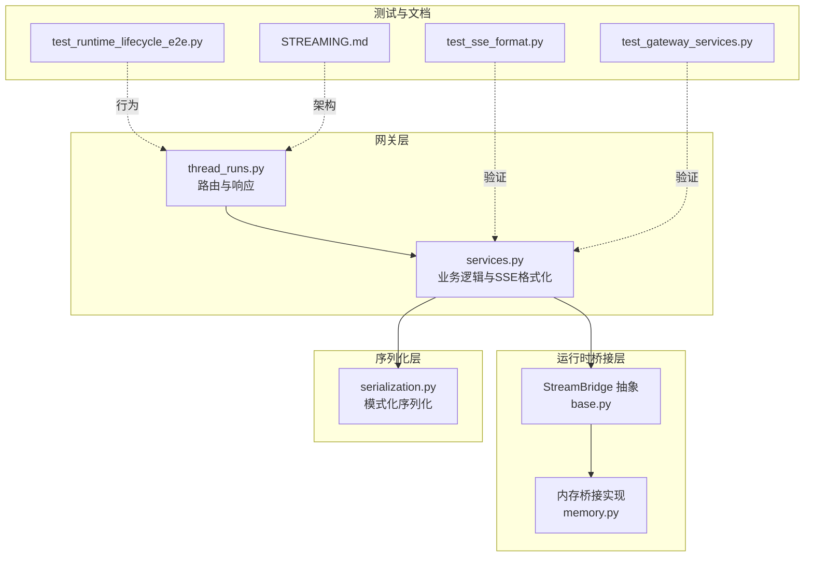
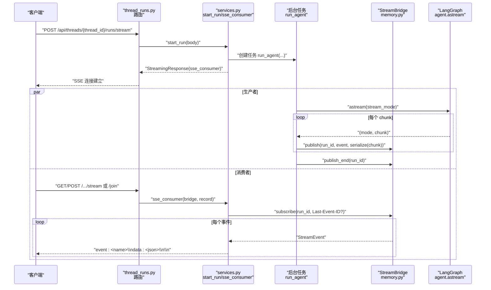
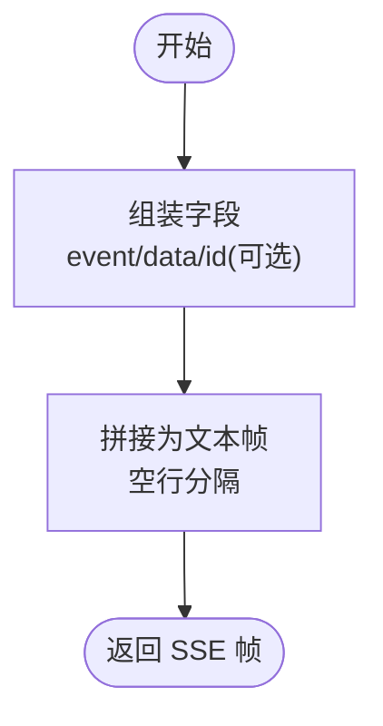
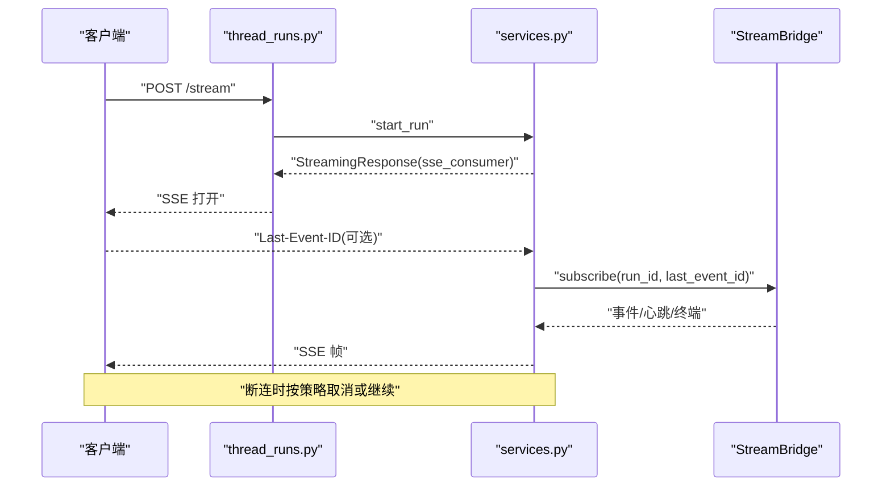
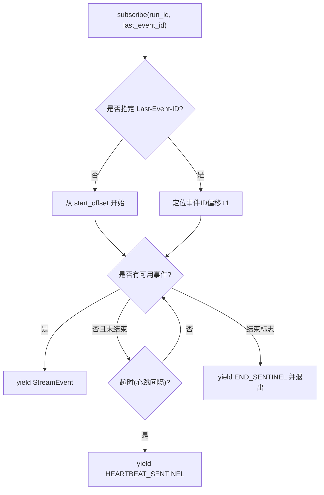
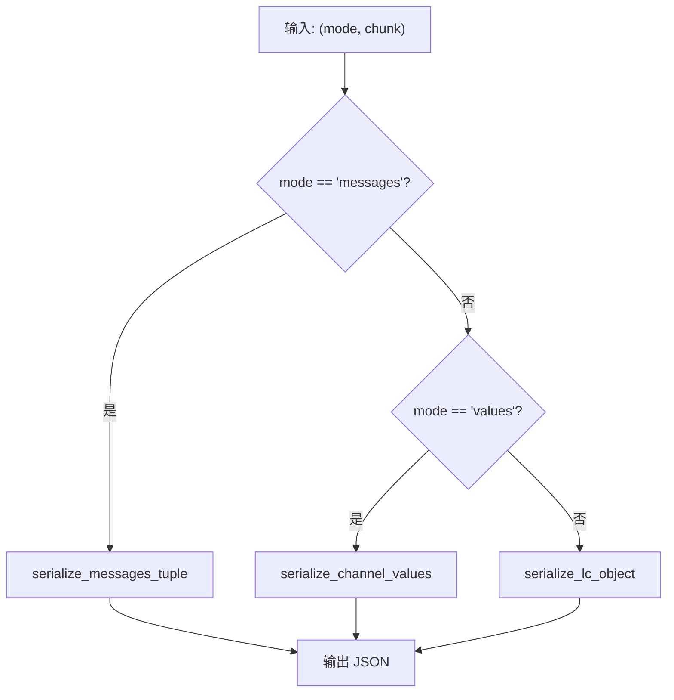
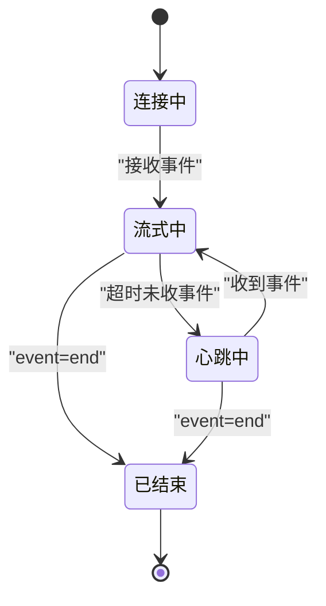
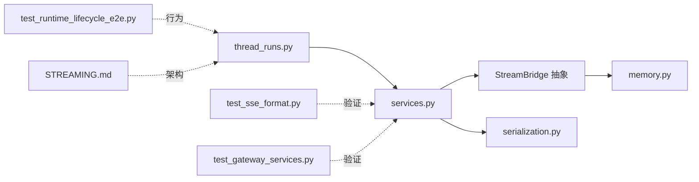

# 流式传输

<cite>
**本文引用的文件**
- [backend/app/gateway/services.py](file://backend/app/gateway/services.py)
- [backend/app/gateway/routers/thread_runs.py](file://backend/app/gateway/routers/thread_runs.py)
- [backend/packages/harness/deerflow/runtime/stream_bridge/base.py](file://backend/packages/harness/deerflow/runtime/stream_bridge/base.py)
- [backend/packages/harness/deerflow/runtime/stream_bridge/memory.py](file://backend/packages/harness/deerflow/runtime/stream_bridge/memory.py)
- [backend/packages/harness/deerflow/runtime/serialization.py](file://backend/packages/harness/deerflow/runtime/serialization.py)
- [backend/docs/STREAMING.md](file://backend/docs/STREAMING.md)
- [backend/tests/test_sse_format.py](file://backend/tests/test_sse_format.py)
- [backend/tests/test_gateway_services.py](file://backend/tests/test_gateway_services.py)
- [backend/tests/test_runtime_lifecycle_e2e.py](file://backend/tests/test_runtime_lifecycle_e2e.py)
- [skills/public/claude-to-deerflow/scripts/chat.sh](file://skills/public/claude-to-deerflow/scripts/chat.sh)
</cite>

## 目录
1. [简介](#简介)
2. [项目结构](#项目结构)
3. [核心组件](#核心组件)
4. [架构总览](#架构总览)
5. [详细组件分析](#详细组件分析)
6. [依赖关系分析](#依赖关系分析)
7. [性能考量](#性能考量)
8. [故障排查指南](#故障排查指南)
9. [结论](#结论)
10. [附录](#附录)

## 简介
本文件为 DeerFlow API 的 Server-Sent Events（SSE）流式传输系统提供权威参考。内容覆盖事件帧格式、事件类型与消息语义、连接建立与断开、事件分发与重连、缓冲与回放、性能优化与错误恢复、以及客户端解析与状态管理最佳实践。读者可据此理解并正确集成 DeerFlow 的流式能力，确保稳定、可观测且高性能的实时交互。

## 项目结构
围绕流式传输的关键代码分布在后端网关层、运行时桥接层与序列化层，并辅以测试与文档验证。下图给出与流式传输直接相关的模块关系概览。

**图表来源**
- [backend/app/gateway/routers/thread_runs.py:146-171](file://backend/app/gateway/routers/thread_runs.py#L146-L171)
- [backend/app/gateway/services.py:46-59](file://backend/app/gateway/services.py#L46-L59)
- [backend/packages/harness/deerflow/runtime/stream_bridge/base.py:16-35](file://backend/packages/harness/deerflow/runtime/stream_bridge/base.py#L16-L35)
- [backend/packages/harness/deerflow/runtime/stream_bridge/memory.py:25-134](file://backend/packages/harness/deerflow/runtime/stream_bridge/memory.py#L25-L134)
- [backend/packages/harness/deerflow/runtime/serialization.py:67-79](file://backend/packages/harness/deerflow/runtime/serialization.py#L67-L79)
- [backend/tests/test_sse_format.py:6-29](file://backend/tests/test_sse_format.py#L6-L29)
- [backend/tests/test_gateway_services.py:8-52](file://backend/tests/test_gateway_services.py#L8-L52)
- [backend/tests/test_runtime_lifecycle_e2e.py:316-340](file://backend/tests/test_runtime_lifecycle_e2e.py#L316-L340)
- [backend/docs/STREAMING.md:102-164](file://backend/docs/STREAMING.md#L102-L164)

**章节来源**
- [backend/app/gateway/routers/thread_runs.py:1-439](file://backend/app/gateway/routers/thread_runs.py#L1-L439)
- [backend/app/gateway/services.py:1-453](file://backend/app/gateway/services.py#L1-L453)
- [backend/packages/harness/deerflow/runtime/stream_bridge/base.py:1-46](file://backend/packages/harness/deerflow/runtime/stream_bridge/base.py#L1-L46)
- [backend/packages/harness/deerflow/runtime/stream_bridge/memory.py:1-134](file://backend/packages/harness/deerflow/runtime/stream_bridge/memory.py#L1-L134)
- [backend/packages/harness/deerflow/runtime/serialization.py:1-79](file://backend/packages/harness/deerflow/runtime/serialization.py#L1-L79)
- [backend/docs/STREAMING.md:102-164](file://backend/docs/STREAMING.md#L102-L164)

## 核心组件
- SSE 帧格式化器：负责将事件名、数据与可选事件 ID 组织为标准 SSE 文本帧，保证与前端 SDK 一致。
- 运行时桥接（StreamBridge）：抽象生产者（后台任务）与消费者（HTTP 客户端）之间的解耦，支持 Last-Event-ID 回放、心跳与多订阅。
- 内存桥接实现（MemoryStreamBridge）：基于 asyncio.Queue 的内存事件日志，按 run_id 分区，带有限窗口缓冲与偏移管理。
- 序列化工具：根据流模式（如 messages/values）对 LangGraph/LangChain 对象进行安全序列化，确保跨进程/网络传输的稳定性。
- 网关服务与路由：统一入口负责参数归一化、运行生命周期编排、SSE 响应构造与断连策略执行。

**章节来源**
- [backend/app/gateway/services.py:46-59](file://backend/app/gateway/services.py#L46-L59)
- [backend/packages/harness/deerflow/runtime/stream_bridge/base.py:16-35](file://backend/packages/harness/deerflow/runtime/stream_bridge/base.py#L16-L35)
- [backend/packages/harness/deerflow/runtime/stream_bridge/memory.py:25-134](file://backend/packages/harness/deerflow/runtime/stream_bridge/memory.py#L25-L134)
- [backend/packages/harness/deerflow/runtime/serialization.py:67-79](file://backend/packages/harness/deerflow/runtime/serialization.py#L67-L79)
- [backend/app/gateway/routers/thread_runs.py:146-171](file://backend/app/gateway/routers/thread_runs.py#L146-L171)

## 架构总览
下图展示从请求到事件推送的完整链路，包括生产者（agent 生成）、桥接（内存队列）、消费者（SSE 客户端）三段式协作，以及断连与重连机制。

**图表来源**
- [backend/docs/STREAMING.md:102-164](file://backend/docs/STREAMING.md#L102-L164)
- [backend/app/gateway/routers/thread_runs.py:146-171](file://backend/app/gateway/routers/thread_runs.py#L146-L171)
- [backend/app/gateway/services.py:373-400](file://backend/app/gateway/services.py#L373-L400)
- [backend/packages/harness/deerflow/runtime/stream_bridge/memory.py:85-124](file://backend/packages/harness/deerflow/runtime/stream_bridge/memory.py#L85-L124)

## 详细组件分析

### SSE 帧格式与事件类型
- 帧字段顺序：event → data → id（可选）→ 空行×2。该顺序与 LangGraph 平台协议一致，便于前端 useStream 与 Python langgraph-sdk 正确解析。
- 特殊事件：
  - end：表示终端事件，数据体为 null，用于通知客户端流结束。
  - error：数据体为对象，包含 message 与 name 字段，用于错误传播。
  - metadata：常携带 run_id、attempt 等上下文信息，支持事件 ID 标识。
- 事件 ID：由内存桥接生成“时间戳-序号”形式字符串，支持 Last-Event-ID 回放。

**图表来源**
- [backend/app/gateway/services.py:46-59](file://backend/app/gateway/services.py#L46-L59)
- [backend/tests/test_sse_format.py:6-29](file://backend/tests/test_sse_format.py#L6-L29)

**章节来源**
- [backend/app/gateway/services.py:46-59](file://backend/app/gateway/services.py#L46-L59)
- [backend/tests/test_sse_format.py:12-29](file://backend/tests/test_sse_format.py#L12-L29)
- [backend/tests/test_gateway_services.py:8-36](file://backend/tests/test_gateway_services.py#L8-L36)

### 连接建立与生命周期
- 创建运行：路由接收请求，调用服务层启动 run，创建后台任务执行 agent 流式计算。
- 建立 SSE：服务层返回 StreamingResponse，媒体类型 text/event-stream，设置缓存控制与 Content-Location 头以便前端提取元数据。
- 断连策略：客户端断开时，根据 on_disconnect 参数决定取消后台任务或继续运行（事件丢弃）。
- 等待完成：非流式等待接口通过消费桥接事件直到 END_SENTINEL，避免代理超时导致的半成品响应。

**图表来源**
- [backend/app/gateway/routers/thread_runs.py:146-171](file://backend/app/gateway/routers/thread_runs.py#L146-L171)
- [backend/app/gateway/services.py:373-400](file://backend/app/gateway/services.py#L373-L400)
- [backend/tests/test_runtime_lifecycle_e2e.py:316-340](file://backend/tests/test_runtime_lifecycle_e2e.py#L316-L340)

**章节来源**
- [backend/app/gateway/routers/thread_runs.py:146-171](file://backend/app/gateway/routers/thread_runs.py#L146-L171)
- [backend/app/gateway/services.py:265-371](file://backend/app/gateway/services.py#L265-L371)
- [backend/tests/test_runtime_lifecycle_e2e.py:316-340](file://backend/tests/test_runtime_lifecycle_e2e.py#L316-L340)

### 事件分发与重连机制
- 订阅与回放：内存桥接根据 Last-Event-ID 计算起始偏移，回放保留窗口内的事件；若未找到则从最早保留事件继续。
- 心跳：无事件期间定期发送心跳帧，保证长连接存活与轮询唤醒。
- 终止信号：END_SENTINEL 触发客户端停止消费并关闭连接。
- 缓冲策略：固定大小队列，超过上限时滑动删除旧事件并调整起始偏移，维持稳定的回放窗口。

**图表来源**
- [backend/packages/harness/deerflow/runtime/stream_bridge/memory.py:85-124](file://backend/packages/harness/deerflow/runtime/stream_bridge/memory.py#L85-L124)
- [backend/packages/harness/deerflow/runtime/stream_bridge/base.py:33-34](file://backend/packages/harness/deerflow/runtime/stream_bridge/base.py#L33-L34)

**章节来源**
- [backend/packages/harness/deerflow/runtime/stream_bridge/memory.py:51-124](file://backend/packages/harness/deerflow/runtime/stream_bridge/memory.py#L51-L124)
- [backend/packages/harness/deerflow/runtime/stream_bridge/base.py:16-35](file://backend/packages/harness/deerflow/runtime/stream_bridge/base.py#L16-L35)

### 模式化序列化与消息格式
- 模式选择：支持 values 与 messages（含 messages-tuple）等模式，服务层将请求中的 stream_mode 归一化为列表。
- 序列化策略：
  - messages：将 (chunk, metadata) 元组序列化为 [chunk_dump, metadata_dict]。
  - values：过滤内部键（如 __pregel_*），仅保留对外可见通道值。
  - 其他：递归调用 model_dump()/dict()/str 以兼容不同对象。
- 数据一致性：序列化过程确保 JSON 可传输性，避免循环引用与不可序列化对象。

**图表来源**
- [backend/packages/harness/deerflow/runtime/serialization.py:67-79](file://backend/packages/harness/deerflow/runtime/serialization.py#L67-L79)
- [backend/app/gateway/services.py:67-76](file://backend/app/gateway/services.py#L67-L76)

**章节来源**
- [backend/packages/harness/deerflow/runtime/serialization.py:16-79](file://backend/packages/harness/deerflow/runtime/serialization.py#L16-L79)
- [backend/app/gateway/services.py:67-76](file://backend/app/gateway/services.py#L67-L76)
- [backend/tests/test_gateway_services.py:39-52](file://backend/tests/test_gateway_services.py#L39-L52)

### 客户端解析与状态管理最佳实践
- 解析步骤：逐行读取 event/data/id，遇到空行合并为一个事件；end 事件数据为 null，表示流终止。
- 重连策略：记录最后收到的事件 ID，下次连接时通过 Last-Event-ID 请求头发起回放，减少重复数据。
- 错误处理：遇到 error 事件时，解析 message 与 name 字段，向用户提示具体错误来源。
- 状态机示意：

**图表来源**
- [skills/public/claude-to-deerflow/scripts/chat.sh:112-138](file://skills/public/claude-to-deerflow/scripts/chat.sh#L112-L138)
- [backend/app/gateway/services.py:373-400](file://backend/app/gateway/services.py#L373-L400)

**章节来源**
- [skills/public/claude-to-deerflow/scripts/chat.sh:112-138](file://skills/public/claude-to-deerflow/scripts/chat.sh#L112-L138)

## 依赖关系分析
- 路由依赖服务层：路由仅负责参数校验与响应封装，核心逻辑在服务层。
- 服务层依赖桥接与序列化：服务层负责 SSE 帧格式化与断连策略，同时调用序列化工具将对象转为 JSON。
- 桥接实现依赖内存存储：内存桥接以条件变量与列表维护事件队列，支持多订阅与回放。
- 测试与文档验证：测试覆盖帧格式、模式归一化与生命周期行为，文档提供端到端流程图。

**图表来源**
- [backend/app/gateway/routers/thread_runs.py:146-171](file://backend/app/gateway/routers/thread_runs.py#L146-L171)
- [backend/app/gateway/services.py:46-59](file://backend/app/gateway/services.py#L46-L59)
- [backend/packages/harness/deerflow/runtime/stream_bridge/memory.py:25-134](file://backend/packages/harness/deerflow/runtime/stream_bridge/memory.py#L25-L134)
- [backend/packages/harness/deerflow/runtime/serialization.py:67-79](file://backend/packages/harness/deerflow/runtime/serialization.py#L67-L79)
- [backend/tests/test_sse_format.py:6-29](file://backend/tests/test_sse_format.py#L6-L29)
- [backend/tests/test_gateway_services.py:8-52](file://backend/tests/test_gateway_services.py#L8-L52)
- [backend/tests/test_runtime_lifecycle_e2e.py:316-340](file://backend/tests/test_runtime_lifecycle_e2e.py#L316-L340)
- [backend/docs/STREAMING.md:102-164](file://backend/docs/STREAMING.md#L102-L164)

**章节来源**
- [backend/app/gateway/routers/thread_runs.py:1-439](file://backend/app/gateway/routers/thread_runs.py#L1-L439)
- [backend/app/gateway/services.py:1-453](file://backend/app/gateway/services.py#L1-L453)
- [backend/packages/harness/deerflow/runtime/stream_bridge/base.py:1-46](file://backend/packages/harness/deerflow/runtime/stream_bridge/base.py#L1-L46)
- [backend/packages/harness/deerflow/runtime/stream_bridge/memory.py:1-134](file://backend/packages/harness/deerflow/runtime/stream_bridge/memory.py#L1-L134)
- [backend/packages/harness/deerflow/runtime/serialization.py:1-79](file://backend/packages/harness/deerflow/runtime/serialization.py#L1-L79)
- [backend/tests/test_sse_format.py:1-30](file://backend/tests/test_sse_format.py#L1-L30)
- [backend/tests/test_gateway_services.py:1-52](file://backend/tests/test_gateway_services.py#L1-L52)
- [backend/tests/test_runtime_lifecycle_e2e.py:316-340](file://backend/tests/test_runtime_lifecycle_e2e.py#L316-L340)
- [backend/docs/STREAMING.md:102-164](file://backend/docs/STREAMING.md#L102-L164)

## 性能考量
- 缓冲窗口与内存占用：内存桥接对每 run_id 维护固定大小的事件列表，溢出时滑动删除并调整偏移，避免无限增长。
- 心跳保活：在长时间无事件时发送心跳帧，降低连接中断风险，同时作为唤醒点。
- 序列化成本：针对不同模式采用针对性序列化策略，减少不必要的转换与拷贝。
- 并发与回放：支持多订阅者，但需注意回放缓冲与偏移计算的线程安全与一致性。
- 超时与断连：路由设置 no-cache、keep-alive 与 X-Accel-Buffering=no，确保实时性；断连策略可选取消或继续，避免资源浪费。

[本节为通用性能建议，不直接分析具体文件]

## 故障排查指南
- 帧格式问题：确认 event/data/id 顺序与空行分隔；end 事件数据必须为 null；error 事件包含 message 与 name。
- 模式归一化：检查 stream_mode 是否被正确归一化为列表；默认值为 ["values"]。
- 生命周期异常：若 SSE 在 end 前关闭，检查代理超时与断连策略；使用等待接口验证最终状态。
- 回放失败：Last-Event-ID 不存在时会回退到最早保留事件；若缓冲已滑动，需重新获取最新 ID。

**章节来源**
- [backend/tests/test_sse_format.py:12-29](file://backend/tests/test_sse_format.py#L12-L29)
- [backend/tests/test_gateway_services.py:39-52](file://backend/tests/test_gateway_services.py#L39-L52)
- [backend/tests/test_runtime_lifecycle_e2e.py:316-340](file://backend/tests/test_runtime_lifecycle_e2e.py#L316-L340)

## 结论
DeerFlow 的 SSE 流式传输以 StreamBridge 为核心，解耦生产者与消费者，结合内存桥接的回放缓冲与心跳保活，形成稳定可靠的实时事件推送机制。配合标准化的帧格式与模式化序列化，既满足前端 SDK 的兼容性要求，也便于客户端进行稳健的状态管理与错误处理。通过合理的缓冲策略与断连策略，可在复杂网络环境下保持良好的用户体验与系统稳定性。

[本节为总结性内容，不直接分析具体文件]

## 附录

### 事件类型与消息格式速查
- metadata：用于携带 run_id、attempt 等上下文；可包含事件 ID。
- values：通道值快照，过滤内部键；适合全量状态观察。
- messages：消息块与元数据的二元组序列化；适合增量消息流。
- error：包含 message 与 name 的错误对象。
- end：数据体为 null，表示流结束。

**章节来源**
- [backend/app/gateway/services.py:46-59](file://backend/app/gateway/services.py#L46-L59)
- [backend/packages/harness/deerflow/runtime/serialization.py:45-79](file://backend/packages/harness/deerflow/runtime/serialization.py#L45-L79)
- [backend/tests/test_sse_format.py:18-29](file://backend/tests/test_sse_format.py#L18-L29)