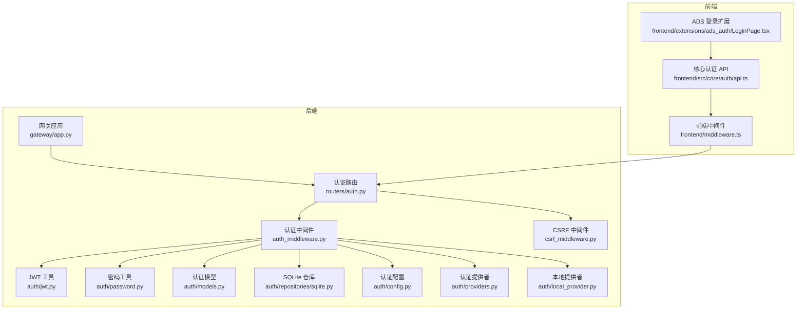
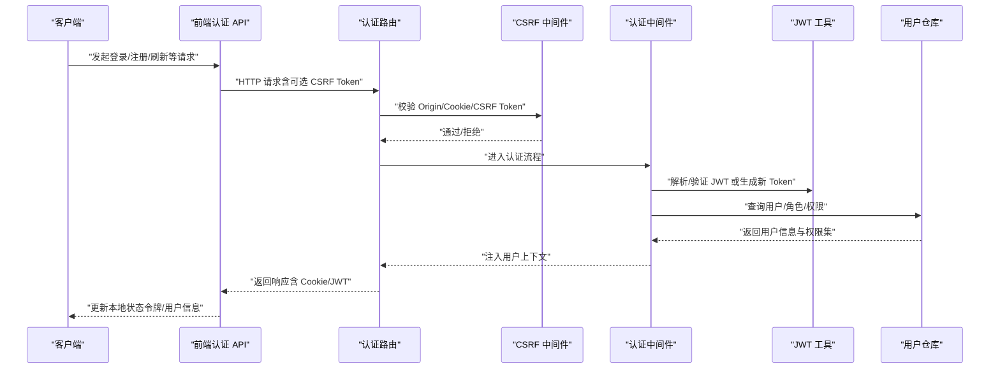
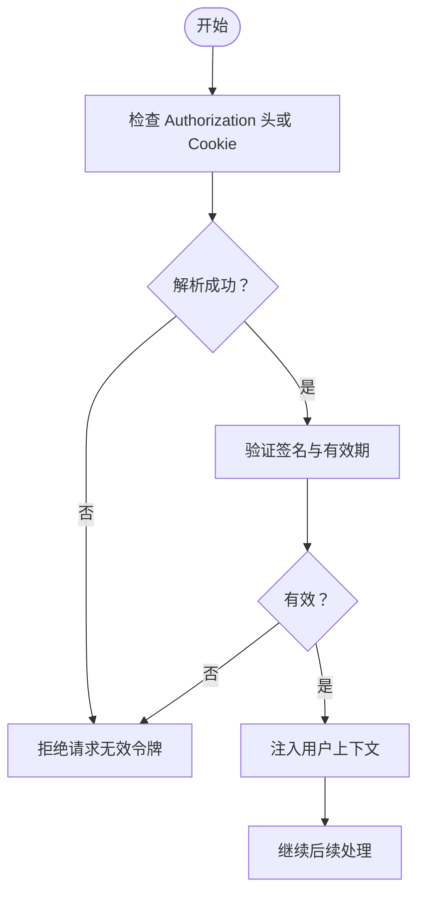
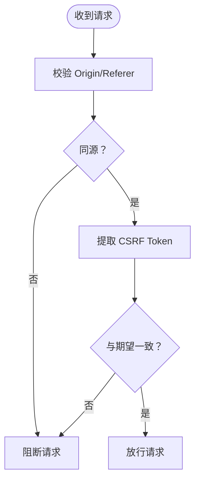
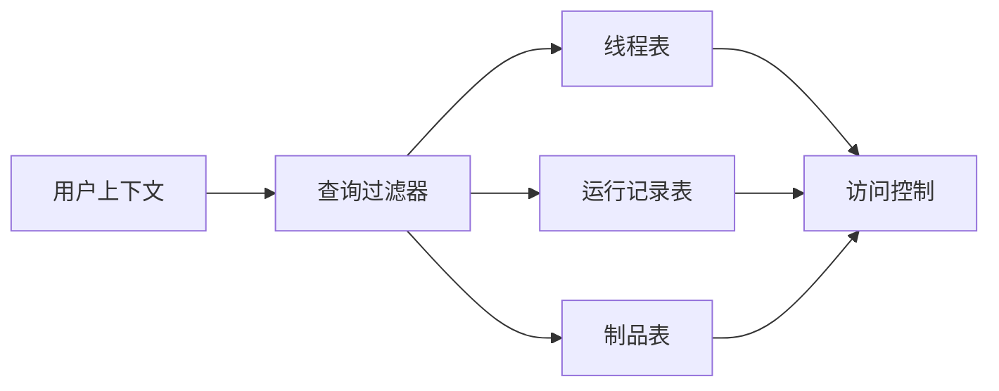
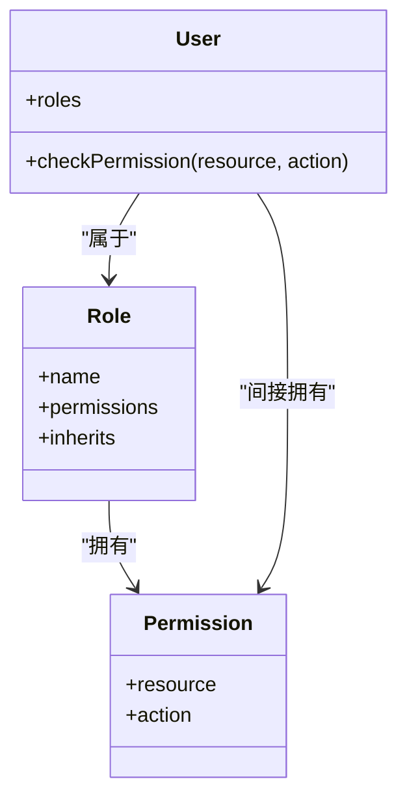
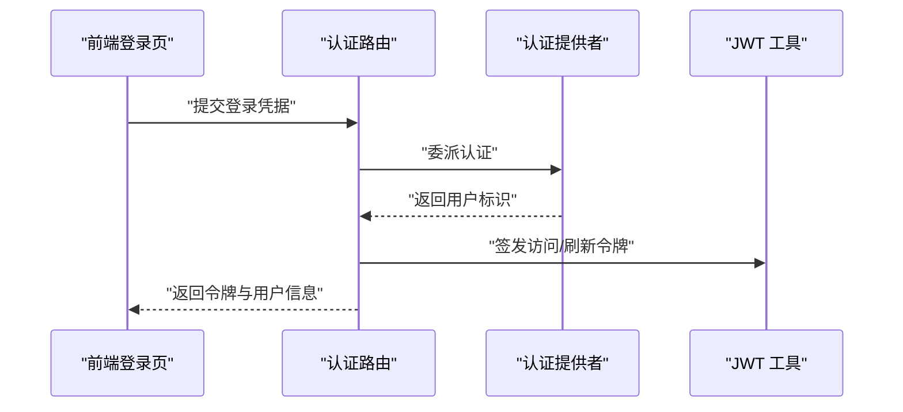
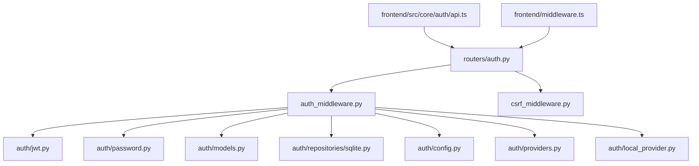

# 认证与授权

<cite>
**本文引用的文件**
- [backend/app/gateway/routers/auth.py](file://backend/app/gateway/routers/auth.py)
- [backend/app/gateway/auth/jwt.py](file://backend/app/gateway/auth/jwt.py)
- [backend/app/gateway/auth/password.py](file://backend/app/gateway/auth/password.py)
- [backend/app/gateway/auth/models.py](file://backend/app/gateway/auth/models.py)
- [backend/app/gateway/auth/repositories/sqlite.py](file://backend/app/gateway/auth/repositories/sqlite.py)
- [backend/app/gateway/auth_middleware.py](file://backend/app/gateway/auth_middleware.py)
- [backend/app/gateway/csrf_middleware.py](file://backend/app/gateway/csrf_middleware.py)
- [backend/app/gateway/auth/config.py](file://backend/app/gateway/auth/config.py)
- [backend/app/gateway/auth/providers.py](file://backend/app/gateway/auth/providers.py)
- [backend/app/gateway/auth/local_provider.py](file://backend/app/gateway/auth/local_provider.py)
- [backend/app/gateway/auth/errors.py](file://backend/app/gateway/auth/errors.py)
- [backend/docs/AUTH_DESIGN.md](file://backend/docs/AUTH_DESIGN.md)
- [backend/docs/API.md](file://backend/docs/API.md)
- [frontend/src/core/auth/api.ts](file://frontend/src/core/auth/api.ts)
- [frontend/extensions/ads_auth/LoginPage.tsx](file://frontend/extensions/ads_auth/LoginPage.tsx)
- [frontend/middleware.ts](file://frontend/middleware.ts)
- [deerflow_extensions/ads_auth/router.py](file://deerflow_extensions/ads_auth/router.py)
- [deerflow_extensions/ads_auth/token_manager.py](file://deerflow_extensions/ads_auth/token_manager.py)
- [docker/nginx/nginx.conf](file://docker/nginx/nginx.conf)
</cite>

## 目录
1. [简介](#简介)
2. [项目结构](#项目结构)
3. [核心组件](#核心组件)
4. [架构总览](#架构总览)
5. [详细组件分析](#详细组件分析)
6. [依赖关系分析](#依赖关系分析)
7. [性能考虑](#性能考虑)
8. [故障排除指南](#故障排除指南)
9. [结论](#结论)
10. [附录](#附录)

## 简介
本文件为 DeerFlow API 的认证与授权系统提供权威参考，覆盖以下主题：
- JWT 认证机制：签发、解析、刷新与失效策略
- CSRF 保护策略：同源校验、Token 注入与验证
- 用户隔离设计：租户/用户维度的数据隔离与访问边界
- 权限控制系统：角色、权限继承与访问控制列表（ACL）
- 完整认证端点参考：HTTP 方法、URL 模式、请求参数与响应格式
- 跨域与安全头配置：CORS、Origin 校验与安全响应头

## 项目结构
后端采用分层网关架构，认证相关代码集中在 gateway/auth 子系统，并通过中间件与路由集成到主应用。前端在 core/auth 提供统一的认证 API 封装，同时支持扩展的 ADS 登录流程。

图表来源
- [backend/app/gateway/routers/auth.py](file://backend/app/gateway/routers/auth.py)
- [backend/app/gateway/auth_middleware.py](file://backend/app/gateway/auth_middleware.py)
- [backend/app/gateway/csrf_middleware.py](file://backend/app/gateway/csrf_middleware.py)
- [backend/app/gateway/auth/jwt.py](file://backend/app/gateway/auth/jwt.py)
- [backend/app/gateway/auth/password.py](file://backend/app/gateway/auth/password.py)
- [backend/app/gateway/auth/models.py](file://backend/app/gateway/auth/models.py)
- [backend/app/gateway/auth/repositories/sqlite.py](file://backend/app/gateway/auth/repositories/sqlite.py)
- [backend/app/gateway/auth/config.py](file://backend/app/gateway/auth/config.py)
- [backend/app/gateway/auth/providers.py](file://backend/app/gateway/auth/providers.py)
- [backend/app/gateway/auth/local_provider.py](file://backend/app/gateway/auth/local_provider.py)
- [frontend/src/core/auth/api.ts](file://frontend/src/core/auth/api.ts)
- [frontend/middleware.ts](file://frontend/middleware.ts)
- [frontend/extensions/ads_auth/LoginPage.tsx](file://frontend/extensions/ads_auth/LoginPage.tsx)

章节来源
- [backend/app/gateway/routers/auth.py](file://backend/app/gateway/routers/auth.py)
- [backend/app/gateway/auth_middleware.py](file://backend/app/gateway/auth_middleware.py)
- [backend/app/gateway/csrf_middleware.py](file://backend/app/gateway/csrf_middleware.py)
- [frontend/src/core/auth/api.ts](file://frontend/src/core/auth/api.ts)

## 核心组件
- 认证路由与端点：定义登录、注册、初始化、注销、刷新等接口，负责接收请求并调用认证服务
- 认证中间件：拦截请求，执行用户身份解析、权限检查与上下文注入
- CSRF 中间件：生成/校验 CSRF Token，防止跨站请求伪造
- JWT 工具：封装 JWT 的签发、解析、过期与刷新逻辑
- 密码工具：密码哈希、盐值生成与校验
- 认证模型与仓库：用户实体、角色与权限模型，以及 SQLite 数据访问层
- 认证提供者：抽象外部认证（如本地/第三方）的适配器
- 前端认证 API：统一封装登录、登出、获取当前用户等操作

章节来源
- [backend/app/gateway/routers/auth.py](file://backend/app/gateway/routers/auth.py)
- [backend/app/gateway/auth/jwt.py](file://backend/app/gateway/auth/jwt.py)
- [backend/app/gateway/auth/password.py](file://backend/app/gateway/auth/password.py)
- [backend/app/gateway/auth/models.py](file://backend/app/gateway/auth/models.py)
- [backend/app/gateway/auth/repositories/sqlite.py](file://backend/app/gateway/auth/repositories/sqlite.py)
- [backend/app/gateway/auth/providers.py](file://backend/app/gateway/auth/providers.py)
- [backend/app/gateway/auth/local_provider.py](file://backend/app/gateway/auth/local_provider.py)
- [frontend/src/core/auth/api.ts](file://frontend/src/core/auth/api.ts)

## 架构总览
下图展示从客户端到后端认证链路的整体交互，包括 JWT 验证、CSRF 校验与用户隔离。

图表来源
- [backend/app/gateway/routers/auth.py](file://backend/app/gateway/routers/auth.py)
- [backend/app/gateway/csrf_middleware.py](file://backend/app/gateway/csrf_middleware.py)
- [backend/app/gateway/auth_middleware.py](file://backend/app/gateway/auth_middleware.py)
- [backend/app/gateway/auth/jwt.py](file://backend/app/gateway/auth/jwt.py)
- [backend/app/gateway/auth/repositories/sqlite.py](file://backend/app/gateway/auth/repositories/sqlite.py)
- [frontend/src/core/auth/api.ts](file://frontend/src/core/auth/api.ts)

## 详细组件分析

### 认证路由与端点参考
- 登录（POST /api/auth/login）
  - 请求体字段：用户名、密码、是否记住登录
  - 响应：成功返回 JWT 令牌与用户信息；失败返回错误码
- 注册（POST /api/auth/register）
  - 请求体字段：用户名、密码、邮箱（可选）
  - 响应：成功返回用户信息；失败返回错误码
- 初始化（POST /api/auth/init）
  - 请求体字段：管理员初始密码
  - 响应：成功返回初始化结果；失败返回错误码
- 刷新（POST /api/auth/refresh）
  - 请求体字段：刷新令牌
  - 响应：成功返回新的访问令牌；失败返回错误码
- 注销（POST /api/auth/logout）
  - 请求体字段：无
  - 响应：成功清除会话；失败返回错误码
- 当前用户（GET /api/auth/me）
  - 请求头：携带访问令牌
  - 响应：返回当前用户信息与权限集合

章节来源
- [backend/app/gateway/routers/auth.py](file://backend/app/gateway/routers/auth.py)
- [backend/docs/API.md](file://backend/docs/API.md)

### JWT 认证机制
- 签发：登录成功后签发访问令牌与刷新令牌，设置过期时间与签名算法
- 解析：中间件从请求头或 Cookie 中提取令牌并进行解码与签名验证
- 刷新：使用刷新令牌换取新的访问令牌，避免频繁登录
- 失效：支持服务端黑名单或撤销列表，实现即时失效

图表来源
- [backend/app/gateway/auth/jwt.py](file://backend/app/gateway/auth/jwt.py)
- [backend/app/gateway/auth_middleware.py](file://backend/app/gateway/auth_middleware.py)

章节来源
- [backend/app/gateway/auth/jwt.py](file://backend/app/gateway/auth/jwt.py)
- [backend/app/gateway/auth_middleware.py](file://backend/app/gateway/auth_middleware.py)

### CSRF 保护策略
- 同源校验：严格校验 Origin 与 Referer，拒绝跨站请求
- Token 注入：在响应中下发 CSRF Token（Cookie/响应头），前端在后续请求中回传
- 双重提交：要求请求头与 Cookie 同时包含 CSRF Token 才视为可信

图表来源
- [backend/app/gateway/csrf_middleware.py](file://backend/app/gateway/csrf_middleware.py)
- [frontend/middleware.ts](file://frontend/middleware.ts)

章节来源
- [backend/app/gateway/csrf_middleware.py](file://backend/app/gateway/csrf_middleware.py)
- [frontend/middleware.ts](file://frontend/middleware.ts)

### 用户隔离设计
- 租户/用户维度隔离：每个用户拥有独立的数据命名空间与访问边界
- 路由级隔离：所有资源路由均基于用户上下文进行过滤
- 仓库层隔离：数据库查询默认附加用户/租户条件，防止越权访问

图表来源
- [backend/app/gateway/auth_middleware.py](file://backend/app/gateway/auth_middleware.py)
- [backend/app/gateway/auth/repositories/sqlite.py](file://backend/app/gateway/auth/repositories/sqlite.py)

章节来源
- [backend/app/gateway/auth_middleware.py](file://backend/app/gateway/auth_middleware.py)
- [backend/app/gateway/auth/repositories/sqlite.py](file://backend/app/gateway/auth/repositories/sqlite.py)

### 权限控制系统
- 角色模型：用户具备一个或多个角色，角色映射到一组权限
- 权限继承：支持角色间的继承关系，子角色自动继承父角色权限
- 访问控制列表（ACL）：针对具体资源与操作定义允许/拒绝规则
- 中间件集成：在认证中间件中完成权限检查并注入授权上下文

图表来源
- [backend/app/gateway/auth/models.py](file://backend/app/gateway/auth/models.py)
- [backend/app/gateway/auth_middleware.py](file://backend/app/gateway/auth_middleware.py)

章节来源
- [backend/app/gateway/auth/models.py](file://backend/app/gateway/auth/models.py)
- [backend/app/gateway/auth_middleware.py](file://backend/app/gateway/auth_middleware.py)

### 认证提供者与扩展
- 本地提供者：基于用户名/密码的本地认证
- 外部提供者：抽象第三方认证（如 OAuth），便于扩展
- ADS 登录扩展：前端登录页与后端路由配合，实现企业单点登录

图表来源
- [backend/app/gateway/auth/providers.py](file://backend/app/gateway/auth/providers.py)
- [backend/app/gateway/auth/local_provider.py](file://backend/app/gateway/auth/local_provider.py)
- [backend/app/gateway/routers/auth.py](file://backend/app/gateway/routers/auth.py)
- [frontend/extensions/ads_auth/LoginPage.tsx](file://frontend/extensions/ads_auth/LoginPage.tsx)
- [deerflow_extensions/ads_auth/router.py](file://deerflow_extensions/ads_auth/router.py)

章节来源
- [backend/app/gateway/auth/providers.py](file://backend/app/gateway/auth/providers.py)
- [backend/app/gateway/auth/local_provider.py](file://backend/app/gateway/auth/local_provider.py)
- [frontend/extensions/ads_auth/LoginPage.tsx](file://frontend/extensions/ads_auth/LoginPage.tsx)
- [deerflow_extensions/ads_auth/router.py](file://deerflow_extensions/ads_auth/router.py)

### 错误处理与安全事件
- 统一错误码：认证失败、令牌无效、权限不足、CSRF 失败等场景返回明确错误码
- 安全事件：记录可疑行为（如暴力破解尝试、异常地理位置登录），触发告警或临时封禁

章节来源
- [backend/app/gateway/auth/errors.py](file://backend/app/gateway/auth/errors.py)
- [backend/app/gateway/auth_middleware.py](file://backend/app/gateway/auth_middleware.py)

## 依赖关系分析
认证子系统的内部依赖关系如下：

图表来源
- [backend/app/gateway/routers/auth.py](file://backend/app/gateway/routers/auth.py)
- [backend/app/gateway/auth_middleware.py](file://backend/app/gateway/auth_middleware.py)
- [backend/app/gateway/csrf_middleware.py](file://backend/app/gateway/csrf_middleware.py)
- [backend/app/gateway/auth/jwt.py](file://backend/app/gateway/auth/jwt.py)
- [backend/app/gateway/auth/password.py](file://backend/app/gateway/auth/password.py)
- [backend/app/gateway/auth/models.py](file://backend/app/gateway/auth/models.py)
- [backend/app/gateway/auth/repositories/sqlite.py](file://backend/app/gateway/auth/repositories/sqlite.py)
- [backend/app/gateway/auth/config.py](file://backend/app/gateway/auth/config.py)
- [backend/app/gateway/auth/providers.py](file://backend/app/gateway/auth/providers.py)
- [backend/app/gateway/auth/local_provider.py](file://backend/app/gateway/auth/local_provider.py)
- [frontend/src/core/auth/api.ts](file://frontend/src/core/auth/api.ts)
- [frontend/middleware.ts](file://frontend/middleware.ts)

章节来源
- [backend/app/gateway/routers/auth.py](file://backend/app/gateway/routers/auth.py)
- [backend/app/gateway/auth_middleware.py](file://backend/app/gateway/auth_middleware.py)
- [backend/app/gateway/csrf_middleware.py](file://backend/app/gateway/csrf_middleware.py)

## 性能考虑
- 令牌缓存：对频繁访问的用户令牌进行内存缓存，减少重复解析开销
- 查询优化：在仓库层为用户/租户维度建立索引，降低过滤成本
- 并发控制：在高并发场景下限制登录尝试频率，防止资源耗尽
- 连接池：数据库连接池与超时配置，避免长事务阻塞

## 故障排除指南
- 登录失败
  - 检查用户名/密码是否正确，确认账户未被锁定
  - 查看 CSRF 校验日志，确保前端已正确回传 CSRF Token
- 令牌过期
  - 使用刷新端点获取新令牌，或重新登录
  - 检查服务器时间同步与 JWT 过期配置
- 权限不足
  - 确认用户角色与所需权限的映射关系
  - 检查 ACL 规则是否正确匹配资源与操作
- 跨域问题
  - 检查 CORS 配置与 Origin 白名单
  - 确认浏览器 Cookie 与 SameSite 设置

章节来源
- [backend/app/gateway/auth/errors.py](file://backend/app/gateway/auth/errors.py)
- [backend/app/gateway/csrf_middleware.py](file://backend/app/gateway/csrf_middleware.py)
- [backend/app/gateway/auth/jwt.py](file://backend/app/gateway/auth/jwt.py)

## 结论
DeerFlow 的认证与授权体系以 JWT 为核心，结合 CSRF 保护、用户隔离与细粒度权限控制，形成完整且可扩展的安全框架。通过清晰的路由与中间件分层，既保证了安全性，也兼顾了开发效率与维护性。建议在生产环境中启用严格的 CORS 与安全头配置，并定期审计权限模型与访问日志。

## 附录

### 安全最佳实践
- 强制 HTTPS：所有认证与敏感接口必须通过 HTTPS 访问
- 安全头：配置 HSTS、X-Frame-Options、X-Content-Type-Options、Referrer-Policy 等
- 令牌存储：前端优先使用 HttpOnly Cookie 存储敏感令牌，避免明文保存
- 最小权限：遵循最小权限原则，按需授予角色与权限
- 审计日志：记录关键安全事件，定期审查登录与权限变更

章节来源
- [backend/docs/AUTH_DESIGN.md](file://backend/docs/AUTH_DESIGN.md)
- [docker/nginx/nginx.conf](file://docker/nginx/nginx.conf)