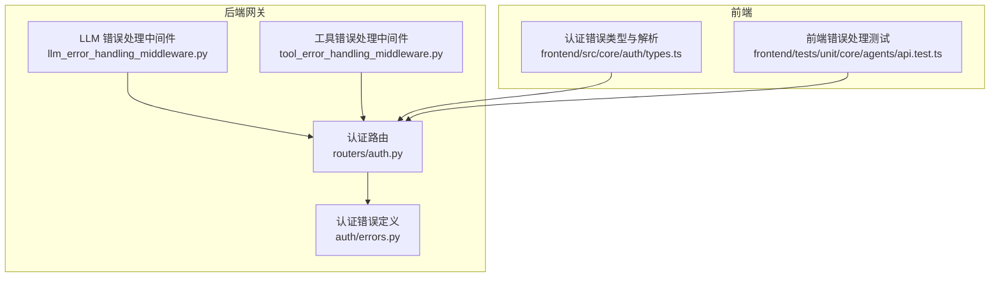
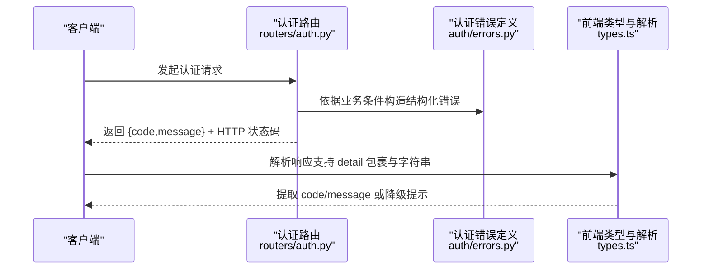
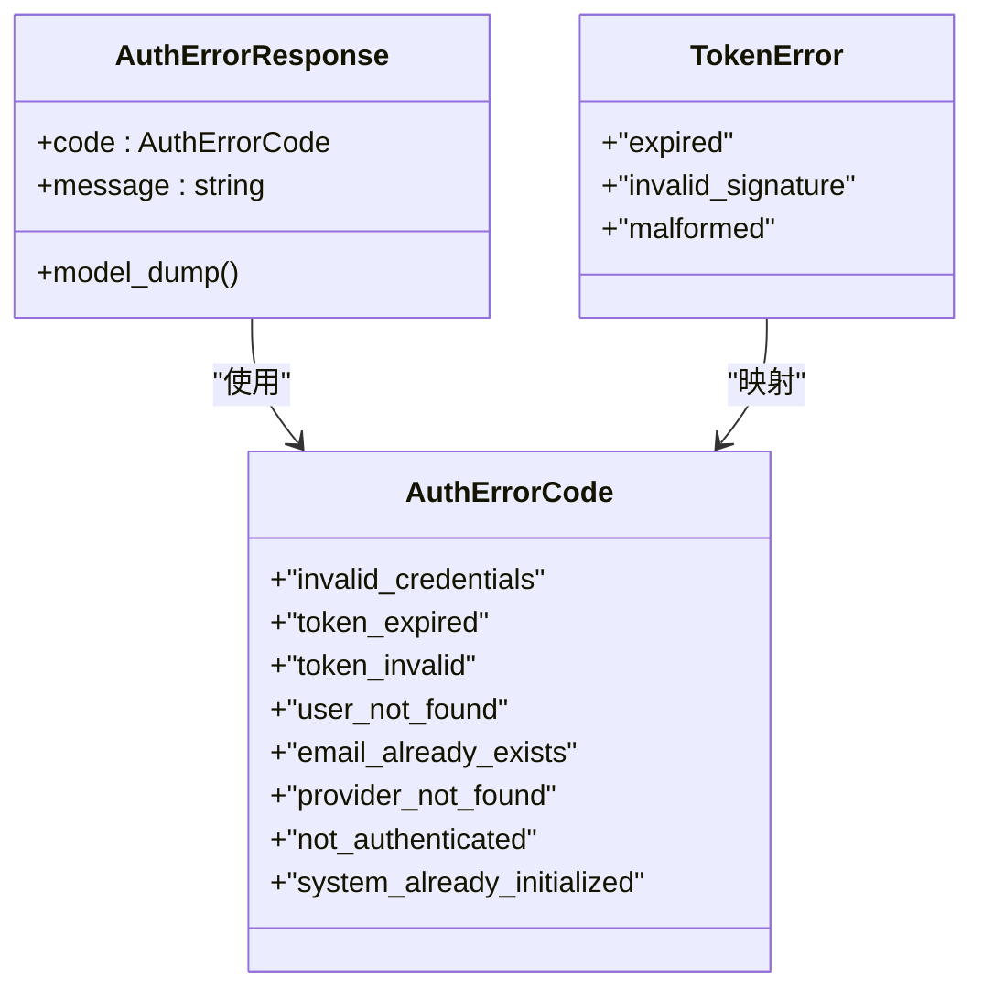
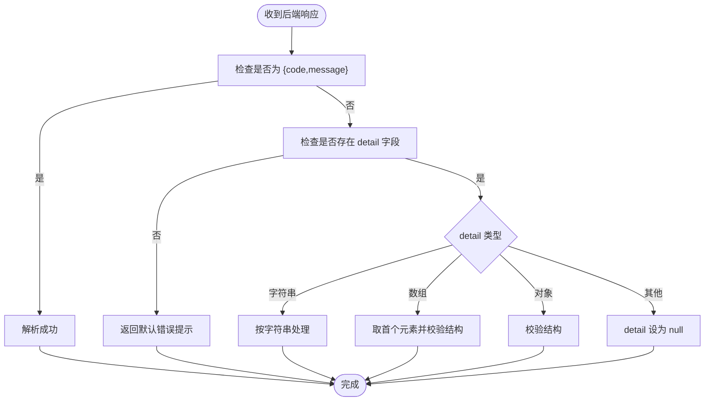
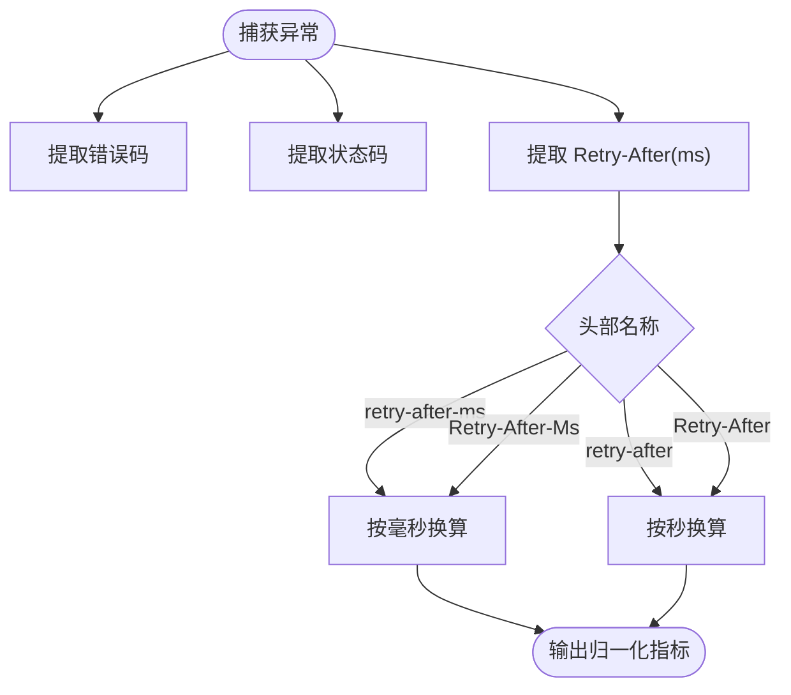
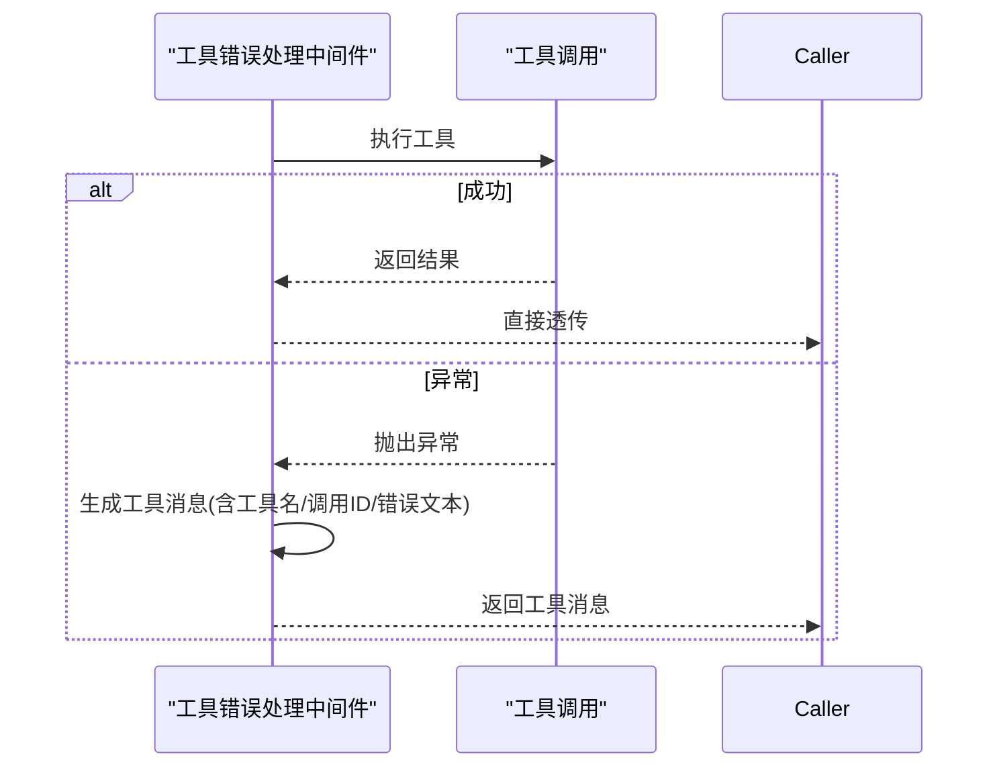
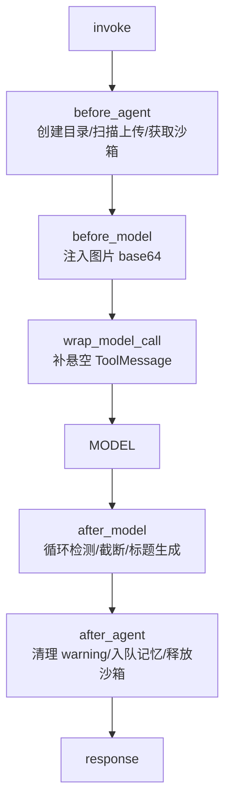
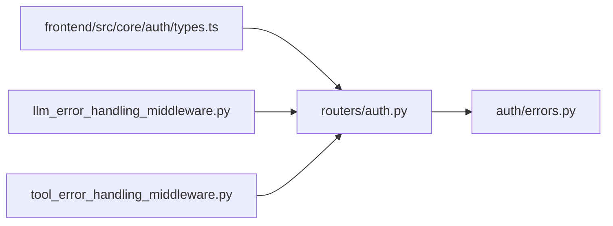

# 错误处理

<cite>
**本文引用的文件**
- [backend/app/gateway/auth/errors.py](file://backend/app/gateway/auth/errors.py)
- [backend/app/gateway/routers/auth.py](file://backend/app/gateway/routers/auth.py)
- [backend/packages/harness/deerflow/agents/middlewares/llm_error_handling_middleware.py](file://backend/packages/harness/deerflow/agents/middlewares/llm_error_handling_middleware.py)
- [backend/packages/harness/deerflow/agents/middlewares/tool_error_handling_middleware.py](file://backend/packages/harness/deerflow/agents/middlewares/tool_error_handling_middleware.py)
- [backend/tests/test_auth_errors.py](file://backend/tests/test_auth_errors.py)
- [backend/tests/test_llm_error_handling_middleware.py](file://backend/tests/test_llm_error_handling_middleware.py)
- [backend/tests/test_tool_error_handling_middleware.py](file://backend/tests/test_tool_error_handling_middleware.py)
- [frontend/src/core/auth/types.ts](file://frontend/src/core/auth/types.ts)
- [frontend/tests/unit/core/agents/api.test.ts](file://frontend/tests/unit/core/agents/api.test.ts)
- [backend/docs/middleware-execution-flow.md](file://backend/docs/middleware-execution-flow.md)
- [backend/debug.py](file://backend/debug.py)
- [backend/tests/test_logging_level_from_config.py](file://backend/tests/test_logging_level_from_config.py)
</cite>

## 目录
1. [简介](#简介)
2. [项目结构](#项目结构)
3. [核心组件](#核心组件)
4. [架构总览](#架构总览)
5. [详细组件分析](#详细组件分析)
6. [依赖关系分析](#依赖关系分析)
7. [性能考量](#性能考量)
8. [故障排查指南](#故障排查指南)
9. [结论](#结论)
10. [附录](#附录)

## 简介
本文件为 DeerFlow API 错误处理系统的权威参考文档，聚焦于统一的错误响应格式、HTTP 状态码映射、错误分类体系与客户端处理策略。文档覆盖常见错误场景（400、404、422、500）的触发条件与响应结构，并给出错误码定义、消息结构、调试信息、重试与故障转移建议，以及日志记录、监控告警与性能影响分析。同时，阐述 API 版本兼容性与向后兼容保障、错误迁移策略。

## 项目结构
围绕错误处理的关键代码分布在后端网关路由与认证模块、中间件层、前端类型与解析逻辑，以及测试用例中。下图展示与错误处理直接相关的模块关系：

图表来源
- [backend/app/gateway/auth/errors.py:1-45](file://backend/app/gateway/auth/errors.py#L1-L45)
- [backend/app/gateway/routers/auth.py:315-359](file://backend/app/gateway/routers/auth.py#L315-L359)
- [backend/packages/harness/deerflow/agents/middlewares/llm_error_handling_middleware.py:337-404](file://backend/packages/harness/deerflow/agents/middlewares/llm_error_handling_middleware.py#L337-L404)
- [backend/packages/harness/deerflow/agents/middlewares/tool_error_handling_middleware.py:134-208](file://backend/packages/harness/deerflow/agents/middlewares/tool_error_handling_middleware.py#L134-L208)
- [frontend/src/core/auth/types.ts:45-94](file://frontend/src/core/auth/types.ts#L45-L94)
- [frontend/tests/unit/core/agents/api.test.ts:104-149](file://frontend/tests/unit/core/agents/api.test.ts#L104-L149)

章节来源
- [backend/app/gateway/auth/errors.py:1-45](file://backend/app/gateway/auth/errors.py#L1-L45)
- [backend/app/gateway/routers/auth.py:315-359](file://backend/app/gateway/routers/auth.py#L315-L359)
- [backend/packages/harness/deerflow/agents/middlewares/llm_error_handling_middleware.py:337-404](file://backend/packages/harness/deerflow/agents/middlewares/llm_error_handling_middleware.py#L337-L404)
- [backend/packages/harness/deerflow/agents/middlewares/tool_error_handling_middleware.py:134-208](file://backend/packages/harness/deerflow/agents/middlewares/tool_error_handling_middleware.py#L134-L208)
- [frontend/src/core/auth/types.ts:45-94](file://frontend/src/core/auth/types.ts#L45-L94)
- [frontend/tests/unit/core/agents/api.test.ts:104-149](file://frontend/tests/unit/core/agents/api.test.ts#L104-L149)

## 核心组件
- 统一错误响应格式
  - 认证错误采用结构化响应体，包含字段 code 与 message，确保前后端一致解析与展示。
  - 前端提供解析函数，支持顶层 {code,message} 与嵌套 detail 包裹两种形态，并对异常 detail 类型进行防御性处理。
- HTTP 状态码映射
  - 认证路由在不同业务失败条件下返回 400/404/422 等状态码，配合结构化错误体提升可读性与可诊断性。
- 错误分类体系
  - 使用枚举定义错误码集合，覆盖凭据无效、令牌过期/无效、用户不存在、邮箱已存在、提供商不存在、未认证、系统已初始化等。
- 中间件级错误处理
  - LLM 错误处理中间件从异常对象提取错误码、状态码与重试等待时间，增强对外部服务失败的可观测性与弹性。
  - 工具错误处理中间件将工具调用异常转换为标准化工具消息，保留工具调用 ID 并携带错误文本，便于后续处理与回溯。

章节来源
- [backend/app/gateway/auth/errors.py:13-45](file://backend/app/gateway/auth/errors.py#L13-L45)
- [frontend/src/core/auth/types.ts:45-94](file://frontend/src/core/auth/types.ts#L45-L94)
- [backend/app/gateway/routers/auth.py:315-359](file://backend/app/gateway/routers/auth.py#L315-L359)
- [backend/packages/harness/deerflow/agents/middlewares/llm_error_handling_middleware.py:341-394](file://backend/packages/harness/deerflow/agents/middlewares/llm_error_handling_middleware.py#L341-L394)
- [backend/packages/harness/deerflow/agents/middlewares/tool_error_handling_middleware.py:134-208](file://backend/packages/harness/deerflow/agents/middlewares/tool_error_handling_middleware.py#L134-L208)

## 架构总览
下图展示错误处理在请求生命周期中的关键节点与职责分工：

图表来源
- [backend/app/gateway/routers/auth.py:315-359](file://backend/app/gateway/routers/auth.py#L315-L359)
- [backend/app/gateway/auth/errors.py:13-45](file://backend/app/gateway/auth/errors.py#L13-L45)
- [frontend/src/core/auth/types.ts:45-94](file://frontend/src/core/auth/types.ts#L45-L94)

## 详细组件分析

### 组件 A：认证错误定义与路由映射
- 错误码枚举与结构化响应体
  - 定义了认证相关的错误码集合与结构化错误响应体，确保错误信息具备稳定字段与可序列化特性。
- 路由中的状态码映射
  - 在不同业务失败场景下返回 400/404/422 等状态码，并以结构化错误体作为 detail 内容，避免裸字符串导致的歧义。
- 测试验证
  - 单元测试覆盖结构化错误体字段完整性与序列化一致性，确保前端解析稳定可靠。

图表来源
- [backend/app/gateway/auth/errors.py:13-45](file://backend/app/gateway/auth/errors.py#L13-L45)

章节来源
- [backend/app/gateway/auth/errors.py:13-45](file://backend/app/gateway/auth/errors.py#L13-L45)
- [backend/app/gateway/routers/auth.py:315-359](file://backend/app/gateway/routers/auth.py#L315-L359)
- [backend/tests/test_auth_errors.py:129-147](file://backend/tests/test_auth_errors.py#L129-L147)

### 组件 B：前端认证错误解析与容错
- 结构化解析流程
  - 优先尝试顶层 {code,message}；若响应为 {detail:{...}}，则解包后再解析；对 detail 为字符串或数组/对象的多种形态做兼容处理；对非字符串 detail 进行防御性降级。
- 行为验证
  - 测试覆盖无 detail 回退、非字符串 detail 降级为 null、422 场景不误判等边界情况，确保页面级错误分支正确。

图表来源
- [frontend/src/core/auth/types.ts:63-94](file://frontend/src/core/auth/types.ts#L63-L94)

章节来源
- [frontend/src/core/auth/types.ts:45-94](file://frontend/src/core/auth/types.ts#L45-L94)
- [frontend/tests/unit/core/agents/api.test.ts:104-149](file://frontend/tests/unit/core/agents/api.test.ts#L104-L149)

### 组件 C：LLM 错误处理中间件
- 关键能力
  - 从异常对象提取错误码、HTTP 状态码与 Retry-After 时间（毫秒），支持多种头部名称与时间单位自动换算。
  - 对 detail 文本进行模式匹配辅助识别特定错误类型，提升可观测性与自动化处理可能。
- 适用场景
  - 外部模型服务超时、配额限制、速率限制等导致的调用失败，通过中间件统一归一化处理。

图表来源
- [backend/packages/harness/deerflow/agents/middlewares/llm_error_handling_middleware.py:341-394](file://backend/packages/harness/deerflow/agents/middlewares/llm_error_handling_middleware.py#L341-L394)

章节来源
- [backend/packages/harness/deerflow/agents/middlewares/llm_error_handling_middleware.py:337-404](file://backend/packages/harness/deerflow/agents/middlewares/llm_error_handling_middleware.py#L337-L404)

### 组件 D：工具错误处理中间件
- 关键能力
  - 将工具调用异常转换为标准化工具消息，保留原始 tool_call_id，设置状态为 error，并在文本中包含工具名与异常信息。
  - 若缺少 tool_call_id，使用占位值以保证消息完整性。
  - 对图中断（GraphInterrupt）不做吞并，保持上层感知。
- 适用场景
  - 工具网络异常、参数错误、权限不足等导致的调用失败，通过中间件统一包装，便于下游处理与回溯。

图表来源
- [backend/packages/harness/deerflow/agents/middlewares/tool_error_handling_middleware.py:134-208](file://backend/packages/harness/deerflow/agents/middlewares/tool_error_handling_middleware.py#L134-L208)

章节来源
- [backend/packages/harness/deerflow/agents/middlewares/tool_error_handling_middleware.py:134-208](file://backend/packages/harness/deerflow/agents/middlewares/tool_error_handling_middleware.py#L134-L208)

### 组件 E：中间件执行流与错误传播
- 生命周期
  - 请求按 before_agent → before_model → wrap_model_call → MODEL → after_model → after_agent 的顺序执行，错误可在任一阶段被捕获与转换。
- 关键点
  - wrap_model_call 阶段可对“悬空工具消息”进行补全，减少下游处理复杂度。
  - after_model/after_agent 阶段负责清理与收尾，确保错误不会遗留状态。

图表来源
- [backend/docs/middleware-execution-flow.md:32-162](file://backend/docs/middleware-execution-flow.md#L32-L162)

章节来源
- [backend/docs/middleware-execution-flow.md:32-162](file://backend/docs/middleware-execution-flow.md#L32-L162)

## 依赖关系分析
- 认证路由依赖认证错误定义模块，确保错误码与响应体的一致性。
- 前端类型模块依赖后端路由返回的结构化错误体，实现跨端一致的错误语义。
- 中间件层依赖异常对象属性约定，提取错误码、状态码与重试信息，降低外部服务失败对上层的影响。
- 测试用例覆盖错误响应格式、解析容错与中间件行为，保障系统稳定性。

图表来源
- [backend/app/gateway/routers/auth.py:315-359](file://backend/app/gateway/routers/auth.py#L315-L359)
- [backend/app/gateway/auth/errors.py:13-45](file://backend/app/gateway/auth/errors.py#L13-L45)
- [frontend/src/core/auth/types.ts:45-94](file://frontend/src/core/auth/types.ts#L45-L94)
- [backend/packages/harness/deerflow/agents/middlewares/llm_error_handling_middleware.py:337-404](file://backend/packages/harness/deerflow/agents/middlewares/llm_error_handling_middleware.py#L337-L404)
- [backend/packages/harness/deerflow/agents/middlewares/tool_error_handling_middleware.py:134-208](file://backend/packages/harness/deerflow/agents/middlewares/tool_error_handling_middleware.py#L134-L208)

章节来源
- [backend/app/gateway/routers/auth.py:315-359](file://backend/app/gateway/routers/auth.py#L315-L359)
- [backend/app/gateway/auth/errors.py:13-45](file://backend/app/gateway/auth/errors.py#L13-L45)
- [frontend/src/core/auth/types.ts:45-94](file://frontend/src/core/auth/types.ts#L45-L94)
- [backend/packages/harness/deerflow/agents/middlewares/llm_error_handling_middleware.py:337-404](file://backend/packages/harness/deerflow/agents/middlewares/llm_error_handling_middleware.py#L337-L404)
- [backend/packages/harness/deerflow/agents/middlewares/tool_error_handling_middleware.py:134-208](file://backend/packages/harness/deerflow/agents/middlewares/tool_error_handling_middleware.py#L134-L208)

## 性能考量
- 日志级别与输出控制
  - 支持从配置推导日志级别，初始配置将根日志器与文件处理器分离，避免交互式控制台污染，便于生产环境集中观测。
  - 后续配置驱动的日志调整可能改变命名空间日志的详细程度，但不影响文件处理器的阈值设定。
- 中间件开销
  - 异常提取与重试时间计算为轻量操作，通常不会成为瓶颈；建议在高频外部调用场景下结合缓存与指数退避策略降低总体延迟。
- 前端解析成本
  - 前端解析逻辑为纯 JS 对象遍历与字符串处理，开销极低；建议保持响应体简洁，避免冗余字段。

章节来源
- [backend/debug.py:47-70](file://backend/debug.py#L47-L70)
- [backend/tests/test_logging_level_from_config.py:62-91](file://backend/tests/test_logging_level_from_config.py#L62-L91)

## 故障排查指南
- 常见错误与触发条件
  - 400（坏请求）
    - 触发条件：认证路由在密码修改、当前密码不正确、邮箱已存在等业务校验失败时返回。
    - 响应格式：结构化错误体 {code,message}，状态码 400。
  - 404（未找到）
    - 触发条件：资源不存在或工具未找到等。
    - 响应格式：结构化错误体 {code,message}，状态码 404。
  - 422（数据不可处理）
    - 触发条件：输入参数不符合约束（例如用户名格式不合法）。
    - 响应格式：结构化错误体 {code,message}，状态码 422。
  - 500（服务器内部错误）
    - 触发条件：后端未捕获异常或中间件处理异常。
    - 响应格式：结构化错误体 {code,message}，状态码 500。
- 前端错误处理策略
  - 当 detail 为空或非字符串时，前端将其视为 null，以便使用本地化通用兜底文案。
  - 对 422 场景进行子串匹配防护，避免误判为“agents_api disabled”。
- 重试与故障转移
  - 从异常对象提取 Retry-After（毫秒），用于指数退避与限流恢复。
  - 对工具调用异常进行消息化封装，保留调用 ID，便于重放与审计。
- 监控与告警
  - 建议基于错误码与状态码聚合统计，设置阈值告警；对 429/5xx 指标进行实时监控。
  - 结合中间件提取的重试时间与错误码，构建自愈策略（如临时降级、切换上游实例）。

章节来源
- [backend/app/gateway/routers/auth.py:315-359](file://backend/app/gateway/routers/auth.py#L315-L359)
- [frontend/tests/unit/core/agents/api.test.ts:104-149](file://frontend/tests/unit/core/agents/api.test.ts#L104-L149)
- [backend/packages/harness/deerflow/agents/middlewares/llm_error_handling_middleware.py:368-394](file://backend/packages/harness/deerflow/agents/middlewares/llm_error_handling_middleware.py#L368-L394)
- [backend/packages/harness/deerflow/agents/middlewares/tool_error_handling_middleware.py:159-208](file://backend/packages/harness/deerflow/agents/middlewares/tool_error_handling_middleware.py#L159-L208)

## 结论
DeerFlow 的错误处理体系通过“结构化错误体 + 明确状态码 + 前后端一致解析 + 中间件可观测性”的组合，实现了高可读性与强可维护性的错误管理。认证模块的错误码枚举与路由映射确保了错误语义的统一；前端解析逻辑提供了对历史与未来响应形态的兼容；中间件层增强了对外部失败的弹性与可观测性。建议在生产环境中结合日志级别控制、监控告警与重试策略，持续优化用户体验与系统稳定性。

## 附录
- API 版本兼容性与向后兼容
  - 前端解析逻辑支持 detail 包裹与字符串形态，避免因后端响应结构调整导致的客户端崩溃。
  - 认证错误体字段固定为 code 与 message，确保版本演进中错误语义稳定。
- 错误迁移策略
  - 新增错误码时，需同步更新枚举与映射函数，保证后端与前端一致。
  - 对历史响应形态的兼容逻辑应长期保留，直至完全迁移完成。