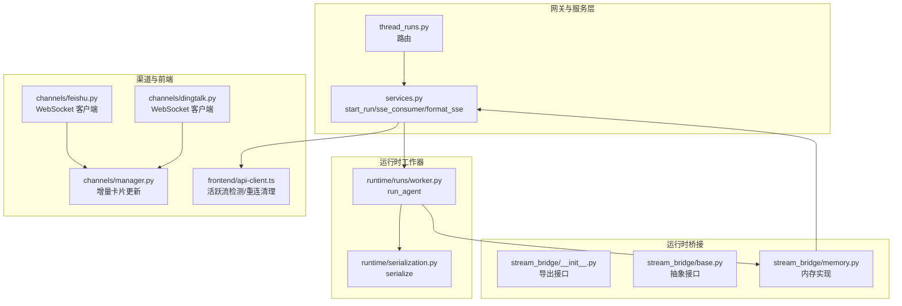
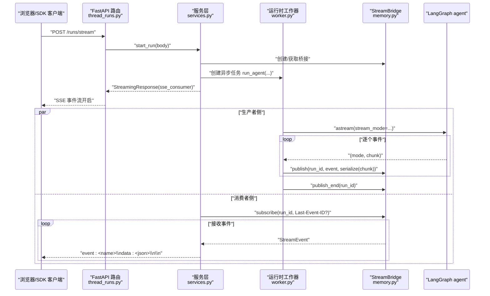
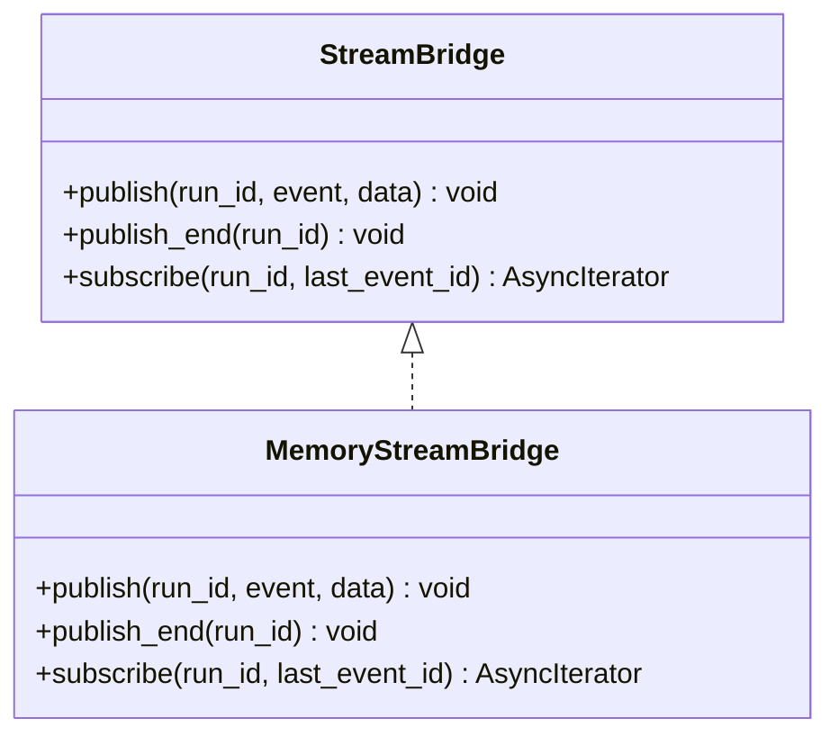
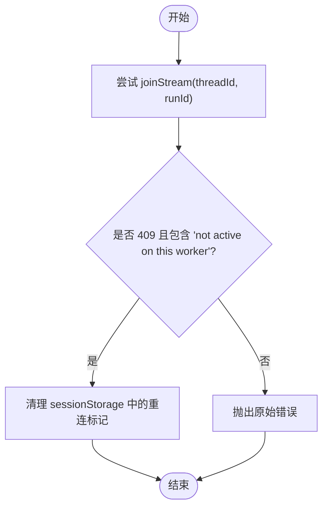
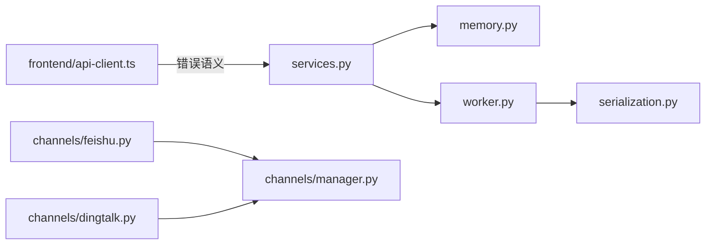

# WebSocket 接口

<cite>
**本文引用的文件**
- [backend/app/gateway/services.py](file://backend/app/gateway/services.py)
- [backend/docs/STREAMING.md](file://backend/docs/STREAMING.md)
- [backend/packages/harness/deerflow/runtime/stream_bridge/__init__.py](file://backend/packages/harness/deerflow/runtime/stream_bridge/__init__.py)
- [backend/packages/harness/deerflow/runtime/stream_bridge/base.py](file://backend/packages/harness/deerflow/runtime/stream_bridge/base.py)
- [backend/packages/harness/deerflow/runtime/stream_bridge/memory.py](file://backend/packages/harness/deerflow/runtime/stream_bridge/memory.py)
- [backend/packages/harness/deerflow/runtime/runs/worker.py](file://backend/packages/harness/deerflow/runtime/runs/worker.py)
- [backend/packages/harness/deerflow/runtime/serialization.py](file://backend/packages/harness/deerflow/runtime/serialization.py)
- [backend/app/channels/feishu.py](file://backend/app/channels/feishu.py)
- [backend/app/channels/dingtalk.py](file://backend/app/channels/dingtalk.py)
- [backend/app/channels/manager.py](file://backend/app/channels/manager.py)
- [backend/app/gateway/routers/thread_runs.py](file://backend/app/gateway/routers/thread_runs.py)
- [backend/tests/test_sse_format.py](file://backend/tests/test_sse_format.py)
- [backend/tests/test_runtime_lifecycle_e2e.py](file://backend/tests/test_runtime_lifecycle_e2e.py)
- [frontend/src/core/api/api-client.ts](file://frontend/src/core/api/api-client.ts)
- [frontend/tests/unit/core/api/api-client.test.ts](file://frontend/tests/unit/core/api/api-client.test.ts)
</cite>

## 目录
1. [简介](#简介)
2. [项目结构](#项目结构)
3. [核心组件](#核心组件)
4. [架构总览](#架构总览)
5. [详细组件分析](#详细组件分析)
6. [依赖分析](#依赖分析)
7. [性能考量](#性能考量)
8. [故障排查指南](#故障排查指南)
9. [结论](#结论)
10. [附录](#附录)

## 简介
本文件面向 DeerFlow 的实时通信能力，聚焦于基于 Server-Sent Events（SSE）的事件推送通道，涵盖连接建立、消息格式规范、事件类型定义、连接生命周期与断线重连、心跳机制、错误处理、客户端集成示例与最佳实践、性能优化与并发管理、监控指标收集等主题。文档同时指出当前仓库中“WebSocket”长连接主要用于部分即时通讯（IM）渠道（如飞书、企业微信），而面向浏览器与通用客户端的实时事件推送采用的是 SSE 协议。

## 项目结构
围绕 WebSocket/SSE 接口的关键目录与文件如下：
- 网关与服务层：SSE 事件格式化、消费者生成器、运行生命周期管理
- 运行时桥接：StreamBridge 抽象与内存实现，解耦生产者与消费者
- 运行时工作器：将 LangGraph 事件序列化并通过桥接发布
- 渠道模块：飞书、钉钉等 IM 渠道的 WebSocket 集成与增量卡片更新
- 前端客户端：活跃运行流检测与断线重连清理逻辑

图表来源
- [backend/app/gateway/routers/thread_runs.py](file://backend/app/gateway/routers/thread_runs.py)
- [backend/app/gateway/services.py](file://backend/app/gateway/services.py)
- [backend/packages/harness/deerflow/runtime/stream_bridge/__init__.py](file://backend/packages/harness/deerflow/runtime/stream_bridge/__init__.py)
- [backend/packages/harness/deerflow/runtime/stream_bridge/base.py](file://backend/packages/harness/deerflow/runtime/stream_bridge/base.py)
- [backend/packages/harness/deerflow/runtime/stream_bridge/memory.py](file://backend/packages/harness/deerflow/runtime/stream_bridge/memory.py)
- [backend/packages/harness/deerflow/runtime/runs/worker.py](file://backend/packages/harness/deerflow/runtime/runs/worker.py)
- [backend/packages/harness/deerflow/runtime/serialization.py](file://backend/packages/harness/deerflow/runtime/serialization.py)
- [backend/app/channels/feishu.py](file://backend/app/channels/feishu.py)
- [backend/app/channels/dingtalk.py](file://backend/app/channels/dingtalk.py)
- [backend/app/channels/manager.py](file://backend/app/channels/manager.py)
- [frontend/src/core/api/api-client.ts](file://frontend/src/core/api/api-client.ts)

章节来源
- [backend/app/gateway/services.py:46-59](file://backend/app/gateway/services.py#L46-L59)
- [backend/docs/STREAMING.md:102-145](file://backend/docs/STREAMING.md#L102-L145)

## 核心组件
- SSE 事件格式化与消费者
  - 事件帧格式化函数负责将事件名、数据与可选事件 ID 组织为标准 SSE 文本帧，并以空白行结尾。
  - 消费者生成器从 StreamBridge 订阅事件，遇到心跳哨兵输出心跳帧，遇到结束哨兵发送 end 事件并终止。
- StreamBridge 抽象与内存实现
  - 提供 publish/subscribe/publish_end 等接口，支持 Last-Event-ID 重连、心跳哨兵与多订阅者扇出。
  - 内存实现基于 asyncio.Queue，满足单机场景下的跨任务事件传递。
- 运行时工作器
  - 在异步任务中运行 LangGraph agent 的流式输出，将不同模式的事件序列化后通过桥接发布。
- 渠道 WebSocket 客户端
  - 飞书与企业微信等 IM 渠道使用 WebSocket 长连接进行消息推送，支持增量卡片更新与断线重连。
- 前端活跃运行流检测
  - 前端客户端识别“运行不再活跃”的错误并清理本地重连元数据，避免错误重连。

章节来源
- [backend/app/gateway/services.py:46-59](file://backend/app/gateway/services.py#L46-L59)
- [backend/app/gateway/services.py:373-405](file://backend/app/gateway/services.py#L373-L405)
- [backend/packages/harness/deerflow/runtime/stream_bridge/__init__.py:1-21](file://backend/packages/harness/deerflow/runtime/stream_bridge/__init__.py#L1-L21)
- [backend/packages/harness/deerflow/runtime/stream_bridge/base.py:36-52](file://backend/packages/harness/deerflow/runtime/stream_bridge/base.py#L36-L52)
- [backend/packages/harness/deerflow/runtime/stream_bridge/memory.py:24-90](file://backend/packages/harness/deerflow/runtime/stream_bridge/memory.py#L24-L90)
- [backend/packages/harness/deerflow/runtime/runs/worker.py](file://backend/packages/harness/deerflow/runtime/runs/worker.py)
- [backend/packages/harness/deerflow/runtime/serialization.py](file://backend/packages/harness/deerflow/runtime/serialization.py)
- [backend/app/channels/feishu.py:0-50](file://backend/app/channels/feishu.py#L0-L50)
- [backend/app/channels/dingtalk.py:121-142](file://backend/app/channels/dingtalk.py#L121-L142)
- [frontend/src/core/api/api-client.ts:41-80](file://frontend/src/core/api/api-client.ts#L41-L80)

## 架构总览
SSE 实时事件推送的整体流程如下：

图表来源
- [backend/docs/STREAMING.md:102-145](file://backend/docs/STREAMING.md#L102-L145)
- [backend/app/gateway/services.py:265-371](file://backend/app/gateway/services.py#L265-L371)
- [backend/packages/harness/deerflow/runtime/runs/worker.py](file://backend/packages/harness/deerflow/runtime/runs/worker.py)
- [backend/packages/harness/deerflow/runtime/stream_bridge/memory.py:67-90](file://backend/packages/harness/deerflow/runtime/stream_bridge/memory.py#L67-L90)

章节来源
- [backend/docs/STREAMING.md:102-145](file://backend/docs/STREAMING.md#L102-L145)
- [backend/app/gateway/services.py:265-371](file://backend/app/gateway/services.py#L265-L371)

## 详细组件分析

### SSE 事件格式与事件类型
- 事件帧格式
  - 字段顺序：event、data、id（可选）、空行、空行，与前端 useStream 与 langgraph-sdk 的约定一致。
  - 数据以 JSON 字符串形式承载，确保跨语言/平台一致性。
- 事件类型
  - 心跳：心跳哨兵转换为特殊帧，用于保持连接活性。
  - 结束：结束哨兵转换为 end 事件，数据为 null，表示终端状态。
  - 其他：来自运行时的自定义事件，数据为序列化后的对象。
- Last-Event-ID 支持
  - 消费者订阅时可携带 Last-Event-ID 请求头，实现断线重连时的事件续传。

章节来源
- [backend/app/gateway/services.py:46-59](file://backend/app/gateway/services.py#L46-L59)
- [backend/app/gateway/services.py:373-405](file://backend/app/gateway/services.py#L373-L405)
- [backend/tests/test_sse_format.py:1-30](file://backend/tests/test_sse_format.py#L1-L30)

### 连接生命周期与断线重连
- 连接建立
  - 客户端发起 /runs/stream 请求，服务层创建 RunRecord 并启动异步任务运行 agent。
  - 服务层返回 StreamingResponse，消费者开始接收事件。
- 心跳机制
  - 当桥接产生心跳哨兵时，消费者立即输出心跳帧，保证长时间无事件时连接不被代理或中间件关闭。
- 断线重连
  - 消费者订阅时携带 Last-Event-ID，服务端根据该 ID 从桥接缓冲区续传事件。
  - 若消费者断开，服务端依据 on_disconnect 策略决定取消后台任务或继续运行（事件丢弃）。
- 等待完成
  - 非流式等待接口通过桥接订阅 END_SENTINEL，结合心跳哨兵确保轮询唤醒，避免长时间阻塞。

章节来源
- [backend/app/gateway/services.py:373-405](file://backend/app/gateway/services.py#L373-L405)
- [backend/app/gateway/services.py:407-453](file://backend/app/gateway/services.py#L407-L453)
- [backend/tests/test_runtime_lifecycle_e2e.py:316-340](file://backend/tests/test_runtime_lifecycle_e2e.py#L316-L340)

### StreamBridge 设计与实现
- 抽象接口
  - 定义 publish、publish_end、subscribe 等方法，支持多订阅者与事件去耦。
- 内存实现
  - 基于 asyncio.Queue 的内存桥接，适合单实例部署与开发环境。
- 多订阅者与扇出
  - 同一 run_id 可被多个消费者订阅，实现广播或多路消费。
- Last-Event-ID 与缓冲
  - 订阅时可指定 Last-Event-ID，桥接负责从缓冲区恢复事件流。

图表来源
- [backend/packages/harness/deerflow/runtime/stream_bridge/base.py:36-52](file://backend/packages/harness/deerflow/runtime/stream_bridge/base.py#L36-L52)
- [backend/packages/harness/deerflow/runtime/stream_bridge/memory.py:24-90](file://backend/packages/harness/deerflow/runtime/stream_bridge/memory.py#L24-L90)

章节来源
- [backend/packages/harness/deerflow/runtime/stream_bridge/__init__.py:1-21](file://backend/packages/harness/deerflow/runtime/stream_bridge/__init__.py#L1-L21)
- [backend/packages/harness/deerflow/runtime/stream_bridge/base.py:36-52](file://backend/packages/harness/deerflow/runtime/stream_bridge/base.py#L36-L52)
- [backend/packages/harness/deerflow/runtime/stream_bridge/memory.py:24-90](file://backend/packages/harness/deerflow/runtime/stream_bridge/memory.py#L24-L90)

### 运行时工作器与序列化
- 工作器职责
  - 在异步任务中运行 agent.astream，按模式将事件序列化后通过桥接发布。
- 序列化策略
  - 不同模式采用不同的序列化策略，messages 模式下将 (chunk, metadata) 转换为数组结构，确保前端/SDK 能正确解析。

章节来源
- [backend/packages/harness/deerflow/runtime/runs/worker.py](file://backend/packages/harness/deerflow/runtime/runs/worker.py)
- [backend/packages/harness/deerflow/runtime/serialization.py](file://backend/packages/harness/deerflow/runtime/serialization.py)

### 渠道 WebSocket 集成（飞书/企业微信）
- 飞书 WebSocket
  - 使用 lark-oapi WebSocket 客户端，无需公网 IP，支持增量卡片更新与断线重连。
- 钉钉 WebSocket
  - IM 渠道使用 Stream Push（WebSocket），支持增量卡片更新与断线重连。
- 增量卡片更新
  - 渠道管理器支持从流式 payload 中提取文本内容，实现卡片内容的增量刷新。

章节来源
- [backend/app/channels/feishu.py:0-50](file://backend/app/channels/feishu.py#L0-L50)
- [backend/app/channels/dingtalk.py:121-142](file://backend/app/channels/dingtalk.py#L121-L142)
- [backend/app/channels/manager.py:260-265](file://backend/app/channels/manager.py#L260-L265)
- [backend/app/channels/manager.py:631-638](file://backend/app/channels/manager.py#L631-L638)

### 前端客户端集成与错误处理
- 活跃运行流检测
  - 前端识别“运行不再活跃”的错误（例如 409 冲突），并清理本地重连元数据，避免错误重连。
- 重连清理
  - 当 joinStream 抛出特定错误时，清理 sessionStorage 中的重连 run 标记，确保后续重连行为正确。

图表来源
- [frontend/src/core/api/api-client.ts:41-80](file://frontend/src/core/api/api-client.ts#L41-L80)
- [frontend/src/core/api/api-client.ts:102-117](file://frontend/src/core/api/api-client.ts#L102-L117)

章节来源
- [frontend/src/core/api/api-client.ts:41-80](file://frontend/src/core/api/api-client.ts#L41-L80)
- [frontend/src/core/api/api-client.ts:102-117](file://frontend/src/core/api/api-client.ts#L102-L117)
- [frontend/tests/unit/core/api/api-client.test.ts:26-53](file://frontend/tests/unit/core/api/api-client.test.ts#L26-L53)

## 依赖分析
- 组件耦合
  - 网关服务层依赖运行时桥接与运行时工作器；运行时工作器依赖 LangGraph agent 与序列化模块。
  - 渠道模块与前端客户端分别独立于 SSE 路径，但共享“活跃运行流检测”的错误语义。
- 外部依赖
  - FastAPI StreamingResponse 用于 SSE 输出；lark-oapi 用于飞书 WebSocket 客户端。
- 循环依赖
  - 通过模块导入与延迟解析避免循环依赖；服务层与运行时通过接口解耦。

图表来源
- [backend/app/gateway/services.py](file://backend/app/gateway/services.py)
- [backend/packages/harness/deerflow/runtime/stream_bridge/memory.py](file://backend/packages/harness/deerflow/runtime/stream_bridge/memory.py)
- [backend/packages/harness/deerflow/runtime/runs/worker.py](file://backend/packages/harness/deerflow/runtime/runs/worker.py)
- [backend/packages/harness/deerflow/runtime/serialization.py](file://backend/packages/harness/deerflow/runtime/serialization.py)
- [frontend/src/core/api/api-client.ts](file://frontend/src/core/api/api-client.ts)
- [backend/app/channels/feishu.py](file://backend/app/channels/feishu.py)
- [backend/app/channels/dingtalk.py](file://backend/app/channels/dingtalk.py)
- [backend/app/channels/manager.py](file://backend/app/channels/manager.py)

章节来源
- [backend/app/gateway/services.py](file://backend/app/gateway/services.py)
- [backend/packages/harness/deerflow/runtime/stream_bridge/memory.py](file://backend/packages/harness/deerflow/runtime/stream_bridge/memory.py)
- [backend/packages/harness/deerflow/runtime/runs/worker.py](file://backend/packages/harness/deerflow/runtime/runs/worker.py)
- [backend/packages/harness/deerflow/runtime/serialization.py](file://backend/packages/harness/deerflow/runtime/serialization.py)
- [frontend/src/core/api/api-client.ts](file://frontend/src/core/api/api-client.ts)
- [backend/app/channels/feishu.py](file://backend/app/channels/feishu.py)
- [backend/app/channels/dingtalk.py](file://backend/app/channels/dingtalk.py)
- [backend/app/channels/manager.py](file://backend/app/channels/manager.py)

## 性能考量
- 心跳与保活
  - 使用心跳哨兵定期输出心跳帧，降低代理/防火墙误判导致的连接中断风险。
- 序列化与传输
  - 采用统一 JSON 序列化，减少跨语言/平台解析成本；避免不必要的字符串拼接，降低 CPU 开销。
- 缓冲与扇出
  - StreamBridge 的内存实现具备缓冲与多订阅者扇出能力，减少重复计算与事件丢失。
- 并发与资源
  - 异步任务与 asyncio.Queue 降低上下文切换开销；合理设置 run 状态与 on_disconnect 策略，避免僵尸任务占用资源。
- 监控指标
  - 建议采集：连接数、事件吞吐、平均事件大小、心跳间隔、断线次数、重连成功率、后台任务取消率、序列化耗时、桥接队列长度等。

## 故障排查指南
- SSE 事件格式问题
  - 确认 end 事件数据为 null；确认错误事件使用 message/name 格式；确认字段顺序与结尾空行符合预期。
- 心跳无效
  - 检查消费者是否正确识别心跳哨兵并输出心跳帧；确认代理未过滤以冒号开头的行。
- 断线重连失败
  - 检查 Last-Event-ID 是否正确传递；确认桥接缓冲区是否存在对应事件；验证 on_disconnect 策略与 run 状态。
- 前端活跃运行流错误
  - 识别 409 且包含“not active on this worker and cannot be streamed”的错误；清理 sessionStorage 中的重连标记。
- 端到端验证
  - 使用测试用例中的断言与活体信号（如 BPE 子词边界）验证消息是否逐 chunk 到达，避免被缓冲成整段。

章节来源
- [backend/tests/test_sse_format.py:12-30](file://backend/tests/test_sse_format.py#L12-L30)
- [backend/tests/test_runtime_lifecycle_e2e.py:316-340](file://backend/tests/test_runtime_lifecycle_e2e.py#L316-L340)
- [frontend/src/core/api/api-client.ts:41-80](file://frontend/src/core/api/api-client.ts#L41-L80)
- [backend/docs/STREAMING.md:292-335](file://backend/docs/STREAMING.md#L292-L335)

## 结论
DeerFlow 的实时通信以 SSE 为核心，配合 StreamBridge 实现生产者与消费者的解耦、心跳保活与断线重连。对于 IM 渠道，飞书与企业微信采用 WebSocket 长连接实现增量卡片更新。前端通过错误语义识别“运行不再活跃”，并清理重连元数据，提升用户体验。建议在生产环境中完善监控指标与告警策略，持续优化序列化与缓冲策略，保障高并发下的稳定性与低延迟。

## 附录
- 术语对照
  - SSE：Server-Sent Events，浏览器/SDK 通过 HTTP 长连接接收事件。
  - WebSocket：双向长连接，IM 渠道用于推送与交互。
  - Last-Event-ID：SSE 重连标识，指示从哪个事件 ID 续传。
  - 心跳哨兵：桥接产生的特殊事件，消费者需识别并输出心跳帧。
  - 结束哨兵：终端事件，消费者收到后应停止订阅并关闭连接。
- 参考路径
  - SSE 事件格式化与消费者：[backend/app/gateway/services.py:46-59](file://backend/app/gateway/services.py#L46-L59), [backend/app/gateway/services.py:373-405](file://backend/app/gateway/services.py#L373-L405)
  - StreamBridge 抽象与内存实现：[backend/packages/harness/deerflow/runtime/stream_bridge/base.py:36-52](file://backend/packages/harness/deerflow/runtime/stream_bridge/base.py#L36-L52), [backend/packages/harness/deerflow/runtime/stream_bridge/memory.py:24-90](file://backend/packages/harness/deerflow/runtime/stream_bridge/memory.py#L24-L90)
  - 运行时工作器与序列化：[backend/packages/harness/deerflow/runtime/runs/worker.py](file://backend/packages/harness/deerflow/runtime/runs/worker.py), [backend/packages/harness/deerflow/runtime/serialization.py](file://backend/packages/harness/deerflow/runtime/serialization.py)
  - 渠道 WebSocket 集成：[backend/app/channels/feishu.py:0-50](file://backend/app/channels/feishu.py#L0-L50), [backend/app/channels/dingtalk.py:121-142](file://backend/app/channels/dingtalk.py#L121-L142), [backend/app/channels/manager.py:260-265](file://backend/app/channels/manager.py#L260-L265)
  - 前端活跃运行流检测：[frontend/src/core/api/api-client.ts:41-80](file://frontend/src/core/api/api-client.ts#L41-L80), [frontend/tests/unit/core/api/api-client.test.ts:26-53](file://frontend/tests/unit/core/api/api-client.test.ts#L26-L53)