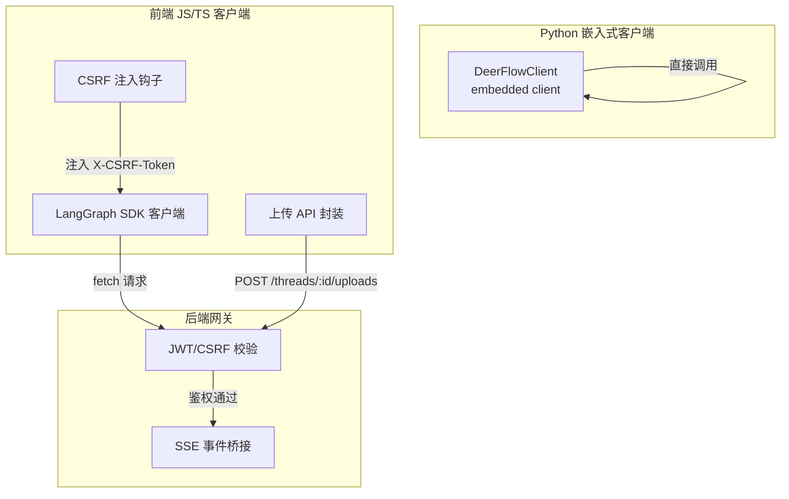
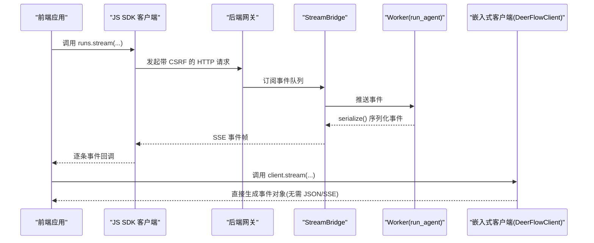
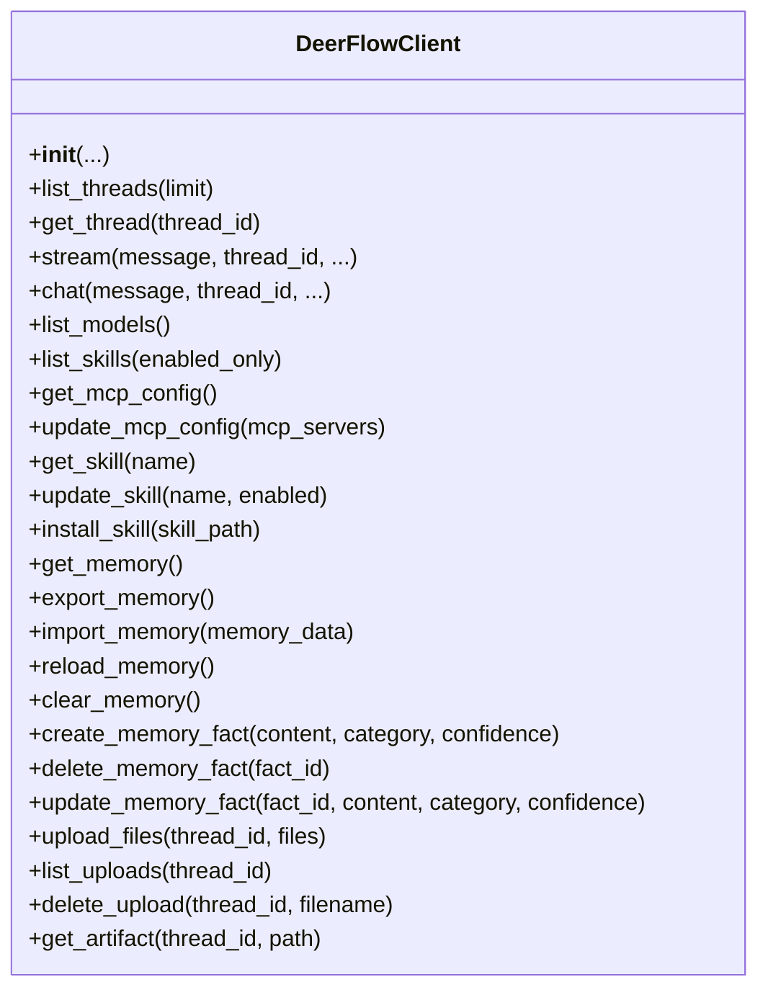
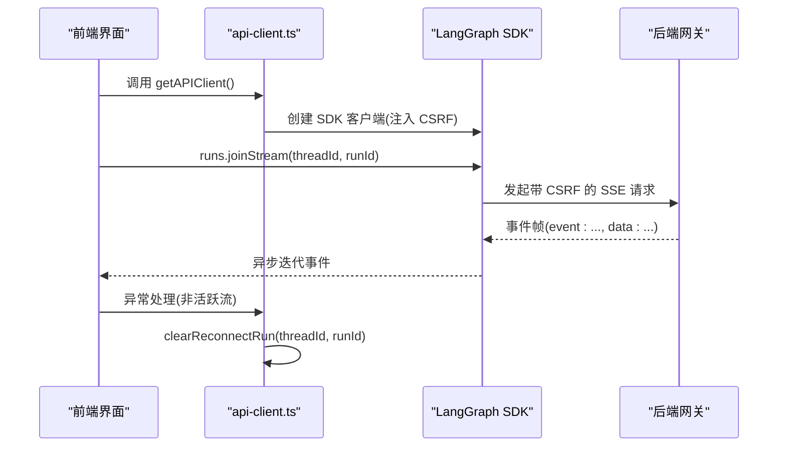
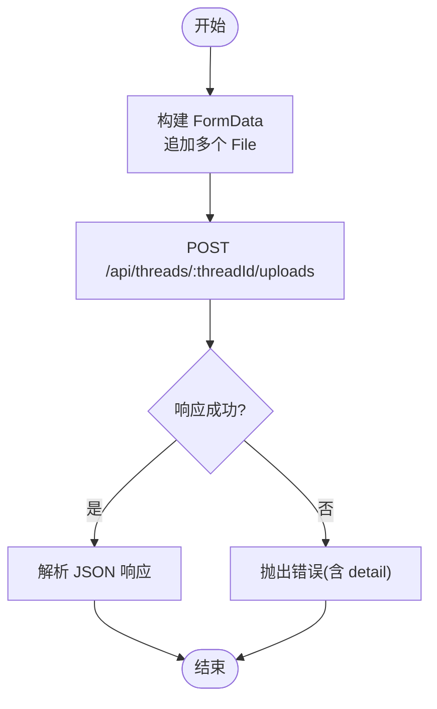
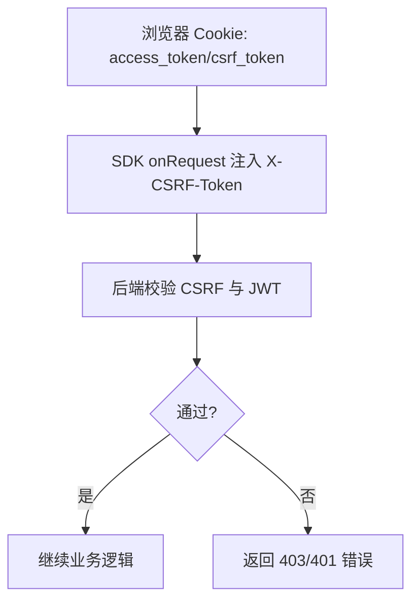
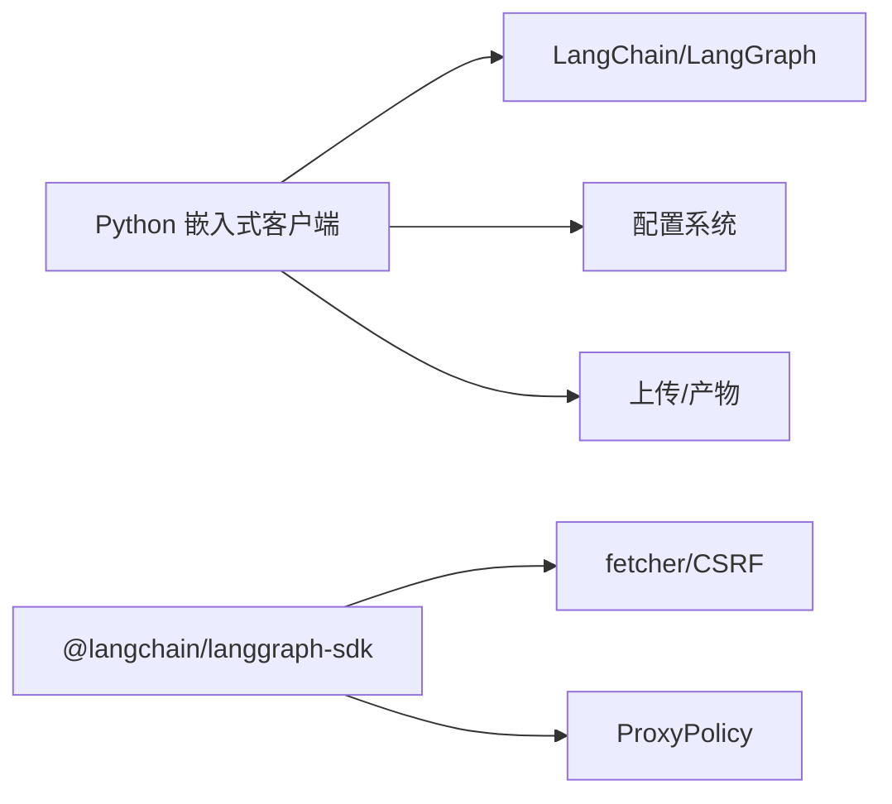

# 嵌入式客户端

<cite>
**本文引用的文件**
- [backend/packages/harness/deerflow/client.py](file://backend/packages/harness/deerflow/client.py)
- [frontend/src/core/api/api-client.ts](file://frontend/src/core/api/api-client.ts)
- [frontend/src/core/uploads/api.ts](file://frontend/src/core/uploads/api.ts)
- [backend/docs/STREAMING.md](file://backend/docs/STREAMING.md)
- [backend/app/gateway/langgraph_auth.py](file://backend/app/gateway/langgraph_auth.py)
- [frontend/src/core/auth/proxy-policy.ts](file://frontend/src/core/auth/proxy-policy.ts)
- [backend/tests/test_client_live.py](file://backend/tests/test_client_live.py)
- [backend/tests/test_runtime_lifecycle_e2e.py](file://backend/tests/test_runtime_lifecycle_e2e.py)
- [backend/tests/test_uploads_router.py](file://backend/tests/test_uploads_router.py)
- [backend/tests/test_langgraph_auth.py](file://backend/tests/test_langgraph_auth.py)
- [backend/tests/test_auth_errors.py](file://backend/tests/test_auth_errors.py)
- [backend/tests/test_auth_type_system.py](file://backend/tests/test_auth_type_system.py)
- [backend/tests/test_subagent_timeout_config.py](file://backend/tests/test_subagent_timeout_config.py)
- [backend/packages/harness/deerflow/agents/middlewares/llm_error_handling_middleware.py](file://backend/packages/harness/deerflow/agents/middlewares/llm_error_handling_middleware.py)
- [backend/packages/harness/deerflow/subagents/registry.py](file://backend/packages/harness/deerflow/subagents/registry.py)
- [config.example.yaml](file://config.example.yaml)
</cite>

## 目录
1. [简介](#简介)
2. [项目结构](#项目结构)
3. [核心组件](#核心组件)
4. [架构总览](#架构总览)
5. [详细组件分析](#详细组件分析)
6. [依赖分析](#依赖分析)
7. [性能考虑](#性能考虑)
8. [故障排除指南](#故障排除指南)
9. [结论](#结论)
10. [附录](#附录)

## 简介
本指南面向需要在前端或后端环境中直接调用 DeerFlow 嵌入式能力的开发者，系统性讲解两类客户端的使用方式与最佳实践：
- Python LangGraph SDK 客户端（嵌入式）：无需 LangGraph Server/Gateway，直接在进程中运行代理并返回事件流。
- JavaScript/TypeScript 客户端（浏览器端）：基于 @langchain/langgraph-sdk 的兼容封装，支持 fetch API、SSE 流与 CSRF 保护。

文档覆盖初始化、认证配置、线程管理、运行执行、流式响应处理、文件上传、配置项、超时与重试策略，以及常见集成场景与故障排除建议。

## 项目结构
围绕“嵌入式客户端”的相关模块主要分布在以下位置：
- Python 嵌入式客户端：位于 backend/packages/harness/deerflow/client.py，提供线程查询、消息流、模型/技能查询、MCP/内存/文件上传等能力。
- 前端 JS/TS 客户端：位于 frontend/src/core/api/api-client.ts，封装 LangGraph SDK 并注入 CSRF 头；文件上传接口位于 frontend/src/core/uploads/api.ts。
- 文档与测试：backend/docs/STREAMING.md 提供流式协议说明；大量 tests/*.py 验证认证、上传、流式生命周期等行为。
- 认证与网关：frontend/src/core/auth/proxy-policy.ts 定义代理策略；backend/app/gateway/langgraph_auth.py 实现 CSRF/JWT 校验。

图示来源
- [backend/packages/harness/deerflow/client.py](file://backend/packages/harness/deerflow/client.py)
- [frontend/src/core/api/api-client.ts](file://frontend/src/core/api/api-client.ts)
- [frontend/src/core/uploads/api.ts](file://frontend/src/core/uploads/api.ts)
- [backend/app/gateway/langgraph_auth.py](file://backend/app/gateway/langgraph_auth.py)

章节来源
- [backend/packages/harness/deerflow/client.py](file://backend/packages/harness/deerflow/client.py)
- [frontend/src/core/api/api-client.ts](file://frontend/src/core/api/api-client.ts)
- [frontend/src/core/uploads/api.ts](file://frontend/src/core/uploads/api.ts)
- [backend/app/gateway/langgraph_auth.py](file://backend/app/gateway/langgraph_auth.py)

## 核心组件
- Python 嵌入式客户端 DeerFlowClient
  - 支持创建线程、执行运行、流式增量事件、查询模型/技能、MCP 配置、内存导入导出、文件上传/列出/删除、产物读取等。
  - 流式事件类型与 LangGraph SSE 协议对齐，便于前后端一致处理。
- JavaScript/TypeScript 客户端
  - 基于 LangGraph SDK，自动注入 CSRF 头；提供 run.stream/joinStream 包装，增强错误处理与重连清理。
  - 文件上传通过 fetch API，支持多文件表单提交与错误解析。

章节来源
- [backend/packages/harness/deerflow/client.py](file://backend/packages/harness/deerflow/client.py)
- [frontend/src/core/api/api-client.ts](file://frontend/src/core/api/api-client.ts)
- [frontend/src/core/uploads/api.ts](file://frontend/src/core/uploads/api.ts)

## 架构总览
下图展示嵌入式与网关两种路径在事件流上的对应关系，帮助理解前端 SDK 与嵌入式客户端如何复用相同的流模式。

图示来源
- [backend/docs/STREAMING.md](file://backend/docs/STREAMING.md)
- [frontend/src/core/api/api-client.ts](file://frontend/src/core/api/api-client.ts)

章节来源
- [backend/docs/STREAMING.md](file://backend/docs/STREAMING.md)

## 详细组件分析

### Python 嵌入式客户端 DeerFlowClient
- 初始化与配置
  - 支持传入 config_path、checkpointer、模型名、思维开关、子代理开关、计划模式、可用技能集合、自定义中间件、环境标签等。
  - 若未提供 checkpointer，内部会按需获取默认检查点器以支持多轮对话上下文。
- 线程与运行
  - list_threads/get_thread：查询线程信息与完整检查点历史。
  - stream/chat：前者返回增量事件迭代器，后者聚合最终文本。
  - 事件类型与数据结构与 LangGraph SSE 对齐，便于前后端统一处理。
- 配置查询
  - list_models/get_model：查询可用模型与特性。
  - list_skills/get_skill：查询技能状态。
- MCP 与技能管理
  - get_mcp_config/update_mcp_config：读取/更新 MCP 服务器配置。
  - update_skill/install_skill：启用/禁用技能或安装新技能包。
- 内存管理
  - get_memory/export_memory/import_memory/reload_memory/clear_memory/create/delete/update_memory_fact：内存数据的读写与事实级操作。
- 文件上传与产物
  - upload_files/list_uploads/delete_upload：本地文件上传到线程目录，支持可转换格式的 Markdown 转换。
  - get_artifact：读取产物文件并返回字节与 MIME 类型。

图示来源
- [backend/packages/harness/deerflow/client.py](file://backend/packages/harness/deerflow/client.py)

章节来源
- [backend/packages/harness/deerflow/client.py](file://backend/packages/harness/deerflow/client.py)
- [backend/tests/test_client_live.py](file://backend/tests/test_client_live.py)

### JavaScript/TypeScript 客户端（前端）
- SDK 客户端创建与 CSRF 注入
  - 通过 getAPIClient 获取单例客户端实例，自动注入 onRequest 钩子以在状态变更请求中添加 X-CSRF-Token。
  - 对 runs.stream/joinStream 进行包装，增强对“非活跃运行流”错误的识别与 sessionStorage 清理。
- SSE 流处理
  - joinStream 返回异步迭代器，消费端可逐条读取事件；若检测到特定错误，自动清理重连标识。
- 错误处理
  - isInactiveRunStreamError 用于识别“运行不在当前工作节点上”的错误，避免 UI 卡死。
  - clearReconnectRun 在切换线程或重新连接时清理旧的 run 标识。

图示来源
- [frontend/src/core/api/api-client.ts](file://frontend/src/core/api/api-client.ts)

章节来源
- [frontend/src/core/api/api-client.ts](file://frontend/src/core/api/api-client.ts)

### 文件上传（前端）
- 上传流程
  - 通过 uploadFiles 以 FormData 形式提交多个文件至 /api/threads/:threadId/uploads。
  - 成功后返回文件清单与虚拟路径、制品 URL 等信息。
- 列表与删除
  - listUploadedFiles 获取线程内所有已上传文件。
  - deleteUploadedFile 删除指定文件，支持对可转换格式的 Markdown 文件联动清理。

图示来源
- [frontend/src/core/uploads/api.ts](file://frontend/src/core/uploads/api.ts)

章节来源
- [frontend/src/core/uploads/api.ts](file://frontend/src/core/uploads/api.ts)
- [backend/tests/test_uploads_router.py](file://backend/tests/test_uploads_router.py)

### 认证与 CSRF（前端与后端）
- 前端策略
  - ProxyPolicy 定义允许的上游路径前缀、转发前剥离的请求头、返回前剥离的响应头、凭据模式（cookie 名称）、超时与 CSRF 开关。
  - onRequest 钩子在状态变更请求中注入 X-CSRF-Token。
- 后端校验
  - langgraph_auth 校验 access_token 与 CSRF token 是否匹配，不匹配则 403。
  - 测试覆盖了多种场景：缺失 CSRF、CSRF 不匹配、JWT 过期/签名错误等。

图示来源
- [frontend/src/core/auth/proxy-policy.ts](file://frontend/src/core/auth/proxy-policy.ts)
- [frontend/src/core/api/api-client.ts](file://frontend/src/core/api/api-client.ts)
- [backend/app/gateway/langgraph_auth.py](file://backend/app/gateway/langgraph_auth.py)
- [backend/tests/test_langgraph_auth.py](file://backend/tests/test_langgraph_auth.py)
- [backend/tests/test_auth_errors.py](file://backend/tests/test_auth_errors.py)
- [backend/tests/test_auth_type_system.py](file://backend/tests/test_auth_type_system.py)

章节来源
- [frontend/src/core/auth/proxy-policy.ts](file://frontend/src/core/auth/proxy-policy.ts)
- [frontend/src/core/api/api-client.ts](file://frontend/src/core/api/api-client.ts)
- [backend/app/gateway/langgraph_auth.py](file://backend/app/gateway/langgraph_auth.py)
- [backend/tests/test_langgraph_auth.py](file://backend/tests/test_langgraph_auth.py)
- [backend/tests/test_auth_errors.py](file://backend/tests/test_auth_errors.py)
- [backend/tests/test_auth_type_system.py](file://backend/tests/test_auth_type_system.py)

## 依赖分析
- 嵌入式客户端依赖
  - LangChain/LangGraph 工具链：消息序列化、工具集、中间件、检查点器。
  - 配置系统：应用配置、扩展配置（MCP/技能）、路径解析、内存配置。
  - 上传与产物：文件复制、唯一命名、Markdown 转换、虚拟路径映射。
- 前端 SDK 依赖
  - @langchain/langgraph-sdk：统一的 LangGraph API 客户端。
  - fetcher：通用 fetch 封装，包含 CSRF 读取与静态模式支持。
  - 静态演示：在静态网站模式下提供模拟线程与运行数据。

图示来源
- [backend/packages/harness/deerflow/client.py](file://backend/packages/harness/deerflow/client.py)
- [frontend/src/core/api/api-client.ts](file://frontend/src/core/api/api-client.ts)
- [frontend/src/core/auth/proxy-policy.ts](file://frontend/src/core/auth/proxy-policy.ts)

章节来源
- [backend/packages/harness/deerflow/client.py](file://backend/packages/harness/deerflow/client.py)
- [frontend/src/core/api/api-client.ts](file://frontend/src/core/api/api-client.ts)
- [frontend/src/core/auth/proxy-policy.ts](file://frontend/src/core/auth/proxy-policy.ts)

## 性能考虑
- 流式事件合并
  - 嵌入式客户端在聚合最终文本时采用 per-id 缓存列表合并，避免字符串拼接的 O(n^2) 复杂度。
- 事件去重与用量统计
  - 通过消息 id 跟踪已发送事件，避免 values 与 messages 双通道重复合成；用量统计仅按首次出现的消息 id 计数。
- 子代理超时与轮询
  - 子代理执行超时计算公式为 (timeout_seconds + 60) // 5，确保轮询窗口长于执行超时，防止误判。
- LLM 重试与熔断
  - 中间件根据错误类型分类为瞬时/繁忙/配额/鉴权/通用，采用指数退避与 Retry-After 优先策略；达到阈值后进入熔断状态，定时恢复。

章节来源
- [backend/packages/harness/deerflow/client.py](file://backend/packages/harness/deerflow/client.py)
- [backend/tests/test_subagent_timeout_config.py](file://backend/tests/test_subagent_timeout_config.py)
- [backend/packages/harness/deerflow/agents/middlewares/llm_error_handling_middleware.py](file://backend/packages/harness/deerflow/agents/middlewares/llm_error_handling_middleware.py)

## 故障排除指南
- SSE 流未结束或超时
  - 端到端测试验证：若 SSE 流在限定时间内未产生数据或未收到 event: end，则抛出断言异常，提示超时与尾部转录。
  - 建议：检查后端 StreamBridge 与 worker 是否正常；确认前端 joinStream 循环是否正确终止。
- 非活跃运行流
  - 前端 SDK 识别“运行不在当前工作节点上无法流式”的错误，自动清理 sessionStorage 中的重连标识，避免 UI 卡死。
- CSRF/鉴权失败
  - 后端严格校验 CSRF 与 JWT：缺失或不匹配将返回 403/401；JWT 过期/签名错误有明确结构化错误码。
  - 建议：确保 onRequest 钩子正确注入 X-CSRF-Token；登录态有效且未过期。
- 文件上传失败
  - 前端上传接口在非 2xx 时解析 JSON 中的 detail 字段作为错误信息；后端路由对同名文件进行唯一命名并保留原始文件名。
  - 建议：检查线程目录权限、磁盘空间与文件路径合法性。

章节来源
- [backend/tests/test_runtime_lifecycle_e2e.py](file://backend/tests/test_runtime_lifecycle_e2e.py)
- [frontend/src/core/api/api-client.ts](file://frontend/src/core/api/api-client.ts)
- [backend/app/gateway/langgraph_auth.py](file://backend/app/gateway/langgraph_auth.py)
- [backend/tests/test_langgraph_auth.py](file://backend/tests/test_langgraph_auth.py)
- [backend/tests/test_auth_errors.py](file://backend/tests/test_auth_errors.py)
- [backend/tests/test_auth_type_system.py](file://backend/tests/test_auth_type_system.py)
- [backend/tests/test_uploads_router.py](file://backend/tests/test_uploads_router.py)

## 结论
- 嵌入式 Python 客户端提供与网关一致的事件流语义，适合需要低延迟、无外部进程依赖的场景。
- 前端 JS/TS 客户端通过 SDK 与 CSRF 保护，适配浏览器端的 SSE 流与文件上传。
- 配置项、超时与重试策略完善，结合熔断与错误分类，可在不稳定网络环境下保持稳健表现。
- 建议在生产中结合日志与监控，关注流式事件的完整性与用量统计，合理设置子代理超时与重试参数。

## 附录

### 配置选项与超时/重试
- 模型配置
  - 支持 request_timeout/max_retries/supports_thinking 等字段，详见配置示例。
- 子代理超时
  - 超时计算公式：(timeout_seconds + 60) // 5，确保轮询窗口大于执行超时。
- LLM 错误处理与熔断
  - 错误分类：瞬时/繁忙/配额/鉴权/通用；指数退避与 Retry-After 优先；超过阈值进入熔断，定时恢复。

章节来源
- [config.example.yaml](file://config.example.yaml)
- [backend/tests/test_subagent_timeout_config.py](file://backend/tests/test_subagent_timeout_config.py)
- [backend/packages/harness/deerflow/agents/middlewares/llm_error_handling_middleware.py](file://backend/packages/harness/deerflow/agents/middlewares/llm_error_handling_middleware.py)