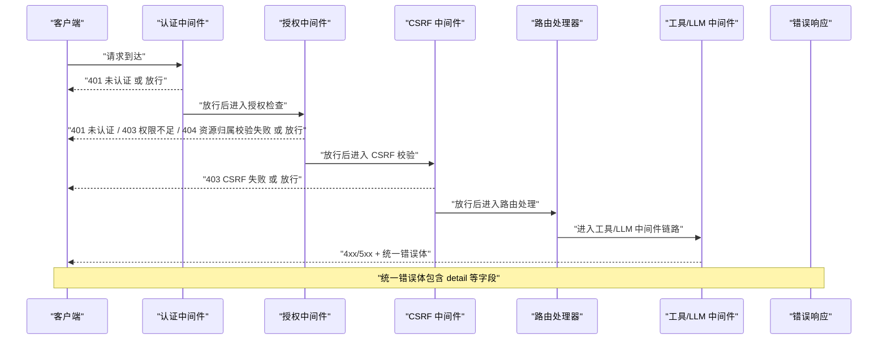
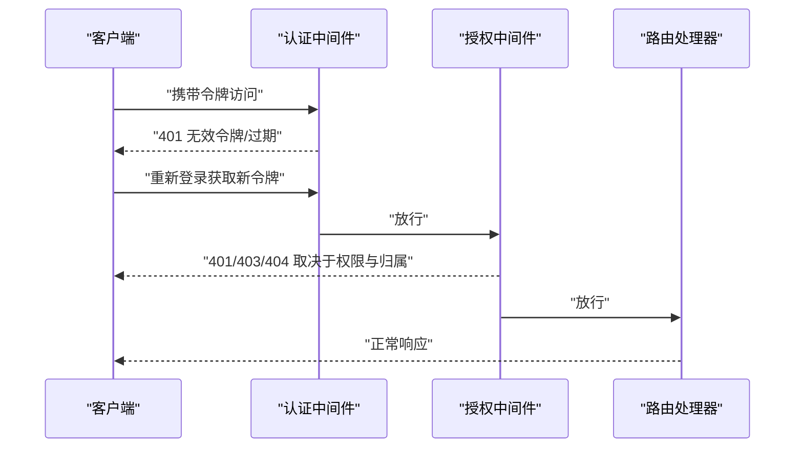
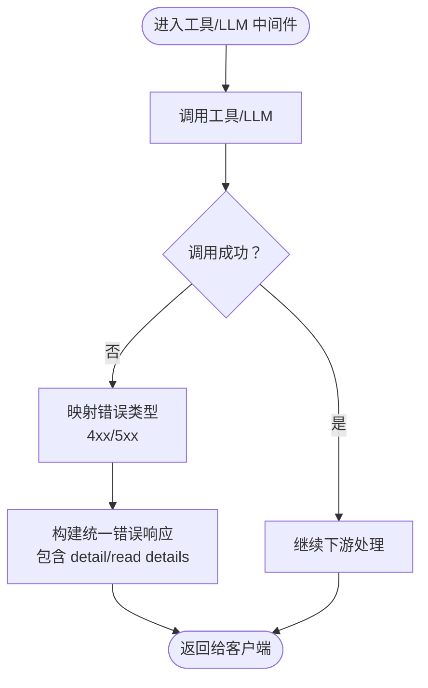
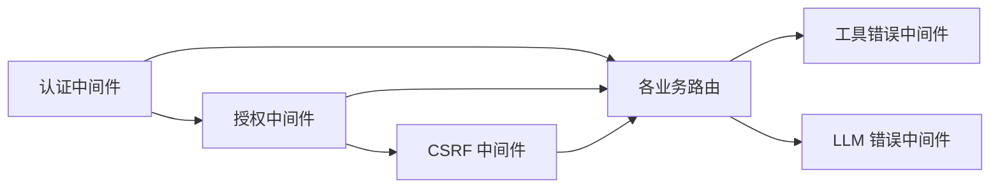

# 错误处理与状态码

<cite>
**本文引用的文件**
- [backend/app/gateway/auth_middleware.py](file://backend/app/gateway/auth_middleware.py)
- [backend/app/gateway/authz.py](file://backend/app/gateway/authz.py)
- [backend/app/gateway/csrf_middleware.py](file://backend/app/gateway/csrf_middleware.py)
- [backend/app/gateway/deps.py](file://backend/app/gateway/deps.py)
- [backend/app/gateway/routers/auth.py](file://backend/app/gateway/routers/auth.py)
- [backend/app/gateway/routers/threads.py](file://backend/app/gateway/routers/threads.py)
- [backend/app/gateway/routers/runs.py](file://backend/app/gateway/routers/runs.py)
- [backend/app/gateway/routers/artifacts.py](file://backend/app/gateway/routers/artifacts.py)
- [backend/app/gateway/routers/models.py](file://backend/app/gateway/routers/models.py)
- [backend/app/gateway/routers/skills.py](file://backend/app/gateway/routers/skills.py)
- [backend/app/gateway/routers/memory.py](file://backend/app/gateway/routers/memory.py)
- [backend/app/gateway/routers/channels.py](file://backend/app/gateway/routers/channels.py)
- [backend/app/gateway/routers/uploads.py](file://backend/app/gateway/routers/uploads.py)
- [backend/app/gateway/routers/feedback.py](file://backend/app/gateway/routers/feedback.py)
- [backend/app/gateway/routers/suggestions.py](file://backend/app/gateway/routers/suggestions.py)
- [backend/app/gateway/routers/mcp.py](file://backend/app/gateway/routers/mcp.py)
- [backend/app/gateway/routers/assistants_compat.py](file://backend/app/gateway/routers/assistants_compat.py)
- [backend/app/gateway/auth/errors.py](file://backend/app/gateway/auth/errors.py)
- [backend/tests/test_auth_errors.py](file://backend/tests/test_auth_errors.py)
- [backend/tests/test_auth_middleware.py](file://backend/tests/test_auth_middleware.py)
- [backend/tests/test_auth.py](file://backend/tests/test_auth.py)
- [backend/packages/harness/deerflow/agents/middlewares/tool_error_handling_middleware.py](file://backend/packages/harness/deerflow/agents/middlewares/tool_error_handling_middleware.py)
- [backend/packages/harness/deerflow/agents/middlewares/llm_error_handling_middleware.py](file://backend/packages/harness/deerflow/agents/middlewares/llm_error_handling_middleware.py)
- [backend/tests/test_tool_error_handling_middleware.py](file://backend/tests/test_tool_error_handling_middleware.py)
- [backend/tests/test_llm_error_handling_middleware.py](file://backend/tests/test_llm_error_handling_middleware.py)
- [backend/app/channels/discord.py](file://backend/app/channels/discord.py)
</cite>

## 目录
1. [引言](#引言)
2. [项目结构](#项目结构)
3. [核心组件](#核心组件)
4. [架构总览](#架构总览)
5. [详细组件分析](#详细组件分析)
6. [依赖关系分析](#依赖关系分析)
7. [性能考量](#性能考量)
8. [故障排查指南](#故障排查指南)
9. [结论](#结论)
10. [附录](#附录)

## 引言
本文件系统性梳理 DeerFlow 后端的错误处理与 HTTP 状态码使用规范，覆盖统一错误响应格式、认证与授权错误、工具与 LLM 错误处理、以及前端客户端的最佳实践与用户体验优化建议。目标是帮助开发者在实现与集成时遵循一致的错误语义与交互体验。

## 项目结构
后端基于 FastAPI 构建，错误处理主要分布在以下层次：
- 中间件层：认证中间件、授权中间件、CSRF 中间件
- 路由层：各业务模块路由（如认证、线程、运行、制品、模型、技能、内存、渠道、上传、反馈、建议、MCP、兼容接口）
- 服务与工具中间件：工具调用错误与 LLM 错误处理中间件
- 测试层：针对认证错误、中间件行为的单元测试

```mermaid
graph TB
subgraph "网关与中间件"
AM["认证中间件<br/>auth_middleware.py"]
AZ["授权中间件<br/>authz.py"]
CSRF["CSRF 中间件<br/>csrf_middleware.py"]
DEPS["依赖注入与通用异常<br/>deps.py"]
end
subgraph "路由层"
ROUT_AUTH["认证路由<br/>routers/auth.py"]
ROUT_THREADS["线程路由<br/>routers/threads.py"]
ROUT_RUNS["运行路由<br/>routers/runs.py"]
ROUT_ARTIFACTS["制品路由<br/>routers/artifacts.py"]
ROUT_MODELS["模型路由<br/>routers/models.py"]
ROUT_SKILLS["技能路由<br/>routers/skills.py"]
ROUT_MEMORY["记忆路由<br/>routers/memory.py"]
ROUT_CHANNELS["渠道路由<br/>routers/channels.py"]
ROUT_UPLOADS["上传路由<br/>routers/uploads.py"]
ROUT_FEEDBACK["反馈路由<br/>routers/feedback.py"]
ROUT_SUGGESTIONS["建议路由<br/>routers/suggestions.py"]
ROUT_MCP["MCP 路由<br/>routers/mcp.py"]
ROUT_COMPAT["兼容路由<br/>routers/assistants_compat.py"]
end
subgraph "工具与 LLM 中间件"
TOOLMW["工具错误处理中间件<br/>tool_error_handling_middleware.py"]
LLMMW["LLM 错误处理中间件<br/>llm_error_handling_middleware.py"]
end
AM --> ROUT_AUTH
AM --> ROUT_THREADS
AM --> ROUT_RUNS
AM --> ROUT_ARTIFACTS
AM --> ROUT_MODELS
AM --> ROUT_SKILLS
AM --> ROUT_MEMORY
AM --> ROUT_CHANNELS
AM --> ROUT_UPLOADS
AM --> ROUT_FEEDBACK
AM --> ROUT_SUGGESTIONS
AM --> ROUT_MCP
AM --> ROUT_COMPAT
AZ -. 授权检查 .-> ROUT_THREADS
AZ -. 授权检查 .-> ROUT_RUNS
AZ -. 授权检查 .-> ROUT_ARTIFACTS
AZ -. 授权检查 .-> ROUT_MODELS
AZ -. 授权检查 .-> ROUT_SKILLS
AZ -. 授权检查 .-> ROUT_MEMORY
AZ -. 授权检查 .-> ROUT_CHANNELS
AZ -. 授权检查 .-> ROUT_UPLOADS
AZ -. 授权检查 .-> ROUT_FEEDBACK
AZ -. 授权检查 .-> ROUT_SUGGESTIONS
AZ -. 授权检查 .-> ROUT_MCP
AZ -. 授权检查 .-> ROUT_COMPAT
CSRF -. 校验 .-> ROUT_AUTH
CSRF -. 校验 .-> ROUT_THREADS
CSRF -. 校验 .-> ROUT_RUNS
CSRF -. 校验 .-> ROUT_ARTIFACTS
CSRF -. 校验 .-> ROUT_MODELS
CSRF -. 校验 .-> ROUT_SKILLS
CSRF -. 校验 .-> ROUT_MEMORY
CSRF -. 校验 .-> ROUT_CHANNELS
CSRF -. 校验 .-> ROUT_UPLOADS
CSRF -. 校验 .-> ROUT_FEEDBACK
CSRF -. 校验 .-> ROUT_SUGGESTIONS
CSRF -. 校验 .-> ROUT_MCP
CSRF -. 校验 .-> ROUT_COMPAT
ROUT_AUTH --> TOOLMW
ROUT_AUTH --> LLMMW
ROUT_THREADS --> TOOLMW
ROUT_THREADS --> LLMMW
ROUT_RUNS --> TOOLMW
ROUT_RUNS --> LLMMW
ROUT_ARTIFACTS --> TOOLMW
ROUT_ARTIFACTS --> LLMMW
ROUT_MODELS --> TOOLMW
ROUT_MODELS --> LLMMW
ROUT_SKILLS --> TOOLMW
ROUT_SKILLS --> LLMMW
ROUT_MEMORY --> TOOLMW
ROUT_MEMORY --> LLMMW
ROUT_CHANNELS --> TOOLMW
ROUT_CHANNELS --> LLMMW
ROUT_UPLOADS --> TOOLMW
ROUT_UPLOADS --> LLMMW
ROUT_FEEDBACK --> TOOLMW
ROUT_FEEDBACK --> LLMMW
ROUT_SUGGESTIONS --> TOOLMW
ROUT_SUGGESTIONS --> LLMMW
ROUT_MCP --> TOOLMW
ROUT_MCP --> LLMMW
ROUT_COMPAT --> TOOLMW
ROUT_COMPAT --> LLMMW
```

图表来源
- [backend/app/gateway/auth_middleware.py](file://backend/app/gateway/auth_middleware.py)
- [backend/app/gateway/authz.py](file://backend/app/gateway/authz.py)
- [backend/app/gateway/csrf_middleware.py](file://backend/app/gateway/csrf_middleware.py)
- [backend/app/gateway/deps.py](file://backend/app/gateway/deps.py)
- [backend/app/gateway/routers/auth.py](file://backend/app/gateway/routers/auth.py)
- [backend/app/gateway/routers/threads.py](file://backend/app/gateway/routers/threads.py)
- [backend/app/gateway/routers/runs.py](file://backend/app/gateway/routers/runs.py)
- [backend/app/gateway/routers/artifacts.py](file://backend/app/gateway/routers/artifacts.py)
- [backend/app/gateway/routers/models.py](file://backend/app/gateway/routers/models.py)
- [backend/app/gateway/routers/skills.py](file://backend/app/gateway/routers/skills.py)
- [backend/app/gateway/routers/memory.py](file://backend/app/gateway/routers/memory.py)
- [backend/app/gateway/routers/channels.py](file://backend/app/gateway/routers/channels.py)
- [backend/app/gateway/routers/uploads.py](file://backend/app/gateway/routers/uploads.py)
- [backend/app/gateway/routers/feedback.py](file://backend/app/gateway/routers/feedback.py)
- [backend/app/gateway/routers/suggestions.py](file://backend/app/gateway/routers/suggestions.py)
- [backend/app/gateway/routers/mcp.py](file://backend/app/gateway/routers/mcp.py)
- [backend/app/gateway/routers/assistants_compat.py](file://backend/app/gateway/routers/assistants_compat.py)
- [backend/packages/harness/deerflow/agents/middlewares/tool_error_handling_middleware.py](file://backend/packages/harness/deerflow/agents/middlewares/tool_error_handling_middleware.py)
- [backend/packages/harness/deerflow/agents/middlewares/llm_error_handling_middleware.py](file://backend/packages/harness/deerflow/agents/middlewares/llm_error_handling_middleware.py)

章节来源
- [backend/app/gateway/auth_middleware.py](file://backend/app/gateway/auth_middleware.py)
- [backend/app/gateway/authz.py](file://backend/app/gateway/authz.py)
- [backend/app/gateway/csrf_middleware.py](file://backend/app/gateway/csrf_middleware.py)
- [backend/app/gateway/deps.py](file://backend/app/gateway/deps.py)
- [backend/app/gateway/routers/auth.py](file://backend/app/gateway/routers/auth.py)
- [backend/app/gateway/routers/threads.py](file://backend/app/gateway/routers/threads.py)
- [backend/app/gateway/routers/runs.py](file://backend/app/gateway/routers/runs.py)
- [backend/app/gateway/routers/artifacts.py](file://backend/app/gateway/routers/artifacts.py)
- [backend/app/gateway/routers/models.py](file://backend/app/gateway/routers/models.py)
- [backend/app/gateway/routers/skills.py](file://backend/app/gateway/routers/skills.py)
- [backend/app/gateway/routers/memory.py](file://backend/app/gateway/routers/memory.py)
- [backend/app/gateway/routers/channels.py](file://backend/app/gateway/routers/channels.py)
- [backend/app/gateway/routers/uploads.py](file://backend/app/gateway/routers/uploads.py)
- [backend/app/gateway/routers/feedback.py](file://backend/app/gateway/routers/feedback.py)
- [backend/app/gateway/routers/suggestions.py](file://backend/app/gateway/routers/suggestions.py)
- [backend/app/gateway/routers/mcp.py](file://backend/app/gateway/routers/mcp.py)
- [backend/app/gateway/routers/assistants_compat.py](file://backend/app/gateway/routers/assistants_compat.py)
- [backend/packages/harness/deerflow/agents/middlewares/tool_error_handling_middleware.py](file://backend/packages/harness/deerflow/agents/middlewares/tool_error_handling_middleware.py)
- [backend/packages/harness/deerflow/agents/middlewares/llm_error_handling_middleware.py](file://backend/packages/harness/deerflow/agents/middlewares/llm_error_handling_middleware.py)

## 核心组件
- 统一错误响应格式
  - 响应体字段：包含统一的错误详情键（例如 detail），用于描述错误原因；部分场景返回额外上下文信息（如 read details）。
  - 状态码：严格遵循 HTTP 语义，结合业务场景选择合适的 4xx/5xx。
- 认证与授权错误
  - 未认证：401，常见于缺少或无效令牌、会话过期。
  - 权限不足：403，用户无权访问资源或执行操作。
  - 资源不存在或归属校验失败：404，如线程所有权校验失败。
- CSRF 保护
  - 违规请求：403，通常由 CSRF 中间件拦截并返回。
- 工具与 LLM 错误
  - 工具调用失败：根据具体错误映射到 4xx/5xx，并携带可读的 detail。
  - LLM 错误：按策略降级或重试，同时返回明确的错误信息。

章节来源
- [backend/app/gateway/auth_middleware.py](file://backend/app/gateway/auth_middleware.py)
- [backend/app/gateway/authz.py](file://backend/app/gateway/authz.py)
- [backend/app/gateway/csrf_middleware.py](file://backend/app/gateway/csrf_middleware.py)
- [backend/app/gateway/deps.py](file://backend/app/gateway/deps.py)
- [backend/app/gateway/routers/auth.py](file://backend/app/gateway/routers/auth.py)
- [backend/app/gateway/routers/threads.py](file://backend/app/gateway/routers/threads.py)
- [backend/app/gateway/routers/runs.py](file://backend/app/gateway/routers/runs.py)
- [backend/app/gateway/routers/artifacts.py](file://backend/app/gateway/routers/artifacts.py)
- [backend/app/gateway/routers/models.py](file://backend/app/gateway/routers/models.py)
- [backend/app/gateway/routers/skills.py](file://backend/app/gateway/routers/skills.py)
- [backend/app/gateway/routers/memory.py](file://backend/app/gateway/routers/memory.py)
- [backend/app/gateway/routers/channels.py](file://backend/app/gateway/routers/channels.py)
- [backend/app/gateway/routers/uploads.py](file://backend/app/gateway/routers/uploads.py)
- [backend/app/gateway/routers/feedback.py](file://backend/app/gateway/routers/feedback.py)
- [backend/app/gateway/routers/suggestions.py](file://backend/app/gateway/routers/suggestions.py)
- [backend/app/gateway/routers/mcp.py](file://backend/app/gateway/routers/mcp.py)
- [backend/app/gateway/routers/assistants_compat.py](file://backend/app/gateway/routers/assistants_compat.py)
- [backend/packages/harness/deerflow/agents/middlewares/tool_error_handling_middleware.py](file://backend/packages/harness/deerflow/agents/middlewares/tool_error_handling_middleware.py)
- [backend/packages/harness/deerflow/agents/middlewares/llm_error_handling_middleware.py](file://backend/packages/harness/deerflow/agents/middlewares/llm_error_handling_middleware.py)

## 架构总览
下图展示从客户端请求到错误响应的关键路径，涵盖认证、授权、CSRF、路由处理与工具/LLM中间件。

图表来源
- [backend/app/gateway/auth_middleware.py](file://backend/app/gateway/auth_middleware.py)
- [backend/app/gateway/authz.py](file://backend/app/gateway/authz.py)
- [backend/app/gateway/csrf_middleware.py](file://backend/app/gateway/csrf_middleware.py)
- [backend/app/gateway/routers/auth.py](file://backend/app/gateway/routers/auth.py)
- [backend/packages/harness/deerflow/agents/middlewares/tool_error_handling_middleware.py](file://backend/packages/harness/deerflow/agents/middlewares/tool_error_handling_middleware.py)
- [backend/packages/harness/deerflow/agents/middlewares/llm_error_handling_middleware.py](file://backend/packages/harness/deerflow/agents/middlewares/llm_error_handling_middleware.py)

## 详细组件分析

### 统一错误响应格式
- 字段约定
  - detail：字符串，描述错误原因，便于前端展示与日志检索。
  - read details：数组或对象，承载更详细的上下文信息（如定位具体参数、资源 ID 等）。
- 典型场景
  - 工具未找到：404，detail 指明工具缺失，read details 可包含工具名等。
  - 渠道 HTTP 异常：4xx，detail 描述渠道错误，read details 包含原始错误摘要。
- 设计原则
  - 保持 detail 的可读性与一致性，避免泄露内部实现细节。
  - read details 仅在必要时提供，避免过度暴露。

章节来源
- [backend/app/gateway/routers/suggestions.py](file://backend/app/gateway/routers/suggestions.py)
- [backend/app/channels/discord.py](file://backend/app/channels/discord.py)

### HTTP 状态码使用规范
- 400（错误请求）
  - 场景：请求参数不合法、格式错误、必填项缺失。
  - 实践：在路由层对输入进行显式校验，返回 400 并在 detail 中给出可理解的提示。
- 401（未认证）
  - 场景：缺少令牌、令牌无效、会话过期。
  - 实践：认证中间件捕获异常并返回 401，detail 明确“需要认证”。
- 403（禁止访问）
  - 场景：CSRF 校验失败、权限不足。
  - 实践：CSRF 中间件与授权中间件分别在各自职责范围内返回 403。
- 404（未找到）
  - 场景：资源不存在、线程归属校验失败。
  - 实践：授权中间件在 owner_check=True 且非所有者时返回 404。
- 422（语义化验证失败）
  - 场景：数据模型校验失败（Pydantic 等）。
  - 实践：FastAPI 默认返回 422，detail 包含字段级错误。
- 500（服务器内部错误）
  - 场景：未捕获异常、系统内部错误。
  - 实践：全局异常处理器捕获并返回 500，detail 提供通用提示，不泄露堆栈。

章节来源
- [backend/app/gateway/auth_middleware.py](file://backend/app/gateway/auth_middleware.py)
- [backend/app/gateway/authz.py](file://backend/app/gateway/authz.py)
- [backend/app/gateway/csrf_middleware.py](file://backend/app/gateway/csrf_middleware.py)
- [backend/app/gateway/deps.py](file://backend/app/gateway/deps.py)

### 认证相关错误
- 无效令牌/会话过期
  - 认证中间件在解析 JWT 失败或令牌过期时抛出 HTTPException，返回 401。
  - 客户端收到 401 后应引导用户重新登录或刷新令牌。
- 权限不足
  - 授权中间件在用户匿名或无权限时返回 401/403。
  - 403 常见于跨用户资源访问或操作越权。
- 线程归属校验失败
  - 当 owner_check=True 且当前用户不是线程所有者时，返回 404，避免泄露资源存在性。

图表来源
- [backend/app/gateway/auth_middleware.py](file://backend/app/gateway/auth_middleware.py)
- [backend/app/gateway/authz.py](file://backend/app/gateway/authz.py)
- [backend/app/gateway/routers/threads.py](file://backend/app/gateway/routers/threads.py)

章节来源
- [backend/app/gateway/auth_middleware.py](file://backend/app/gateway/auth_middleware.py)
- [backend/app/gateway/authz.py](file://backend/app/gateway/authz.py)
- [backend/app/gateway/routers/threads.py](file://backend/app/gateway/routers/threads.py)

### CSRF 保护
- 触发条件
  - 非幂等请求（POST/PUT/PATCH/DELETE）且缺少有效 CSRF Token。
- 返回值
  - 403，detail 指明 CSRF 校验失败。
- 建议
  - 前端在每次非幂等请求中附带 CSRF Token；刷新页面时同步更新 Token。

章节来源
- [backend/app/gateway/csrf_middleware.py](file://backend/app/gateway/csrf_middleware.py)

### 工具与 LLM 错误处理
- 工具错误
  - 工具调用失败时，中间件根据错误类型映射到 4xx/5xx，并设置 detail 与 read details。
  - 常见模式：工具未找到、参数非法、外部服务不可达。
- LLM 错误
  - LLM 错误中间件负责捕获与转换，支持降级策略（如回退到缓存或默认回复）。
  - 返回统一错误体，detail 说明问题来源（如模型提供商错误）。

图表来源
- [backend/packages/harness/deerflow/agents/middlewares/tool_error_handling_middleware.py](file://backend/packages/harness/deerflow/agents/middlewares/tool_error_handling_middleware.py)
- [backend/packages/harness/deerflow/agents/middlewares/llm_error_handling_middleware.py](file://backend/packages/harness/deerflow/agents/middlewares/llm_error_handling_middleware.py)

章节来源
- [backend/packages/harness/deerflow/agents/middlewares/tool_error_handling_middleware.py](file://backend/packages/harness/deerflow/agents/middlewares/tool_error_handling_middleware.py)
- [backend/packages/harness/deerflow/agents/middlewares/llm_error_handling_middleware.py](file://backend/packages/harness/deerflow/agents/middlewares/llm_error_handling_middleware.py)

### 渠道错误示例（以 Discord 为例）
- 场景：向 Discord 发送消息时发生 HTTP 异常。
- 处理：捕获异常并记录上下文，返回 4xx，detail 描述渠道错误，read details 包含异常摘要。

章节来源
- [backend/app/channels/discord.py](file://backend/app/channels/discord.py)

## 依赖关系分析
- 中间件耦合
  - 认证中间件为所有路由提供统一入口校验，授权中间件在认证通过后进一步细化权限控制。
  - CSRF 中间件独立于认证/授权，但与路由层形成强约束关系。
- 路由层依赖
  - 所有业务路由均依赖统一的错误响应格式，确保客户端一致性。
- 工具/LLM 中间件
  - 作为横切关注点，贯穿多个路由，保证错误处理的一致性与可维护性。

图表来源
- [backend/app/gateway/auth_middleware.py](file://backend/app/gateway/auth_middleware.py)
- [backend/app/gateway/authz.py](file://backend/app/gateway/authz.py)
- [backend/app/gateway/csrf_middleware.py](file://backend/app/gateway/csrf_middleware.py)
- [backend/app/gateway/routers/auth.py](file://backend/app/gateway/routers/auth.py)
- [backend/packages/harness/deerflow/agents/middlewares/tool_error_handling_middleware.py](file://backend/packages/harness/deerflow/agents/middlewares/tool_error_handling_middleware.py)
- [backend/packages/harness/deerflow/agents/middlewares/llm_error_handling_middleware.py](file://backend/packages/harness/deerflow/agents/middlewares/llm_error_handling_middleware.py)

章节来源
- [backend/app/gateway/auth_middleware.py](file://backend/app/gateway/auth_middleware.py)
- [backend/app/gateway/authz.py](file://backend/app/gateway/authz.py)
- [backend/app/gateway/csrf_middleware.py](file://backend/app/gateway/csrf_middleware.py)
- [backend/app/gateway/routers/auth.py](file://backend/app/gateway/routers/auth.py)
- [backend/packages/harness/deerflow/agents/middlewares/tool_error_handling_middleware.py](file://backend/packages/harness/deerflow/agents/middlewares/tool_error_handling_middleware.py)
- [backend/packages/harness/deerflow/agents/middlewares/llm_error_handling_middleware.py](file://backend/packages/harness/deerflow/agents/middlewares/llm_error_handling_middleware.py)

## 性能考量
- 错误路径短路
  - 在认证/授权阶段尽早失败，避免不必要的下游调用。
- 日志与追踪
  - 错误响应中保留可关联的请求 ID，便于端到端追踪。
- 降级与重试
  - 对外部依赖（如渠道、LLM）采用指数退避与熔断策略，减少错误风暴。

## 故障排查指南
- 常见错误模式识别
  - 401：检查令牌是否正确携带、是否过期；确认认证中间件配置。
  - 403：检查 CSRF Token 是否随请求发送；核对授权策略。
  - 404：确认资源是否存在；对于归属校验失败，确认当前用户与资源所有者关系。
  - 422：查看 detail 中字段级错误，修正请求体。
  - 工具错误：根据 read details 定位具体工具与参数；检查工具可用性与权限。
- 解决方案
  - 刷新令牌或重新登录。
  - 更新 CSRF Token 并重试。
  - 校正请求参数或补齐必填字段。
  - 检查工具注册与权限配置。
- 测试参考
  - 认证错误测试：验证 401/403/404 的触发条件与响应体。
  - 中间件行为测试：验证认证、授权、CSRF 中间件的顺序与结果。
  - 工具/LLM 错误测试：验证错误映射与统一响应格式。

章节来源
- [backend/tests/test_auth_errors.py](file://backend/tests/test_auth_errors.py)
- [backend/tests/test_auth_middleware.py](file://backend/tests/test_auth_middleware.py)
- [backend/tests/test_auth.py](file://backend/tests/test_auth.py)
- [backend/tests/test_tool_error_handling_middleware.py](file://backend/tests/test_tool_error_handling_middleware.py)
- [backend/tests/test_llm_error_handling_middleware.py](file://backend/tests/test_llm_error_handling_middleware.py)

## 结论
DeerFlow 的错误处理机制以统一响应格式为核心，结合认证、授权与 CSRF 三道防线，辅以工具与 LLM 错误中间件，形成清晰、一致且可维护的错误语义体系。遵循本文的状态码使用规范与最佳实践，可显著提升客户端的诊断效率与用户体验。

## 附录
- 客户端错误处理最佳实践
  - 展示友好提示：优先使用 detail 中的可读信息，避免直接显示技术术语。
  - 分类处理：401 引导重新登录；403 提示权限不足；404 提示资源不存在；422 展示字段级错误并允许自动修复。
  - 记录上下文：在错误日志中附带请求 ID、时间戳与用户信息，便于复现。
  - 用户体验优化：提供“复制错误信息”按钮；在 5xx 时提供“稍后重试”与“联系支持”的入口。
- 错误分类速查
  - 认证类：401（未认证）、403（CSRF/权限不足）、404（归属校验失败）。
  - 输入类：400（参数错误）、422（模型校验失败）。
  - 资源类：404（资源不存在）。
  - 系统类：500（服务器内部错误）。
  - 工具/LLM 类：依据具体错误映射至 4xx/5xx，并携带 detail 与 read details。