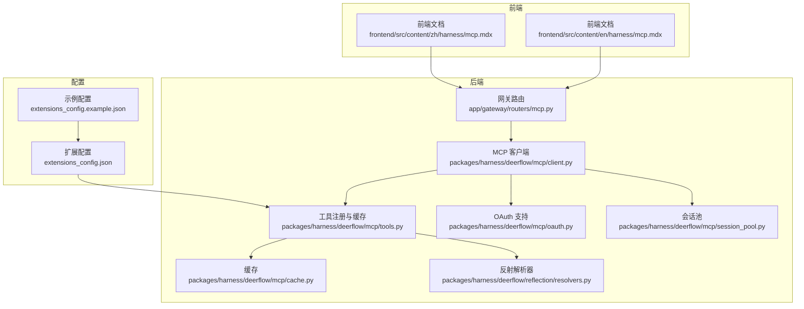
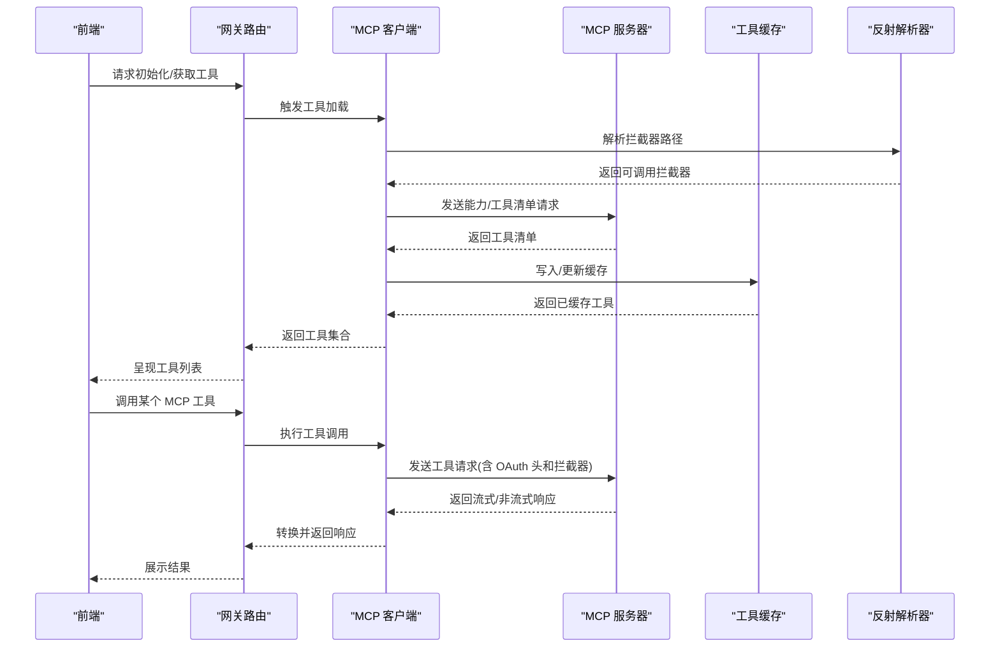
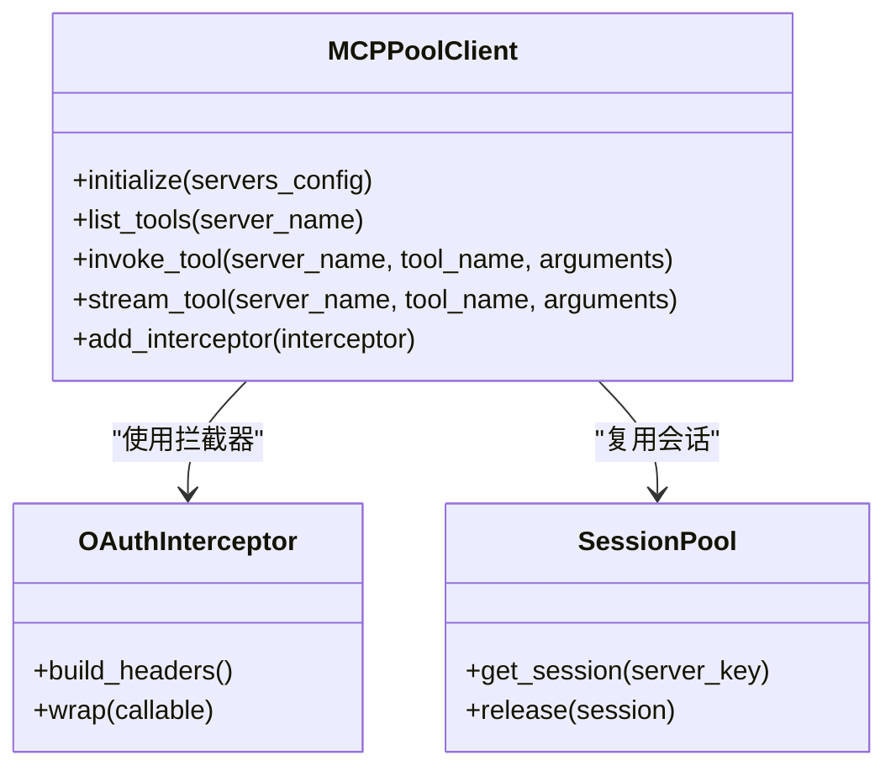
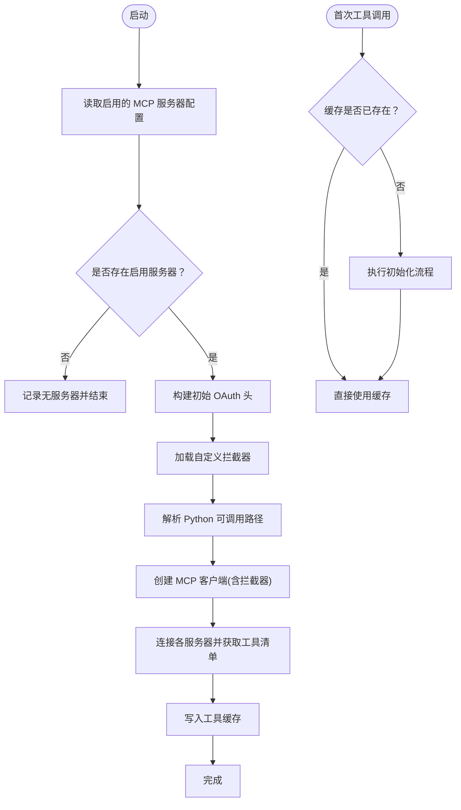
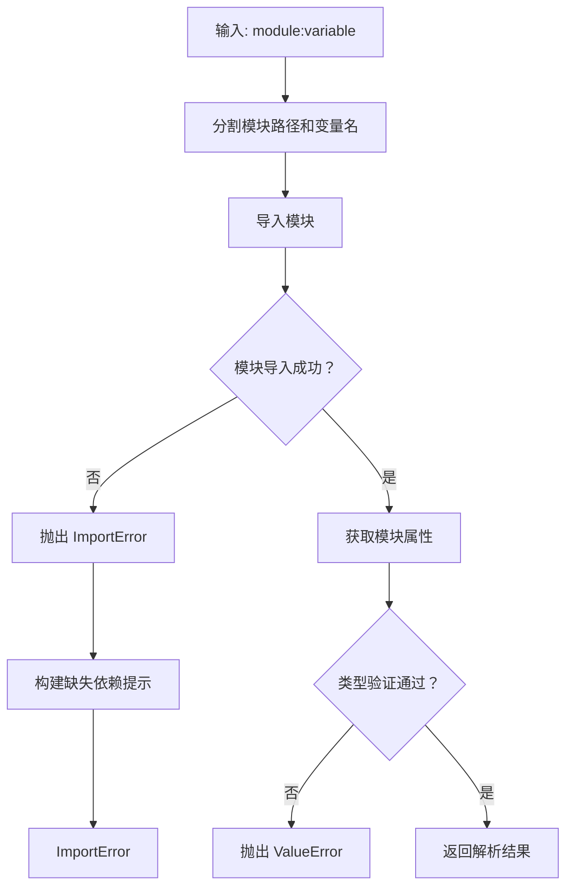
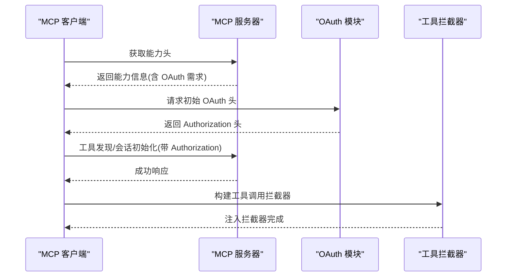
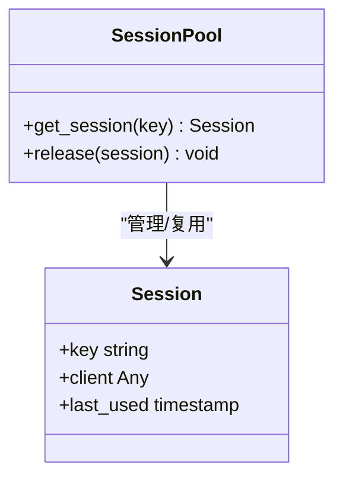
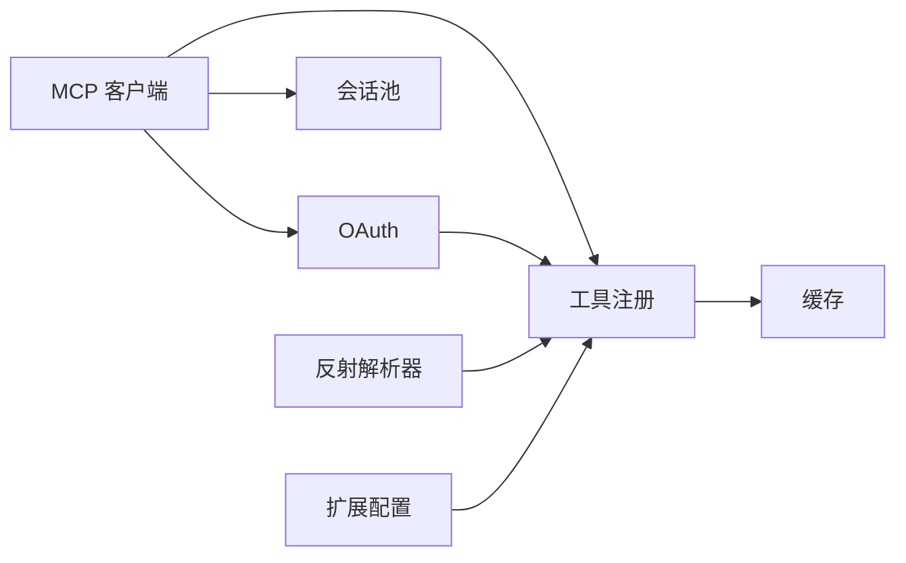

# MCP 协议实现

<cite>
**本文引用的文件**
- [backend/packages/harness/deerflow/mcp/client.py](file://backend/packages/harness/deerflow/mcp/client.py)
- [backend/packages/harness/deerflow/mcp/tools.py](file://backend/packages/harness/deerflow/mcp/tools.py)
- [backend/packages/harness/deerflow/mcp/oauth.py](file://backend/packages/harness/deerflow/mcp/oauth.py)
- [backend/packages/harness/deerflow/mcp/cache.py](file://backend/packages/harness/deerflow/mcp/cache.py)
- [backend/packages/harness/deerflow/mcp/session_pool.py](file://backend/packages/harness/deerflow/mcp/session_pool.py)
- [backend/packages/harness/deerflow/reflection/resolvers.py](file://backend/packages/harness/deerflow/reflection/resolvers.py)
- [backend/app/gateway/routers/mcp.py](file://backend/app/gateway/routers/mcp.py)
- [frontend/src/content/zh/harness/mcp.mdx](file://frontend/src/content/zh/harness/mcp.mdx)
- [frontend/src/content/en/harness/mcp.mdx](file://frontend/src/content/en/harness/mcp.mdx)
- [backend/docs/MCP_SERVER.md](file://backend/docs/MCP_SERVER.md)
- [backend/tests/test_mcp_client_config.py](file://backend/tests/test_mcp_client_config.py)
- [backend/tests/test_mcp_oauth.py](file://backend/tests/test_mcp_oauth.py)
- [backend/tests/test_mcp_session_pool.py](file://backend/tests/test_mcp_session_pool.py)
- [backend/tests/test_mcp_sync_wrapper.py](file://backend/tests/test_mcp_sync_wrapper.py)
- [backend/tests/test_mcp_custom_interceptors.py](file://backend/tests/test_mcp_custom_interceptors.py)
- [extensions_config.json](file://extensions_config.json)
- [extensions_config.example.json](file://extensions_config.example.json)
</cite>

## 更新摘要
**所做更改**
- 新增 MCP 工具拦截器扩展点章节，详细介绍自定义拦截器的配置与实现
- 更新工具注册与缓存章节，增加拦截器加载机制说明
- 新增反射解析器章节，说明 Python 可调用路径的解析机制
- 更新架构总览图，体现拦截器链路
- 新增拦截器配置示例和最佳实践

## 目录
1. [引言](#引言)
2. [项目结构](#项目结构)
3. [核心组件](#核心组件)
4. [架构总览](#架构总览)
5. [详细组件分析](#详细组件分析)
6. [依赖关系分析](#依赖关系分析)
7. [性能考虑](#性能考虑)
8. [故障排查指南](#故障排查指南)
9. [结论](#结论)
10. [附录](#附录)

## 引言
本技术文档围绕 MCP（Model Context Protocol）在 DeerFlow 中的实现进行系统化阐述，覆盖客户端实现、工具注册机制、消息传递协议、错误处理策略、握手与认证、会话管理、数据序列化方式、版本兼容性、性能优化与常见问题。文档同时结合前端集成与后端网关路由，给出可操作的实现指引与最佳实践。

**更新** 新增 MCP 工具拦截器扩展点，允许通过 extensions_config.json 声明 Python 可调用路径，实现自定义拦截器的动态加载与配置。

## 项目结构
MCP 实现主要分布在后端 harness 包与前端内容文档中，核心模块包括：
- 客户端：负责与 MCP 服务器建立连接、执行工具调用、处理流式响应与拦截器
- 工具注册：负责扫描、加载、缓存与按需检索 MCP 工具，支持拦截器链
- 认证与 OAuth：支持基于能力头的 OAuth 探测与拦截器注入
- 会话池：复用连接、减少握手开销
- 反射解析器：解析 Python 可调用路径，支持模块导入与变量解析
- 网关路由：对外暴露 MCP 相关接口，供前端与外部系统使用
- 前端文档：说明工具加载流程、缓存失效、工具搜索集成与 OAuth 支持

**图表来源**
- [backend/app/gateway/routers/mcp.py](file://backend/app/gateway/routers/mcp.py)
- [backend/packages/harness/deerflow/mcp/client.py](file://backend/packages/harness/deerflow/mcp/client.py)
- [backend/packages/harness/deerflow/mcp/tools.py](file://backend/packages/harness/deerflow/mcp/tools.py)
- [backend/packages/harness/deerflow/mcp/oauth.py](file://backend/packages/harness/deerflow/mcp/oauth.py)
- [backend/packages/harness/deerflow/mcp/cache.py](file://backend/packages/harness/deerflow/mcp/cache.py)
- [backend/packages/harness/deerflow/mcp/session_pool.py](file://backend/packages/harness/deerflow/mcp/session_pool.py)
- [backend/packages/harness/deerflow/reflection/resolvers.py](file://backend/packages/harness/deerflow/reflection/resolvers.py)
- [extensions_config.json](file://extensions_config.json)
- [extensions_config.example.json](file://extensions_config.example.json)
- [frontend/src/content/zh/harness/mcp.mdx](file://frontend/src/content/zh/harness/mcp.mdx)
- [frontend/src/content/en/harness/mcp.mdx](file://frontend/src/content/en/harness/mcp.mdx)

**章节来源**
- [backend/app/gateway/routers/mcp.py](file://backend/app/gateway/routers/mcp.py)
- [backend/packages/harness/deerflow/mcp/client.py](file://backend/packages/harness/deerflow/mcp/client.py)
- [backend/packages/harness/deerflow/mcp/tools.py](file://backend/packages/harness/deerflow/mcp/tools.py)
- [backend/packages/harness/deerflow/mcp/oauth.py](file://backend/packages/harness/deerflow/mcp/oauth.py)
- [backend/packages/harness/deerflow/mcp/cache.py](file://backend/packages/harness/deerflow/mcp/cache.py)
- [backend/packages/harness/deerflow/mcp/session_pool.py](file://backend/packages/harness/deerflow/mcp/session_pool.py)
- [backend/packages/harness/deerflow/reflection/resolvers.py](file://backend/packages/harness/deerflow/reflection/resolvers.py)
- [extensions_config.json](file://extensions_config.json)
- [extensions_config.example.json](file://extensions_config.example.json)
- [frontend/src/content/zh/harness/mcp.mdx](file://frontend/src/content/zh/harness/mcp.mdx)
- [frontend/src/content/en/harness/mcp.mdx](file://frontend/src/content/en/harness/mcp.mdx)

## 核心组件
- MCP 客户端：封装与服务器的连接、消息发送与接收、流式响应处理、拦截器链路与错误传播
- 工具注册与缓存：集中管理多服务器工具清单，支持懒加载、缓存失效、拦截器加载与按需检索
- OAuth 支持：自动探测服务器能力头中的 OAuth 需求，并注入 Authorization 头与工具拦截器
- 会话池：维护连接复用，降低握手与认证成本
- 反射解析器：解析 Python 可调用路径，支持模块导入与变量解析，用于拦截器加载
- 网关路由：提供 MCP 相关 API，协调前端与后端服务

**更新** 新增反射解析器组件，支持通过模块路径解析可调用对象，为拦截器扩展点提供基础能力。

**章节来源**
- [backend/packages/harness/deerflow/mcp/client.py](file://backend/packages/harness/deerflow/mcp/client.py)
- [backend/packages/harness/deerflow/mcp/tools.py](file://backend/packages/harness/deerflow/mcp/tools.py)
- [backend/packages/harness/deerflow/mcp/oauth.py](file://backend/packages/harness/deerflow/mcp/oauth.py)
- [backend/packages/harness/deerflow/mcp/session_pool.py](file://backend/packages/harness/deerflow/mcp/session_pool.py)
- [backend/packages/harness/deerflow/reflection/resolvers.py](file://backend/packages/harness/deerflow/reflection/resolvers.py)
- [backend/app/gateway/routers/mcp.py](file://backend/app/gateway/routers/mcp.py)

## 架构总览
下图展示了 MCP 在 DeerFlow 中的整体交互：前端通过网关路由触发初始化；后端使用 MCP 客户端连接服务器，获取工具清单并写入缓存；工具调用时根据配置决定是否启用 OAuth 拦截器与自定义拦截器，最终将结果返回给前端。

**图表来源**
- [backend/app/gateway/routers/mcp.py](file://backend/app/gateway/routers/mcp.py)
- [backend/packages/harness/deerflow/mcp/client.py](file://backend/packages/harness/deerflow/mcp/client.py)
- [backend/packages/harness/deerflow/mcp/tools.py](file://backend/packages/harness/deerflow/mcp/tools.py)
- [backend/packages/harness/deerflow/mcp/oauth.py](file://backend/packages/harness/deerflow/mcp/oauth.py)
- [backend/packages/harness/deerflow/mcp/cache.py](file://backend/packages/harness/deerflow/mcp/cache.py)
- [backend/packages/harness/deerflow/reflection/resolvers.py](file://backend/packages/harness/deerflow/reflection/resolvers.py)

## 详细组件分析

### MCP 客户端
职责与特性：
- 连接管理：支持多服务器配置，按服务器维度建立连接
- 工具调用：封装参数序列化、消息发送、响应解析与流式处理
- 拦截器链：支持在工具调用前注入 OAuth 头等中间件逻辑
- 错误处理：对网络异常、超时、服务器错误进行分类与传播
- 版本兼容：通过能力头与传输类型（如 SSE/HTTP）适配不同协议行为

**图表来源**
- [backend/packages/harness/deerflow/mcp/client.py](file://backend/packages/harness/deerflow/mcp/client.py)
- [backend/packages/harness/deerflow/mcp/oauth.py](file://backend/packages/harness/deerflow/mcp/oauth.py)
- [backend/packages/harness/deerflow/mcp/session_pool.py](file://backend/packages/harness/deerflow/mcp/session_pool.py)

**章节来源**
- [backend/packages/harness/deerflow/mcp/client.py](file://backend/packages/harness/deerflow/mcp/client.py)

### 工具注册与缓存
职责与特性：
- 初始化阶段：启动时连接已启用的 MCP 服务器，拉取工具清单并写入缓存
- 懒加载：若服务启动早于工具初始化，首次调用时触发延迟初始化
- 缓存失效：监控配置文件变更时间戳，文件改动即标记缓存过期并重新加载
- 工具可用性：加载后的工具与内置/社区工具一同出现在 Agent 工具列表中
- 工具搜索集成：可按需加载工具，避免一次性加载过多导致上下文膨胀
- **拦截器加载**：从 extensions_config.json 中读取 mcpInterceptors 配置，解析 Python 可调用路径并加载自定义拦截器

**更新** 新增拦截器加载机制，支持通过 extensions_config.json 配置自定义拦截器。

**图表来源**
- [backend/packages/harness/deerflow/mcp/tools.py](file://backend/packages/harness/deerflow/mcp/tools.py)
- [backend/packages/harness/deerflow/mcp/cache.py](file://backend/packages/harness/deerflow/mcp/cache.py)
- [backend/packages/harness/deerflow/reflection/resolvers.py](file://backend/packages/harness/deerflow/reflection/resolvers.py)

**章节来源**
- [backend/packages/harness/deerflow/mcp/tools.py](file://backend/packages/harness/deerflow/mcp/tools.py)
- [backend/packages/harness/deerflow/mcp/cache.py](file://backend/packages/harness/deerflow/mcp/cache.py)
- [backend/packages/harness/deerflow/reflection/resolvers.py](file://backend/packages/harness/deerflow/reflection/resolvers.py)
- [frontend/src/content/zh/harness/mcp.mdx](file://frontend/src/content/zh/harness/mcp.mdx)
- [frontend/src/content/en/harness/mcp.mdx](file://frontend/src/content/en/harness/mcp.mdx)

### 反射解析器
职责与特性：
- Python 可调用路径解析：支持模块路径解析，格式为 `module:variable`
- 动态导入：运行时导入指定模块并获取变量或类
- 类型验证：可选的类型检查，确保解析结果符合预期类型
- 错误处理：提供详细的导入错误提示，包括缺失依赖包的安装指导
- 拦截器支持：为 MCP 工具拦截器提供动态加载能力

**新增** 反射解析器是拦截器扩展点的核心组件，负责将字符串形式的 Python 可调用路径转换为实际的可调用对象。

**图表来源**
- [backend/packages/harness/deerflow/reflection/resolvers.py](file://backend/packages/harness/deerflow/reflection/resolvers.py)

**章节来源**
- [backend/packages/harness/deerflow/reflection/resolvers.py](file://backend/packages/harness/deerflow/reflection/resolvers.py)

### OAuth 支持与认证机制
职责与特性：
- 能力头探测：从服务器能力头中识别 OAuth 需求
- 初始认证头：为服务器连接（工具发现/会话初始化）注入 Authorization 头
- 工具拦截器：为后续工具调用构建 OAuth 拦截器，确保每次调用都携带有效凭证
- 传输适配：针对 SSE/HTTP 传输类型分别设置头部

**图表来源**
- [backend/packages/harness/deerflow/mcp/oauth.py](file://backend/packages/harness/deerflow/mcp/oauth.py)
- [backend/packages/harness/deerflow/mcp/tools.py](file://backend/packages/harness/deerflow/mcp/tools.py)

**章节来源**
- [backend/packages/harness/deerflow/mcp/oauth.py](file://backend/packages/harness/deerflow/mcp/oauth.py)
- [backend/packages/harness/deerflow/mcp/tools.py](file://backend/packages/harness/deerflow/mcp/tools.py)
- [frontend/src/content/zh/harness/mcp.mdx](file://frontend/src/content/zh/harness/mcp.mdx)
- [frontend/src/content/en/harness/mcp.mdx](file://frontend/src/content/en/harness/mcp.mdx)

### 会话池与连接复用
职责与特性：
- 会话键：按服务器标识生成唯一键，确保同一服务器共享连接
- 复用策略：优先使用现有会话，避免重复握手与认证
- 生命周期管理：在工具调用完成后释放会话，防止资源泄漏
- 性能收益：显著降低连接建立与认证开销

**图表来源**
- [backend/packages/harness/deerflow/mcp/session_pool.py](file://backend/packages/harness/deerflow/mcp/session_pool.py)

**章节来源**
- [backend/packages/harness/deerflow/mcp/session_pool.py](file://backend/packages/harness/deerflow/mcp/session_pool.py)

### 网关路由与前端集成
职责与特性：
- 对外暴露 MCP 相关 API，供前端调用以初始化工具、查询工具、执行工具
- 协调后端 MCP 客户端与工具缓存，保证一致性与性能
- 前端文档说明工具加载流程、缓存失效策略、工具搜索集成与 OAuth 支持

**章节来源**
- [backend/app/gateway/routers/mcp.py](file://backend/app/gateway/routers/mcp.py)
- [frontend/src/content/zh/harness/mcp.mdx](file://frontend/src/content/zh/harness/mcp.mdx)
- [frontend/src/content/en/harness/mcp.mdx](file://frontend/src/content/en/harness/mcp.mdx)

## 依赖关系分析
- 组件耦合：MCP 客户端依赖工具注册模块提供的服务器配置与缓存；工具注册模块依赖 OAuth 模块注入初始认证头；会话池为客户端提供连接复用能力；反射解析器为拦截器加载提供支持
- 外部依赖：MCP 服务器能力头、传输类型（SSE/HTTP）、OAuth 授权端点、Python 模块导入系统
- 兼容性：通过能力头与传输类型判断，适配不同版本与实现的 MCP 服务器

**图表来源**
- [backend/packages/harness/deerflow/mcp/client.py](file://backend/packages/harness/deerflow/mcp/client.py)
- [backend/packages/harness/deerflow/mcp/tools.py](file://backend/packages/harness/deerflow/mcp/tools.py)
- [backend/packages/harness/deerflow/mcp/oauth.py](file://backend/packages/harness/deerflow/mcp/oauth.py)
- [backend/packages/harness/deerflow/mcp/cache.py](file://backend/packages/harness/deerflow/mcp/cache.py)
- [backend/packages/harness/deerflow/mcp/session_pool.py](file://backend/packages/harness/deerflow/mcp/session_pool.py)
- [backend/packages/harness/deerflow/reflection/resolvers.py](file://backend/packages/harness/deerflow/reflection/resolvers.py)

**章节来源**
- [backend/packages/harness/deerflow/mcp/client.py](file://backend/packages/harness/deerflow/mcp/client.py)
- [backend/packages/harness/deerflow/mcp/tools.py](file://backend/packages/harness/deerflow/mcp/tools.py)
- [backend/packages/harness/deerflow/mcp/oauth.py](file://backend/packages/harness/deerflow/mcp/oauth.py)
- [backend/packages/harness/deerflow/mcp/cache.py](file://backend/packages/harness/deerflow/mcp/cache.py)
- [backend/packages/harness/deerflow/mcp/session_pool.py](file://backend/packages/harness/deerflow/mcp/session_pool.py)
- [backend/packages/harness/deerflow/reflection/resolvers.py](file://backend/packages/harness/deerflow/reflection/resolvers.py)

## 性能考虑
- 连接复用：通过会话池减少握手与认证次数，建议在高并发场景启用
- 按需加载：结合工具搜索功能，避免一次性加载全部工具导致上下文膨胀与 token 消耗
- 缓存策略：利用配置文件变更时间戳驱动缓存失效，确保服务器变更即时生效且无需重启
- 流式响应：优先采用流式传输以提升用户体验，客户端需正确处理分片与边界
- 并发控制：限制同时连接数与工具调用并发度，避免阻塞与资源争用
- **拦截器优化**：自定义拦截器应避免阻塞操作，使用异步模式处理 I/O 密集任务

**更新** 新增拦截器性能优化建议，强调异步处理和避免阻塞操作的重要性。

## 故障排查指南
- 工具未显示：检查服务器配置是否启用、能力头是否包含 OAuth 需求、缓存是否过期
- 认证失败：确认 OAuth 头是否正确注入、授权端点是否可达、令牌是否过期
- 连接异常：查看会话池状态、网络连通性、服务器负载与超时设置
- 流式响应中断：验证传输类型与服务器实现、客户端缓冲区大小与解码逻辑
- 性能瓶颈：评估并发度、缓存命中率、连接复用率与工具搜索开关
- **拦截器问题**：检查 extensions_config.json 中的 mcpInterceptors 配置格式、Python 可调用路径是否正确、拦截器返回值是否为可调用对象

**更新** 新增拦截器相关故障排查指导。

**章节来源**
- [backend/tests/test_mcp_oauth.py](file://backend/tests/test_mcp_oauth.py)
- [backend/tests/test_mcp_session_pool.py](file://backend/tests/test_mcp_session_pool.py)
- [backend/tests/test_mcp_sync_wrapper.py](file://backend/tests/test_mcp_sync_wrapper.py)
- [backend/tests/test_mcp_custom_interceptors.py](file://backend/tests/test_mcp_custom_interceptors.py)

## 结论
MCP 在 DeerFlow 中通过"客户端 + 工具注册 + OAuth + 会话池 + 拦截器扩展"的组合实现了高可用、高性能与易扩展的工具接入能力。前端文档与网关路由进一步降低了集成门槛，配合缓存与按需加载策略，可在复杂场景下保持良好的响应速度与稳定性。新增的拦截器扩展点为系统提供了强大的定制能力，支持通过配置文件动态加载自定义拦截器，满足各种业务需求。

**更新** 新增拦截器扩展点显著提升了系统的灵活性和可扩展性，为开发者提供了更多定制化选项。

## 附录
- 协议版本兼容性：通过能力头与传输类型判断，适配不同版本与实现
- 数据序列化：遵循 MCP 规范的消息格式，客户端负责参数序列化与响应解析
- 会话管理：统一的会话键与生命周期管理，确保资源安全与高效复用
- 文档与测试：参考前端文档与后端测试用例，快速定位问题与验证修复
- **拦截器配置示例**：参考 extensions_config.example.json 中的 mcpInterceptors 字段配置
- **反射解析器使用**：支持模块路径解析，格式为 `module:variable`，用于拦截器和其他扩展功能

**更新** 新增拦截器配置示例和反射解析器使用说明。

**章节来源**
- [backend/docs/MCP_SERVER.md](file://backend/docs/MCP_SERVER.md)
- [backend/tests/test_mcp_client_config.py](file://backend/tests/test_mcp_client_config.py)
- [extensions_config.json](file://extensions_config.json)
- [extensions_config.example.json](file://extensions_config.example.json)
- [frontend/src/content/zh/harness/mcp.mdx](file://frontend/src/content/zh/harness/mcp.mdx)
- [frontend/src/content/en/harness/mcp.mdx](file://frontend/src/content/en/harness/mcp.mdx)