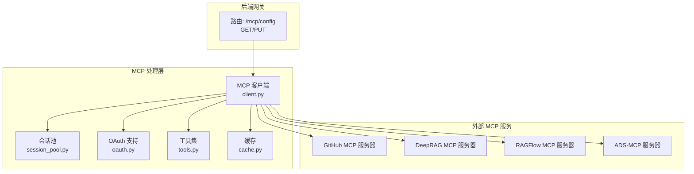
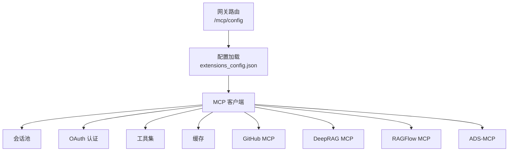
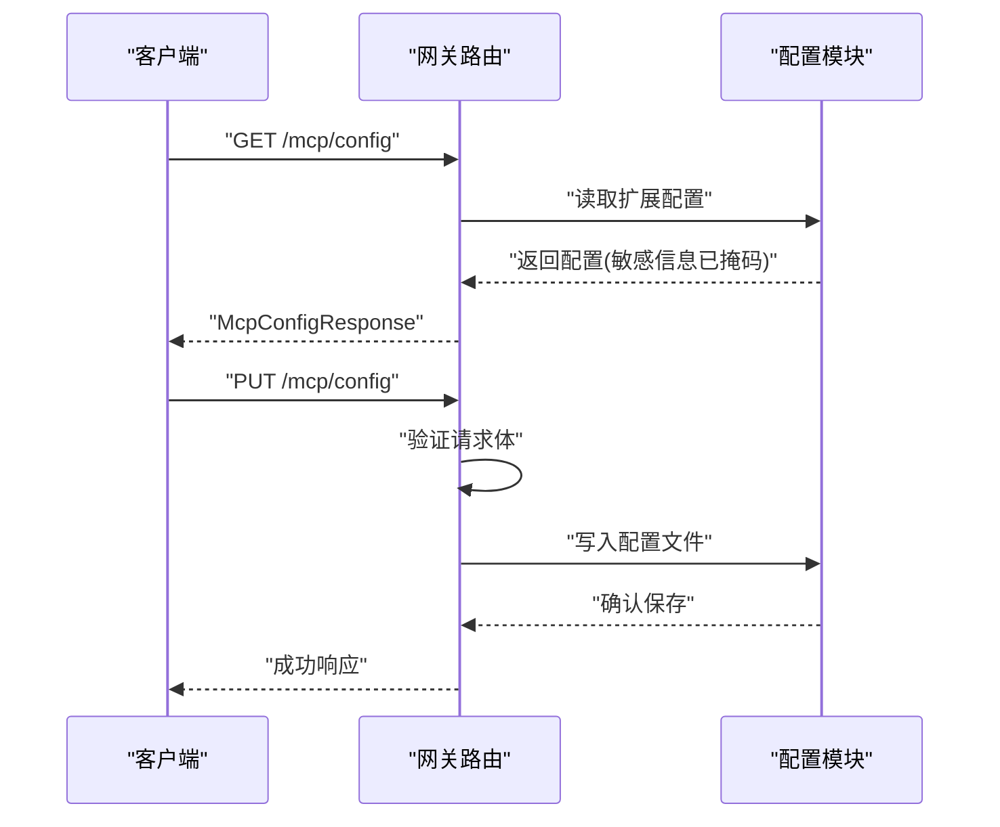
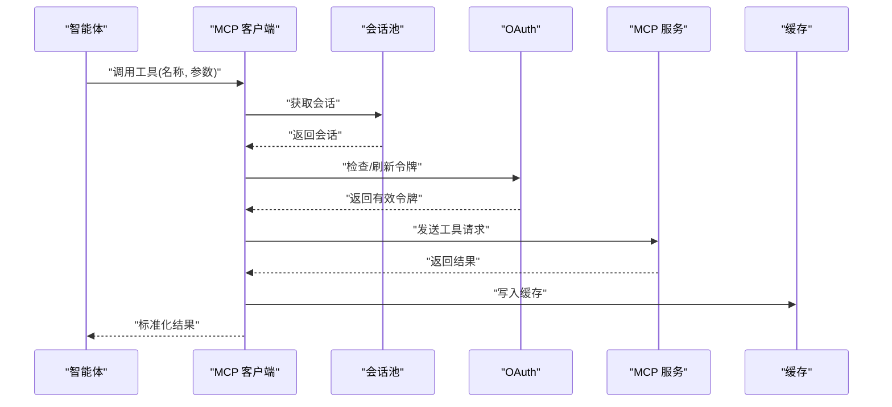
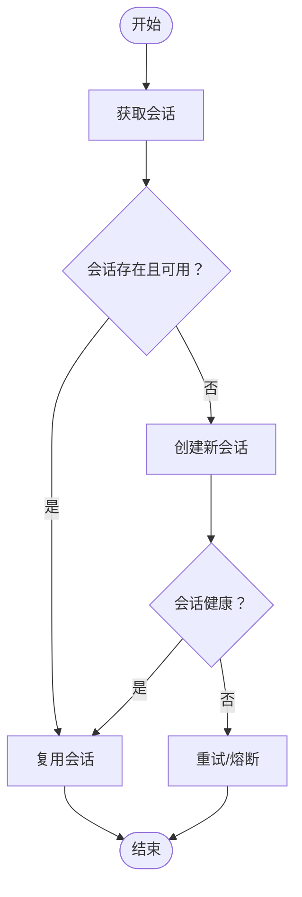
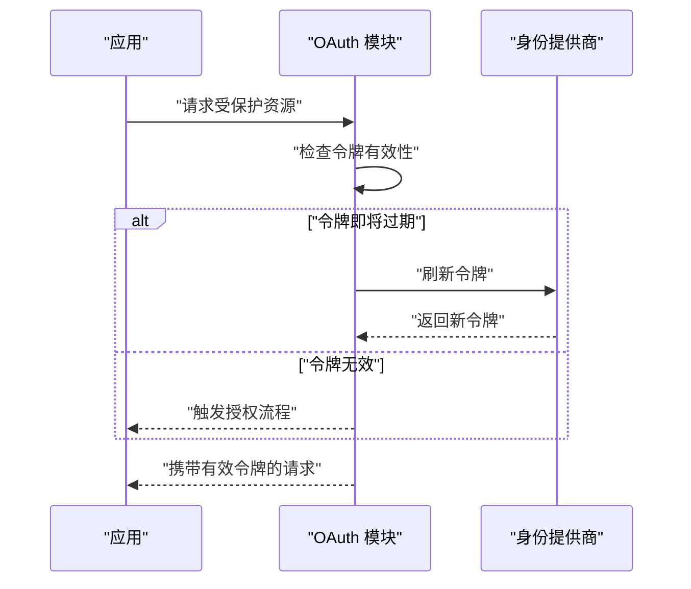
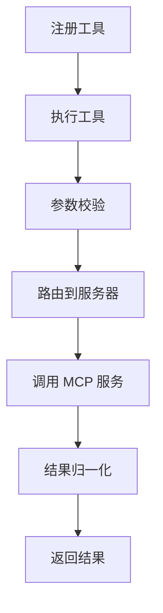
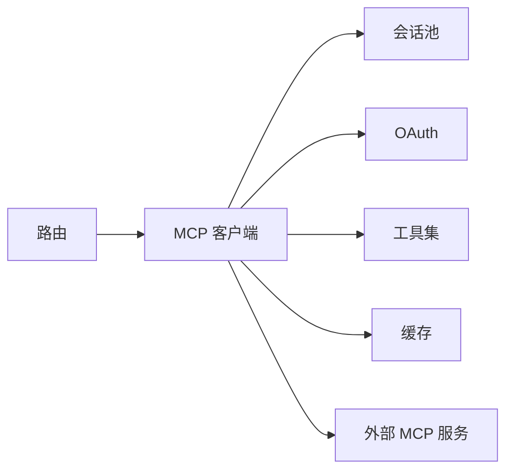

# MCP 服务器

<cite>
**本文档引用的文件**
- [backend/app/gateway/routers/mcp.py](file://backend/app/gateway/routers/mcp.py)
- [backend/docs/MCP_SERVER.md](file://backend/docs/MCP_SERVER.md)
- [backend/docs/ARCHITECTURE.md](file://backend/docs/ARCHITECTURE.md)
- [backend/packages/harness/deerflow/mcp/__init__.py](file://backend/packages/harness/deerflow/mcp/__init__.py)
- [backend/packages/harness/deerflow/mcp/cache.py](file://backend/packages/harness/deerflow/mcp/cache.py)
- [backend/packages/harness/deerflow/mcp/client.py](file://backend/packages/harness/deerflow/mcp/client.py)
- [backend/packages/harness/deerflow/mcp/oauth.py](file://backend/packages/harness/deerflow/mcp/oauth.py)
- [backend/packages/harness/deerflow/mcp/session_pool.py](file://backend/packages/harness/deerflow/mcp/session_pool.py)
- [backend/packages/harness/deerflow/mcp/tools.py](file://backend/packages/harness/deerflow/mcp/tools.py)
- [docs/mcp/ADS-MCP对接DeerFlow整合指南-实测版.md](file://docs/mcp/ADS-MCP对接DeerFlow整合指南-实测版.md)
- [docs/mcp/DeepRAG_MCP对接DeerFlow整合指南.md](file://docs/mcp/DeepRAG_MCP对接DeerFlow整合指南.md)
- [docs/mcp/RAGFLOW_MCP_INTEGRATION.md](file://docs/mcp/RAGFLOW_MCP_INTEGRATION.md)
- [backend/.ads-mcp/config.json](file://backend/.ads-mcp/config.json)
</cite>

## 目录
1. [简介](#简介)
2. [项目结构](#项目结构)
3. [核心组件](#核心组件)
4. [架构总览](#架构总览)
5. [详细组件分析](#详细组件分析)
6. [依赖关系分析](#依赖关系分析)
7. [性能考量](#性能考量)
8. [故障排除指南](#故障排除指南)
9. [结论](#结论)
10. [附录](#附录)

## 简介
本文件面向开发者，系统性介绍 DeerFlow MCP 服务器的实现与集成方案。内容涵盖 MCP 协议在 DeerFlow 中的架构设计、工具注册机制、会话管理策略以及 OAuth 集成；同时提供 ADS-MCP、DeepRAG、RAGFlow 等第三方服务的集成方法与配置指南，并给出自定义 MCP 适配器的开发要点（协议实现、错误处理、性能优化与安全考虑），辅以集成示例、配置模板与调试技巧，帮助将外部工具与服务无缝接入 DeerFlow 智能体框架。

## 项目结构
MCP 能力主要由后端网关路由与 harness 包中的 MCP 子模块共同实现，文档与示例位于 docs/mcp 目录，第三方 MCP 服务的配置样例位于 backend/.ads-mcp/。

- 后端网关路由：提供 MCP 配置的查询与更新接口，负责对外暴露 MCP 服务器列表与状态。
- MCP harness 包：封装多服务器客户端、缓存、OAuth、会话池与工具集，支撑 MCP 协议交互。
- 文档与示例：包含 MCP 服务器文档、架构说明以及针对不同 MCP 服务的对接指南。

图表来源
- [backend/app/gateway/routers/mcp.py:159-199](file://backend/app/gateway/routers/mcp.py#L159-L199)
- [backend/packages/harness/deerflow/mcp/client.py](file://backend/packages/harness/deerflow/mcp/client.py)
- [backend/packages/harness/deerflow/mcp/session_pool.py](file://backend/packages/harness/deerflow/mcp/session_pool.py)
- [backend/packages/harness/deerflow/mcp/oauth.py](file://backend/packages/harness/deerflow/mcp/oauth.py)
- [backend/packages/harness/deerflow/mcp/tools.py](file://backend/packages/harness/deerflow/mcp/tools.py)
- [backend/packages/harness/deerflow/mcp/cache.py](file://backend/packages/harness/deerflow/mcp/cache.py)

章节来源
- [backend/app/gateway/routers/mcp.py:159-199](file://backend/app/gateway/routers/mcp.py#L159-L199)
- [backend/docs/ARCHITECTURE.md:267-303](file://backend/docs/ARCHITECTURE.md#L267-L303)

## 核心组件
- 路由与配置管理
  - 提供 GET /mcp/config 获取当前 MCP 服务器配置（含启用状态、命令、参数、环境变量等）。
  - 提供 PUT /mcp/config 更新 MCP 服务器配置并持久化。
- MCP 客户端
  - 封装多服务器客户端能力，支持多种传输方式（stdio/SSE/HTTP）。
  - 统一工具调用入口，屏蔽底层差异。
- 会话池
  - 管理会话生命周期，复用连接，降低冷启动成本。
- OAuth 集成
  - 提供认证令牌管理与刷新机制，保障对受保护资源的安全访问。
- 工具集
  - 定义工具注册与执行流程，支持参数校验与结果归一化。
- 缓存
  - 提供响应缓存与失效策略，提升重复请求性能。

章节来源
- [backend/app/gateway/routers/mcp.py:159-199](file://backend/app/gateway/routers/mcp.py#L159-L199)
- [backend/packages/harness/deerflow/mcp/client.py](file://backend/packages/harness/deerflow/mcp/client.py)
- [backend/packages/harness/deerflow/mcp/session_pool.py](file://backend/packages/harness/deerflow/mcp/session_pool.py)
- [backend/packages/harness/deerflow/mcp/oauth.py](file://backend/packages/harness/deerflow/mcp/oauth.py)
- [backend/packages/harness/deerflow/mcp/tools.py](file://backend/packages/harness/deerflow/mcp/tools.py)
- [backend/packages/harness/deerflow/mcp/cache.py](file://backend/packages/harness/deerflow/mcp/cache.py)

## 架构总览
下图展示了 MCP 在 DeerFlow 中的整体架构：网关路由负责配置下发与更新，MCP 客户端通过多服务器适配器统一调用各类 MCP 服务，会话池与 OAuth 提升稳定性与安全性，缓存与工具集完善性能与功能边界。

图表来源
- [backend/docs/ARCHITECTURE.md:267-303](file://backend/docs/ARCHITECTURE.md#L267-L303)
- [backend/app/gateway/routers/mcp.py:159-199](file://backend/app/gateway/routers/mcp.py#L159-L199)
- [backend/packages/harness/deerflow/mcp/client.py](file://backend/packages/harness/deerflow/mcp/client.py)

## 详细组件分析

### 路由与配置管理
- GET /mcp/config
  - 功能：返回当前 MCP 服务器配置集合，内部会对敏感字段进行掩码处理后再返回。
  - 返回类型：McpConfigResponse，包含 mcp_servers 字段。
- PUT /mcp/config
  - 功能：接收 McpConfigUpdateRequest，更新配置并保存至配置文件。
  - 注意：更新后需确保相关 MCP 服务进程按新配置重启或热重载。

图表来源
- [backend/app/gateway/routers/mcp.py:159-199](file://backend/app/gateway/routers/mcp.py#L159-L199)

章节来源
- [backend/app/gateway/routers/mcp.py:159-199](file://backend/app/gateway/routers/mcp.py#L159-L199)

### MCP 客户端与多服务器适配
- 多服务器客户端职责
  - 统一管理多个 MCP 服务器实例，按名称路由工具调用。
  - 支持不同传输方式（stdio/SSE/HTTP），自动选择与切换。
- 工具调用流程
  - 解析工具名与参数，定位目标服务器。
  - 通过会话池获取可用会话，必要时触发 OAuth 刷新。
  - 执行工具并返回标准化结果，同时写入缓存。

图表来源
- [backend/packages/harness/deerflow/mcp/client.py](file://backend/packages/harness/deerflow/mcp/client.py)
- [backend/packages/harness/deerflow/mcp/session_pool.py](file://backend/packages/harness/deerflow/mcp/session_pool.py)
- [backend/packages/harness/deerflow/mcp/oauth.py](file://backend/packages/harness/deerflow/mcp/oauth.py)
- [backend/packages/harness/deerflow/mcp/cache.py](file://backend/packages/harness/deerflow/mcp/cache.py)

章节来源
- [backend/packages/harness/deerflow/mcp/client.py](file://backend/packages/harness/deerflow/mcp/client.py)
- [backend/packages/harness/deerflow/mcp/session_pool.py](file://backend/packages/harness/deerflow/mcp/session_pool.py)
- [backend/packages/harness/deerflow/mcp/oauth.py](file://backend/packages/harness/deerflow/mcp/oauth.py)
- [backend/packages/harness/deerflow/mcp/cache.py](file://backend/packages/harness/deerflow/mcp/cache.py)

### 会话管理策略
- 生命周期管理
  - 创建：首次调用某服务器工具时建立会话。
  - 复用：在一定时间窗口内复用会话，减少握手开销。
  - 清理：超时或错误后回收会话，避免资源泄漏。
- 并发控制
  - 限制同一服务器并发会话数量，防止过载。
  - 对失败会话进行退避重试与熔断处理。
- 状态监控
  - 记录会话健康度指标，异常时自动降级或切换备用服务器。

图表来源
- [backend/packages/harness/deerflow/mcp/session_pool.py](file://backend/packages/harness/deerflow/mcp/session_pool.py)

章节来源
- [backend/packages/harness/deerflow/mcp/session_pool.py](file://backend/packages/harness/deerflow/mcp/session_pool.py)

### OAuth 集成方案
- 令牌管理
  - 从配置或环境变量加载初始令牌。
  - 在请求前检查令牌有效期，必要时触发刷新。
- 刷新策略
  - 支持静默刷新与交互式授权两种模式。
  - 刷新失败时回退到离线模式或提示用户重新授权。
- 安全措施
  - 敏感令牌不落盘或仅以最小权限写入临时目录。
  - 使用短生命周期令牌与刷新令牌组合，降低泄露风险。

图表来源
- [backend/packages/harness/deerflow/mcp/oauth.py](file://backend/packages/harness/deerflow/mcp/oauth.py)

章节来源
- [backend/packages/harness/deerflow/mcp/oauth.py](file://backend/packages/harness/deerflow/mcp/oauth.py)

### 工具注册与执行
- 注册机制
  - 通过工具集模块集中注册工具元数据（名称、描述、参数、权限等）。
  - 支持动态加载与卸载工具，便于灰度与回滚。
- 执行流程
  - 参数校验与默认值填充。
  - 路由到对应 MCP 服务器，执行工具并归一化输出。
  - 错误捕获与重试策略，保证调用稳定性。

图表来源
- [backend/packages/harness/deerflow/mcp/tools.py](file://backend/packages/harness/deerflow/mcp/tools.py)

章节来源
- [backend/packages/harness/deerflow/mcp/tools.py](file://backend/packages/harness/deerflow/mcp/tools.py)

### 第三方服务集成指南

#### ADS-MCP 集成
- 配置位置
  - 配置文件位于 backend/.ads-mcp/config.json，包含服务地址、鉴权参数等。
- 集成步骤
  - 在 MCP 配置中添加 ADS-MCP 服务器条目，设置命令、参数与环境变量。
  - 确保环境变量（如令牌）正确注入并在运行时可见。
  - 通过网关路由验证配置生效并可连通。
- 参考文档
  - docs/mcp/ADS-MCP对接DeerFlow整合指南-实测版.md

章节来源
- [backend/.ads-mcp/config.json](file://backend/.ads-mcp/config.json)
- [docs/mcp/ADS-MCP对接DeerFlow整合指南-实测版.md](file://docs/mcp/ADS-MCP对接DeerFlow整合指南-实测版.md)

#### DeepRAG 集成
- 集成要点
  - 在 MCP 配置中声明 DeepRAG 服务器，指定传输方式与端点。
  - 如涉及外部检索或向量化服务，确保网络可达与防火墙放行。
- 参考文档
  - docs/mcp/DeepRAG_MCP对接DeerFlow整合指南.md

章节来源
- [docs/mcp/DeepRAG_MCP对接DeerFlow整合指南.md](file://docs/mcp/DeepRAG_MCP对接DeerFlow整合指南.md)

#### RAGFlow 集成
- 集成要点
  - 在 MCP 配置中添加 RAGFlow 服务器项，配置鉴权与传输参数。
  - 关注大模型调用的超时与限流策略，避免阻塞主流程。
- 参考文档
  - docs/mcp/RAGFLOW_MCP_INTEGRATION.md

章节来源
- [docs/mcp/RAGFLOW_MCP_INTEGRATION.md](file://docs/mcp/RAGFLOW_MCP_INTEGRATION.md)

## 依赖关系分析
- 组件耦合
  - 网关路由仅依赖配置模块与 MCP 客户端，保持低耦合。
  - MCP 客户端聚合会话池、OAuth、工具集与缓存，形成高内聚的功能单元。
- 外部依赖
  - MCP 服务器通过标准传输协议（stdio/SSE/HTTP）接入，便于替换与扩展。
  - 第三方服务的变更主要体现在配置层面，对核心逻辑影响有限。

图表来源
- [backend/app/gateway/routers/mcp.py:159-199](file://backend/app/gateway/routers/mcp.py#L159-L199)
- [backend/packages/harness/deerflow/mcp/client.py](file://backend/packages/harness/deerflow/mcp/client.py)

章节来源
- [backend/app/gateway/routers/mcp.py:159-199](file://backend/app/gateway/routers/mcp.py#L159-L199)
- [backend/packages/harness/deerflow/mcp/client.py](file://backend/packages/harness/deerflow/mcp/client.py)

## 性能考量
- 会话复用与预热
  - 通过会话池减少连接建立与握手开销，建议在空闲时段预热常用服务器。
- 缓存策略
  - 对高频、低变化的工具结果进行缓存，设置合理 TTL 与失效策略。
- 超时与重试
  - 为外部 MCP 服务设置分层超时（连接、读取、写入），结合指数退避与最大重试次数。
- 并发与限流
  - 控制单服务器并发数与全局 QPS，避免下游拥塞。
- 监控与告警
  - 建立延迟、错误率、会话存活率等指标，及时发现性能瓶颈。

## 故障排除指南
- 常见问题
  - 配置未生效：检查网关路由返回的配置是否与预期一致，确认敏感字段掩码不影响业务判断。
  - 会话异常：查看会话池日志，确认是否存在频繁创建/销毁或超时回收。
  - OAuth 失败：核对令牌有效期与刷新流程，检查网络连通性与身份提供商状态。
  - 工具执行错误：检查工具参数、权限与返回格式，必要时开启详细日志。
- 调试技巧
  - 使用网关路由的配置接口进行最小化验证，逐步增加复杂度。
  - 为每个 MCP 服务器单独配置日志级别，区分不同服务的问题域。
  - 在本地模拟第三方服务端点，验证客户端行为与错误处理。

章节来源
- [backend/app/gateway/routers/mcp.py:159-199](file://backend/app/gateway/routers/mcp.py#L159-L199)
- [backend/packages/harness/deerflow/mcp/session_pool.py](file://backend/packages/harness/deerflow/mcp/session_pool.py)
- [backend/packages/harness/deerflow/mcp/oauth.py](file://backend/packages/harness/deerflow/mcp/oauth.py)
- [backend/packages/harness/deerflow/mcp/tools.py](file://backend/packages/harness/deerflow/mcp/tools.py)

## 结论
DeerFlow 的 MCP 服务器通过清晰的路由与配置管理、稳健的多服务器客户端、完善的会话与 OAuth 支持，以及可扩展的工具与缓存机制，实现了对多种 MCP 服务的统一接入。配合 ADS-MCP、DeepRAG、RAGFlow 等第三方服务的集成指南，开发者可以快速、安全地将外部工具与能力融入智能体工作流。建议在生产环境中重视性能优化、监控告警与安全策略，持续迭代以满足复杂场景需求。

## 附录
- 快速开始
  - 通过网关路由查询与更新 MCP 配置。
  - 在 MCP 配置中添加目标服务器条目并注入必要环境变量。
  - 使用工具集注册所需工具，验证调用链路与返回结果。
- 参考文档
  - backend/docs/MCP_SERVER.md：MCP 服务器总体说明。
  - backend/docs/ARCHITECTURE.md：系统架构与 MCP 集成说明。

章节来源
- [backend/docs/MCP_SERVER.md](file://backend/docs/MCP_SERVER.md)
- [backend/docs/ARCHITECTURE.md:267-303](file://backend/docs/ARCHITECTURE.md#L267-L303)