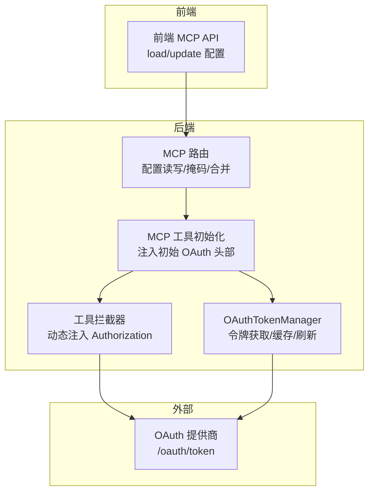
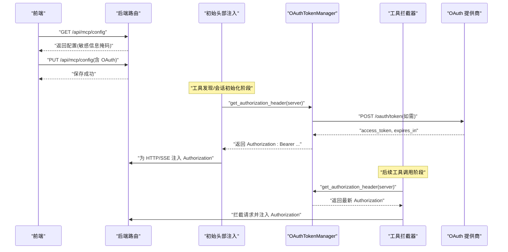
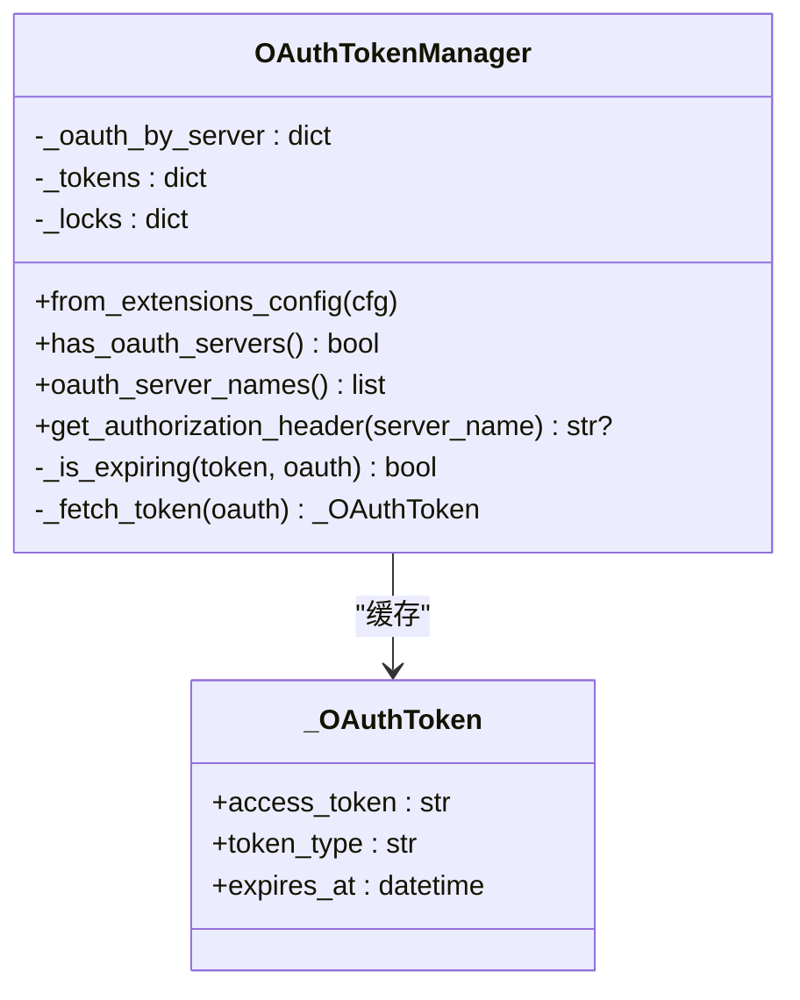
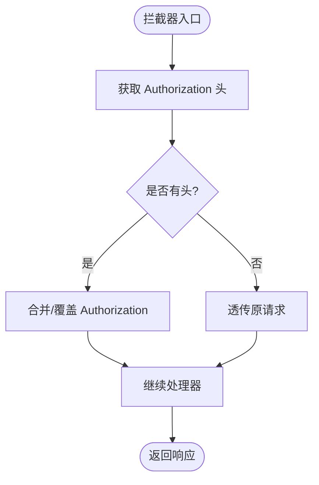
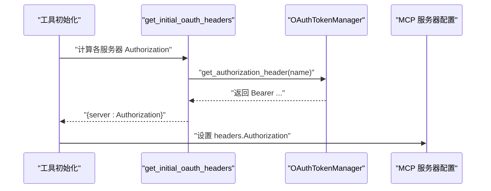
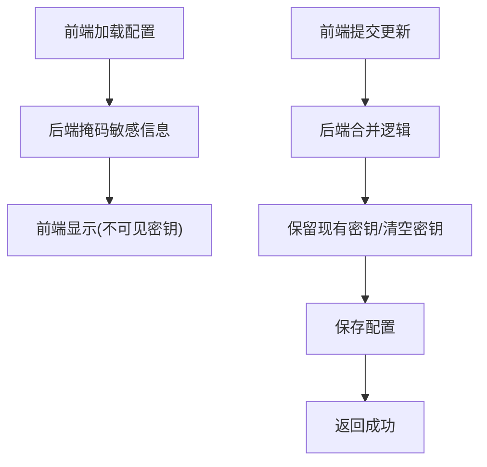
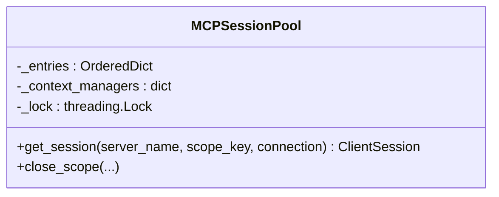
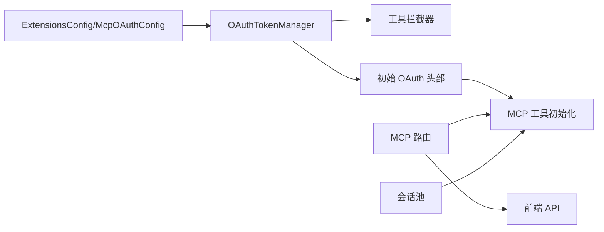

# OAuth 集成

<cite>
**本文引用的文件**
- [backend/packages/harness/deerflow/mcp/oauth.py](file://backend/packages/harness/deerflow/mcp/oauth.py)
- [backend/tests/test_mcp_oauth.py](file://backend/tests/test_mcp_oauth.py)
- [backend/packages/harness/deerflow/mcp/tools.py](file://backend/packages/harness/deerflow/mcp/tools.py)
- [backend/app/gateway/routers/mcp.py](file://backend/app/gateway/routers/mcp.py)
- [frontend/src/core/mcp/api.ts](file://frontend/src/core/mcp/api.ts)
- [frontend/src/core/mcp/hooks.ts](file://frontend/src/core/mcp/hooks.ts)
- [frontend/src/core/api/fetcher.ts](file://frontend/src/core/api/fetcher.ts)
- [backend/packages/harness/deerflow/mcp/session_pool.py](file://backend/packages/harness/deerflow/mcp/session_pool.py)
- [scripts/export_claude_code_oauth.py](file://scripts/export_claude_code_oauth.py)
- [backend/packages/harness/deerflow/models/credential_loader.py](file://backend/packages/harness/deerflow/models/credential_loader.py)
</cite>

## 目录
1. [简介](#简介)
2. [项目结构](#项目结构)
3. [核心组件](#核心组件)
4. [架构总览](#架构总览)
5. [组件详解](#组件详解)
6. [依赖关系分析](#依赖关系分析)
7. [性能考量](#性能考量)
8. [故障排查指南](#故障排查指南)
9. [结论](#结论)
10. [附录](#附录)

## 简介
本技术文档面向 MCP（Model Context Protocol）环境下的 OAuth 2.0 与 OpenID Connect 集成，聚焦于授权流程、令牌管理、刷新机制与安全策略。文档覆盖从后端令牌管理器到前端配置接口、从工具拦截器到会话池的全链路实现，并提供配置示例、集成步骤、错误处理与调试技巧，帮助在 MCP 生态中安全、稳定地使用外部 OAuth 提供商。

## 项目结构
围绕 OAuth 的关键代码分布在以下模块：
- 后端 MCP OAuth 核心：令牌管理、拦截器、初始头部注入
- 前端 MCP 配置接口：加载与更新 MCP 服务器配置
- 后端 MCP 配置路由：敏感信息掩码与合并逻辑
- 会话池：状态化 MCP 工具调用的持久会话管理
- 凭据导出与加载：从系统密钥链或文件读取访问令牌

图表来源
- [backend/packages/harness/deerflow/mcp/oauth.py:25-150](file://backend/packages/harness/deerflow/mcp/oauth.py#L25-L150)
- [backend/packages/harness/deerflow/mcp/tools.py:197-218](file://backend/packages/harness/deerflow/mcp/tools.py#L197-L218)
- [backend/app/gateway/routers/mcp.py:34-98](file://backend/app/gateway/routers/mcp.py#L34-L98)
- [frontend/src/core/mcp/api.ts:1-20](file://frontend/src/core/mcp/api.ts#L1-L20)

章节来源
- [backend/packages/harness/deerflow/mcp/oauth.py:1-150](file://backend/packages/harness/deerflow/mcp/oauth.py#L1-L150)
- [backend/packages/harness/deerflow/mcp/tools.py:197-218](file://backend/packages/harness/deerflow/mcp/tools.py#L197-L218)
- [backend/app/gateway/routers/mcp.py:34-98](file://backend/app/gateway/routers/mcp.py#L34-L98)
- [frontend/src/core/mcp/api.ts:1-20](file://frontend/src/core/mcp/api.ts#L1-L20)

## 核心组件
- OAuthTokenManager：负责按服务器维度获取、缓存与刷新访问令牌；支持并发锁避免重复拉取；支持客户端凭证与刷新令牌两种授权类型；支持自定义字段映射与过期偏移。
- build_oauth_tool_interceptor：构建工具调用拦截器，在每次请求前注入最新的 Authorization 头。
- get_initial_oauth_headers：启动时为 HTTP/SSE 连接预取并注入 Authorization 头。
- MCP 配置路由与前端接口：提供 MCP 服务器配置的读取、更新与敏感信息掩码；合并时保留现有密钥。
- 会话池：为状态化 MCP 服务维护持久会话，提升工具复用效率。
- 凭据导出与加载：从系统密钥链或本地文件读取访问令牌，支持安全存储。

章节来源
- [backend/packages/harness/deerflow/mcp/oauth.py:25-150](file://backend/packages/harness/deerflow/mcp/oauth.py#L25-L150)
- [backend/packages/harness/deerflow/mcp/tools.py:197-218](file://backend/packages/harness/deerflow/mcp/tools.py#L197-L218)
- [backend/app/gateway/routers/mcp.py:34-98](file://backend/app/gateway/routers/mcp.py#L34-L98)
- [backend/packages/harness/deerflow/mcp/session_pool.py:26-105](file://backend/packages/harness/deerflow/mcp/session_pool.py#L26-L105)
- [scripts/export_claude_code_oauth.py:51-90](file://scripts/export_claude_code_oauth.py#L51-L90)
- [backend/packages/harness/deerflow/models/credential_loader.py:88-133](file://backend/packages/harness/deerflow/models/credential_loader.py#L88-L133)

## 架构总览
下图展示从前端到后端再到 OAuth 提供商的整体流程，以及工具拦截器与初始头部注入的关键节点。

图表来源
- [backend/packages/harness/deerflow/mcp/tools.py:197-218](file://backend/packages/harness/deerflow/mcp/tools.py#L197-L218)
- [backend/packages/harness/deerflow/mcp/oauth.py:47-119](file://backend/packages/harness/deerflow/mcp/oauth.py#L47-L119)
- [backend/app/gateway/routers/mcp.py:69-98](file://backend/app/gateway/routers/mcp.py#L69-L98)

## 组件详解

### OAuthTokenManager：令牌获取、缓存与刷新
- 按服务器名维护独立令牌与互斥锁，避免并发重复拉取。
- 刷新判定基于当前时间与过期偏移（refresh_skew_seconds），支持提前刷新。
- 支持的授权类型：
  - 客户端凭证：需要 client_id 与 client_secret。
  - 刷新令牌：需要 refresh_token；可选 client_id/client_secret。
- 字段映射：token_field、token_type_field、expires_in_field 可自定义，默认值见实现。
- 异常处理：缺失必要参数或响应字段时抛出明确错误。

图表来源
- [backend/packages/harness/deerflow/mcp/oauth.py:16-119](file://backend/packages/harness/deerflow/mcp/oauth.py#L16-L119)

章节来源
- [backend/packages/harness/deerflow/mcp/oauth.py:25-119](file://backend/packages/harness/deerflow/mcp/oauth.py#L25-L119)

### 工具拦截器：动态注入 Authorization
- 在工具调用前，根据 server_name 获取最新 Authorization 头并注入。
- 若无 OAuth 配置则直接透传。

图表来源
- [backend/packages/harness/deerflow/mcp/oauth.py:122-137](file://backend/packages/harness/deerflow/mcp/oauth.py#L122-L137)

章节来源
- [backend/packages/harness/deerflow/mcp/oauth.py:122-137](file://backend/packages/harness/deerflow/mcp/oauth.py#L122-L137)

### 初始 OAuth 头部注入：连接建立阶段
- 在工具发现与会话初始化阶段，为 HTTP/SSE 服务器注入 Authorization。
- 将每个启用 OAuth 的服务器对应的 Authorization 写入其 headers 字段。

图表来源
- [backend/packages/harness/deerflow/mcp/tools.py:205-214](file://backend/packages/harness/deerflow/mcp/tools.py#L205-L214)
- [backend/packages/harness/deerflow/mcp/oauth.py:140-150](file://backend/packages/harness/deerflow/mcp/oauth.py#L140-L150)

章节来源
- [backend/packages/harness/deerflow/mcp/tools.py:197-218](file://backend/packages/harness/deerflow/mcp/tools.py#L197-L218)
- [backend/packages/harness/deerflow/mcp/oauth.py:140-150](file://backend/packages/harness/deerflow/mcp/oauth.py#L140-L150)

### MCP 配置路由与前端交互
- GET 返回配置时对敏感字段进行掩码（环境变量、头部、OAuth 密钥）。
- PUT 更新配置时保留已有密钥，支持“***”占位符恢复旧值，空字符串清空密钥。
- 前端提供加载与更新接口，配合 CSRF 保护与跨域携带 Cookie。

图表来源
- [backend/app/gateway/routers/mcp.py:69-98](file://backend/app/gateway/routers/mcp.py#L69-L98)
- [frontend/src/core/mcp/api.ts:1-20](file://frontend/src/core/mcp/api.ts#L1-L20)
- [frontend/src/core/mcp/hooks.ts:1-44](file://frontend/src/core/mcp/hooks.ts#L1-L44)

章节来源
- [backend/app/gateway/routers/mcp.py:34-98](file://backend/app/gateway/routers/mcp.py#L34-L98)
- [frontend/src/core/mcp/api.ts:1-20](file://frontend/src/core/mcp/api.ts#L1-L20)
- [frontend/src/core/mcp/hooks.ts:1-44](file://frontend/src/core/mcp/hooks.ts#L1-L44)

### 会话池：状态化 MCP 工具的持久会话
- 以 (server_name, scope_key) 为键维护持久会话，支持 LRU 淘汰。
- 跨事件循环场景自动关闭旧会话并重建，保证线程安全。

图表来源
- [backend/packages/harness/deerflow/mcp/session_pool.py:26-105](file://backend/packages/harness/deerflow/mcp/session_pool.py#L26-L105)

章节来源
- [backend/packages/harness/deerflow/mcp/session_pool.py:26-105](file://backend/packages/harness/deerflow/mcp/session_pool.py#L26-L105)

### 凭据存储与传输：安全实践
- 系统密钥链导出：macOS Keychain 中读取 Claude Code 凭据，解析 JSON 并提取 accessToken。
- 文件描述符读取：通过环境变量指定文件描述符整数，安全读取密文。
- 前端 CSRF 保护：fetch 包装器自动注入 CSRF 头，跨域 SSR 请求携带 HttpOnly Cookie。

章节来源
- [scripts/export_claude_code_oauth.py:51-90](file://scripts/export_claude_code_oauth.py#L51-L90)
- [backend/packages/harness/deerflow/models/credential_loader.py:88-133](file://backend/packages/harness/deerflow/models/credential_loader.py#L88-L133)
- [frontend/src/core/api/fetcher.ts:39-75](file://frontend/src/core/api/fetcher.ts#L39-L75)

## 依赖关系分析
- OAuthTokenManager 依赖 ExtensionsConfig 中的 McpOAuthConfig，按服务器维度管理令牌。
- 工具拦截器与初始头部注入均依赖 OAuthTokenManager。
- MCP 路由负责配置的读取、掩码与合并，保障密钥不外泄。
- 会话池与 OAuth 无直接耦合，但共同服务于 MCP 工具调用链路。

图表来源
- [backend/packages/harness/deerflow/mcp/oauth.py:33-39](file://backend/packages/harness/deerflow/mcp/oauth.py#L33-L39)
- [backend/packages/harness/deerflow/mcp/tools.py:197-218](file://backend/packages/harness/deerflow/mcp/tools.py#L197-L218)
- [backend/app/gateway/routers/mcp.py:34-98](file://backend/app/gateway/routers/mcp.py#L34-L98)
- [backend/packages/harness/deerflow/mcp/session_pool.py:26-105](file://backend/packages/harness/deerflow/mcp/session_pool.py#L26-L105)

章节来源
- [backend/packages/harness/deerflow/mcp/oauth.py:33-39](file://backend/packages/harness/deerflow/mcp/oauth.py#L33-L39)
- [backend/packages/harness/deerflow/mcp/tools.py:197-218](file://backend/packages/harness/deerflow/mcp/tools.py#L197-L218)
- [backend/app/gateway/routers/mcp.py:34-98](file://backend/app/gateway/routers/mcp.py#L34-L98)
- [backend/packages/harness/deerflow/mcp/session_pool.py:26-105](file://backend/packages/harness/deerflow/mcp/session_pool.py#L26-L105)

## 性能考量
- 并发控制：每个服务器名拥有独立锁，避免同时多次拉取令牌。
- 缓存命中：若未过期则直接复用，减少网络往返。
- 提前刷新：通过 refresh_skew_seconds 在过期前刷新，降低抖动。
- 会话复用：会话池减少频繁创建销毁带来的开销，适合状态化工具。
- I/O 超时：令牌获取默认超时限制，避免阻塞。

章节来源
- [backend/packages/harness/deerflow/mcp/oauth.py:31-31](file://backend/packages/harness/deerflow/mcp/oauth.py#L31-L31)
- [backend/packages/harness/deerflow/mcp/oauth.py:68-70](file://backend/packages/harness/deerflow/mcp/oauth.py#L68-L70)
- [backend/packages/harness/deerflow/mcp/oauth.py:101-104](file://backend/packages/harness/deerflow/mcp/oauth.py#L101-L104)
- [backend/packages/harness/deerflow/mcp/session_pool.py:29-30](file://backend/packages/harness/deerflow/mcp/session_pool.py#L29-L30)

## 故障排查指南
- 授权类型参数缺失
  - 客户端凭证缺少 client_id 或 client_secret；刷新令牌缺少 refresh_token。
  - 解决：检查配置并补齐必要字段。
- 令牌响应字段缺失
  - token_field 或 expires_in_field 不匹配导致无法解析。
  - 解决：确认提供商返回字段或调整映射配置。
- 刷新失败或 401
  - 刷新令牌过期或被撤销；检查提供商控制台与权限范围。
- 并发刷新竞争
  - 多线程/多协程同时触发刷新；应确保使用内置锁或单实例。
- CSRF 与 Cookie
  - 前端请求 403：确认携带 X-CSRF-Token 且与 Cookie 匹配；跨域请求需正确携带 Cookie。
- 配置合并异常
  - 使用 “***” 占位符恢复密钥；空字符串清空密钥；新增头部需先存在对应旧值否则报错。

章节来源
- [backend/packages/harness/deerflow/mcp/oauth.py:85-99](file://backend/packages/harness/deerflow/mcp/oauth.py#L85-L99)
- [backend/packages/harness/deerflow/mcp/oauth.py:106-119](file://backend/packages/harness/deerflow/mcp/oauth.py#L106-L119)
- [backend/app/gateway/routers/mcp.py:94-145](file://backend/app/gateway/routers/mcp.py#L94-L145)
- [frontend/src/core/api/fetcher.ts:39-75](file://frontend/src/core/api/fetcher.ts#L39-L75)

## 结论
该 OAuth 集成在 MCP 环境中提供了完整的令牌生命周期管理：从配置、发现、会话初始化到工具调用阶段的动态注入。通过并发锁、缓存与提前刷新策略，系统在安全性与性能之间取得平衡。配合前端 CSRF 保护与后端敏感信息掩码/合并机制，整体方案具备良好的可运维性与安全性。

## 附录

### 配置示例与集成步骤
- 后端配置
  - 在扩展配置中为每个 MCP 服务器设置 oauth 字段（启用、token_url、grant_type、client_id/client_secret/refresh_token、scope/audience 等）。
  - 工具初始化阶段会自动注入 Authorization 头；也可通过 get_initial_oauth_headers 手动获取。
- 前端配置
  - 使用前端 API 加载与更新 MCP 配置；更新时可用 “***” 恢复密钥，空字符串清空密钥。
- 凭据安全
  - 推荐使用系统密钥链导出或文件描述符读取方式，避免明文存储。

章节来源
- [backend/packages/harness/deerflow/mcp/tools.py:205-214](file://backend/packages/harness/deerflow/mcp/tools.py#L205-L214)
- [backend/app/gateway/routers/mcp.py:69-98](file://backend/app/gateway/routers/mcp.py#L69-L98)
- [frontend/src/core/mcp/api.ts:1-20](file://frontend/src/core/mcp/api.ts#L1-L20)
- [scripts/export_claude_code_oauth.py:51-90](file://scripts/export_claude_code_oauth.py#L51-L90)
- [backend/packages/harness/deerflow/models/credential_loader.py:88-133](file://backend/packages/harness/deerflow/models/credential_loader.py#L88-L133)

### 测试要点
- 令牌缓存与重复获取仅一次请求成功。
- 工具拦截器正确注入 Authorization 头。
- 初始头部注入在 HTTP/SSE 场景生效。
- 配置合并保留密钥、支持占位符与清空。

章节来源
- [backend/tests/test_mcp_oauth.py:39-84](file://backend/tests/test_mcp_oauth.py#L39-L84)
- [backend/tests/test_mcp_oauth.py:86-146](file://backend/tests/test_mcp_oauth.py#L86-L146)
- [backend/tests/test_mcp_oauth.py:148-191](file://backend/tests/test_mcp_oauth.py#L148-L191)