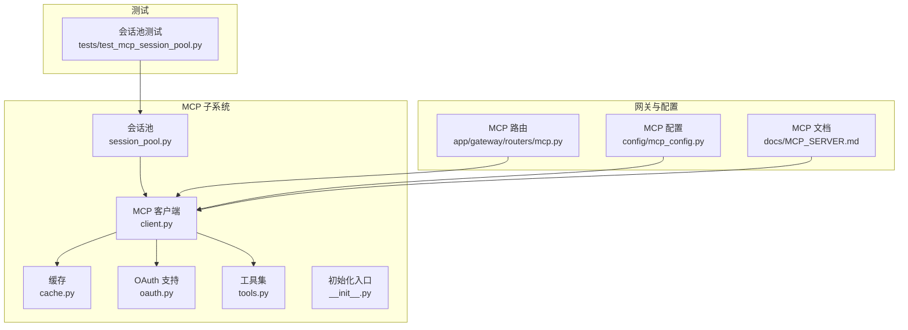
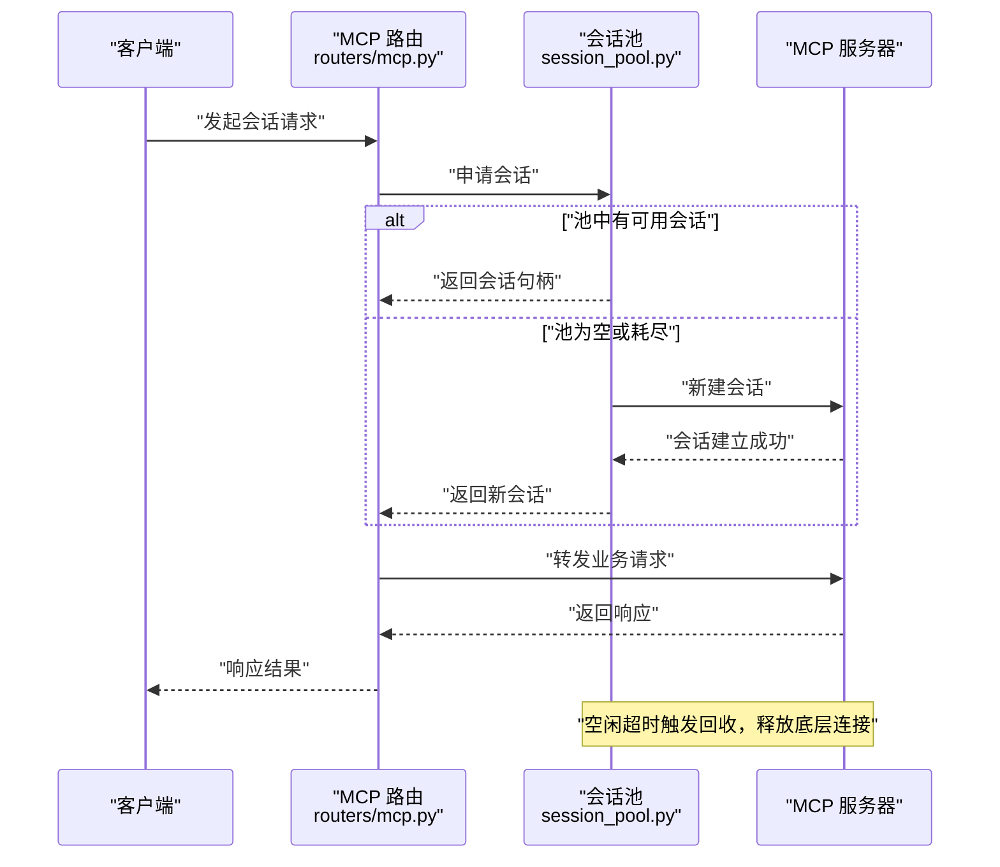
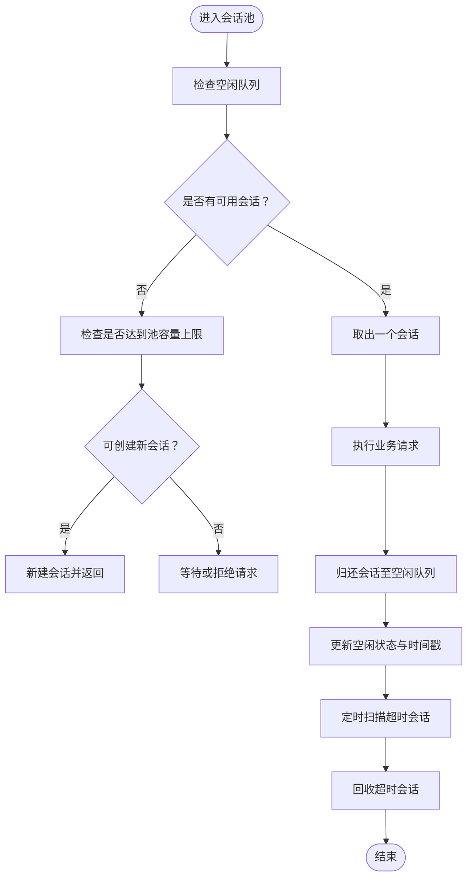
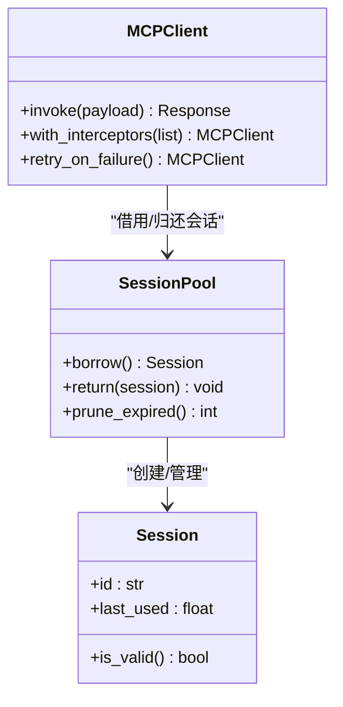
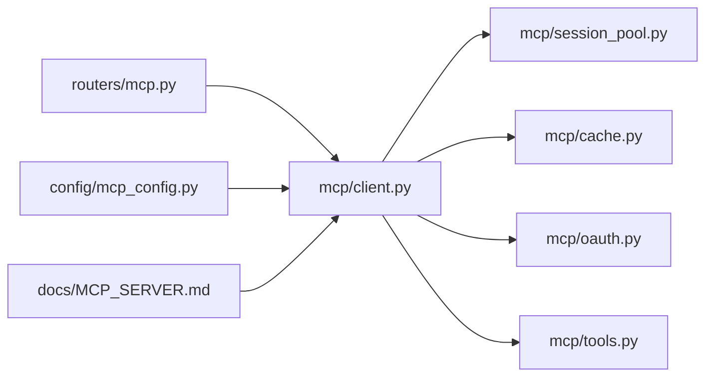

# 会话管理

<cite>
**本文引用的文件**
- [session_pool.py](file://backend/packages/harness/deerflow/mcp/session_pool.py)
- [client.py](file://backend/packages/harness/deerflow/mcp/client.py)
- [cache.py](file://backend/packages/harness/deerflow/mcp/cache.py)
- [oauth.py](file://backend/packages/harness/deerflow/mcp/oauth.py)
- [tools.py](file://backend/packages/harness/deerflow/mcp/tools.py)
- [__init__.py](file://backend/packages/harness/deerflow/mcp/__init__.py)
- [test_mcp_session_pool.py](file://backend/tests/test_mcp_session_pool.py)
- [mcp.py](file://backend/app/gateway/routers/mcp.py)
- [mcp_config.py](file://backend/packages/harness/deerflow/config/mcp_config.py)
- [MCP_SERVER.md](file://backend/docs/MCP_SERVER.md)
</cite>

## 目录
1. [引言](#引言)
2. [项目结构](#项目结构)
3. [核心组件](#核心组件)
4. [架构总览](#架构总览)
5. [详细组件分析](#详细组件分析)
6. [依赖关系分析](#依赖关系分析)
7. [性能考量](#性能考量)
8. [故障排除指南](#故障排除指南)
9. [结论](#结论)
10. [附录](#附录)

## 引言
本文件面向开发者与运维人员，系统性阐述 DeerFlow 中基于 MCP 的会话管理系统：包括会话池设计理念、连接复用机制、生命周期管理策略；并发会话管理、资源限制与负载均衡策略；配置项、性能调优参数与监控指标；并提供使用示例、最佳实践与故障排除建议。目标是帮助读者在保证稳定性的同时最大化会话复用效率与吞吐能力。

## 项目结构
MCP 会话管理位于后端 harness 包中，核心模块围绕会话池、客户端封装、缓存与工具集展开，并通过网关路由对外暴露接口。测试覆盖了会话池的关键行为，文档提供了 MCP 服务集成说明。

**图表来源**
- [session_pool.py](file://backend/packages/harness/deerflow/mcp/session_pool.py)
- [client.py](file://backend/packages/harness/deerflow/mcp/client.py)
- [cache.py](file://backend/packages/harness/deerflow/mcp/cache.py)
- [oauth.py](file://backend/packages/harness/deerflow/mcp/oauth.py)
- [tools.py](file://backend/packages/harness/deerflow/mcp/tools.py)
- [__init__.py](file://backend/packages/harness/deerflow/mcp/__init__.py)
- [mcp.py](file://backend/app/gateway/routers/mcp.py)
- [mcp_config.py](file://backend/packages/harness/deerflow/config/mcp_config.py)
- [MCP_SERVER.md](file://backend/docs/MCP_SERVER.md)
- [test_mcp_session_pool.py](file://backend/tests/test_mcp_session_pool.py)

**章节来源**
- [session_pool.py](file://backend/packages/harness/deerflow/mcp/session_pool.py)
- [client.py](file://backend/packages/harness/deerflow/mcp/client.py)
- [cache.py](file://backend/packages/harness/deerflow/mcp/cache.py)
- [oauth.py](file://backend/packages/harness/deerflow/mcp/oauth.py)
- [tools.py](file://backend/packages/harness/deerflow/mcp/tools.py)
- [__init__.py](file://backend/packages/harness/deerflow/mcp/__init__.py)
- [mcp.py](file://backend/app/gateway/routers/mcp.py)
- [mcp_config.py](file://backend/packages/harness/deerflow/config/mcp_config.py)
- [MCP_SERVER.md](file://backend/docs/MCP_SERVER.md)
- [test_mcp_session_pool.py](file://backend/tests/test_mcp_session_pool.py)

## 核心组件
- 会话池（SessionPool）：负责会话的创建、获取、归还、回收与超时淘汰，支持并发安全与资源上限控制。
- MCP 客户端（MCPClient）：封装与 MCP 服务器交互的逻辑，提供统一的请求/响应处理与错误传播。
- 缓存（Cache）：可选的会话级缓存层，用于加速重复请求或减少往返次数。
- OAuth 支持（OAuth）：为需要认证的 MCP 服务提供令牌管理与刷新机制。
- 工具集（Tools）：对 MCP 服务返回的数据进行标准化、转换与校验。
- 网关路由（routers/mcp.py）：对外暴露会话管理相关接口，协调权限、鉴权与业务流程。
- 配置（config/mcp_config.py）：集中定义会话池大小、超时、重试、并发等参数。

**章节来源**
- [session_pool.py](file://backend/packages/harness/deerflow/mcp/session_pool.py)
- [client.py](file://backend/packages/harness/deerflow/mcp/client.py)
- [cache.py](file://backend/packages/harness/deerflow/mcp/cache.py)
- [oauth.py](file://backend/packages/harness/deerflow/mcp/oauth.py)
- [tools.py](file://backend/packages/harness/deerflow/mcp/tools.py)
- [mcp.py](file://backend/app/gateway/routers/mcp.py)
- [mcp_config.py](file://backend/packages/harness/deerflow/config/mcp_config.py)

## 架构总览
下图展示了从网关到会话池与 MCP 服务器的典型调用链路，以及会话复用与超时回收的关键节点。

**图表来源**
- [mcp.py](file://backend/app/gateway/routers/mcp.py)
- [session_pool.py](file://backend/packages/harness/deerflow/mcp/session_pool.py)
- [client.py](file://backend/packages/harness/deerflow/mcp/client.py)

## 详细组件分析

### 会话池（SessionPool）
- 设计理念
  - 连接复用：通过池化避免频繁握手与鉴权开销，提升吞吐与延迟表现。
  - 生命周期管理：统一创建、借用、归还、销毁与超时回收，确保资源可控。
  - 并发安全：内部使用锁或无锁队列实现线程/协程安全的会话分配。
- 关键机制
  - 获取：优先从空闲队列取，否则按上限创建新会话。
  - 归还：放回空闲队列，更新最近活跃时间。
  - 回收：基于空闲超时与最大存活时间的定期扫描清理。
  - 资源上限：池大小、并发上限、队列长度等参数保护系统不被压垮。
- 复杂度
  - 获取/归还操作通常为 O(1)，超时扫描为 O(n)（n 为池内会话数）。
- 错误处理
  - 连接断开、鉴权失败、服务不可达时进行降级与重试，必要时剔除异常会话。
- 性能影响
  - 合理设置池大小与超时，可显著降低首包延迟与 CPU 占用。

**图表来源**
- [session_pool.py](file://backend/packages/harness/deerflow/mcp/session_pool.py)

**章节来源**
- [session_pool.py](file://backend/packages/harness/deerflow/mcp/session_pool.py)
- [test_mcp_session_pool.py](file://backend/tests/test_mcp_session_pool.py)

### MCP 客户端（MCPClient）
- 统一封装：屏蔽底层网络细节，提供一致的请求/响应模型。
- 请求管线：序列化、拦截器链、重试、超时、错误码映射。
- 响应处理：解码、结构化、校验与转换。
- 与会话池协作：从池中借出会话，使用完毕后归还，支持透明重连与降级。

**图表来源**
- [session_pool.py](file://backend/packages/harness/deerflow/mcp/session_pool.py)
- [client.py](file://backend/packages/harness/deerflow/mcp/client.py)

**章节来源**
- [client.py](file://backend/packages/harness/deerflow/mcp/client.py)

### 缓存（Cache）
- 作用：对常见查询或计算结果进行缓存，减少往返与服务压力。
- 策略：TTL、命中率统计、失效策略、内存上限。
- 与会话池配合：仅缓存幂等且稳定的读路径，写路径谨慎使用。

**章节来源**
- [cache.py](file://backend/packages/harness/deerflow/mcp/cache.py)

### OAuth 支持（OAuth）
- 令牌管理：拉取、刷新、过期检测与自动续期。
- 安全性：敏感信息加密存储、最小权限原则、令牌轮换。
- 与客户端集成：在每次请求前注入有效凭据，失败时触发刷新与重试。

**章节来源**
- [oauth.py](file://backend/packages/harness/deerflow/mcp/oauth.py)

### 工具集（Tools）
- 数据标准化：字段清洗、类型转换、默认值填充。
- 校验与限流：长度、范围、格式校验，结合外部限流策略。
- 结果转换：将 MCP 返回结构映射为上层统一模型。

**章节来源**
- [tools.py](file://backend/packages/harness/deerflow/mcp/tools.py)

### 网关路由（routers/mcp.py）
- 接口暴露：提供会话生命周期管理与业务调用的统一入口。
- 权限与鉴权：结合中间件进行用户身份验证与授权检查。
- 错误聚合：将底层异常转换为标准响应，保留追踪 ID 便于定位。

**章节来源**
- [mcp.py](file://backend/app/gateway/routers/mcp.py)

### 配置（config/mcp_config.py）
- 会话池参数：最大池大小、空闲超时、最大存活时间、并发上限。
- 超时与重试：请求超时、连接超时、指数退避重试策略。
- 负载均衡：多 MCP 服务实例的权重与健康探测。
- 日志与监控：采样率、关键指标开关、埋点字段。

**章节来源**
- [mcp_config.py](file://backend/packages/harness/deerflow/config/mcp_config.py)

## 依赖关系分析
- 模块耦合
  - 会话池与客户端强耦合：客户端依赖池进行连接复用。
  - 客户端与缓存、OAuth、工具集弱耦合：通过组合与插件化接入。
  - 网关路由依赖客户端与配置，作为唯一对外入口。
- 外部依赖
  - MCP 服务器：协议、鉴权、可用性直接影响会话池性能。
  - 配置中心/环境变量：运行时参数调整能力。
- 循环依赖
  - 当前结构避免循环导入，采用分层与接口抽象。

**图表来源**
- [mcp.py](file://backend/app/gateway/routers/mcp.py)
- [client.py](file://backend/packages/harness/deerflow/mcp/client.py)
- [session_pool.py](file://backend/packages/harness/deerflow/mcp/session_pool.py)
- [cache.py](file://backend/packages/harness/deerflow/mcp/cache.py)
- [oauth.py](file://backend/packages/harness/deerflow/mcp/oauth.py)
- [tools.py](file://backend/packages/harness/deerflow/mcp/tools.py)
- [mcp_config.py](file://backend/packages/harness/deerflow/config/mcp_config.py)
- [MCP_SERVER.md](file://backend/docs/MCP_SERVER.md)

**章节来源**
- [mcp.py](file://backend/app/gateway/routers/mcp.py)
- [client.py](file://backend/packages/harness/deerflow/mcp/client.py)
- [session_pool.py](file://backend/packages/harness/deerflow/mcp/session_pool.py)
- [cache.py](file://backend/packages/harness/deerflow/mcp/cache.py)
- [oauth.py](file://backend/packages/harness/deerflow/mcp/oauth.py)
- [tools.py](file://backend/packages/harness/deerflow/mcp/tools.py)
- [mcp_config.py](file://backend/packages/harness/deerflow/config/mcp_config.py)
- [MCP_SERVER.md](file://backend/docs/MCP_SERVER.md)

## 性能考量
- 连接复用
  - 提高池大小与空闲超时可降低握手成本，但需平衡内存占用与 GC 压力。
  - 对于短时突发流量，适度放宽并发上限可减少排队等待。
- 超时与重试
  - 请求超时应小于上游限流窗口，避免放大效应。
  - 指数退避+抖动可缓解热点与雪崩。
- 负载均衡
  - 多实例部署时启用健康检查与权重轮询，结合熔断与隔离舱策略。
- 缓存策略
  - 读多写少场景优先缓存，注意一致性与失效时机。
- 监控指标
  - 会话借用/归还速率、池命中率、平均等待时间、超时/重试次数、错误分布、CPU/内存/GC 指标。

[本节为通用性能指导，无需特定文件引用]

## 故障排除指南
- 症状：请求堆积、超时增多
  - 排查要点：池大小是否过小、空闲超时是否过长导致连接老化、上游限流阈值。
  - 处置建议：增大池容量、缩短空闲超时、开启更积极的回收策略。
- 症状：连接抖动频繁
  - 排查要点：网络波动、MCP 服务器重启、证书/鉴权问题。
  - 处置建议：启用自动重连与退避、检查证书与域名解析、确认 OAuth 刷新流程。
- 症状：内存持续增长
  - 排查要点：缓存未命中、会话泄漏、大对象未及时释放。
  - 处置建议：限制缓存 TTL 与容量、审计会话归还逻辑、优化响应体大小。
- 症状：偶发错误率升高
  - 排查要点：熔断触发、下游不稳定、限流阈值。
  - 处置建议：查看熔断状态、增加备用实例、临时放宽限流。

**章节来源**
- [test_mcp_session_pool.py](file://backend/tests/test_mcp_session_pool.py)
- [session_pool.py](file://backend/packages/harness/deerflow/mcp/session_pool.py)
- [client.py](file://backend/packages/harness/deerflow/mcp/client.py)

## 结论
MCP 会话管理系统通过“池化 + 生命周期管理 + 并发控制 + 超时回收”的组合拳，在保障稳定性的同时实现了高效的连接复用与可观的吞吐提升。结合合理的配置与监控，可在不同规模与负载场景下获得稳定表现。建议在生产环境中以渐进式方式调参，并持续观测关键指标以指导优化。

[本节为总结性内容，无需特定文件引用]

## 附录

### 使用示例（步骤说明）
- 在网关路由中调用 MCP 客户端，客户端从会话池借用会话并转发请求。
- 对于需要鉴权的服务，先通过 OAuth 获取/刷新令牌，再发起请求。
- 对高频读路径启用缓存，写路径谨慎使用缓存并设置合理失效策略。
- 通过配置文件调整池大小、超时与重试策略，观察指标变化并迭代优化。

**章节来源**
- [mcp.py](file://backend/app/gateway/routers/mcp.py)
- [client.py](file://backend/packages/harness/deerflow/mcp/client.py)
- [session_pool.py](file://backend/packages/harness/deerflow/mcp/session_pool.py)
- [cache.py](file://backend/packages/harness/deerflow/mcp/cache.py)
- [oauth.py](file://backend/packages/harness/deerflow/mcp/oauth.py)
- [mcp_config.py](file://backend/packages/harness/deerflow/config/mcp_config.py)

### 最佳实践
- 将会话池大小与上游并发能力匹配，避免过度池化造成资源浪费。
- 为不同业务场景设置差异化超时与重试策略，避免“全局一刀切”。
- 对关键路径启用缓存与预热，减少冷启动与抖动。
- 在多实例部署时启用健康检查与熔断，结合灰度发布逐步扩容。

[本节为通用最佳实践，无需特定文件引用]