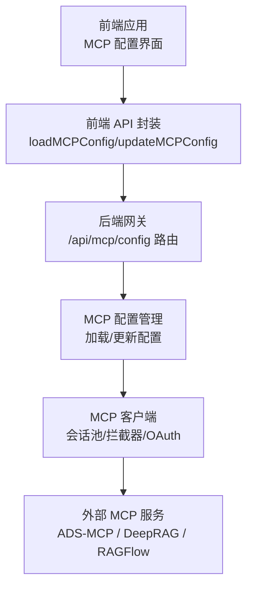
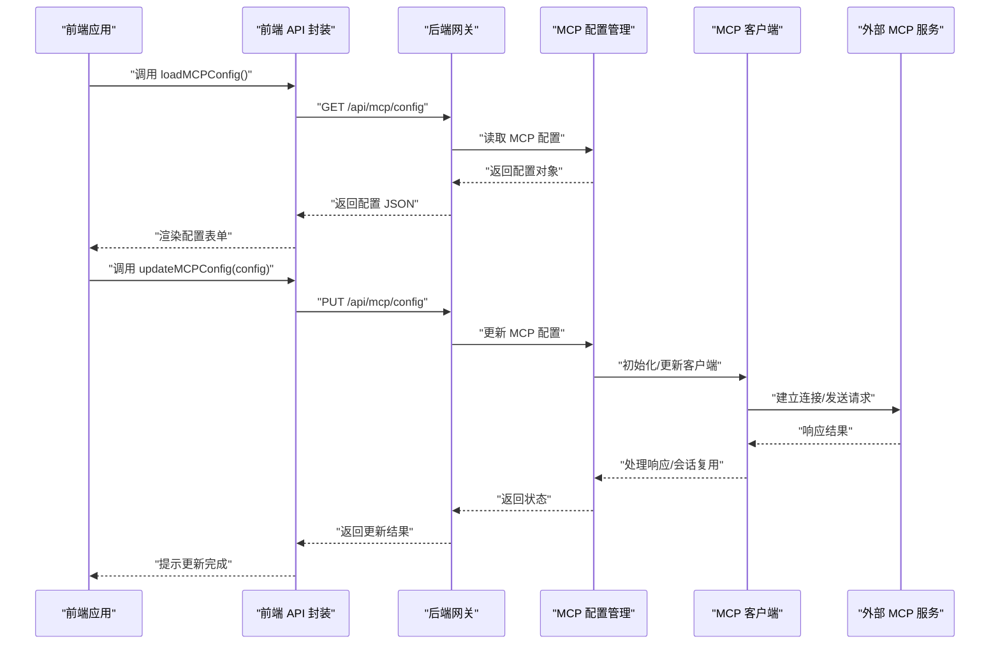
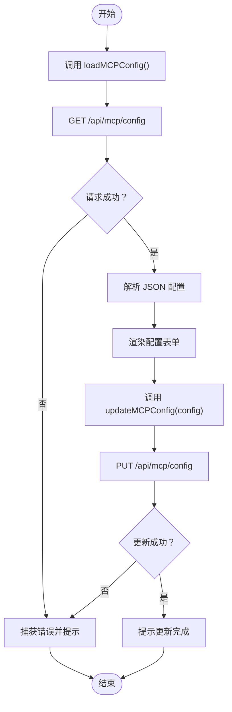
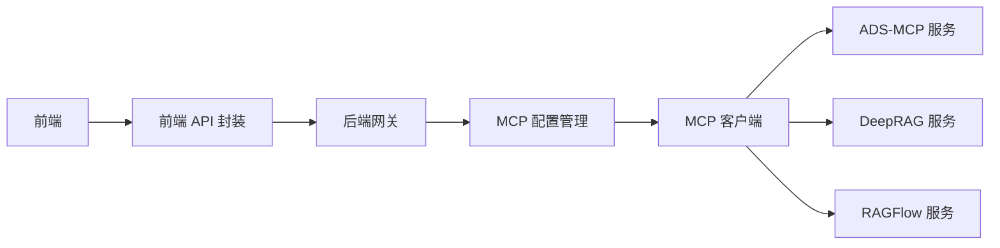

# 外部服务集成

<cite>
**本文引用的文件**
- [ADS-MCP对接DeerFlow整合指南-实测版.md](file://docs/mcp/ADS-MCP对接DeerFlow整合指南-实测版.md)
- [DeepRAG_MCP对接DeerFlow整合指南.md](file://docs/mcp/DeepRAG_MCP对接DeerFlow整合指南.md)
- [RAGFLOW_MCP_INTEGRATION.md](file://docs/mcp/RAGFLOW_MCP_INTEGRATION.md)
- [config.json](file://backend/.ads-mcp/config.json)
- [api.ts](file://frontend/src/core/mcp/api.ts)
- [MCP_SERVER.md](file://backend/docs/MCP_SERVER.md)
- [CONFIGURATION.md](file://backend/docs/CONFIGURATION.md)
- [README.md](file://backend/README.md)
- [test_mcp_client_config.py](file://backend/tests/test_mcp_client_config.py)
- [test_mcp_oauth.py](file://backend/tests/test_mcp_oauth.py)
- [test_mcp_session_pool.py](file://backend/tests/test_mcp_session_pool.py)
</cite>

## 目录
1. [简介](#简介)
2. [项目结构](#项目结构)
3. [核心组件](#核心组件)
4. [架构总览](#架构总览)
5. [详细组件分析](#详细组件分析)
6. [依赖关系分析](#依赖关系分析)
7. [性能考虑](#性能考虑)
8. [故障排除指南](#故障排除指南)
9. [结论](#结论)
10. [附录](#附录)

## 简介
本文件面向希望将第三方服务（如 ADS-MCP、DeepRAG、RAGFlow 等）集成到 DeerFlow MCP 服务器的开发者，系统性地介绍集成模式、配置要求、API 映射与数据转换策略，并提供可操作的配置模板、连接参数、认证设置、集成示例、测试方法与故障排除建议。文档同时对各服务的特点、优势与适用场景进行对比，辅助选择合适的外部服务。

## 项目结构
DeerFlow 的 MCP 集成能力由后端网关与前端配置界面协同实现，核心涉及以下模块：
- 后端网关路由与 MCP 配置管理：负责接收前端请求、加载/更新 MCP 配置并转发至对应 MCP 客户端
- 前端 MCP 配置 API：提供加载与更新 MCP 配置的接口封装
- 文档与示例：官方整合指南文档，覆盖 ADS-MCP、DeepRAG、RAGFlow 的对接步骤与注意事项
- 测试用例：验证 MCP 客户端配置、OAuth 认证与会话池行为

图表来源
- [api.ts:1-20](file://frontend/src/core/mcp/api.ts#L1-L20)
- [MCP_SERVER.md:1-200](file://backend/docs/MCP_SERVER.md#L1-L200)
- [CONFIGURATION.md:1-200](file://backend/docs/CONFIGURATION.md#L1-L200)

章节来源
- [README.md:1-200](file://backend/README.md#L1-L200)
- [CONFIGURATION.md:1-200](file://backend/docs/CONFIGURATION.md#L1-L200)

## 核心组件
- 前端 MCP 配置 API
  - 提供加载与更新 MCP 配置的异步函数，通过后端基础 URL 拼接 /api/mcp/config 实现
  - 支持 PUT 请求以更新配置，JSON 序列化传输
- 后端网关与 MCP 配置管理
  - 提供 /api/mcp/config GET/PUT 接口，用于读取与写入 MCP 客户端配置
  - 配置项通常包含服务地址、认证令牌、超时、重试策略等
- MCP 客户端与会话池
  - 维护与外部 MCP 服务的连接状态，支持并发会话复用与拦截器链
  - 支持 OAuth 认证流程与令牌刷新
- 文档与示例
  - ADS-MCP、DeepRAG、RAGFlow 的官方整合指南，涵盖部署、配置、API 映射与常见问题

章节来源
- [api.ts:1-20](file://frontend/src/core/mcp/api.ts#L1-L20)
- [MCP_SERVER.md:1-200](file://backend/docs/MCP_SERVER.md#L1-L200)
- [CONFIGURATION.md:1-200](file://backend/docs/CONFIGURATION.md#L1-L200)

## 架构总览
下图展示了从前端到后端再到外部 MCP 服务的整体调用链路，以及关键的配置与认证节点：

图表来源
- [api.ts:1-20](file://frontend/src/core/mcp/api.ts#L1-L20)
- [MCP_SERVER.md:1-200](file://backend/docs/MCP_SERVER.md#L1-L200)

## 详细组件分析

### ADS-MCP 集成
- 适用场景
  - 需要与特定 ADS-MCP 服务进行标准化 MCP 协议交互，适用于知识检索、工具调用等场景
- 配置要点
  - 服务地址与端口、鉴权方式（如 API Key 或 OAuth）
  - 连接超时、重试次数、并发限制
  - 代理或网络策略（如内网访问控制）
- API 映射与数据转换
  - 将 DeerFlow 内部消息格式映射为 MCP 协议请求体
  - 对响应进行解包与字段映射，确保上下文一致性
- 配置模板与参数
  - 参考官方整合指南中的配置片段与参数说明
- 测试与验证
  - 使用后端测试用例验证 MCP 客户端配置加载与连接稳定性
- 故障排除
  - 关注网络连通性、鉴权失败、超时与重试策略是否合理

章节来源
- [ADS-MCP对接DeerFlow整合指南-实测版.md:1-500](file://docs/mcp/ADS-MCP对接DeerFlow整合指南-实测版.md#L1-L500)
- [test_mcp_client_config.py:1-200](file://backend/tests/test_mcp_client_config.py#L1-L200)

### DeepRAG 集成
- 适用场景
  - 需要结合 RAG 能力进行问答与内容生成，适合信息检索增强型对话
- 配置要点
  - RAG 索引服务地址、检索参数、生成模型参数
  - 与 MCP 的适配层配置，确保协议兼容
- API 映射与数据转换
  - 将用户查询转换为检索请求，再将检索结果注入到 MCP 工具调用或消息流中
- 配置模板与参数
  - 参考官方整合指南中的模板与参数说明
- 测试与验证
  - 结合后端测试用例验证 OAuth 与会话池行为
- 故障排除
  - 关注索引可用性、检索性能与生成质量

章节来源
- [DeepRAG_MCP对接DeerFlow整合指南.md:1-500](file://docs/mcp/DeepRAG_MCP对接DeerFlow整合指南.md#L1-L500)
- [test_mcp_oauth.py:1-200](file://backend/tests/test_mcp_oauth.py#L1-L200)
- [test_mcp_session_pool.py:1-200](file://backend/tests/test_mcp_session_pool.py#L1-L200)

### RAGFlow 集成
- 适用场景
  - 企业级 RAG 平台，强调数据治理与安全，适合合规要求较高的组织
- 配置要点
  - 数据源接入、索引构建与检索策略
  - 与 MCP 的桥接层配置，确保安全与审计日志
- API 映射与数据转换
  - 将检索结果转换为 MCP 工具输出格式，保证语义一致与上下文完整
- 配置模板与参数
  - 参考官方整合指南中的模板与参数说明
- 测试与验证
  - 使用后端测试用例验证 MCP 客户端配置与会话池稳定性
- 故障排除
  - 关注数据源连通性、索引状态与权限策略

章节来源
- [RAGFLOW_MCP_INTEGRATION.md:1-500](file://docs/mcp/RAGFLOW_MCP_INTEGRATION.md#L1-L500)
- [test_mcp_client_config.py:1-200](file://backend/tests/test_mcp_client_config.py#L1-L200)
- [test_mcp_session_pool.py:1-200](file://backend/tests/test_mcp_session_pool.py#L1-L200)

### 前端 MCP 配置 API
- 功能概述
  - 提供加载与更新 MCP 配置的统一入口，简化前端与后端的交互
- 关键流程
  - 加载配置：GET /api/mcp/config
  - 更新配置：PUT /api/mcp/config，携带 JSON 配置体
- 错误处理
  - 对网络异常、解析错误与权限不足进行统一处理

图表来源
- [api.ts:1-20](file://frontend/src/core/mcp/api.ts#L1-L20)

章节来源
- [api.ts:1-20](file://frontend/src/core/mcp/api.ts#L1-L20)

### 后端 MCP 配置管理与客户端
- 配置管理
  - 提供 /api/mcp/config 的读写接口，支持热更新与持久化
- 客户端特性
  - 会话池：复用连接，降低握手开销
  - 拦截器：统一处理鉴权、重试、日志与限流
  - OAuth：支持令牌获取、刷新与失效处理
- 测试保障
  - 针对配置加载、OAuth 行为与会话池稳定性的测试用例

章节来源
- [MCP_SERVER.md:1-200](file://backend/docs/MCP_SERVER.md#L1-L200)
- [CONFIGURATION.md:1-200](file://backend/docs/CONFIGURATION.md#L1-L200)
- [test_mcp_client_config.py:1-200](file://backend/tests/test_mcp_client_config.py#L1-L200)
- [test_mcp_oauth.py:1-200](file://backend/tests/test_mcp_oauth.py#L1-L200)
- [test_mcp_session_pool.py:1-200](file://backend/tests/test_mcp_session_pool.py#L1-L200)

## 依赖关系分析
- 前端依赖后端提供的 MCP 配置 API，通过统一的 GET/PUT 接口完成配置生命周期管理
- 后端依赖 MCP 客户端库，负责与外部 MCP 服务通信；客户端依赖配置管理模块与认证模块
- 外部 MCP 服务（ADS-MCP、DeepRAG、RAGFlow）作为独立服务，遵循 MCP 协议进行交互

图表来源
- [api.ts:1-20](file://frontend/src/core/mcp/api.ts#L1-L20)
- [MCP_SERVER.md:1-200](file://backend/docs/MCP_SERVER.md#L1-L200)

章节来源
- [CONFIGURATION.md:1-200](file://backend/docs/CONFIGURATION.md#L1-L200)
- [MCP_SERVER.md:1-200](file://backend/docs/MCP_SERVER.md#L1-L200)

## 性能考虑
- 连接复用：使用会话池减少握手与连接建立开销
- 超时与重试：根据外部服务延迟设置合理的超时与指数退避重试策略
- 并发控制：限制并发请求数，避免外部服务过载
- 缓存与预热：对常用检索结果进行缓存，必要时进行预热
- 监控与告警：记录请求耗时、错误率与资源使用情况，及时发现性能瓶颈

## 故障排除指南
- 网络连通性
  - 检查防火墙、代理与 DNS 解析；确认服务地址与端口正确
- 鉴权失败
  - 核对 API Key/OAuth 令牌有效期与作用域；确认后端已正确配置
- 超时与重试
  - 调整超时阈值与重试次数；观察外部服务响应时间波动
- 配置不生效
  - 确认通过 /api/mcp/config 的 PUT 请求已成功；检查后端日志与配置持久化
- 会话异常
  - 查看会话池状态与连接健康度；必要时重启会话池或服务实例

章节来源
- [test_mcp_client_config.py:1-200](file://backend/tests/test_mcp_client_config.py#L1-L200)
- [test_mcp_oauth.py:1-200](file://backend/tests/test_mcp_oauth.py#L1-L200)
- [test_mcp_session_pool.py:1-200](file://backend/tests/test_mcp_session_pool.py#L1-L200)

## 结论
通过统一的 MCP 配置 API 与后端客户端，DeerFlow 能够灵活接入多种外部 MCP 服务。建议在集成前明确服务特性与适用场景，按官方整合指南完成配置与测试，并结合监控与故障排除流程保障生产环境的稳定性与性能。

## 附录
- ADS-MCP 配置参考
  - 参考后端 ads-mcp 配置文件，了解服务地址、鉴权与网络参数
- 官方整合指南
  - ADS-MCP、DeepRAG、RAGFlow 的整合指南提供了详细的部署步骤与参数说明
- 测试清单
  - 配置加载测试、OAuth 认证测试、会话池稳定性测试

章节来源
- [config.json:1-200](file://backend/.ads-mcp/config.json#L1-L200)
- [ADS-MCP对接DeerFlow整合指南-实测版.md:1-500](file://docs/mcp/ADS-MCP对接DeerFlow整合指南-实测版.md#L1-L500)
- [DeepRAG_MCP对接DeerFlow整合指南.md:1-500](file://docs/mcp/DeepRAG_MCP对接DeerFlow整合指南.md#L1-L500)
- [RAGFLOW_MCP_INTEGRATION.md:1-500](file://docs/mcp/RAGFLOW_MCP_INTEGRATION.md#L1-L500)