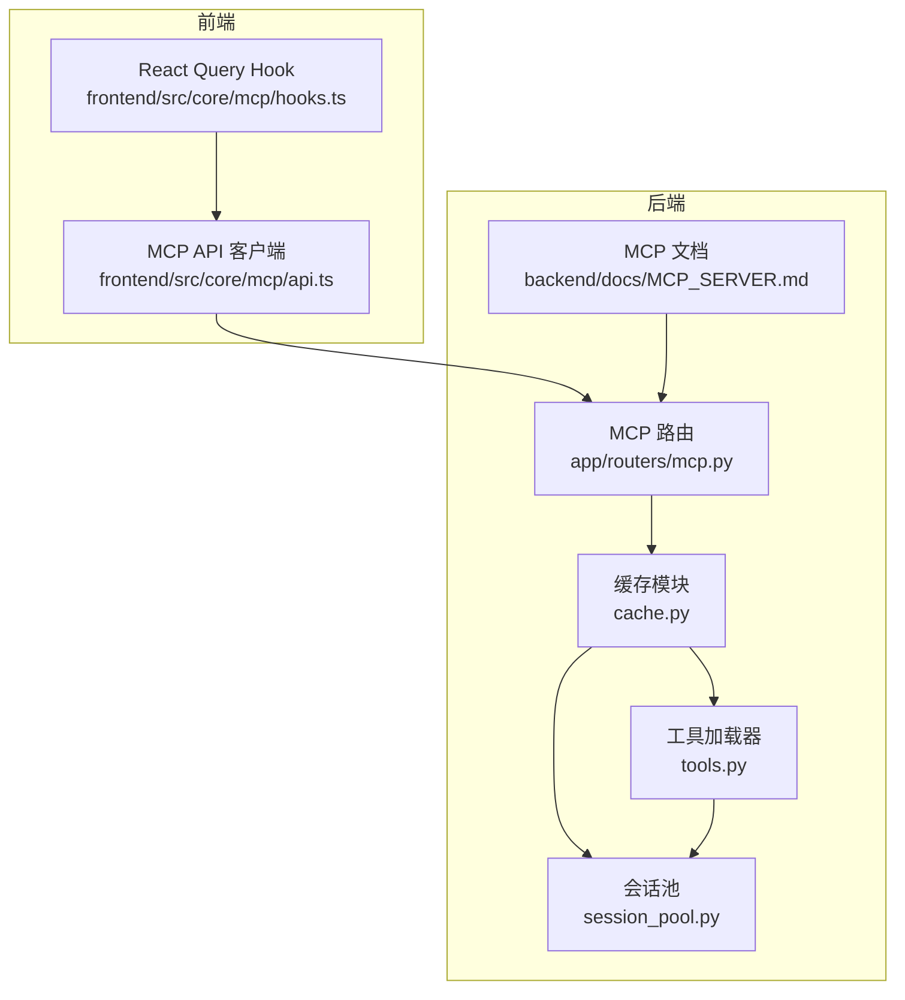
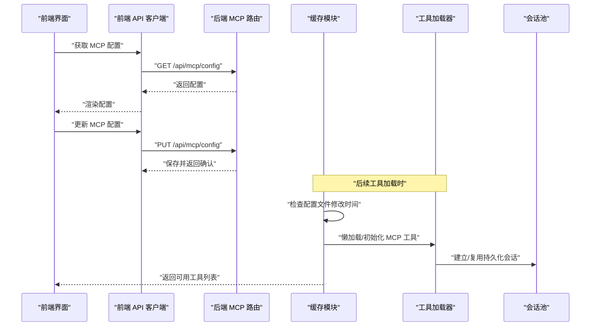
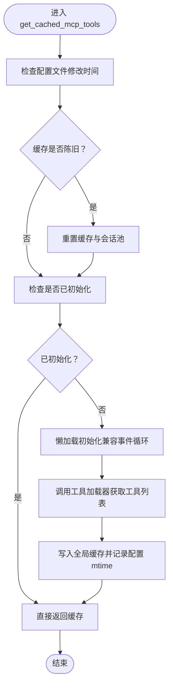
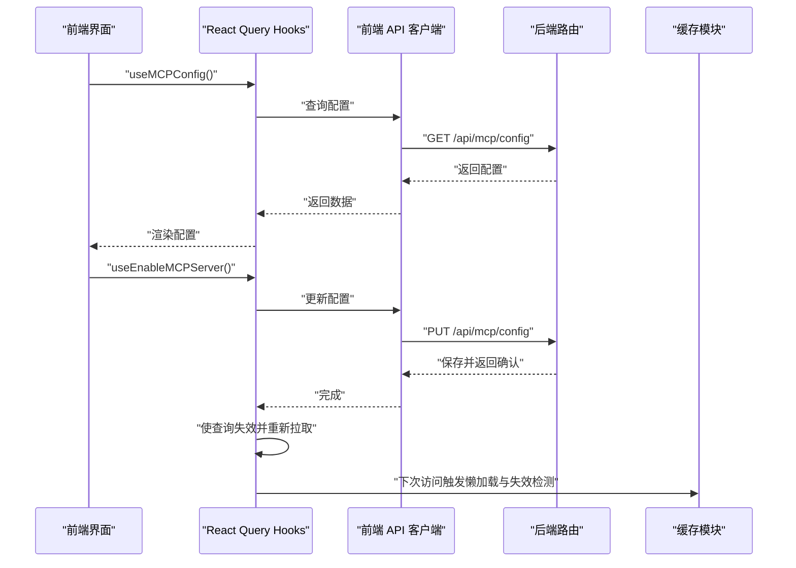
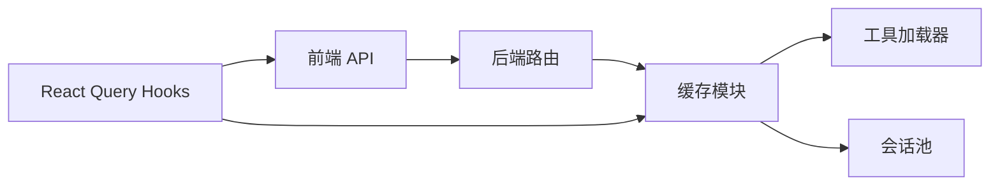

# 缓存系统

<cite>
**本文引用的文件**
- [backend/packages/harness/deerflow/mcp/cache.py](file://backend/packages/harness/deerflow/mcp/cache.py)
- [backend/packages/harness/deerflow/mcp/tools.py](file://backend/packages/harness/deerflow/mcp/tools.py)
- [backend/packages/harness/deerflow/mcp/session_pool.py](file://backend/packages/harness/deerflow/mcp/session_pool.py)
- [backend/app/routers/mcp.py](file://backend/app/routers/mcp.py)
- [backend/docs/MCP_SERVER.md](file://backend/docs/MCP_SERVER.md)
- [frontend/src/core/mcp/api.ts](file://frontend/src/core/mcp/api.ts)
- [frontend/src/core/mcp/hooks.ts](file://frontend/src/core/mcp/hooks.ts)
</cite>

## 目录
1. [简介](#简介)
2. [项目结构](#项目结构)
3. [核心组件](#核心组件)
4. [架构总览](#架构总览)
5. [详细组件分析](#详细组件分析)
6. [依赖关系分析](#依赖关系分析)
7. [性能考量](#性能考量)
8. [故障排除指南](#故障排除指南)
9. [结论](#结论)
10. [附录](#附录)

## 简介
本技术文档聚焦于 DeerFlow 中的 MCP（Model Context Protocol）缓存系统，系统性阐述其缓存策略设计原理、数据结构选择、过期与失效机制、内存管理方式，以及在工具元数据、会话状态、响应结果等不同数据类型上的应用策略。文档还提供配置选项说明、命中率优化建议、性能监控与调优参数、容量规划指南，并给出具体配置示例、使用模式与故障排除方法，帮助开发者构建高效稳定的缓存系统。

## 项目结构
MCP 缓存系统主要由以下模块组成：
- 后端缓存与初始化：负责 MCP 工具的懒加载、缓存与失效检测
- 会话池：管理持久化的 MCP 会话，支持重置与回收
- 工具加载器：从已启用的 MCP 服务器动态获取工具集合
- 前后端交互：前端通过 API 获取与更新 MCP 配置，后端路由提供配置接口

图表来源
- [backend/packages/harness/deerflow/mcp/cache.py:1-157](file://backend/packages/harness/deerflow/mcp/cache.py#L1-L157)
- [backend/packages/harness/deerflow/mcp/tools.py](file://backend/packages/harness/deerflow/mcp/tools.py)
- [backend/packages/harness/deerflow/mcp/session_pool.py](file://backend/packages/harness/deerflow/mcp/session_pool.py)
- [backend/app/routers/mcp.py](file://backend/app/routers/mcp.py)
- [backend/docs/MCP_SERVER.md](file://backend/docs/MCP_SERVER.md)
- [frontend/src/core/mcp/api.ts:1-20](file://frontend/src/core/mcp/api.ts#L1-L20)
- [frontend/src/core/mcp/hooks.ts:1-44](file://frontend/src/core/mcp/hooks.ts#L1-L44)

章节来源
- [backend/packages/harness/deerflow/mcp/cache.py:1-157](file://backend/packages/harness/deerflow/mcp/cache.py#L1-L157)
- [backend/packages/harness/deerflow/mcp/tools.py](file://backend/packages/harness/deerflow/mcp/tools.py)
- [backend/packages/harness/deerflow/mcp/session_pool.py](file://backend/packages/harness/deerflow/mcp/session_pool.py)
- [backend/app/routers/mcp.py](file://backend/app/routers/mcp.py)
- [backend/docs/MCP_SERVER.md](file://backend/docs/MCP_SERVER.md)
- [frontend/src/core/mcp/api.ts:1-20](file://frontend/src/core/mcp/api.ts#L1-L20)
- [frontend/src/core/mcp/hooks.ts:1-44](file://frontend/src/core/mcp/hooks.ts#L1-L44)

## 核心组件
- 缓存模块（cache.py）
  - 提供 MCP 工具的懒加载与全局缓存
  - 通过配置文件修改时间检测缓存失效
  - 支持在运行时事件循环不存在或已存在时的安全初始化
  - 提供缓存重置能力，配合会话池关闭与重建
- 工具加载器（tools.py）
  - 从已启用的 MCP 服务器聚合工具集合
  - 作为缓存模块的上游数据源
- 会话池（session_pool.py）
  - 维护持久化会话，支持关闭所有会话与重置
  - 在缓存重置时被联动关闭，确保下次加载时使用最新连接配置
- 前后端交互
  - 前端通过 API 获取与更新 MCP 配置
  - 后端路由提供配置读写接口，结合缓存失效逻辑保证配置变更生效

章节来源
- [backend/packages/harness/deerflow/mcp/cache.py:56-157](file://backend/packages/harness/deerflow/mcp/cache.py#L56-L157)
- [backend/packages/harness/deerflow/mcp/tools.py](file://backend/packages/harness/deerflow/mcp/tools.py)
- [backend/packages/harness/deerflow/mcp/session_pool.py](file://backend/packages/harness/deerflow/mcp/session_pool.py)
- [frontend/src/core/mcp/api.ts:6-20](file://frontend/src/core/mcp/api.ts#L6-L20)
- [frontend/src/core/mcp/hooks.ts:5-44](file://frontend/src/core/mcp/hooks.ts#L5-L44)

## 架构总览
下图展示了 MCP 缓存系统在请求链路中的位置与交互：

图表来源
- [frontend/src/core/mcp/api.ts:6-20](file://frontend/src/core/mcp/api.ts#L6-L20)
- [backend/app/routers/mcp.py](file://backend/app/routers/mcp.py)
- [backend/packages/harness/deerflow/mcp/cache.py:82-129](file://backend/packages/harness/deerflow/mcp/cache.py#L82-L129)
- [backend/packages/harness/deerflow/mcp/tools.py](file://backend/packages/harness/deerflow/mcp/tools.py)
- [backend/packages/harness/deerflow/mcp/session_pool.py](file://backend/packages/harness/deerflow/mcp/session_pool.py)

## 详细组件分析

### 缓存模块（cache.py）
- 设计要点
  - 全局单例缓存：维护一个进程级的工具列表，避免重复加载
  - 懒加载与线程安全：通过异步锁保护初始化过程；在无事件循环或已有事件循环场景下分别处理
  - 失效检测：基于配置文件的修改时间判断缓存是否陈旧，自动触发重载
  - 重置机制：提供显式重置函数，关闭持久化会话并清空缓存，确保配置变更立即生效
- 数据结构
  - 工具缓存：列表结构存储 LangChain 工具对象
  - 初始化标志位：标记缓存是否已初始化
  - 配置文件修改时间：记录上次缓存时的配置文件 mtime，用于失效判断
  - 异步锁：保证并发初始化的原子性
- 性能特性
  - 首次加载成本高，后续访问为 O(n) 的常数时间复杂度
  - 通过失效检测避免脏读，减少不必要的重新初始化
  - 在 LangGraph Studio 等嵌入式环境中具备良好的事件循环兼容性

图表来源
- [backend/packages/harness/deerflow/mcp/cache.py:82-129](file://backend/packages/harness/deerflow/mcp/cache.py#L82-L129)
- [backend/packages/harness/deerflow/mcp/cache.py:31-53](file://backend/packages/harness/deerflow/mcp/cache.py#L31-L53)
- [backend/packages/harness/deerflow/mcp/cache.py:132-157](file://backend/packages/harness/deerflow/mcp/cache.py#L132-L157)

章节来源
- [backend/packages/harness/deerflow/mcp/cache.py:17-53](file://backend/packages/harness/deerflow/mcp/cache.py#L17-L53)
- [backend/packages/harness/deerflow/mcp/cache.py:56-79](file://backend/packages/harness/deerflow/mcp/cache.py#L56-L79)
- [backend/packages/harness/deerflow/mcp/cache.py:82-129](file://backend/packages/harness/deerflow/mcp/cache.py#L82-L129)
- [backend/packages/harness/deerflow/mcp/cache.py:132-157](file://backend/packages/harness/deerflow/mcp/cache.py#L132-L157)

### 工具加载器（tools.py）
- 职责
  - 从已启用的 MCP 服务器聚合工具集合
  - 作为缓存模块的数据源，提供稳定的工具列表
- 关系
  - 与会话池协作，确保工具使用的会话一致性
  - 与缓存模块配合，实现按需加载与全局复用

章节来源
- [backend/packages/harness/deerflow/mcp/tools.py](file://backend/packages/harness/deerflow/mcp/tools.py)

### 会话池（session_pool.py）
- 职责
  - 维护持久化会话，支持关闭所有会话与重置
  - 在缓存重置时被联动关闭，确保下次加载时使用最新连接配置
- 与缓存的关系
  - 缓存重置时主动调用会话池关闭与重置，保证配置变更后的会话一致性

章节来源
- [backend/packages/harness/deerflow/mcp/session_pool.py](file://backend/packages/harness/deerflow/mcp/session_pool.py)
- [backend/packages/harness/deerflow/mcp/cache.py:144-156](file://backend/packages/harness/deerflow/mcp/cache.py#L144-L156)

### 前后端交互（前端 API 与路由）
- 前端
  - 提供加载与更新 MCP 配置的 API 封装
  - 使用 React Query 管理查询状态与缓存失效
- 后端路由
  - 提供 MCP 配置的读取与更新接口
  - 结合缓存失效逻辑，确保配置变更后工具列表及时刷新

图表来源
- [frontend/src/core/mcp/api.ts:6-20](file://frontend/src/core/mcp/api.ts#L6-L20)
- [frontend/src/core/mcp/hooks.ts:5-44](file://frontend/src/core/mcp/hooks.ts#L5-L44)
- [backend/app/routers/mcp.py](file://backend/app/routers/mcp.py)
- [backend/packages/harness/deerflow/mcp/cache.py:82-129](file://backend/packages/harness/deerflow/mcp/cache.py#L82-L129)

章节来源
- [frontend/src/core/mcp/api.ts:6-20](file://frontend/src/core/mcp/api.ts#L6-L20)
- [frontend/src/core/mcp/hooks.ts:5-44](file://frontend/src/core/mcp/hooks.ts#L5-L44)
- [backend/app/routers/mcp.py](file://backend/app/routers/mcp.py)

## 依赖关系分析
- 组件耦合
  - 缓存模块依赖工具加载器与会话池，形成“缓存-数据源-会话”的清晰分层
  - 前端通过路由间接依赖缓存模块，实现配置变更到工具刷新的闭环
- 外部依赖
  - 事件循环兼容性：在无事件循环或已有事件循环场景下的初始化策略
  - 配置文件监控：基于文件修改时间的缓存失效检测
- 循环依赖风险
  - 当前模块间为单向依赖，未发现循环依赖迹象

图表来源
- [backend/packages/harness/deerflow/mcp/cache.py:71-74](file://backend/packages/harness/deerflow/mcp/cache.py#L71-L74)
- [backend/packages/harness/deerflow/mcp/tools.py](file://backend/packages/harness/deerflow/mcp/tools.py)
- [backend/packages/harness/deerflow/mcp/session_pool.py](file://backend/packages/harness/deerflow/mcp/session_pool.py)
- [backend/app/routers/mcp.py](file://backend/app/routers/mcp.py)
- [frontend/src/core/mcp/api.ts:6-20](file://frontend/src/core/mcp/api.ts#L6-L20)
- [frontend/src/core/mcp/hooks.ts:5-44](file://frontend/src/core/mcp/hooks.ts#L5-L44)

章节来源
- [backend/packages/harness/deerflow/mcp/cache.py:56-79](file://backend/packages/harness/deerflow/mcp/cache.py#L56-L79)
- [backend/packages/harness/deerflow/mcp/tools.py](file://backend/packages/harness/deerflow/mcp/tools.py)
- [backend/packages/harness/deerflow/mcp/session_pool.py](file://backend/packages/harness/deerflow/mcp/session_pool.py)
- [backend/app/routers/mcp.py](file://backend/app/routers/mcp.py)
- [frontend/src/core/mcp/api.ts:6-20](file://frontend/src/core/mcp/api.ts#L6-L20)
- [frontend/src/core/mcp/hooks.ts:5-44](file://frontend/src/core/mcp/hooks.ts#L5-L44)

## 性能考量
- 命中率优化
  - 利用全局缓存避免重复加载，提升工具访问速度
  - 通过配置文件修改时间检测，确保在配置变更后及时刷新，避免陈旧数据影响
- 内存管理
  - 缓存采用进程级单例，生命周期随进程；在需要时可通过重置释放资源
  - 会话池在缓存重置时统一关闭，防止会话泄漏
- 并发与事件循环
  - 初始化过程使用异步锁，避免并发重复初始化
  - 在无事件循环或已有事件循环场景下分别处理，保证在不同运行环境下稳定工作
- 运行时开销
  - 首次加载包含网络与解析成本；后续访问为常数时间复杂度
  - 失效检测仅涉及文件系统元数据读取，开销极低

## 故障排除指南
- 症状：工具列表不更新或显示陈旧
  - 排查步骤
    - 确认配置文件是否被修改，检查修改时间检测逻辑是否生效
    - 触发缓存重置，验证会话池是否被正确关闭与重建
  - 参考实现
    - 缓存失效检测与重置流程
- 症状：在嵌入式环境（如 LangGraph Studio）中初始化失败
  - 排查步骤
    - 检查当前是否存在运行中的事件循环
    - 若无事件循环，使用同步运行方式；若已有事件循环，使用线程池创建新的事件循环
  - 参考实现
    - 懒加载初始化的事件循环兼容逻辑
- 症状：会话异常或连接泄露
  - 排查步骤
    - 在缓存重置时确认会话池是否被关闭与重置
    - 检查工具加载过程中会话的创建与复用策略

章节来源
- [backend/packages/harness/deerflow/mcp/cache.py:31-53](file://backend/packages/harness/deerflow/mcp/cache.py#L31-L53)
- [backend/packages/harness/deerflow/mcp/cache.py:132-157](file://backend/packages/harness/deerflow/mcp/cache.py#L132-L157)
- [backend/packages/harness/deerflow/mcp/cache.py:102-127](file://backend/packages/harness/deerflow/mcp/cache.py#L102-L127)

## 结论
MCP 缓存系统通过“懒加载 + 全局缓存 + 配置驱动的失效检测”实现了高性能与高可靠性的工具加载体验。其设计兼顾了事件循环兼容性、会话生命周期管理与配置变更的即时生效。结合本文提供的配置选项、性能优化建议与故障排除方法，开发者可以在此基础上进一步完善监控与容量规划，构建更加稳健的 MCP 缓存体系。

## 附录
- 配置选项与使用模式
  - 配置项：MCP 服务器启用状态、连接参数等
  - 使用模式：通过前端 API 更新配置后，缓存会在下次访问时自动检测并刷新
- 监控与调优
  - 监控指标：工具加载耗时、缓存命中率、会话数量与存活时间
  - 调优参数：缓存重置频率、会话超时、并发初始化等待时间
- 容量规划
  - 工具数量与会话数量呈线性关系，建议根据并发访问峰值评估最大会话数
  - 配置热更新频繁时，适当缩短缓存失效检测周期以平衡一致性与性能