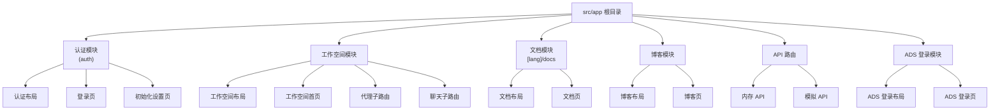
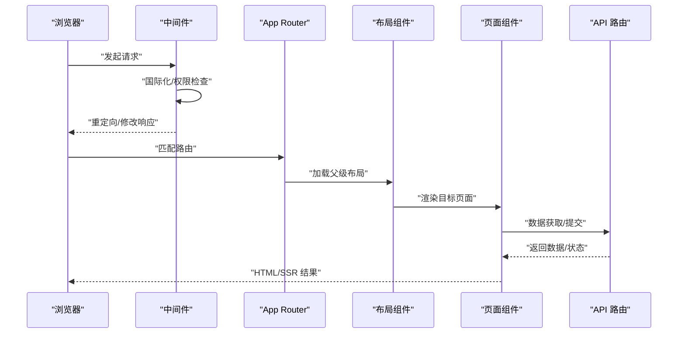
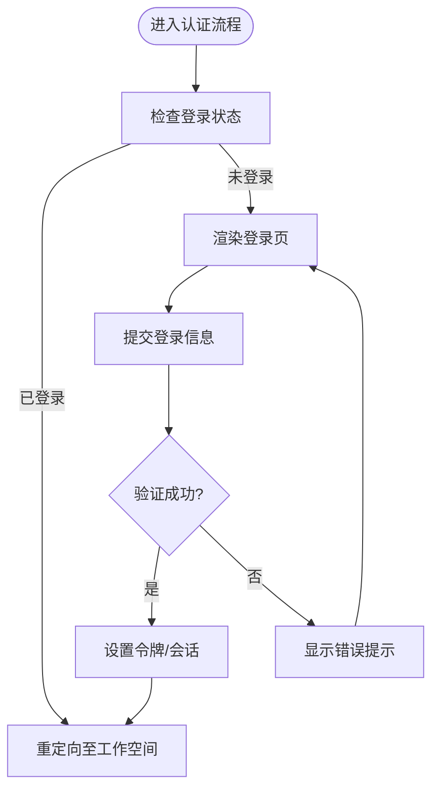
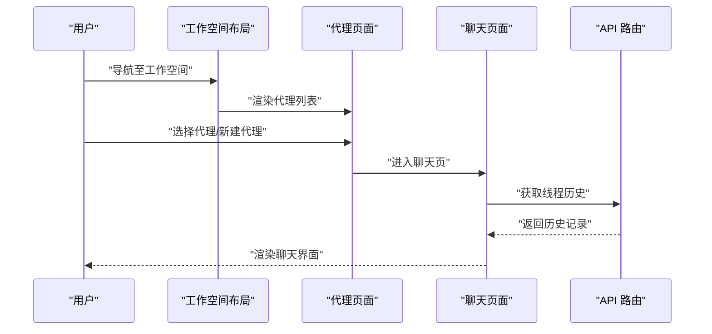
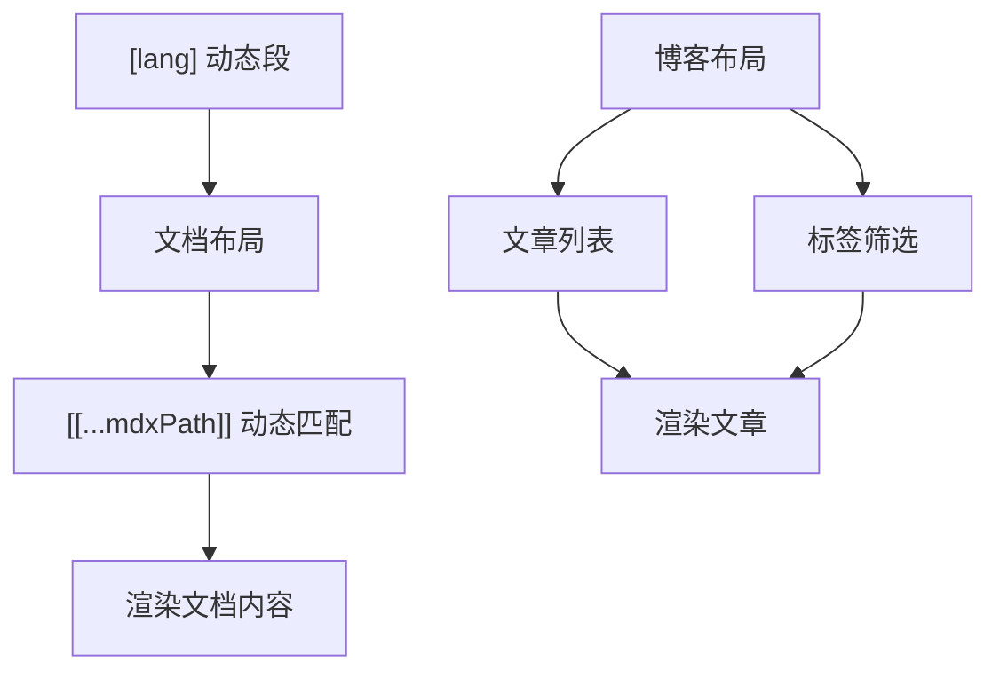
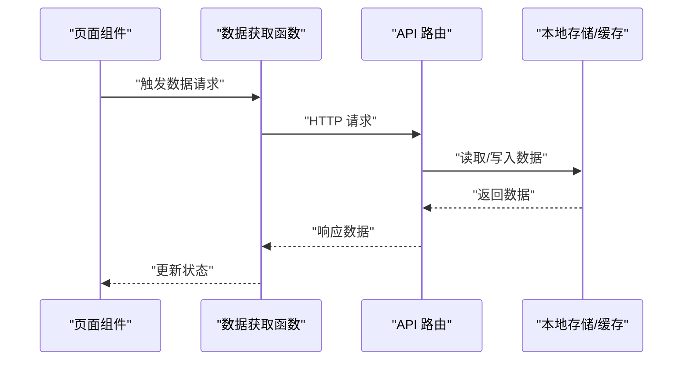
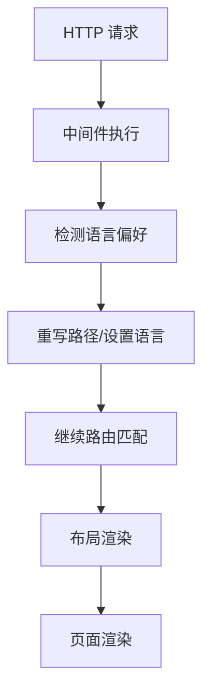
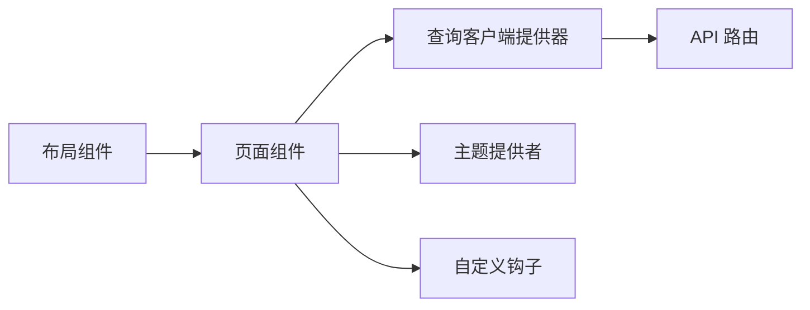

# Next.js 应用架构

<cite>
**本文档引用的文件**
- [frontend/src/app/layout.tsx](file://frontend/src/app/layout.tsx)
- [frontend/src/app/page.tsx](file://frontend/src/app/page.tsx)
- [frontend/src/app/(auth)/layout.tsx](file://frontend/src/app/(auth)/layout.tsx)
- [frontend/src/app/(auth)/login/page.tsx](file://frontend/src/app/(auth)/login/page.tsx)
- [frontend/src/app/workspace/layout.tsx](file://frontend/src/app/workspace/layout.tsx)
- [frontend/src/app/workspace/page.tsx](file://frontend/src/app/workspace/page.tsx)
- [frontend/src/app/blog/layout.tsx](file://frontend/src/app/blog/layout.tsx)
- [frontend/src/app/blog/[[...mdxPath]]/page.tsx](file://frontend/src/app/blog/[[...mdxPath]]/page.tsx)
- [frontend/src/app/[lang]/docs/layout.tsx](file://frontend/src/app/[lang]/docs/layout.tsx)
- [frontend/src/app/[lang]/docs/[[...mdxPath]]/page.tsx](file://frontend/src/app/[lang]/docs/[[...mdxPath]]/page.tsx)
- [frontend/src/app/ads-login/layout.tsx](file://frontend/src/app/ads-login/layout.tsx)
- [frontend/src/app/ads-login/page.tsx](file://frontend/src/app/ads-login/page.tsx)
- [frontend/src/app/api/memory/route.ts](file://frontend/src/app/api/memory/route.ts)
- [frontend/src/app/mock/api/threads/[thread_id]/history/route.ts](file://frontend/src/app/mock/api/threads/[thread_id]/history/route.ts)
- [frontend/middleware.ts](file://frontend/middleware.ts)
- [frontend/next.config.js](file://frontend/next.config.js)
- [frontend/package.json](file://frontend/package.json)
- [frontend/src/components/query-client-provider.tsx](file://frontend/src/components/query-client-provider.tsx)
- [frontend/src/components/theme-provider.tsx](file://frontend/src/components/theme-provider.tsx)
- [frontend/src/hooks/use-mobile.ts](file://frontend/src/hooks/use-mobile.ts)
- [frontend/src/hooks/use-global-shortcuts.ts](file://frontend/src/hooks/use-global-shortcuts.ts)
- [frontend/src/lib/utils.ts](file://frontend/src/lib/utils.ts)
- [frontend/src/env.js](file://frontend/src/env.js)
</cite>

## 目录
1. [引言](#引言)
2. [项目结构](#项目结构)
3. [核心组件](#核心组件)
4. [架构总览](#架构总览)
5. [详细组件分析](#详细组件分析)
6. [依赖关系分析](#依赖关系分析)
7. [性能考虑](#性能考虑)
8. [故障排除指南](#故障排除指南)
9. [结论](#结论)
10. [附录](#附录)

## 引言
本文件面向 DeerFlow 的 Next.js 16 前端应用，系统性梳理其基于 App Router 的路由设计模式（嵌套路由、布局系统、页面组件结构与数据获取策略），并结合实际源码解析应用的目录组织（根路由、认证路由、工作空间路由、文档与博客路由）、中间件系统、国际化支持、静态生成与 SSR 实现方式。同时提供可操作的实践建议，帮助开发者快速创建新路由、配置布局组件与实现数据流管理，并给出性能优化、SEO 最佳实践与用户体验设计原则。

## 项目结构
前端采用 Next.js App Router 的文件系统路由约定，所有路由以 src/app 下的层级结构定义。项目主要模块包括：
- 根布局与首页：全局布局与入口页
- 认证模块：登录、初始化设置等
- 工作空间模块：代理聊天、线程历史、新代理创建等
- 文档与博客模块：多语言文档与 MDX 支持
- API 路由：内存相关接口与模拟后端接口
- 中间件：国际化与访问控制
- 组件与工具：主题、查询客户端、移动端适配、通用工具

图表来源
- [frontend/src/app/layout.tsx](file://frontend/src/app/layout.tsx)
- [frontend/src/app/page.tsx](file://frontend/src/app/page.tsx)
- [frontend/src/app/(auth)/layout.tsx](file://frontend/src/app/(auth)/layout.tsx)
- [frontend/src/app/workspace/layout.tsx](file://frontend/src/app/workspace/layout.tsx)
- [frontend/src/app/[lang]/docs/layout.tsx](file://frontend/src/app/[lang]/docs/layout.tsx)
- [frontend/src/app/blog/layout.tsx](file://frontend/src/app/blog/layout.tsx)
- [frontend/src/app/api/memory/route.ts](file://frontend/src/app/api/memory/route.ts)
- [frontend/src/app/ads-login/layout.tsx](file://frontend/src/app/ads-login/layout.tsx)

章节来源
- [frontend/src/app/layout.tsx](file://frontend/src/app/layout.tsx)
- [frontend/src/app/page.tsx](file://frontend/src/app/page.tsx)

## 核心组件
- 全局布局与入口页
  - 根布局负责顶层容器、主题提供者与全局样式注入；入口页作为默认首页。
- 认证模块
  - 认证布局包裹登录与初始化设置页，统一处理登录态与跳转逻辑。
- 工作空间模块
  - 工作空间布局承载代理管理、聊天会话与线程历史；页面组件按功能拆分，支持嵌套路由与并行流。
- 文档与博客模块
  - 多语言文档通过动态段 [lang] 实现；博客支持 MDX 动态路径匹配。
- API 路由
  - 内存 API 提供服务端数据读写；模拟 API 用于开发调试。
- 中间件
  - 国际化与访问控制，根据请求上下文重定向或变更响应头。
- 组件与工具
  - 主题提供者、查询客户端提供器、移动端检测与快捷键钩子、通用工具函数。

章节来源
- [frontend/src/app/layout.tsx](file://frontend/src/app/layout.tsx)
- [frontend/src/app/page.tsx](file://frontend/src/app/page.tsx)
- [frontend/src/app/(auth)/layout.tsx](file://frontend/src/app/(auth)/layout.tsx)
- [frontend/src/app/workspace/layout.tsx](file://frontend/src/app/workspace/layout.tsx)
- [frontend/src/app/[lang]/docs/layout.tsx](file://frontend/src/app/[lang]/docs/layout.tsx)
- [frontend/src/app/blog/layout.tsx](file://frontend/src/app/blog/layout.tsx)
- [frontend/src/app/api/memory/route.ts](file://frontend/src/app/api/memory/route.ts)
- [frontend/middleware.ts](file://frontend/middleware.ts)
- [frontend/src/components/theme-provider.tsx](file://frontend/src/components/theme-provider.tsx)
- [frontend/src/components/query-client-provider.tsx](file://frontend/src/components/query-client-provider.tsx)
- [frontend/src/hooks/use-mobile.ts](file://frontend/src/hooks/use-mobile.ts)
- [frontend/src/hooks/use-global-shortcuts.ts](file://frontend/src/hooks/use-global-shortcuts.ts)
- [frontend/src/lib/utils.ts](file://frontend/src/lib/utils.ts)

## 架构总览
下图展示了从浏览器到页面组件、布局与 API 路由的整体调用链路，以及中间件在请求阶段的作用点。

图表来源
- [frontend/middleware.ts](file://frontend/middleware.ts)
- [frontend/src/app/layout.tsx](file://frontend/src/app/layout.tsx)
- [frontend/src/app/page.tsx](file://frontend/src/app/page.tsx)
- [frontend/src/app/api/memory/route.ts](file://frontend/src/app/api/memory/route.ts)

## 详细组件分析

### 根布局与入口页
- 根布局负责全局容器、主题提供者与样式注入，确保页面一致的外观与行为。
- 入口页作为默认首页，可直接映射到根路径，便于 SEO 与用户体验。

章节来源
- [frontend/src/app/layout.tsx](file://frontend/src/app/layout.tsx)
- [frontend/src/app/page.tsx](file://frontend/src/app/page.tsx)

### 认证模块
- 认证布局统一处理登录态与跳转，避免重复逻辑。
- 登录页与初始化设置页分别处理用户认证与环境初始化。

图表来源
- [frontend/src/app/(auth)/layout.tsx](file://frontend/src/app/(auth)/layout.tsx)
- [frontend/src/app/(auth)/login/page.tsx](file://frontend/src/app/(auth)/login/page.tsx)

章节来源
- [frontend/src/app/(auth)/layout.tsx](file://frontend/src/app/(auth)/layout.tsx)
- [frontend/src/app/(auth)/login/page.tsx](file://frontend/src/app/(auth)/login/page.tsx)

### 工作空间模块
- 工作空间布局承载代理管理、聊天会话与线程历史，页面组件按功能拆分，支持嵌套路由与并行流。
- 代理聊天与新代理创建页面分别处理对话与初始化流程。

图表来源
- [frontend/src/app/workspace/layout.tsx](file://frontend/src/app/workspace/layout.tsx)
- [frontend/src/app/workspace/page.tsx](file://frontend/src/app/workspace/page.tsx)
- [frontend/src/app/mock/api/threads/[thread_id]/history/route.ts](file://frontend/src/app/mock/api/threads/[thread_id]/history/route.ts)

章节来源
- [frontend/src/app/workspace/layout.tsx](file://frontend/src/app/workspace/layout.tsx)
- [frontend/src/app/workspace/page.tsx](file://frontend/src/app/workspace/page.tsx)

### 文档与博客模块
- 文档模块通过动态段 [lang] 实现多语言支持，MDX 动态路径匹配支持任意层级文档。
- 博客模块同样采用 MDX 动态路径，支持文章列表与标签筛选。

图表来源
- [frontend/src/app/[lang]/docs/layout.tsx](file://frontend/src/app/[lang]/docs/layout.tsx)
- [frontend/src/app/[lang]/docs/[[...mdxPath]]/page.tsx](file://frontend/src/app/[lang]/docs/[[...mdxPath]]/page.tsx)
- [frontend/src/app/blog/layout.tsx](file://frontend/src/app/blog/layout.tsx)
- [frontend/src/app/blog/[[...mdxPath]]/page.tsx](file://frontend/src/app/blog/[[...mdxPath]]/page.tsx)

章节来源
- [frontend/src/app/[lang]/docs/layout.tsx](file://frontend/src/app/[lang]/docs/layout.tsx)
- [frontend/src/app/[lang]/docs/[[...mdxPath]]/page.tsx](file://frontend/src/app/[lang]/docs/[[...mdxPath]]/page.tsx)
- [frontend/src/app/blog/layout.tsx](file://frontend/src/app/blog/layout.tsx)
- [frontend/src/app/blog/[[...mdxPath]]/page.tsx](file://frontend/src/app/blog/[[...mdxPath]]/page.tsx)

### API 路由与数据流
- 内存 API 提供服务端数据读写能力，适合需要 SSR 或服务端处理的场景。
- 模拟 API 用于开发调试，支持线程历史、工件等资源的本地化访问。

图表来源
- [frontend/src/app/api/memory/route.ts](file://frontend/src/app/api/memory/route.ts)
- [frontend/src/app/mock/api/threads/[thread_id]/history/route.ts](file://frontend/src/app/mock/api/threads/[thread_id]/history/route.ts)

章节来源
- [frontend/src/app/api/memory/route.ts](file://frontend/src/app/api/memory/route.ts)
- [frontend/src/app/mock/api/threads/[thread_id]/history/route.ts](file://frontend/src/app/mock/api/threads/[thread_id]/history/route.ts)

### 中间件系统与国际化
- 中间件在请求阶段执行，可用于国际化语言切换、访问控制与安全策略。
- 通过动态段 [lang] 与中间件配合，实现多语言路由与内容分发。

图表来源
- [frontend/middleware.ts](file://frontend/middleware.ts)
- [frontend/src/app/[lang]/docs/layout.tsx](file://frontend/src/app/[lang]/docs/layout.tsx)

章节来源
- [frontend/middleware.ts](file://frontend/middleware.ts)

### 主题与移动端适配
- 主题提供者负责全局主题切换与持久化。
- 移动端检测钩子用于响应式布局与交互优化。

章节来源
- [frontend/src/components/theme-provider.tsx](file://frontend/src/components/theme-provider.tsx)
- [frontend/src/hooks/use-mobile.ts](file://frontend/src/hooks/use-mobile.ts)

## 依赖关系分析
- 组件耦合与内聚
  - 布局组件与页面组件通过 React 子树组合，保持高内聚低耦合。
  - 查询客户端提供器集中管理数据缓存与并发策略。
- 外部依赖与集成
  - Next.js App Router、React Query、i18n 与构建配置共同构成运行时依赖。
- 可能的循环依赖
  - 布局与页面之间为单向依赖，无循环导入风险。

图表来源
- [frontend/src/app/layout.tsx](file://frontend/src/app/layout.tsx)
- [frontend/src/app/page.tsx](file://frontend/src/app/page.tsx)
- [frontend/src/components/query-client-provider.tsx](file://frontend/src/components/query-client-provider.tsx)
- [frontend/src/components/theme-provider.tsx](file://frontend/src/components/theme-provider.tsx)
- [frontend/src/hooks/use-mobile.ts](file://frontend/src/hooks/use-mobile.ts)

章节来源
- [frontend/src/components/query-client-provider.tsx](file://frontend/src/components/query-client-provider.tsx)
- [frontend/src/components/theme-provider.tsx](file://frontend/src/components/theme-provider.tsx)
- [frontend/src/hooks/use-mobile.ts](file://frontend/src/hooks/use-mobile.ts)

## 性能考虑
- 路由与渲染
  - 使用 App Router 的并行流与嵌套路由减少不必要的重渲染。
  - 将静态内容与动态内容分离，利用静态生成与增量静态再生（ISR）提升性能。
- 数据获取
  - 合理使用 Suspense 边界与渐进式渲染，避免阻塞主线程。
  - 对高频请求进行缓存与去抖，降低网络开销。
- 主题与资源
  - 主题提供者应避免频繁重渲染，使用稳定的状态管理。
  - 图片与媒体资源采用懒加载与合适的尺寸策略。

## 故障排除指南
- 路由不生效或 404
  - 确认文件命名与路径符合 Next.js 文件系统路由规范。
  - 检查动态段与可选捕获组的正则表达式是否正确。
- 国际化异常
  - 核对中间件中的语言检测逻辑与 [lang] 动态段的匹配规则。
  - 确保语言目录结构与路由一致。
- 数据获取失败
  - 检查 API 路由的请求参数与响应格式。
  - 在开发环境中使用模拟 API 进行隔离测试。

章节来源
- [frontend/middleware.ts](file://frontend/middleware.ts)
- [frontend/src/app/api/memory/route.ts](file://frontend/src/app/api/memory/route.ts)

## 结论
DeerFlow 的 Next.js 16 应用通过清晰的目录结构与 App Router 的嵌套路由、布局系统与页面组件实现了模块化的前端架构。结合中间件的国际化与访问控制、API 路由的数据获取策略，以及主题与移动端适配等组件，整体具备良好的可维护性与扩展性。建议在新增路由时遵循现有布局与数据流模式，在保证性能与 SEO 的前提下持续迭代用户体验。

## 附录

### 新路由创建步骤
- 在 src/app 下创建对应目录与 page.tsx 文件，确保文件名与路径符合 Next.js 约定。
- 如需国际化，使用 [lang] 动态段并在中间件中处理语言检测。
- 如需共享布局，复用现有布局组件并按需扩展。
- 如需服务端数据，新增 API 路由并在页面中通过数据获取函数调用。

章节来源
- [frontend/src/app/layout.tsx](file://frontend/src/app/layout.tsx)
- [frontend/src/app/page.tsx](file://frontend/src/app/page.tsx)
- [frontend/middleware.ts](file://frontend/middleware.ts)

### 布局组件配置要点
- 布局组件应包含必要的 Provider（如主题、查询客户端），并处理全局样式。
- 嵌套路由的布局应明确父子关系，避免重复渲染。
- 使用并行流与 Suspense 边界提升用户体验。

章节来源
- [frontend/src/components/theme-provider.tsx](file://frontend/src/components/theme-provider.tsx)
- [frontend/src/components/query-client-provider.tsx](file://frontend/src/components/query-client-provider.tsx)

### 数据流管理最佳实践
- 使用查询客户端提供器集中管理缓存与并发策略。
- 对高频请求进行去抖与合并，避免重复请求。
- 在页面中通过数据获取函数封装 API 调用，保持组件职责单一。

章节来源
- [frontend/src/components/query-client-provider.tsx](file://frontend/src/components/query-client-provider.tsx)
- [frontend/src/app/api/memory/route.ts](file://frontend/src/app/api/memory/route.ts)

### SEO 最佳实践
- 为页面设置标题与描述，结合动态段与元数据生成器。
- 利用静态生成与增量静态再生（ISR）提升索引速度。
- 为博客与文档提供结构化数据与站点地图。

### 用户体验设计原则
- 移动端优先：使用移动端检测钩子与响应式布局。
- 无障碍访问：确保键盘导航与屏幕阅读器友好。
- 渐进式渲染：使用 Suspense 边界与骨架屏提升感知性能。