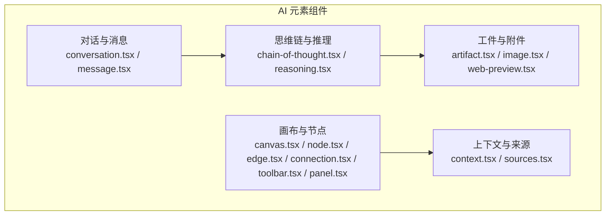
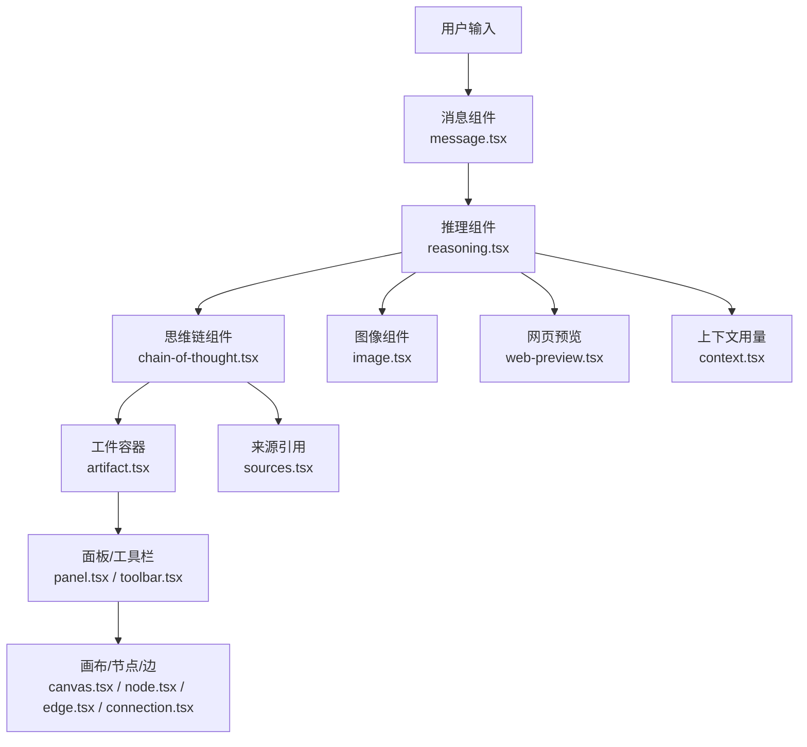
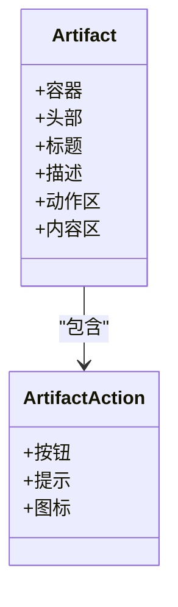
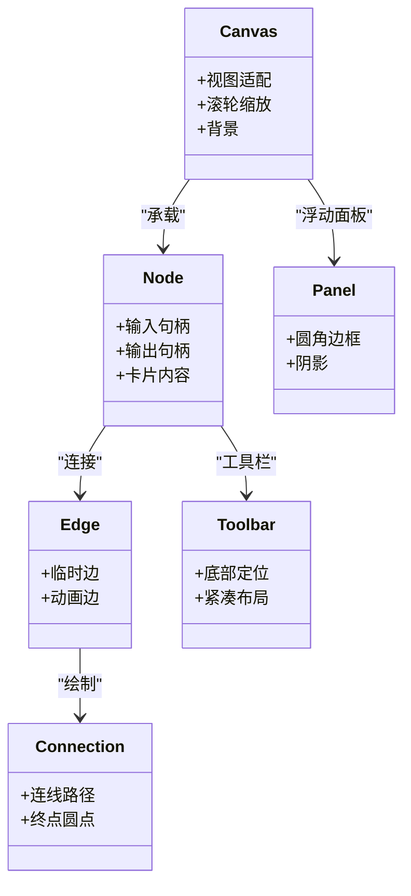
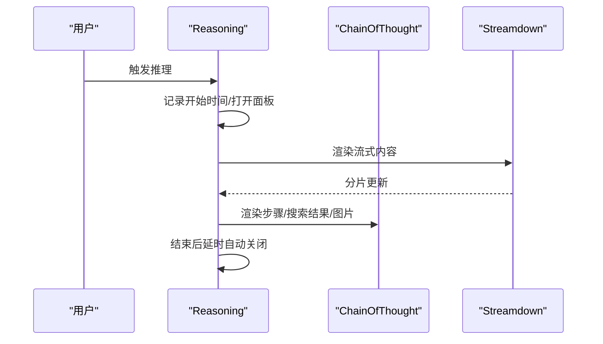
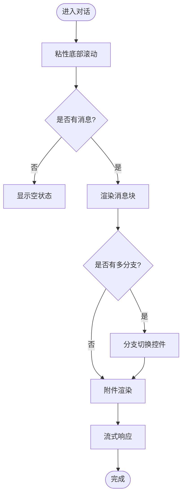
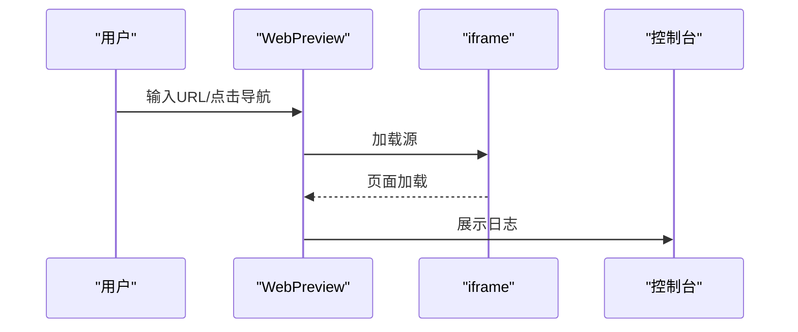
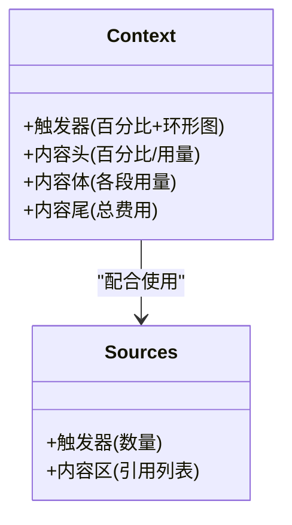
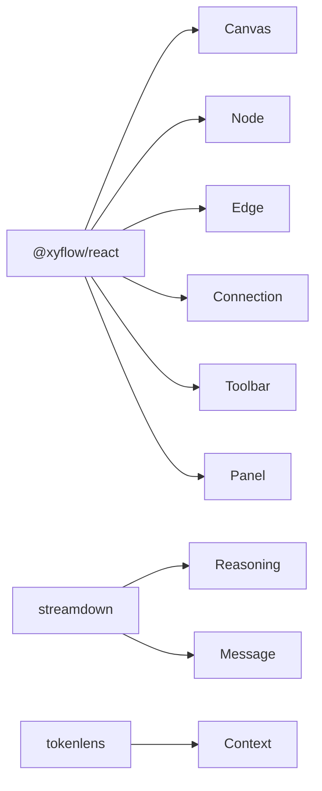

# AI 元素组件

<cite>
**本文档引用的文件**
- [artifact.tsx](file://frontend/src/components/ai-elements/artifact.tsx)
- [canvas.tsx](file://frontend/src/components/ai-elements/canvas.tsx)
- [chain-of-thought.tsx](file://frontend/src/components/ai-elements/chain-of-thought.tsx)
- [conversation.tsx](file://frontend/src/components/ai-elements/conversation.tsx)
- [message.tsx](file://frontend/src/components/ai-elements/message.tsx)
- [sources.tsx](file://frontend/src/components/ai-elements/sources.tsx)
- [node.tsx](file://frontend/src/components/ai-elements/node.tsx)
- [edge.tsx](file://frontend/src/components/ai-elements/edge.tsx)
- [connection.tsx](file://frontend/src/components/ai-elements/connection.tsx)
- [image.tsx](file://frontend/src/components/ai-elements/image.tsx)
- [context.tsx](file://frontend/src/components/ai-elements/context.tsx)
- [panel.tsx](file://frontend/src/components/ai-elements/panel.tsx)
- [web-preview.tsx](file://frontend/src/components/ai-elements/web-preview.tsx)
- [reasoning.tsx](file://frontend/src/components/ai-elements/reasoning.tsx)
- [toolbar.tsx](file://frontend/src/components/ai-elements/toolbar.tsx)
</cite>

## 目录
1. [简介](#简介)
2. [项目结构](#项目结构)
3. [核心组件](#核心组件)
4. [架构总览](#架构总览)
5. [组件详解](#组件详解)
6. [依赖关系分析](#依赖关系分析)
7. [性能考量](#性能考量)
8. [故障排查指南](#故障排查指南)
9. [结论](#结论)
10. [附录](#附录)

## 简介
本文件系统性梳理 DeerFlow 前端中专为 AI 智能体交互设计的“AI 元素组件”集合，覆盖工件展示、画布渲染、思维链显示、对话气泡、图像处理、消息渲染、节点连接、面板布局与引用来源等关键能力。文档从架构、数据结构、渲染逻辑与交互模式入手，结合可视化图示与使用建议，帮助开发者快速理解并高效集成这些组件于智能体编排与结果展示场景。

## 项目结构
AI 元素组件集中位于前端工程的 ai-elements 目录，采用按功能分层的组织方式：对话与消息（conversation、message）、思维链（chain-of-thought、reasoning）、工件与附件（artifact、image、web-preview）、画布与节点（canvas、node、edge、connection、toolbar、panel）、上下文与来源（context、sources）等。这些组件通过 React 组合与组合子模式，形成可复用、可扩展的智能体交互界面模块。

**图表来源**
- [conversation.tsx:1-101](file://frontend/src/components/ai-elements/conversation.tsx#L1-L101)
- [message.tsx:1-447](file://frontend/src/components/ai-elements/message.tsx#L1-L447)
- [chain-of-thought.tsx:1-240](file://frontend/src/components/ai-elements/chain-of-thought.tsx#L1-L240)
- [reasoning.tsx:1-189](file://frontend/src/components/ai-elements/reasoning.tsx#L1-L189)
- [artifact.tsx:1-151](file://frontend/src/components/ai-elements/artifact.tsx#L1-L151)
- [image.tsx:1-25](file://frontend/src/components/ai-elements/image.tsx#L1-L25)
- [web-preview.tsx:1-264](file://frontend/src/components/ai-elements/web-preview.tsx#L1-L264)
- [canvas.tsx:1-23](file://frontend/src/components/ai-elements/canvas.tsx#L1-L23)
- [node.tsx:1-72](file://frontend/src/components/ai-elements/node.tsx#L1-L72)
- [edge.tsx:1-141](file://frontend/src/components/ai-elements/edge.tsx#L1-L141)
- [connection.tsx:1-29](file://frontend/src/components/ai-elements/connection.tsx#L1-L29)
- [toolbar.tsx:1-17](file://frontend/src/components/ai-elements/toolbar.tsx#L1-L17)
- [panel.tsx:1-16](file://frontend/src/components/ai-elements/panel.tsx#L1-L16)
- [context.tsx:1-409](file://frontend/src/components/ai-elements/context.tsx#L1-L409)
- [sources.tsx:1-78](file://frontend/src/components/ai-elements/sources.tsx#L1-L78)

**章节来源**
- [artifact.tsx:1-151](file://frontend/src/components/ai-elements/artifact.tsx#L1-L151)
- [canvas.tsx:1-23](file://frontend/src/components/ai-elements/canvas.tsx#L1-L23)
- [chain-of-thought.tsx:1-240](file://frontend/src/components/ai-elements/chain-of-thought.tsx#L1-L240)
- [conversation.tsx:1-101](file://frontend/src/components/ai-elements/conversation.tsx#L1-L101)
- [message.tsx:1-447](file://frontend/src/components/ai-elements/message.tsx#L1-L447)
- [sources.tsx:1-78](file://frontend/src/components/ai-elements/sources.tsx#L1-L78)
- [node.tsx:1-72](file://frontend/src/components/ai-elements/node.tsx#L1-L72)
- [edge.tsx:1-141](file://frontend/src/components/ai-elements/edge.tsx#L1-L141)
- [connection.tsx:1-29](file://frontend/src/components/ai-elements/connection.tsx#L1-L29)
- [image.tsx:1-25](file://frontend/src/components/ai-elements/image.tsx#L1-L25)
- [context.tsx:1-409](file://frontend/src/components/ai-elements/context.tsx#L1-L409)
- [panel.tsx:1-16](file://frontend/src/components/ai-elements/panel.tsx#L1-L16)
- [web-preview.tsx:1-264](file://frontend/src/components/ai-elements/web-preview.tsx#L1-L264)
- [reasoning.tsx:1-189](file://frontend/src/components/ai-elements/reasoning.tsx#L1-L189)
- [toolbar.tsx:1-17](file://frontend/src/components/ai-elements/toolbar.tsx#L1-L17)

## 核心组件
- 工件容器与动作：提供统一的工件容器、标题、描述、操作区与带提示的按钮，便于承载多模态输出与交互。
- 画布与节点：基于 React Flow 提供可拖拽、缩放、连线的画布，节点内置输入/输出句柄，支持临时与动画边。
- 思维链与推理：以可折叠面板形式呈现思考过程，支持步骤、搜索结果、图片与流式内容渲染。
- 对话与消息：对话滚动容器、空状态、滚动到底部按钮；消息块支持分支切换、附件、工具栏与流式响应。
- 图像与网页预览：生成图像渲染、网页 iframe 预览与控制台日志。
- 上下文与来源：模型用量与费用可视化、来源引用折叠面板。
- 面板与工具栏：画布上的悬浮工具栏与信息面板样式。

**章节来源**
- [artifact.tsx:14-151](file://frontend/src/components/ai-elements/artifact.tsx#L14-L151)
- [canvas.tsx:5-23](file://frontend/src/components/ai-elements/canvas.tsx#L5-L23)
- [node.tsx:14-72](file://frontend/src/components/ai-elements/node.tsx#L14-L72)
- [edge.tsx:137-141](file://frontend/src/components/ai-elements/edge.tsx#L137-L141)
- [connection.tsx:5-29](file://frontend/src/components/ai-elements/connection.tsx#L5-L29)
- [chain-of-thought.tsx:45-240](file://frontend/src/components/ai-elements/chain-of-thought.tsx#L45-L240)
- [reasoning.tsx:34-189](file://frontend/src/components/ai-elements/reasoning.tsx#L34-L189)
- [conversation.tsx:10-101](file://frontend/src/components/ai-elements/conversation.tsx#L10-L101)
- [message.tsx:23-447](file://frontend/src/components/ai-elements/message.tsx#L23-L447)
- [image.tsx:4-25](file://frontend/src/components/ai-elements/image.tsx#L4-L25)
- [web-preview.tsx:38-264](file://frontend/src/components/ai-elements/web-preview.tsx#L38-L264)
- [context.tsx:42-409](file://frontend/src/components/ai-elements/context.tsx#L42-L409)
- [sources.tsx:12-78](file://frontend/src/components/ai-elements/sources.tsx#L12-L78)
- [panel.tsx:5-16](file://frontend/src/components/ai-elements/panel.tsx#L5-L16)
- [toolbar.tsx:5-17](file://frontend/src/components/ai-elements/toolbar.tsx#L5-L17)

## 架构总览
AI 元素组件围绕“对话-思维链-工件-画布”的主路径协作，形成如下闭环：用户输入触发消息与思维链渲染；推理过程可产出图像或网页链接；最终以工件形式汇总展示；复杂流程可在画布上以节点/边可视化表达，并通过上下文与来源进行溯源与成本度量。

**图表来源**
- [message.tsx:23-447](file://frontend/src/components/ai-elements/message.tsx#L23-L447)
- [reasoning.tsx:34-189](file://frontend/src/components/ai-elements/reasoning.tsx#L34-L189)
- [chain-of-thought.tsx:45-240](file://frontend/src/components/ai-elements/chain-of-thought.tsx#L45-L240)
- [image.tsx:4-25](file://frontend/src/components/ai-elements/image.tsx#L4-L25)
- [web-preview.tsx:38-264](file://frontend/src/components/ai-elements/web-preview.tsx#L38-L264)
- [artifact.tsx:14-151](file://frontend/src/components/ai-elements/artifact.tsx#L14-L151)
- [panel.tsx:5-16](file://frontend/src/components/ai-elements/panel.tsx#L5-L16)
- [toolbar.tsx:5-17](file://frontend/src/components/ai-elements/toolbar.tsx#L5-L17)
- [canvas.tsx:5-23](file://frontend/src/components/ai-elements/canvas.tsx#L5-L23)
- [node.tsx:14-72](file://frontend/src/components/ai-elements/node.tsx#L14-L72)
- [edge.tsx:137-141](file://frontend/src/components/ai-elements/edge.tsx#L137-L141)
- [connection.tsx:5-29](file://frontend/src/components/ai-elements/connection.tsx#L5-L29)
- [context.tsx:42-409](file://frontend/src/components/ai-elements/context.tsx#L42-L409)
- [sources.tsx:12-78](file://frontend/src/components/ai-elements/sources.tsx#L12-L78)

## 组件详解

### 工件容器与动作（Artifact）
- 功能要点
  - 容器、头部、标题、描述、动作区与内容区的语义化拆分。
  - 可选提示气泡的图标按钮，支持自定义图标与标签。
  - 关闭按钮与操作按钮的尺寸与变体默认值，保证一致的交互体验。
- 数据与渲染
  - 通过类名合并与属性透传，确保主题与布局一致性。
- 适用场景
  - 展示分析报告、可视化图表、网页链接、代码片段等多模态产物。

**图表来源**
- [artifact.tsx:14-151](file://frontend/src/components/ai-elements/artifact.tsx#L14-L151)

**章节来源**
- [artifact.tsx:14-151](file://frontend/src/components/ai-elements/artifact.tsx#L14-L151)

### 画布与节点（Canvas、Node、Edge、Connection、Toolbar、Panel）
- 功能要点
  - Canvas：启用视图适配、滚轮缩放、选择拖拽，背景色与主题变量联动。
  - Node：内置输入/输出句柄，支持左右位置；卡片式结构便于嵌套内容。
  - Edge：提供临时边（虚线）与动画边（贝塞尔曲线+小球沿路径运动）。
  - Connection：自定义连线路径与终点圆点，用于拖拽连线阶段。
  - Toolbar：节点工具栏，底部定位，紧凑布局。
  - Panel：画布浮动面板，圆角边框与阴影提升层级感。
- 数据与渲染
  - 通过 React Flow 的 Handle 与 Position 实现节点间连接；动画边利用 SVG motion 实现流动效果。
- 适用场景
  - 智能体流程编排、工具调用序列、决策分支可视化。

**图表来源**
- [canvas.tsx:5-23](file://frontend/src/components/ai-elements/canvas.tsx#L5-L23)
- [node.tsx:14-72](file://frontend/src/components/ai-elements/node.tsx#L14-L72)
- [edge.tsx:137-141](file://frontend/src/components/ai-elements/edge.tsx#L137-L141)
- [connection.tsx:5-29](file://frontend/src/components/ai-elements/connection.tsx#L5-L29)
- [toolbar.tsx:5-17](file://frontend/src/components/ai-elements/toolbar.tsx#L5-L17)
- [panel.tsx:5-16](file://frontend/src/components/ai-elements/panel.tsx#L5-L16)

**章节来源**
- [canvas.tsx:5-23](file://frontend/src/components/ai-elements/canvas.tsx#L5-L23)
- [node.tsx:14-72](file://frontend/src/components/ai-elements/node.tsx#L14-L72)
- [edge.tsx:42-141](file://frontend/src/components/ai-elements/edge.tsx#L42-L141)
- [connection.tsx:5-29](file://frontend/src/components/ai-elements/connection.tsx#L5-L29)
- [toolbar.tsx:5-17](file://frontend/src/components/ai-elements/toolbar.tsx#L5-L17)
- [panel.tsx:5-16](file://frontend/src/components/ai-elements/panel.tsx#L5-L16)

### 思维链与推理（ChainOfThought、Reasoning）
- 功能要点
  - ChainOfThought：可折叠头部、步骤列表、搜索结果徽标、内容区与图片容器。
  - Reasoning：自动展开/收起、时长统计、流式渲染插件、占位动效。
- 数据与渲染
  - 使用受控状态与上下文传递，确保父子组件协同；流式渲染通过 Streamdown 插件实现。
- 适用场景
  - 展示 LLM 的中间推理过程、搜索结果与可视化证据。

**图表来源**
- [reasoning.tsx:45-189](file://frontend/src/components/ai-elements/reasoning.tsx#L45-L189)
- [chain-of-thought.tsx:51-240](file://frontend/src/components/ai-elements/chain-of-thought.tsx#L51-L240)

**章节来源**
- [chain-of-thought.tsx:45-240](file://frontend/src/components/ai-elements/chain-of-thought.tsx#L45-L240)
- [reasoning.tsx:34-189](file://frontend/src/components/ai-elements/reasoning.tsx#L34-L189)

### 对话与消息（Conversation、Message）
- 功能要点
  - Conversation：粘性底部滚动容器，空状态与自动滚动到底部按钮。
  - Message：区分用户/助手角色、内容区、动作区、分支切换（多分支树）、附件（图片/文件）、工具栏。
- 数据与渲染
  - 使用上下文管理分支索引与总数；附件根据媒体类型动态渲染；流式响应通过 Streamdown 组件。
- 适用场景
  - 聊天界面、多轮对话、分支式输出对比。

**图表来源**
- [conversation.tsx:12-101](file://frontend/src/components/ai-elements/conversation.tsx#L12-L101)
- [message.tsx:132-447](file://frontend/src/components/ai-elements/message.tsx#L132-L447)

**章节来源**
- [conversation.tsx:10-101](file://frontend/src/components/ai-elements/conversation.tsx#L10-L101)
- [message.tsx:23-447](file://frontend/src/components/ai-elements/message.tsx#L23-L447)

### 图像与网页预览（Image、WebPreview）
- 功能要点
  - Image：基于 data URI 渲染生成图像，支持自定义 alt 与类名。
  - WebPreview：URL 输入、导航按钮、iframe 预览、控制台日志折叠面板。
- 数据与渲染
  - 图像通过媒体类型与 base64 数据拼接；预览使用沙箱策略保障安全。
- 适用场景
  - 文生图结果展示、网页链接预览与调试。

**图表来源**
- [image.tsx:4-25](file://frontend/src/components/ai-elements/image.tsx#L4-L25)
- [web-preview.tsx:38-264](file://frontend/src/components/ai-elements/web-preview.tsx#L38-L264)

**章节来源**
- [image.tsx:4-25](file://frontend/src/components/ai-elements/image.tsx#L4-L25)
- [web-preview.tsx:38-264](file://frontend/src/components/ai-elements/web-preview.tsx#L38-L264)

### 上下文与来源（Context、Sources）
- 功能要点
  - Context：悬停卡片展示 Token 使用率、进度条、输入/输出/推理/缓存用量与费用估算。
  - Sources：可折叠来源面板，触发器显示数量，内容区列出引用链接。
- 数据与渲染
  - 使用 tokenlens 计算费用；数字格式化本地化显示。
- 适用场景
  - 成本监控、结果溯源、合规审计。

**图表来源**
- [context.tsx:42-409](file://frontend/src/components/ai-elements/context.tsx#L42-L409)
- [sources.tsx:12-78](file://frontend/src/components/ai-elements/sources.tsx#L12-L78)

**章节来源**
- [context.tsx:42-409](file://frontend/src/components/ai-elements/context.tsx#L42-L409)
- [sources.tsx:12-78](file://frontend/src/components/ai-elements/sources.tsx#L12-L78)

## 依赖关系分析
- 组件内聚与耦合
  - 大多数组件为纯展示型，通过上下文与受控状态降低耦合。
  - Canvas/Node/Edge/Connection/Toolbar/Panel 形成强关联的画布生态。
- 外部依赖
  - React Flow：画布与节点/边渲染。
  - Streamdown：流式内容渲染与插件扩展。
  - tokenlens：Token 用量与费用计算。
- 循环依赖
  - 未发现直接循环导入；上下文仅单向传递。

**图表来源**
- [canvas.tsx:1-23](file://frontend/src/components/ai-elements/canvas.tsx#L1-L23)
- [node.tsx:1-72](file://frontend/src/components/ai-elements/node.tsx#L1-L72)
- [edge.tsx:1-141](file://frontend/src/components/ai-elements/edge.tsx#L1-L141)
- [connection.tsx:1-29](file://frontend/src/components/ai-elements/connection.tsx#L1-L29)
- [toolbar.tsx:1-17](file://frontend/src/components/ai-elements/toolbar.tsx#L1-L17)
- [panel.tsx:1-16](file://frontend/src/components/ai-elements/panel.tsx#L1-L16)
- [reasoning.tsx:1-189](file://frontend/src/components/ai-elements/reasoning.tsx#L1-L189)
- [message.tsx:1-447](file://frontend/src/components/ai-elements/message.tsx#L1-L447)
- [context.tsx:1-409](file://frontend/src/components/ai-elements/context.tsx#L1-L409)

**章节来源**
- [reasoning.tsx:1-189](file://frontend/src/components/ai-elements/reasoning.tsx#L1-L189)
- [message.tsx:1-447](file://frontend/src/components/ai-elements/message.tsx#L1-L447)
- [context.tsx:1-409](file://frontend/src/components/ai-elements/context.tsx#L1-L409)
- [canvas.tsx:1-23](file://frontend/src/components/ai-elements/canvas.tsx#L1-L23)

## 性能考量
- 流式渲染
  - Reasoning 与 Message 的流式内容通过 Streamdown 渲染，避免大文本一次性渲染带来的卡顿。
- 动画与重绘
  - Edge 的动画小球使用 SVG motion，路径复用减少重排；Canvas 默认禁用双击缩放与拖拽删除键，降低误操作触发的重渲染。
- 附件与图片
  - Image 采用 data URI，避免额外网络请求；Message 附件懒渲染与悬停可见，减少初始开销。
- 滚动与虚拟化
  - Conversation 使用粘性底部滚动，避免频繁 DOM 重建；若消息量极大，建议引入虚拟列表进一步优化。

## 故障排查指南
- 思维链/推理不显示
  - 检查 Reasoning 的 isStreaming 状态与默认展开设置；确认流式内容插件已正确注入。
- 画布无边或连线异常
  - 确认 Node 的句柄位置与 Edge 的句柄坐标计算；检查临时边与动画边的切换条件。
- 消息附件无法移除
  - 确保 MessageAttachment 的 onRemove 回调正确传递；检查按钮的事件冒泡与可见性逻辑。
- 网页预览空白
  - 校验 URL 是否合法与跨域策略；确认沙箱属性允许脚本与表单；查看控制台日志。
- 上下文用量不更新
  - 确认 Context 的 usedTokens/maxTokens/usage/modelId 参数是否同步；检查 tokenlens 的模型 ID 映射。

**章节来源**
- [reasoning.tsx:45-189](file://frontend/src/components/ai-elements/reasoning.tsx#L45-L189)
- [edge.tsx:105-141](file://frontend/src/components/ai-elements/edge.tsx#L105-L141)
- [message.tsx:322-447](file://frontend/src/components/ai-elements/message.tsx#L322-L447)
- [web-preview.tsx:172-264](file://frontend/src/components/ai-elements/web-preview.tsx#L172-L264)
- [context.tsx:42-409](file://frontend/src/components/ai-elements/context.tsx#L42-L409)

## 结论
DeerFlow 的 AI 元素组件以清晰的职责划分与可组合的设计，构建了从对话到思维链、从工件到画布的完整智能体交互管线。通过流式渲染、上下文可视化与来源追踪，既满足结果展示需求，又兼顾成本与合规。建议在实际项目中遵循组件的上下文与受控状态约定，结合业务场景灵活组合，以获得最佳的开发与用户体验。

## 附录
- 最佳实践
  - 将 Reasoning 与 ChainOfThought 组合使用，先展示思考摘要再展开细节。
  - 在 Canvas 中使用 Toolbar 快速执行节点操作，Panel 作为信息补充。
  - 使用 Context 与 Sources 强制透明化成本与来源，便于审计与优化。
- 扩展方向
  - 增加更多流式插件（如数学公式、Mermaid 图）以丰富 Reasoning 内容。
  - 在 Message 中增加“复制/引用/导出”等动作，提升工件复用效率。