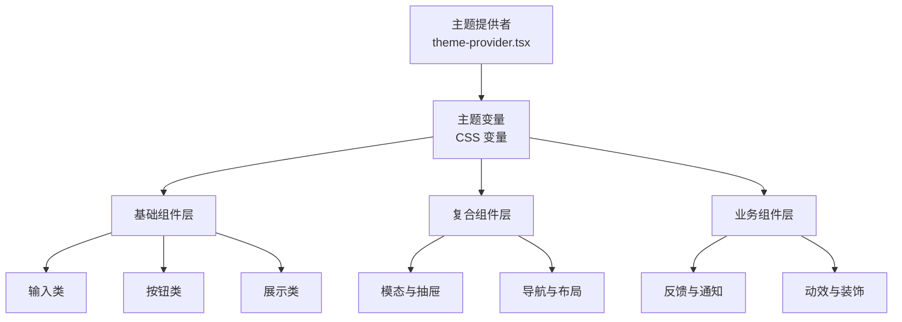
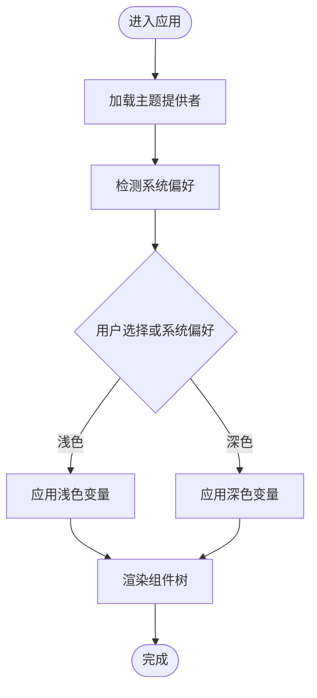
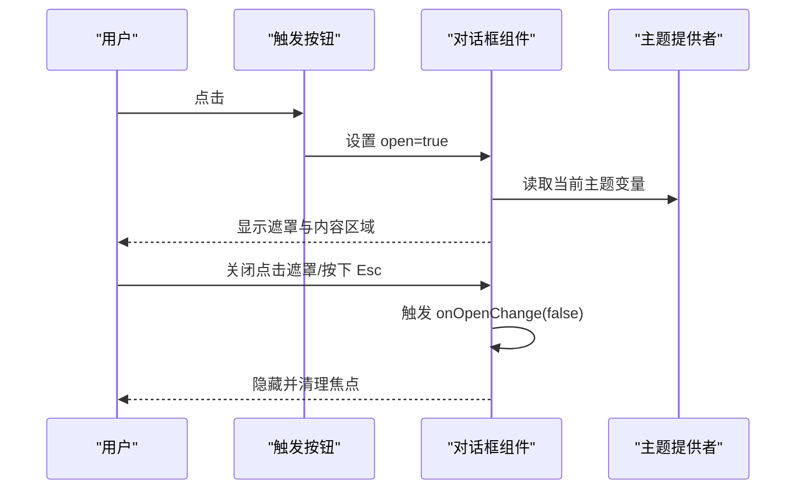
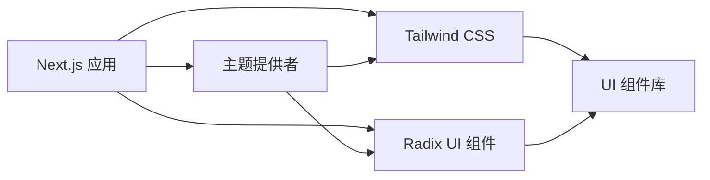

# UI 组件库

<cite>
**本文引用的文件**
- [frontend/src/components/theme-provider.tsx](file://frontend/src/components/theme-provider.tsx)
- [frontend/src/components/ui/button.tsx](file://frontend/src/components/ui/button.tsx)
- [frontend/src/components/ui/input.tsx](file://frontend/src/components/ui/input.tsx)
- [frontend/src/components/ui/dialog.tsx](file://frontend/src/components/ui/dialog.tsx)
- [frontend/src/components/ui/card.tsx](file://frontend/src/components/ui/card.tsx)
- [frontend/src/components/ui/select.tsx](file://frontend/src/components/ui/select.tsx)
- [frontend/src/components/ui/tabs.tsx](file://frontend/src/components/ui/tabs.tsx)
- [frontend/src/components/ui/switch.tsx](file://frontend/src/components/ui/switch.tsx)
- [frontend/src/components/ui/tooltip.tsx](file://frontend/src/components/ui/tooltip.tsx)
- [frontend/src/components/ui/badge.tsx](file://frontend/src/components/ui/badge.tsx)
- [frontend/src/components/ui/avatar.tsx](file://frontend/src/components/ui/avatar.tsx)
- [frontend/src/components/ui/progress.tsx](file://frontend/src/components/ui/progress.tsx)
- [frontend/src/components/ui/scroll-area.tsx](file://frontend/src/components/ui/scroll-area.tsx)
- [frontend/src/components/ui/resizable.tsx](file://frontend/src/components/ui/resizable.tsx)
- [frontend/src/components/ui/dropdown-menu.tsx](file://frontend/src/components/ui/dropdown-menu.tsx)
- [frontend/src/components/ui/command.tsx](file://frontend/src/components/ui/command.tsx)
- [frontend/src/components/ui/sidebar.tsx](file://frontend/src/components/ui/sidebar.tsx)
- [frontend/src/components/ui/sonner.tsx](file://frontend/src/components/ui/sonner.tsx)
- [frontend/src/components/ui/textarea.tsx](file://frontend/src/components/ui/textarea.tsx)
- [frontend/src/components/ui/alert.tsx](file://frontend/src/components/ui/alert.tsx)
- [frontend/src/components/ui/empty.tsx](file://frontend/src/components/ui/empty.tsx)
- [frontend/src/components/ui/skeleton.tsx](file://frontend/src/components/ui/skeleton.tsx)
- [frontend/src/components/ui/item.tsx](file://frontend/src/components/ui/item.tsx)
- [frontend/src/components/ui/toggle.tsx](file://frontend/src/components/ui/toggle.tsx)
- [frontend/src/components/ui/toggle-group.tsx](file://frontend/src/components/ui/toggle-group.tsx)
- [frontend/src/components/ui/button-group.tsx](file://frontend/src/components/ui/button-group.tsx)
- [frontend/src/components/ui/input-group.tsx](file://frontend/src/components/ui/input-group.tsx)
- [frontend/src/components/ui/breadcrumb.tsx](file://frontend/src/components/ui/breadcrumb.tsx)
- [frontend/src/components/ui/collapsible.tsx](file://frontend/src/components/ui/collapsible.tsx)
- [frontend/src/components/ui/hover-card.tsx](file://frontend/src/components/ui/hover-card.tsx)
- [frontend/src/components/ui/separator.tsx](file://frontend/src/components/ui/separator.tsx)
- [frontend/src/components/ui/sheet.tsx](file://frontend/src/components/ui/sheet.tsx)
- [frontend/src/components/ui/word-rotate.tsx](file://frontend/src/components/ui/word-rotate.tsx)
- [frontend/src/components/ui/number-ticker.tsx](file://frontend/src/components/ui/number-ticker.tsx)
- [frontend/src/components/ui/flickering-grid.tsx](file://frontend/src/components/ui/flickering-grid.tsx)
- [frontend/src/components/ui/magic-bento.tsx](file://frontend/src/components/ui/magic-bento.tsx)
- [frontend/src/components/ui/spotlight-card.tsx](file://frontend/src/components/ui/spotlight-card.tsx)
- [frontend/src/components/ui/terminal.tsx](file://frontend/src/components/ui/terminal.tsx)
- [frontend/src/components/ui/confetti-button.tsx](file://frontend/src/components/ui/confetti-button.tsx)
- [frontend/src/components/ui/aurora-text.tsx](file://frontend/src/components/ui/aurora-text.tsx)
- [frontend/src/components/ui/shine-border.tsx](file://frontend/src/components/ui/shine-border.tsx)
- [frontend/src/components/ui/galaxy.jsx](file://frontend/src/components/ui/galaxy.jsx)
- [frontend/src/styles/globals.css](file://frontend/src/styles/globals.css)
- [frontend/package.json](file://frontend/package.json)
- [frontend/tsconfig.json](file://frontend/tsconfig.json)
- [frontend/next.config.js](file://frontend/next.config.js)
- [frontend/postcss.config.js](file://frontend/postcss.config.js)
</cite>

## 目录
1. [简介](#简介)
2. [项目结构](#项目结构)
3. [核心组件](#核心组件)
4. [架构总览](#架构总览)
5. [详细组件分析](#详细组件分析)
6. [依赖关系分析](#依赖关系分析)
7. [性能考虑](#性能考虑)
8. [故障排除指南](#故障排除指南)
9. [结论](#结论)
10. [附录](#附录)

## 简介
本设计文档面向 DeerFlow 的 UI 组件库，系统性阐述基于 Radix UI 与 Tailwind CSS 的组件体系：从基础输入、按钮、布局到复合交互组件（如对话框、侧边栏、标签页）以及业务增强组件（如提示卡、数字动画、粒子背景等）。文档覆盖组件功能特性、属性配置、事件处理、样式定制、主题系统（深浅色模式）、可访问性支持、组合模式、状态管理集成与性能优化策略，并通过图示帮助读者快速理解组件间的协作关系。

## 项目结构
前端组件库位于 frontend/src/components/ui，采用“按功能分层 + 原子化样式”的组织方式：
- 基础组件：button、input、textarea、select、switch、toggle、badge、avatar、progress、scroll-area、resizable、separator、tooltip、alert、empty、skeleton、item 等
- 复合组件：dialog、sheet、sidebar、tabs、dropdown-menu、command、hover-card、collapsible、breadcrumb、toggle-group、button-group、input-group 等
- 业务组件：sonner（通知）、confetti-button（彩花按钮）、word-rotate（文字旋转）、number-ticker（数字滚动）、flickering-grid（闪烁网格）、magic-bento（魔方拼盘）、spotlight-card（聚光卡片）、terminal（终端风格）、shine-border（光泽边框）、aurora-text（极光文字）、galaxy（星系背景）
- 主题与样式：theme-provider.tsx 提供主题上下文；globals.css 定义全局样式与变量；Tailwind 与 PostCSS 配置在 next.config.js 与 postcss.config.js 中生效

```mermaid
graph TB
subgraph "主题与样式"
TP["theme-provider.tsx"]
GCSS["styles/globals.css"]
end
subgraph "基础组件"
BTN["ui/button.tsx"]
INP["ui/input.tsx"]
TXTA["ui/textarea.tsx"]
SEL["ui/select.tsx"]
SW["ui/switch.tsx"]
TOG["ui/toggle.tsx"]
BAD["ui/badge.tsx"]
AVA["ui/avatar.tsx"]
PROG["ui/progress.tsx"]
SCROLL["ui/scroll-area.tsx"]
RES["ui/resizable.tsx"]
SEP["ui/separator.tsx"]
TIP["ui/tooltip.tsx"]
ALERT["ui/alert.tsx"]
EMPTY["ui/empty.tsx"]
SKELETON["ui/skeleton.tsx"]
ITEM["ui/item.tsx"]
end
subgraph "复合组件"
DLG["ui/dialog.tsx"]
SHEET["ui/sheet.tsx"]
SBAR["ui/sidebar.tsx"]
TABS["ui/tabs.tsx"]
DDM["ui/dropdown-menu.tsx"]
CMD["ui/command.tsx"]
HCARD["ui/hover-card.tsx"]
COLL["ui/collapsible.tsx"]
BREAD["ui/breadcrumb.tsx"]
TG["ui/toggle-group.tsx"]
BG["ui/button-group.tsx"]
IG["ui/input-group.tsx"]
end
subgraph "业务组件"
SNS["ui/sonner.tsx"]
CONF["ui/confetti-button.tsx"]
WR["ui/word-rotate.tsx"]
NT["ui/number-ticker.tsx"]
FG["ui/flickering-grid.tsx"]
MB["ui/magic-bento.tsx"]
SC["ui/spotlight-card.tsx"]
TERM["ui/terminal.tsx"]
SHINE["ui/shine-border.tsx"]
AT["ui/aurora-text.tsx"]
GALAXY["ui/galaxy.jsx"]
end
TP --> BTN
TP --> INP
TP --> DLG
TP --> TABS
TP --> SNS
GCSS --> BTN
GCSS --> DLG
GCSS --> SNS
```

图表来源
- [frontend/src/components/theme-provider.tsx](file://frontend/src/components/theme-provider.tsx)
- [frontend/src/components/ui/button.tsx](file://frontend/src/components/ui/button.tsx)
- [frontend/src/components/ui/dialog.tsx](file://frontend/src/components/ui/dialog.tsx)
- [frontend/src/components/ui/tabs.tsx](file://frontend/src/components/ui/tabs.tsx)
- [frontend/src/components/ui/sonner.tsx](file://frontend/src/components/ui/sonner.tsx)
- [frontend/src/styles/globals.css](file://frontend/src/styles/globals.css)

章节来源
- [frontend/src/components/theme-provider.tsx](file://frontend/src/components/theme-provider.tsx)
- [frontend/src/styles/globals.css](file://frontend/src/styles/globals.css)

## 核心组件
本节概述组件库的核心能力与设计理念：
- 可访问性优先：组件广泛使用语义化标签与键盘导航，确保屏幕阅读器友好
- 原子化与组合：以最小可用单元构建复杂界面，支持灵活组合
- 主题一致性：通过 CSS 变量与 Tailwind 工具类统一风格
- 渐进增强：基础 HTML 元素之上叠加 Radix UI 的无障碍交互与状态管理

章节来源
- [frontend/src/components/ui/button.tsx](file://frontend/src/components/ui/button.tsx)
- [frontend/src/components/ui/input.tsx](file://frontend/src/components/ui/input.tsx)
- [frontend/src/components/ui/dialog.tsx](file://frontend/src/components/ui/dialog.tsx)
- [frontend/src/components/ui/card.tsx](file://frontend/src/components/ui/card.tsx)

## 架构总览
组件库采用“主题上下文 + 原子组件 + 复合容器 + 业务增强”的分层架构：
- 主题上下文：提供深浅色模式切换与品牌色系映射
- 原子组件：最小交互单元，专注单一职责
- 复合组件：封装复杂交互与状态，如对话框、侧边栏、标签页
- 业务组件：面向具体场景的增强型展示组件

图表来源
- [frontend/src/components/theme-provider.tsx](file://frontend/src/components/theme-provider.tsx)
- [frontend/src/styles/globals.css](file://frontend/src/styles/globals.css)

## 详细组件分析

### 主题系统与样式定制
- 深浅色模式：通过主题提供者集中管理当前主题状态，影响所有组件的颜色映射与对比度
- 颜色系统：基于语义化命名（如 primary、secondary、destructive、muted），结合 Tailwind 调色板与 CSS 变量
- 响应式断点：利用 Tailwind 断点与媒体查询，确保组件在桌面/平板/手机上的自适应表现
- 样式隔离：业务组件通过独立样式文件（如 galaxy.css、spotlight-card.css）实现局部样式控制

图表来源
- [frontend/src/components/theme-provider.tsx](file://frontend/src/components/theme-provider.tsx)
- [frontend/src/styles/globals.css](file://frontend/src/styles/globals.css)

章节来源
- [frontend/src/components/theme-provider.tsx](file://frontend/src/components/theme-provider.tsx)
- [frontend/src/styles/globals.css](file://frontend/src/styles/globals.css)

### 基础组件族谱

```mermaid
classDiagram
class Button {
+variant : "default|outline|ghost|link"
+size : "sm|md|lg"
+disabled : boolean
+onClick(event)
}
class Input {
+type : "text|email|password|search"
+value : string
+onChange(value)
+placeholder : string
+error : boolean
}
class Textarea {
+value : string
+onChange(value)
+rows : number
}
class Select {
+value : string
+onValueChange(value)
+options : Option[]
}
class Switch {
+checked : boolean
+onCheckedChange(checked)
}
class Badge {
+variant : "default|secondary|destructive|outline"
+children : ReactNode
}
class Avatar {
+src : string
+alt : string
+fallback : string
}
class Progress {
+value : number
+max : number
}
class Tooltip {
+content : string
+children : ReactNode
}
class Alert {
+title : string
+description : string
+variant : "default|destructive"
}
class Empty {
+image : string
+title : string
+description : string
}
class Skeleton {
+width : string
+height : string
+rounded : boolean
}
class Item {
+label : string
+value : string
+icon : ReactNode
}
```

图表来源
- [frontend/src/components/ui/button.tsx](file://frontend/src/components/ui/button.tsx)
- [frontend/src/components/ui/input.tsx](file://frontend/src/components/ui/input.tsx)
- [frontend/src/components/ui/textarea.tsx](file://frontend/src/components/ui/textarea.tsx)
- [frontend/src/components/ui/select.tsx](file://frontend/src/components/ui/select.tsx)
- [frontend/src/components/ui/switch.tsx](file://frontend/src/components/ui/switch.tsx)
- [frontend/src/components/ui/badge.tsx](file://frontend/src/components/ui/badge.tsx)
- [frontend/src/components/ui/avatar.tsx](file://frontend/src/components/ui/avatar.tsx)
- [frontend/src/components/ui/progress.tsx](file://frontend/src/components/ui/progress.tsx)
- [frontend/src/components/ui/tooltip.tsx](file://frontend/src/components/ui/tooltip.tsx)
- [frontend/src/components/ui/alert.tsx](file://frontend/src/components/ui/alert.tsx)
- [frontend/src/components/ui/empty.tsx](file://frontend/src/components/ui/empty.tsx)
- [frontend/src/components/ui/skeleton.tsx](file://frontend/src/components/ui/skeleton.tsx)
- [frontend/src/components/ui/item.tsx](file://frontend/src/components/ui/item.tsx)

章节来源
- [frontend/src/components/ui/button.tsx](file://frontend/src/components/ui/button.tsx)
- [frontend/src/components/ui/input.tsx](file://frontend/src/components/ui/input.tsx)
- [frontend/src/components/ui/textarea.tsx](file://frontend/src/components/ui/textarea.tsx)
- [frontend/src/components/ui/select.tsx](file://frontend/src/components/ui/select.tsx)
- [frontend/src/components/ui/switch.tsx](file://frontend/src/components/ui/switch.tsx)
- [frontend/src/components/ui/badge.tsx](file://frontend/src/components/ui/badge.tsx)
- [frontend/src/components/ui/avatar.tsx](file://frontend/src/components/ui/avatar.tsx)
- [frontend/src/components/ui/progress.tsx](file://frontend/src/components/ui/progress.tsx)
- [frontend/src/components/ui/tooltip.tsx](file://frontend/src/components/ui/tooltip.tsx)
- [frontend/src/components/ui/alert.tsx](file://frontend/src/components/ui/alert.tsx)
- [frontend/src/components/ui/empty.tsx](file://frontend/src/components/ui/empty.tsx)
- [frontend/src/components/ui/skeleton.tsx](file://frontend/src/components/ui/skeleton.tsx)
- [frontend/src/components/ui/item.tsx](file://frontend/src/components/ui/item.tsx)

### 复合组件族谱

```mermaid
classDiagram
class Dialog {
+open : boolean
+onOpenChange(open)
+title : string
+description : string
+children : ReactNode
}
class Sheet {
+open : boolean
+onOpenChange(open)
+side : "right|left|top|bottom"
+children : ReactNode
}
class Sidebar {
+open : boolean
+onOpenChange(open)
+children : ReactNode
}
class Tabs {
+value : string
+onValueChange(value)
+children : ReactNode
}
class DropdownMenu {
+children : ReactNode
+align : "start|end"
}
class Command {
+children : ReactNode
+filter(value, search) : boolean
}
class HoverCard {
+children : ReactNode
+content : ReactNode
}
class Collapsible {
+open : boolean
+onOpenChange(open)
+children : ReactNode
}
class Breadcrumb {
+items : BreadcrumbItem[]
}
class ToggleGroup {
+type : "single|multiple"
+value : string|string[]
+onValueChange(value)
}
class ButtonGroup {
+orientation : "horizontal|vertical"
+children : ReactNode
}
class InputGroup {
+prepend : ReactNode
+append : ReactNode
+children : ReactNode
}
```

图表来源
- [frontend/src/components/ui/dialog.tsx](file://frontend/src/components/ui/dialog.tsx)
- [frontend/src/components/ui/sheet.tsx](file://frontend/src/components/ui/sheet.tsx)
- [frontend/src/components/ui/sidebar.tsx](file://frontend/src/components/ui/sidebar.tsx)
- [frontend/src/components/ui/tabs.tsx](file://frontend/src/components/ui/tabs.tsx)
- [frontend/src/components/ui/dropdown-menu.tsx](file://frontend/src/components/ui/dropdown-menu.tsx)
- [frontend/src/components/ui/command.tsx](file://frontend/src/components/ui/command.tsx)
- [frontend/src/components/ui/hover-card.tsx](file://frontend/src/components/ui/hover-card.tsx)
- [frontend/src/components/ui/collapsible.tsx](file://frontend/src/components/ui/collapsible.tsx)
- [frontend/src/components/ui/breadcrumb.tsx](file://frontend/src/components/ui/breadcrumb.tsx)
- [frontend/src/components/ui/toggle-group.tsx](file://frontend/src/components/ui/toggle-group.tsx)
- [frontend/src/components/ui/button-group.tsx](file://frontend/src/components/ui/button-group.tsx)
- [frontend/src/components/ui/input-group.tsx](file://frontend/src/components/ui/input-group.tsx)

章节来源
- [frontend/src/components/ui/dialog.tsx](file://frontend/src/components/ui/dialog.tsx)
- [frontend/src/components/ui/sheet.tsx](file://frontend/src/components/ui/sheet.tsx)
- [frontend/src/components/ui/sidebar.tsx](file://frontend/src/components/ui/sidebar.tsx)
- [frontend/src/components/ui/tabs.tsx](file://frontend/src/components/ui/tabs.tsx)
- [frontend/src/components/ui/dropdown-menu.tsx](file://frontend/src/components/ui/dropdown-menu.tsx)
- [frontend/src/components/ui/command.tsx](file://frontend/src/components/ui/command.tsx)
- [frontend/src/components/ui/hover-card.tsx](file://frontend/src/components/ui/hover-card.tsx)
- [frontend/src/components/ui/collapsible.tsx](file://frontend/src/components/ui/collapsible.tsx)
- [frontend/src/components/ui/breadcrumb.tsx](file://frontend/src/components/ui/breadcrumb.tsx)
- [frontend/src/components/ui/toggle-group.tsx](file://frontend/src/components/ui/toggle-group.tsx)
- [frontend/src/components/ui/button-group.tsx](file://frontend/src/components/ui/button-group.tsx)
- [frontend/src/components/ui/input-group.tsx](file://frontend/src/components/ui/input-group.tsx)

### 业务组件族谱

```mermaid
classDiagram
class Sonner {
+toast(options)
+dismiss(toastId)
}
class ConfettiButton {
+children : ReactNode
+onSuccess()
}
class WordRotate {
+words : string[]
+duration : number
}
class NumberTicker {
+from : number
+to : number
+decimals : number
}
class FlickeringGrid {
+opacity : number
+color : string
+size : number
}
class MagicBento {
+children : ReactNode[]
+layout : string
}
class SpotlightCard {
+title : string
+description : string
+image : string
}
class Terminal {
+value : string
+onChange(value)
}
class ShineBorder {
+children : ReactNode
+color : string[]
}
class AuroraText {
+text : string
+color : string[]
}
class Galaxy {
+starsCount : number
+backgroundColor : string
}
```

图表来源
- [frontend/src/components/ui/sonner.tsx](file://frontend/src/components/ui/sonner.tsx)
- [frontend/src/components/ui/confetti-button.tsx](file://frontend/src/components/ui/confetti-button.tsx)
- [frontend/src/components/ui/word-rotate.tsx](file://frontend/src/components/ui/word-rotate.tsx)
- [frontend/src/components/ui/number-ticker.tsx](file://frontend/src/components/ui/number-ticker.tsx)
- [frontend/src/components/ui/flickering-grid.tsx](file://frontend/src/components/ui/flickering-grid.tsx)
- [frontend/src/components/ui/magic-bento.tsx](file://frontend/src/components/ui/magic-bento.tsx)
- [frontend/src/components/ui/spotlight-card.tsx](file://frontend/src/components/ui/spotlight-card.tsx)
- [frontend/src/components/ui/terminal.tsx](file://frontend/src/components/ui/terminal.tsx)
- [frontend/src/components/ui/shine-border.tsx](file://frontend/src/components/ui/shine-border.tsx)
- [frontend/src/components/ui/aurora-text.tsx](file://frontend/src/components/ui/aurora-text.tsx)
- [frontend/src/components/ui/galaxy.jsx](file://frontend/src/components/ui/galaxy.jsx)

章节来源
- [frontend/src/components/ui/sonner.tsx](file://frontend/src/components/ui/sonner.tsx)
- [frontend/src/components/ui/confetti-button.tsx](file://frontend/src/components/ui/confetti-button.tsx)
- [frontend/src/components/ui/word-rotate.tsx](file://frontend/src/components/ui/word-rotate.tsx)
- [frontend/src/components/ui/number-ticker.tsx](file://frontend/src/components/ui/number-ticker.tsx)
- [frontend/src/components/ui/flickering-grid.tsx](file://frontend/src/components/ui/flickering-grid.tsx)
- [frontend/src/components/ui/magic-bento.tsx](file://frontend/src/components/ui/magic-bento.tsx)
- [frontend/src/components/ui/spotlight-card.tsx](file://frontend/src/components/ui/spotlight-card.tsx)
- [frontend/src/components/ui/terminal.tsx](file://frontend/src/components/ui/terminal.tsx)
- [frontend/src/components/ui/shine-border.tsx](file://frontend/src/components/ui/shine-border.tsx)
- [frontend/src/components/ui/aurora-text.tsx](file://frontend/src/components/ui/aurora-text.tsx)
- [frontend/src/components/ui/galaxy.jsx](file://frontend/src/components/ui/galaxy.jsx)

### 组件使用流程（以对话框为例）

图表来源
- [frontend/src/components/ui/dialog.tsx](file://frontend/src/components/ui/dialog.tsx)
- [frontend/src/components/theme-provider.tsx](file://frontend/src/components/theme-provider.tsx)

章节来源
- [frontend/src/components/ui/dialog.tsx](file://frontend/src/components/ui/dialog.tsx)
- [frontend/src/components/theme-provider.tsx](file://frontend/src/components/theme-provider.tsx)

### 组合模式与状态管理集成
- 组合模式：通过 ButtonGroup/ToggleGroup 实现互斥/多选按钮组；InputGroup 将前置/后置元素与输入框组合
- 状态管理：Dialog/Sidebar 等复合组件通过 open/onOpenChange 管理受控状态；Tabs 通过 value/onValueChange 同步当前标签页
- 表单集成：Input/Select/Textarea 支持受控与非受控两种模式，配合表单库进行校验与提交

章节来源
- [frontend/src/components/ui/button-group.tsx](file://frontend/src/components/ui/button-group.tsx)
- [frontend/src/components/ui/toggle-group.tsx](file://frontend/src/components/ui/toggle-group.tsx)
- [frontend/src/components/ui/input-group.tsx](file://frontend/src/components/ui/input-group.tsx)
- [frontend/src/components/ui/dialog.tsx](file://frontend/src/components/ui/dialog.tsx)
- [frontend/src/components/ui/sidebar.tsx](file://frontend/src/components/ui/sidebar.tsx)
- [frontend/src/components/ui/tabs.tsx](file://frontend/src/components/ui/tabs.tsx)
- [frontend/src/components/ui/input.tsx](file://frontend/src/components/ui/input.tsx)
- [frontend/src/components/ui/select.tsx](file://frontend/src/components/ui/select.tsx)
- [frontend/src/components/ui/textarea.tsx](file://frontend/src/components/ui/textarea.tsx)

## 依赖关系分析
- 组件依赖 Radix UI 原子组件与交互行为，确保可访问性与跨平台一致性
- Tailwind CSS 提供原子化样式工具，结合 CSS 变量实现主题切换
- Next.js 配置启用 PostCSS 与 Tailwind，保证样式编译与按需输出
- 业务组件可能引入第三方库（如动画、粒子效果），需注意体积与性能

图表来源
- [frontend/next.config.js](file://frontend/next.config.js)
- [frontend/postcss.config.js](file://frontend/postcss.config.js)
- [frontend/package.json](file://frontend/package.json)

章节来源
- [frontend/next.config.js](file://frontend/next.config.js)
- [frontend/postcss.config.js](file://frontend/postcss.config.js)
- [frontend/package.json](file://frontend/package.json)

## 性能考虑
- 懒加载与分割：对重型业务组件（如 galaxy、flickering-grid）按需引入，避免首屏阻塞
- 样式优化：使用 Tailwind 的 purge 与 tree-shaking，移除未使用样式
- 动画节流：对高频动画（如 number-ticker、word-rotate）设置帧率上限与缓存策略
- 可访问性成本：保持最小 DOM 层级与语义标签，减少屏幕阅读器渲染压力
- 缓存策略：利用浏览器缓存与 CDN 加速静态资源

## 故障排除指南
- 主题不生效：检查主题提供者是否包裹根组件；确认 CSS 变量是否正确注入
- 对话框无法关闭：确认 open 为受控属性且 onOpenChange 正确更新；检查 ESC 键盘事件绑定
- 下拉菜单位置异常：调整 align 参数与容器定位；确保父级有相对定位
- 输入框样式错位：核对 Tailwind 类顺序与自定义样式的优先级
- 动画卡顿：降低动画频率或使用 transform 替代 layout 变更；在移动端禁用复杂动画

章节来源
- [frontend/src/components/theme-provider.tsx](file://frontend/src/components/theme-provider.tsx)
- [frontend/src/components/ui/dialog.tsx](file://frontend/src/components/ui/dialog.tsx)
- [frontend/src/components/ui/dropdown-menu.tsx](file://frontend/src/components/ui/dropdown-menu.tsx)
- [frontend/src/components/ui/input.tsx](file://frontend/src/components/ui/input.tsx)

## 结论
DeerFlow 的 UI 组件库以 Radix UI 为基础，结合 Tailwind CSS 实现高可定制、强可访问性的组件体系。通过主题提供者统一风格，以原子组件与复合组件分层组织，辅以丰富的业务组件满足多样化场景。建议在实际工程中遵循组合模式、受控状态与性能优化原则，持续完善可访问性与跨端一致性。

## 附录
- 最佳实践清单
  - 使用语义化标签与 aria-* 属性
  - 为交互元素提供键盘可达性
  - 控制动画时长与缓动曲线
  - 在移动端优先考虑触摸目标尺寸
  - 为图片与头像提供 fallback
  - 使用受控组件统一状态来源
- 可访问性参考
  - 对话框与模态需管理焦点环路
  - 下拉菜单需支持键盘导航与快捷键
  - 进度条与数值变化需提供文本描述