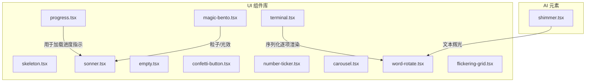
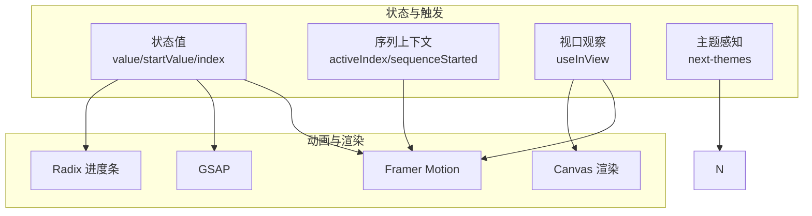
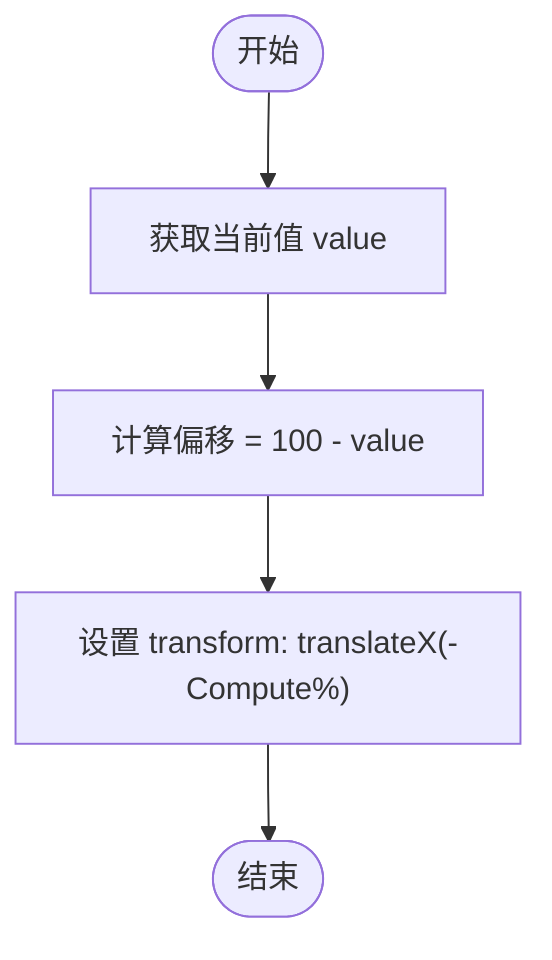
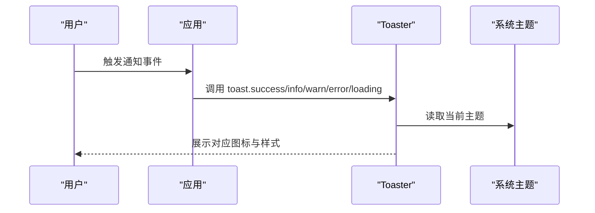
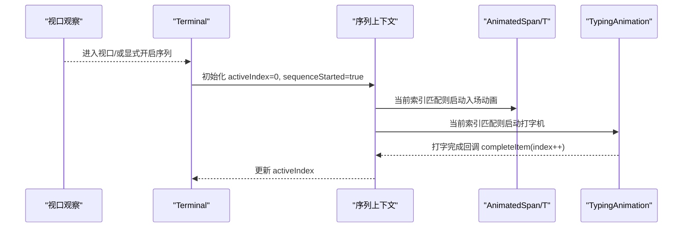
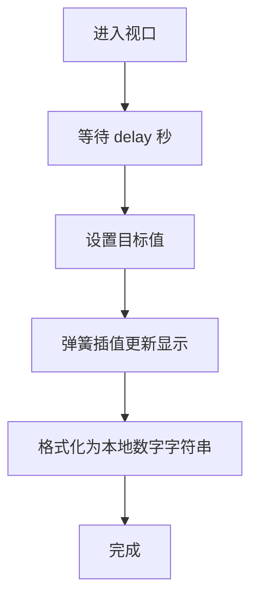
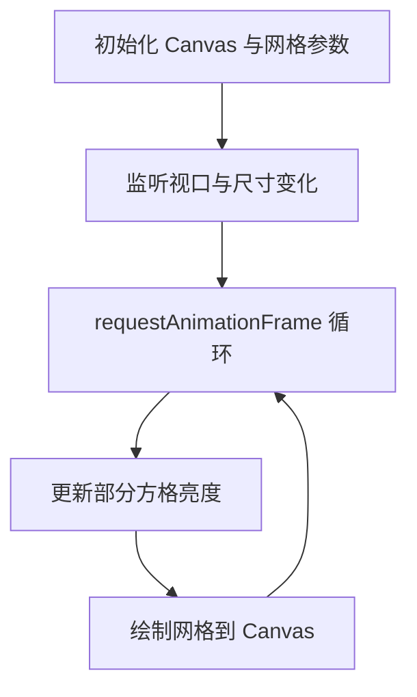
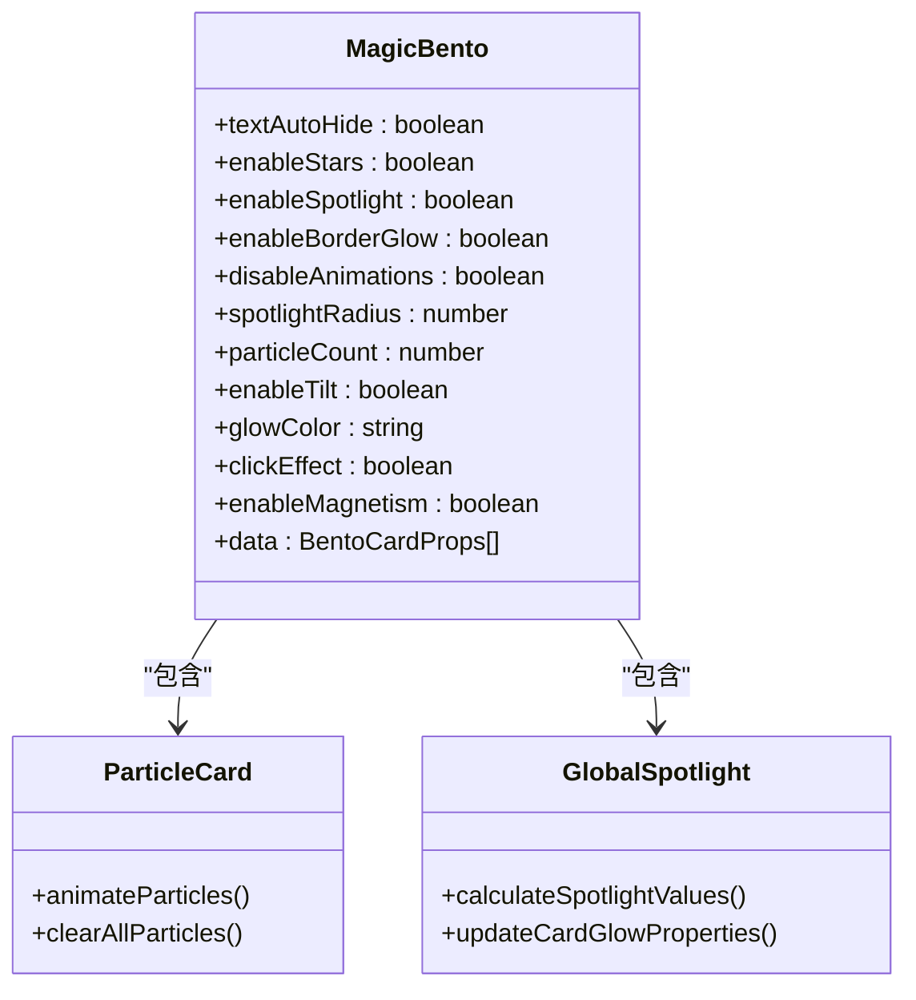
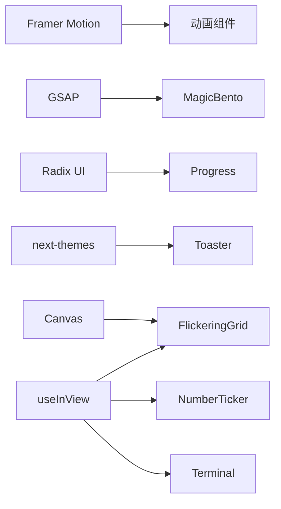

# 专用组件

<cite>
**本文引用的文件**
- [frontend/src/components/ui/progress.tsx](file://frontend/src/components/ui/progress.tsx)
- [frontend/src/components/ui/skeleton.tsx](file://frontend/src/components/ui/skeleton.tsx)
- [frontend/src/components/ui/sonner.tsx](file://frontend/src/components/ui/sonner.tsx)
- [frontend/src/components/ui/terminal.tsx](file://frontend/src/components/ui/terminal.tsx)
- [frontend/src/components/ui/empty.tsx](file://frontend/src/components/ui/empty.tsx)
- [frontend/src/components/ui/confetti-button.tsx](file://frontend/src/components/ui/confetti-button.tsx)
- [frontend/src/components/ui/number-ticker.tsx](file://frontend/src/components/ui/number-ticker.tsx)
- [frontend/src/components/ui/carousel.tsx](file://frontend/src/components/ui/carousel.tsx)
- [frontend/src/components/ui/word-rotate.tsx](file://frontend/src/components/ui/word-rotate.tsx)
- [frontend/src/components/ui/flickering-grid.tsx](file://frontend/src/components/ui/flickering-grid.tsx)
- [frontend/src/components/ui/magic-bento.tsx](file://frontend/src/components/ui/magic-bento.tsx)
- [frontend/src/components/ai-elements/shimmer.tsx](file://frontend/src/components/ai-elements/shimmer.tsx)
</cite>

## 目录
1. [简介](#简介)
2. [项目结构](#项目结构)
3. [核心组件](#核心组件)
4. [架构总览](#架构总览)
5. [组件详解](#组件详解)
6. [依赖关系分析](#依赖关系分析)
7. [性能考量](#性能考量)
8. [故障排查指南](#故障排查指南)
9. [结论](#结论)
10. [附录](#附录)

## 简介
本文件面向 DeerFlow 前端“专用组件”集合，聚焦于具备特殊动效与交互体验的组件：进度条、骨架屏、通知系统、终端界面、空状态占位符、彩纸按钮、数字计数器、文字轮播、闪烁网格、魔法拼盘与文字辉光等。文档从架构、数据流、处理逻辑、集成点、错误处理与性能优化等维度进行深入解析，并提供场景化示例、最佳实践与视觉设计建议，帮助开发者在数据加载、结果展示与用户反馈中高效使用这些组件。

## 项目结构
专用组件主要位于前端工程的 UI 组件库与 AI 元素模块中，采用按功能域分层组织：
- UI 组件库：progress、skeleton、sonner、terminal、empty、confetti-button、number-ticker、carousel、word-rotate、flickering-grid、magic-bento 等
- AI 元素：shimmer（文字辉光）

图表来源
- [frontend/src/components/ui/progress.tsx:1-32](file://frontend/src/components/ui/progress.tsx#L1-L32)
- [frontend/src/components/ui/skeleton.tsx:1-14](file://frontend/src/components/ui/skeleton.tsx#L1-L14)
- [frontend/src/components/ui/sonner.tsx:1-41](file://frontend/src/components/ui/sonner.tsx#L1-L41)
- [frontend/src/components/ui/terminal.tsx:1-258](file://frontend/src/components/ui/terminal.tsx#L1-L258)
- [frontend/src/components/ui/empty.tsx:1-105](file://frontend/src/components/ui/empty.tsx#L1-L105)
- [frontend/src/components/ui/confetti-button.tsx:1-50](file://frontend/src/components/ui/confetti-button.tsx#L1-L50)
- [frontend/src/components/ui/number-ticker.tsx:1-68](file://frontend/src/components/ui/number-ticker.tsx#L1-L68)
- [frontend/src/components/ui/carousel.tsx:1-242](file://frontend/src/components/ui/carousel.tsx#L1-L242)
- [frontend/src/components/ui/word-rotate.tsx:1-54](file://frontend/src/components/ui/word-rotate.tsx#L1-L54)
- [frontend/src/components/ui/flickering-grid.tsx:1-203](file://frontend/src/components/ui/flickering-grid.tsx#L1-L203)
- [frontend/src/components/ui/magic-bento.tsx:1-714](file://frontend/src/components/ui/magic-bento.tsx#L1-L714)
- [frontend/src/components/ai-elements/shimmer.tsx:1-65](file://frontend/src/components/ai-elements/shimmer.tsx#L1-L65)

章节来源
- [frontend/src/components/ui/progress.tsx:1-32](file://frontend/src/components/ui/progress.tsx#L1-L32)
- [frontend/src/components/ui/skeleton.tsx:1-14](file://frontend/src/components/ui/skeleton.tsx#L1-L14)
- [frontend/src/components/ui/sonner.tsx:1-41](file://frontend/src/components/ui/sonner.tsx#L1-L41)
- [frontend/src/components/ui/terminal.tsx:1-258](file://frontend/src/components/ui/terminal.tsx#L1-L258)
- [frontend/src/components/ui/empty.tsx:1-105](file://frontend/src/components/ui/empty.tsx#L1-L105)
- [frontend/src/components/ui/confetti-button.tsx:1-50](file://frontend/src/components/ui/confetti-button.tsx#L1-L50)
- [frontend/src/components/ui/number-ticker.tsx:1-68](file://frontend/src/components/ui/number-ticker.tsx#L1-L68)
- [frontend/src/components/ui/carousel.tsx:1-242](file://frontend/src/components/ui/carousel.tsx#L1-L242)
- [frontend/src/components/ui/word-rotate.tsx:1-54](file://frontend/src/components/ui/word-rotate.tsx#L1-L54)
- [frontend/src/components/ui/flickering-grid.tsx:1-203](file://frontend/src/components/ui/flickering-grid.tsx#L1-L203)
- [frontend/src/components/ui/magic-bento.tsx:1-714](file://frontend/src/components/ui/magic-bento.tsx#L1-L714)
- [frontend/src/components/ai-elements/shimmer.tsx:1-65](file://frontend/src/components/ai-elements/shimmer.tsx#L1-L65)

## 核心组件
- 进度条：基于 Radix Progress 实现，支持数值驱动的进度指示与过渡动画
- 骨架屏：轻量级占位样式，配合动画脉冲营造加载态
- 通知系统：基于 Sonner 的全局提示容器，适配主题系统与图标映射
- 终端界面：序列化渲染、视口触发与打字机效果组合，构建沉浸式输出体验
- 空状态占位符：结构化布局（标题/描述/媒体/内容），便于统一视觉与交互
- 彩纸按钮：点击时在按钮中心发射彩纸粒子，增强正向反馈
- 数字计数器：进入视口后以弹簧动效从起始值平滑过渡到目标值
- 文字轮播：周期性切换单词，结合辉光文本与出场入场动效
- 闪烁网格：基于 Canvas 的像素网格，随机闪烁生成科技感背景
- 魔法拼盘：卡片网格，支持星光、边框辉光、磁吸、倾斜与点击涟漪等复合动效
- 文字辉光：可配置扩散宽度与持续时间的文字渐变辉光

章节来源
- [frontend/src/components/ui/progress.tsx:1-32](file://frontend/src/components/ui/progress.tsx#L1-L32)
- [frontend/src/components/ui/skeleton.tsx:1-14](file://frontend/src/components/ui/skeleton.tsx#L1-L14)
- [frontend/src/components/ui/sonner.tsx:1-41](file://frontend/src/components/ui/sonner.tsx#L1-L41)
- [frontend/src/components/ui/terminal.tsx:1-258](file://frontend/src/components/ui/terminal.tsx#L1-L258)
- [frontend/src/components/ui/empty.tsx:1-105](file://frontend/src/components/ui/empty.tsx#L1-L105)
- [frontend/src/components/ui/confetti-button.tsx:1-50](file://frontend/src/components/ui/confetti-button.tsx#L1-L50)
- [frontend/src/components/ui/number-ticker.tsx:1-68](file://frontend/src/components/ui/number-ticker.tsx#L1-L68)
- [frontend/src/components/ui/word-rotate.tsx:1-54](file://frontend/src/components/ui/word-rotate.tsx#L1-L54)
- [frontend/src/components/ui/flickering-grid.tsx:1-203](file://frontend/src/components/ui/flickering-grid.tsx#L1-L203)
- [frontend/src/components/ui/magic-bento.tsx:1-714](file://frontend/src/components/ui/magic-bento.tsx#L1-L714)
- [frontend/src/components/ai-elements/shimmer.tsx:1-65](file://frontend/src/components/ai-elements/shimmer.tsx#L1-L65)

## 架构总览
专用组件围绕“状态驱动 + 视口/上下文触发 + 动画管线”的模式组织：
- 状态驱动：如进度条的数值、计数器的起止值、轮播的索引
- 触发机制：useInView 触发、上下文序列控制、主题感知
- 动画管线：Framer Motion/GSAP/canvas 动画，按需启用/降级

图表来源
- [frontend/src/components/ui/terminal.tsx:1-258](file://frontend/src/components/ui/terminal.tsx#L1-L258)
- [frontend/src/components/ui/number-ticker.tsx:1-68](file://frontend/src/components/ui/number-ticker.tsx#L1-L68)
- [frontend/src/components/ui/magic-bento.tsx:1-714](file://frontend/src/components/ui/magic-bento.tsx#L1-L714)
- [frontend/src/components/ui/flickering-grid.tsx:1-203](file://frontend/src/components/ui/flickering-grid.tsx#L1-L203)
- [frontend/src/components/ui/progress.tsx:1-32](file://frontend/src/components/ui/progress.tsx#L1-L32)
- [frontend/src/components/ui/sonner.tsx:1-41](file://frontend/src/components/ui/sonner.tsx#L1-L41)

## 组件详解

### 进度条（Progress）
- 功能要点
  - 使用 Radix ProgressPrimitive.Root/Indicator
  - 通过数值计算位移实现进度指示
  - 支持自定义类名与数据槽位
- 动画与状态
  - 指示器使用过渡属性，随数值变化平滑移动
- 用户体验
  - 轻量、明确的进度反馈，适合长流程或上传下载场景

图表来源
- [frontend/src/components/ui/progress.tsx:1-32](file://frontend/src/components/ui/progress.tsx#L1-L32)

章节来源
- [frontend/src/components/ui/progress.tsx:1-32](file://frontend/src/components/ui/progress.tsx#L1-L32)

### 骨架屏（Skeleton）
- 功能要点
  - 提供基础占位容器，内置脉冲动画
  - 通过工具函数合并类名
- 用户体验
  - 在数据未就绪时提供稳定占位，避免布局抖动

章节来源
- [frontend/src/components/ui/skeleton.tsx:1-14](file://frontend/src/components/ui/skeleton.tsx#L1-L14)

### 通知系统（Toaster）
- 功能要点
  - 基于 Sonner，映射成功/信息/警告/错误/加载图标
  - 主题系统联动，CSS 变量注入
- 用户体验
  - 全局一致的通知风格，减少重复开发成本

图表来源
- [frontend/src/components/ui/sonner.tsx:1-41](file://frontend/src/components/ui/sonner.tsx#L1-L41)

章节来源
- [frontend/src/components/ui/sonner.tsx:1-41](file://frontend/src/components/ui/sonner.tsx#L1-L41)

### 终端界面（Terminal）
- 功能要点
  - Terminal 容器管理序列上下文，控制子项顺序执行
  - AnimatedSpan：视口触发或序列触发，入场动画
  - TypingAnimation：字符串打字机效果，支持延迟与视口触发
- 动画与状态
  - 序列状态 activeIndex 与 sequenceStarted 控制执行顺序
  - useInView 决定是否自动开始
- 用户体验
  - 适合展示日志、命令输出、引导说明等线性内容

图表来源
- [frontend/src/components/ui/terminal.tsx:1-258](file://frontend/src/components/ui/terminal.tsx#L1-L258)

章节来源
- [frontend/src/components/ui/terminal.tsx:1-258](file://frontend/src/components/ui/terminal.tsx#L1-L258)

### 空状态占位符（Empty）
- 功能要点
  - 提供 Empty/EmptyHeader/EmptyTitle/EmptyDescription/EmptyContent/EmptyMedia 等组合
  - 支持多种媒体变体（默认/图标）
- 用户体验
  - 统一的空状态视觉语言，提升可用性与情感化表达

章节来源
- [frontend/src/components/ui/empty.tsx:1-105](file://frontend/src/components/ui/empty.tsx#L1-L105)

### 彩纸按钮（ConfettiButton）
- 功能要点
  - 包装通用 Button，点击时在中心发射彩纸粒子
  - 可配置角度、粒子数量、初速度与扩散范围
- 用户体验
  - 强化正向反馈，适合里程碑、提交、确认等关键动作

章节来源
- [frontend/src/components/ui/confetti-button.tsx:1-50](file://frontend/src/components/ui/confetti-button.tsx#L1-L50)

### 数字计数器（NumberTicker）
- 功能要点
  - 进入视口后延时启动，使用弹簧动效从起始值过渡到目标值
  - 支持方向（上/下）、小数位数与延迟
- 性能与体验
  - useInView 仅在可见时启动，避免不必要的计算；弹簧阻尼参数可调

图表来源
- [frontend/src/components/ui/number-ticker.tsx:1-68](file://frontend/src/components/ui/number-ticker.tsx#L1-L68)

章节来源
- [frontend/src/components/ui/number-ticker.tsx:1-68](file://frontend/src/components/ui/number-ticker.tsx#L1-L68)

### 文字轮播（WordRotate）
- 功能要点
  - 周期切换单词，配合辉光文本与进出动效
  - 默认动效参数可覆盖
- 用户体验
  - 适合标语、关键词展示等需要动态强调的场景

章节来源
- [frontend/src/components/ui/word-rotate.tsx:1-54](file://frontend/src/components/ui/word-rotate.tsx#L1-L54)

### 闪烁网格（FlickeringGrid）
- 功能要点
  - Canvas 实现像素网格，随机闪烁
  - IntersectionObserver + ResizeObserver 控制绘制生命周期
  - 支持颜色、方格尺寸、间距、最大不透明度与闪烁概率
- 性能与体验
  - 仅在视口内绘制，帧率按设备像素比缩放，避免卡顿

图表来源
- [frontend/src/components/ui/flickering-grid.tsx:1-203](file://frontend/src/components/ui/flickering-grid.tsx#L1-L203)

章节来源
- [frontend/src/components/ui/flickering-grid.tsx:1-203](file://frontend/src/components/ui/flickering-grid.tsx#L1-L203)

### 魔法拼盘（MagicBento）
- 功能要点
  - 卡片网格，支持星光、边框辉光、磁吸、倾斜、点击涟漪与粒子特效
  - 自动检测移动端并降级动画
- 动画与状态
  - GSAP 控制旋转、位移与涟漪；鼠标移动实时计算卡片辉光强度
- 用户体验
  - 丰富的交互细节，适合仪表盘、特性展示与欢迎页

图表来源
- [frontend/src/components/ui/magic-bento.tsx:1-714](file://frontend/src/components/ui/magic-bento.tsx#L1-L714)

章节来源
- [frontend/src/components/ui/magic-bento.tsx:1-714](file://frontend/src/components/ui/magic-bento.tsx#L1-L714)

### 文字辉光（Shimmer）
- 功能要点
  - 基于 Motion 的渐变辉光，支持组件类型、时长与扩散宽度
  - 动态计算扩散宽度以适配文本长度
- 用户体验
  - 适合标题、强调文案的动态吸引注意力

章节来源
- [frontend/src/components/ai-elements/shimmer.tsx:1-65](file://frontend/src/components/ai-elements/shimmer.tsx#L1-L65)

### 轮播（Carousel）
- 功能要点
  - 基于 embla-carousel-react，支持水平/垂直方向与键盘导航
  - 提供 Carousel、CarouselContent、CarouselItem、CarouselPrevious、CarouselNext
- 用户体验
  - 适合内容卡片、图片画廊等场景

章节来源
- [frontend/src/components/ui/carousel.tsx:1-242](file://frontend/src/components/ui/carousel.tsx#L1-L242)

## 依赖关系分析
- 动画与渲染
  - Framer Motion：AnimatedSpan、TypingAnimation、Shimmer、WordRotate、NumberTicker
  - GSAP：MagicBento 的粒子、涟漪与旋转
  - Canvas：FlickeringGrid
  - Radix UI：Progress
- 观察与触发
  - useInView：Terminal、NumberTicker、FlickeringGrid
  - 上下文：Terminal 的序列控制
- 主题与样式
  - next-themes：Toaster 主题联动
  - CSS 变量：Toaster、MagicBento、Shimmer

图表来源
- [frontend/src/components/ui/terminal.tsx:1-258](file://frontend/src/components/ui/terminal.tsx#L1-L258)
- [frontend/src/components/ui/number-ticker.tsx:1-68](file://frontend/src/components/ui/number-ticker.tsx#L1-L68)
- [frontend/src/components/ui/flickering-grid.tsx:1-203](file://frontend/src/components/ui/flickering-grid.tsx#L1-L203)
- [frontend/src/components/ui/progress.tsx:1-32](file://frontend/src/components/ui/progress.tsx#L1-L32)
- [frontend/src/components/ui/sonner.tsx:1-41](file://frontend/src/components/ui/sonner.tsx#L1-L41)
- [frontend/src/components/ui/magic-bento.tsx:1-714](file://frontend/src/components/ui/magic-bento.tsx#L1-L714)

## 性能考量
- 惰性与节流
  - useInView 仅在可见时启动动画，降低首屏压力
  - FlickeringGrid 仅在视口内绘制，ResizeObserver 与 IntersectionObserver 精准控制生命周期
- 动画降级
  - 移动端或禁用动画时，MagicBento 自动关闭复杂动效
- 计算优化
  - NumberTicker 使用弹簧插值与一次性格式化，避免频繁重排
  - WordRotate 使用 AnimatePresence 的 popLayout 模式，减少布局抖动
- 资源控制
  - Terminal 的序列执行串行推进，避免并发动画资源竞争

## 故障排查指南
- 进度条不更新
  - 检查传入的数值是否正确更新，transform 计算是否生效
  - 参考路径：[frontend/src/components/ui/progress.tsx:1-32](file://frontend/src/components/ui/progress.tsx#L1-L32)
- 骨架屏无动画
  - 确认容器具备脉冲动画类名，检查主题与样式覆盖
  - 参考路径：[frontend/src/components/ui/skeleton.tsx:1-14](file://frontend/src/components/ui/skeleton.tsx#L1-L14)
- 通知不显示或图标异常
  - 检查主题系统是否正确读取，图标映射是否完整
  - 参考路径：[frontend/src/components/ui/sonner.tsx:1-41](file://frontend/src/components/ui/sonner.tsx#L1-L41)
- 终端序列不执行
  - 确认容器已进入视口或显式开启序列；检查 activeIndex 与 completeItem 回调
  - 参考路径：[frontend/src/components/ui/terminal.tsx:1-258](file://frontend/src/components/ui/terminal.tsx#L1-L258)
- 数字计数器不显示
  - 检查是否进入视口、delay 是否过长、起止值与方向配置
  - 参考路径：[frontend/src/components/ui/number-ticker.tsx:1-68](file://frontend/src/components/ui/number-ticker.tsx#L1-L68)
- 闪烁网格不闪烁
  - 检查视口观察器是否触发、Canvas 尺寸是否正确、设备像素比是否影响绘制
  - 参考路径：[frontend/src/components/ui/flickering-grid.tsx:1-203](file://frontend/src/components/ui/flickering-grid.tsx#L1-L203)
- 魔法拼盘无动效
  - 检查移动端检测与禁用动画开关；确认 GSAP 与 CSS 变量是否加载
  - 参考路径：[frontend/src/components/ui/magic-bento.tsx:1-714](file://frontend/src/components/ui/magic-bento.tsx#L1-L714)
- 文字轮播不切换
  - 检查 words 数组与 duration 参数，确保未被外部中断
  - 参考路径：[frontend/src/components/ui/word-rotate.tsx:1-54](file://frontend/src/components/ui/word-rotate.tsx#L1-L54)
- 文字辉光不生效
  - 检查组件类型与扩散宽度，确认 CSS 变量与背景渐变是否正确
  - 参考路径：[frontend/src/components/ai-elements/shimmer.tsx:1-65](file://frontend/src/components/ai-elements/shimmer.tsx#L1-L65)

## 结论
上述专用组件通过状态驱动、视口触发与多层动画管线，为 DeerFlow 提供了从数据加载到结果展示再到用户反馈的全链路动效体验。建议在实际业务中：
- 优先使用 Skeleton 与 Progress 提升感知性能
- 在关键操作使用 ConfettiButton 与 Toaster 增强正向反馈
- 在长流程输出场景采用 Terminal 与 WordRotate 提升可读性
- 在展示型页面使用 MagicBento/FlickeringGrid/Shimmer 增强视觉层次

## 附录
- 场景化示例（思路）
  - 数据加载：Skeleton + Progress + Toaster
  - 结果展示：Terminal 输出 + Carousel 切换
  - 用户反馈：ConfettiButton + Toaster
  - 空状态：Empty 统一占位
  - 动态强调：WordRotate + Shimmer
  - 背景氛围：FlickeringGrid
  - 卡片网格：MagicBento
- 视觉设计建议
  - 保持动效时长与缓动一致性，避免过度干扰
  - 注意对比度与无障碍，确保动效可暂停或降级
  - 合理使用辉光与粒子，避免信息过载