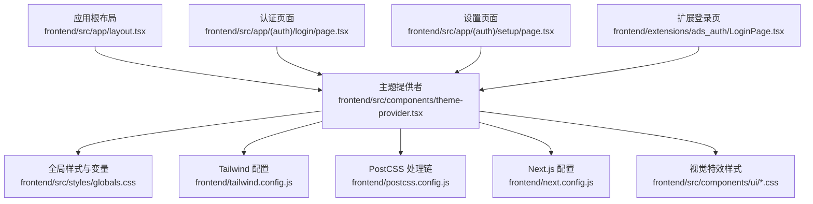
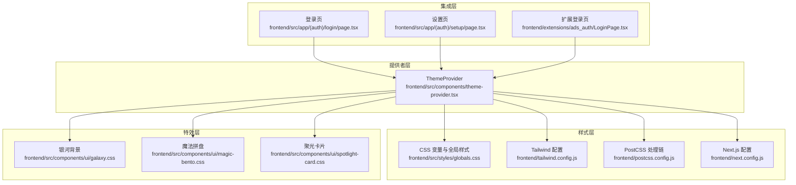
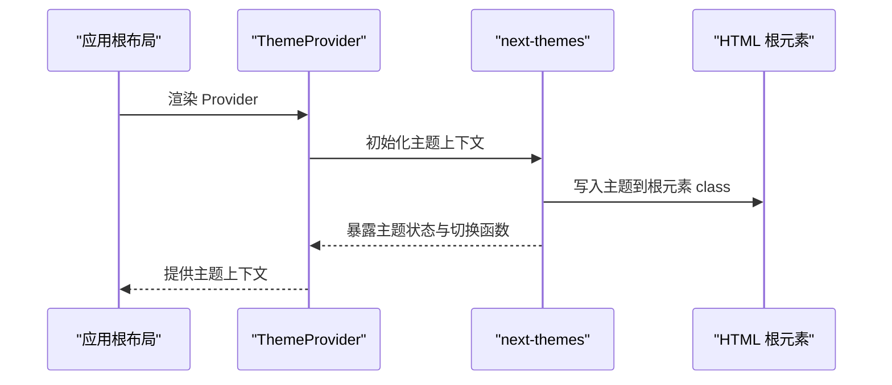
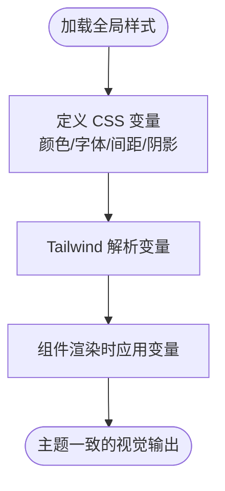
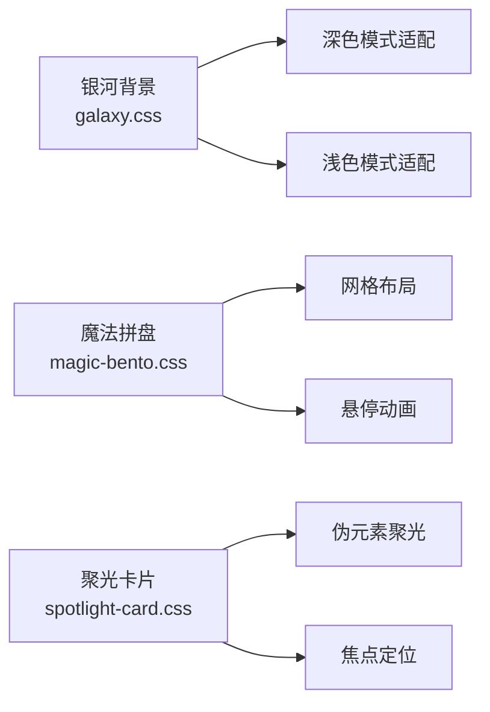
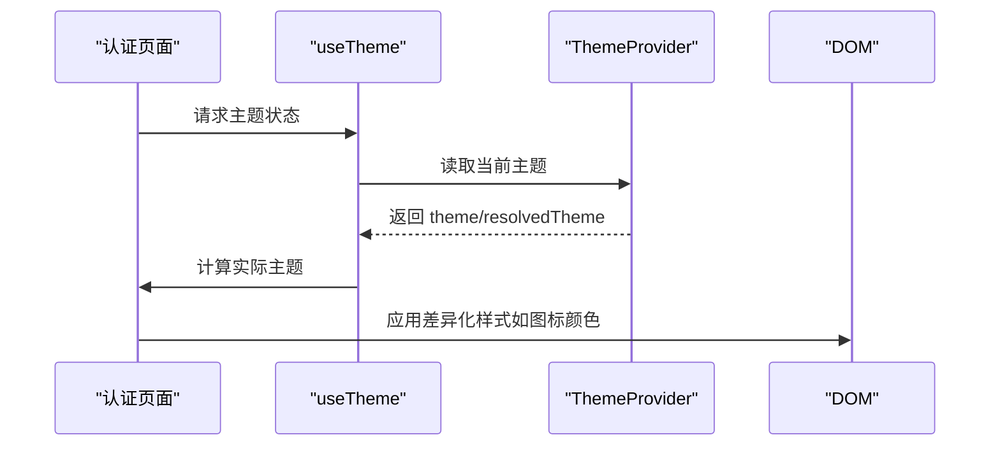
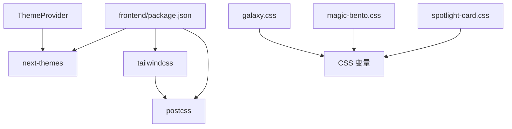

# 主题系统

<cite>
**本文引用的文件**
- [frontend/src/components/theme-provider.tsx](file://frontend/src/components/theme-provider.tsx)
- [frontend/src/app/layout.tsx](file://frontend/src/app/layout.tsx)
- [frontend/src/styles/globals.css](file://frontend/src/styles/globals.css)
- [frontend/src/components/ui/galaxy.css](file://frontend/src/components/ui/galaxy.css)
- [frontend/src/components/ui/magic-bento.css](file://frontend/src/components/ui/magic-bento.css)
- [frontend/src/components/ui/spotlight-card.css](file://frontend/src/components/ui/spotlight-card.css)
- [frontend/package.json](file://frontend/package.json)
- [frontend/next.config.js](file://frontend/next.config.js)
- [frontend/tailwind.config.js](file://frontend/tailwind.config.js)
- [frontend/postcss.config.js](file://frontend/postcss.config.js)
- [frontend/src/hooks/use-mobile.ts](file://frontend/src/hooks/use-mobile.ts)
- [frontend/src/app/(auth)/login/page.tsx](file://frontend/src/app/(auth)/login/page.tsx)
- [frontend/src/app/(auth)/setup/page.tsx](file://frontend/src/app/(auth)/setup/page.tsx)
- [frontend/extensions/ads_auth/LoginPage.tsx](file://frontend/extensions/ads_auth/LoginPage.tsx)
</cite>

## 目录
1. [简介](#简介)
2. [项目结构](#项目结构)
3. [核心组件](#核心组件)
4. [架构总览](#架构总览)
5. [详细组件分析](#详细组件分析)
6. [依赖关系分析](#依赖关系分析)
7. [性能考虑](#性能考虑)
8. [故障排除指南](#故障排除指南)
9. [结论](#结论)

## 简介
本文件系统性阐述 DeerFlow 前端主题系统的设计与实现，重点覆盖以下方面：
- 基于 CSS 变量与 Tailwind CSS 的主题体系
- 深色/浅色模式切换与系统跟随策略
- 颜色系统设计与可定制性
- 动画效果与视觉特效（银河背景、魔法拼盘、聚光卡片）
- 主题提供者配置、状态管理与持久化机制
- 主题定制示例、品牌色彩集成与无障碍设计支持
- 视觉特效组件的实现原理与使用方法

## 项目结构
前端主题系统主要由三层构成：
- 应用级主题提供者：在应用根布局中注入主题上下文，统一管理主题状态与持久化。
- 组件级样式层：通过 Tailwind CSS 类名与 CSS 变量驱动视觉表现，并结合原生动画实现特效。
- 扩展与页面级集成：在登录页等场景按需读取当前主题并进行差异化渲染。

**图表来源**
- [frontend/src/app/layout.tsx:1-30](file://frontend/src/app/layout.tsx#L1-L30)
- [frontend/src/components/theme-provider.tsx:1-20](file://frontend/src/components/theme-provider.tsx#L1-L20)
- [frontend/src/styles/globals.css:1-50](file://frontend/src/styles/globals.css#L1-L50)
- [frontend/tailwind.config.js:1-50](file://frontend/tailwind.config.js#L1-L50)
- [frontend/postcss.config.js:1-30](file://frontend/postcss.config.js#L1-L30)
- [frontend/next.config.js:1-50](file://frontend/next.config.js#L1-L50)
- [frontend/src/components/ui/galaxy.css:1-30](file://frontend/src/components/ui/galaxy.css#L1-L30)
- [frontend/src/components/ui/magic-bento.css:1-30](file://frontend/src/components/ui/magic-bento.css#L1-L30)
- [frontend/src/components/ui/spotlight-card.css:1-30](file://frontend/src/components/ui/spotlight-card.css#L1-L30)
- [frontend/src/app/(auth)/login/page.tsx:1-40](file://frontend/src/app/(auth)/login/page.tsx#L1-L40)
- [frontend/src/app/(auth)/setup/page.tsx:1-40](file://frontend/src/app/(auth)/setup/page.tsx#L1-L40)
- [frontend/extensions/ads_auth/LoginPage.tsx:1-30](file://frontend/extensions/ads_auth/LoginPage.tsx#L1-L30)

**章节来源**
- [frontend/src/app/layout.tsx:1-30](file://frontend/src/app/layout.tsx#L1-L30)
- [frontend/src/components/theme-provider.tsx:1-20](file://frontend/src/components/theme-provider.tsx#L1-L20)

## 核心组件
- 主题提供者（ThemeProvider）：封装 next-themes 提供的主题上下文，负责主题选择、系统跟随与过渡控制。
- 全局样式与 CSS 变量：定义主题色板、字体、间距、阴影等基础变量，支撑 Tailwind 类名映射。
- 视觉特效样式：以独立 CSS 文件形式提供动画与视觉增强，按需引入。
- 页面与扩展集成：在登录页等场景读取当前主题并进行差异化渲染（如图标颜色）。

**章节来源**
- [frontend/src/components/theme-provider.tsx:1-20](file://frontend/src/components/theme-provider.tsx#L1-L20)
- [frontend/src/styles/globals.css:1-50](file://frontend/src/styles/globals.css#L1-L50)
- [frontend/src/components/ui/galaxy.css:1-30](file://frontend/src/components/ui/galaxy.css#L1-L30)
- [frontend/src/components/ui/magic-bento.css:1-30](file://frontend/src/components/ui/magic-bento.css#L1-L30)
- [frontend/src/components/ui/spotlight-card.css:1-30](file://frontend/src/components/ui/spotlight-card.css#L1-L30)

## 架构总览
主题系统采用“提供者 + 变量 + 工具类”的分层架构：
- 提供者层：在应用根部注入主题上下文，暴露主题选择、系统跟随与过渡控制能力。
- 样式层：通过 Tailwind 类名与 CSS 变量组合，实现主题切换与视觉一致性。
- 特效层：以独立样式文件承载动画与视觉特效，避免与主题变量耦合。
- 集成层：在页面与扩展中按需感知主题并进行差异化渲染。

**图表来源**
- [frontend/src/components/theme-provider.tsx:1-20](file://frontend/src/components/theme-provider.tsx#L1-L20)
- [frontend/src/styles/globals.css:1-50](file://frontend/src/styles/globals.css#L1-L50)
- [frontend/tailwind.config.js:1-50](file://frontend/tailwind.config.js#L1-L50)
- [frontend/postcss.config.js:1-30](file://frontend/postcss.config.js#L1-L30)
- [frontend/next.config.js:1-50](file://frontend/next.config.js#L1-L50)
- [frontend/src/components/ui/galaxy.css:1-30](file://frontend/src/components/ui/galaxy.css#L1-L30)
- [frontend/src/components/ui/magic-bento.css:1-30](file://frontend/src/components/ui/magic-bento.css#L1-L30)
- [frontend/src/components/ui/spotlight-card.css:1-30](file://frontend/src/components/ui/spotlight-card.css#L1-L30)
- [frontend/src/app/(auth)/login/page.tsx:1-40](file://frontend/src/app/(auth)/login/page.tsx#L1-L40)
- [frontend/src/app/(auth)/setup/page.tsx:1-40](file://frontend/src/app/(auth)/setup/page.tsx#L1-L40)
- [frontend/extensions/ads_auth/LoginPage.tsx:1-30](file://frontend/extensions/ads_auth/LoginPage.tsx#L1-L30)

## 详细组件分析

### 主题提供者（ThemeProvider）
- 职责：封装 next-themes 的主题提供者，统一管理主题选择、系统跟随与过渡控制。
- 关键点：
  - 使用 attribute="class" 将主题写入 HTML 根元素的 class，便于 CSS 选择器识别。
  - 启用系统跟随（enableSystem），允许用户选择跟随系统主题。
  - 禁用过渡时闪烁（disableTransitionOnChange），提升切换体验。
  - 作为应用根布局的直接子节点，确保全站生效。

**图表来源**
- [frontend/src/app/layout.tsx:15-25](file://frontend/src/app/layout.tsx#L15-L25)
- [frontend/src/components/theme-provider.tsx:1-20](file://frontend/src/components/theme-provider.tsx#L1-L20)

**章节来源**
- [frontend/src/app/layout.tsx:15-25](file://frontend/src/app/layout.tsx#L15-L25)
- [frontend/src/components/theme-provider.tsx:1-20](file://frontend/src/components/theme-provider.tsx#L1-L20)

### 全局样式与 CSS 变量
- 职责：定义主题色板、字体、间距、阴影等基础变量，支撑 Tailwind 类名映射。
- 关键点：
  - 通过 CSS 变量集中管理颜色与尺寸，便于主题切换时统一更新。
  - 与 Tailwind 配置协同，使自定义变量可被工具类访问。
  - 在暗色模式下自动调整对比度与可读性。

**图表来源**
- [frontend/src/styles/globals.css:1-50](file://frontend/src/styles/globals.css#L1-L50)
- [frontend/tailwind.config.js:1-50](file://frontend/tailwind.config.js#L1-L50)

**章节来源**
- [frontend/src/styles/globals.css:1-50](file://frontend/src/styles/globals.css#L1-L50)
- [frontend/tailwind.config.js:1-50](file://frontend/tailwind.config.js#L1-L50)

### 视觉特效样式
- 银河背景（Galaxy Background）
  - 实现原理：通过 CSS 动画与渐变生成流动的星云效果，适配深色/浅色模式下的对比度。
  - 使用方法：在目标容器上添加对应类名即可启用。
- 魔法拼盘（Magic Bento）
  - 实现原理：利用网格布局与悬停动画，营造卡片翻转或位移的动态效果。
  - 使用方法：将子项按网格排列，并在父容器上应用拼盘样式类。
- 聚光卡片（Spotlight Card）
  - 实现原理：通过伪元素与径向渐变模拟聚光灯效果，聚焦卡片内容。
  - 使用方法：在卡片容器上应用样式类，并根据需要调整焦点位置与强度。

**图表来源**
- [frontend/src/components/ui/galaxy.css:1-30](file://frontend/src/components/ui/galaxy.css#L1-L30)
- [frontend/src/components/ui/magic-bento.css:1-30](file://frontend/src/components/ui/magic-bento.css#L1-L30)
- [frontend/src/components/ui/spotlight-card.css:1-30](file://frontend/src/components/ui/spotlight-card.css#L1-L30)

**章节来源**
- [frontend/src/components/ui/galaxy.css:1-30](file://frontend/src/components/ui/galaxy.css#L1-L30)
- [frontend/src/components/ui/magic-bento.css:1-30](file://frontend/src/components/ui/magic-bento.css#L1-L30)
- [frontend/src/components/ui/spotlight-card.css:1-30](file://frontend/src/components/ui/spotlight-card.css#L1-L30)

### 页面与扩展集成
- 登录页与设置页：通过 useTheme 读取当前主题，动态调整图标颜色等细节，确保在不同主题下保持高对比度与可读性。
- 扩展登录页：同样遵循上述模式，在第三方扩展场景中保持一致的主题体验。

**图表来源**
- [frontend/src/app/(auth)/login/page.tsx:40-60](file://frontend/src/app/(auth)/login/page.tsx#L40-L60)
- [frontend/src/app/(auth)/setup/page.tsx:10-30](file://frontend/src/app/(auth)/setup/page.tsx#L10-L30)
- [frontend/extensions/ads_auth/LoginPage.tsx:15-30](file://frontend/extensions/ads_auth/LoginPage.tsx#L15-L30)

**章节来源**
- [frontend/src/app/(auth)/login/page.tsx:40-60](file://frontend/src/app/(auth)/login/page.tsx#L40-L60)
- [frontend/src/app/(auth)/setup/page.tsx:10-30](file://frontend/src/app/(auth)/setup/page.tsx#L10-L30)
- [frontend/extensions/ads_auth/LoginPage.tsx:15-30](file://frontend/extensions/ads_auth/LoginPage.tsx#L15-L30)

## 依赖关系分析
- 主题提供者依赖 next-themes，后者负责主题状态管理与持久化。
- 样式层依赖 Tailwind CSS 与 PostCSS，通过配置将 CSS 变量与工具类绑定。
- 视觉特效样式为独立模块，仅依赖 CSS 变量与动画属性。
- 页面与扩展通过 React Hooks 读取主题状态，实现运行时差异化渲染。

**图表来源**
- [frontend/package.json:1-50](file://frontend/package.json#L1-L50)
- [frontend/src/components/theme-provider.tsx:1-20](file://frontend/src/components/theme-provider.tsx#L1-L20)
- [frontend/tailwind.config.js:1-50](file://frontend/tailwind.config.js#L1-L50)
- [frontend/postcss.config.js:1-30](file://frontend/postcss.config.js#L1-L30)
- [frontend/src/components/ui/galaxy.css:1-30](file://frontend/src/components/ui/galaxy.css#L1-L30)
- [frontend/src/components/ui/magic-bento.css:1-30](file://frontend/src/components/ui/magic-bento.css#L1-L30)
- [frontend/src/components/ui/spotlight-card.css:1-30](file://frontend/src/components/ui/spotlight-card.css#L1-L30)

**章节来源**
- [frontend/package.json:1-50](file://frontend/package.json#L1-L50)
- [frontend/tailwind.config.js:1-50](file://frontend/tailwind.config.js#L1-L50)
- [frontend/postcss.config.js:1-30](file://frontend/postcss.config.js#L1-L30)

## 性能考虑
- 切换无闪烁：通过禁用过渡时的页面闪烁（disableTransitionOnChange）优化用户体验。
- 样式体积控制：将视觉特效拆分为独立 CSS 文件，按需引入，避免不必要的样式加载。
- 变量复用：通过 CSS 变量集中管理颜色与尺寸，减少重复定义与计算开销。
- 移动端适配：结合移动端断点与交互反馈，确保在小屏设备上的流畅体验。

## 故障排除指南
- 主题未生效
  - 检查应用根布局是否正确包裹 ThemeProvider。
  - 确认 attribute="class" 是否存在，以便 CSS 选择器能够识别主题。
- 切换闪烁
  - 确保已启用 disableTransitionOnChange，避免过渡期间的闪烁。
- 特效不显示
  - 确认对应 CSS 文件已在页面或组件中引入。
  - 检查容器是否具备正确的类名与层级关系。
- 图标颜色异常
  - 在页面中使用 useTheme 获取 theme 与 resolvedTheme，并根据实际主题动态设置颜色。

**章节来源**
- [frontend/src/app/layout.tsx:15-25](file://frontend/src/app/layout.tsx#L15-L25)
- [frontend/src/components/theme-provider.tsx:1-20](file://frontend/src/components/theme-provider.tsx#L1-L20)
- [frontend/src/app/(auth)/login/page.tsx:40-60](file://frontend/src/app/(auth)/login/page.tsx#L40-L60)

## 结论
DeerFlow 的主题系统以 next-themes 为核心，结合 CSS 变量与 Tailwind CSS，实现了灵活、可扩展且高性能的主题方案。通过提供者层统一管理状态与持久化，样式层以变量与工具类保证一致性，特效层以独立样式文件提供丰富的视觉体验，最终在页面与扩展中实现无缝集成。该体系既满足品牌色彩定制与无障碍设计需求，又为未来扩展提供了清晰的路径。