# 交互组件

<cite>
**本文引用的文件**
- [frontend/src/components/ui/command.tsx](file://frontend/src/components/ui/command.tsx)
- [frontend/src/components/ui/dropdown-menu.tsx](file://frontend/src/components/ui/dropdown-menu.tsx)
- [frontend/src/components/ui/hover-card.tsx](file://frontend/src/components/ui/hover-card.tsx)
- [frontend/src/components/ui/tooltip.tsx](file://frontend/src/components/ui/tooltip.tsx)
- [frontend/src/components/ui/switch.tsx](file://frontend/src/components/ui/switch.tsx)
- [frontend/src/components/ui/button-group.tsx](file://frontend/src/components/ui/button-group.tsx)
- [frontend/src/components/ui/item.tsx](file://frontend/src/components/ui/item.tsx)
- [frontend/src/components/ui/toggle.tsx](file://frontend/src/components/ui/toggle.tsx)
- [frontend/src/components/ui/select.tsx](file://frontend/src/components/ui/select.tsx)
- [frontend/src/components/ui/dialog.tsx](file://frontend/src/components/ui/dialog.tsx)
- [frontend/src/components/ui/tabs.tsx](file://frontend/src/components/ui/tabs.tsx)
- [frontend/src/components/ui/resizable.tsx](file://frontend/src/components/ui/resizable.tsx)
- [frontend/src/components/ui/sidebar.tsx](file://frontend/src/components/ui/sidebar.tsx)
</cite>

## 目录
1. [简介](#简介)
2. [项目结构](#项目结构)
3. [核心组件](#核心组件)
4. [架构总览](#架构总览)
5. [详细组件分析](#详细组件分析)
6. [依赖关系分析](#依赖关系分析)
7. [性能考量](#性能考量)
8. [故障排查指南](#故障排查指南)
9. [结论](#结论)
10. [附录](#附录)

## 简介
本文件系统性梳理 DeerFlow 前端交互组件库，覆盖命令面板、下拉菜单、悬停卡片、工具提示、切换开关、按钮组、列表项、选择器、对话框、标签页、可调整面板与侧边栏等组件。重点阐述交互触发方式、状态管理与视觉反馈机制，并给出键盘导航与触屏适配建议，以及在智能体配置与工具调用场景中的应用范式。

## 项目结构
交互组件集中于前端目录的通用 UI 组件模块，采用 Radix UI 原子能力与 Tailwind 样式组合，辅以少量自定义封装，形成一致的交互语义与视觉风格。

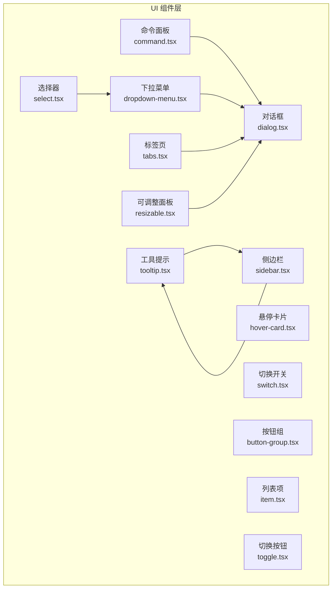

图示来源
- [frontend/src/components/ui/command.tsx:1-182](file://frontend/src/components/ui/command.tsx#L1-L182)
- [frontend/src/components/ui/dropdown-menu.tsx:1-258](file://frontend/src/components/ui/dropdown-menu.tsx#L1-L258)
- [frontend/src/components/ui/hover-card.tsx:1-45](file://frontend/src/components/ui/hover-card.tsx#L1-L45)
- [frontend/src/components/ui/tooltip.tsx:1-61](file://frontend/src/components/ui/tooltip.tsx#L1-L61)
- [frontend/src/components/ui/switch.tsx:1-32](file://frontend/src/components/ui/switch.tsx#L1-L32)
- [frontend/src/components/ui/button-group.tsx:1-84](file://frontend/src/components/ui/button-group.tsx#L1-L84)
- [frontend/src/components/ui/item.tsx:1-194](file://frontend/src/components/ui/item.tsx#L1-L194)
- [frontend/src/components/ui/toggle.tsx:1-48](file://frontend/src/components/ui/toggle.tsx#L1-L48)
- [frontend/src/components/ui/select.tsx:1-191](file://frontend/src/components/ui/select.tsx#L1-L191)
- [frontend/src/components/ui/dialog.tsx:1-145](file://frontend/src/components/ui/dialog.tsx#L1-L145)
- [frontend/src/components/ui/tabs.tsx:1-92](file://frontend/src/components/ui/tabs.tsx#L1-L92)
- [frontend/src/components/ui/resizable.tsx:1-57](file://frontend/src/components/ui/resizable.tsx#L1-L57)
- [frontend/src/components/ui/sidebar.tsx:1-727](file://frontend/src/components/ui/sidebar.tsx#L1-L727)

章节来源
- [frontend/src/components/ui/command.tsx:1-182](file://frontend/src/components/ui/command.tsx#L1-L182)
- [frontend/src/components/ui/dropdown-menu.tsx:1-258](file://frontend/src/components/ui/dropdown-menu.tsx#L1-L258)
- [frontend/src/components/ui/hover-card.tsx:1-45](file://frontend/src/components/ui/hover-card.tsx#L1-L45)
- [frontend/src/components/ui/tooltip.tsx:1-61](file://frontend/src/components/ui/tooltip.tsx#L1-L61)
- [frontend/src/components/ui/switch.tsx:1-32](file://frontend/src/components/ui/switch.tsx#L1-L32)
- [frontend/src/components/ui/button-group.tsx:1-84](file://frontend/src/components/ui/button-group.tsx#L1-L84)
- [frontend/src/components/ui/item.tsx:1-194](file://frontend/src/components/ui/item.tsx#L1-L194)
- [frontend/src/components/ui/toggle.tsx:1-48](file://frontend/src/components/ui/toggle.tsx#L1-L48)
- [frontend/src/components/ui/select.tsx:1-191](file://frontend/src/components/ui/select.tsx#L1-L191)
- [frontend/src/components/ui/dialog.tsx:1-145](file://frontend/src/components/ui/dialog.tsx#L1-L145)
- [frontend/src/components/ui/tabs.tsx:1-92](file://frontend/src/components/ui/tabs.tsx#L1-L92)
- [frontend/src/components/ui/resizable.tsx:1-57](file://frontend/src/components/ui/resizable.tsx#L1-L57)
- [frontend/src/components/ui/sidebar.tsx:1-727](file://frontend/src/components/ui/sidebar.tsx#L1-L727)

## 核心组件
- 命令面板：基于命令输入、分组、条目与快捷键展示，常用于全局命令入口与上下文搜索。
- 下拉菜单：支持主菜单项、复选/单选子项、分隔符与子级二级菜单。
- 悬停卡片：鼠标悬停触发的浮层内容容器，适合信息预览与轻量操作。
- 工具提示：全局提供者包裹，延迟可控，用于简短说明与快捷键提示。
- 切换开关：二态控制，强调“开/关”语义，具备无障碍焦点样式。
- 按钮组：水平/垂直排列的按钮集合，带分隔线与文本装饰，便于成组操作。
- 列表项：灵活的列表单元，支持媒体区、标题、描述、动作区与页脚头部，适配复杂信息卡片。
- 切换按钮：多态按钮，支持默认/描边外观与多尺寸，强调“按下/未按下”状态。
- 选择器：下拉选择，支持分组、标签、滚动按钮与占位文本，适配多选项场景。
- 对话框：模态容器，支持遮罩、关闭按钮、标题/描述与响应式布局。
- 标签页：支持横向/纵向与多种样式变体，配合内容区实现分组信息展示。
- 可调整面板：拖拽分割面板，支持方向与手柄显示，满足布局自适应。
- 侧边栏：多态侧边栏，支持展开/收起、移动端抽屉、键盘快捷键与工具提示集成。

章节来源
- [frontend/src/components/ui/command.tsx:15-181](file://frontend/src/components/ui/command.tsx#L15-L181)
- [frontend/src/components/ui/dropdown-menu.tsx:9-257](file://frontend/src/components/ui/dropdown-menu.tsx#L9-L257)
- [frontend/src/components/ui/hover-card.tsx:8-44](file://frontend/src/components/ui/hover-card.tsx#L8-L44)
- [frontend/src/components/ui/tooltip.tsx:8-60](file://frontend/src/components/ui/tooltip.tsx#L8-L60)
- [frontend/src/components/ui/switch.tsx:8-31](file://frontend/src/components/ui/switch.tsx#L8-L31)
- [frontend/src/components/ui/button-group.tsx:24-83](file://frontend/src/components/ui/button-group.tsx#L24-L83)
- [frontend/src/components/ui/item.tsx:54-193](file://frontend/src/components/ui/item.tsx#L54-L193)
- [frontend/src/components/ui/toggle.tsx:31-47](file://frontend/src/components/ui/toggle.tsx#L31-L47)
- [frontend/src/components/ui/select.tsx:9-190](file://frontend/src/components/ui/select.tsx#L9-L190)
- [frontend/src/components/ui/dialog.tsx:9-144](file://frontend/src/components/ui/dialog.tsx#L9-L144)
- [frontend/src/components/ui/tabs.tsx:9-91](file://frontend/src/components/ui/tabs.tsx#L9-L91)
- [frontend/src/components/ui/resizable.tsx:9-56](file://frontend/src/components/ui/resizable.tsx#L9-L56)
- [frontend/src/components/ui/sidebar.tsx:56-726](file://frontend/src/components/ui/sidebar.tsx#L56-L726)

## 架构总览
交互组件通过统一的数据槽（data-slot）与类名约定，结合 Radix UI 的可访问性与动画能力，形成一致的状态驱动与视觉反馈。组件间通过组合（如对话框承载命令面板、下拉菜单承载选择器）实现复杂交互。

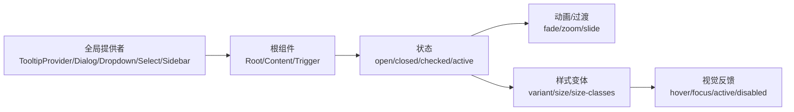

图示来源
- [frontend/src/components/ui/tooltip.tsx:8-19](file://frontend/src/components/ui/tooltip.tsx#L8-L19)
- [frontend/src/components/ui/dialog.tsx:9-47](file://frontend/src/components/ui/dialog.tsx#L9-L47)
- [frontend/src/components/ui/dropdown-menu.tsx:9-52](file://frontend/src/components/ui/dropdown-menu.tsx#L9-L52)
- [frontend/src/components/ui/select.tsx:9-53](file://frontend/src/components/ui/select.tsx#L9-L53)
- [frontend/src/components/ui/sidebar.tsx:56-151](file://frontend/src/components/ui/sidebar.tsx#L56-L151)

## 详细组件分析

### 命令面板（Command）
- 交互触发：命令输入聚焦后，支持键盘上下移动、回车确认；可通过快捷键打开。
- 状态管理：内部维护分组、条目、空状态与快捷键展示；与对话框组合时，对话框负责遮罩与关闭。
- 视觉反馈：选中态高亮、禁用态半透明、图标与文字对齐；输入区域带搜索图标与占位符。
- 应用场景：全局命令入口、上下文搜索、技能/工具快速调用。

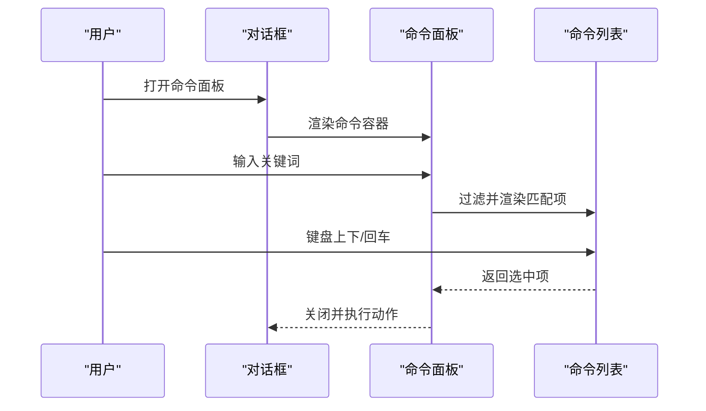

图示来源
- [frontend/src/components/ui/command.tsx:31-58](file://frontend/src/components/ui/command.tsx#L31-L58)
- [frontend/src/components/ui/dialog.tsx:49-81](file://frontend/src/components/ui/dialog.tsx#L49-L81)

章节来源
- [frontend/src/components/ui/command.tsx:15-181](file://frontend/src/components/ui/command.tsx#L15-L181)
- [frontend/src/components/ui/dialog.tsx:49-81](file://frontend/src/components/ui/dialog.tsx#L49-L81)

### 下拉菜单（Dropdown Menu）
- 交互触发：触发器点击或键盘激活；支持子菜单展开与嵌套。
- 状态管理：根节点控制 open/close；子菜单独立状态；复选/单选项维护选中态。
- 视觉反馈：打开动画、阴影边框、选中指示器、禁用态与破坏性项样式。
- 应用场景：设置项、筛选条件、功能分组菜单。

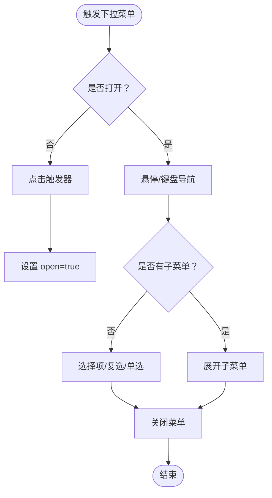

图示来源
- [frontend/src/components/ui/dropdown-menu.tsx:9-52](file://frontend/src/components/ui/dropdown-menu.tsx#L9-L52)
- [frontend/src/components/ui/dropdown-menu.tsx:195-239](file://frontend/src/components/ui/dropdown-menu.tsx#L195-L239)

章节来源
- [frontend/src/components/ui/dropdown-menu.tsx:9-257](file://frontend/src/components/ui/dropdown-menu.tsx#L9-L257)

### 悬停卡片（Hover Card）
- 交互触发：鼠标悬停或焦点进入；离开即关闭。
- 状态管理：根节点管理 open/close；内容定位随触发元素变化。
- 视觉反馈：淡入淡出、缩放与滑动入场；边框与阴影提升层级感。
- 应用场景：头像/缩略图信息预览、快捷操作入口。

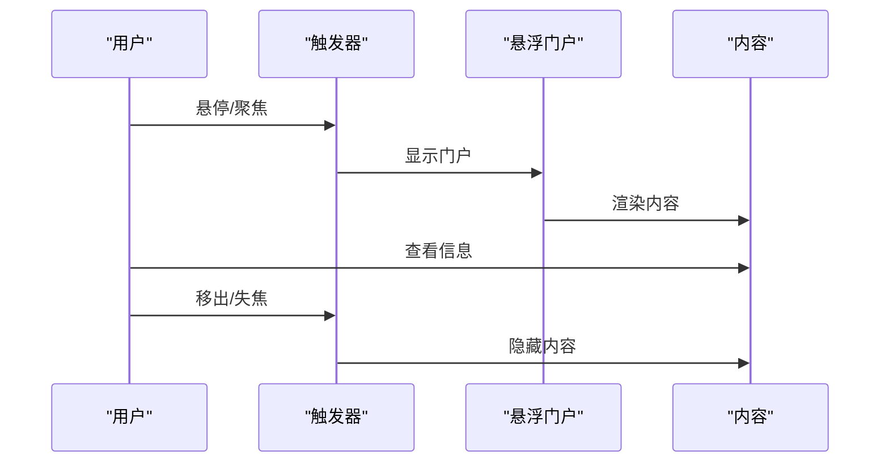

图示来源
- [frontend/src/components/ui/hover-card.tsx:8-44](file://frontend/src/components/ui/hover-card.tsx#L8-L44)

章节来源
- [frontend/src/components/ui/hover-card.tsx:8-44](file://frontend/src/components/ui/hover-card.tsx#L8-L44)

### 工具提示（Tooltip）
- 交互触发：延迟触发，支持全局提供者统一配置；可按需禁用延迟。
- 状态管理：根节点控制 open/close；内容随触发器位置自动定位。
- 视觉反馈：渐显/缩放动画；深浅色主题下的对比度保障。
- 应用场景：图标说明、快捷键提示、辅助信息。

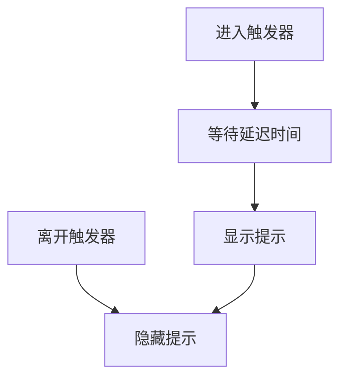

图示来源
- [frontend/src/components/ui/tooltip.tsx:8-58](file://frontend/src/components/ui/tooltip.tsx#L8-L58)

章节来源
- [frontend/src/components/ui/tooltip.tsx:8-60](file://frontend/src/components/ui/tooltip.tsx#L8-L60)

### 切换开关（Switch）
- 交互触发：点击/键盘激活；受禁用状态影响。
- 状态管理：checked/unchecked 二态；焦点可见环与阴影。
- 视觉反馈：拇指平滑位移；背景色随状态切换；禁用态不响应。
- 应用场景：功能开关、偏好设置、实验特性开关。

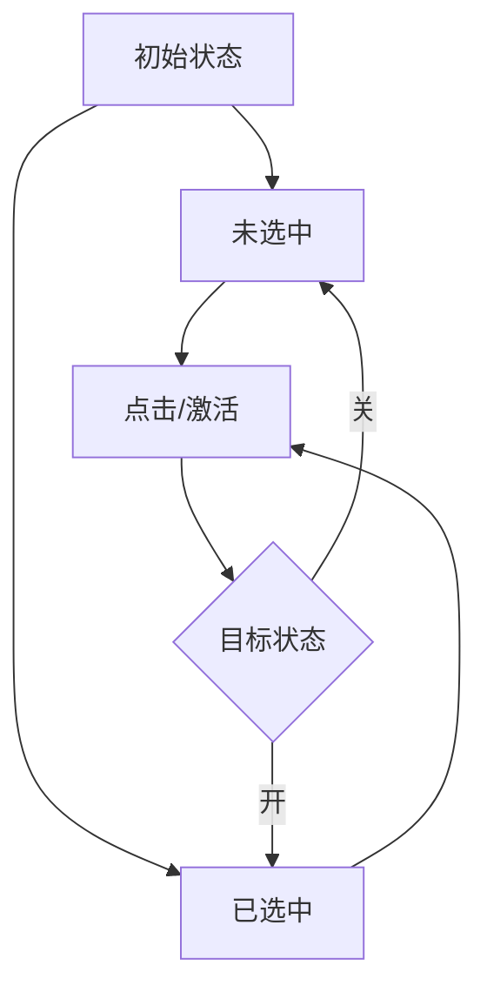

图示来源
- [frontend/src/components/ui/switch.tsx:8-31](file://frontend/src/components/ui/switch.tsx#L8-L31)

章节来源
- [frontend/src/components/ui/switch.tsx:8-31](file://frontend/src/components/ui/switch.tsx#L8-L31)

### 按钮组（Button Group）
- 交互触发：组内按钮各自响应；支持水平/垂直排列与分隔线。
- 状态管理：无全局状态；各按钮自身可为激活态。
- 视觉反馈：边框合并、圆角裁剪；聚焦环与阴影增强可访问性。
- 应用场景：工具栏、操作组、分段控件。

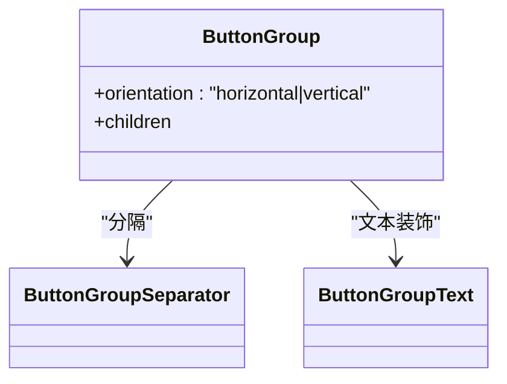

图示来源
- [frontend/src/components/ui/button-group.tsx:24-83](file://frontend/src/components/ui/button-group.tsx#L24-L83)

章节来源
- [frontend/src/components/ui/button-group.tsx:24-83](file://frontend/src/components/ui/button-group.tsx#L24-L83)

### 列表项（Item）
- 交互触发：点击/键盘激活；支持作为容器或插槽包装。
- 状态管理：无内置状态；可与外部状态联动（如选中/激活）。
- 视觉反馈：边框/背景/圆角/阴影；媒体区图标/图片样式；动作区对齐。
- 应用场景：消息列表、任务清单、资源卡片。

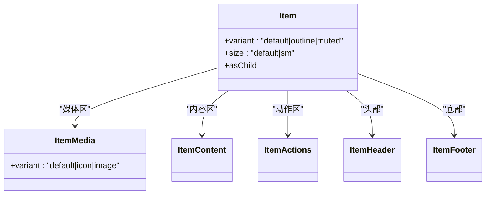

图示来源
- [frontend/src/components/ui/item.tsx:54-193](file://frontend/src/components/ui/item.tsx#L54-L193)

章节来源
- [frontend/src/components/ui/item.tsx:54-193](file://frontend/src/components/ui/item.tsx#L54-L193)

### 切换按钮（Toggle）
- 交互触发：点击切换 pressed 状态；支持多种外观与尺寸。
- 状态管理：data-state=on/off；与焦点环/阴影联动。
- 视觉反馈：按下态背景与文本色变化；禁用态透明度降低。
- 应用场景：加粗/斜体/下划线、音量/静音、收藏。

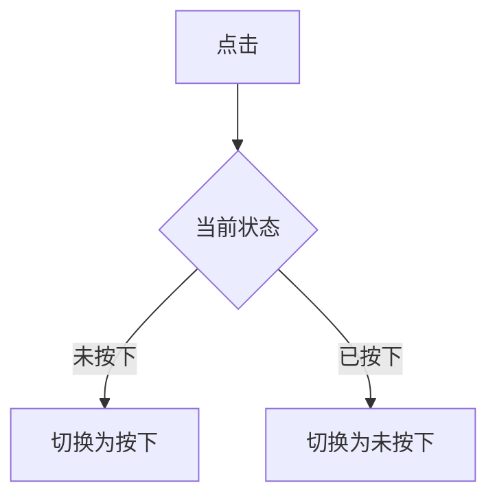

图示来源
- [frontend/src/components/ui/toggle.tsx:31-47](file://frontend/src/components/ui/toggle.tsx#L31-L47)

章节来源
- [frontend/src/components/ui/toggle.tsx:31-47](file://frontend/src/components/ui/toggle.tsx#L31-L47)

### 选择器（Select）
- 交互触发：触发器点击展开；键盘导航与滚动按钮。
- 状态管理：根节点控制 open/close；项选择与占位文本。
- 视觉反馈：弹出层动画、滚动指示器、选中指示器。
- 应用场景：排序、过滤、配置项选择。

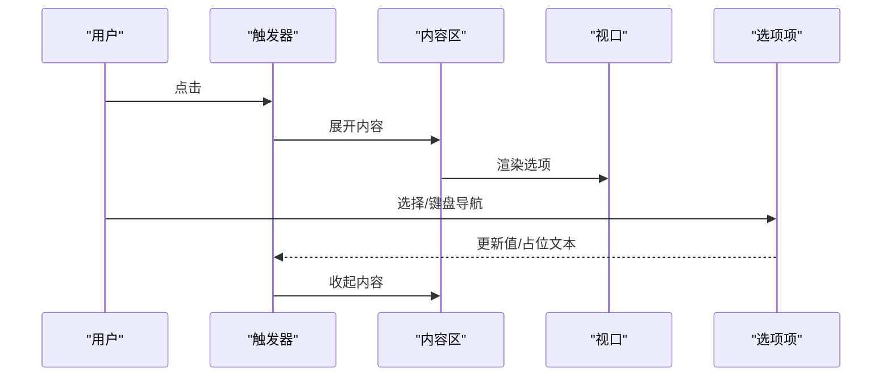

图示来源
- [frontend/src/components/ui/select.tsx:9-190](file://frontend/src/components/ui/select.tsx#L9-L190)

章节来源
- [frontend/src/components/ui/select.tsx:9-190](file://frontend/src/components/ui/select.tsx#L9-L190)

### 对话框（Dialog）
- 交互触发：触发器/快捷键打开；遮罩点击或 ESC 关闭。
- 状态管理：根节点控制 open/close；支持关闭按钮与无障碍标题/描述。
- 视觉反馈：居中网格布局、阴影与动画；关闭按钮 SR-only 文案。
- 应用场景：确认对话、设置面板、全屏操作。

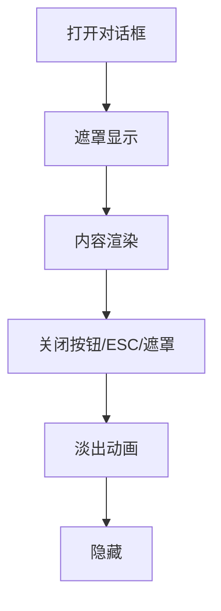

图示来源
- [frontend/src/components/ui/dialog.tsx:9-144](file://frontend/src/components/ui/dialog.tsx#L9-L144)

章节来源
- [frontend/src/components/ui/dialog.tsx:9-144](file://frontend/src/components/ui/dialog.tsx#L9-L144)

### 标签页（Tabs）
- 交互触发：点击切换；支持横向/纵向与不同样式变体。
- 状态管理：根节点维护活动页；列表与内容区联动。
- 视觉反馈：活动态边框/阴影；线性变体无背景。
- 应用场景：设置分组、内容分区、多视图切换。

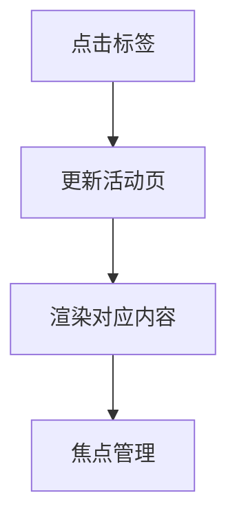

图示来源
- [frontend/src/components/ui/tabs.tsx:9-91](file://frontend/src/components/ui/tabs.tsx#L9-L91)

章节来源
- [frontend/src/components/ui/tabs.tsx:9-91](file://frontend/src/components/ui/tabs.tsx#L9-L91)

### 可调整面板（Resizable Panels）
- 交互触发：拖拽手柄；支持方向与手柄显示。
- 状态管理：内部尺寸状态；CSS 变量驱动宽度/高度。
- 视觉反馈：分割线高亮与焦点环；垂直/水平方向区分。
- 应用场景：侧边栏/内容区自适应、编辑器布局。

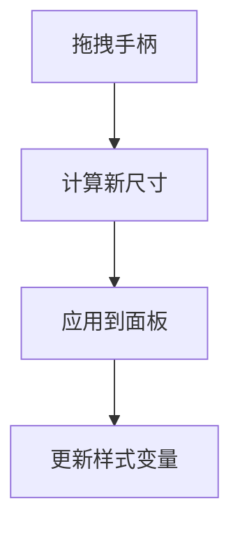

图示来源
- [frontend/src/components/ui/resizable.tsx:31-56](file://frontend/src/components/ui/resizable.tsx#L31-L56)

章节来源
- [frontend/src/components/ui/resizable.tsx:31-56](file://frontend/src/components/ui/resizable.tsx#L31-L56)

### 侧边栏（Sidebar）
- 交互触发：触发器点击；键盘快捷键（Cmd/Ctrl+B）；移动端抽屉。
- 状态管理：展开/收起；移动端弹出；Cookie 记忆状态；工具提示提供者。
- 视觉反馈：过渡动画、阴影与边框；图标尺寸与折叠态适配。
- 应用场景：导航菜单、功能面板、移动端抽屉。

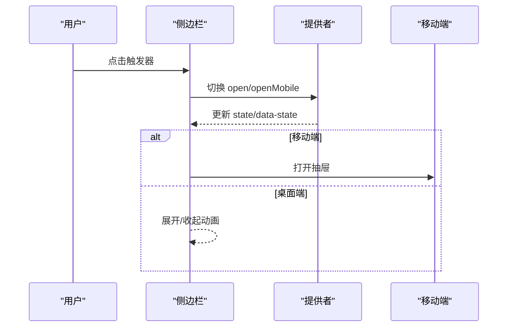

图示来源
- [frontend/src/components/ui/sidebar.tsx:56-151](file://frontend/src/components/ui/sidebar.tsx#L56-L151)
- [frontend/src/components/ui/sidebar.tsx:154-320](file://frontend/src/components/ui/sidebar.tsx#L154-L320)

章节来源
- [frontend/src/components/ui/sidebar.tsx:56-726](file://frontend/src/components/ui/sidebar.tsx#L56-L726)

## 依赖关系分析
- 组件依赖 Radix UI 原子组件（Dropdown、Select、Tabs、Tooltip、HoverCard、Dialog、Switch、Toggle）实现可访问性与状态机。
- 组件通过 Portal 将内容挂载至文档流外层，避免布局抖动与层级问题。
- 统一使用 cn 工具进行类名拼接与变体控制，保证样式一致性。
- 提供全局提供者（如 TooltipProvider、Dialog）以集中配置行为（如延迟、动画）。

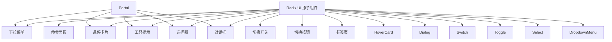

图示来源
- [frontend/src/components/ui/command.tsx:1-182](file://frontend/src/components/ui/command.tsx#L1-L182)
- [frontend/src/components/ui/dropdown-menu.tsx:1-258](file://frontend/src/components/ui/dropdown-menu.tsx#L1-L258)
- [frontend/src/components/ui/hover-card.tsx:1-45](file://frontend/src/components/ui/hover-card.tsx#L1-L45)
- [frontend/src/components/ui/tooltip.tsx:1-61](file://frontend/src/components/ui/tooltip.tsx#L1-L61)
- [frontend/src/components/ui/switch.tsx:1-32](file://frontend/src/components/ui/switch.tsx#L1-L32)
- [frontend/src/components/ui/toggle.tsx:1-48](file://frontend/src/components/ui/toggle.tsx#L1-L48)
- [frontend/src/components/ui/select.tsx:1-191](file://frontend/src/components/ui/select.tsx#L1-L191)
- [frontend/src/components/ui/dialog.tsx:1-145](file://frontend/src/components/ui/dialog.tsx#L1-L145)

章节来源
- [frontend/src/components/ui/command.tsx:1-182](file://frontend/src/components/ui/command.tsx#L1-L182)
- [frontend/src/components/ui/dropdown-menu.tsx:1-258](file://frontend/src/components/ui/dropdown-menu.tsx#L1-L258)
- [frontend/src/components/ui/hover-card.tsx:1-45](file://frontend/src/components/ui/hover-card.tsx#L1-L45)
- [frontend/src/components/ui/tooltip.tsx:1-61](file://frontend/src/components/ui/tooltip.tsx#L1-L61)
- [frontend/src/components/ui/switch.tsx:1-32](file://frontend/src/components/ui/switch.tsx#L1-L32)
- [frontend/src/components/ui/toggle.tsx:1-48](file://frontend/src/components/ui/toggle.tsx#L1-L48)
- [frontend/src/components/ui/select.tsx:1-191](file://frontend/src/components/ui/select.tsx#L1-L191)
- [frontend/src/components/ui/dialog.tsx:1-145](file://frontend/src/components/ui/dialog.tsx#L1-L145)

## 性能考量
- 动画与过渡：组件普遍启用淡入/淡出、缩放与滑入动画，建议在低端设备上适度减少动画时长或禁用非关键动画。
- 虚拟滚动：命令面板与下拉菜单列表建议在大数据集场景引入虚拟化以降低重排成本。
- Portal 使用：内容挂载至 Portal 可减少父级布局影响，但需注意层级管理与事件捕获。
- 类名拼接：大量动态类名可能引发样式抖动，建议缓存常用变体或使用 CSS 变量。
- 焦点管理：确保键盘可达性与焦点环可见，避免隐藏焦点元素导致可访问性问题。

## 故障排查指南
- 无法打开下拉菜单/选择器：检查触发器是否禁用、Portal 是否正确挂载、根节点是否处于 open 状态。
- 工具提示不显示：确认 TooltipProvider 延迟配置、触发器是否被遮挡、内容是否为空。
- 命令面板无结果：检查过滤逻辑、输入值与分组/条目映射、快捷键冲突。
- 切换开关无响应：验证受控/非受控模式、禁用状态、事件冒泡是否被阻止。
- 对话框遮罩无效：确认 DialogOverlay 是否被其他层覆盖、z-index 设置与动画冲突。
- 侧边栏状态异常：检查 Cookie 写入权限、键盘快捷键监听、移动端抽屉开关。

章节来源
- [frontend/src/components/ui/dropdown-menu.tsx:9-52](file://frontend/src/components/ui/dropdown-menu.tsx#L9-L52)
- [frontend/src/components/ui/select.tsx:53-88](file://frontend/src/components/ui/select.tsx#L53-L88)
- [frontend/src/components/ui/tooltip.tsx:8-19](file://frontend/src/components/ui/tooltip.tsx#L8-L19)
- [frontend/src/components/ui/command.tsx:60-96](file://frontend/src/components/ui/command.tsx#L60-L96)
- [frontend/src/components/ui/switch.tsx:8-31](file://frontend/src/components/ui/switch.tsx#L8-L31)
- [frontend/src/components/ui/dialog.tsx:33-81](file://frontend/src/components/ui/dialog.tsx#L33-L81)
- [frontend/src/components/ui/sidebar.tsx:56-151](file://frontend/src/components/ui/sidebar.tsx#L56-L151)

## 结论
DeerFlow 交互组件库以 Radix UI 为核心，结合 Portal、动画与 Tailwind 变体，构建了高可访问性与一致性的交互体系。通过明确的触发方式、状态管理与视觉反馈，组件在智能体配置与工具调用场景中具备良好扩展性与用户体验。

## 附录
- 交互模式示例
  - 快捷键：命令面板支持全局快捷键；侧边栏支持 Ctrl/Cmd+B 切换。
  - 键盘导航：下拉菜单/选择器支持上下键与回车；标签页支持左右键切换。
  - 触屏适配：侧边栏移动端抽屉、悬停卡片改为触摸触发、对话框全屏适配。
- 在智能体配置中的应用
  - 使用下拉菜单/选择器配置模型与参数；使用切换开关开启/关闭功能；使用对话框承载完整配置面板。
- 在工具调用中的应用
  - 使用命令面板快速检索工具；使用下拉菜单组织工具分类；使用列表项展示工具详情与快捷操作。