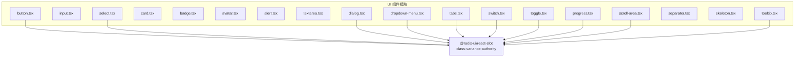
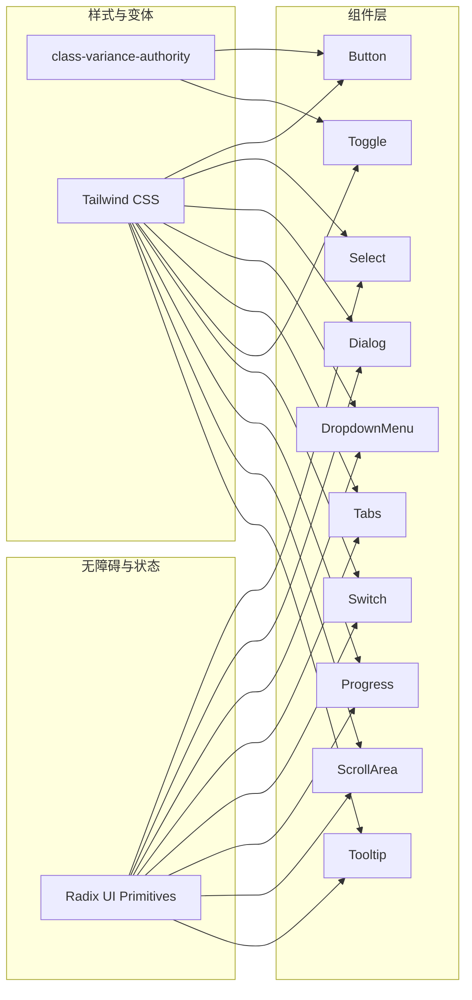
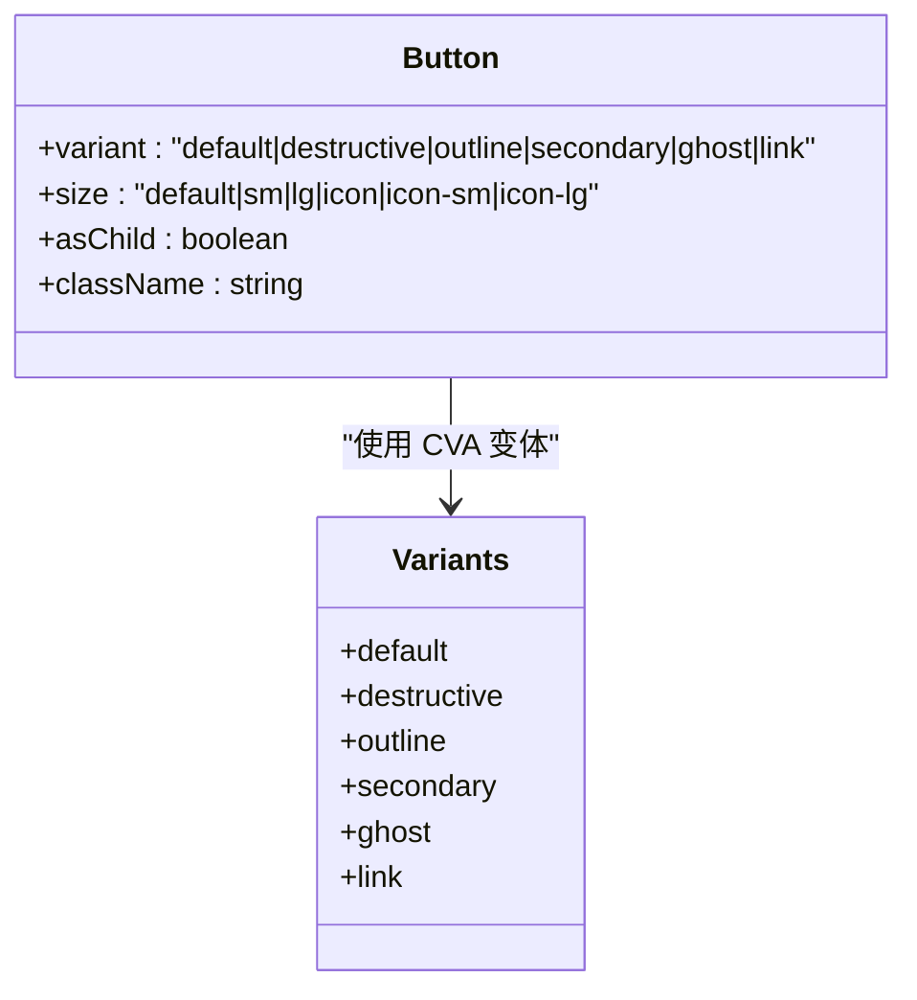
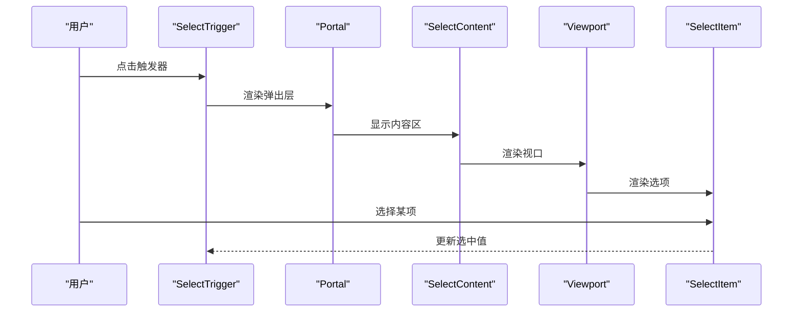
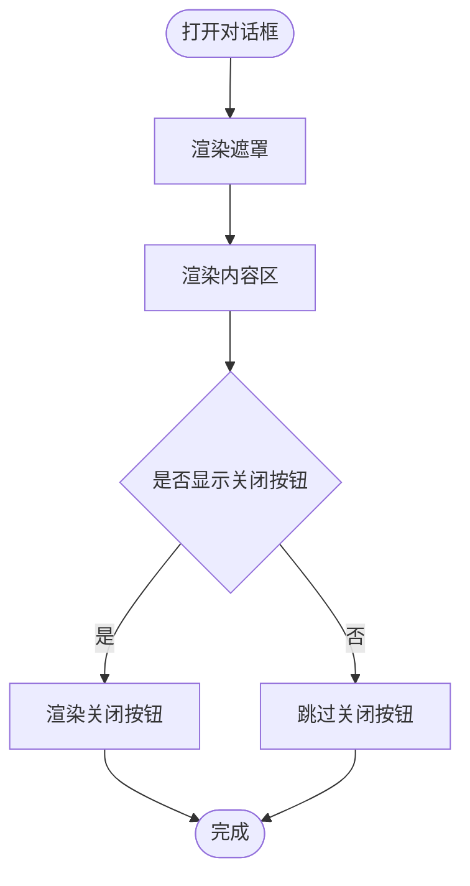
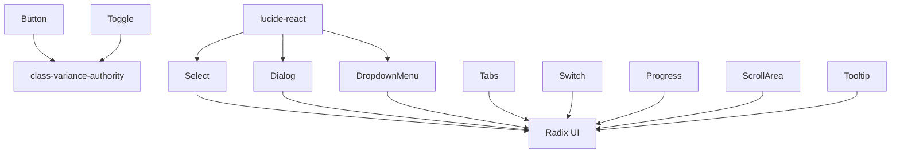

# 基础 UI 组件

<cite>
**本文引用的文件**
- [frontend/src/components/ui/button.tsx](file://frontend/src/components/ui/button.tsx)
- [frontend/src/components/ui/input.tsx](file://frontend/src/components/ui/input.tsx)
- [frontend/src/components/ui/select.tsx](file://frontend/src/components/ui/select.tsx)
- [frontend/src/components/ui/card.tsx](file://frontend/src/components/ui/card.tsx)
- [frontend/src/components/ui/badge.tsx](file://frontend/src/components/ui/badge.tsx)
- [frontend/src/components/ui/avatar.tsx](file://frontend/src/components/ui/avatar.tsx)
- [frontend/src/components/ui/alert.tsx](file://frontend/src/components/ui/alert.tsx)
- [frontend/src/components/ui/textarea.tsx](file://frontend/src/components/ui/textarea.tsx)
- [frontend/src/components/ui/dialog.tsx](file://frontend/src/components/ui/dialog.tsx)
- [frontend/src/components/ui/dropdown-menu.tsx](file://frontend/src/components/ui/dropdown-menu.tsx)
- [frontend/src/components/ui/tabs.tsx](file://frontend/src/components/ui/tabs.tsx)
- [frontend/src/components/ui/switch.tsx](file://frontend/src/components/ui/switch.tsx)
- [frontend/src/components/ui/toggle.tsx](file://frontend/src/components/ui/toggle.tsx)
- [frontend/src/components/ui/progress.tsx](file://frontend/src/components/ui/progress.tsx)
- [frontend/src/components/ui/scroll-area.tsx](file://frontend/src/components/ui/scroll-area.tsx)
- [frontend/src/components/ui/separator.tsx](file://frontend/src/components/ui/separator.tsx)
- [frontend/src/components/ui/skeleton.tsx](file://frontend/src/components/ui/skeleton.tsx)
- [frontend/src/components/ui/tooltip.tsx](file://frontend/src/components/ui/tooltip.tsx)
</cite>

## 目录
1. [简介](#简介)
2. [项目结构](#项目结构)
3. [核心组件](#核心组件)
4. [架构总览](#架构总览)
5. [详细组件分析](#详细组件分析)
6. [依赖关系分析](#依赖关系分析)
7. [性能考量](#性能考量)
8. [故障排查指南](#故障排查指南)
9. [结论](#结论)
10. [附录](#附录)

## 简介
本文件系统性梳理 DeerFlow 前端基础 UI 组件库，覆盖按钮、输入框、选择器、卡片、徽章、头像、警告框、文本域、对话框、下拉菜单、标签页、开关、切换按钮、进度条、滚动区域、分隔线、骨架屏、提示工具等核心组件。文档从架构与设计原则出发，逐项说明各组件的属性、事件、样式定制与可访问性支持，并给出组合模式、状态管理集成与最佳实践建议。

## 项目结构
基础 UI 组件集中于前端工程的组件目录，采用“按功能分层”的组织方式：组件文件位于统一的 UI 模块中，便于复用与维护；组件内部通过 Radix UI 提供语义化与无障碍能力，结合 Tailwind CSS 实现一致的视觉与交互风格。

图表来源
- [frontend/src/components/ui/button.tsx:1-64](file://frontend/src/components/ui/button.tsx#L1-L64)
- [frontend/src/components/ui/select.tsx:1-191](file://frontend/src/components/ui/select.tsx#L1-L191)
- [frontend/src/components/ui/dialog.tsx:1-145](file://frontend/src/components/ui/dialog.tsx#L1-L145)
- [frontend/src/components/ui/dropdown-menu.tsx:1-258](file://frontend/src/components/ui/dropdown-menu.tsx#L1-L258)
- [frontend/src/components/ui/tabs.tsx:1-92](file://frontend/src/components/ui/tabs.tsx#L1-L92)
- [frontend/src/components/ui/switch.tsx:1-32](file://frontend/src/components/ui/switch.tsx#L1-L32)
- [frontend/src/components/ui/toggle.tsx:1-48](file://frontend/src/components/ui/toggle.tsx#L1-L48)
- [frontend/src/components/ui/progress.tsx:1-32](file://frontend/src/components/ui/progress.tsx#L1-L32)
- [frontend/src/components/ui/scroll-area.tsx:1-59](file://frontend/src/components/ui/scroll-area.tsx#L1-L59)
- [frontend/src/components/ui/tooltip.tsx:1-61](file://frontend/src/components/ui/tooltip.tsx#L1-L61)

章节来源
- [frontend/src/components/ui/button.tsx:1-64](file://frontend/src/components/ui/button.tsx#L1-L64)
- [frontend/src/components/ui/select.tsx:1-191](file://frontend/src/components/ui/select.tsx#L1-L191)
- [frontend/src/components/ui/dialog.tsx:1-145](file://frontend/src/components/ui/dialog.tsx#L1-L145)
- [frontend/src/components/ui/dropdown-menu.tsx:1-258](file://frontend/src/components/ui/dropdown-menu.tsx#L1-L258)
- [frontend/src/components/ui/tabs.tsx:1-92](file://frontend/src/components/ui/tabs.tsx#L1-L92)
- [frontend/src/components/ui/switch.tsx:1-32](file://frontend/src/components/ui/switch.tsx#L1-L32)
- [frontend/src/components/ui/toggle.tsx:1-48](file://frontend/src/components/ui/toggle.tsx#L1-L48)
- [frontend/src/components/ui/progress.tsx:1-32](file://frontend/src/components/ui/progress.tsx#L1-L32)
- [frontend/src/components/ui/scroll-area.tsx:1-59](file://frontend/src/components/ui/scroll-area.tsx#L1-L59)
- [frontend/src/components/ui/tooltip.tsx:1-61](file://frontend/src/components/ui/tooltip.tsx#L1-L61)

## 核心组件
本节概述各组件的职责与典型用法，帮助快速定位与选用。

- 按钮（Button）：提供多种变体与尺寸，支持透传原生按钮属性，具备焦点可见性与禁用态样式。
- 输入框（Input）：通用文本输入容器，内置聚焦与无效态样式，支持类型与占位符。
- 选择器（Select）：基于 Radix Select 的组合式组件，包含触发器、内容区、选项、分组与滚动控制。
- 卡片（Card）：布局容器，提供头部、标题、描述、操作、内容与底部等子区域，便于信息分组。
- 徽章（Badge）：轻量标签，支持多变体，适合状态或分类标识。
- 头像（Avatar）：用户头像容器，包含图像与回退占位。
- 警告框（Alert）：信息展示容器，支持标题与描述，具备破坏性样式。
- 文本域（Textarea）：多行文本输入，内置聚焦与无效态样式。
- 对话框（Dialog）：模态弹窗，包含遮罩、内容、标题、描述与关闭按钮。
- 下拉菜单（Dropdown Menu）：菜单容器，支持分组、复选/单选项、快捷键、子菜单。
- 标签页（Tabs）：选项卡容器，支持横向/纵向与默认/线条两种列表样式。
- 开关（Switch）：二元切换控件，具备聚焦可见性与状态样式。
- 切换按钮（Toggle）：强调/描边两类外观与多尺寸，支持选中态样式。
- 进度条（Progress）：进度指示器，支持数值驱动的进度变化。
- 滚动区域（Scroll Area）：自定义滚动条，支持水平/垂直方向。
- 分隔线（Separator）：水平/垂直分割线，支持装饰性与语义化。
- 骨架屏（Skeleton）：加载占位动画，常用于异步渲染前的视觉反馈。
- 提示工具（Tooltip）：提供延迟控制与定位的气泡提示。

章节来源
- [frontend/src/components/ui/button.tsx:1-64](file://frontend/src/components/ui/button.tsx#L1-L64)
- [frontend/src/components/ui/input.tsx:1-22](file://frontend/src/components/ui/input.tsx#L1-L22)
- [frontend/src/components/ui/select.tsx:1-191](file://frontend/src/components/ui/select.tsx#L1-L191)
- [frontend/src/components/ui/card.tsx:1-93](file://frontend/src/components/ui/card.tsx#L1-L93)
- [frontend/src/components/ui/badge.tsx:1-47](file://frontend/src/components/ui/badge.tsx#L1-L47)
- [frontend/src/components/ui/avatar.tsx:1-54](file://frontend/src/components/ui/avatar.tsx#L1-L54)
- [frontend/src/components/ui/alert.tsx:1-67](file://frontend/src/components/ui/alert.tsx#L1-L67)
- [frontend/src/components/ui/textarea.tsx:1-19](file://frontend/src/components/ui/textarea.tsx#L1-L19)
- [frontend/src/components/ui/dialog.tsx:1-145](file://frontend/src/components/ui/dialog.tsx#L1-L145)
- [frontend/src/components/ui/dropdown-menu.tsx:1-258](file://frontend/src/components/ui/dropdown-menu.tsx#L1-L258)
- [frontend/src/components/ui/tabs.tsx:1-92](file://frontend/src/components/ui/tabs.tsx#L1-L92)
- [frontend/src/components/ui/switch.tsx:1-32](file://frontend/src/components/ui/switch.tsx#L1-L32)
- [frontend/src/components/ui/toggle.tsx:1-48](file://frontend/src/components/ui/toggle.tsx#L1-L48)
- [frontend/src/components/ui/progress.tsx:1-32](file://frontend/src/components/ui/progress.tsx#L1-L32)
- [frontend/src/components/ui/scroll-area.tsx:1-59](file://frontend/src/components/ui/scroll-area.tsx#L1-L59)
- [frontend/src/components/ui/separator.tsx:1-29](file://frontend/src/components/ui/separator.tsx#L1-L29)
- [frontend/src/components/ui/skeleton.tsx:1-14](file://frontend/src/components/ui/skeleton.tsx#L1-L14)
- [frontend/src/components/ui/tooltip.tsx:1-61](file://frontend/src/components/ui/tooltip.tsx#L1-L61)

## 架构总览
组件遵循“组合优先、语义明确、样式内聚”的设计原则：
- 使用 Radix UI 作为无障碍与状态机基础，确保键盘导航、焦点管理与 ARIA 支持。
- 使用 class-variance-authority（CVA）与 Tailwind CSS 组合实现变体与尺寸系统，保证主题一致性与可扩展性。
- 通过 data-slot 与 data-* 属性对外暴露结构化标记，便于测试与样式覆盖。
- 大多数复合组件在客户端侧初始化，确保交互行为与动画流畅。

图表来源
- [frontend/src/components/ui/button.tsx:7-38](file://frontend/src/components/ui/button.tsx#L7-L38)
- [frontend/src/components/ui/toggle.tsx:9-29](file://frontend/src/components/ui/toggle.tsx#L9-L29)
- [frontend/src/components/ui/select.tsx:1-191](file://frontend/src/components/ui/select.tsx#L1-L191)
- [frontend/src/components/ui/dialog.tsx:1-145](file://frontend/src/components/ui/dialog.tsx#L1-L145)
- [frontend/src/components/ui/dropdown-menu.tsx:1-258](file://frontend/src/components/ui/dropdown-menu.tsx#L1-L258)
- [frontend/src/components/ui/tabs.tsx:1-92](file://frontend/src/components/ui/tabs.tsx#L1-L92)
- [frontend/src/components/ui/switch.tsx:1-32](file://frontend/src/components/ui/switch.tsx#L1-L32)
- [frontend/src/components/ui/progress.tsx:1-32](file://frontend/src/components/ui/progress.tsx#L1-L32)
- [frontend/src/components/ui/scroll-area.tsx:1-59](file://frontend/src/components/ui/scroll-area.tsx#L1-L59)
- [frontend/src/components/ui/tooltip.tsx:1-61](file://frontend/src/components/ui/tooltip.tsx#L1-L61)

## 详细组件分析

### 按钮（Button）
- 设计要点
  - 变体：default、destructive、outline、secondary、ghost、link。
  - 尺寸：default、sm、lg、icon、icon-sm、icon-lg。
  - 可选 asChild 使用 Slot 包裹非按钮元素，保持语义与样式一致。
  - 状态：聚焦可见边框与环形光晕、禁用态透明度与事件拦截。
- 可访问性
  - 内置 focus-visible 边框与 ring 样式，支持 aria-invalid 时的破坏性边框。
- 样式定制
  - 通过 className 合并与 CVA 变体参数叠加，支持覆盖默认类名。
- 使用示例路径
  - [按钮组件定义:40-61](file://frontend/src/components/ui/button.tsx#L40-L61)

图表来源
- [frontend/src/components/ui/button.tsx:7-38](file://frontend/src/components/ui/button.tsx#L7-L38)

章节来源
- [frontend/src/components/ui/button.tsx:1-64](file://frontend/src/components/ui/button.tsx#L1-L64)

### 输入框（Input）
- 设计要点
  - 默认圆角、边框、阴影与过渡，聚焦时显示 ring 光晕。
  - 支持 aria-invalid 与禁用态样式。
- 可访问性
  - 自动聚焦到 outline，配合 ring 样式提升可见性。
- 样式定制
  - 通过 className 扩展宽度、圆角与背景色等。
- 使用示例路径
  - [输入框组件定义:5-19](file://frontend/src/components/ui/input.tsx#L5-L19)

章节来源
- [frontend/src/components/ui/input.tsx:1-22](file://frontend/src/components/ui/input.tsx#L1-L22)

### 选择器（Select）
- 设计要点
  - 触发器支持 size（sm/default），内置降/升图标与值文本样式。
  - 内容区支持 popper 或 item-aligned 位置策略，带滚动按钮。
  - 选项包含选中指示器与文本，支持分组、标签与分隔线。
- 可访问性
  - 使用 Radix Select 提供键盘导航、焦点管理与 ARIA 属性。
- 样式定制
  - 通过 className 与 data-* 属性（如 data-size）控制外观。
- 使用示例路径
  - [选择器组合定义:9-191](file://frontend/src/components/ui/select.tsx#L9-L191)

图表来源
- [frontend/src/components/ui/select.tsx:27-128](file://frontend/src/components/ui/select.tsx#L27-L128)

章节来源
- [frontend/src/components/ui/select.tsx:1-191](file://frontend/src/components/ui/select.tsx#L1-L191)

### 卡片（Card）
- 设计要点
  - 卡片容器提供统一的背景、边框与阴影；子区域（头部、标题、描述、操作、内容、底部）按需组合。
  - 头部支持响应式网格布局与操作区对齐。
- 样式定制
  - 通过 className 覆盖间距、边框与阴影等。
- 使用示例路径
  - [卡片组合定义:5-93](file://frontend/src/components/ui/card.tsx#L5-L93)

章节来源
- [frontend/src/components/ui/card.tsx:1-93](file://frontend/src/components/ui/card.tsx#L1-L93)

### 徽章（Badge）
- 设计要点
  - 圆角全宽标签，支持 default、secondary、destructive、outline 四种变体。
  - 支持 asChild 以包裹链接等元素。
- 样式定制
  - 通过 CVA 变体与 className 控制颜色与尺寸。
- 使用示例路径
  - [徽章组件定义:28-44](file://frontend/src/components/ui/badge.tsx#L28-L44)

章节来源
- [frontend/src/components/ui/badge.tsx:1-47](file://frontend/src/components/ui/badge.tsx#L1-L47)

### 头像（Avatar）
- 设计要点
  - 容器为圆形，包含图像与回退占位，回退内容居中显示。
- 样式定制
  - 通过 className 调整尺寸与背景。
- 使用示例路径
  - [头像组合定义:8-51](file://frontend/src/components/ui/avatar.tsx#L8-L51)

章节来源
- [frontend/src/components/ui/avatar.tsx:1-54](file://frontend/src/components/ui/avatar.tsx#L1-L54)

### 警告框（Alert）
- 设计要点
  - 支持 default 与 destructive 两种样式，破坏性样式会将描述文字降权。
  - 标题与描述子组件提供排版与行高控制。
- 样式定制
  - 通过 className 覆盖背景、边框与内边距。
- 使用示例路径
  - [警告框组合定义:22-64](file://frontend/src/components/ui/alert.tsx#L22-L64)

章节来源
- [frontend/src/components/ui/alert.tsx:1-67](file://frontend/src/components/ui/alert.tsx#L1-L67)

### 文本域（Textarea）
- 设计要点
  - 多行输入，聚焦时显示 ring 光晕，支持 aria-invalid 与禁用态。
- 样式定制
  - 通过 className 调整最小高度、圆角与内边距。
- 使用示例路径
  - [文本域组件定义:5-15](file://frontend/src/components/ui/textarea.tsx#L5-L15)

章节来源
- [frontend/src/components/ui/textarea.tsx:1-19](file://frontend/src/components/ui/textarea.tsx#L1-L19)

### 对话框（Dialog）
- 设计要点
  - 支持 showCloseButton 控制是否渲染关闭按钮；内容区固定在视口中央。
  - 提供 Header/Footer/Title/Description 子组件，便于结构化布局。
- 可访问性
  - 内置 Portal 渲染，遮罩与内容具备动画入场/出场。
- 样式定制
  - 通过 className 覆盖尺寸、圆角与阴影。
- 使用示例路径
  - [对话框组合定义:9-144](file://frontend/src/components/ui/dialog.tsx#L9-L144)

图表来源
- [frontend/src/components/ui/dialog.tsx:49-81](file://frontend/src/components/ui/dialog.tsx#L49-L81)

章节来源
- [frontend/src/components/ui/dialog.tsx:1-145](file://frontend/src/components/ui/dialog.tsx#L1-L145)

### 下拉菜单（Dropdown Menu）
- 设计要点
  - 支持分组、复选/单选项、快捷键、子菜单与分隔线。
  - 通过 data-inset 与 data-variant 控制内缩与破坏性样式。
- 可访问性
  - 使用 Radix DropdownMenu 提供键盘导航与焦点管理。
- 样式定制
  - 通过 className 与 data-* 属性控制外观与定位。
- 使用示例路径
  - [下拉菜单组合定义:9-258](file://frontend/src/components/ui/dropdown-menu.tsx#L9-L258)

章节来源
- [frontend/src/components/ui/dropdown-menu.tsx:1-258](file://frontend/src/components/ui/dropdown-menu.tsx#L1-L258)

### 标签页（Tabs）
- 设计要点
  - 支持 horizontal/vertical 两种方向；列表支持 default 与 line 两种样式。
  - 触发器在激活态显示底部/右侧指示线，增强视觉反馈。
- 样式定制
  - 通过 variant 与 className 控制背景、边框与指示线样式。
- 使用示例路径
  - [标签页组合定义:9-91](file://frontend/src/components/ui/tabs.tsx#L9-L91)

章节来源
- [frontend/src/components/ui/tabs.tsx:1-92](file://frontend/src/components/ui/tabs.tsx#L1-L92)

### 开关（Switch）
- 设计要点
  - 基于 Radix Switch，激活态改变主色背景；支持聚焦可见性与禁用态。
- 样式定制
  - 通过 className 调整尺寸与过渡。
- 使用示例路径
  - [开关组件定义:8-29](file://frontend/src/components/ui/switch.tsx#L8-L29)

章节来源
- [frontend/src/components/ui/switch.tsx:1-32](file://frontend/src/components/ui/switch.tsx#L1-L32)

### 切换按钮（Toggle）
- 设计要点
  - 支持 default 与 outline 两种外观，以及 default、sm、lg 三种尺寸。
  - 激活态（data-state=on）具备背景与文字颜色变化。
- 样式定制
  - 通过 CVA 变体与 className 控制边框、阴影与激活态样式。
- 使用示例路径
  - [切换按钮组件定义:31-45](file://frontend/src/components/ui/toggle.tsx#L31-L45)

章节来源
- [frontend/src/components/ui/toggle.tsx:1-48](file://frontend/src/components/ui/toggle.tsx#L1-L48)

### 进度条（Progress）
- 设计要点
  - 外框提供背景色，指示器根据 value 计算位移百分比。
- 样式定制
  - 通过 className 调整高度与背景色。
- 使用示例路径
  - [进度条组件定义:8-29](file://frontend/src/components/ui/progress.tsx#L8-L29)

章节来源
- [frontend/src/components/ui/progress.tsx:1-32](file://frontend/src/components/ui/progress.tsx#L1-L32)

### 滚动区域（Scroll Area）
- 设计要点
  - 支持水平/垂直滚动条，滚动条与拇指具备悬停与过渡效果。
- 样式定制
  - 通过 className 控制滚动条宽度与边框。
- 使用示例路径
  - [滚动区域组合定义:8-56](file://frontend/src/components/ui/scroll-area.tsx#L8-L56)

章节来源
- [frontend/src/components/ui/scroll-area.tsx:1-59](file://frontend/src/components/ui/scroll-area.tsx#L1-L59)

### 分隔线（Separator）
- 设计要点
  - 支持 horizontal/vertical 方向，具备装饰性与语义化属性。
- 样式定制
  - 通过 className 控制尺寸与颜色。
- 使用示例路径
  - [分隔线组件定义:8-26](file://frontend/src/components/ui/separator.tsx#L8-L26)

章节来源
- [frontend/src/components/ui/separator.tsx:1-29](file://frontend/src/components/ui/separator.tsx#L1-L29)

### 骨架屏（Skeleton）
- 设计要点
  - 提供统一的背景色与脉冲动画，适配不同容器尺寸。
- 样式定制
  - 通过 className 调整圆角与动画强度。
- 使用示例路径
  - [骨架屏组件定义:3-11](file://frontend/src/components/ui/skeleton.tsx#L3-L11)

章节来源
- [frontend/src/components/ui/skeleton.tsx:1-14](file://frontend/src/components/ui/skeleton.tsx#L1-L14)

### 提示工具（Tooltip）
- 设计要点
  - 支持 Provider 延迟控制与 Tooltip Root/Trigger/Content 组合。
  - 内容区具备定位动画与暗色主题样式。
- 样式定制
  - 通过 className 控制尺寸、圆角与阴影。
- 使用示例路径
  - [提示工具组合定义:8-60](file://frontend/src/components/ui/tooltip.tsx#L8-L60)

章节来源
- [frontend/src/components/ui/tooltip.tsx:1-61](file://frontend/src/components/ui/tooltip.tsx#L1-L61)

## 依赖关系分析
- 组件间耦合
  - 复合组件（Select、Dialog、DropdownMenu、Tabs、Switch、Toggle、Progress、ScrollArea、Tooltip）均依赖 Radix UI，形成稳定的交互与无障碍基座。
  - Button 与 Toggle 使用 CVA 管理变体，降低重复样式代码。
- 外部依赖
  - class-variance-authority：变体与尺寸系统。
  - @radix-ui/react-*：语义化与无障碍状态机。
  - lucide-react：图标集，用于触发器、指示器与关闭按钮。
- 潜在循环依赖
  - 当前组件均为纯函数式与组合式封装，未见循环导入迹象。

图表来源
- [frontend/src/components/ui/button.tsx:3-5](file://frontend/src/components/ui/button.tsx#L3-L5)
- [frontend/src/components/ui/toggle.tsx:5-7](file://frontend/src/components/ui/toggle.tsx#L5-L7)
- [frontend/src/components/ui/select.tsx:4-5](file://frontend/src/components/ui/select.tsx#L4-L5)
- [frontend/src/components/ui/dialog.tsx:4-5](file://frontend/src/components/ui/dialog.tsx#L4-L5)
- [frontend/src/components/ui/dropdown-menu.tsx:4-5](file://frontend/src/components/ui/dropdown-menu.tsx#L4-L5)
- [frontend/src/components/ui/tabs.tsx:4-5](file://frontend/src/components/ui/tabs.tsx#L4-L5)
- [frontend/src/components/ui/switch.tsx:4-5](file://frontend/src/components/ui/switch.tsx#L4-L5)
- [frontend/src/components/ui/progress.tsx:4-5](file://frontend/src/components/ui/progress.tsx#L4-L5)
- [frontend/src/components/ui/scroll-area.tsx:4-5](file://frontend/src/components/ui/scroll-area.tsx#L4-L5)
- [frontend/src/components/ui/tooltip.tsx:4-5](file://frontend/src/components/ui/tooltip.tsx#L4-L5)

章节来源
- [frontend/src/components/ui/button.tsx:1-64](file://frontend/src/components/ui/button.tsx#L1-L64)
- [frontend/src/components/ui/toggle.tsx:1-48](file://frontend/src/components/ui/toggle.tsx#L1-L48)
- [frontend/src/components/ui/select.tsx:1-191](file://frontend/src/components/ui/select.tsx#L1-L191)
- [frontend/src/components/ui/dialog.tsx:1-145](file://frontend/src/components/ui/dialog.tsx#L1-L145)
- [frontend/src/components/ui/dropdown-menu.tsx:1-258](file://frontend/src/components/ui/dropdown-menu.tsx#L1-L258)
- [frontend/src/components/ui/tabs.tsx:1-92](file://frontend/src/components/ui/tabs.tsx#L1-L92)
- [frontend/src/components/ui/switch.tsx:1-32](file://frontend/src/components/ui/switch.tsx#L1-L32)
- [frontend/src/components/ui/progress.tsx:1-32](file://frontend/src/components/ui/progress.tsx#L1-L32)
- [frontend/src/components/ui/scroll-area.tsx:1-59](file://frontend/src/components/ui/scroll-area.tsx#L1-L59)
- [frontend/src/components/ui/tooltip.tsx:1-61](file://frontend/src/components/ui/tooltip.tsx#L1-L61)

## 性能考量
- 动画与过渡
  - 多数组件使用 CSS 过渡与 Radix 动画，建议在低端设备上适度减少复杂动画或延迟初始化。
- 渲染开销
  - 复合组件（Select、Dialog、DropdownMenu）通过 Portal 渲染，避免层级过深导致的重绘。
- 可访问性成本
  - Radix UI 增强了键盘与屏幕阅读器支持，通常不会带来额外性能负担。
- 样式体积
  - Tailwind 类名集中，建议在生产构建中启用摇树优化与按需裁剪。

## 故障排查指南
- 焦点与可见性问题
  - 若发现聚焦环不出现，检查是否正确应用 focus-visible 样式与 outline-none 的覆盖情况。
- 无效态样式未生效
  - 确认表单控件是否传递 aria-invalid 属性，以及样式链路是否被覆盖。
- 复合组件不可交互
  - 确保根组件已挂载 Provider（如 TooltipProvider、DropdownMenu、Tabs 等），否则无法接收状态更新。
- 选择器/下拉菜单定位异常
  - 检查父级容器是否设置了 overflow/clip 等影响 Portal 定位的样式。
- 滚动条样式不一致
  - 确认 ScrollArea 未被外部样式覆盖关键属性（如 border、width）。

章节来源
- [frontend/src/components/ui/button.tsx:8-8](file://frontend/src/components/ui/button.tsx#L8-L8)
- [frontend/src/components/ui/select.tsx:61-87](file://frontend/src/components/ui/select.tsx#L61-L87)
- [frontend/src/components/ui/dialog.tsx:58-80](file://frontend/src/components/ui/dialog.tsx#L58-L80)
- [frontend/src/components/ui/dropdown-menu.tsx:39-51](file://frontend/src/components/ui/dropdown-menu.tsx#L39-L51)
- [frontend/src/components/ui/scroll-area.tsx:36-56](file://frontend/src/components/ui/scroll-area.tsx#L36-L56)

## 结论
DeerFlow 的基础 UI 组件以 Radix UI 为核心，结合 CVA 与 Tailwind CSS，实现了高可访问性、强一致性的视觉与交互体验。通过清晰的组合模式与数据属性约定，开发者可以快速搭建复杂界面，同时保持良好的可维护性与扩展性。建议在实际项目中遵循组件命名规范、数据属性约定与样式覆盖策略，确保设计一致性与性能表现。

## 附录
- 最佳实践
  - 使用 asChild 与 data-* 属性增强可测试性与样式可控性。
  - 在表单场景中统一使用 aria-invalid 与 focus-visible 样式，提升可访问性。
  - 复合组件尽量在客户端初始化，避免服务端渲染阻塞。
  - 通过 className 与 CVA 变体进行样式覆盖，避免内联样式的滥用。
- 组合模式
  - 卡片 + 头部/标题/描述/操作/内容/底部：信息分组与层次化展示。
  - 选择器 + 分组/标签/分隔线：多分类筛选与分段展示。
  - 对话框 + 标题/描述/底部操作：确认/编辑/引导流程。
  - 下拉菜单 + 子菜单/快捷键：二级导航与快捷操作。
  - 标签页 + 触发器/内容：内容分区与切换。
  - 滚动区域 + 自定义滚动条：长内容浏览与沉浸式体验。
  - 提示工具：简短说明与辅助信息。