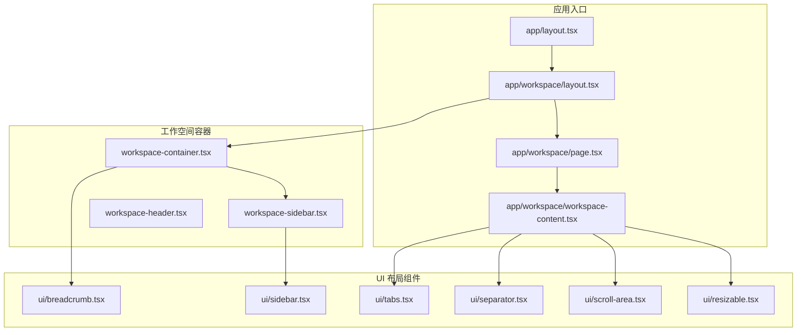
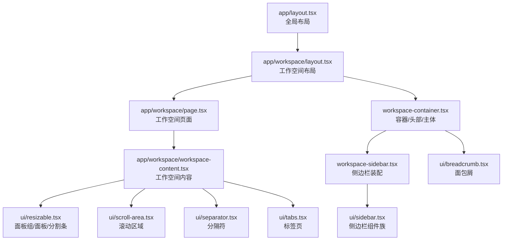
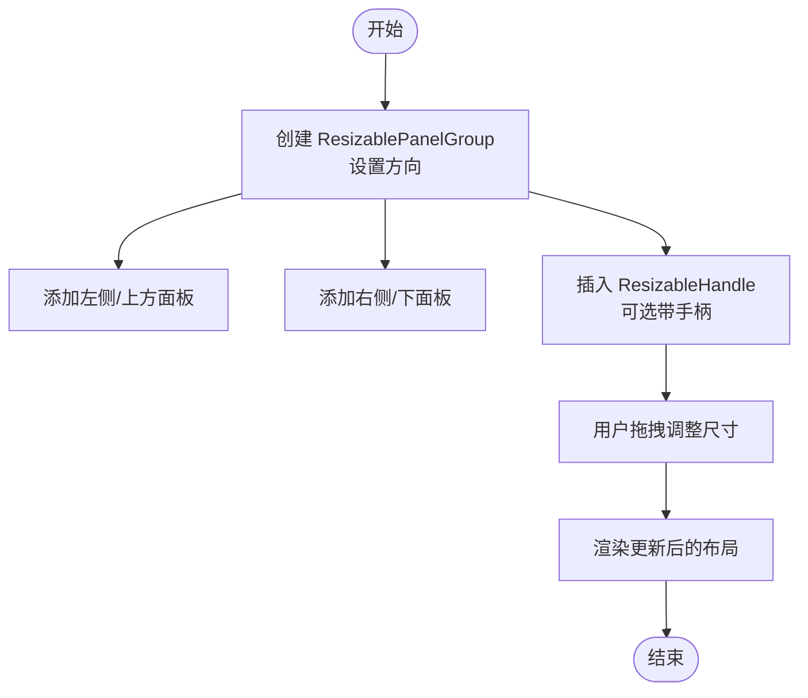
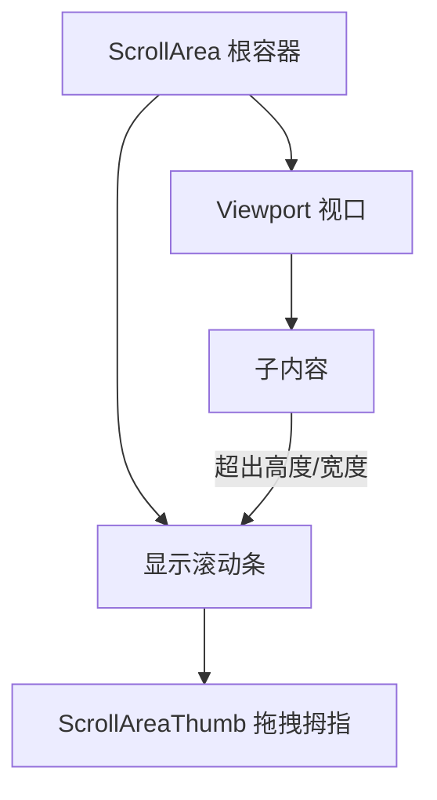
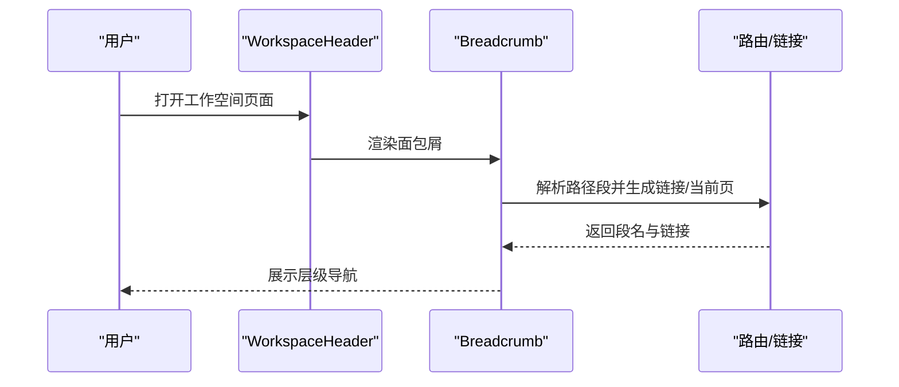
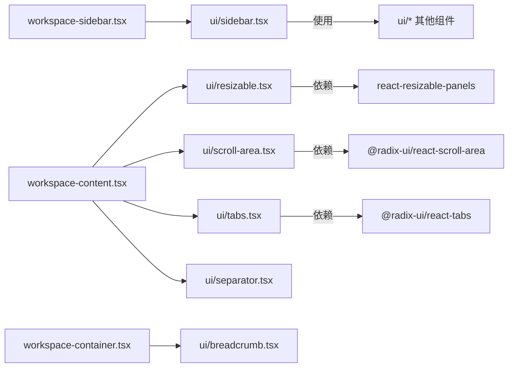

# 布局组件

<cite>
**本文引用的文件**
- [sidebar.tsx](file://frontend/src/components/ui/sidebar.tsx)
- [resizable.tsx](file://frontend/src/components/ui/resizable.tsx)
- [scroll-area.tsx](file://frontend/src/components/ui/scroll-area.tsx)
- [breadcrumb.tsx](file://frontend/src/components/ui/breadcrumb.tsx)
- [separator.tsx](file://frontend/src/components/ui/separator.tsx)
- [tabs.tsx](file://frontend/src/components/ui/tabs.tsx)
- [workspace-container.tsx](file://frontend/src/components/workspace/workspace-container.tsx)
- [workspace-sidebar.tsx](file://frontend/src/components/workspace/workspace-sidebar.tsx)
- [workspace-header.tsx](file://frontend/src/components/workspace/workspace-header.tsx)
- [layout.tsx](file://frontend/src/app/layout.tsx)
- [workspace/layout.tsx](file://frontend/src/app/workspace/layout.tsx)
- [workspace/page.tsx](file://frontend/src/app/workspace/page.tsx)
- [workspace/workspace-content.tsx](file://frontend/src/app/workspace/workspace-content.tsx)
</cite>

## 目录
1. [简介](#简介)
2. [项目结构](#项目结构)
3. [核心组件](#核心组件)
4. [架构总览](#架构总览)
5. [组件详解](#组件详解)
6. [依赖关系分析](#依赖关系分析)
7. [性能考量](#性能考量)
8. [故障排查指南](#故障排查指南)
9. [结论](#结论)
10. [附录](#附录)

## 简介
本文件面向 DeerFlow 前端的布局组件，系统性梳理并说明用于页面布局与结构组织的组件族：侧边栏、可调整大小面板、滚动区域、面包屑导航、分隔符与标签页。文档覆盖各组件的配置项、响应式行为与交互模式，并提供布局组合示例、网格系统集成建议以及移动端适配策略；同时阐述组件在工作空间与聊天界面中的典型应用场景。

## 项目结构
- 布局组件主要位于前端源码的 UI 组件库与工作空间专用容器中：
  - UI 基础布局：sidebar、resizable、scroll-area、breadcrumb、separator、tabs
  - 工作空间容器与侧边栏：workspace-container、workspace-sidebar、workspace-header
  - 应用级布局入口：app/layout、app/workspace/layout、app/workspace/page、app/workspace/workspace-content

**图表来源**
- [layout.tsx](file://frontend/src/app/layout.tsx)
- [workspace/layout.tsx](file://frontend/src/app/workspace/layout.tsx)
- [workspace/page.tsx](file://frontend/src/app/workspace/page.tsx)
- [workspace/workspace-content.tsx](file://frontend/src/app/workspace/workspace-content.tsx)
- [workspace-container.tsx](file://frontend/src/components/workspace/workspace-container.tsx)
- [workspace-sidebar.tsx](file://frontend/src/components/workspace/workspace-sidebar.tsx)
- [workspace-header.tsx](file://frontend/src/components/workspace/workspace-header.tsx)
- [sidebar.tsx](file://frontend/src/components/ui/sidebar.tsx)
- [resizable.tsx](file://frontend/src/components/ui/resizable.tsx)
- [scroll-area.tsx](file://frontend/src/components/ui/scroll-area.tsx)
- [breadcrumb.tsx](file://frontend/src/components/ui/breadcrumb.tsx)
- [separator.tsx](file://frontend/src/components/ui/separator.tsx)
- [tabs.tsx](file://frontend/src/components/ui/tabs.tsx)

**章节来源**
- [layout.tsx](file://frontend/src/app/layout.tsx)
- [workspace/layout.tsx](file://frontend/src/app/workspace/layout.tsx)
- [workspace/page.tsx](file://frontend/src/app/workspace/page.tsx)
- [workspace/workspace-content.tsx](file://frontend/src/app/workspace/workspace-content.tsx)

## 核心组件
- 侧边栏（Sidebar）：支持桌面端抽屉/图标折叠/无折叠三种模式，移动端以抽屉呈现，内置触发器与“rail”拖拽手柄，支持 Cookie 记忆展开状态与键盘快捷键。
- 可调整大小面板（Resizable）：基于 react-resizable-panels，提供水平/垂直方向的面板组、面板与带手柄的分割条。
- 滚动区域（Scroll Area）：基于 Radix UI，提供可视区与滚动条，支持水平/垂直方向。
- 面包屑（Breadcrumb）：导航层级指示，支持省略号与链接/当前页样式。
- 分隔符（Separator）：水平/垂直分隔线，用于内容分区。
- 标签页（Tabs）：支持横向/纵向与默认/线条两种样式变体。

**章节来源**
- [sidebar.tsx](file://frontend/src/components/ui/sidebar.tsx)
- [resizable.tsx](file://frontend/src/components/ui/resizable.tsx)
- [scroll-area.tsx](file://frontend/src/components/ui/scroll-area.tsx)
- [breadcrumb.tsx](file://frontend/src/components/ui/breadcrumb.tsx)
- [separator.tsx](file://frontend/src/components/ui/separator.tsx)
- [tabs.tsx](file://frontend/src/components/ui/tabs.tsx)

## 架构总览
下图展示应用布局从入口到工作空间容器与 UI 组件的总体关系，以及侧边栏在工作空间中的装配方式。

**图表来源**
- [layout.tsx](file://frontend/src/app/layout.tsx)
- [workspace/layout.tsx](file://frontend/src/app/workspace/layout.tsx)
- [workspace/page.tsx](file://frontend/src/app/workspace/page.tsx)
- [workspace/workspace-content.tsx](file://frontend/src/app/workspace/workspace-content.tsx)
- [workspace-container.tsx](file://frontend/src/components/workspace/workspace-container.tsx)
- [workspace-sidebar.tsx](file://frontend/src/components/workspace/workspace-sidebar.tsx)
- [sidebar.tsx](file://frontend/src/components/ui/sidebar.tsx)
- [resizable.tsx](file://frontend/src/components/ui/resizable.tsx)
- [scroll-area.tsx](file://frontend/src/components/ui/scroll-area.tsx)
- [breadcrumb.tsx](file://frontend/src/components/ui/breadcrumb.tsx)
- [separator.tsx](file://frontend/src/components/ui/separator.tsx)
- [tabs.tsx](file://frontend/src/components/ui/tabs.tsx)

## 组件详解

### 侧边栏（Sidebar）
- 功能要点
  - 支持三种可折叠模式：抽屉（offcanvas）、仅图标（icon）、不可折叠（none）。
  - 桌面端固定定位，移动端以抽屉形式弹出。
  - 内置触发器按钮与“rail”拖拽手柄，支持鼠标悬停显示与键盘快捷键（Cmd/Ctrl+B）切换。
  - 使用 Cookie 记忆展开状态，跨会话保持一致体验。
  - 提供 Header/Content/Footer/Group/Menu 系列子组件，便于构建复杂菜单与操作区。
- 关键属性与行为
  - Provider 参数：defaultOpen、open、onOpenChange
  - 组件参数：side（left/right）、variant（sidebar/floating/inset）、collapsible（offcanvas/icon/none）
  - 状态数据：state（expanded/collapsed）、open、openMobile、isMobile、toggleSidebar
- 与工作空间集成
  - 在工作空间侧边栏中，Header 装配工作空间头部，Content 装配聊天列表与最近对话，Footer 装配菜单，Rail 提供拖拽手柄。

```mermaid
classDiagram
class SidebarProvider {
+boolean defaultOpen
+boolean open?
+onOpenChange(open)
+string className?
+object style?
+ReactNode children
+state
+open
+openMobile
+isMobile
+toggleSidebar()
}
class Sidebar {
+string side
+string variant
+string collapsible
+string className?
+ReactNode children
}
class SidebarTrigger {
+string className?
+onClick(event)
}
class SidebarRail {
+string className?
}
class SidebarHeader
class SidebarContent
class SidebarFooter
class SidebarMenu
class SidebarMenuItem
class SidebarMenuButton
class SidebarMenuAction
class SidebarMenuBadge
class SidebarMenuSkeleton
class SidebarMenuSub
class SidebarMenuSubItem
class SidebarMenuSubButton
SidebarProvider --> Sidebar : "提供上下文"
Sidebar --> SidebarTrigger : "使用"
Sidebar --> SidebarRail : "使用"
Sidebar --> SidebarHeader : "包含"
Sidebar --> SidebarContent : "包含"
Sidebar --> SidebarFooter : "包含"
Sidebar --> SidebarMenu : "包含"
SidebarMenu --> SidebarMenuItem : "包含"
SidebarMenuItem --> SidebarMenuButton : "包含"
SidebarMenuItem --> SidebarMenuAction : "包含"
SidebarMenuItem --> SidebarMenuBadge : "包含"
SidebarMenuItem --> SidebarMenuSkeleton : "包含"
SidebarMenuItem --> SidebarMenuSub : "包含"
SidebarMenuSub --> SidebarMenuSubItem : "包含"
SidebarMenuSubItem --> SidebarMenuSubButton : "包含"
```

**图表来源**
- [sidebar.tsx](file://frontend/src/components/ui/sidebar.tsx)

**章节来源**
- [sidebar.tsx](file://frontend/src/components/ui/sidebar.tsx)
- [workspace-sidebar.tsx](file://frontend/src/components/workspace/workspace-sidebar.tsx)
- [workspace-header.tsx](file://frontend/src/components/workspace/workspace-header.tsx)

### 可调整大小面板（Resizable）
- 功能要点
  - ResizablePanelGroup：定义面板组，支持水平/垂直排列。
  - ResizablePanel：单个面板，承载内容。
  - ResizableHandle：分割条，可选带手柄图标，支持水平/垂直方向。
- 适用场景
  - 代码编辑器与预览区并排、左右或上下分割。
  - 多面板协作视图，如侧边栏与主内容区联动。

**图表来源**
- [resizable.tsx](file://frontend/src/components/ui/resizable.tsx)

**章节来源**
- [resizable.tsx](file://frontend/src/components/ui/resizable.tsx)

### 滚动区域（Scroll Area）
- 功能要点
  - ScrollArea：根容器，包裹可滚动内容。
  - ScrollBar/Thumb：根据滚动位置动态显示滚动条，支持水平/垂直方向。
- 适用场景
  - 长列表、日志输出、聊天消息流、侧边栏菜单等需要局部滚动的内容区域。

**图表来源**
- [scroll-area.tsx](file://frontend/src/components/ui/scroll-area.tsx)

**章节来源**
- [scroll-area.tsx](file://frontend/src/components/ui/scroll-area.tsx)

### 面包屑（Breadcrumb）
- 功能要点
  - Breadcrumb：导航容器。
  - BreadcrumbList/BreadcrumbItem：列表与项。
  - BreadcrumbLink/BreadcrumbPage：链接与当前页。
  - BreadcrumbSeparator/BreadcrumbEllipsis：分隔符与省略号。
- 适用场景
  - 工作空间头部的路径导航，结合路由自动解析段落名称。

**图表来源**
- [workspace-header.tsx](file://frontend/src/components/workspace/workspace-header.tsx)
- [workspace-container.tsx](file://frontend/src/components/workspace/workspace-container.tsx)
- [breadcrumb.tsx](file://frontend/src/components/ui/breadcrumb.tsx)

**章节来源**
- [workspace-header.tsx](file://frontend/src/components/workspace/workspace-header.tsx)
- [workspace-container.tsx](file://frontend/src/components/workspace/workspace-container.tsx)
- [breadcrumb.tsx](file://frontend/src/components/ui/breadcrumb.tsx)

### 分隔符（Separator）
- 功能要点
  - 支持水平/垂直方向，作为视觉分隔线使用。
- 适用场景
  - 列表项之间、菜单分组之间、标签页与内容之间进行清晰分界。

**章节来源**
- [separator.tsx](file://frontend/src/components/ui/separator.tsx)

### 标签页（Tabs）
- 功能要点
  - Tabs/TabsList/TabsTrigger/TabsContent：根容器、列表、触发器与内容区。
  - 支持横向/纵向与默认/线条两种样式变体。
- 适用场景
  - 设置页多分类、工具面板切换、聊天历史分组浏览等。

**章节来源**
- [tabs.tsx](file://frontend/src/components/ui/tabs.tsx)

## 依赖关系分析
- 组件内聚与耦合
  - SidebarProvider 为核心上下文提供者，被多个 Sidebar 子组件依赖；SidebarTrigger/SidebarRail 通过上下文控制状态。
  - 工作空间侧边栏装配了 Sidebar，并在其 Header/Content/Footer 中注入具体业务组件。
  - 工作空间容器（WorkspaceContainer）在头部集成了面包屑导航，主体区域承载内容。
- 外部依赖
  - Sidebar 依赖 Radix UI Tooltip、Sheet、Input、Separator、Button、Skeleton 等 UI 组件。
  - Resizable 依赖 react-resizable-panels。
  - ScrollArea 依赖 @radix-ui/react-scroll-area。
  - Tabs 依赖 @radix-ui/react-tabs。
- 潜在循环依赖
  - 当前文件间未见直接循环导入；工作空间组件对 UI 组件存在单向依赖。

**图表来源**
- [sidebar.tsx](file://frontend/src/components/ui/sidebar.tsx)
- [resizable.tsx](file://frontend/src/components/ui/resizable.tsx)
- [scroll-area.tsx](file://frontend/src/components/ui/scroll-area.tsx)
- [breadcrumb.tsx](file://frontend/src/components/ui/breadcrumb.tsx)
- [separator.tsx](file://frontend/src/components/ui/separator.tsx)
- [tabs.tsx](file://frontend/src/components/ui/tabs.tsx)
- [workspace-sidebar.tsx](file://frontend/src/components/workspace/workspace-sidebar.tsx)
- [workspace-container.tsx](file://frontend/src/components/workspace/workspace-container.tsx)

**章节来源**
- [sidebar.tsx](file://frontend/src/components/ui/sidebar.tsx)
- [resizable.tsx](file://frontend/src/components/ui/resizable.tsx)
- [scroll-area.tsx](file://frontend/src/components/ui/scroll-area.tsx)
- [breadcrumb.tsx](file://frontend/src/components/ui/breadcrumb.tsx)
- [separator.tsx](file://frontend/src/components/ui/separator.tsx)
- [tabs.tsx](file://frontend/src/components/ui/tabs.tsx)
- [workspace-sidebar.tsx](file://frontend/src/components/workspace/workspace-sidebar.tsx)
- [workspace-container.tsx](file://frontend/src/components/workspace/workspace-container.tsx)

## 性能考量
- 渲染优化
  - Sidebar 在桌面端采用固定定位与过渡动画，注意避免在大列表中频繁重排；可结合虚拟滚动（如外部库）降低 DOM 节点数量。
  - ResizableHandle 默认带手柄时增加一层元素，拖拽过程尽量减少重绘；必要时可禁用手柄以简化渲染。
- 交互节流
  - 滚动区域的滚动条显示逻辑已由底层组件处理；自定义滚动容器时应避免在滚动事件中执行昂贵计算。
- 状态持久化
  - 侧边栏状态通过 Cookie 记忆，首次加载即能恢复状态，减少不必要的布局抖动。

## 故障排查指南
- 侧边栏不响应点击/键盘
  - 检查是否正确包裹在 SidebarProvider 下；确认 useSidebar 是否在组件树中可用。
  - 键盘快捷键需在全局监听，确保未被其他事件处理器阻止。
- 移动端抽屉无法打开
  - 确认 isMobile 判断逻辑与设备断点一致；检查 Sheet 的 open/onOpenChange 是否正确绑定。
- 拖拽手柄无效
  - 确保 ResizableHandle 的父级为 ResizablePanelGroup，且方向设置正确（水平/垂直）。
- 滚动条不显示
  - 确认内容超出容器尺寸；检查 ScrollArea 的 viewport 与 scrollbar 容器是否正确嵌套。
- 面包屑链接错误
  - 检查路由路径与 segments 解析逻辑；确认链接目标与当前页面路径一致。

**章节来源**
- [sidebar.tsx](file://frontend/src/components/ui/sidebar.tsx)
- [resizable.tsx](file://frontend/src/components/ui/resizable.tsx)
- [scroll-area.tsx](file://frontend/src/components/ui/scroll-area.tsx)
- [workspace-header.tsx](file://frontend/src/components/workspace/workspace-header.tsx)

## 结论
DeerFlow 的布局组件围绕 Sidebar、Resizable、ScrollArea、Breadcrumb、Separator、Tabs 构建，形成一套可复用、可扩展的页面骨架。通过 Provider 上下文与工作空间容器的组合，实现了从入口到页面再到内容区的完整布局链路。组件具备良好的响应式与交互能力，适合在工作空间与聊天界面中灵活组合使用。

## 附录

### 布局组合示例（思路）
- 左侧固定侧边栏 + 主内容区
  - 使用 WorkspaceSidebar（Sidebar + Header/Content/Footer）+ SidebarRail 实现可折叠与拖拽。
  - 主内容区使用 ResizablePanelGroup 将编辑区与预览区并排，Handle 带手柄提升可发现性。
- 顶部面包屑 + 侧边栏 + 中央内容 + 底部分隔符
  - WorkspaceHeader 集成面包屑与触发器；内容区底部放置 Separator 进行视觉分界。
- 多标签页内容区
  - 使用 Tabs 切换不同视图（如“聊天”、“设置”、“日志”），每个 Tab 对应独立内容区。

### 网格系统集成建议
- 建议在 Resizable 面板内部使用 CSS Grid 或 Flex 布局组织子内容，避免在组件外层过度嵌套容器。
- 对于复杂面板，优先使用 ResizablePanelGroup 的方向属性统一管理布局方向，减少条件分支。

### 移动端适配方案
- 侧边栏在移动端以抽屉呈现，建议在小屏设备上将菜单项收拢为图标模式（collapsible="icon"），并通过 SidebarTrigger 快速切换。
- 滚动区域在移动端保持原生滚动体验，避免引入额外滚动容器导致回弹异常。
- 面包屑在窄屏时可隐藏中间段落，仅保留首尾两级，必要时使用省略号。