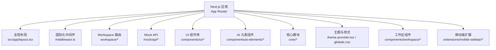
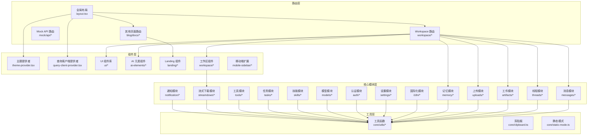
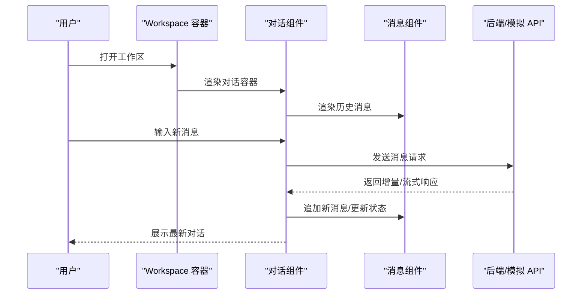
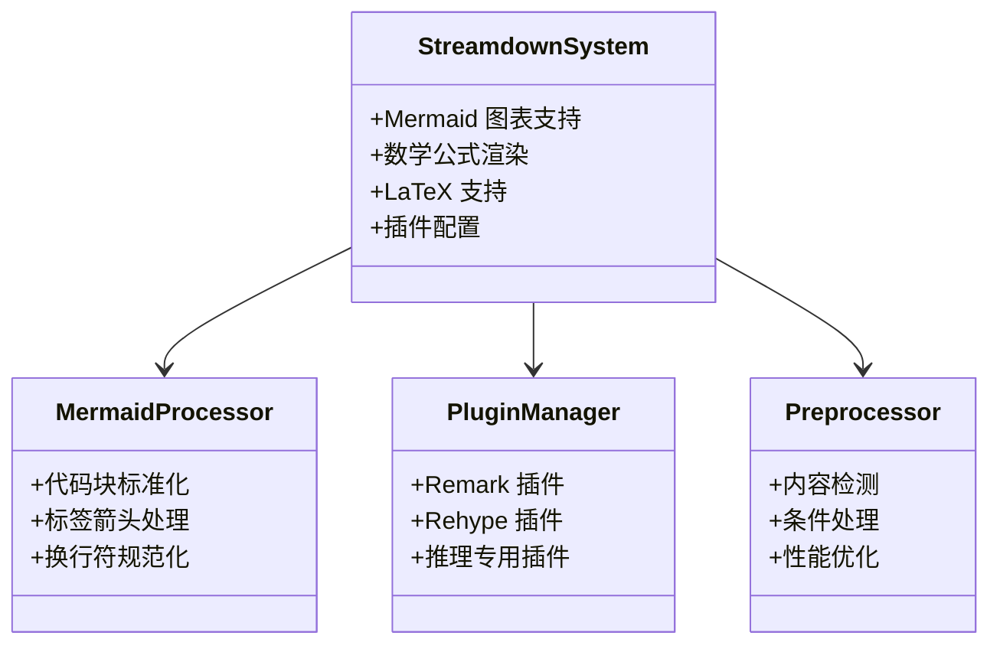
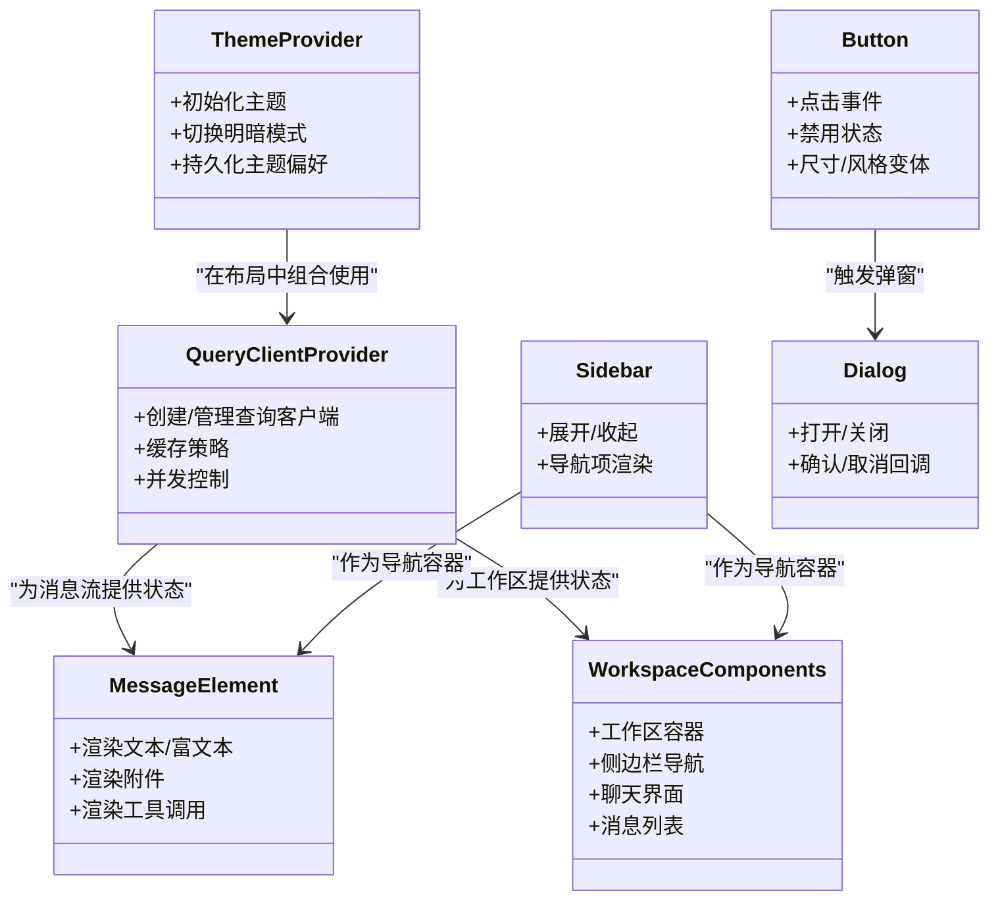
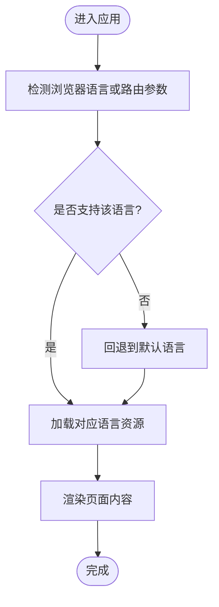
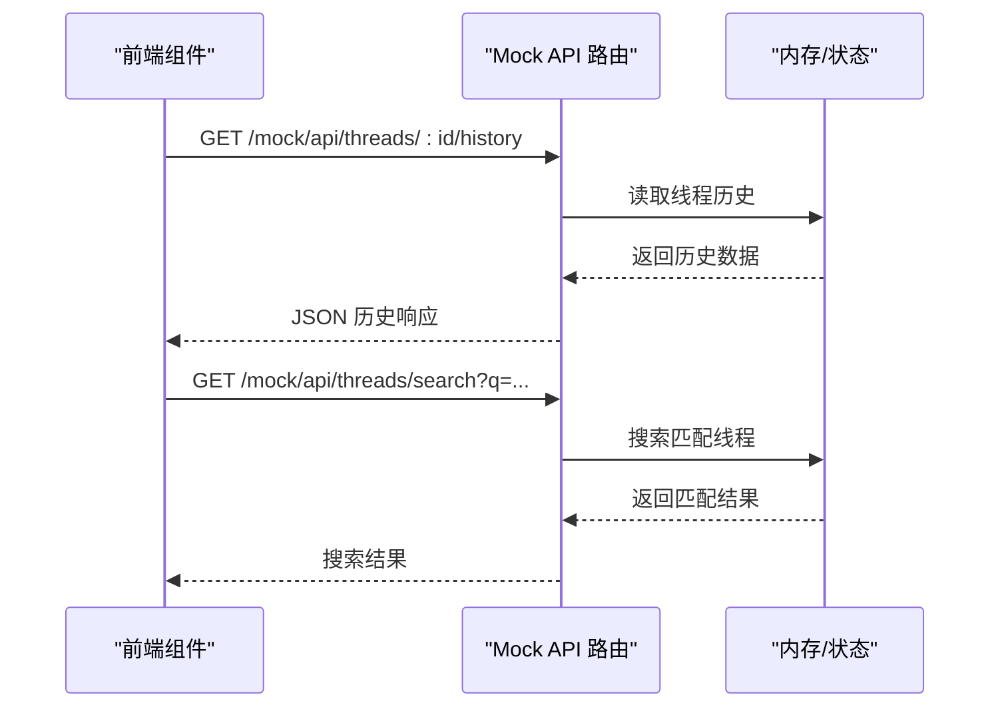
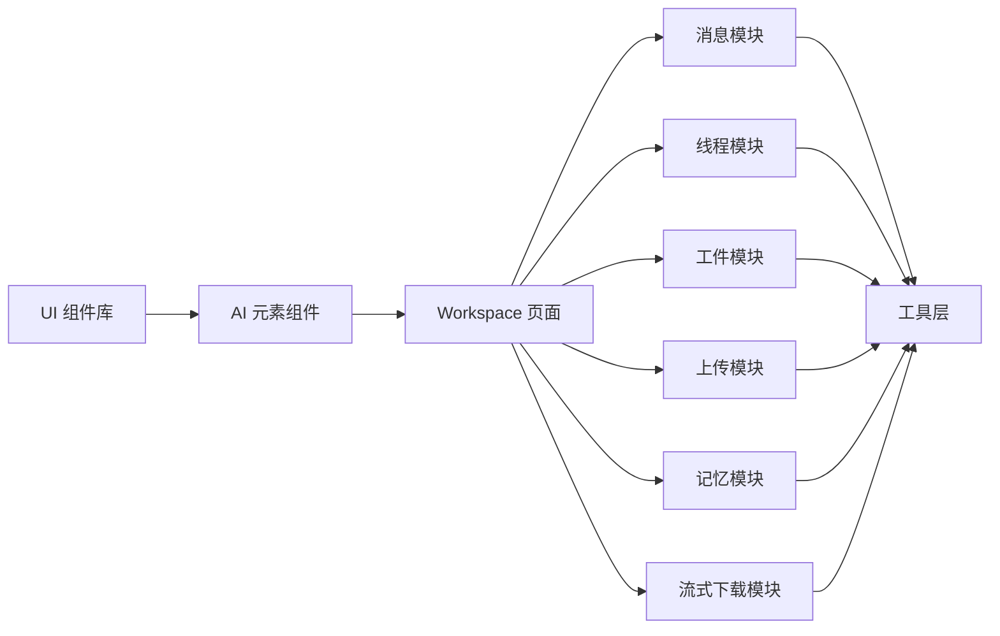

# 前端系统

<cite>
**本文引用的文件**
- [package.json](file://frontend/package.json)
- [next.config.js](file://frontend/next.config.js)
- [middleware.ts](file://frontend/middleware.ts)
- [src/app/layout.tsx](file://frontend/src/app/layout.tsx)
- [src/components/theme-provider.tsx](file://frontend/src/components/theme-provider.tsx)
- [src/components/query-client-provider.tsx](file://frontend/src/components/query-client-provider.tsx)
- [src/hooks/use-global-shortcuts.ts](file://frontend/src/hooks/use-global-shortcuts.ts)
- [src/hooks/use-mobile.ts](file://frontend/src/hooks/use-mobile.ts)
- [src/lib/utils.ts](file://frontend/src/lib/utils.ts)
- [src/lib/ime.ts](file://frontend/src/lib/ime.ts)
- [src/styles/globals.css](file://frontend/src/styles/globals.css)
- [src/app/workspace/layout.tsx](file://frontend/src/app/workspace/layout.tsx)
- [src/app/workspace/page.tsx](file://frontend/src/app/workspace/page.tsx)
- [src/app/workspace/workspace-content.tsx](file://frontend/src/app/workspace/workspace-content.tsx)
- [src/app/api/memory/route.ts](file://frontend/src/app/api/memory/route.ts)
- [src/app/api/memory/[...path]/route.ts](file://frontend/src/app/api/memory/[...path]/route.ts)
- [src/app/mock/api/threads/[thread_id]/history/route.ts](file://frontend/src/app/mock/api/threads/[thread_id]/history/route.ts)
- [src/app/mock/api/threads/search/route.ts](file://frontend/src/app/mock/api/threads/search/route.ts)
- [src/app/mock/api/threads/[thread_id]/artifacts/[[...artifact_path]]/route.ts](file://frontend/src/app/mock/api/threads/[thread_id]/artifacts/[[...artifact_path]]/route.ts)
- [src/app/mock/api/mcp/config/route.ts](file://frontend/src/app/mock/api/mcp/config/route.ts)
- [src/app/mock/api/models/route.ts](file://frontend/src/app/mock/api/models/route.ts)
- [src/app/mock/api/skills/route.ts](file://frontend/src/app/mock/api/skills/route.ts)
- [src/components/ui/sidebar.tsx](file://frontend/src/components/ui/sidebar.tsx)
- [src/components/ui/button.tsx](file://frontend/src/components/ui/button.tsx)
- [src/components/ui/dialog.tsx](file://frontend/src/components/ui/dialog.tsx)
- [src/components/ui/input.tsx](file://frontend/src/components/ui/input.tsx)
- [src/components/ui/select.tsx](file://frontend/src/components/ui/select.tsx)
- [src/components/ui/tabs.tsx](file://frontend/src/components/ui/tabs.tsx)
- [src/components/ui/scroll-area.tsx](file://frontend/src/components/ui/scroll-area.tsx)
- [src/components/ui/resizable.tsx](file://frontend/src/components/ui/resizable.tsx)
- [src/components/ui/sonner.tsx](file://frontend/src/components/ui/sonner.tsx)
- [src/components/ui/dropdown-menu.tsx](file://frontend/src/components/ui/dropdown-menu.tsx)
- [src/components/ui/card.tsx](file://frontend/src/components/ui/card.tsx)
- [src/components/ui/badge.tsx](file://frontend/src/components/ui/badge.tsx)
- [src/components/ui/avatar.tsx](file://frontend/src/components/ui/avatar.tsx)
- [src/components/ui/progress.tsx](file://frontend/src/components/ui/progress.tsx)
- [src/components/ui/switch.tsx](file://frontend/src/components/ui/switch.tsx)
- [src/components/ui/separator.tsx](file://frontend/src/components/ui/separator.tsx)
- [src/components/ui/empty.tsx](file://frontend/src/components/ui/empty.tsx)
- [src/components/ui/alert.tsx](file://frontend/src/components/ui/alert.tsx)
- [src/components/ui/skeleton.tsx](file://frontend/src/components/ui/skeleton.tsx)
- [src/components/ui/spotlight-card.tsx](file://frontend/src/components/ui/spotlight-card.tsx)
- [src/components/ui/magic-bento.tsx](file://frontend/src/components/ui/magic-bento.tsx)
- [src/components/ui/flickering-grid.tsx](file://frontend/src/components/ui/flickering-grid.tsx)
- [src/components/ui/number-ticker.tsx](file://frontend/src/components/ui/number-ticker.tsx)
- [src/components/ui/aurora-text.tsx](file://frontend/src/components/ui/aurora-text.tsx)
- [src/components/ui/shine-border.tsx](file://frontend/src/components/ui/shine-border.tsx)
- [src/components/ui/command.tsx](file://frontend/src/components/ui/command.tsx)
- [src/components/ui/carousel.tsx](file://frontend/src/components/ui/carousel.tsx)
- [src/components/ui/collapsible.tsx](file://frontend/src/components/ui/collapsible.tsx)
- [src/components/ui/hover-card.tsx](file://frontend/src/components/ui/hover-card.tsx)
- [src/components/ui/item.tsx](file://frontend/src/components/ui/item.tsx)
- [src/components/ui/breadcrumb.tsx](file://frontend/src/components/ui/breadcrumb.tsx)
- [src/components/ui/button-group.tsx](file://frontend/src/components/ui/button-group.tsx)
- [src/components/ui/input-group.tsx](file://frontend/src/components/ui/input-group.tsx)
- [src/components/ui/sonner.tsx](file://frontend/src/components/ui/sonner.tsx)
- [src/components/ai-elements/message.tsx](file://frontend/src/components/ai-elements/message.tsx)
- [src/components/ai-elements/artifact.tsx](file://frontend/src/components/ai-elements/artifact.tsx)
- [src/components/ai-elements/conversation.tsx](file://frontend/src/components/ai-elements/conversation.tsx)
- [src/components/ai-elements/code-block.tsx](file://frontend/src/components/ai-elements/code-block.tsx)
- [src/components/ai-elements/image.tsx](file://frontend/src/components/ai-elements/image.tsx)
- [src/components/ai-elements/sources.tsx](file://frontend/src/components/ai-elements/sources.tsx)
- [src/components/ai-elements/web-preview.tsx](file://frontend/src/components/ai-elements/web-preview.tsx)
- [src/components/ai-elements/task.tsx](file://frontend/src/components/ai-elements/task.tsx)
- [src/components/ai-elements/plan.tsx](file://frontend/src/components/ai-elements/plan.tsx)
- [src/components/ai-elements/prompt-input.tsx](file://frontend/src/components/ai-elements/prompt-input.tsx)
- [src/components/ai-elements/model-selector.tsx](file://frontend/src/components/ai-elements/model-selector.tsx)
- [src/components/ai-elements/loader.tsx](file://frontend/src/components/ai-elements/loader.tsx)
- [src/components/ai-elements/shimmer.tsx](file://frontend/src/components/ai-elements/shimmer.tsx)
- [src/components/ai-elements/suggestion.tsx](file://frontend/src/components/ai-elements/suggestion.tsx)
- [src/components/ai-elements/context.tsx](file://frontend/src/components/ai-elements/context.tsx)
- [src/components/ai-elements/toolbar.tsx](file://frontend/src/components/ai-elements/toolbar.tsx)
- [src/components/ai-elements/controls.tsx](file://frontend/src/components/ai-elements/controls.tsx)
- [src/components/ai-elements/node.tsx](file://frontend/src/components/ai-elements/node.tsx)
- [src/components/ai-elements/edge.tsx](file://frontend/src/components/ai-elements/edge.tsx)
- [src/components/ai-elements/connection.tsx](file://frontend/src/components/ai-elements/connection.tsx)
- [src/components/ai-elements/checkpoint.tsx](file://frontend/src/components/ai-elements/checkpoint.tsx)
- [src/components/ai-elements/queue.tsx](file://frontend/src/components/ai-elements/queue.tsx)
- [src/components/ai-elements/reasoning.tsx](file://frontend/src/components/ai-elements/reasoning.tsx)
- [src/components/ai-elements/canvas.tsx](file://frontend/src/components/ai-elements/canvas.tsx)
- [src/components/ai-elements/open-in-chat.tsx](file://frontend/src/components/ai-elements/open-in-chat.tsx)
- [src/components/ai-elements/panel.tsx](file://frontend/src/components/ai-elements/panel.tsx)
- [src/components/ai-elements/chain-of-thought.tsx](file://frontend/src/components/ai-elements/chain-of-thought.tsx)
- [src/components/landing/footer.tsx](file://frontend/src/components/landing/footer.tsx)
- [src/components/landing/header.tsx](file://frontend/src/components/landing/header.tsx)
- [src/components/landing/hero.tsx](file://frontend/src/components/landing/hero.tsx)
- [src/components/landing/post-list.tsx](file://frontend/src/components/landing/post-list.tsx)
- [src/components/landing/sections/section.tsx](file://frontend/src/components/landing/sections/section.tsx)
- [src/components/landing/sections/section.tsx](file://frontend/src/components/landing/sections/section.tsx)
- [src/components/landing/sections/section.tsx](file://frontend/src/components/landing/sections/section.tsx)
- [src/components/landing/sections/section.tsx](file://frontend/src/components/landing/sections/section.tsx)
- [src/components/landing/sections/section.tsx](file://frontend/src/components/landing/sections/section.tsx)
- [src/components/landing/sections/section.tsx](file://frontend/src/components/landing/sections/section.tsx)
- [src/components/landing/progressive-skills-animation.tsx](file://frontend/src/components/landing/progressive-skills-animation.tsx)
- [src/core/messages/types.ts](file://frontend/src/core/messages/types.ts)
- [src/core/messages/api.ts](file://frontend/src/core/messages/api.ts)
- [src/core/threads/types.ts](file://frontend/src/core/threads/types.ts)
- [src/core/threads/api.ts](file://frontend/src/core/threads/api.ts)
- [src/core/artifacts/types.ts](file://frontend/src/core/artifacts/types.ts)
- [src/core/artifacts/api.ts](file://frontend/src/core/artifacts/api.ts)
- [src/core/uploads/types.ts](file://frontend/src/core/uploads/types.ts)
- [src/core/uploads/api.ts](file://frontend/src/core/uploads/api.ts)
- [src/core/memory/types.ts](file://frontend/src/core/memory/types.ts)
- [src/core/memory/api.ts](file://frontend/src/core/memory/api.ts)
- [src/core/i18n/config.ts](file://frontend/src/core/i18n/config.ts)
- [src/core/i18n/locales.ts](file://frontend/src/core/i18n/locales.ts)
- [src/core/i18n/translation.ts](file://frontend/src/core/i18n/translation.ts)
- [src/core/settings/types.ts](file://frontend/src/core/settings/types.ts)
- [src/core/settings/api.ts](file://frontend/src/core/settings/api.ts)
- [src/core/auth/types.ts](file://frontend/src/core/auth/types.ts)
- [src/core/auth/api.ts](file://frontend/src/core/auth/api.ts)
- [src/core/models/types.ts](file://frontend/src/core/models/types.ts)
- [src/core/models/api.ts](file://frontend/src/core/models/api.ts)
- [src/core/skills/types.ts](file://frontend/src/core/skills/types.ts)
- [src/core/skills/api.ts](file://frontend/src/core/skills/api.ts)
- [src/core/tasks/types.ts](file://frontend/src/core/tasks/types.ts)
- [src/core/tasks/api.ts](file://frontend/src/core/tasks/api.ts)
- [src/core/tools/types.ts](file://frontend/src/core/tools/types.ts)
- [src/core/tools/api.ts](file://frontend/src/core/tools/api.ts)
- [src/core/streamdown/index.ts](file://frontend/src/core/streamdown/index.ts)
- [src/core/streamdown/mermaid.ts](file://frontend/src/core/streamdown/mermaid.ts)
- [src/core/streamdown/plugins.ts](file://frontend/src/core/streamdown/plugins.ts)
- [src/core/streamdown/preprocess.ts](file://frontend/src/core/streamdown/preprocess.ts)
- [src/core/notification/types.ts](file://frontend/src/core/notification/types.ts)
- [src/core/notification/api.ts](file://frontend/src/core/notification/api.ts)
- [src/core/utils/date.ts](file://frontend/src/core/utils/date.ts)
- [src/core/utils/validation.ts](file://frontend/src/core/utils/validation.ts)
- [src/core/utils/dom.ts](file://frontend/src/core/utils/dom.ts)
- [src/core/utils/network.ts](file://frontend/src/core/utils/network.ts)
- [src/core/utils/storage.ts](file://frontend/src/core/utils/storage.ts)
- [src/core/utils/logger.ts](file://frontend/src/core/utils/logger.ts)
- [src/core/utils/misc.ts](file://frontend/src/core/utils/misc.ts)
- [src/core/clipboard.ts](file://frontend/src/core/clipboard.ts)
- [src/core/static-mode.ts](file://frontend/src/core/static-mode.ts)
- [src/env.js](file://frontend/src/env.js)
- [src/mdx-components.ts](file://frontend/src/mdx-components.ts)
- [src/app/mock/api/threads/[thread_id]/history/route.ts](file://frontend/src/app/mock/api/threads/[thread_id]/history/route.ts)
- [src/app/mock/api/threads/search/route.ts](file://frontend/src/app/mock/api/threads/search/route.ts)
- [src/app/mock/api/threads/[thread_id]/artifacts/[[...artifact_path]]/route.ts](file://frontend/src/app/mock/api/threads/[thread_id]/artifacts/[[...artifact_path]]/route.ts)
- [src/app/mock/api/mcp/config/route.ts](file://frontend/src/app/mock/api/mcp/config/route.ts)
- [src/app/mock/api/models/route.ts](file://frontend/src/app/mock/api/models/route.ts)
- [src/app/mock/api/skills/route.ts](file://frontend/src/app/mock/api/skills/route.ts)
- [src/app/api/memory/route.ts](file://frontend/src/app/api/memory/route.ts)
- [src/app/api/memory/[...path]/route.ts](file://frontend/src/app/api/memory/[...path]/route.ts)
- [src/app/workspace/layout.tsx](file://frontend/src/app/workspace/layout.tsx)
- [src/app/workspace/page.tsx](file://frontend/src/app/workspace/page.tsx)
- [src/app/workspace/workspace-content.tsx](file://frontend/src/app/workspace/workspace-content.tsx)
- [src/components/ui/sidebar.tsx](file://frontend/src/components/ui/sidebar.tsx)
- [src/components/ui/button.tsx](file://frontend/src/components/ui/button.tsx)
- [src/components/ui/dialog.tsx](file://frontend/src/components/ui/dialog.tsx)
- [src/components/ui/input.tsx](file://frontend/src/components/ui/input.tsx)
- [src/components/ui/select.tsx](file://frontend/src/components/ui/select.tsx)
- [src/components/ui/tabs.tsx](file://frontend/src/components/ui/tabs.tsx)
- [src/components/ui/scroll-area.tsx](file://frontend/src/components/ui/scroll-area.tsx)
- [src/components/ui/resizable.tsx](file://frontend/src/components/ui/resizable.tsx)
- [src/components/ui/sonner.tsx](file://frontend/src/components/ui/sonner.tsx)
- [src/components/ui/dropdown-menu.tsx](file://frontend/src/components/ui/dropdown-menu.tsx)
- [src/components/ui/card.tsx](file://frontend/src/components/ui/card.tsx)
- [src/components/ui/badge.tsx](file://frontend/src/components/ui/badge.tsx)
- [src/components/ui/avatar.tsx](file://frontend/src/components/ui/avatar.tsx)
- [src/components/ui/progress.tsx](file://frontend/src/components/ui/progress.tsx)
- [src/components/ui/switch.tsx](file://frontend/src/components/ui/switch.tsx)
- [src/components/ui/separator.tsx](file://frontend/src/components/ui/separator.tsx)
- [src/components/ui/empty.tsx](file://frontend/src/components/ui/empty.tsx)
- [src/components/ui/alert.tsx](file://frontend/src/components/ui/alert.tsx)
- [src/components/ui/skeleton.tsx](file://frontend/src/components/ui/skeleton.tsx)
- [src/components/ui/spotlight-card.tsx](file://frontend/src/components/ui/spotlight-card.tsx)
- [src/components/ui/magic-bento.tsx](file://frontend/src/components/ui/magic-bento.tsx)
- [src/components/ui/flickering-grid.tsx](file://frontend/src/components/ui/flickering-grid.tsx)
- [src/components/ui/number-ticker.tsx](file://frontend/src/components/ui/number-ticker.tsx)
- [src/components/ui/aurora-text.tsx](file://frontend/src/components/ui/aurora-text.tsx)
- [src/components/ui/shine-border.tsx](file://frontend/src/components/ui/shine-border.tsx)
- [src/components/ui/command.tsx](file://frontend/src/components/ui/command.tsx)
- [src/components/ui/carousel.tsx](file://frontend/src/components/ui/carousel.tsx)
- [src/components/ui/collapsible.tsx](file://frontend/src/components/ui/collapsible.tsx)
- [src/components/ui/hover-card.tsx](file://frontend/src/components/ui/hover-card.tsx)
- [src/components/ui/item.tsx](file://frontend/src/components/ui/item.tsx)
- [src/components/ui/breadcrumb.tsx](file://frontend/src/components/ui/breadcrumb.tsx)
- [src/components/ui/button-group.tsx](file://frontend/src/components/ui/button-group.tsx)
- [src/components/ui/input-group.tsx](file://frontend/src/components/ui/input-group.tsx)
- [src/components/ui/sonner.tsx](file://frontend/src/components/ui/sonner.tsx)
- [src/components/ai-elements/message.tsx](file://frontend/src/components/ai-elements/message.tsx)
- [src/components/ai-elements/artifact.tsx](file://frontend/src/components/ai-elements/artifact.tsx)
- [src/components/ai-elements/conversation.tsx](file://frontend/src/components/ai-elements/conversation.tsx)
- [src/components/ai-elements/code-block.tsx](file://frontend/src/components/ai-elements/code-block.tsx)
- [src/components/ai-elements/image.tsx](file://frontend/src/components/ai-elements/image.tsx)
- [src/components/ai-elements/sources.tsx](file://frontend/src/components/ai-elements/sources.tsx)
- [src/components/ai-elements/web-preview.tsx](file://frontend/src/components/ai-elements/web-preview.tsx)
- [src/components/ai-elements/task.tsx](file://frontend/src/components/ai-elements/task.tsx)
- [src/components/ai-elements/plan.tsx](file://frontend/src/components/ai-elements/plan.tsx)
- [src/components/ai-elements/prompt-input.tsx](file://frontend/src/components/ai-elements/prompt-input.tsx)
- [src/components/ai-elements/model-selector.tsx](file://frontend/src/components/ai-elements/model-selector.tsx)
- [src/components/ai-elements/loader.tsx](file://frontend/src/components/ai-elements/loader.tsx)
- [src/components/ai-elements/shimmer.tsx](file://frontend/src/components/ai-elements/shimmer.tsx)
- [src/components/ai-elements/suggestion.tsx](file://frontend/src/components/ai-elements/suggestion.tsx)
- [src/components/ai-elements/context.tsx](file://frontend/src/components/ai-elements/context.tsx)
- [src/components/ai-elements/toolbar.tsx](file://frontend/src/components/ai-elements/toolbar.tsx)
- [src/components/ai-elements/controls.tsx](file://frontend/src/components/ai-elements/controls.tsx)
- [src/components/ai-elements/node.tsx](file://frontend/src/components/ai-elements/node.tsx)
- [src/components/ai-elements/edge.tsx](file://frontend/src/components/ai-elements/edge.tsx)
- [src/components/ai-elements/connection.tsx](file://frontend/src/components/ai-elements/connection.tsx)
- [src/components/ai-elements/checkpoint.tsx](file://frontend/src/components/ai-elements/checkpoint.tsx)
- [src/components/ai-elements/queue.tsx](file://frontend/src/components/ai-elements/queue.tsx)
- [src/components/ai-elements/reasoning.tsx](file://frontend/src/components/ai-elements/reasoning.tsx)
- [src/components/ai-elements/canvas.tsx](file://frontend/src/components/ai-elements/canvas.tsx)
- [src/components/ai-elements/open-in-chat.tsx](file://frontend/src/components/ai-elements/open-in-chat.tsx)
- [src/components/ai-elements/panel.tsx](file://frontend/src/components/ai-elements/panel.tsx)
- [src/components/ai-elements/chain-of-thought.tsx](file://frontend/src/components/ai-elements/chain-of-thought.tsx)
- [src/components/landing/footer.tsx](file://frontend/src/components/landing/footer.tsx)
- [src/components/landing/header.tsx](file://frontend/src/components/landing/header.tsx)
- [src/components/landing/hero.tsx](file://frontend/src/components/landing/hero.tsx)
- [src/components/landing/post-list.tsx](file://frontend/src/components/landing/post-list.tsx)
- [src/components/landing/sections/section.tsx](file://frontend/src/components/landing/sections/section.tsx)
- [src/components/landing/progressive-skills-animation.tsx](file://frontend/src/components/landing/progressive-skills-animation.tsx)
- [src/core/messages/types.ts](file://frontend/src/core/messages/types.ts)
- [src/core/messages/api.ts](file://frontend/src/core/messages/api.ts)
- [src/core/threads/types.ts](file://frontend/src/core/threads/types.ts)
- [src/core/threads/api.ts](file://frontend/src/core/threads/api.ts)
- [src/core/artifacts/types.ts](file://frontend/src/core/artifacts/types.ts)
- [src/core/artifacts/api.ts](file://frontend/src/core/artifacts/api.ts)
- [src/core/uploads/types.ts](file://frontend/src/core/uploads/types.ts)
- [src/core/uploads/api.ts](file://frontend/src/core/uploads/api.ts)
- [src/core/memory/types.ts](file://frontend/src/core/memory/types.ts)
- [src/core/memory/api.ts](file://frontend/src/core/memory/api.ts)
- [src/core/i18n/config.ts](file://frontend/src/core/i18n/config.ts)
- [src/core/i18n/locales.ts](file://frontend/src/core/i18n/locales.ts)
- [src/core/i18n/translation.ts](file://frontend/src/core/i18n/translation.ts)
- [src/core/settings/types.ts](file://frontend/src/core/settings/types.ts)
- [src/core/settings/api.ts](file://frontend/src/core/settings/api.ts)
- [src/core/auth/types.ts](file://frontend/src/core/auth/types.ts)
- [src/core/auth/api.ts](file://frontend/src/core/auth/api.ts)
- [src/core/models/types.ts](file://frontend/src/core/models/types.ts)
- [src/core/models/api.ts](file://frontend/src/core/models/api.ts)
- [src/core/skills/types.ts](file://frontend/src/core/skills/types.ts)
- [src/core/skills/api.ts](file://frontend/src/core/skills/api.ts)
- [src/core/tasks/types.ts](file://frontend/src/core/tasks/types.ts)
- [src/core/tasks/api.ts](file://frontend/src/core/tasks/api.ts)
- [src/core/tools/types.ts](file://frontend/src/core/tools/types.ts)
- [src/core/tools/api.ts](file://frontend/src/core/tools/api.ts)
- [src/core/streamdown/index.ts](file://frontend/src/core/streamdown/index.ts)
- [src/core/streamdown/mermaid.ts](file://frontend/src/core/streamdown/mermaid.ts)
- [src/core/streamdown/plugins.ts](file://frontend/src/core/streamdown/plugins.ts)
- [src/core/streamdown/preprocess.ts](file://frontend/src/core/streamdown/preprocess.ts)
- [src/core/notification/types.ts](file://frontend/src/core/notification/types.ts)
- [src/core/notification/api.ts](file://frontend/src/core/notification/api.ts)
- [src/core/utils/date.ts](file://frontend/src/core/utils/date.ts)
- [src/core/utils/validation.ts](file://frontend/src/core/utils/validation.ts)
- [src/core/utils/dom.ts](file://frontend/src/core/utils/dom.ts)
- [src/core/utils/network.ts](file://frontend/src/core/utils/network.ts)
- [src/core/utils/storage.ts](file://frontend/src/core/utils/storage.ts)
- [src/core/utils/logger.ts](file://frontend/src/core/utils/logger.ts)
- [src/core/utils/misc.ts](file://frontend/src/core/utils/misc.ts)
- [src/core/clipboard.ts](file://frontend/src/core/clipboard.ts)
- [src/core/static-mode.ts](file://frontend/src/core/static-mode.ts)
- [src/env.js](file://frontend/src/env.js)
- [src/mdx-components.ts](file://frontend/src/mdx-components.ts)
- [src/components/workspace/workspace-container.tsx](file://frontend/src/components/workspace/workspace-container.tsx)
- [src/components/workspace/workspace-sidebar.tsx](file://frontend/src/components/workspace/workspace-sidebar.tsx)
- [src/components/workspace/workspace-header.tsx](file://frontend/src/components/workspace/workspace-header.tsx)
- [src/components/workspace/workspace-body.tsx](file://frontend/src/components/workspace/workspace-body.tsx)
- [src/components/workspace/workspace-nav-chat-list.tsx](file://frontend/src/components/workspace/workspace-nav-chat-list.tsx)
- [src/components/workspace/workspace-nav-menu.tsx](file://frontend/src/components/workspace/workspace-nav-menu.tsx)
- [src/components/workspace/recent-chat-list.tsx](file://frontend/src/components/workspace/recent-chat-list.tsx)
- [src/components/workspace/github-icon.tsx](file://frontend/src/components/workspace/github-icon.tsx)
- [src/components/workspace/tooltip.tsx](file://frontend/src/components/workspace/tooltip.tsx)
- [src/components/workspace/agent-welcome.tsx](file://frontend/src/components/workspace/agent-welcome.tsx)
- [src/components/workspace/welcome.tsx](file://frontend/src/components/workspace/welcome.tsx)
- [src/components/workspace/input-box.tsx](file://frontend/src/components/workspace/input-box.tsx)
- [src/components/workspace/streaming-indicator.tsx](file://frontend/src/components/workspace/streaming-indicator.tsx)
- [src/components/workspace/thread-title.tsx](file://frontend/src/components/workspace/thread-title.tsx)
- [src/components/workspace/todo-list.tsx](file://frontend/src/components/workspace/todo-list.tsx)
- [src/components/workspace/token-usage-indicator.tsx](file://frontend/src/components/workspace/token-usage-indicator.tsx)
- [src/components/workspace/code-editor.tsx](file://frontend/src/components/workspace/code-editor.tsx)
- [src/components/workspace/command-palette.tsx](file://frontend/src/components/workspace/command-palette.tsx)
- [src/components/workspace/export-trigger.tsx](file://frontend/src/components/workspace/export-trigger.tsx)
- [src/components/workspace/flip-display.tsx](file://frontend/src/components/workspace/flip-display.tsx)
- [src/components/workspace/copy-button.tsx](file://frontend/src/components/workspace/copy-button.tsx)
- [src/components/workspace/mode-hover-guide.tsx](file://frontend/src/components/workspace/mode-hover-guide.tsx)
- [src/components/workspace/overscroll.tsx](file://frontend/src/components/workspace/overscroll.tsx)
- [src/components/workspace/chats/chat-box.tsx](file://frontend/src/components/workspace/chats/chat-box.tsx)
- [src/components/workspace/chats/use-chat-mode.ts](file://frontend/src/components/workspace/chats/use-chat-mode.ts)
- [src/components/workspace/chats/use-thread-chat.ts](file://frontend/src/components/workspace/chats/use-thread-chat.ts)
- [src/components/workspace/messages/message-list.tsx](file://frontend/src/components/workspace/messages/message-list.tsx)
- [src/components/workspace/messages/message-list-item.tsx](file://frontend/src/components/workspace/messages/message-list-item.tsx)
- [src/components/workspace/messages/message-group.tsx](file://frontend/src/components/workspace/messages/message-group.tsx)
- [src/components/workspace/messages/markdown-content.tsx](file://frontend/src/components/workspace/messages/markdown-content.tsx)
- [src/components/workspace/messages/skeleton.tsx](file://frontend/src/components/workspace/messages/skeleton.tsx)
- [src/components/workspace/messages/subtask-card.tsx](file://frontend/src/components/workspace/messages/subtask-card.tsx)
- [src/components/workspace/messages/message-token-usage.tsx](file://frontend/src/components/workspace/messages/message-token-usage.tsx)
- [src/components/workspace/artifacts/artifact-file-list.tsx](file://frontend/src/components/workspace/artifacts/artifact-file-list.tsx)
- [src/components/workspace/artifacts/artifact-file-detail.tsx](file://frontend/src/components/workspace/artifacts/artifact-file-detail.tsx)
- [src/components/workspace/artifacts/artifact-trigger.tsx](file://frontend/src/components/workspace/artifacts/artifact-trigger.tsx)
- [src/components/workspace/artifacts/context.tsx](file://frontend/src/components/workspace/artifacts/context.tsx)
- [src/components/workspace/citations/artifact-link.tsx](file://frontend/src/components/workspace/citations/artifact-link.tsx)
- [src/components/workspace/citations/citation-link.tsx](file://frontend/src/components/workspace/citations/citation-link.tsx)
- [src/components/workspace/settings/about-settings-page.tsx](file://frontend/src/components/workspace/settings/about-settings-page.tsx)
- [src/components/workspace/settings/account-settings-page.tsx](file://frontend/src/components/workspace/settings/account-settings-page.tsx)
- [src/components/workspace/settings/appearance-settings-page.tsx](file://frontend/src/components/workspace/settings/appearance-settings-page.tsx)
- [src/components/workspace/settings/memory-settings-page.tsx](file://frontend/src/components/workspace/settings/memory-settings-page.tsx)
- [src/components/workspace/settings/notification-settings-page.tsx](file://frontend/src/components/workspace/settings/notification-settings-page.tsx)
- [src/components/workspace/settings/skill-settings-page.tsx](file://frontend/src/components/workspace/settings/skill-settings-page.tsx)
- [src/components/workspace/settings/tool-settings-page.tsx](file://frontend/src/components/workspace/settings/tool-settings-page.tsx)
- [src/components/workspace/settings/settings-dialog.tsx](file://frontend/src/components/workspace/settings/settings-dialog.tsx)
- [src/components/workspace/settings/settings-section.tsx](file://frontend/src/components/workspace/settings/settings-section.tsx)
- [src/components/workspace/settings/about-content.tsx](file://frontend/src/components/workspace/settings/about-content.tsx)
- [src/components/workspace/settings/about.md](file://frontend/src/components/workspace/settings/about.md)
- [src/components/workspace/agents/agent-card.tsx](file://frontend/src/components/workspace/agents/agent-card.tsx)
- [src/components/workspace/agents/agent-gallery.tsx](file://frontend/src/components/workspace/agents/agent-gallery.tsx)
- [extensions/mobile-sidebar/mobile-sidebar-trigger.tsx](file://frontend/extensions/mobile-sidebar/mobile-sidebar-trigger.tsx)
</cite>

## 更新摘要
**所做更改**
- 移除了 Channels 渠道系统的相关内容，包括 workspace-channels-list.tsx、connect-poll.ts 等组件
- 简化了移动端工作区布局，移除了复杂的移动端侧边栏逻辑
- 更新了工作区组件结构，移除了不再使用的渠道相关组件
- 保留了原有的流式下载（streamdown）功能模块

## 目录
1. 引言
2. 项目结构
3. 核心组件
4. 架构总览
5. 详细组件分析
6. 依赖关系分析
7. 性能考虑
8. 故障排查指南
9. 结论
10. 附录

## 引言
本文件面向 DeerFlow 前端团队与扩展开发者，系统性梳理基于 Next.js 16 的前端架构与实现细节，覆盖页面路由设计、组件层次结构、状态管理模式、工作空间系统（聊天界面、文件附件、实时消息与历史记录）、UI 组件库与主题系统、国际化、性能优化与用户体验最佳实践。文档以"可读性优先"的原则组织内容，并通过图示与路径指引帮助快速定位实现位置。

**更新** 本次更新反映了前端组件的重大简化，移除了 Channels 渠道系统和复杂的移动端布局逻辑，专注于核心的工作区聊天功能。

## 项目结构
前端采用 Next.js App Router 的目录约定，结合多语言路由、Mock API、Workspace 工作区、UI 组件库与核心模块分层，形成清晰的职责边界与可扩展性。

- 应用入口与全局布局
  - 全局布局与根路由：[src/app/layout.tsx](file://frontend/src/app/layout.tsx)
  - 国际化中间件：[middleware.ts](file://frontend/middleware.ts)
  - Next 配置：[next.config.js](file://frontend/next.config.js)
  - 环境变量：[src/env.js](file://frontend/src/env.js)

- 页面与路由
  - Workspace 工作区：[src/app/workspace/layout.tsx](file://frontend/src/app/workspace/layout.tsx)、[src/app/workspace/page.tsx](file://frontend/src/app/workspace/page.tsx)、[src/app/workspace/workspace-content.tsx](file://frontend/src/app/workspace/workspace-content.tsx)
  - 认证相关页面：登录、初始化等位于 `(auth)` 分组路由下
  - 文档与博客：多语言文档与 MDX 支持
  - Mock API：用于演示与测试的数据接口

- 组件体系
  - UI 基础组件库：按钮、输入框、对话框、侧边栏、滚动区域、可调整尺寸面板等
  - AI 元素组件：消息、工件、代码块、图像、任务、计划、提示输入、模型选择器等
  - Landing 页面组件：导航、英雄区、文章列表、技能动画等
  - **已移除** Channels 渠道组件：原工作区渠道列表、设置页面、图标组件、运行时配置对话框

- 核心模块
  - 消息、线程、工件、上传、记忆、设置、认证、模型、技能、任务、工具、流式下载、通知等类型与 API 封装
  - **已移除** Channels 渠道模块：原类型定义、Hooks、API、状态管理、连接窗口处理
  - 工具函数：日期、校验、DOM、网络、存储、日志、通用工具
  - 剪贴板与静态模式开关

- 主题与样式
  - 主题提供者：[src/components/theme-provider.tsx](file://frontend/src/components/theme-provider.tsx)
  - 查询客户端提供者：[src/components/query-client-provider.tsx](file://frontend/src/components/query-client-provider.tsx)
  - 全局样式：[src/styles/globals.css](file://frontend/src/styles/globals.css)

**图表来源**
- [src/app/layout.tsx](file://frontend/src/app/layout.tsx)
- [middleware.ts](file://frontend/middleware.ts)
- [src/app/workspace/layout.tsx](file://frontend/src/app/workspace/layout.tsx)
- [src/components/theme-provider.tsx](file://frontend/src/components/theme-provider.tsx)
- [src/styles/globals.css](file://frontend/src/styles/globals.css)
- [src/components/workspace/workspace-container.tsx](file://frontend/src/components/workspace/workspace-container.tsx)
- [src/components/workspace/workspace-sidebar.tsx](file://frontend/src/components/workspace/workspace-sidebar.tsx)
- [extensions/mobile-sidebar/mobile-sidebar-trigger.tsx](file://frontend/extensions/mobile-sidebar/mobile-sidebar-trigger.tsx)

**章节来源**
- [src/app/layout.tsx](file://frontend/src/app/layout.tsx)
- [middleware.ts](file://frontend/middleware.ts)
- [next.config.js](file://frontend/next.config.js)
- [src/env.js](file://frontend/src/env.js)

## 核心组件
本节聚焦于前端的关键构件：主题系统、查询客户端、国际化、工作区与消息/线程/工件/上传/记忆等核心域模块，以及**已移除的 Channels 渠道系统**。

- 主题系统
  - 提供明暗主题切换与持久化能力，贯穿全局布局与组件渲染
  - 参考：[src/components/theme-provider.tsx](file://frontend/src/components/theme-provider.tsx)

- 查询客户端与状态管理
  - 使用 React Query 的 QueryClientProvider 管理服务端状态缓存与并发控制
  - 参考：[src/components/query-client-provider.tsx](file://frontend/src/components/query-client-provider.tsx)

- 国际化
  - 多语言路由与翻译资源加载，配置与本地化文件位于 core/i18n
  - 参考：[src/core/i18n/config.ts](file://frontend/src/core/i18n/config.ts)、[src/core/i18n/locales.ts](file://frontend/src/core/i18n/locales.ts)、[src/core/i18n/translation.ts](file://frontend/src/core/i18n/translation.ts)

- 工作区与页面容器
  - Workspace 布局与页面承载聊天、线程、工件等视图
  - 参考：[src/app/workspace/layout.tsx](file://frontend/src/app/workspace/layout.tsx)、[src/app/workspace/page.tsx](file://frontend/src/app/workspace/page.tsx)、[src/app/workspace/workspace-content.tsx](file://frontend/src/app/workspace/workspace-content.tsx)

- **已移除 Channels 渠道系统**
  - 原渠道提供商列表组件：[src/components/workspace/channels/workspace-channels-list.tsx](file://frontend/src/components/workspace/channels/workspace-channels-list.tsx)
  - 原渠道设置页面：[src/components/workspace/settings/channels-settings-page.tsx](file://frontend/src/components/workspace/settings/channels-settings-page.tsx)
  - 原渠道图标组件：[src/components/workspace/channels/channel-provider-icon.tsx](file://frontend/src/components/workspace/channels/channel-provider-icon.tsx)
  - 原运行时配置对话框：[src/components/workspace/channels/channel-runtime-config-dialog.tsx](file://frontend/src/components/workspace/channels/channel-runtime-config-dialog.tsx)
  - 原渠道类型定义：[src/core/channels/types.ts](file://frontend/src/core/channels/types.ts)
  - 原渠道 Hooks：[src/core/channels/hooks.ts](file://frontend/src/core/channels/hooks.ts)
  - 原渠道 API：[src/core/channels/api.ts](file://frontend/src/core/channels/api.ts)
  - 原状态管理：[src/core/channels/provider-state.ts](file://frontend/src/core/channels/provider-state.ts)
  - 原连接窗口处理：[src/core/channels/open-connect-url.ts](file://frontend/src/core/channels/open-connect-url.ts)

- 核心域模块
  - 消息：类型与 API 封装，见 [src/core/messages/types.ts](file://frontend/src/core/messages/types.ts)、[src/core/messages/api.ts](file://frontend/src/core/messages/api.ts)
  - 线程：类型与 API 封装，见 [src/core/threads/types.ts](file://frontend/src/core/threads/types.ts)、[src/core/threads/api.ts](file://frontend/src/core/threads/api.ts)
  - 工件：类型与 API 封装，见 [src/core/artifacts/types.ts](file://frontend/src/core/artifacts/types.ts)、[src/core/artifacts/api.ts](file://frontend/src/core/artifacts/api.ts)
  - 上传：类型与 API 封装，见 [src/core/uploads/types.ts](file://frontend/src/core/uploads/types.ts)、[src/core/uploads/api.ts](file://frontend/src/core/uploads/api.ts)
  - 记忆：类型与 API 封装，见 [src/core/memory/types.ts](file://frontend/src/core/memory/types.ts)、[src/core/memory/api.ts](file://frontend/src/core/memory/api.ts)
  - 设置、认证、模型、技能、任务、工具、流式下载、通知等模块同理

- 工具与实用函数
  - 日期、校验、DOM、网络、存储、日志、通用工具等，见 [src/core/utils/](file://frontend/src/core/utils/) 下各文件

**章节来源**
- [src/components/theme-provider.tsx](file://frontend/src/components/theme-provider.tsx)
- [src/components/query-client-provider.tsx](file://frontend/src/components/query-client-provider.tsx)
- [src/core/i18n/config.ts](file://frontend/src/core/i18n/config.ts)
- [src/core/i18n/locales.ts](file://frontend/src/core/i18n/locales.ts)
- [src/core/i18n/translation.ts](file://frontend/src/core/i18n/translation.ts)
- [src/app/workspace/layout.tsx](file://frontend/src/app/workspace/layout.tsx)
- [src/app/workspace/page.tsx](file://frontend/src/app/workspace/page.tsx)
- [src/app/workspace/workspace-content.tsx](file://frontend/src/app/workspace/workspace-content.tsx)
- [src/core/messages/types.ts](file://frontend/src/core/messages/types.ts)
- [src/core/messages/api.ts](file://frontend/src/core/messages/api.ts)
- [src/core/threads/types.ts](file://frontend/src/core/threads/types.ts)
- [src/core/threads/api.ts](file://frontend/src/core/threads/api.ts)
- [src/core/artifacts/types.ts](file://frontend/src/core/artifacts/types.ts)
- [src/core/artifacts/api.ts](file://frontend/src/core/artifacts/api.ts)
- [src/core/uploads/types.ts](file://frontend/src/core/uploads/types.ts)
- [src/core/uploads/api.ts](file://frontend/src/core/uploads/api.ts)
- [src/core/memory/types.ts](file://frontend/src/core/memory/types.ts)
- [src/core/memory/api.ts](file://frontend/src/core/memory/api.ts)
- [src/core/utils/date.ts](file://frontend/src/core/utils/date.ts)
- [src/core/utils/validation.ts](file://frontend/src/core/utils/validation.ts)
- [src/core/utils/dom.ts](file://frontend/src/core/utils/dom.ts)
- [src/core/utils/network.ts](file://frontend/src/core/utils/network.ts)
- [src/core/utils/storage.ts](file://frontend/src/core/utils/storage.ts)
- [src/core/utils/logger.ts](file://frontend/src/core/utils/logger.ts)
- [src/core/utils/misc.ts](file://frontend/src/core/utils/misc.ts)

## 架构总览
前端整体采用"路由层 + 组件层 + 核心模块层 + 工具层"的分层架构，配合主题与状态管理，形成高内聚、低耦合的系统。**已移除的 Channels 渠道系统**原本通过独立的组件树和核心模块，与现有工作区系统无缝集成。

**图表来源**
- [src/app/layout.tsx](file://frontend/src/app/layout.tsx)
- [src/app/workspace/layout.tsx](file://frontend/src/app/workspace/layout.tsx)
- [src/components/theme-provider.tsx](file://frontend/src/components/theme-provider.tsx)
- [src/components/query-client-provider.tsx](file://frontend/src/components/query-client-provider.tsx)
- [src/components/ui/sidebar.tsx](file://frontend/src/components/ui/sidebar.tsx)
- [src/components/ai-elements/message.tsx](file://frontend/src/components/ai-elements/message.tsx)
- [src/core/messages/api.ts](file://frontend/src/core/messages/api.ts)
- [src/core/threads/api.ts](file://frontend/src/core/threads/api.ts)
- [src/core/artifacts/api.ts](file://frontend/src/core/artifacts/api.ts)
- [src/core/uploads/api.ts](file://frontend/src/core/uploads/api.ts)
- [src/core/memory/api.ts](file://frontend/src/core/memory/api.ts)
- [src/core/i18n/config.ts](file://frontend/src/core/i18n/config.ts)
- [src/core/utils/date.ts](file://frontend/src/core/utils/date.ts)
- [src/components/workspace/workspace-container.tsx](file://frontend/src/components/workspace/workspace-container.tsx)
- [src/components/workspace/workspace-sidebar.tsx](file://frontend/src/components/workspace/workspace-sidebar.tsx)
- [extensions/mobile-sidebar/mobile-sidebar-trigger.tsx](file://frontend/extensions/mobile-sidebar/mobile-sidebar-trigger.tsx)

## 详细组件分析

### 工作区系统（Workspace）
工作区是前端的核心交互区域，承载聊天界面、线程历史、工件展示与附件处理。其路由与页面容器如下：

- 路由与布局
  - 布局容器：[src/app/workspace/layout.tsx](file://frontend/src/app/workspace/layout.tsx)
  - 页面入口：[src/app/workspace/page.tsx](file://frontend/src/app/workspace/page.tsx)
  - 内容容器：[src/app/workspace/workspace-content.tsx](file://frontend/src/app/workspace/workspace-content.tsx)

- 聊天界面与消息流
  - 消息元素组件：[src/components/ai-elements/message.tsx](file://frontend/src/components/ai-elements/message.tsx)
  - 对话容器：[src/components/ai-elements/conversation.tsx](file://frontend/src/components/ai-elements/conversation.tsx)
  - 提示输入：[src/components/ai-elements/prompt-input.tsx](file://frontend/src/components/ai-elements/prompt-input.tsx)
  - 模型选择器：[src/components/ai-elements/model-selector.tsx](file://frontend/src/components/ai-elements/model-selector.tsx)

- 文件附件与工件
  - 工件展示：[src/components/ai-elements/artifact.tsx](file://frontend/src/components/ai-elements/artifact.tsx)
  - 图像预览：[src/components/ai-elements/image.tsx](file://frontend/src/components/ai-elements/image.tsx)
  - 代码块：[src/components/ai-elements/code-block.tsx](file://frontend/src/components/ai-elements/code-block.tsx)
  - 来源链接：[src/components/ai-elements/sources.tsx](file://frontend/src/components/ai-elements/sources.tsx)
  - Web 预览：[src/components/ai-elements/web-preview.tsx](file://frontend/src/components/ai-elements/web-preview.tsx)

- 实时消息与历史记录
  - 线程类型与 API：[src/core/threads/types.ts](file://frontend/src/core/threads/types.ts)、[src/core/threads/api.ts](file://frontend/src/core/threads/api.ts)
  - 历史记录接口（Mock）：[src/app/mock/api/threads/[thread_id]/history/route.ts](file://frontend/src/app/mock/api/threads/[thread_id]/history/route.ts)
  - 搜索接口（Mock）：[src/app/mock/api/threads/search/route.ts](file://frontend/src/app/mock/api/threads/search/route.ts)

- 记忆与持久化
  - 记忆类型与 API：[src/core/memory/types.ts](file://frontend/src/core/memory/types.ts)、[src/core/memory/api.ts](file://frontend/src/core/memory/api.ts)
  - 内存接口（Mock）：[src/app/api/memory/route.ts](file://frontend/src/app/api/memory/route.ts)、[src/app/api/memory/[...path]/route.ts](file://frontend/src/app/api/memory/[...path]/route.ts)

- 上传与附件
  - 上传类型与 API：[src/core/uploads/types.ts](file://frontend/src/core/uploads/types.ts)、[src/core/uploads/api.ts](file://frontend/src/core/uploads/api.ts)

- **已移除 Channels 渠道系统**
  - 原渠道提供商列表：[src/components/workspace/channels/workspace-channels-list.tsx](file://frontend/src/components/workspace/channels/workspace-channels-list.tsx)
  - 原渠道设置页面：[src/components/workspace/settings/channels-settings-page.tsx](file://frontend/src/components/workspace/settings/channels-settings-page.tsx)
  - 原渠道图标组件：[src/components/workspace/channels/channel-provider-icon.tsx](file://frontend/src/components/workspace/channels/channel-provider-icon.tsx)
  - 原运行时配置对话框：[src/components/workspace/channels/channel-runtime-config-dialog.tsx](file://frontend/src/components/workspace/channels/channel-runtime-config-dialog.tsx)
  - 原工作区侧边栏集成：[src/components/workspace/workspace-sidebar.tsx](file://frontend/src/components/workspace/workspace-sidebar.tsx)

**图表来源**
- [src/app/workspace/workspace-content.tsx](file://frontend/src/app/workspace/workspace-content.tsx)
- [src/components/ai-elements/conversation.tsx](file://frontend/src/components/ai-elements/conversation.tsx)
- [src/components/ai-elements/message.tsx](file://frontend/src/components/ai-elements/message.tsx)
- [src/core/threads/api.ts](file://frontend/src/core/threads/api.ts)
- [src/app/mock/api/threads/[thread_id]/history/route.ts](file://frontend/src/app/mock/api/threads/[thread_id]/history/route.ts)

**章节来源**
- [src/app/workspace/layout.tsx](file://frontend/src/app/workspace/layout.tsx)
- [src/app/workspace/page.tsx](file://frontend/src/app/workspace/page.tsx)
- [src/app/workspace/workspace-content.tsx](file://frontend/src/app/workspace/workspace-content.tsx)
- [src/components/ai-elements/message.tsx](file://frontend/src/components/ai-elements/message.tsx)
- [src/components/ai-elements/conversation.tsx](file://frontend/src/components/ai-elements/conversation.tsx)
- [src/components/ai-elements/prompt-input.tsx](file://frontend/src/components/ai-elements/prompt-input.tsx)
- [src/components/ai-elements/model-selector.tsx](file://frontend/src/components/ai-elements/model-selector.tsx)
- [src/components/ai-elements/artifact.tsx](file://frontend/src/components/ai-elements/artifact.tsx)
- [src/components/ai-elements/image.tsx](file://frontend/src/components/ai-elements/image.tsx)
- [src/components/ai-elements/code-block.tsx](file://frontend/src/components/ai-elements/code-block.tsx)
- [src/components/ai-elements/sources.tsx](file://frontend/src/components/ai-elements/sources.tsx)
- [src/components/ai-elements/web-preview.tsx](file://frontend/src/components/ai-elements/web-preview.tsx)
- [src/core/threads/types.ts](file://frontend/src/core/threads/types.ts)
- [src/core/threads/api.ts](file://frontend/src/core/threads/api.ts)
- [src/app/mock/api/threads/[thread_id]/history/route.ts](file://frontend/src/app/mock/api/threads/[thread_id]/history/route.ts)
- [src/app/mock/api/threads/search/route.ts](file://frontend/src/app/mock/api/threads/search/route.ts)
- [src/core/memory/types.ts](file://frontend/src/core/memory/types.ts)
- [src/core/memory/api.ts](file://frontend/src/core/memory/api.ts)
- [src/app/api/memory/route.ts](file://frontend/src/app/api/memory/route.ts)
- [src/app/api/memory/[...path]/route.ts](file://frontend/src/app/api/memory/[...path]/route.ts)
- [src/core/uploads/types.ts](file://frontend/src/core/uploads/types.ts)
- [src/core/uploads/api.ts](file://frontend/src/core/uploads/api.ts)

### 流式下载（Streamdown）系统
**保留** 流式下载系统继续提供 Markdown 渲染增强功能，包括 Mermaid 图表支持、数学公式渲染、LaTeX 支持等。

- **Mermaid 图表支持**
  - 功能：自动标准化 Mermaid 语法，支持标签化虚线箭头
  - 实现：[src/core/streamdown/mermaid.ts](file://frontend/src/core/streamdown/mermaid.ts)
  - 特性：代码块规范化、换行符处理、标签箭头标准化

- **插件配置**
  - 功能：配置 Remark 和 Rehype 插件，支持 GFM、数学公式、LaTeX
  - 实现：[src/core/streamdown/plugins.ts](file://frontend/src/core/streamdown/plugins.ts)
  - 包含：标准插件集、推理内容插件、人类消息插件

- **预处理管道**
  - 功能：预处理 Markdown 内容，识别并处理 Mermaid 代码块
  - 实现：[src/core/streamdown/preprocess.ts](file://frontend/src/core/streamdown/preprocess.ts)
  - 特性：智能检测、条件处理、性能优化

- **索引导出**
  - 功能：统一导出所有流式下载相关模块
  - 实现：[src/core/streamdown/index.ts](file://frontend/src/core/streamdown/index.ts)

**图表来源**
- [src/core/streamdown/mermaid.ts](file://frontend/src/core/streamdown/mermaid.ts)
- [src/core/streamdown/plugins.ts](file://frontend/src/core/streamdown/plugins.ts)
- [src/core/streamdown/preprocess.ts](file://frontend/src/core/streamdown/preprocess.ts)
- [src/core/streamdown/index.ts](file://frontend/src/core/streamdown/index.ts)

**章节来源**
- [src/core/streamdown/mermaid.ts](file://frontend/src/core/streamdown/mermaid.ts)
- [src/core/streamdown/plugins.ts](file://frontend/src/core/streamdown/plugins.ts)
- [src/core/streamdown/preprocess.ts](file://frontend/src/core/streamdown/preprocess.ts)
- [src/core/streamdown/index.ts](file://frontend/src/core/streamdown/index.ts)

### UI 组件系统与主题系统
- 基础组件库
  - 侧边栏：[src/components/ui/sidebar.tsx](file://frontend/src/components/ui/sidebar.tsx)
  - 按钮：[src/components/ui/button.tsx](file://frontend/src/components/ui/button.tsx)
  - 对话框：[src/components/ui/dialog.tsx](file://frontend/src/components/ui/dialog.tsx)
  - 输入框：[src/components/ui/input.tsx](file://frontend/src/components/ui/input.tsx)
  - 选择器：[src/components/ui/select.tsx](file://frontend/src/components/ui/select.tsx)
  - 标签页：[src/components/ui/tabs.tsx](file://frontend/src/components/ui/tabs.tsx)
  - 滚动区域：[src/components/ui/scroll-area.tsx](file://frontend/src/components/ui/scroll-area.tsx)
  - 可调整尺寸面板：[src/components/ui/resizable.tsx](file://frontend/src/components/ui/resizable.tsx)
  - 通知组件：[src/components/ui/sonner.tsx](file://frontend/src/components/ui/sonner.tsx)
  - 下拉菜单：[src/components/ui/dropdown-menu.tsx](file://frontend/src/components/ui/dropdown-menu.tsx)
  - 卡片：[src/components/ui/card.tsx](file://frontend/src/components/ui/card.tsx)
  - 徽章：[src/components/ui/badge.tsx](file://frontend/src/components/ui/badge.tsx)
  - 头像：[src/components/ui/avatar.tsx](file://frontend/src/components/ui/avatar.tsx)
  - 进度条：[src/components/ui/progress.tsx](file://frontend/src/components/ui/progress.tsx)
  - 开关：[src/components/ui/switch.tsx](file://frontend/src/components/ui/switch.tsx)
  - 分隔线：[src/components/ui/separator.tsx](file://frontend/src/components/ui/separator.tsx)
  - 空态：[src/components/ui/empty.tsx](file://frontend/src/components/ui/empty.tsx)
  - 警告：[src/components/ui/alert.tsx](file://frontend/src/components/ui/alert.tsx)
  - 骨架屏：[src/components/ui/skeleton.tsx](file://frontend/src/components/ui/skeleton.tsx)
  - 特效卡片：[src/components/ui/spotlight-card.tsx](file://frontend/src/components/ui/spotlight-card.tsx)
  - 魔法拼盘：[src/components/ui/magic-bento.tsx](file://frontend/src/components/ui/magic-bento.tsx)
  - 闪烁网格：[src/components/ui/flickering-grid.tsx](file://frontend/src/components/ui/flickering-grid.tsx)
  - 数字计数器：[src/components/ui/number-ticker.tsx](file://frontend/src/components/ui/number-ticker.tsx)
  - 极光文字：[src/components/ui/aurora-text.tsx](file://frontend/src/components/ui/aurora-text.tsx)
  - 光晕边框：[src/components/ui/shine-border.tsx](file://frontend/src/components/ui/shine-border.tsx)
  - 命令面板：[src/components/ui/command.tsx](file://frontend/src/components/ui/command.tsx)
  - 走马灯：[src/components/ui/carousel.tsx](file://frontend/src/components/ui/carousel.tsx)
  - 折叠面板：[src/components/ui/collapsible.tsx](file://frontend/src/components/ui/collapsible.tsx)
  - 悬浮卡片：[src/components/ui/hover-card.tsx](file://frontend/src/components/ui/hover-card.tsx)
  - 列表项：[src/components/ui/item.tsx](file://frontend/src/components/ui/item.tsx)
  - 面包屑：[src/components/ui/breadcrumb.tsx](file://frontend/src/components/ui/breadcrumb.tsx)
  - 按钮组：[src/components/ui/button-group.tsx](file://frontend/src/components/ui/button-group.tsx)
  - 输入组合：[src/components/ui/input-group.tsx](file://frontend/src/components/ui/input-group.tsx)

- 主题系统
  - 主题提供者：[src/components/theme-provider.tsx](file://frontend/src/components/theme-provider.tsx)
  - 全局样式：[src/styles/globals.css](file://frontend/src/styles/globals.css)

- 响应式与无障碍
  - 移动端适配钩子：[src/hooks/use-mobile.ts](file://frontend/src/hooks/use-mobile.ts)
  - 全局快捷键钩子：[src/hooks/use-global-shortcuts.ts](file://frontend/src/hooks/use-global-shortcuts.ts)

**图表来源**
- [src/components/theme-provider.tsx](file://frontend/src/components/theme-provider.tsx)
- [src/components/query-client-provider.tsx](file://frontend/src/components/query-client-provider.tsx)
- [src/components/ui/sidebar.tsx](file://frontend/src/components/ui/sidebar.tsx)
- [src/components/ui/button.tsx](file://frontend/src/components/ui/button.tsx)
- [src/components/ui/dialog.tsx](file://frontend/src/components/ui/dialog.tsx)
- [src/components/ai-elements/message.tsx](file://frontend/src/components/ai-elements/message.tsx)
- [src/components/workspace/workspace-container.tsx](file://frontend/src/components/workspace/workspace-container.tsx)
- [src/components/workspace/workspace-sidebar.tsx](file://frontend/src/components/workspace/workspace-sidebar.tsx)

**章节来源**
- [src/components/ui/sidebar.tsx](file://frontend/src/components/ui/sidebar.tsx)
- [src/components/ui/button.tsx](file://frontend/src/components/ui/button.tsx)
- [src/components/ui/dialog.tsx](file://frontend/src/components/ui/dialog.tsx)
- [src/components/ui/input.tsx](file://frontend/src/components/ui/input.tsx)
- [src/components/ui/select.tsx](file://frontend/src/components/ui/select.tsx)
- [src/components/ui/tabs.tsx](file://frontend/src/components/ui/tabs.tsx)
- [src/components/ui/scroll-area.tsx](file://frontend/src/components/ui/scroll-area.tsx)
- [src/components/ui/resizable.tsx](file://frontend/src/components/ui/resizable.tsx)
- [src/components/ui/sonner.tsx](file://frontend/src/components/ui/sonner.tsx)
- [src/components/ui/dropdown-menu.tsx](file://frontend/src/components/ui/dropdown-menu.tsx)
- [src/components/ui/card.tsx](file://frontend/src/components/ui/card.tsx)
- [src/components/ui/badge.tsx](file://frontend/src/components/ui/badge.tsx)
- [src/components/ui/avatar.tsx](file://frontend/src/components/ui/avatar.tsx)
- [src/components/ui/progress.tsx](file://frontend/src/components/ui/progress.tsx)
- [src/components/ui/switch.tsx](file://frontend/src/components/ui/switch.tsx)
- [src/components/ui/separator.tsx](file://frontend/src/components/ui/separator.tsx)
- [src/components/ui/empty.tsx](file://frontend/src/components/ui/empty.tsx)
- [src/components/ui/alert.tsx](file://frontend/src/components/ui/alert.tsx)
- [src/components/ui/skeleton.tsx](file://frontend/src/components/ui/skeleton.tsx)
- [src/components/ui/spotlight-card.tsx](file://frontend/src/components/ui/spotlight-card.tsx)
- [src/components/ui/magic-bento.tsx](file://frontend/src/components/ui/magic-bento.tsx)
- [src/components/ui/flickering-grid.tsx](file://frontend/src/components/ui/flickering-grid.tsx)
- [src/components/ui/number-ticker.tsx](file://frontend/src/components/ui/number-ticker.tsx)
- [src/components/ui/aurora-text.tsx](file://frontend/src/components/ui/aurora-text.tsx)
- [src/components/ui/shine-border.tsx](file://frontend/src/components/ui/shine-border.tsx)
- [src/components/ui/command.tsx](file://frontend/src/components/ui/command.tsx)
- [src/components/ui/carousel.tsx](file://frontend/src/components/ui/carousel.tsx)
- [src/components/ui/collapsible.tsx](file://frontend/src/components/ui/collapsible.tsx)
- [src/components/ui/hover-card.tsx](file://frontend/src/components/ui/hover-card.tsx)
- [src/components/ui/item.tsx](file://frontend/src/components/ui/item.tsx)
- [src/components/ui/breadcrumb.tsx](file://frontend/src/components/ui/breadcrumb.tsx)
- [src/components/ui/button-group.tsx](file://frontend/src/components/ui/button-group.tsx)
- [src/components/ui/input-group.tsx](file://frontend/src/components/ui/input-group.tsx)
- [src/components/theme-provider.tsx](file://frontend/src/components/theme-provider.tsx)
- [src/styles/globals.css](file://frontend/src/styles/globals.css)
- [src/hooks/use-mobile.ts](file://frontend/src/hooks/use-mobile.ts)
- [src/hooks/use-global-shortcuts.ts](file://frontend/src/hooks/use-global-shortcuts.ts)

### 国际化与多语言支持
- 路由与语言切换
  - 多语言路由约定：[src/app/[lang]/docs/](file://frontend/src/app/[lang]/docs/)
  - 国际化中间件：[middleware.ts](file://frontend/middleware.ts)
  - 配置与本地化资源：[src/core/i18n/config.ts](file://frontend/src/core/i18n/config.ts)、[src/core/i18n/locales.ts](file://frontend/src/core/i18n/locales.ts)、[src/core/i18n/translation.ts](file://frontend/src/core/i18n/translation.ts)

- 内容与文案
  - 文档与博客内容位于 [src/content/en/](file://frontend/src/content/en/) 与 [src/content/zh/](file://frontend/src/content/zh/)
  - MDX 组件：[src/mdx-components.ts](file://frontend/src/mdx-components.ts)

**图表来源**
- [middleware.ts](file://frontend/middleware.ts)
- [src/core/i18n/config.ts](file://frontend/src/core/i18n/config.ts)
- [src/core/i18n/locales.ts](file://frontend/src/core/i18n/locales.ts)
- [src/core/i18n/translation.ts](file://frontend/src/core/i18n/translation.ts)

**章节来源**
- [middleware.ts](file://frontend/middleware.ts)
- [src/core/i18n/config.ts](file://frontend/src/core/i18n/config.ts)
- [src/core/i18n/locales.ts](file://frontend/src/core/i18n/locales.ts)
- [src/core/i18n/translation.ts](file://frontend/src/core/i18n/translation.ts)
- [src/content/en/](file://frontend/src/content/en/)
- [src/content/zh/](file://frontend/src/content/zh/)
- [src/mdx-components.ts](file://frontend/src/mdx-components.ts)

### Mock API 与扩展点
前端提供丰富的 Mock API，便于演示与联调，覆盖线程、工件、MCP 配置、模型与技能等。

- 线程相关
  - 历史记录：[src/app/mock/api/threads/[thread_id]/history/route.ts](file://frontend/src/app/mock/api/threads/[thread_id]/history/route.ts)
  - 搜索：[src/app/mock/api/threads/search/route.ts](file://frontend/src/app/mock/api/threads/search/route.ts)
  - 工件预览：[src/app/mock/api/threads/[thread_id]/artifacts/[[...artifact_path]]/route.ts](file://frontend/src/app/mock/api/threads/[thread_id]/artifacts/[[...artifact_path]]/route.ts)

- MCP 配置
  - [src/app/mock/api/mcp/config/route.ts](file://frontend/src/app/mock/api/mcp/config/route.ts)

- 模型与技能
  - [src/app/mock/api/models/route.ts](file://frontend/src/app/mock/api/models/route.ts)
  - [src/app/mock/api/skills/route.ts](file://frontend/src/app/mock/api/skills/route.ts)

**图表来源**
- [src/app/mock/api/threads/[thread_id]/history/route.ts](file://frontend/src/app/mock/api/threads/[thread_id]/history/route.ts)
- [src/app/mock/api/threads/search/route.ts](file://frontend/src/app/mock/api/threads/search/route.ts)
- [src/app/mock/api/threads/[thread_id]/artifacts/[[...artifact_path]]/route.ts](file://frontend/src/app/mock/api/threads/[thread_id]/artifacts/[[...artifact_path]]/route.ts)
- [src/app/mock/api/mcp/config/route.ts](file://frontend/src/app/mock/api/mcp/config/route.ts)
- [src/app/mock/api/models/route.ts](file://frontend/src/app/mock/api/models/route.ts)
- [src/app/mock/api/skills/route.ts](file://frontend/src/app/mock/api/skills/route.ts)

**章节来源**
- [src/app/mock/api/threads/[thread_id]/history/route.ts](file://frontend/src/app/mock/api/threads/[thread_id]/history/route.ts)
- [src/app/mock/api/threads/search/route.ts](file://frontend/src/app/mock/api/threads/search/route.ts)
- [src/app/mock/api/threads/[thread_id]/artifacts/[[...artifact_path]]/route.ts](file://frontend/src/app/mock/api/threads/[thread_id]/artifacts/[[...artifact_path]]/route.ts)
- [src/app/mock/api/mcp/config/route.ts](file://frontend/src/app/mock/api/mcp/config/route.ts)
- [src/app/mock/api/models/route.ts](file://frontend/src/app/mock/api/models/route.ts)
- [src/app/mock/api/skills/route.ts](file://frontend/src/app/mock/api/skills/route.ts)

## 依赖关系分析
- 组件依赖
  - UI 组件广泛被 AI 元素与工作区页面复用，形成稳定的依赖环
  - 主题与查询客户端在全局布局中注入，向上游组件提供上下文
  - **已移除 Channels 组件**与现有组件系统解耦，通过共享的 Hooks 和 API 层

- 核心模块依赖
  - 各领域模块（消息、线程、工件、上传、记忆等）依赖工具层与类型定义
  - **已移除 Channels 模块**依赖核心工具层，提供独立的状态管理和 API 通信
  - Mock API 与核心模块解耦，通过统一的类型接口进行协作

- 外部依赖
  - Next.js 16、React Query、Tailwind CSS、MDX 等

**图表来源**
- [src/components/ui/button.tsx](file://frontend/src/components/ui/button.tsx)
- [src/components/ai-elements/message.tsx](file://frontend/src/components/ai-elements/message.tsx)
- [src/app/workspace/workspace-content.tsx](file://frontend/src/app/workspace/workspace-content.tsx)
- [src/core/messages/api.ts](file://frontend/src/core/messages/api.ts)
- [src/core/threads/api.ts](file://frontend/src/core/threads/api.ts)
- [src/core/artifacts/api.ts](file://frontend/src/core/artifacts/api.ts)
- [src/core/uploads/api.ts](file://frontend/src/core/uploads/api.ts)
- [src/core/memory/api.ts](file://frontend/src/core/memory/api.ts)
- [src/core/streamdown/index.ts](file://frontend/src/core/streamdown/index.ts)
- [src/core/utils/date.ts](file://frontend/src/core/utils/date.ts)

**章节来源**
- [src/components/ui/button.tsx](file://frontend/src/components/ui/button.tsx)
- [src/components/ai-elements/message.tsx](file://frontend/src/components/ai-elements/message.tsx)
- [src/app/workspace/workspace-content.tsx](file://frontend/src/app/workspace/workspace-content.tsx)
- [src/core/messages/api.ts](file://frontend/src/core/messages/api.ts)
- [src/core/threads/api.ts](file://frontend/src/core/threads/api.ts)
- [src/core/artifacts/api.ts](file://frontend/src/core/artifacts/api.ts)
- [src/core/uploads/api.ts](file://frontend/src/core/uploads/api.ts)
- [src/core/memory/api.ts](file://frontend/src/core/memory/api.ts)
- [src/core/streamdown/index.ts](file://frontend/src/core/streamdown/index.ts)
- [src/core/utils/date.ts](file://frontend/src/core/utils/date.ts)

## 性能考虑
- 路由与构建
  - 使用 App Router 的并行数据加载与流式渲染，减少首屏阻塞
  - 合理拆分路由段，避免单路由段过大导致冷启动时间增加

- 组件渲染
  - 使用 React.memo、useMemo、useCallback 缓存昂贵计算与重复渲染
  - 将长列表虚拟化，减少 DOM 节点数量
  - 图片与媒体懒加载，优先使用现代格式（WebP/AVIF）
  - **已移除 Channels 组件**简化了组件树，减少了不必要的渲染开销

- 状态管理
  - React Query 的缓存策略与并发控制，避免重复请求
  - 合理设置缓存时间与失效策略，平衡新鲜度与性能

- 样式与主题
  - Tailwind CSS 的原子类减少样式体积；按需引入特效组件
  - 主题切换时避免全量重绘，尽量使用 CSS 变量与轻量动画

- 网络与离线
  - 为关键接口设置合理的超时与重试策略
  - 在弱网环境下提供骨架屏与占位符，提升感知性能

- 开发与测试
  - 使用 Vitest 与 Playwright 进行单元与端到端测试，保障变更质量
  - 使用 ESLint/Prettier 保持代码一致性，降低维护成本

## 故障排查指南
- 国际化问题
  - 确认语言检测逻辑与回退策略是否生效
  - 检查翻译资源是否正确加载与合并

- 主题与样式异常
  - 检查主题提供者是否包裹全局布局
  - 确认 CSS 变量与 Tailwind 配置未被覆盖

- 工作区无数据
  - 检查 Mock API 是否返回预期数据
  - 核对线程 ID、工件路径等参数是否正确

- 实时消息不同步
  - 确认后端/模拟 API 的响应格式与前端解析一致
  - 检查查询客户端缓存是否正确更新

- 上传失败
  - 检查上传接口与文件类型限制
  - 查看网络错误与权限问题

- **已移除 Channels 渠道问题**
  - 由于 Channels 系统已被移除，相关问题不再适用
  - 如遇到渠道相关错误，请检查是否存在遗留的引用代码

**章节来源**
- [middleware.ts](file://frontend/middleware.ts)
- [src/components/theme-provider.tsx](file://frontend/src/components/theme-provider.tsx)
- [src/styles/globals.css](file://frontend/src/styles/globals.css)
- [src/app/mock/api/threads/[thread_id]/history/route.ts](file://frontend/src/app/mock/api/threads/[thread_id]/history/route.ts)
- [src/core/memory/api.ts](file://frontend/src/core/memory/api.ts)
- [src/core/uploads/api.ts](file://frontend/src/core/uploads/api.ts)

## 结论
DeerFlow 前端以 Next.js 16 为基础，采用清晰的分层架构与组件化设计，围绕工作区系统实现了聊天、线程、工件、上传与记忆等核心能力。**已移除的 Channels 渠道系统**原本提供了完整的 IM 渠道集成解决方案，但经过简化后，系统更加专注于核心的聊天功能。通过 Mock API 与完善的 UI 组件库，系统具备良好的可扩展性与开发体验。建议在后续迭代中持续完善实时通信协议、增强国际化覆盖与性能监控，以进一步提升用户体验与工程效率。

## 附录
- 快速参考
  - 全局布局：[src/app/layout.tsx](file://frontend/src/app/layout.tsx)
  - 主题提供者：[src/components/theme-provider.tsx](file://frontend/src/components/theme-provider.tsx)
  - 查询客户端：[src/components/query-client-provider.tsx](file://frontend/src/components/query-client-provider.tsx)
  - 工作区入口：[src/app/workspace/page.tsx](file://frontend/src/app/workspace/page.tsx)
  - 国际化配置：[src/core/i18n/config.ts](file://frontend/src/core/i18n/config.ts)
  - 工具函数：[src/core/utils/](file://frontend/src/core/utils/)
  - 环境变量：[src/env.js](file://frontend/src/env.js)
  - **已移除 Channels 组件**：[src/components/workspace/channels/](file://frontend/src/components/workspace/channels/)
  - **已移除 Channels 核心模块**：[src/core/channels/](file://frontend/src/core/channels/)
  - 流式下载模块：[src/core/streamdown/](file://frontend/src/core/streamdown/)
  - 移动端扩展：[extensions/mobile-sidebar/](file://frontend/extensions/mobile-sidebar/)