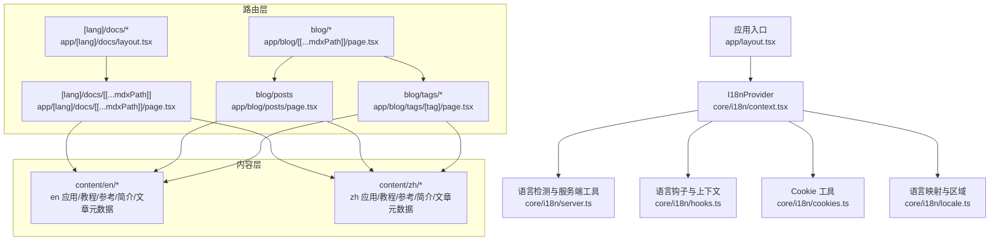
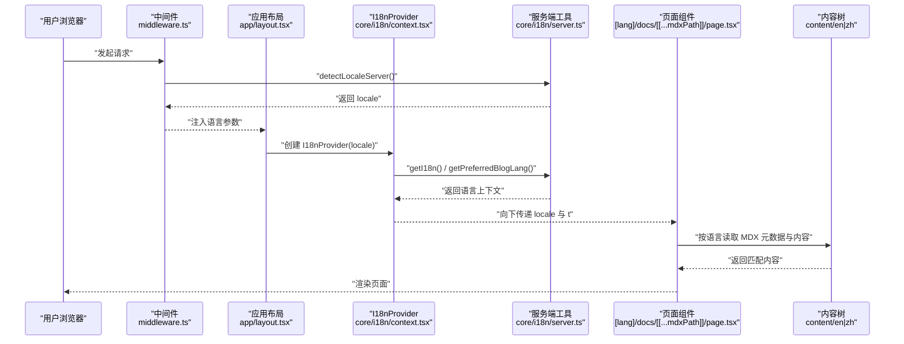
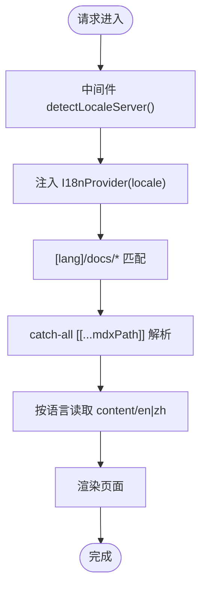
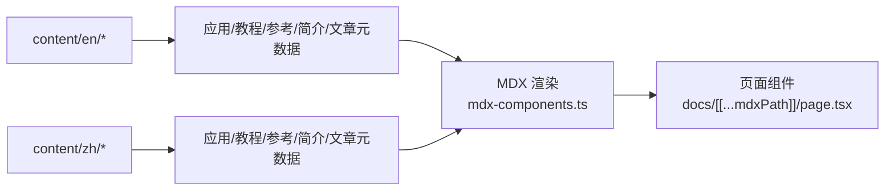
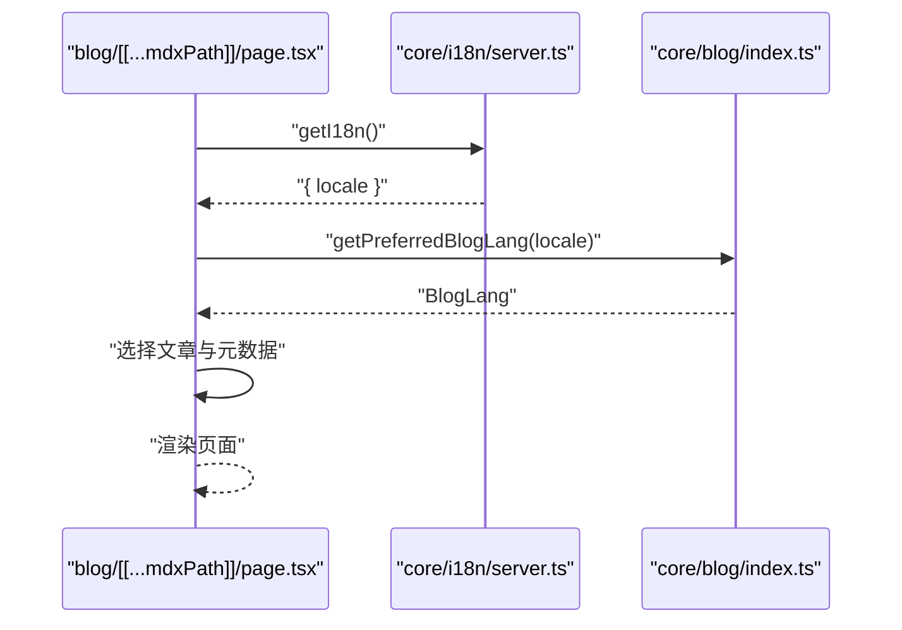
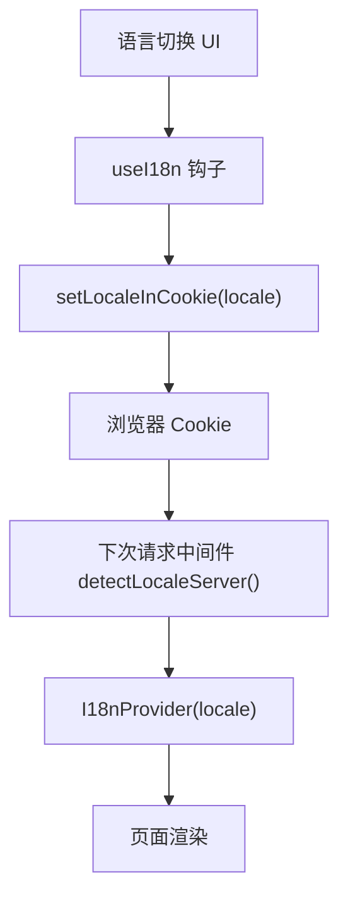
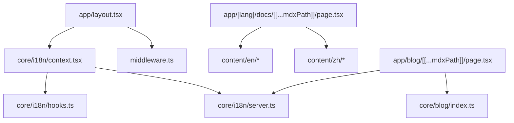

# 国际化支持

<cite>
**本文引用的文件**
- [frontend/src/app/[lang]/docs/layout.tsx](file://frontend/src/app/[lang]/docs/layout.tsx)
- [frontend/src/app/[lang]/docs/[[...mdxPath]]/page.tsx](file://frontend/src/app/[lang]/docs/[[...mdxPath]]/page.tsx)
- [frontend/src/app/blog/[[...mdxPath]]/page.tsx](file://frontend/src/app/blog/[[...mdxPath]]/page.tsx)
- [frontend/src/app/blog/posts/page.tsx](file://frontend/src/app/blog/posts/page.tsx)
- [frontend/src/app/blog/tags/[tag]/page.tsx](file://frontend/src/app/blog/tags/[tag]/page.tsx)
- [frontend/src/app/layout.tsx](file://frontend/src/app/layout.tsx)
- [frontend/src/core/i18n/context.tsx](file://frontend/src/core/i18n/context.tsx)
- [frontend/src/core/i18n/hooks.ts](file://frontend/src/core/i18n/hooks.ts)
- [frontend/src/core/i18n/cookies.ts](file://frontend/src/core/i18n/cookies.ts)
- [frontend/src/core/i18n/locale.ts](file://frontend/src/core/i18n/locale.ts)
- [frontend/src/core/i18n/server.ts](file://frontend/src/core/i18n/server.ts)
- [frontend/src/core/blog/index.ts](file://frontend/src/core/blog/index.ts)
- [frontend/src/content/en/application/_meta.ts](file://frontend/src/content/en/application/_meta.ts)
- [frontend/src/content/zh/application/_meta.ts](file://frontend/src/content/zh/application/_meta.ts)
- [frontend/src/content/en/tutorials/_meta.ts](file://frontend/src/content/en/tutorials/_meta.ts)
- [frontend/src/content/zh/tutorials/_meta.ts](file://frontend/src/content/zh/tutorials/_meta.ts)
- [frontend/src/content/en/reference/_meta.ts](file://frontend/src/content/en/reference/_meta.ts)
- [frontend/src/content/zh/reference/_meta.ts](file://frontend/src/content/zh/reference/_meta.ts)
- [frontend/src/content/en/introduction/_meta.ts](file://frontend/src/content/en/introduction/_meta.ts)
- [frontend/src/content/zh/introduction/_meta.ts](file://frontend/src/content/zh/introduction/_meta.ts)
- [frontend/src/content/en/posts/_meta.ts](file://frontend/src/content/en/posts/_meta.ts)
- [frontend/src/content/zh/posts/_meta.ts](file://frontend/src/content/zh/posts/_meta.ts)
- [frontend/src/mdx-components.ts](file://frontend/src/mdx-components.ts)
- [frontend/middleware.ts](file://frontend/middleware.ts)
- [frontend/next.config.js](file://frontend/next.config.js)
- [frontend/package.json](file://frontend/package.json)
</cite>

## 目录
1. [引言](#引言)
2. [项目结构](#项目结构)
3. [核心组件](#核心组件)
4. [架构总览](#架构总览)
5. [详细组件分析](#详细组件分析)
6. [依赖关系分析](#依赖关系分析)
7. [性能考量](#性能考量)
8. [故障排查指南](#故障排查指南)
9. [结论](#结论)
10. [附录](#附录)

## 引言
本文件面向 DeerFlow 的国际化（i18n）支持系统，系统性梳理前端多语言架构设计与实现，覆盖语言检测机制、路由国际化、内容组织结构、MDX 文档的国际化实现、翻译文件组织与命名规范、语言切换组件与本地化配置、文化适配最佳实践，并给出翻译工作流程与性能优化建议。目标是帮助开发者快速理解并扩展多语言能力。

## 项目结构
DeerFlow 前端采用 Next.js App Router 的多语言路由模式，通过动态路由段 [lang] 将语言前缀注入路径；同时在应用根部提供 I18nProvider，统一注入语言上下文。内容层以 content 目录按语言分组组织，MDX 文档通过 App Router 的 catch-all 路由进行渲染。

图表来源
- [frontend/src/app/layout.tsx:1-20](file://frontend/src/app/layout.tsx#L1-L20)
- [frontend/src/core/i18n/context.tsx:1-50](file://frontend/src/core/i18n/context.tsx#L1-L50)
- [frontend/src/core/i18n/server.ts:1-60](file://frontend/src/core/i18n/server.ts#L1-L60)
- [frontend/src/core/i18n/hooks.ts:1-60](file://frontend/src/core/i18n/hooks.ts#L1-L60)
- [frontend/src/core/i18n/cookies.ts:1-60](file://frontend/src/core/i18n/cookies.ts#L1-L60)
- [frontend/src/core/i18n/locale.ts:1-60](file://frontend/src/core/i18n/locale.ts#L1-L60)
- [frontend/src/app/[lang]/docs/layout.tsx:1-60](file://frontend/src/app/[lang]/docs/layout.tsx#L1-L60)
- [frontend/src/app/[lang]/docs/[[...mdxPath]]/page.tsx:1-120](file://frontend/src/app/[lang]/docs/[[...mdxPath]]/page.tsx#L1-L120)
- [frontend/src/app/blog/[[...mdxPath]]/page.tsx:1-180](file://frontend/src/app/blog/[[...mdxPath]]/page.tsx#L1-L180)
- [frontend/src/app/blog/posts/page.tsx:1-40](file://frontend/src/app/blog/posts/page.tsx#L1-L40)
- [frontend/src/app/blog/tags/[tag]/page.tsx:1-40](file://frontend/src/app/blog/tags/[tag]/page.tsx#L1-L40)
- [frontend/src/content/en/application/_meta.ts:1-40](file://frontend/src/content/en/application/_meta.ts#L1-L40)
- [frontend/src/content/zh/application/_meta.ts:1-40](file://frontend/src/content/zh/application/_meta.ts#L1-L40)

章节来源
- [frontend/src/app/layout.tsx:1-20](file://frontend/src/app/layout.tsx#L1-L20)
- [frontend/src/app/[lang]/docs/layout.tsx:1-60](file://frontend/src/app/[lang]/docs/layout.tsx#L1-L60)
- [frontend/src/app/[lang]/docs/[[...mdxPath]]/page.tsx:1-120](file://frontend/src/app/[lang]/docs/[[...mdxPath]]/page.tsx#L1-L120)
- [frontend/src/app/blog/[[...mdxPath]]/page.tsx:1-180](file://frontend/src/app/blog/[[...mdxPath]]/page.tsx#L1-L180)
- [frontend/src/content/en/application/_meta.ts:1-40](file://frontend/src/content/en/application/_meta.ts#L1-L40)
- [frontend/src/content/zh/application/_meta.ts:1-40](file://frontend/src/content/zh/application/_meta.ts#L1-L40)

## 核心组件
- 语言上下文与 Provider：在应用根部注入 I18nProvider，向子组件提供语言状态与切换函数。
- 语言检测与服务端工具：封装服务端语言检测、首选语言选择与请求上下文获取。
- 语言钩子：提供客户端侧的 useI18n 钩子，负责初始化与翻译对象选择。
- Cookie 工具：提供客户端/服务端的 locale 存取接口，用于持久化用户语言偏好。
- 语言映射与区域：提供语言到区域码的映射与解析逻辑。
- 博客与内容工具：封装博客文章列表、标签页与文章详情的多语言选择与渲染。

章节来源
- [frontend/src/core/i18n/context.tsx:1-50](file://frontend/src/core/i18n/context.tsx#L1-L50)
- [frontend/src/core/i18n/server.ts:1-60](file://frontend/src/core/i18n/server.ts#L1-L60)
- [frontend/src/core/i18n/hooks.ts:1-60](file://frontend/src/core/i18n/hooks.ts#L1-L60)
- [frontend/src/core/i18n/cookies.ts:1-60](file://frontend/src/core/i18n/cookies.ts#L1-L60)
- [frontend/src/core/i18n/locale.ts:1-60](file://frontend/src/core/i18n/locale.ts#L1-L60)
- [frontend/src/core/blog/index.ts:1-320](file://frontend/src/core/blog/index.ts#L1-L320)

## 架构总览
下图展示从请求进入、语言检测、内容选择到页面渲染的完整链路，涵盖服务端与客户端协作的语言上下文传递。

图表来源
- [frontend/middleware.ts:1-120](file://frontend/middleware.ts#L1-L120)
- [frontend/src/app/layout.tsx:1-20](file://frontend/src/app/layout.tsx#L1-L20)
- [frontend/src/core/i18n/context.tsx:1-50](file://frontend/src/core/i18n/context.tsx#L1-L50)
- [frontend/src/core/i18n/server.ts:1-60](file://frontend/src/core/i18n/server.ts#L1-L60)
- [frontend/src/app/[lang]/docs/[[...mdxPath]]/page.tsx:1-120](file://frontend/src/app/[lang]/docs/[[...mdxPath]]/page.tsx#L1-L120)
- [frontend/src/content/en/application/_meta.ts:1-40](file://frontend/src/content/en/application/_meta.ts#L1-L40)
- [frontend/src/content/zh/application/_meta.ts:1-40](file://frontend/src/content/zh/application/_meta.ts#L1-L40)

## 详细组件分析

### 语言检测与路由国际化
- 动态路由 [lang]：通过 [lang] 捕获语言段，结合语言映射与区域解析，确保后续内容与 UI 语言一致。
- 服务端检测：在中间件中调用 detectLocaleServer 获取 locale，随后在布局中注入 I18nProvider。
- 文档路由：docs 页面使用 catch-all 路由 [[...mdxPath]]，根据当前语言从 content/en 或 content/zh 中加载对应 MDX 内容。

图表来源
- [frontend/middleware.ts:1-120](file://frontend/middleware.ts#L1-L120)
- [frontend/src/app/[lang]/docs/layout.tsx:1-60](file://frontend/src/app/[lang]/docs/layout.tsx#L1-L60)
- [frontend/src/app/[lang]/docs/[[...mdxPath]]/page.tsx:1-120](file://frontend/src/app/[lang]/docs/[[...mdxPath]]/page.tsx#L1-L120)

章节来源
- [frontend/src/app/[lang]/docs/layout.tsx:1-60](file://frontend/src/app/[lang]/docs/layout.tsx#L1-L60)
- [frontend/src/app/[lang]/docs/[[...mdxPath]]/page.tsx:1-120](file://frontend/src/app/[lang]/docs/[[...mdxPath]]/page.tsx#L1-L120)
- [frontend/middleware.ts:1-120](file://frontend/middleware.ts#L1-L120)

### 内容组织结构与 MDX 渲染
- 内容树：content/en 与 content/zh 下分别存放各分类（application、tutorials、reference、introduction、posts 等）的 MDX 文件与 _meta.ts 元数据。
- 元数据驱动：_meta.ts 定义每个语言下的目录结构与排序，配合服务端工具选择合适语言版本。
- MDX 组件：mdx-components.ts 提供 MDX 渲染所需的组件注册，保证跨语言内容的一致性展示。

图表来源
- [frontend/src/content/en/application/_meta.ts:1-40](file://frontend/src/content/en/application/_meta.ts#L1-L40)
- [frontend/src/content/zh/application/_meta.ts:1-40](file://frontend/src/content/zh/application/_meta.ts#L1-L40)
- [frontend/src/content/en/tutorials/_meta.ts:1-40](file://frontend/src/content/en/tutorials/_meta.ts#L1-L40)
- [frontend/src/content/zh/tutorials/_meta.ts:1-40](file://frontend/src/content/zh/tutorials/_meta.ts#L1-L40)
- [frontend/src/content/en/reference/_meta.ts:1-40](file://frontend/src/content/en/reference/_meta.ts#L1-L40)
- [frontend/src/content/zh/reference/_meta.ts:1-40](file://frontend/src/content/zh/reference/_meta.ts#L1-L40)
- [frontend/src/content/en/introduction/_meta.ts:1-40](file://frontend/src/content/en/introduction/_meta.ts#L1-L40)
- [frontend/src/content/zh/introduction/_meta.ts:1-40](file://frontend/src/content/zh/introduction/_meta.ts#L1-L40)
- [frontend/src/content/en/posts/_meta.ts:1-40](file://frontend/src/content/en/posts/_meta.ts#L1-L40)
- [frontend/src/content/zh/posts/_meta.ts:1-40](file://frontend/src/content/zh/posts/_meta.ts#L1-L40)
- [frontend/src/mdx-components.ts:1-120](file://frontend/src/mdx-components.ts#L1-L120)

章节来源
- [frontend/src/content/en/application/_meta.ts:1-40](file://frontend/src/content/en/application/_meta.ts#L1-L40)
- [frontend/src/content/zh/application/_meta.ts:1-40](file://frontend/src/content/zh/application/_meta.ts#L1-L40)
- [frontend/src/mdx-components.ts:1-120](file://frontend/src/mdx-components.ts#L1-L120)

### 博客与标签页的多语言选择
- 博客索引：通过 getI18n 获取当前 locale，再调用 getPreferredBlogLang 选择最合适的语言版本。
- 文章详情：在 catch-all 路由中根据可用匹配与当前 locale 选择语言，确保文章元数据与正文一致。
- 标签页：基于相同逻辑筛选对应语言的文章集合。

图表来源
- [frontend/src/app/blog/[[...mdxPath]]/page.tsx:1-180](file://frontend/src/app/blog/[[...mdxPath]]/page.tsx#L1-L180)
- [frontend/src/core/i18n/server.ts:1-60](file://frontend/src/core/i18n/server.ts#L1-L60)
- [frontend/src/core/blog/index.ts:240-320](file://frontend/src/core/blog/index.ts#L240-L320)

章节来源
- [frontend/src/app/blog/[[...mdxPath]]/page.tsx:1-180](file://frontend/src/app/blog/[[...mdxPath]]/page.tsx#L1-L180)
- [frontend/src/app/blog/posts/page.tsx:1-40](file://frontend/src/app/blog/posts/page.tsx#L1-L40)
- [frontend/src/app/blog/tags/[tag]/page.tsx:1-40](file://frontend/src/app/blog/tags/[tag]/page.tsx#L1-L40)
- [frontend/src/core/blog/index.ts:240-320](file://frontend/src/core/blog/index.ts#L240-L320)

### 语言切换组件与本地化配置
- 上下文与钩子：I18nProvider 提供 locale 与 setLocale；useI18n 钩子在客户端初始化并选择翻译对象。
- Cookie 持久化：setLocaleInCookie 将用户选择写入 Cookie，实现跨会话的语言记忆。
- 文档页语言菜单：docs 布局中定义语言选项数组与 locale 映射，传给组件以渲染语言切换 UI。

图表来源
- [frontend/src/core/i18n/hooks.ts:1-60](file://frontend/src/core/i18n/hooks.ts#L1-L60)
- [frontend/src/core/i18n/cookies.ts:1-60](file://frontend/src/core/i18n/cookies.ts#L1-L60)
- [frontend/src/app/[lang]/docs/layout.tsx:1-60](file://frontend/src/app/[lang]/docs/layout.tsx#L1-L60)
- [frontend/middleware.ts:1-120](file://frontend/middleware.ts#L1-L120)

章节来源
- [frontend/src/core/i18n/hooks.ts:1-60](file://frontend/src/core/i18n/hooks.ts#L1-L60)
- [frontend/src/core/i18n/cookies.ts:1-60](file://frontend/src/core/i18n/cookies.ts#L1-L60)
- [frontend/src/app/[lang]/docs/layout.tsx:1-60](file://frontend/src/app/[lang]/docs/layout.tsx#L1-L60)

### 翻译文件组织、命名约定与维护流程
- 组织结构：content/en 与 content/zh 分别存放各分类的 MDX 与 _meta.ts；_meta.ts 作为目录与排序的元数据源。
- 命名约定：MDX 文件名保持语义清晰，_meta.ts 中的键值与导航标题遵循一致性；语言前缀与目录层级保持一致。
- 维护流程：新增语言时，需同步复制对应目录结构与 _meta.ts；更新内容时，优先修改 _meta.ts 以保证导航一致性；MDX 正文按需翻译并校对。

章节来源
- [frontend/src/content/en/application/_meta.ts:1-40](file://frontend/src/content/en/application/_meta.ts#L1-L40)
- [frontend/src/content/zh/application/_meta.ts:1-40](file://frontend/src/content/zh/application/_meta.ts#L1-L40)
- [frontend/src/content/en/tutorials/_meta.ts:1-40](file://frontend/src/content/en/tutorials/_meta.ts#L1-L40)
- [frontend/src/content/zh/tutorials/_meta.ts:1-40](file://frontend/src/content/zh/tutorials/_meta.ts#L1-L40)
- [frontend/src/content/en/reference/_meta.ts:1-40](file://frontend/src/content/en/reference/_meta.ts#L1-L40)
- [frontend/src/content/zh/reference/_meta.ts:1-40](file://frontend/src/content/zh/reference/_meta.ts#L1-L40)
- [frontend/src/content/en/introduction/_meta.ts:1-40](file://frontend/src/content/en/introduction/_meta.ts#L1-L40)
- [frontend/src/content/zh/introduction/_meta.ts:1-40](file://frontend/src/content/zh/introduction/_meta.ts#L1-L40)
- [frontend/src/content/en/posts/_meta.ts:1-40](file://frontend/src/content/en/posts/_meta.ts#L1-L40)
- [frontend/src/content/zh/posts/_meta.ts:1-40](file://frontend/src/content/zh/posts/_meta.ts#L1-L40)

## 依赖关系分析
- 组件耦合：应用布局依赖 I18nProvider；页面组件依赖服务端工具与内容树；中间件依赖语言检测工具。
- 外部依赖：Next.js App Router 的动态路由与 catch-all 能力；MDX 渲染依赖 mdx-components 注册。
- 可能的循环依赖：当前结构通过工具模块解耦，未见直接循环导入。

图表来源
- [frontend/src/app/layout.tsx:1-20](file://frontend/src/app/layout.tsx#L1-L20)
- [frontend/src/core/i18n/context.tsx:1-50](file://frontend/src/core/i18n/context.tsx#L1-L50)
- [frontend/src/core/i18n/hooks.ts:1-60](file://frontend/src/core/i18n/hooks.ts#L1-L60)
- [frontend/src/core/i18n/server.ts:1-60](file://frontend/src/core/i18n/server.ts#L1-L60)
- [frontend/middleware.ts:1-120](file://frontend/middleware.ts#L1-L120)
- [frontend/src/app/[lang]/docs/[[...mdxPath]]/page.tsx:1-120](file://frontend/src/app/[lang]/docs/[[...mdxPath]]/page.tsx#L1-L120)
- [frontend/src/app/blog/[[...mdxPath]]/page.tsx:1-180](file://frontend/src/app/blog/[[...mdxPath]]/page.tsx#L1-L180)
- [frontend/src/core/blog/index.ts:1-320](file://frontend/src/core/blog/index.ts#L1-L320)

章节来源
- [frontend/src/app/layout.tsx:1-20](file://frontend/src/app/layout.tsx#L1-L20)
- [frontend/src/core/i18n/context.tsx:1-50](file://frontend/src/core/i18n/context.tsx#L1-L50)
- [frontend/src/core/i18n/server.ts:1-60](file://frontend/src/core/i18n/server.ts#L1-L60)
- [frontend/src/app/[lang]/docs/[[...mdxPath]]/page.tsx:1-120](file://frontend/src/app/[lang]/docs/[[...mdxPath]]/page.tsx#L1-L120)
- [frontend/src/app/blog/[[...mdxPath]]/page.tsx:1-180](file://frontend/src/app/blog/[[...mdxPath]]/page.tsx#L1-L180)
- [frontend/src/core/blog/index.ts:1-320](file://frontend/src/core/blog/index.ts#L1-L320)

## 性能考量
- 语言检测缓存：在中间件中缓存 detectLocaleServer 结果，避免重复计算。
- 内容预取：在服务端通过 getI18n 与 getPreferredBlogLang 提前确定语言，减少运行时分支判断。
- MDX 渲染：利用 mdx-components 的组件复用，避免重复注册导致的渲染开销。
- Cookie 访问：仅在需要持久化语言偏好的场景设置 Cookie，减少不必要的网络往返。

## 故障排查指南
- 语言不生效：检查中间件是否正确调用 detectLocaleServer 并注入到 I18nProvider；确认页面是否使用 getI18n 获取 locale。
- 内容错位：核对 content/en 与 content/zh 的目录结构与 _meta.ts 是否一致；确认 catch-all 路由是否按语言读取。
- Cookie 未写入：确认 setLocaleInCookie 的调用时机与作用域；检查 SameSite 与 path 设置。
- 博客语言异常：检查 getPreferredBlogLang 的逻辑与 locale 解析；确认文章元数据中的 languages 字段。

章节来源
- [frontend/middleware.ts:1-120](file://frontend/middleware.ts#L1-L120)
- [frontend/src/core/i18n/server.ts:1-60](file://frontend/src/core/i18n/server.ts#L1-L60)
- [frontend/src/core/i18n/cookies.ts:1-60](file://frontend/src/core/i18n/cookies.ts#L1-L60)
- [frontend/src/app/blog/[[...mdxPath]]/page.tsx:1-180](file://frontend/src/app/blog/[[...mdxPath]]/page.tsx#L1-L180)

## 结论
DeerFlow 的国际化方案以 Next.js App Router 的 [lang] 动态路由为核心，结合服务端语言检测、I18nProvider 上下文与 Cookie 持久化，实现了文档与博客内容的多语言渲染。内容层通过 _meta.ts 元数据与 MDX 组织，确保导航与翻译的一致性。该架构具备良好的可扩展性，便于后续增加新语言与优化性能。

## 附录
- 配置与构建：next.config.js 与 package.json 中的相关配置项（如多语言构建参数）可按需调整。
- 最佳实践：优先使用服务端工具进行语言选择；保持 content 目录结构与 _meta.ts 的一致性；在需要时通过 Cookie 记忆用户偏好。

章节来源
- [frontend/next.config.js:1-120](file://frontend/next.config.js#L1-L120)
- [frontend/package.json:1-120](file://frontend/package.json#L1-L120)