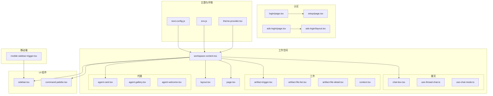
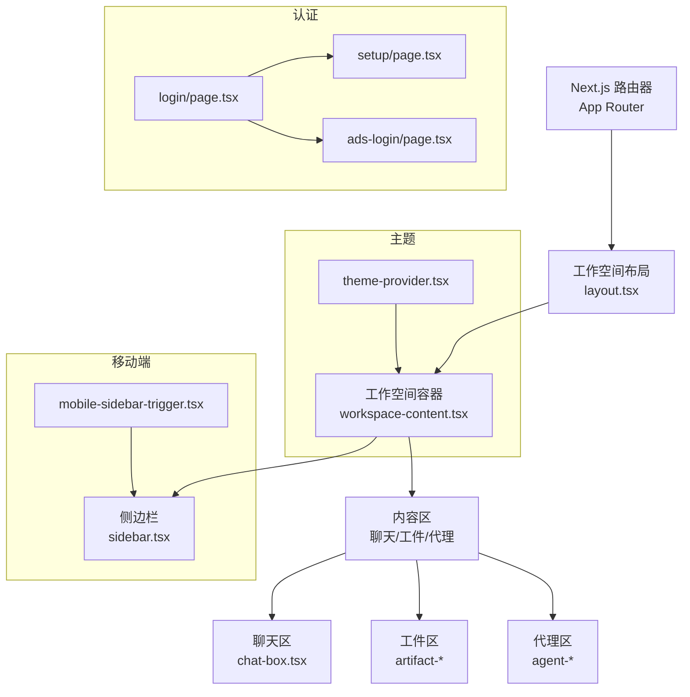
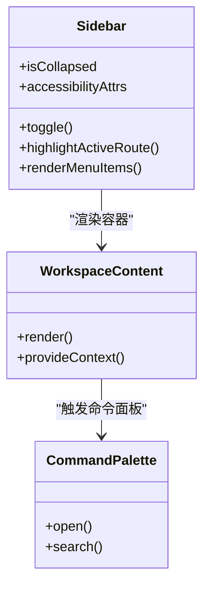
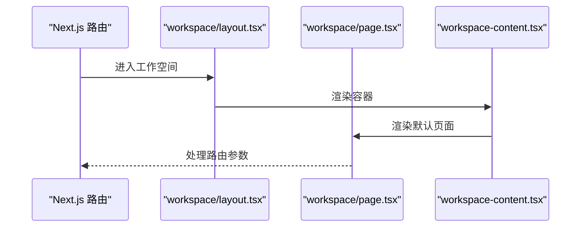
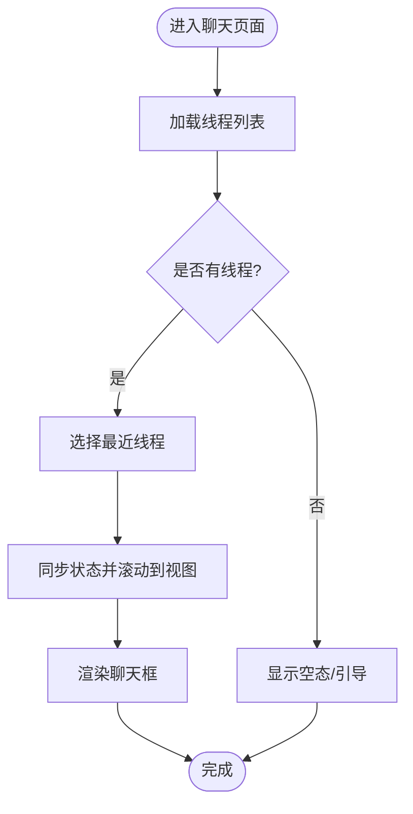
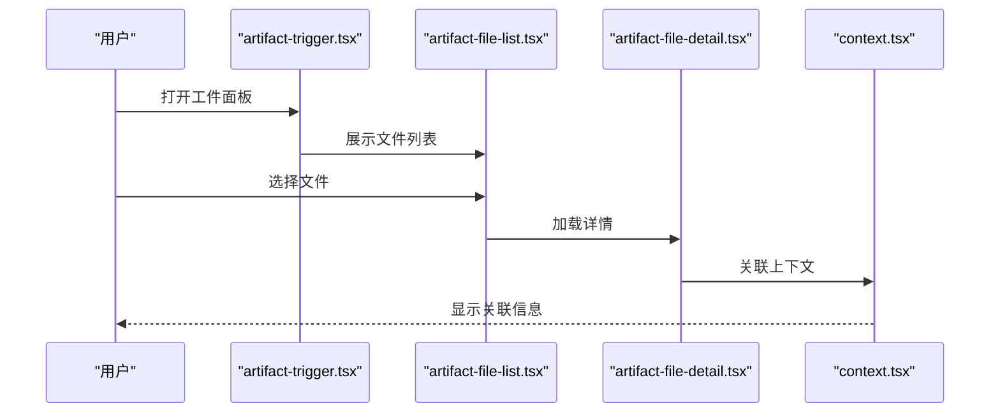
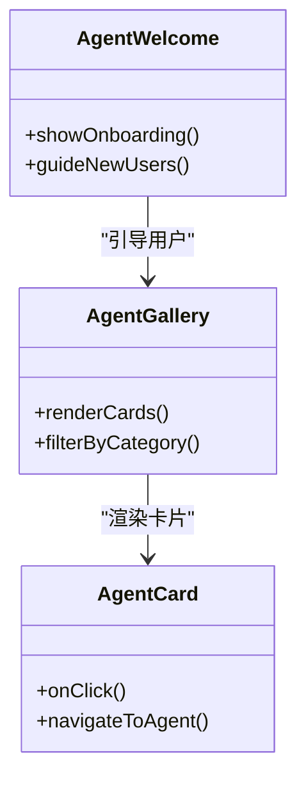
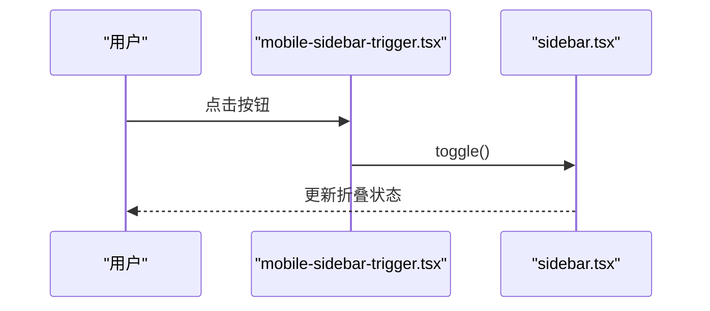
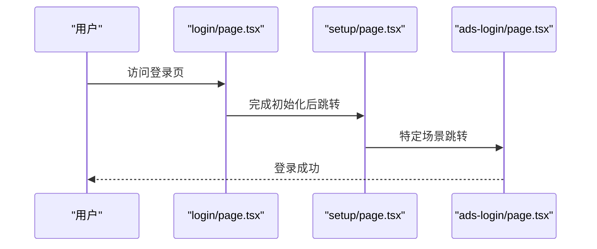
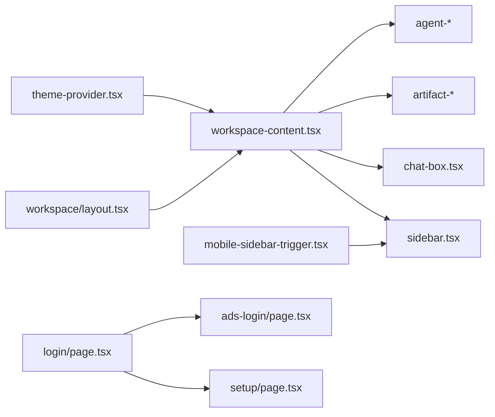

# 导航系统

<cite>
**本文引用的文件**
- [sidebar.tsx](file://frontend/src/components/ui/sidebar.tsx)
- [workspace-content.tsx](file://frontend/src/app/workspace/workspace-content.tsx)
- [layout.tsx](file://frontend/src/app/workspace/layout.tsx)
- [page.tsx](file://frontend/src/app/workspace/page.tsx)
- [mobile-sidebar-trigger.tsx](file://frontend/extensions/mobile-sidebar/mobile-sidebar-trigger.tsx)
- [login/page.tsx](file://frontend/src/app/(auth)/login/page.tsx)
- [setup/page.tsx](file://frontend/src/app/(auth)/setup/page.tsx)
- [ads-login/page.tsx](file://frontend/src/app/ads-login/page.tsx)
- [ads-login/layout.tsx](file://frontend/src/app/ads-login/layout.tsx)
- [theme-provider.tsx](file://frontend/src/components/theme-provider.tsx)
- [use-mobile.ts](file://frontend/src/hooks/use-mobile.ts)
- [command-palette.tsx](file://frontend/src/components/workspace/command-palette.tsx)
- [chat-box.tsx](file://frontend/src/components/workspace/chats/chat-box.tsx)
- [use-thread-chat.ts](file://frontend/src/components/workspace/chats/use-thread-chat.ts)
- [use-chat-mode.ts](file://frontend/src/components/workspace/chats/use-chat-mode.ts)
- [artifact-trigger.tsx](file://frontend/src/components/workspace/artifacts/artifact-trigger.tsx)
- [artifact-file-list.tsx](file://frontend/src/components/workspace/artifacts/artifact-file-list.tsx)
- [artifact-file-detail.tsx](file://frontend/src/components/workspace/artifacts/artifact-file-detail.tsx)
- [context.tsx](file://frontend/src/components/workspace/artifacts/context.tsx)
- [agent-card.tsx](file://frontend/src/components/workspace/agents/agent-card.tsx)
- [agent-gallery.tsx](file://frontend/src/components/workspace/agents/agent-gallery.tsx)
- [agent-welcome.tsx](file://frontend/src/components/workspace/agent-welcome.tsx)
- [export-trigger.tsx](file://frontend/src/components/workspace/export-trigger.tsx)
- [copy-button.tsx](file://frontend/src/components/workspace/copy-button.tsx)
- [citations 目录](file://frontend/src/components/workspace/citations/)
- [code-editor.tsx](file://frontend/src/components/workspace/code-editor.tsx)
- [flip-display.tsx](file://frontend/src/components/workspace/flip-display.tsx)
- [github-icon.tsx](file://frontend/src/components/workspace/github-icon.tsx)
- [query-client-provider.tsx](file://frontend/src/components/query-client-provider.tsx)
- [middleware.ts](file://frontend/middleware.ts)
- [env.js](file://frontend/src/env.js)
- [next.config.js](file://frontend/next.config.js)
- [package.json](file://frontend/package.json)
</cite>

## 目录
1. [引言](#引言)
2. [项目结构](#项目结构)
3. [核心组件](#核心组件)
4. [架构总览](#架构总览)
5. [详细组件分析](#详细组件分析)
6. [依赖关系分析](#依赖关系分析)
7. [性能考量](#性能考量)
8. [故障排查指南](#故障排查指南)
9. [结论](#结论)
10. [附录](#附录)

## 引言
本文件面向 DeerFlow 的导航系统，聚焦工作空间内的侧边栏布局、聊天列表管理与菜单导航系统，系统性阐述导航状态管理、路由切换机制、响应式设计实现、最近聊天列表维护、导航项高亮逻辑以及用户偏好保存策略。同时覆盖导航组件的可定制性、主题适配与无障碍访问支持，并提供导航行为规范、用户体验优化与性能考虑的实现指南。

## 项目结构
前端采用 Next.js App Router 的目录约定组织页面与布局，工作空间作为主要业务区域，通过嵌套布局与页面组合形成完整的导航体验。侧边栏组件位于 UI 组件库中，移动端通过扩展模块提供触发器；认证流程与登录页通过独立路由处理；工作空间内包含聊天、工件（Artifacts）、代理（Agents）等子功能区。

**图表来源**
- [workspace-content.tsx:1-200](file://frontend/src/app/workspace/workspace-content.tsx#L1-L200)
- [layout.tsx:1-120](file://frontend/src/app/workspace/layout.tsx#L1-L120)
- [page.tsx:1-120](file://frontend/src/app/workspace/page.tsx#L1-L120)
- [sidebar.tsx:1-200](file://frontend/src/components/ui/sidebar.tsx#L1-L200)
- [mobile-sidebar-trigger.tsx:1-60](file://frontend/extensions/mobile-sidebar/mobile-sidebar-trigger.tsx#L1-L60)
- [login/page.tsx](file://frontend/src/app/(auth)/login/page.tsx#L1-L160)
- [setup/page.tsx](file://frontend/src/app/(auth)/setup/page.tsx#L1-L160)
- [ads-login/page.tsx:1-120](file://frontend/src/app/ads-login/page.tsx#L1-L120)
- [ads-login/layout.tsx:1-120](file://frontend/src/app/ads-login/layout.tsx#L1-L120)
- [theme-provider.tsx:1-120](file://frontend/src/components/theme-provider.tsx#L1-L120)
- [env.js:1-120](file://frontend/src/env.js#L1-L120)
- [next.config.js:1-120](file://frontend/next.config.js#L1-L120)

**章节来源**
- [workspace-content.tsx:1-200](file://frontend/src/app/workspace/workspace-content.tsx#L1-L200)
- [layout.tsx:1-120](file://frontend/src/app/workspace/layout.tsx#L1-L120)
- [page.tsx:1-120](file://frontend/src/app/workspace/page.tsx#L1-L120)

## 核心组件
- 侧边栏导航：提供主菜单、子菜单与快捷入口，支持折叠/展开、高亮当前路由、响应式适配与无障碍标签。
- 工作空间内容容器：承载聊天、工件、代理等功能区域，负责布局与状态传递。
- 移动端侧边栏触发器：在小屏设备上打开/关闭侧边栏，确保触达性。
- 认证与登录：登录页、设置页与 ADS 登录页分别处理不同场景的路由跳转与重定向。
- 主题与环境：统一的主题提供器与环境配置，保证导航在深浅色模式下的一致表现。

**章节来源**
- [sidebar.tsx:1-200](file://frontend/src/components/ui/sidebar.tsx#L1-L200)
- [workspace-content.tsx:1-200](file://frontend/src/app/workspace/workspace-content.tsx#L1-L200)
- [mobile-sidebar-trigger.tsx:1-60](file://frontend/extensions/mobile-sidebar/mobile-sidebar-trigger.tsx#L1-L60)
- [login/page.tsx](file://frontend/src/app/(auth)/login/page.tsx#L1-L160)
- [setup/page.tsx](file://frontend/src/app/(auth)/setup/page.tsx#L1-L160)
- [ads-login/page.tsx:1-120](file://frontend/src/app/ads-login/page.tsx#L1-L120)
- [ads-login/layout.tsx:1-120](file://frontend/src/app/ads-login/layout.tsx#L1-L120)
- [theme-provider.tsx:1-120](file://frontend/src/components/theme-provider.tsx#L1-L120)
- [env.js:1-120](file://frontend/src/env.js#L1-L120)
- [next.config.js:1-120](file://frontend/next.config.js#L1-L120)

## 架构总览
导航系统围绕“布局-容器-组件-路由”的分层设计构建。工作空间布局定义全局容器与侧边栏位置；容器组件负责渲染具体功能区；UI 组件提供交互能力；路由层负责页面切换与参数传递；移动端与主题层提供差异化体验。

**图表来源**
- [layout.tsx:1-120](file://frontend/src/app/workspace/layout.tsx#L1-L120)
- [workspace-content.tsx:1-200](file://frontend/src/app/workspace/workspace-content.tsx#L1-L200)
- [sidebar.tsx:1-200](file://frontend/src/components/ui/sidebar.tsx#L1-L200)
- [chat-box.tsx:1-200](file://frontend/src/components/workspace/chats/chat-box.tsx#L1-L200)
- [artifact-trigger.tsx:1-200](file://frontend/src/components/workspace/artifacts/artifact-trigger.tsx#L1-L200)
- [agent-card.tsx:1-200](file://frontend/src/components/workspace/agents/agent-card.tsx#L1-L200)
- [mobile-sidebar-trigger.tsx:1-60](file://frontend/extensions/mobile-sidebar/mobile-sidebar-trigger.tsx#L1-L60)
- [theme-provider.tsx:1-120](file://frontend/src/components/theme-provider.tsx#L1-L120)
- [login/page.tsx](file://frontend/src/app/(auth)/login/page.tsx#L1-L160)
- [setup/page.tsx](file://frontend/src/app/(auth)/setup/page.tsx#L1-L160)
- [ads-login/page.tsx:1-120](file://frontend/src/app/ads-login/page.tsx#L1-L120)

## 详细组件分析

### 侧边栏导航系统
侧边栏承担主菜单与子菜单的展示职责，支持：
- 折叠/展开状态管理与持久化
- 当前路由高亮与层级指示
- 响应式布局下的隐藏/显示策略
- 无障碍属性（aria-label、role 等）
- 主题适配（深浅色模式）

**图表来源**
- [sidebar.tsx:1-200](file://frontend/src/components/ui/sidebar.tsx#L1-L200)
- [workspace-content.tsx:1-200](file://frontend/src/app/workspace/workspace-content.tsx#L1-L200)
- [command-palette.tsx:1-200](file://frontend/src/components/workspace/command-palette.tsx#L1-L200)

**章节来源**
- [sidebar.tsx:1-200](file://frontend/src/components/ui/sidebar.tsx#L1-L200)
- [workspace-content.tsx:1-200](file://frontend/src/app/workspace/workspace-content.tsx#L1-L200)
- [command-palette.tsx:1-200](file://frontend/src/components/workspace/command-palette.tsx#L1-L200)

### 工作空间布局与容器
工作空间布局定义全局容器与侧边栏位置，页面负责默认视图与路由参数解析；容器组件聚合聊天、工件、代理等功能区，提供状态共享与事件分发。

**图表来源**
- [layout.tsx:1-120](file://frontend/src/app/workspace/layout.tsx#L1-L120)
- [page.tsx:1-120](file://frontend/src/app/workspace/page.tsx#L1-L120)
- [workspace-content.tsx:1-200](file://frontend/src/app/workspace/workspace-content.tsx#L1-L200)

**章节来源**
- [layout.tsx:1-120](file://frontend/src/app/workspace/layout.tsx#L1-L120)
- [page.tsx:1-120](file://frontend/src/app/workspace/page.tsx#L1-L120)
- [workspace-content.tsx:1-200](file://frontend/src/app/workspace/workspace-content.tsx#L1-L200)

### 聊天列表与最近记录维护
聊天列表通过线程上下文与状态钩子维护最近会话，支持：
- 最近聊天列表的增删改查
- 切换时的状态同步与滚动定位
- 无数据时的占位与引导
- 可访问性标签与键盘导航

**图表来源**
- [use-thread-chat.ts:1-200](file://frontend/src/components/workspace/chats/use-thread-chat.ts#L1-L200)
- [chat-box.tsx:1-200](file://frontend/src/components/workspace/chats/chat-box.tsx#L1-L200)

**章节来源**
- [use-thread-chat.ts:1-200](file://frontend/src/components/workspace/chats/use-thread-chat.ts#L1-L200)
- [chat-box.tsx:1-200](file://frontend/src/components/workspace/chats/chat-box.tsx#L1-L200)

### 工件导航与文件管理
工件模块提供文件列表、详情与上下文联动，支持：
- 文件列表的筛选、排序与分页
- 详情页的上下文关联与返回
- 视图切换与多窗口展示

**图表来源**
- [artifact-trigger.tsx:1-200](file://frontend/src/components/workspace/artifacts/artifact-trigger.tsx#L1-L200)
- [artifact-file-list.tsx:1-200](file://frontend/src/components/workspace/artifacts/artifact-file-list.tsx#L1-L200)
- [artifact-file-detail.tsx:1-200](file://frontend/src/components/workspace/artifacts/artifact-file-detail.tsx#L1-L200)
- [context.tsx:1-200](file://frontend/src/components/workspace/artifacts/context.tsx#L1-L200)

**章节来源**
- [artifact-trigger.tsx:1-200](file://frontend/src/components/workspace/artifacts/artifact-trigger.tsx#L1-L200)
- [artifact-file-list.tsx:1-200](file://frontend/src/components/workspace/artifacts/artifact-file-list.tsx#L1-L200)
- [artifact-file-detail.tsx:1-200](file://frontend/src/components/workspace/artifacts/artifact-file-detail.tsx#L1-L200)
- [context.tsx:1-200](file://frontend/src/components/workspace/artifacts/context.tsx#L1-L200)

### 代理导航与卡片展示
代理导航以卡片形式呈现代理集合，支持：
- 代理卡片的点击与跳转
- 画廊视图与欢迎页的切换
- 新建代理的入口与流程

**图表来源**
- [agent-card.tsx:1-200](file://frontend/src/components/workspace/agents/agent-card.tsx#L1-L200)
- [agent-gallery.tsx:1-200](file://frontend/src/components/workspace/agents/agent-gallery.tsx#L1-L200)
- [agent-welcome.tsx:1-200](file://frontend/src/components/workspace/agent-welcome.tsx#L1-L200)

**章节来源**
- [agent-card.tsx:1-200](file://frontend/src/components/workspace/agents/agent-card.tsx#L1-L200)
- [agent-gallery.tsx:1-200](file://frontend/src/components/workspace/agents/agent-gallery.tsx#L1-L200)
- [agent-welcome.tsx:1-200](file://frontend/src/components/workspace/agent-welcome.tsx#L1-L200)

### 移动端侧边栏触发器
移动端通过专用触发器控制侧边栏的开合，确保在窄屏设备上的可用性与一致性。

**图表来源**
- [mobile-sidebar-trigger.tsx:1-60](file://frontend/extensions/mobile-sidebar/mobile-sidebar-trigger.tsx#L1-L60)
- [sidebar.tsx:1-200](file://frontend/src/components/ui/sidebar.tsx#L1-L200)

**章节来源**
- [mobile-sidebar-trigger.tsx:1-60](file://frontend/extensions/mobile-sidebar/mobile-sidebar-trigger.tsx#L1-L60)
- [sidebar.tsx:1-200](file://frontend/src/components/ui/sidebar.tsx#L1-L200)

### 认证与登录路由
登录页、设置页与 ADS 登录页分别处理不同场景的路由跳转与重定向，确保用户在认证流程中的连续性与安全性。

**图表来源**
- [login/page.tsx](file://frontend/src/app/(auth)/login/page.tsx#L1-L160)
- [setup/page.tsx](file://frontend/src/app/(auth)/setup/page.tsx#L1-L160)
- [ads-login/page.tsx:1-120](file://frontend/src/app/ads-login/page.tsx#L1-L120)
- [ads-login/layout.tsx:1-120](file://frontend/src/app/ads-login/layout.tsx#L1-L120)

**章节来源**
- [login/page.tsx](file://frontend/src/app/(auth)/login/page.tsx#L1-L160)
- [setup/page.tsx](file://frontend/src/app/(auth)/setup/page.tsx#L1-L160)
- [ads-login/page.tsx:1-120](file://frontend/src/app/ads-login/page.tsx#L1-L120)
- [ads-login/layout.tsx:1-120](file://frontend/src/app/ads-login/layout.tsx#L1-L120)

## 依赖关系分析
导航系统的依赖关系体现为“布局-容器-组件-路由-移动端-主题”的分层耦合，各层职责清晰、边界明确，便于扩展与维护。

**图表来源**
- [layout.tsx:1-120](file://frontend/src/app/workspace/layout.tsx#L1-L120)
- [workspace-content.tsx:1-200](file://frontend/src/app/workspace/workspace-content.tsx#L1-L200)
- [sidebar.tsx:1-200](file://frontend/src/components/ui/sidebar.tsx#L1-L200)
- [chat-box.tsx:1-200](file://frontend/src/components/workspace/chats/chat-box.tsx#L1-L200)
- [artifact-trigger.tsx:1-200](file://frontend/src/components/workspace/artifacts/artifact-trigger.tsx#L1-L200)
- [agent-card.tsx:1-200](file://frontend/src/components/workspace/agents/agent-card.tsx#L1-L200)
- [mobile-sidebar-trigger.tsx:1-60](file://frontend/extensions/mobile-sidebar/mobile-sidebar-trigger.tsx#L1-L60)
- [theme-provider.tsx:1-120](file://frontend/src/components/theme-provider.tsx#L1-L120)
- [login/page.tsx](file://frontend/src/app/(auth)/login/page.tsx#L1-L160)
- [setup/page.tsx](file://frontend/src/app/(auth)/setup/page.tsx#L1-L160)
- [ads-login/page.tsx:1-120](file://frontend/src/app/ads-login/page.tsx#L1-L120)

**章节来源**
- [layout.tsx:1-120](file://frontend/src/app/workspace/layout.tsx#L1-L120)
- [workspace-content.tsx:1-200](file://frontend/src/app/workspace/workspace-content.tsx#L1-L200)
- [sidebar.tsx:1-200](file://frontend/src/components/ui/sidebar.tsx#L1-L200)
- [chat-box.tsx:1-200](file://frontend/src/components/workspace/chats/chat-box.tsx#L1-L200)
- [artifact-trigger.tsx:1-200](file://frontend/src/components/workspace/artifacts/artifact-trigger.tsx#L1-L200)
- [agent-card.tsx:1-200](file://frontend/src/components/workspace/agents/agent-card.tsx#L1-L200)
- [mobile-sidebar-trigger.tsx:1-60](file://frontend/extensions/mobile-sidebar/mobile-sidebar-trigger.tsx#L1-L60)
- [theme-provider.tsx:1-120](file://frontend/src/components/theme-provider.tsx#L1-L120)
- [login/page.tsx](file://frontend/src/app/(auth)/login/page.tsx#L1-L160)
- [setup/page.tsx](file://frontend/src/app/(auth)/setup/page.tsx#L1-L160)
- [ads-login/page.tsx:1-120](file://frontend/src/app/ads-login/page.tsx#L1-L120)

## 性能考量
- 路由懒加载：利用 Next.js 的动态导入与并行加载策略，减少首屏负载。
- 状态缓存：聊天与工件状态通过上下文与本地存储进行缓存，避免重复请求。
- 懒渲染：侧边栏与移动端触发器按需渲染，降低不必要的 DOM 开销。
- 图标与媒体：使用矢量图标与压缩资源，减少带宽占用。
- SSR/CSR 平衡：在工作空间内优先 CSR 提升交互流畅度，在登录页等静态页面使用 SSR。

[本节为通用指导，不直接分析具体文件]

## 故障排查指南
- 侧边栏无法打开/关闭：检查移动端触发器与侧边栏状态绑定是否正确，确认无障碍属性与键盘事件监听。
- 聊天列表空白：验证线程加载钩子与空态渲染逻辑，检查网络错误与权限状态。
- 工件详情未显示：核对文件列表到详情页的路由参数传递与上下文关联。
- 登录后未跳转：检查登录页与设置页的路由跳转逻辑与重定向参数。
- 主题异常：确认主题提供器包裹范围与环境变量配置。

**章节来源**
- [mobile-sidebar-trigger.tsx:1-60](file://frontend/extensions/mobile-sidebar/mobile-sidebar-trigger.tsx#L1-L60)
- [sidebar.tsx:1-200](file://frontend/src/components/ui/sidebar.tsx#L1-L200)
- [use-thread-chat.ts:1-200](file://frontend/src/components/workspace/chats/use-thread-chat.ts#L1-L200)
- [artifact-file-detail.tsx:1-200](file://frontend/src/components/workspace/artifacts/artifact-file-detail.tsx#L1-L200)
- [login/page.tsx](file://frontend/src/app/(auth)/login/page.tsx#L1-L160)
- [setup/page.tsx](file://frontend/src/app/(auth)/setup/page.tsx#L1-L160)
- [theme-provider.tsx:1-120](file://frontend/src/components/theme-provider.tsx#L1-L120)

## 结论
DeerFlow 的导航系统以清晰的分层架构与模块化组件实现了工作空间内的高效导航。通过侧边栏、移动端触发器、聊天与工件模块的协同，结合认证路由与主题适配，提供了良好的可用性与可扩展性。建议在后续迭代中持续关注性能优化与无障碍细节，以进一步提升用户体验。

## 附录
- 行为规范：导航项应保持一致的视觉层级与交互反馈；高亮逻辑应与当前路由严格对应；移动端优先保证触达性与可读性。
- 用户偏好：提供折叠状态、主题模式与语言设置的持久化存储与恢复。
- 可定制性：允许通过配置或扩展点自定义菜单项、快捷方式与品牌元素。
- 无障碍：确保所有交互具备键盘可达性、屏幕阅读器友好与对比度要求。

[本节为通用指导，不直接分析具体文件]