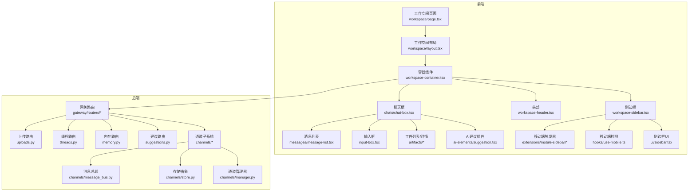
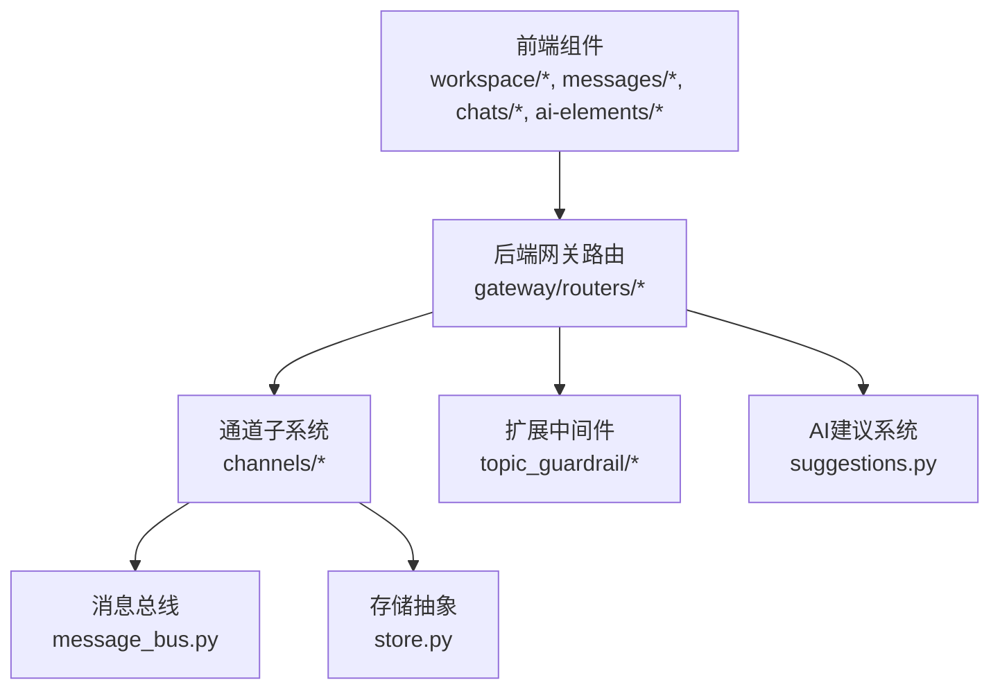
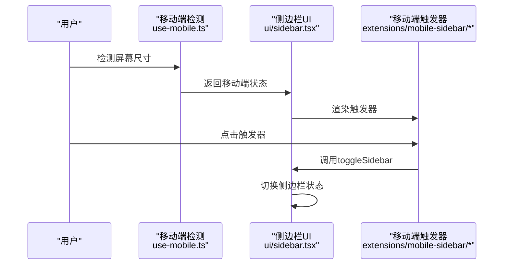
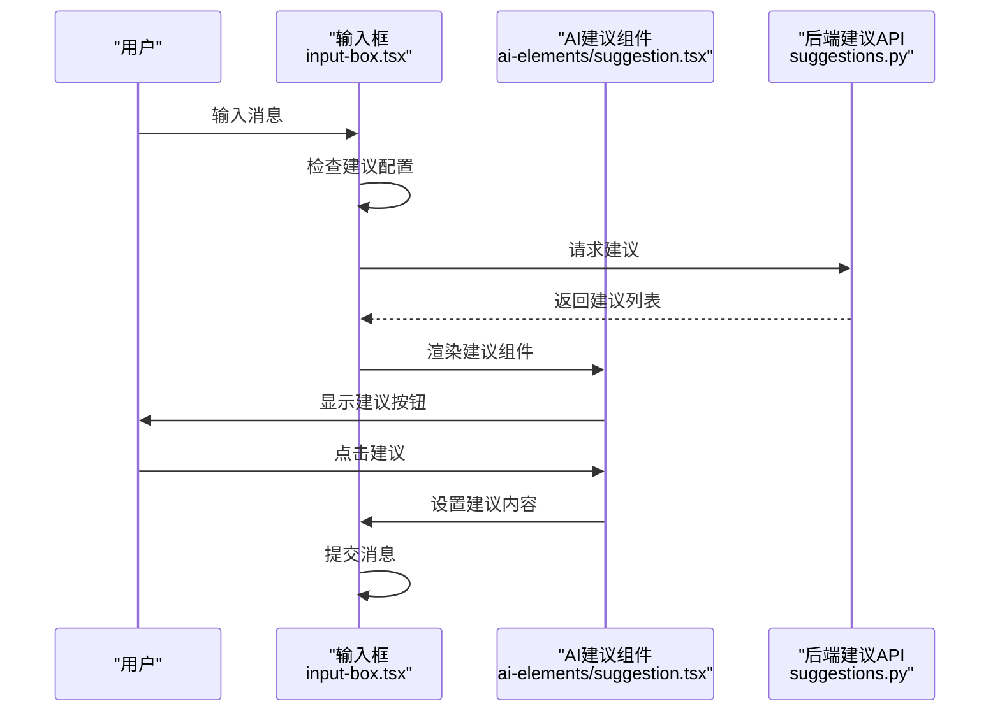
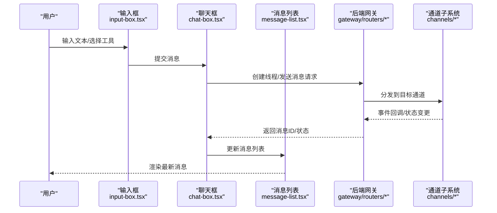
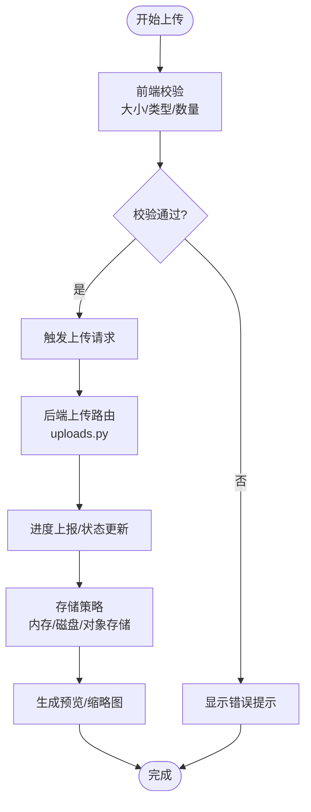
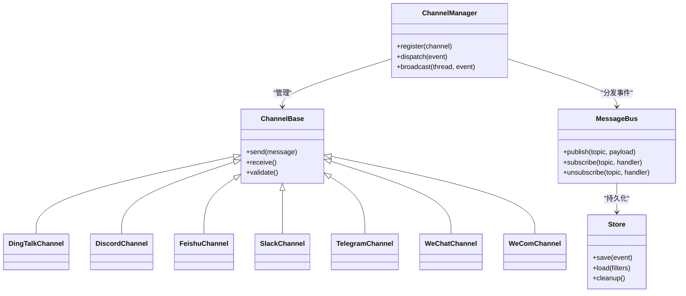
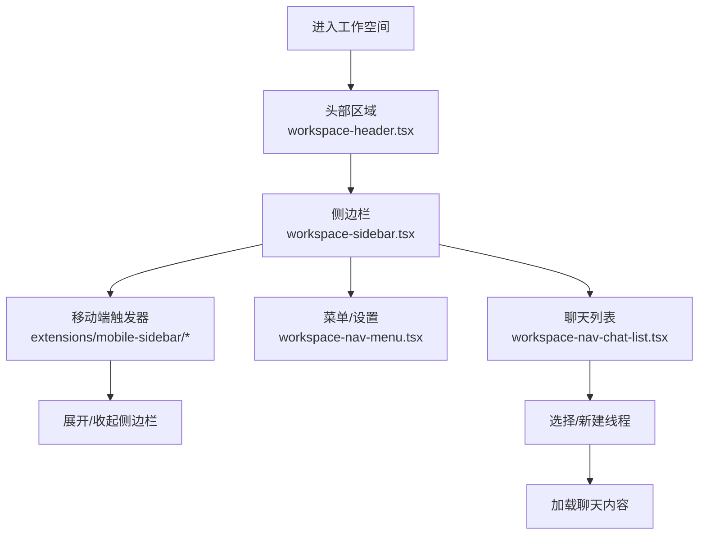
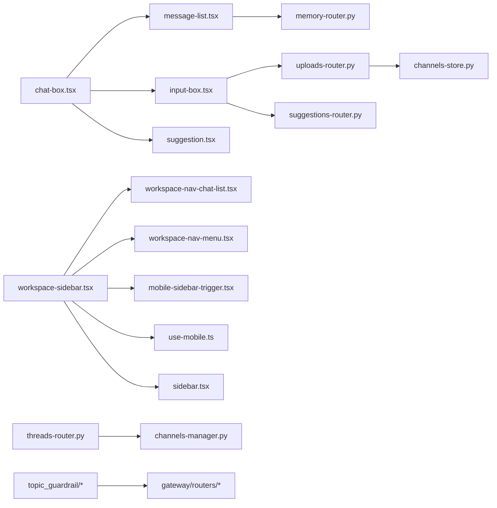

# 工作空间系统

<cite>
**本文引用的文件**
- [workspace-container.tsx](file://frontend/src/components/workspace/workspace-container.tsx)
- [workspace-sidebar.tsx](file://frontend/src/components/workspace/workspace-sidebar.tsx)
- [workspace-header.tsx](file://frontend/src/components/workspace/workspace-header.tsx)
- [workspace-nav-chat-list.tsx](file://frontend/src/components/workspace/workspace-nav-chat-list.tsx)
- [workspace-nav-menu.tsx](file://frontend/src/components/workspace/workspace-nav-menu.tsx)
- [input-box.tsx](file://frontend/src/components/workspace/input-box.tsx)
- [chat-box.tsx](file://frontend/src/components/workspace/chats/chat-box.tsx)
- [message-list.tsx](file://frontend/src/components/workspace/messages/message-list.tsx)
- [message-list-item.tsx](file://frontend/src/components/workspace/messages/message-list-item.tsx)
- [artifact-file-list.tsx](file://frontend/src/components/workspace/artifacts/artifact-file-list.tsx)
- [artifact-file-detail.tsx](file://frontend/src/components/workspace/artifacts/artifact-file-detail.tsx)
- [streaming-indicator.tsx](file://frontend/src/components/workspace/streaming-indicator.tsx)
- [suggestion.tsx](file://frontend/src/components/ai-elements/suggestion.tsx)
- [mobile-sidebar-trigger.tsx](file://frontend/extensions/mobile-sidebar/mobile-sidebar-trigger.tsx)
- [use-mobile.ts](file://frontend/src/hooks/use-mobile.ts)
- [sidebar.tsx](file://frontend/src/components/ui/sidebar.tsx)
- [uploads-router.py](file://backend/app/gateway/routers/uploads.py)
- [memory-router.py](file://backend/app/gateway/routers/memory.py)
- [threads-router.py](file://backend/app/gateway/routers/threads.py)
- [suggestions-router.py](file://backend/app/gateway/routers/suggestions.py)
- [channels-manager.py](file://backend/app/channels/manager.py)
- [channels-store.py](file://backend/app/channels/store.py)
- [channels-message-bus.py](file://backend/app/channels/message_bus.py)
- [channels-service.py](file://backend/app/channels/service.py)
- [channels-base.py](file://backend/app/channels/base.py)
- [channels-commands.py](file://backend/app/channels/commands.py)
- [channels-dingtalk.py](file://backend/app/channels/dingtalk.py)
- [channels-discord.py](file://backend/app/channels/discord.py)
- [channels-feishu.py](file://backend/app/channels/feishu.py)
- [channels-slack.py](file://backend/app/channels/slack.py)
- [channels-telegram.py](file://backend/app/channels/telegram.py)
- [channels-wechat.py](file://backend/app/channels/wechat.py)
- [channels-wecom.py](fileassistant/app/channels/wecom.py)
- [workspace-layout.tsx](file://frontend/src/app/workspace/layout.tsx)
- [workspace-page.tsx](file://frontend/src/app/workspace/page.tsx)
</cite>

## 更新摘要
**所做更改**
- 更新了移动端工作空间布局优化部分，增加了新的移动侧边栏触发器组件
- 增强了聊天界面功能，包括AI建议系统的改进和输入框的增强功能
- 改进了响应式设计，优化了移动端体验
- 新增了AI建议组件的详细说明和使用示例

## 目录
1. [引言](#引言)
2. [项目结构](#项目结构)
3. [核心组件](#核心组件)
4. [架构总览](#架构总览)
5. [详细组件分析](#详细组件分析)
6. [依赖关系分析](#依赖关系分析)
7. [性能考虑](#性能考虑)
8. [故障排除指南](#故障排除指南)
9. [结论](#结论)
10. [附录](#附录)

## 引言
本技术文档围绕 DeerFlow 的工作空间系统展开，系统性阐述其设计理念与实现细节，重点覆盖以下方面：
- 智能体管理：工作空间中的智能体展示、选择与交互入口
- 聊天界面：消息列表渲染、输入框设计、工具栏功能与消息状态管理
- 文件附件处理：文件验证、上传进度、预览与存储策略
- 实时消息同步：多通道（DingTalk、Discord、Feishu、Slack、Telegram、WeChat、WeCom）的消息桥接与事件总线
- 导航与侧边栏：工作空间导航、侧边栏管理与响应式设计
- AI建议系统：智能建议生成、技能建议与上下文感知的建议功能
- 扩展能力：主题、环境设置、敏感词守卫等扩展点

通过代码级图示与路径引用，帮助读者快速理解并高效使用与扩展工作空间系统。

## 项目结构
工作空间系统由前端 Next.js 应用与后端 FastAPI 网关组成，采用分层架构：
- 前端工作空间页面位于 app/workspace，包含布局与页面容器
- 组件层位于 components/workspace 与 components/ai-elements，涵盖聊天、消息、工件、设置等模块
- 后端网关路由负责智能体、线程、内存、上传、通道等业务接口
- 通道子系统负责多平台消息桥接与事件总线

**图表来源**
- [workspace-page.tsx:1-200](file://frontend/src/app/workspace/page.tsx#L1-L200)
- [workspace-layout.tsx:1-200](file://frontend/src/app/workspace/layout.tsx#L1-L200)
- [workspace-container.tsx:1-200](file://frontend/src/components/workspace/workspace-container.tsx#L1-L200)
- [workspace-sidebar.tsx:1-200](file://frontend/src/components/workspace/workspace-sidebar.tsx#L1-L200)
- [workspace-header.tsx:1-200](file://frontend/src/components/workspace/workspace-header.tsx#L1-L200)
- [chat-box.tsx:1-200](file://frontend/src/components/workspace/chats/chat-box.tsx#L1-L200)
- [message-list.tsx:1-200](file://frontend/src/components/workspace/messages/message-list.tsx#L1-L200)
- [input-box.tsx:1-200](file://frontend/src/components/workspace/input-box.tsx#L1-L200)
- [artifact-file-list.tsx:1-200](file://frontend/src/components/workspace/artifacts/artifact-file-list.tsx#L1-L200)
- [artifact-file-detail.tsx:1-200](file://frontend/src/components/workspace/artifacts/artifact-file-detail.tsx#L1-L200)
- [suggestion.tsx:1-81](file://frontend/src/components/ai-elements/suggestion.tsx#L1-L81)
- [mobile-sidebar-trigger.tsx:1-32](file://frontend/extensions/mobile-sidebar/mobile-sidebar-trigger.tsx#L1-L32)
- [use-mobile.ts:1-22](file://frontend/src/hooks/use-mobile.ts#L1-L22)
- [sidebar.tsx:1-727](file://frontend/src/components/ui/sidebar.tsx#L1-L727)
- [uploads-router.py:1-200](file://backend/app/gateway/routers/uploads.py#L1-L200)
- [threads-router.py:1-200](file://backend/app/gateway/routers/threads.py#L1-L200)
- [memory-router.py:1-200](file://backend/app/gateway/routers/memory.py#L1-L200)
- [suggestions-router.py:1-200](file://backend/app/gateway/routers/suggestions.py#L1-L200)
- [channels-manager.py:1-200](file://backend/app/channels/manager.py#L1-L200)
- [channels-store.py:1-200](file://backend/app/channels/store.py#L1-L200)
- [channels-message-bus.py:1-200](file://backend/app/channels/message_bus.py#L1-L200)

**章节来源**
- [workspace-page.tsx:1-200](file://frontend/src/app/workspace/page.tsx#L1-L200)
- [workspace-layout.tsx:1-200](file://frontend/src/app/workspace/layout.tsx#L1-L200)
- [workspace-container.tsx:1-200](file://frontend/src/components/workspace/workspace-container.tsx#L1-L200)

## 核心组件
- 容器与布局：工作空间容器承载头部、侧边栏与主内容区；布局负责全局样式与国际化
- 导航与侧边栏：侧边栏提供聊天历史、智能体入口与设置；移动端通过触发器控制展开
- 聊天系统：聊天框内含消息列表与输入框，支持工具栏、表情、快捷键与流式输出指示
- 工件系统：文件列表与详情页，支持文件类型识别、预览与下载
- AI建议系统：智能建议生成、技能建议与上下文感知的建议功能
- 通道系统：多平台消息桥接，统一事件总线与存储抽象

**章节来源**
- [workspace-header.tsx:1-200](file://frontend/src/components/workspace/workspace-header.tsx#L1-L200)
- [workspace-sidebar.tsx:1-200](file://frontend/src/components/workspace/workspace-sidebar.tsx#L1-L200)
- [workspace-nav-chat-list.tsx:1-200](file://frontend/src/components/workspace/workspace-nav-chat-list.tsx#L1-L200)
- [workspace-nav-menu.tsx:1-200](file://frontend/src/components/workspace/workspace-nav-menu.tsx#L1-L200)
- [chat-box.tsx:1-200](file://frontend/src/components/workspace/chats/chat-box.tsx#L1-L200)
- [message-list.tsx:1-200](file://frontend/src/components/workspace/messages/message-list.tsx#L1-L200)
- [input-box.tsx:1-200](file://frontend/src/components/workspace/input-box.tsx#L1-L200)
- [artifact-file-list.tsx:1-200](file://frontend/src/components/workspace/artifacts/artifact-file-list.tsx#L1-L200)
- [artifact-file-detail.tsx:1-200](file://frontend/src/components/workspace/artifacts/artifact-file-detail.tsx#L1-L200)
- [suggestion.tsx:1-81](file://frontend/src/components/ai-elements/suggestion.tsx#L1-L81)

## 架构总览
工作空间系统采用"前端组件 + 后端网关 + 通道子系统"的三层架构：
- 前端通过 Next.js App Router 管理页面与路由，组件通过状态管理与 API 调用协同
- 后端网关提供 REST 接口，统一认证、鉴权与业务编排
- 通道子系统负责多平台消息桥接，通过消息总线与存储抽象实现解耦

**图表来源**
- [chat-box.tsx:1-200](file://frontend/src/components/workspace/chats/chat-box.tsx#L1-L200)
- [message-list.tsx:1-200](file://frontend/src/components/workspace/messages/message-list.tsx#L1-L200)
- [input-box.tsx:1-200](file://frontend/src/components/workspace/input-box.tsx#L1-L200)
- [suggestion.tsx:1-81](file://frontend/src/components/ai-elements/suggestion.tsx#L1-L81)
- [uploads-router.py:1-200](file://backend/app/gateway/routers/uploads.py#L1-L200)
- [threads-router.py:1-200](file://backend/app/gateway/routers/threads.py#L1-L200)
- [suggestions-router.py:1-200](file://backend/app/gateway/routers/suggestions.py#L1-L200)
- [channels-message-bus.py:1-200](file://backend/app/channels/message_bus.py#L1-L200)
- [channels-store.py:1-200](file://backend/app/channels/store.py#L1-L200)
- [topic-guardrail-provider.py:1-200](file://deerflow_extensions/topic_guardrail/topic_guardrail_provider.py#L1-L200)

## 详细组件分析

### 移动端工作空间布局优化
系统引入了全新的移动端工作空间布局优化，通过专门的移动端侧边栏触发器和响应式检测机制，显著提升了移动端用户体验。

**图表来源**
- [use-mobile.ts:1-22](file://frontend/src/hooks/use-mobile.ts#L1-L22)
- [sidebar.tsx:1-727](file://frontend/src/components/ui/sidebar.tsx#L1-L727)
- [mobile-sidebar-trigger.tsx:1-32](file://frontend/extensions/mobile-sidebar/mobile-sidebar-trigger.tsx#L1-L32)

移动端布局优化特性：
- 自适应断点检测（768px）
- 固定定位的侧边栏触发器
- 毛玻璃效果背景
- 平滑过渡动画
- 触摸友好的点击区域

**章节来源**
- [use-mobile.ts:1-22](file://frontend/src/hooks/use-mobile.ts#L1-L22)
- [sidebar.tsx:1-727](file://frontend/src/components/ui/sidebar.tsx#L1-L727)
- [mobile-sidebar-trigger.tsx:1-32](file://frontend/extensions/mobile-sidebar/mobile-sidebar-trigger.tsx#L1-L32)

### 聊天界面增强与AI建议系统改进
聊天界面经过重大增强，集成了智能AI建议系统，提供上下文感知的建议功能和技能建议。

**图表来源**
- [input-box.tsx:558-596](file://frontend/src/components/workspace/input-box.tsx#L558-L596)
- [suggestion.tsx:1-81](file://frontend/src/components/ai-elements/suggestion.tsx#L1-L81)
- [suggestions-router.py:1-200](file://backend/app/gateway/routers/suggestions.py#L1-L200)

AI建议系统特性：
- 上下文感知的建议生成
- 技能名称自动补全
- 流式建议加载
- 动画渐显效果
- 键盘导航支持

**章节来源**
- [input-box.tsx:506-596](file://frontend/src/components/workspace/input-box.tsx#L506-L596)
- [suggestion.tsx:1-81](file://frontend/src/components/ai-elements/suggestion.tsx#L1-L81)
- [suggestions-router.py:1-200](file://backend/app/gateway/routers/suggestions.py#L1-L200)

### 聊天系统架构
聊天系统由聊天框、消息列表、消息项与输入框构成，支持工具栏、表情、快捷键与流式输出指示。消息状态管理贯穿发送中、已接收、错误等状态，并通过 SSE 或 WebSocket 实现实时更新。

**图表来源**
- [input-box.tsx:1-200](file://frontend/src/components/workspace/input-box.tsx#L1-L200)
- [chat-box.tsx:1-200](file://frontend/src/components/workspace/chats/chat-box.tsx#L1-L200)
- [message-list.tsx:1-200](file://frontend/src/components/workspace/messages/message-list.tsx#L1-L200)
- [threads-router.py:1-200](file://backend/app/gateway/routers/threads.py#L1-L200)
- [channels-manager.py:1-200](file://backend/app/channels/manager.py#L1-L200)

**章节来源**
- [chat-box.tsx:1-200](file://frontend/src/components/workspace/chats/chat-box.tsx#L1-L200)
- [message-list.tsx:1-200](file://frontend/src/components/workspace/messages/message-list.tsx#L1-L200)
- [message-list-item.tsx:1-200](file://frontend/src/components/workspace/messages/message-list-item.tsx#L1-L200)
- [input-box.tsx:1-200](file://frontend/src/components/workspace/input-box.tsx#L1-L200)
- [streaming-indicator.tsx:1-200](file://frontend/src/components/workspace/streaming-indicator.tsx#L1-L200)

### 文件上传处理机制
文件上传流程包括：前端校验与拖拽/粘贴触发、后端路由处理、进度上报与存储策略。后端提供统一上传路由，结合内存/磁盘存储与安全扫描，确保合规与性能。

**图表来源**
- [uploads-router.py:1-200](file://backend/app/gateway/routers/uploads.py#L1-L200)
- [artifact-file-list.tsx:1-200](file://frontend/src/components/workspace/artifacts/artifact-file-list.tsx#L1-L200)
- [artifact-file-detail.tsx:1-200](file://frontend/src/components/workspace/artifacts/artifact-file-detail.tsx#L1-L200)

**章节来源**
- [uploads-router.py:1-200](file://backend/app/gateway/routers/uploads.py#L1-L200)
- [artifact-file-list.tsx:1-200](file://frontend/src/components/workspace/artifacts/artifact-file-list.tsx#L1-L200)
- [artifact-file-detail.tsx:1-200](file://frontend/src/components/workspace/artifacts/artifact-file-detail.tsx#L1-L200)

### 实时消息同步与通道系统
通道系统负责多平台消息桥接，统一事件总线与存储抽象。消息从通道进入总线，再分发到对应线程或会话，支持 DingTalk、Discord、Feishu、Slack、Telegram、WeChat、WeCom 等。

**图表来源**
- [channels-base.py:1-200](file://backend/app/channels/base.py#L1-L200)
- [channels-manager.py:1-200](file://backend/app/channels/manager.py#L1-L200)
- [channels-message-bus.py:1-200](file://backend/app/channels/message_bus.py#L1-L200)
- [channels-store.py:1-200](file://backend/app/channels/store.py#L1-L200)
- [channels-dingtalk.py:1-200](file://backend/app/channels/dingtalk.py#L1-L200)
- [channels-discord.py:1-200](file://backend/app/channels/discord.py#L1-L200)
- [channels-feishu.py:1-200](file://backend/app/channels/feishu.py#L1-L200)
- [channels-slack.py:1-200](file://backend/app/channels/slack.py#L1-L200)
- [channels-telegram.py:1-200](file://backend/app/channels/telegram.py#L1-L200)
- [channels-wechat.py:1-200](file://backend/app/channels/wechat.py#L1-L200)
- [channels-wecom.py:1-200](file://backend/app/channels/wecom.py#L1-L200)

**章节来源**
- [channels-manager.py:1-200](file://backend/app/channels/manager.py#L1-L200)
- [channels-message-bus.py:1-200](file://backend/app/channels/message_bus.py#L1-L200)
- [channels-store.py:1-200](file://backend/app/channels/store.py#L1-L200)
- [channels-service.py:1-200](file://backend/app/channels/service.py#L1-L200)

### 工作空间导航与侧边栏管理
工作空间导航由头部、侧边栏与聊天列表组成，支持响应式设计与移动端触发器。侧边栏包含聊天历史、智能体入口与设置菜单，移动端通过触发器控制展开。

**图表来源**
- [workspace-header.tsx:1-200](file://frontend/src/components/workspace/workspace-header.tsx#L1-L200)
- [workspace-sidebar.tsx:1-200](file://frontend/src/components/workspace/workspace-sidebar.tsx#L1-L200)
- [workspace-nav-chat-list.tsx:1-200](file://frontend/src/components/workspace/workspace-nav-chat-list.tsx#L1-L200)
- [workspace-nav-menu.tsx:1-200](file://frontend/src/components/workspace/workspace-nav-menu.tsx#L1-L200)
- [mobile-sidebar-trigger.tsx:1-200](file://frontend/extensions/mobile-sidebar/mobile-sidebar-trigger.tsx#L1-L200)

**章节来源**
- [workspace-header.tsx:1-200](file://frontend/src/components/workspace/workspace-header.tsx#L1-L200)
- [workspace-sidebar.tsx:1-200](file://frontend/src/components/workspace/workspace-sidebar.tsx#L1-L200)
- [workspace-nav-chat-list.tsx:1-200](file://frontend/src/components/workspace/workspace-nav-chat-list.tsx#L1-L200)
- [workspace-nav-menu.tsx:1-200](file://frontend/src/components/workspace/workspace-nav-menu.tsx#L1-L200)
- [mobile-sidebar-trigger.tsx:1-200](file://frontend/extensions/mobile-sidebar/mobile-sidebar-trigger.tsx#L1-L200)

### 状态管理模式
- 消息状态：发送中、已接收、错误、流式中
- 上传状态：待上传、上传中、成功、失败
- 通道状态：连接中、在线、离线、重连
- 主题与设置：明暗主题、语言、通知偏好
- AI建议状态：加载中、完成、隐藏、可见

**章节来源**
- [message-list.tsx:1-200](file://frontend/src/components/workspace/messages/message-list.tsx#L1-L200)
- [input-box.tsx:1-200](file://frontend/src/components/workspace/input-box.tsx#L1-L200)
- [artifact-file-list.tsx:1-200](file://frontend/src/components/workspace/artifacts/artifact-file-list.tsx#L1-L200)
- [suggestion.tsx:1-81](file://frontend/src/components/ai-elements/suggestion.tsx#L1-L81)

## 依赖关系分析
- 前端组件间依赖：聊天框依赖消息列表与输入框；侧边栏依赖聊天列表与菜单；移动端触发器依赖侧边栏状态
- 后端路由依赖：上传路由依赖存储抽象；线程路由依赖通道管理器；内存路由依赖持久化引擎；建议路由依赖AI模型
- 扩展中间件：敏感词守卫在网关层拦截并处理消息，保障内容安全

**图表来源**
- [chat-box.tsx:1-200](file://frontend/src/components/workspace/chats/chat-box.tsx#L1-L200)
- [message-list.tsx:1-200](file://frontend/src/components/workspace/messages/message-list.tsx#L1-L200)
- [input-box.tsx:1-200](file://frontend/src/components/workspace/input-box.tsx#L1-L200)
- [suggestion.tsx:1-81](file://frontend/src/components/ai-elements/suggestion.tsx#L1-L81)
- [workspace-sidebar.tsx:1-200](file://frontend/src/components/workspace/workspace-sidebar.tsx#L1-L200)
- [workspace-nav-chat-list.tsx:1-200](file://frontend/src/components/workspace/workspace-nav-chat-list.tsx#L1-L200)
- [workspace-nav-menu.tsx:1-200](file://frontend/src/components/workspace/workspace-nav-menu.tsx#L1-L200)
- [mobile-sidebar-trigger.tsx:1-32](file://frontend/extensions/mobile-sidebar/mobile-sidebar-trigger.tsx#L1-L32)
- [use-mobile.ts:1-22](file://frontend/src/hooks/use-mobile.ts#L1-L22)
- [sidebar.tsx:1-727](file://frontend/src/components/ui/sidebar.tsx#L1-L727)
- [uploads-router.py:1-200](file://backend/app/gateway/routers/uploads.py#L1-L200)
- [memory-router.py:1-200](file://backend/app/gateway/routers/memory.py#L1-L200)
- [threads-router.py:1-200](file://backend/app/gateway/routers/threads.py#L1-L200)
- [suggestions-router.py:1-200](file://backend/app/gateway/routers/suggestions.py#L1-L200)
- [channels-store.py:1-200](file://backend/app/channels/store.py#L1-L200)
- [channels-manager.py:1-200](file://backend/app/channels/manager.py#L1-L200)
- [topic-guardrail-provider.py:1-200](file://deerflow_extensions/topic_guardrail/topic_guardrail_provider.py#L1-L200)

**章节来源**
- [workspace-container.tsx:1-200](file://frontend/src/components/workspace/workspace-container.tsx#L1-L200)
- [workspace-sidebar.tsx:1-200](file://frontend/src/components/workspace/workspace-sidebar.tsx#L1-L200)
- [chat-box.tsx:1-200](file://frontend/src/components/workspace/chats/chat-box.tsx#L1-L200)
- [uploads-router.py:1-200](file://backend/app/gateway/routers/uploads.py#L1-L200)
- [threads-router.py:1-200](file://backend/app/gateway/routers/threads.py#L1-L200)
- [suggestions-router.py:1-200](file://backend/app/gateway/routers/suggestions.py#L1-L200)
- [channels-manager.py:1-200](file://backend/app/channels/manager.py#L1-L200)

## 性能考虑
- 消息渲染优化：虚拟滚动与懒加载，避免长列表卡顿
- 上传并发控制：限制同时上传任务数，结合断点续传与进度合并
- 缓存策略：消息与工件本地缓存，减少重复请求
- 通道连接池：复用连接，降低握手开销与资源占用
- 响应式布局：移动端优先，侧边栏折叠与自适应宽度
- AI建议优化：防抖处理、缓存机制、异步加载
- 动画性能：CSS动画替代JavaScript动画，使用will-change属性

## 故障排除指南
- 上传失败：检查文件类型与大小限制、网络状态与后端存储权限
- 消息不同步：确认通道配置、消息总线订阅与事件分发链路
- 主题异常：清理浏览器缓存、检查主题切换逻辑与 CSS 变量
- 移动端侧边栏不响应：验证触发器绑定与触摸事件监听
- AI建议不显示：检查建议配置、网络连接与后端API状态
- 建议加载缓慢：优化网络请求、启用缓存策略

**章节来源**
- [uploads-router.py:1-200](file://backend/app/gateway/routers/uploads.py#L1-L200)
- [channels-message-bus.py:1-200](file://backend/app/channels/message_bus.py#L1-L200)
- [channels-manager.py:1-200](file://backend/app/channels/manager.py#L1-L200)
- [input-box.tsx:506-596](file://frontend/src/components/workspace/input-box.tsx#L506-L596)

## 结论
工作空间系统以清晰的分层架构与可扩展的通道子系统为核心，结合前端组件化的 UI 设计与后端统一网关，实现了智能体管理、聊天界面、文件附件与实时消息同步的完整闭环。通过AI建议系统的集成和移动端布局优化，系统在智能化和用户体验方面取得了显著提升。新的响应式设计确保了跨设备的一致体验，而状态管理与性能优化策略则保证了系统的高效运行。

## 附录
- 组件使用示例：在聊天框中提交消息后，消息列表自动刷新；在侧边栏选择聊天历史后，聊天框加载对应线程；AI建议组件提供智能提示功能
- 状态管理模式：使用前端状态库维护消息与上传状态，后端通过 SSE/WS 推送事件更新；AI建议状态独立管理
- 扩展建议：新增通道时遵循通道基类接口，接入消息总线与存储抽象；在网关层增加中间件以满足合规需求；移动端优化可扩展更多触控手势
- 性能优化技巧：合理使用防抖和节流、启用缓存、优化图片和文件处理、使用Web Workers处理复杂计算