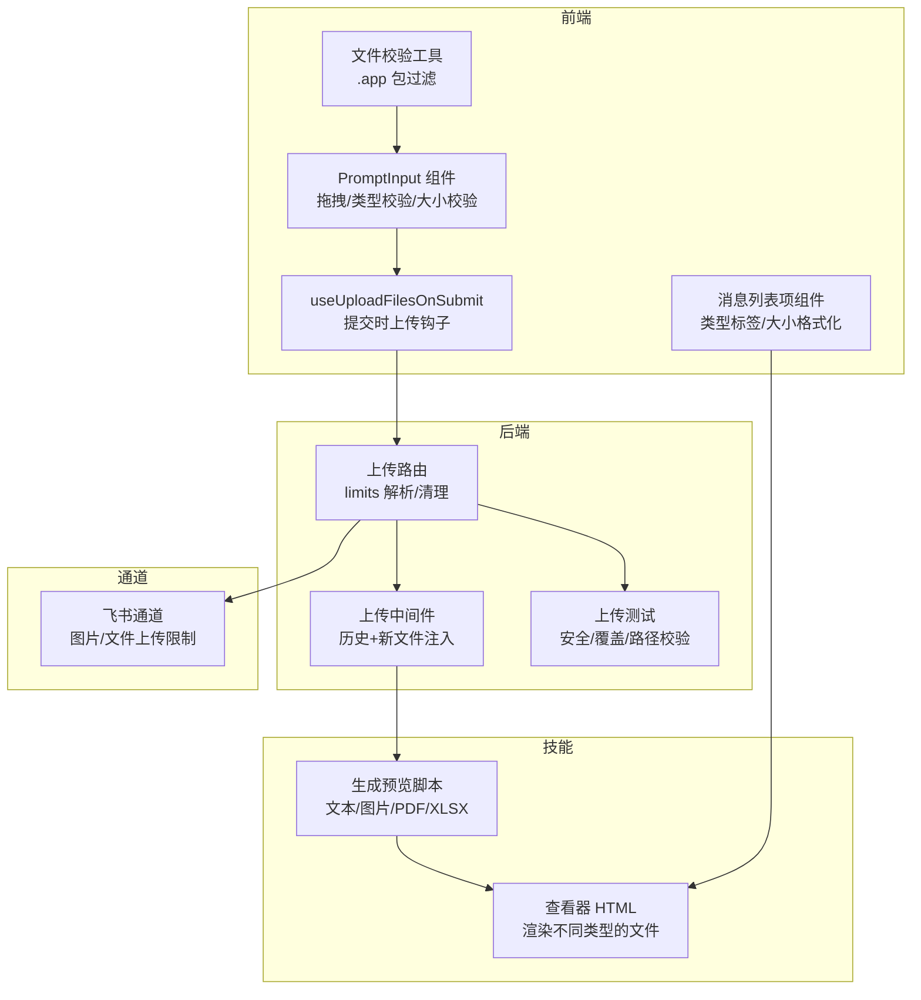
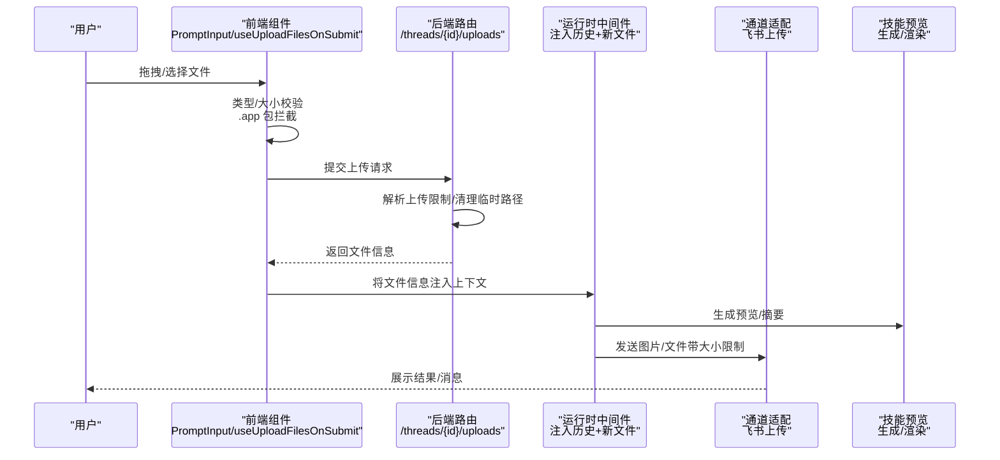
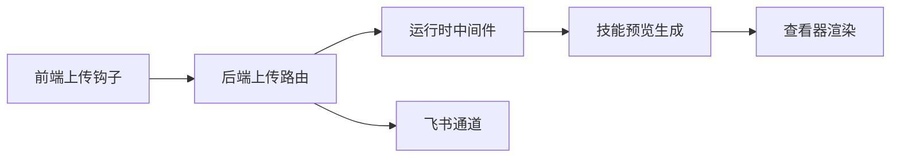

# 文件附件系统

<cite>
**本文引用的文件**
- [backend/app/gateway/routers/uploads.py](file://backend/app/gateway/routers/uploads.py)
- [backend/packages/harness/deerflow/agents/middlewares/uploads_middleware.py](file://backend/packages/harness/deerflow/agents/middlewares/uploads_middleware.py)
- [frontend/src/core/uploads/hooks.ts](file://frontend/src/core/uploads/hooks.ts)
- [frontend/src/core/uploads/file-validation.ts](file://frontend/src/core/uploads/file-validation.ts)
- [frontend/src/components/ai-elements/prompt-input.tsx](file://frontend/src/components/ai-elements/prompt-input.tsx)
- [frontend/src/components/workspace/messages/message-list-item.tsx](file://frontend/src/components/workspace/messages/message-list-item.tsx)
- [skills/public/skill-creator/eval-viewer/generate_review.py](file://skills/public/skill-creator/eval-viewer/generate_review.py)
- [skills/public/skill-creator/eval-viewer/viewer.html](file://skills/public/skill-creator/eval-viewer/viewer.html)
- [backend/docs/PATH_EXAMPLES.md](file://backend/docs/PATH_EXAMPLES.md)
- [backend/tests/test_uploads_router.py](file://backend/tests/test_uploads_router.py)
- [backend/tests/test_uploads_middleware_core_logic.py](file://backend/tests/test_uploads_middleware_core_logic.py)
- [backend/app/channels/feishu.py](file://backend/app/channels/feishu.py)
</cite>

## 目录
1. [简介](#简介)
2. [项目结构](#项目结构)
3. [核心组件](#核心组件)
4. [架构总览](#架构总览)
5. [详细组件分析](#详细组件分析)
6. [依赖关系分析](#依赖关系分析)
7. [性能考虑](#性能考虑)
8. [故障排查指南](#故障排查指南)
9. [结论](#结论)
10. [附录](#附录)

## 简介
本文件附件系统围绕“文件上传、验证、存储、预览、列表与管理”展开，覆盖前端交互、后端路由与中间件、通道适配（如飞书）、以及技能侧的文件预览与查看能力。系统支持：
- 文件类型识别与大小限制
- 安全检查与沙箱隔离
- 并发上传与清理策略
- 附件列表管理、文件详情展示
- 触发器机制与上下文管理（在运行时中间件中注入历史与新文件）
- 预览、下载、删除、分享（通过 artifact_url）等操作

## 项目结构
文件附件系统由前后端协同实现，并与运行时中间件集成，形成从用户输入到消息体附件的完整链路。

图示来源
- [frontend/src/core/uploads/hooks.ts:61-79](file://frontend/src/core/uploads/hooks.ts#L61-L79)
- [frontend/src/components/ai-elements/prompt-input.tsx:533-553](file://frontend/src/components/ai-elements/prompt-input.tsx#L533-L553)
- [frontend/src/components/workspace/messages/message-list-item.tsx:339-390](file://frontend/src/components/workspace/messages/message-list-item.tsx#L339-L390)
- [frontend/src/core/uploads/file-validation.ts](file://frontend/src/core/uploads/file-validation.ts)
- [backend/app/gateway/routers/uploads.py:108-139](file://backend/app/gateway/routers/uploads.py#L108-L139)
- [backend/packages/harness/deerflow/agents/middlewares/uploads_middleware.py:231-259](file://backend/packages/harness/deerflow/agents/middlewares/uploads_middleware.py#L231-L259)
- [backend/app/channels/feishu.py:246-266](file://backend/app/channels/feishu.py#L246-L266)
- [skills/public/skill-creator/eval-viewer/generate_review.py:154-195](file://skills/public/skill-creator/eval-viewer/generate_review.py#L154-L195)
- [skills/public/skill-creator/eval-viewer/viewer.html:792-827](file://skills/public/skill-creator/eval-viewer/viewer.html#L792-L827)

章节来源
- [backend/app/gateway/routers/uploads.py:108-139](file://backend/app/gateway/routers/uploads.py#L108-L139)
- [backend/packages/harness/deerflow/agents/middlewares/uploads_middleware.py:231-259](file://backend/packages/harness/deerflow/agents/middlewares/uploads_middleware.py#L231-L259)
- [frontend/src/core/uploads/hooks.ts:61-79](file://frontend/src/core/uploads/hooks.ts#L61-L79)
- [frontend/src/components/ai-elements/prompt-input.tsx:533-553](file://frontend/src/components/ai-elements/prompt-input.tsx#L533-L553)
- [frontend/src/components/workspace/messages/message-list-item.tsx:339-390](file://frontend/src/components/workspace/messages/message-list-item.tsx#L339-L390)
- [frontend/src/core/uploads/file-validation.ts](file://frontend/src/core/uploads/file-validation.ts)
- [backend/app/channels/feishu.py:246-266](file://backend/app/channels/feishu.py#L246-L266)
- [skills/public/skill-creator/eval-viewer/generate_review.py:154-195](file://skills/public/skill-creator/eval-viewer/generate_review.py#L154-L195)
- [skills/public/skill-creator/eval-viewer/viewer.html:792-827](file://skills/public/skill-creator/eval-viewer/viewer.html#L792-L827)

## 核心组件
- 前端上传钩子：在提交时批量上传文件并返回文件信息，用于后续消息发送或中间件注入。
- 前端输入组件：负责拖拽/粘贴文件、类型匹配、大小限制校验，并对不支持的 .app 包进行拦截。
- 后端上传路由：解析配置中的上传限制（单文件/总数/总大小），执行清理逻辑，确保安全写入。
- 运行时中间件：收集线程历史上传文件与新上传文件，提取摘要与预览，统一注入到消息上下文中。
- 通道适配：以飞书为例，对图片/文件分别上传并设置大小上限。
- 技能预览：根据扩展名选择文本、图片、PDF 或 XLSX 渲染方式；HTML 查看器按类型动态挂载元素。

章节来源
- [frontend/src/core/uploads/hooks.ts:61-79](file://frontend/src/core/uploads/hooks.ts#L61-L79)
- [frontend/src/components/ai-elements/prompt-input.tsx:533-553](file://frontend/src/components/ai-elements/prompt-input.tsx#L533-L553)
- [frontend/src/core/uploads/file-validation.ts](file://frontend/src/core/uploads/file-validation.ts)
- [backend/app/gateway/routers/uploads.py:108-139](file://backend/app/gateway/routers/uploads.py#L108-L139)
- [backend/packages/harness/deerflow/agents/middlewares/uploads_middleware.py:231-259](file://backend/packages/harness/deerflow/agents/middlewares/uploads_middleware.py#L231-L259)
- [backend/app/channels/feishu.py:246-266](file://backend/app/channels/feishu.py#L246-L266)
- [skills/public/skill-creator/eval-viewer/generate_review.py:154-195](file://skills/public/skill-creator/eval-viewer/generate_review.py#L154-L195)
- [skills/public/skill-creator/eval-viewer/viewer.html:792-827](file://skills/public/skill-creator/eval-viewer/viewer.html#L792-L827)

## 架构总览
下图展示了从前端到后端再到通道与技能的端到端流程。

图示来源
- [frontend/src/components/ai-elements/prompt-input.tsx:533-553](file://frontend/src/components/ai-elements/prompt-input.tsx#L533-L553)
- [frontend/src/core/uploads/hooks.ts:61-79](file://frontend/src/core/uploads/hooks.ts#L61-L79)
- [backend/app/gateway/routers/uploads.py:108-139](file://backend/app/gateway/routers/uploads.py#L108-L139)
- [backend/packages/harness/deerflow/agents/middlewares/uploads_middleware.py:231-259](file://backend/packages/harness/deerflow/agents/middlewares/uploads_middleware.py#L231-L259)
- [backend/app/channels/feishu.py:246-266](file://backend/app/channels/feishu.py#L246-L266)
- [skills/public/skill-creator/eval-viewer/generate_review.py:154-195](file://skills/public/skill-creator/eval-viewer/generate_review.py#L154-L195)

## 详细组件分析

### 前端上传与验证
- 提交时上传钩子：封装批量上传调用，返回文件信息数组，便于后续流程复用。
- 输入组件校验：
  - 类型匹配：基于 accept 属性过滤不支持的类型。
  - 大小限制：逐个文件检查是否超过最大值。
  - .app 包拦截：识别 macOS Finder 风格的应用包并拒绝上传。
- 拖拽/放置事件：全局监听 dragover/drop，标准化文件集合后加入队列。
- 对象 URL 回收：组件卸载时释放本地生成的 URL，避免内存泄漏。

章节来源
- [frontend/src/core/uploads/hooks.ts:61-79](file://frontend/src/core/uploads/hooks.ts#L61-L79)
- [frontend/src/components/ai-elements/prompt-input.tsx:533-553](file://frontend/src/components/ai-elements/prompt-input.tsx#L533-L553)
- [frontend/src/components/ai-elements/prompt-input.tsx:678-715](file://frontend/src/components/ai-elements/prompt-input.tsx#L678-L715)
- [frontend/src/core/uploads/file-validation.ts](file://frontend/src/core/uploads/file-validation.ts)

### 后端上传路由与限制
- 上传限制解析：
  - 支持键：max_files、max_file_size、max_total_size。
  - 兼容旧键：max_file_count、max_single_file_size。
  - 默认值回退与异常日志记录。
- 清理策略：对被拒绝的请求进行路径清理，避免残留。
- 安全校验：
  - 路径虚拟化：强制使用 /mnt/user-data/uploads/<filename>，屏蔽任意路径。
  - 存在性检查：仅接受磁盘上存在的文件条目。
  - 沙箱保护：当启用线程数据挂载时，拒绝越界写入，保留受保护文件。

章节来源
- [backend/app/gateway/routers/uploads.py:108-139](file://backend/app/gateway/routers/uploads.py#L108-L139)
- [backend/tests/test_uploads_router.py:582-608](file://backend/tests/test_uploads_router.py#L582-L608)
- [backend/tests/test_uploads_middleware_core_logic.py:77-98](file://backend/tests/test_uploads_middleware_core_logic.py#L77-L98)

### 运行时中间件：附件上下文注入
- 历史文件收集：遍历上传目录，排除本次新增文件，提取文件元信息与摘要预览。
- 新文件补充：对本次上传文件也提取摘要与预览。
- 上下文合并：若无文件则返回空，否则返回包含历史与新文件的列表，供下游使用。

章节来源
- [backend/packages/harness/deerflow/agents/middlewares/uploads_middleware.py:231-259](file://backend/packages/harness/deerflow/agents/middlewares/uploads_middleware.py#L231-L259)

### 通道适配：飞书上传
- 图片/文件区分上传：
  - 图片：限制不超过 10MB，使用图片接口上传并返回 image_key。
  - 文件：限制不超过 30MB，使用文件接口上传并返回 file_key。
- 失败处理：超限或不可用客户端时跳过发送并记录告警。

章节来源
- [backend/app/channels/feishu.py:246-266](file://backend/app/channels/feishu.py#L246-L266)

### 技能侧预览与查看
- 预览生成：
  - 文本：读取文本内容并返回。
  - 图片：读取二进制并转为 data URI。
  - PDF：读取二进制并转为 data URI。
  - XLSX：读取二进制并转为 base64，配合前端渲染。
  - 错误兜底：读取失败时返回错误提示。
- HTML 查看器：
  - 根据类型动态渲染：文本、图片、PDF、XLSX 或下载链接。
  - 错误状态高亮提示。

章节来源
- [skills/public/skill-creator/eval-viewer/generate_review.py:154-195](file://skills/public/skill-creator/eval-viewer/generate_review.py#L154-L195)
- [skills/public/skill-creator/eval-viewer/viewer.html:792-827](file://skills/public/skill-creator/eval-viewer/viewer.html#L792-L827)

### 附件列表与详情展示
- 类型标签与图片判断：根据扩展名映射类型标签，判断是否为图片。
- 大小格式化：将字节转换为 KB/MB 友好显示。
- 列表项组件：结合类型标签与大小格式化，用于消息列表展示。

章节来源
- [frontend/src/components/workspace/messages/message-list-item.tsx:339-390](file://frontend/src/components/workspace/messages/message-list-item.tsx#L339-L390)

### API 使用示例与操作
- 列出文件：获取线程下的所有上传文件及其 artifact_url。
- 下载与预览：通过 artifact_url 访问；部分文档类型可获取 markdown_artifact_url。
- 删除文件：按线程 ID 与文件名删除。

章节来源
- [backend/docs/PATH_EXAMPLES.md:161-192](file://backend/docs/PATH_EXAMPLES.md#L161-L192)

## 依赖关系分析
- 前端依赖后端上传路由提供的文件信息，再由中间件注入到运行时上下文。
- 中间件依赖上传目录的存在与权限，以及新文件的物理路径。
- 通道适配依赖后端返回的 file_key，并对图片/文件分别处理。
- 技能预览依赖文件扩展名与内容读取能力。

图示来源
- [frontend/src/core/uploads/hooks.ts:61-79](file://frontend/src/core/uploads/hooks.ts#L61-L79)
- [backend/app/gateway/routers/uploads.py:108-139](file://backend/app/gateway/routers/uploads.py#L108-L139)
- [backend/packages/harness/deerflow/agents/middlewares/uploads_middleware.py:231-259](file://backend/packages/harness/deerflow/agents/middlewares/uploads_middleware.py#L231-L259)
- [skills/public/skill-creator/eval-viewer/generate_review.py:154-195](file://skills/public/skill-creator/eval-viewer/generate_review.py#L154-L195)
- [skills/public/skill-creator/eval-viewer/viewer.html:792-827](file://skills/public/skill-creator/eval-viewer/viewer.html#L792-L827)
- [backend/app/channels/feishu.py:246-266](file://backend/app/channels/feishu.py#L246-L266)

## 性能考虑
- 前端：
  - 对象 URL 在组件卸载时回收，避免内存泄漏。
  - 批量上传前先做类型与大小校验，减少无效请求。
- 后端：
  - 限制解析采用默认回退与日志记录，保证稳定性。
  - 路径虚拟化与存在性检查降低安全风险。
  - 清理策略避免磁盘碎片与残留。
- 通道：
  - 图片/文件分别限制，避免大体积阻塞网络。

章节来源
- [frontend/src/components/ai-elements/prompt-input.tsx:705-715](file://frontend/src/components/ai-elements/prompt-input.tsx#L705-L715)
- [backend/app/gateway/routers/uploads.py:108-139](file://backend/app/gateway/routers/uploads.py#L108-L139)
- [backend/tests/test_uploads_router.py:582-608](file://backend/tests/test_uploads_router.py#L582-L608)
- [backend/app/channels/feishu.py:246-266](file://backend/app/channels/feishu.py#L246-L266)

## 故障排查指南
- 上传被拒且无文件：
  - 检查是否存在空文件名或磁盘不存在的路径条目。
  - 确认是否命中了路径虚拟化规则（必须位于 /mnt/user-data/uploads/<filename>）。
- 越权写入被阻止：
  - 当启用线程数据挂载时，上传目录外的写入会被拒绝，请确认目标路径。
- 超限：
  - 图片超过 10MB 或文件超过 30MB 会跳过发送。
- 预览失败：
  - 检查文件扩展名与内容读取是否成功，必要时降级为错误提示。

章节来源
- [backend/tests/test_uploads_middleware_core_logic.py:77-98](file://backend/tests/test_uploads_middleware_core_logic.py#L77-L98)
- [backend/tests/test_uploads_router.py:582-608](file://backend/tests/test_uploads_router.py#L582-L608)
- [backend/app/channels/feishu.py:246-266](file://backend/app/channels/feishu.py#L246-L266)
- [skills/public/skill-creator/eval-viewer/generate_review.py:154-195](file://skills/public/skill-creator/eval-viewer/generate_review.py#L154-L195)

## 结论
该文件附件系统通过“前端校验 + 后端路由限制 + 中间件上下文注入 + 通道适配 + 技能预览”的多层协作，实现了从文件选择、上传、存储、预览到消息发送的闭环。系统在安全性（路径虚拟化、沙箱保护、类型拦截）与可用性（类型标签、大小格式化、对象 URL 回收）方面均有明确设计，适合在多通道与多技能场景下稳定运行。

## 附录
- API 示例与操作参考：[后端 API 示例:161-192](file://backend/docs/PATH_EXAMPLES.md#L161-L192)
- 前端上传钩子：[useUploadFilesOnSubmit:61-79](file://frontend/src/core/uploads/hooks.ts#L61-L79)
- 前端输入组件校验：[PromptInput 校验逻辑:533-553](file://frontend/src/components/ai-elements/prompt-input.tsx#L533-L553)
- 后端上传路由限制解析：[上传限制解析与清理:108-139](file://backend/app/gateway/routers/uploads.py#L108-L139)
- 运行时中间件注入：[历史与新文件注入:231-259](file://backend/packages/harness/deerflow/agents/middlewares/uploads_middleware.py#L231-L259)
- 通道适配（飞书）：[图片/文件上传限制:246-266](file://backend/app/channels/feishu.py#L246-L266)
- 技能预览与查看：[生成预览:154-195](file://skills/public/skill-creator/eval-viewer/generate_review.py#L154-L195)、[查看器渲染:792-827](file://skills/public/skill-creator/eval-viewer/viewer.html#L792-L827)