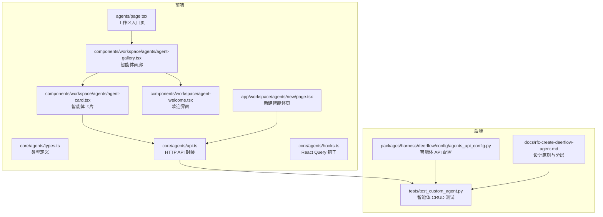
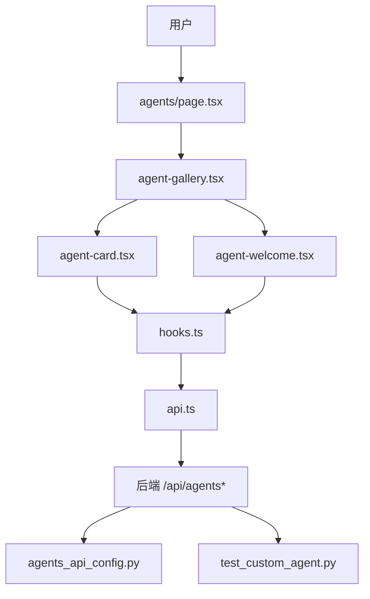
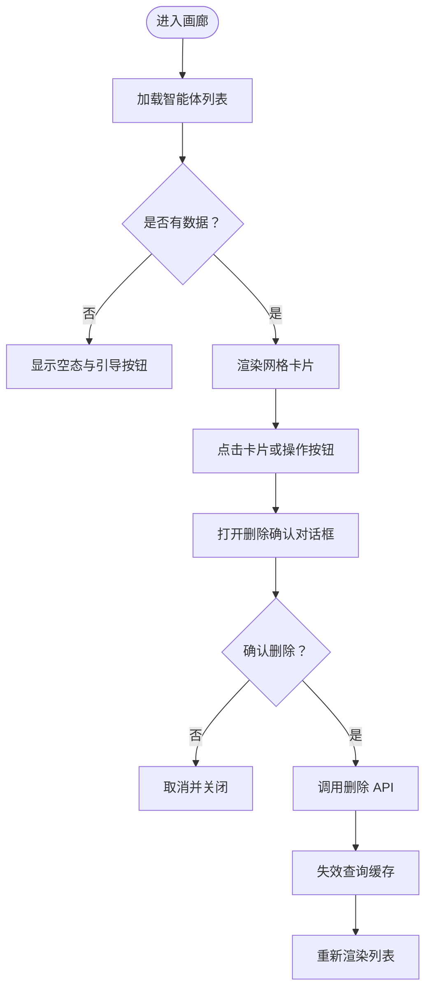
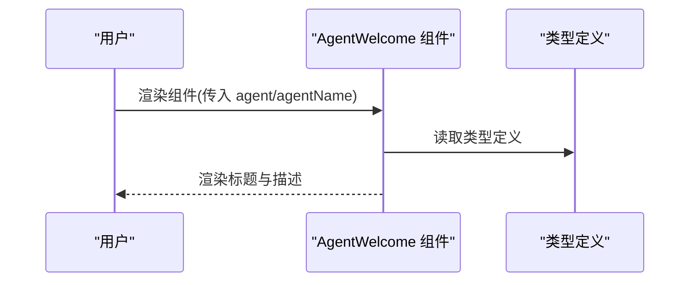
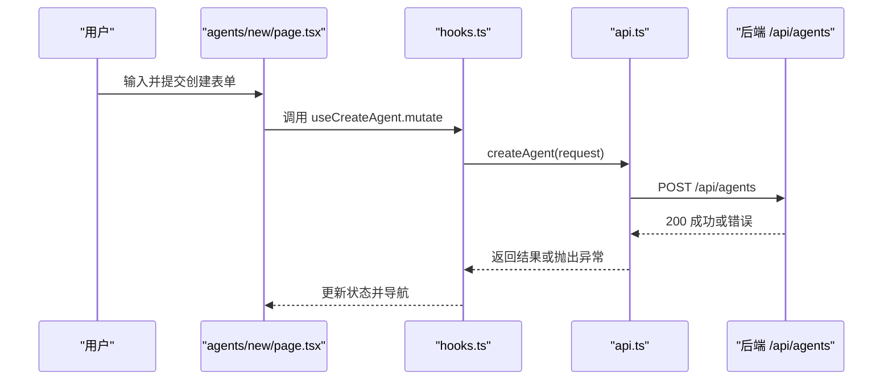
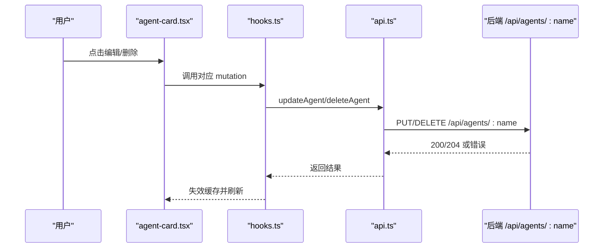
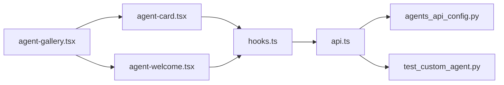

# 智能体管理

<cite>
**本文引用的文件**
- [frontend/src/app/workspace/agents/page.tsx](file://frontend/src/app/workspace/agents/page.tsx)
- [frontend/src/components/workspace/agents/agent-gallery.tsx](file://frontend/src/components/workspace/agents/agent-gallery.tsx)
- [frontend/src/components/workspace/agents/agent-card.tsx](file://frontend/src/components/workspace/agents/agent-card.tsx)
- [frontend/src/components/workspace/agent-welcome.tsx](file://frontend/src/components/workspace/agent-welcome.tsx)
- [frontend/src/core/agents/types.ts](file://frontend/src/core/agents/types.ts)
- [frontend/src/core/agents/api.ts](file://frontend/src/core/agents/api.ts)
- [frontend/src/core/agents/hooks.ts](file://frontend/src/core/agents/hooks.ts)
- [frontend/src/app/workspace/agents/new/page.tsx](file://frontend/src/app/workspace/agents/new/page.tsx)
- [backend/tests/test_custom_agent.py](file://backend/tests/test_custom_agent.py)
- [backend/packages/harness/deerflow/config/agents_api_config.py](file://backend/packages/harness/deerflow/config/agents_api_config.py)
- [backend/docs/rfc-create-deerflow-agent.md](file://backend/docs/rfc-create-deerflow-agent.md)
</cite>

## 目录
1. [简介](#简介)
2. [项目结构](#项目结构)
3. [核心组件](#核心组件)
4. [架构总览](#架构总览)
5. [详细组件分析](#详细组件分析)
6. [依赖关系分析](#依赖关系分析)
7. [性能考虑](#性能考虑)
8. [故障排查指南](#故障排查指南)
9. [结论](#结论)
10. [附录](#附录)

## 简介
本技术文档围绕 DeerFlow 的智能体管理系统进行系统性梳理，覆盖智能体展示与管理的前端实现、后端 API 行为、数据模型与交互流程。重点包括：
- 智能体卡片设计、画廊布局与欢迎界面
- 智能体信息展示、状态管理与交互逻辑
- 智能体创建、编辑、删除与克隆能力
- 搜索、分类筛选与排序机制
- 智能体配置界面、参数调整与个性化设置
- 生命周期管理与用户引导流程

## 项目结构
智能体管理相关代码主要分布在前端工作区与后端测试用例中：
- 前端页面与组件：工作区页面、智能体画廊、智能体卡片、欢迎界面、核心钩子与 API 封装
- 后端测试：验证智能体 CRUD 与状态变更行为
- 配置模块：控制智能体管理 API 的启用状态

**图表来源**
- [frontend/src/app/workspace/agents/page.tsx:1-5](file://frontend/src/app/workspace/agents/page.tsx#L1-L5)
- [frontend/src/components/workspace/agents/agent-gallery.tsx:1-69](file://frontend/src/components/workspace/agents/agent-gallery.tsx#L1-L69)
- [frontend/src/components/workspace/agents/agent-card.tsx:54-153](file://frontend/src/components/workspace/agents/agent-card.tsx#L54-L153)
- [frontend/src/components/workspace/agent-welcome.tsx:1-36](file://frontend/src/components/workspace/agent-welcome.tsx#L1-L36)
- [frontend/src/core/agents/types.ts:1-25](file://frontend/src/core/agents/types.ts#L1-L25)
- [frontend/src/core/agents/api.ts:38-65](file://frontend/src/core/agents/api.ts#L38-L65)
- [frontend/src/core/agents/hooks.ts:1-64](file://frontend/src/core/agents/hooks.ts#L1-L64)
- [frontend/src/app/workspace/agents/new/page.tsx:371-401](file://frontend/src/app/workspace/agents/new/page.tsx#L371-L401)
- [backend/tests/test_custom_agent.py:455-517](file://backend/tests/test_custom_agent.py#L455-L517)
- [backend/packages/harness/deerflow/config/agents_api_config.py:1-32](file://backend/packages/harness/deerflow/config/agents_api_config.py#L1-L32)
- [backend/docs/rfc-create-deerflow-agent.md:30-64](file://backend/docs/rfc-create-deerflow-agent.md#L30-L64)

**章节来源**
- [frontend/src/app/workspace/agents/page.tsx:1-5](file://frontend/src/app/workspace/agents/page.tsx#L1-L5)
- [frontend/src/components/workspace/agents/agent-gallery.tsx:1-69](file://frontend/src/components/workspace/agents/agent-gallery.tsx#L1-L69)
- [frontend/src/components/workspace/agents/agent-card.tsx:54-153](file://frontend/src/components/workspace/agents/agent-card.tsx#L54-L153)
- [frontend/src/components/workspace/agent-welcome.tsx:1-36](file://frontend/src/components/workspace/agent-welcome.tsx#L1-L36)
- [frontend/src/core/agents/types.ts:1-25](file://frontend/src/core/agents/types.ts#L1-L25)
- [frontend/src/core/agents/api.ts:38-65](file://frontend/src/core/agents/api.ts#L38-L65)
- [frontend/src/core/agents/hooks.ts:1-64](file://frontend/src/core/agents/hooks.ts#L1-L64)
- [frontend/src/app/workspace/agents/new/page.tsx:371-401](file://frontend/src/app/workspace/agents/new/page.tsx#L371-L401)
- [backend/tests/test_custom_agent.py:455-517](file://backend/tests/test_custom_agent.py#L455-L517)
- [backend/packages/harness/deerflow/config/agents_api_config.py:1-32](file://backend/packages/harness/deerflow/config/agents_api_config.py#L1-L32)
- [backend/docs/rfc-create-deerflow-agent.md:30-64](file://backend/docs/rfc-create-deerflow-agent.md#L30-L64)

## 核心组件
- 数据模型与类型
  - 智能体对象包含名称、描述、模型、工具组、技能与可选的灵魂（soul）等字段
  - 创建与更新请求体分别定义了可选字段集合，支持部分更新
- 前端 API 封装
  - 提供列表、查询、创建、更新、删除等 HTTP 接口封装，并处理“智能体 API 已禁用”的错误分支
- React Query 钩子
  - useAgents/useAgent：拉取智能体列表与单个智能体详情
  - useCreateAgent/useUpdateAgent/useDeleteAgent：提交变更并自动失效缓存，保持视图一致性
- 页面与组件
  - 画廊页负责渲染卡片网格、空态与新建按钮
  - 卡片组件承载智能体信息展示、编辑与删除确认对话框
  - 欢迎界面用于展示当前智能体的基础信息
  - 新建页提供创建成功后的引导与跳转

**章节来源**
- [frontend/src/core/agents/types.ts:1-25](file://frontend/src/core/agents/types.ts#L1-L25)
- [frontend/src/core/agents/api.ts:38-65](file://frontend/src/core/agents/api.ts#L38-L65)
- [frontend/src/core/agents/hooks.ts:1-64](file://frontend/src/core/agents/hooks.ts#L1-L64)
- [frontend/src/components/workspace/agents/agent-gallery.tsx:37-69](file://frontend/src/components/workspace/agents/agent-gallery.tsx#L37-L69)
- [frontend/src/components/workspace/agents/agent-card.tsx:54-153](file://frontend/src/components/workspace/agents/agent-card.tsx#L54-L153)
- [frontend/src/components/workspace/agent-welcome.tsx:1-36](file://frontend/src/components/workspace/agent-welcome.tsx#L1-L36)
- [frontend/src/app/workspace/agents/new/page.tsx:371-401](file://frontend/src/app/workspace/agents/new/page.tsx#L371-L401)

## 架构总览
前端通过 React Query 管理状态，调用统一的 API 层访问后端；后端提供标准的 REST 接口，配合配置开关控制是否启用智能体管理 API。

**图表来源**
- [frontend/src/app/workspace/agents/page.tsx:1-5](file://frontend/src/app/workspace/agents/page.tsx#L1-L5)
- [frontend/src/components/workspace/agents/agent-gallery.tsx:1-69](file://frontend/src/components/workspace/agents/agent-gallery.tsx#L1-L69)
- [frontend/src/components/workspace/agents/agent-card.tsx:54-153](file://frontend/src/components/workspace/agents/agent-card.tsx#L54-L153)
- [frontend/src/components/workspace/agent-welcome.tsx:1-36](file://frontend/src/components/workspace/agent-welcome.tsx#L1-L36)
- [frontend/src/core/agents/hooks.ts:1-64](file://frontend/src/core/agents/hooks.ts#L1-L64)
- [frontend/src/core/agents/api.ts:38-65](file://frontend/src/core/agents/api.ts#L38-L65)
- [backend/packages/harness/deerflow/config/agents_api_config.py:1-32](file://backend/packages/harness/deerflow/config/agents_api_config.py#L1-L32)
- [backend/tests/test_custom_agent.py:455-517](file://backend/tests/test_custom_agent.py#L455-L517)

## 详细组件分析

### 智能体画廊与卡片
- 画廊布局采用响应式网格，空态时提供引导与新建按钮
- 卡片展示智能体名称、模型标签、描述摘要，并提供删除确认对话框
- 删除操作通过 useDeleteAgent 触发，完成后失效列表缓存

**图表来源**
- [frontend/src/components/workspace/agents/agent-gallery.tsx:37-69](file://frontend/src/components/workspace/agents/agent-gallery.tsx#L37-L69)
- [frontend/src/components/workspace/agents/agent-card.tsx:126-153](file://frontend/src/components/workspace/agents/agent-card.tsx#L126-L153)
- [frontend/src/core/agents/hooks.ts:56-64](file://frontend/src/core/agents/hooks.ts#L56-L64)

**章节来源**
- [frontend/src/components/workspace/agents/agent-gallery.tsx:37-69](file://frontend/src/components/workspace/agents/agent-gallery.tsx#L37-L69)
- [frontend/src/components/workspace/agents/agent-card.tsx:126-153](file://frontend/src/components/workspace/agents/agent-card.tsx#L126-L153)
- [frontend/src/core/agents/hooks.ts:56-64](file://frontend/src/core/agents/hooks.ts#L56-L64)

### 智能体欢迎界面
- 展示当前智能体的头像占位、名称与描述，作为会话或详情页的引导元素
- 支持传入 agent 或 agentName 以决定显示内容

**图表来源**
- [frontend/src/components/workspace/agent-welcome.tsx:1-36](file://frontend/src/components/workspace/agent-welcome.tsx#L1-L36)
- [frontend/src/core/agents/types.ts:1-8](file://frontend/src/core/agents/types.ts#L1-L8)

**章节来源**
- [frontend/src/components/workspace/agent-welcome.tsx:1-36](file://frontend/src/components/workspace/agent-welcome.tsx#L1-L36)
- [frontend/src/core/agents/types.ts:1-8](file://frontend/src/core/agents/types.ts#L1-L8)

### 智能体创建流程
- 新建页在提交后根据结果展示成功提示与跳转按钮
- API 层对“智能体 API 已禁用”场景抛出特定错误，前端可据此给出明确提示

**图表来源**
- [frontend/src/app/workspace/agents/new/page.tsx:371-401](file://frontend/src/app/workspace/agents/new/page.tsx#L371-L401)
- [frontend/src/core/agents/hooks.ts:29-37](file://frontend/src/core/agents/hooks.ts#L29-L37)
- [frontend/src/core/agents/api.ts:51-65](file://frontend/src/core/agents/api.ts#L51-L65)
- [backend/tests/test_custom_agent.py:455-468](file://backend/tests/test_custom_agent.py#L455-L468)

**章节来源**
- [frontend/src/app/workspace/agents/new/page.tsx:371-401](file://frontend/src/app/workspace/agents/new/page.tsx#L371-L401)
- [frontend/src/core/agents/hooks.ts:29-37](file://frontend/src/core/agents/hooks.ts#L29-L37)
- [frontend/src/core/agents/api.ts:51-65](file://frontend/src/core/agents/api.ts#L51-L65)
- [backend/tests/test_custom_agent.py:455-468](file://backend/tests/test_custom_agent.py#L455-L468)

### 智能体编辑与删除
- 编辑通过 useUpdateAgent 提交部分字段更新，完成后同时失效列表与详情缓存
- 删除通过 useDeleteAgent 触发，完成后仅失效列表缓存

**图表来源**
- [frontend/src/components/workspace/agents/agent-card.tsx:126-153](file://frontend/src/components/workspace/agents/agent-card.tsx#L126-L153)
- [frontend/src/core/agents/hooks.ts:39-63](file://frontend/src/core/agents/hooks.ts#L39-L63)
- [frontend/src/core/agents/api.ts:45-65](file://frontend/src/core/agents/api.ts#L45-L65)
- [backend/tests/test_custom_agent.py:491-517](file://backend/tests/test_custom_agent.py#L491-L517)

**章节来源**
- [frontend/src/components/workspace/agents/agent-card.tsx:126-153](file://frontend/src/components/workspace/agents/agent-card.tsx#L126-L153)
- [frontend/src/core/agents/hooks.ts:39-63](file://frontend/src/core/agents/hooks.ts#L39-L63)
- [frontend/src/core/agents/api.ts:45-65](file://frontend/src/core/agents/api.ts#L45-L65)
- [backend/tests/test_custom_agent.py:491-517](file://backend/tests/test_custom_agent.py#L491-L517)

### 智能体搜索、分类筛选与排序
- 当前前端画廊未实现搜索与筛选 UI；后端测试覆盖了按名称列出与包含 soul 字段的行为
- 若需扩展搜索/筛选/排序，建议在现有 API 上增加查询参数并在前端 hooks 中传递

**章节来源**
- [backend/tests/test_custom_agent.py:459-476](file://backend/tests/test_custom_agent.py#L459-L476)

### 智能体配置界面与个性化设置
- 类型定义中包含 model、tool_groups、skills、soul 等字段，表明支持模型选择、工具组与技能配置以及“灵魂”个性化内容
- 建议在新建/编辑页中新增对应表单项，并通过 useUpdateAgent 提交

**章节来源**
- [frontend/src/core/agents/types.ts:1-25](file://frontend/src/core/agents/types.ts#L1-L25)

### 生命周期管理与用户引导
- 从画廊到新建页再到创建成功引导，形成完整的用户路径
- 删除流程包含二次确认，避免误删
- 列表与详情缓存失效策略确保多处状态一致

**章节来源**
- [frontend/src/app/workspace/agents/page.tsx:1-5](file://frontend/src/app/workspace/agents/page.tsx#L1-L5)
- [frontend/src/app/workspace/agents/new/page.tsx:371-401](file://frontend/src/app/workspace/agents/new/page.tsx#L371-L401)
- [frontend/src/components/workspace/agents/agent-gallery.tsx:37-69](file://frontend/src/components/workspace/agents/agent-gallery.tsx#L37-L69)
- [frontend/src/components/workspace/agents/agent-card.tsx:126-153](file://frontend/src/components/workspace/agents/agent-card.tsx#L126-L153)

## 依赖关系分析
- 组件依赖
  - 画廊依赖卡片与欢迎界面
  - 卡片依赖 API 与钩子
  - 新建页依赖 API 与钩子
- 状态依赖
  - React Query 查询键遵循 ["agents"] 与 ["agents", name]，保证列表与详情独立缓存
- 后端依赖
  - API 受 agents_api_config 控制是否启用
  - 测试覆盖 CRUD 与 404 场景

**图表来源**
- [frontend/src/components/workspace/agents/agent-gallery.tsx:1-69](file://frontend/src/components/workspace/agents/agent-gallery.tsx#L1-L69)
- [frontend/src/components/workspace/agents/agent-card.tsx:54-153](file://frontend/src/components/workspace/agents/agent-card.tsx#L54-L153)
- [frontend/src/components/workspace/agent-welcome.tsx:1-36](file://frontend/src/components/workspace/agent-welcome.tsx#L1-L36)
- [frontend/src/core/agents/hooks.ts:1-64](file://frontend/src/core/agents/hooks.ts#L1-L64)
- [frontend/src/core/agents/api.ts:38-65](file://frontend/src/core/agents/api.ts#L38-L65)
- [backend/packages/harness/deerflow/config/agents_api_config.py:1-32](file://backend/packages/harness/deerflow/config/agents_api_config.py#L1-L32)
- [backend/tests/test_custom_agent.py:455-517](file://backend/tests/test_custom_agent.py#L455-L517)

**章节来源**
- [frontend/src/core/agents/hooks.ts:1-64](file://frontend/src/core/agents/hooks.ts#L1-L64)
- [frontend/src/core/agents/api.ts:38-65](file://frontend/src/core/agents/api.ts#L38-L65)
- [backend/packages/harness/deerflow/config/agents_api_config.py:1-32](file://backend/packages/harness/deerflow/config/agents_api_config.py#L1-L32)
- [backend/tests/test_custom_agent.py:455-517](file://backend/tests/test_custom_agent.py#L455-L517)

## 性能考虑
- 列表与详情分离缓存键，减少不必要的重渲染
- 使用查询客户端统一失效策略，避免手动同步
- 对于大量智能体场景，可在前端引入分页或虚拟滚动优化渲染性能

## 故障排查指南
- “智能体 API 已禁用”
  - 现象：创建失败并抛出特定错误
  - 处理：检查 agents_api_config.enabled 是否开启
- 404 未找到
  - 现象：查询或更新不存在的智能体返回 404
  - 处理：确认名称正确或先创建再操作
- 删除后仍可见
  - 现象：删除后列表未刷新
  - 处理：确认已触发缓存失效并重新拉取

**章节来源**
- [frontend/src/core/agents/api.ts:51-65](file://frontend/src/core/agents/api.ts#L51-L65)
- [backend/packages/harness/deerflow/config/agents_api_config.py:9-12](file://backend/packages/harness/deerflow/config/agents_api_config.py#L9-L12)
- [backend/tests/test_custom_agent.py:487-517](file://backend/tests/test_custom_agent.py#L487-L517)

## 结论
该智能体管理系统以清晰的前端组件与后端 API 为核心，结合 React Query 实现高效的状态管理与缓存同步。当前实现覆盖了智能体的展示、创建、编辑与删除，具备良好的扩展空间以支持搜索、筛选、排序与更丰富的配置项。

## 附录
- 设计原则与分层
  - 强调依赖注入、协议契约、合理默认值与分层 API
  - 顶层客户端对外暴露统一接口，内部工厂与底层原语解耦

**章节来源**
- [backend/docs/rfc-create-deerflow-agent.md:30-64](file://backend/docs/rfc-create-deerflow-agent.md#L30-L64)