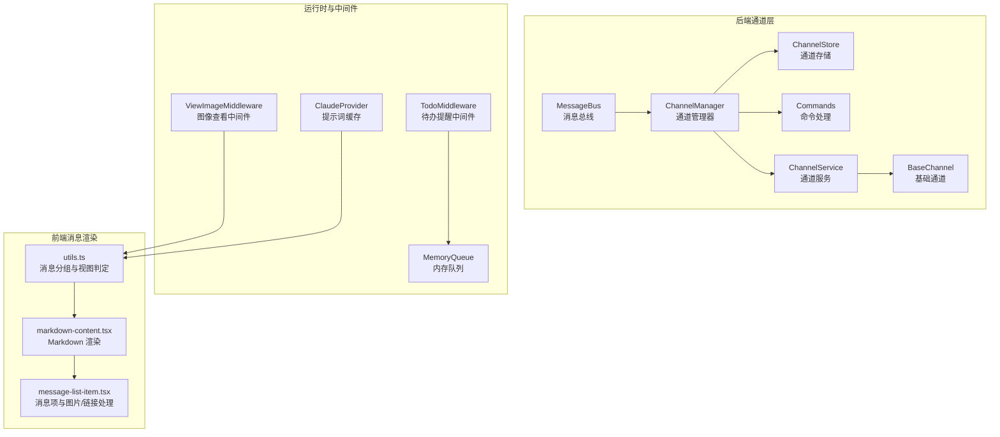
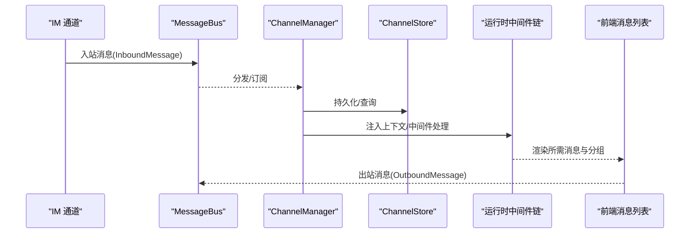
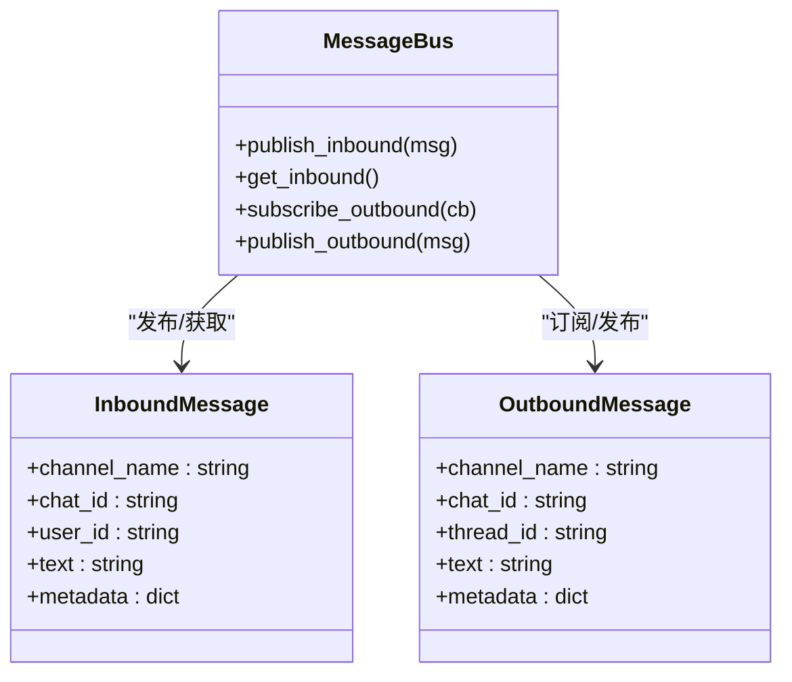
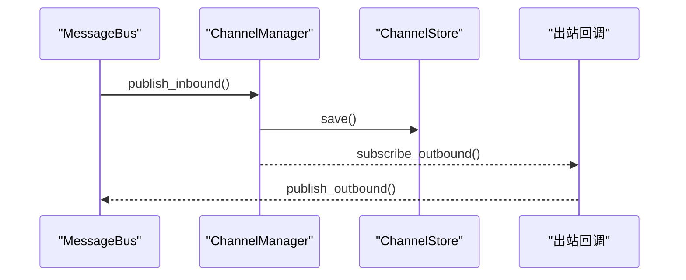
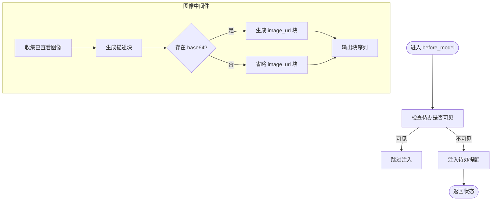
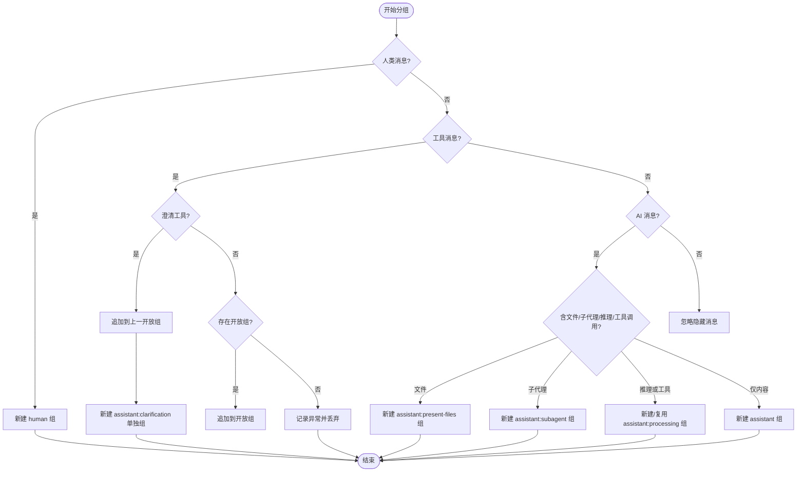
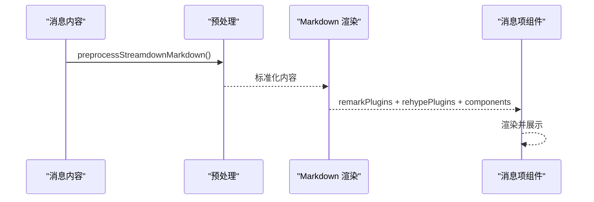
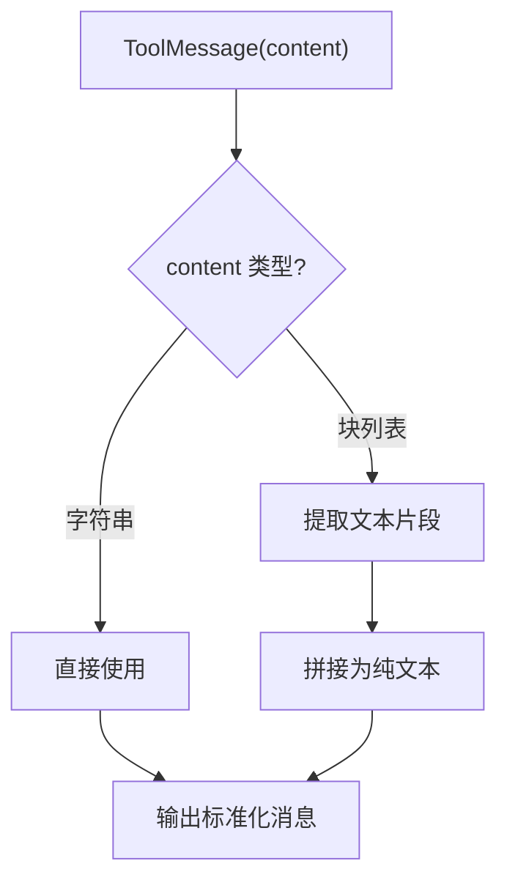
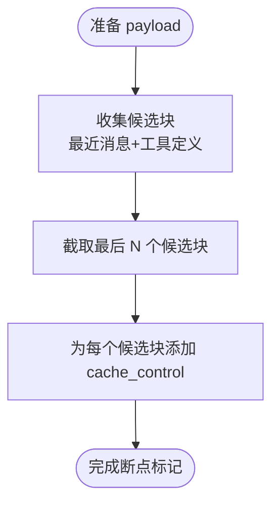
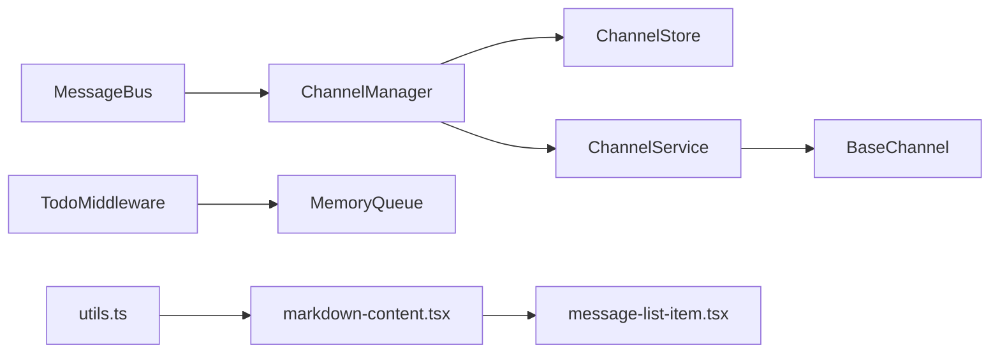

# 消息管理系统

<cite>
**本文引用的文件**
- [message_bus.py](file://backend/app/channels/message_bus.py)
- [manager.py](file://backend/app/channels/manager.py)
- [store.py](file://backend/app/channels/store.py)
- [commands.py](file://backend/app/channels/commands.py)
- [base.py](file://backend/app/channels/base.py)
- [service.py](file://backend/app/channels/service.py)
- [utils.ts](file://frontend/src/core/messages/utils.ts)
- [markdown-content.tsx](file://frontend/src/components/workspace/messages/markdown-content.tsx)
- [message-list-item.tsx](file://frontend/src/components/workspace/messages/message-list-item.tsx)
- [test_channels.py](file://backend/tests/test_channels.py)
- [test_serialize_message_content.py](file://backend/tests/test_serialize_message_content.py)
- [test_view_image_middleware.py](file://backend/tests/test_view_image_middleware.py)
- [queue.py](file://backend/packages/harness/deerflow/agents/memory/queue.py)
- [claude_provider.py](file://backend/packages/harness/deerflow/models/claude_provider.py)
- [ARCHITECTURE.md](file://backend/docs/ARCHITECTURE.md)
</cite>

## 目录
1. [引言](#引言)
2. [项目结构](#项目结构)
3. [核心组件](#核心组件)
4. [架构总览](#架构总览)
5. [详细组件分析](#详细组件分析)
6. [依赖关系分析](#依赖关系分析)
7. [性能考虑](#性能考虑)
8. [故障排查指南](#故障排查指南)
9. [结论](#结论)
10. [附录](#附录)

## 引言
本文件面向 DeerFlow 的消息管理系统，系统性梳理消息从通道接入、队列处理、上下文聚合、前端渲染到持久化的完整链路。重点覆盖以下主题：
- 消息分组算法：如何将多轮对话与工具调用、澄清请求、子代理结果等消息聚合成用户可感知的消息组。
- 上下文管理机制：如何在中间件与运行时中维护线程状态、注入提醒、维持任务清单等。
- 消息状态维护：消息元数据、澄清标记、出站回调、存储与订阅等。
- Markdown 渲染引擎：前端对流式 Markdown 的预处理、插件化渲染与自定义组件映射。
- 消息序列化与反序列化：工具消息内容规范化、避免原始对象表示泄露到 UI。
- 视图模式转换：人类消息、AI 中间态、澄清、子代理、文件呈现等视图形态的判定与切换。
- 缓存策略与增量更新：提示词缓存控制、内存队列合并与去重、存储失败隔离与深拷贝保护。
- 性能优化：批量处理、最小化渲染、延迟加载与资源链接解析。

## 项目结构
消息管理相关代码主要分布在后端通道层（channels）、运行时中间件与内存模块、以及前端消息渲染组件三部分。后端通过消息总线解耦通道与调度器；前端负责消息分组与 Markdown 渲染。

**图表来源**
- [message_bus.py:1-34](file://backend/app/channels/message_bus.py#L1-L34)
- [manager.py](file://backend/app/channels/manager.py)
- [store.py](file://backend/app/channels/store.py)
- [commands.py](file://backend/app/channels/commands.py)
- [service.py](file://backend/app/channels/service.py)
- [base.py](file://backend/app/channels/base.py)
- [utils.ts:41-137](file://frontend/src/core/messages/utils.ts#L41-L137)
- [markdown-content.tsx:31-83](file://frontend/src/components/workspace/messages/markdown-content.tsx#L31-L83)
- [message-list-item.tsx:181-248](file://frontend/src/components/workspace/messages/message-list-item.tsx#L181-L248)

**章节来源**
- [ARCHITECTURE.md:5-48](file://backend/docs/ARCHITECTURE.md#L5-L48)

## 核心组件
- 后端消息总线与通道：提供异步发布/订阅、入站/出站消息封装、元数据透传与回调机制。
- 通道管理器与存储：负责通道生命周期、消息持久化与检索。
- 运行时中间件：在模型前注入提醒、处理图像查看详情块、维护线程状态。
- 前端消息分组与渲染：根据消息类型与内容特征进行分组，选择合适的视图模式并渲染 Markdown。
- 序列化与反序列化：确保工具消息内容被正确提取为纯文本，避免原始对象表示泄露。
- 提示词缓存：对最近消息与工具定义进行断点标记以提升缓存命中率。

**章节来源**
- [message_bus.py:1-34](file://backend/app/channels/message_bus.py#L1-L34)
- [manager.py](file://backend/app/channels/manager.py)
- [store.py](file://backend/app/channels/store.py)
- [utils.ts:41-137](file://frontend/src/core/messages/utils.ts#L41-L137)
- [markdown-content.tsx:31-83](file://frontend/src/components/workspace/messages/markdown-content.tsx#L31-L83)
- [test_serialize_message_content.py:1-38](file://backend/tests/test_serialize_message_content.py#L1-L38)
- [claude_provider.py:223-248](file://backend/packages/harness/deerflow/models/claude_provider.py#L223-L248)

## 架构总览
消息从外部 IM 通道进入，经由消息总线与通道管理器，进入运行时中间件链，再由前端按组渲染。后端提供序列化保障与提示词缓存优化，前端提供灵活的 Markdown 渲染与视图模式切换。

**图表来源**
- [message_bus.py:1-34](file://backend/app/channels/message_bus.py#L1-L34)
- [manager.py](file://backend/app/channels/manager.py)
- [store.py](file://backend/app/channels/store.py)
- [utils.ts:41-137](file://frontend/src/core/messages/utils.ts#L41-L137)

## 详细组件分析

### 消息总线与通道（后端）
- 消息类型与封装：定义入站/出站消息的数据结构，支持元数据透传与类型枚举。
- 发布/订阅：提供入站发布、出站订阅与回调注册能力，保证 FIFO 顺序与异步处理。
- 元数据键：提供澄清状态标记键，用于在出站消息中保留入站元数据。

**图表来源**
- [message_bus.py:25-34](file://backend/app/channels/message_bus.py#L25-L34)
- [message_bus.py:32-69](file://backend/app/channels/message_bus.py#L32-L69)

**章节来源**
- [message_bus.py:1-34](file://backend/app/channels/message_bus.py#L1-L34)
- [test_channels.py:52-97](file://backend/tests/test_channels.py#L52-L97)

### 通道管理器与存储
- 生命周期管理：启动/停止通道，维护消息队列与回调。
- 存储集成：将入站消息持久化至通道存储，并支持按通道/会话检索。
- 元数据透传：入站元数据在出站阶段保持一致，便于下游处理。

**图表来源**
- [manager.py](file://backend/app/channels/manager.py)
- [store.py](file://backend/app/channels/store.py)
- [test_channels.py:667-684](file://backend/tests/test_channels.py#L667-L684)

**章节来源**
- [manager.py](file://backend/app/channels/manager.py)
- [store.py](file://backend/app/channels/store.py)
- [test_channels.py:667-684](file://backend/tests/test_channels.py#L667-L684)

### 运行时中间件与上下文管理
- 待办提醒中间件：当写入待办不在上下文窗口内时，自动注入提醒，避免重复注入。
- 图像查看中间件：将已查看图像构建为文本描述与图像块，支持多图与 MIME 类型未知场景。
- 内存队列：对同一线程/用户/代理的上下文进行合并与去重，累积纠错与强化信号。

**图表来源**
- [todo_middleware.py:118-138](file://backend/packages/harness/deerflow/agents/middlewares/todo_middleware.py#L118-L138)
- [test_view_image_middleware.py:165-226](file://backend/tests/test_view_image_middleware.py#L165-L226)
- [queue.py:115-144](file://backend/packages/harness/deerflow/agents/memory/queue.py#L115-L144)

**章节来源**
- [todo_middleware.py:118-138](file://backend/packages/harness/deerflow/agents/middlewares/todo_middleware.py#L118-L138)
- [test_view_image_middleware.py:165-226](file://backend/tests/test_view_image_middleware.py#L165-L226)
- [queue.py:115-144](file://backend/packages/harness/deerflow/agents/memory/queue.py#L115-L144)

### 前端消息分组与视图模式
- 分组策略：依据消息类型与内容特征，将人类消息、AI 中间态、工具调用、澄清、子代理、文件呈现等归类为不同的消息组。
- 视图模式：处理“处理中”“澄清”“子代理”“文件呈现”“最终回复”等视图形态。
- 渲染增强：Markdown 预处理、插件化渲染、自定义组件映射（如引用链接、外链处理）。

**图表来源**
- [utils.ts:41-137](file://frontend/src/core/messages/utils.ts#L41-L137)

**章节来源**
- [utils.ts:41-137](file://frontend/src/core/messages/utils.ts#L41-L137)
- [markdown-content.tsx:31-83](file://frontend/src/components/workspace/messages/markdown-content.tsx#L31-L83)
- [message-list-item.tsx:181-248](file://frontend/src/components/workspace/messages/message-list-item.tsx#L181-L248)

### Markdown 内容渲染引擎
- 预处理：对流式 Markdown 进行标准化处理，确保渲染一致性。
- 插件系统：支持 remark 与 rehype 插件，按需启用。
- 自定义组件：锚点链接识别引用标记、外链安全打开、图片与附件链接解析。

**图表来源**
- [markdown-content.tsx:31-83](file://frontend/src/components/workspace/messages/markdown-content.tsx#L31-L83)
- [message-list-item.tsx:211-248](file://frontend/src/components/workspace/messages/message-list-item.tsx#L211-L248)

**章节来源**
- [markdown-content.tsx:31-83](file://frontend/src/components/workspace/messages/markdown-content.tsx#L31-L83)
- [message-list-item.tsx:181-248](file://frontend/src/components/workspace/messages/message-list-item.tsx#L181-L248)

### 消息序列化与反序列化
- 工具消息规范化：将结构化内容（块列表）提取为纯文本，避免 Python 表达式字符串泄露。
- 客户端序列化：确保 UI 接收稳定、可渲染的内容格式。

**图表来源**
- [test_serialize_message_content.py:18-38](file://backend/tests/test_serialize_message_content.py#L18-L38)

**章节来源**
- [test_serialize_message_content.py:1-38](file://backend/tests/test_serialize_message_content.py#L1-L38)

### 提示词缓存策略
- 断点标记：对最近消息与工具定义的候选文本块应用断点标记，限制断点数量。
- 窗口控制：仅对最近若干条消息与最后一条工具定义进行缓存标记，避免过期信息占用缓存。

**图表来源**
- [claude_provider.py:223-248](file://backend/packages/harness/deerflow/models/claude_provider.py#L223-L248)

**章节来源**
- [claude_provider.py:223-248](file://backend/packages/harness/deerflow/models/claude_provider.py#L223-L248)

## 依赖关系分析
- 后端通道层依赖消息总线进行解耦，通道管理器协调存储与服务，命令与基础通道提供扩展点。
- 前端依赖消息分组工具与渲染组件，渲染组件依赖插件与自定义组件映射。
- 运行时中间件依赖线程状态与内存队列，以实现上下文注入与消息聚合。

**图表来源**
- [message_bus.py:1-34](file://backend/app/channels/message_bus.py#L1-L34)
- [manager.py](file://backend/app/channels/manager.py)
- [store.py](file://backend/app/channels/store.py)
- [service.py](file://backend/app/channels/service.py)
- [base.py](file://backend/app/channels/base.py)
- [utils.ts:41-137](file://frontend/src/core/messages/utils.ts#L41-L137)
- [markdown-content.tsx:31-83](file://frontend/src/components/workspace/messages/markdown-content.tsx#L31-L83)
- [message-list-item.tsx:181-248](file://frontend/src/components/workspace/messages/message-list-item.tsx#L181-L248)

**章节来源**
- [message_bus.py:1-34](file://backend/app/channels/message_bus.py#L1-L34)
- [manager.py](file://backend/app/channels/manager.py)
- [store.py](file://backend/app/channels/store.py)
- [service.py](file://backend/app/channels/service.py)
- [base.py](file://backend/app/channels/base.py)
- [utils.ts:41-137](file://frontend/src/core/messages/utils.ts#L41-L137)
- [markdown-content.tsx:31-83](file://frontend/src/components/workspace/messages/markdown-content.tsx#L31-L83)
- [message-list-item.tsx:181-248](file://frontend/src/components/workspace/messages/message-list-item.tsx#L181-L248)

## 性能考虑
- 批量与合并：内存队列对相同上下文进行合并与去重，减少重复处理。
- 最小化渲染：前端仅对当前加载状态进行单词拆分与高亮，避免全量重排。
- 资源优化：图像与附件采用链接解析与延迟加载，降低首屏压力。
- 缓存命中：提示词缓存仅对最近消息与工具定义打点，控制断点数量，提升长上下文效率。

[本节为通用性能建议，不直接分析具体文件]

## 故障排查指南
- 元数据丢失：确认入站消息元数据在出站阶段是否透传，检查通道管理器回调注册与存储流程。
- 消息乱序：验证消息总线的发布/订阅顺序与队列 FIFO 行为。
- 工具消息显示异常：检查客户端序列化逻辑，确保块列表被正确提取为纯文本。
- 图像渲染缺失：确认中间件是否生成 image_url 块且 base64 数据非空。
- 待办提醒未出现：检查上下文窗口判断与提醒注入条件，避免重复注入。

**章节来源**
- [test_channels.py:52-97](file://backend/tests/test_channels.py#L52-L97)
- [test_channels.py:667-684](file://backend/tests/test_channels.py#L667-L684)
- [test_serialize_message_content.py:1-38](file://backend/tests/test_serialize_message_content.py#L1-L38)
- [test_view_image_middleware.py:165-226](file://backend/tests/test_view_image_middleware.py#L165-L226)
- [todo_middleware.py:118-138](file://backend/packages/harness/deerflow/agents/middlewares/todo_middleware.py#L118-L138)

## 结论
DeerFlow 的消息管理系统通过消息总线实现通道与运行时的解耦，借助中间件在运行时注入上下文与提醒，前端以灵活的分组与渲染策略呈现多样化视图。序列化与缓存优化进一步提升了稳定性与性能。后续可在跨通道一致性、增量更新隔离与大规模消息的内存管理方面持续演进。

[本节为总结性内容，不直接分析具体文件]

## 附录

### 消息格式规范与渲染规则
- 消息类型与字段：入站/出站消息包含通道名、会话/线程标识、用户标识、文本内容与可选元数据。
- 工具消息内容：必须提取为纯文本，禁止直接展示对象表示。
- Markdown 渲染：支持 remark 与 rehype 插件，自定义组件映射锚点链接与外链安全打开。

**章节来源**
- [message_bus.py:25-69](file://backend/app/channels/message_bus.py#L25-L69)
- [test_serialize_message_content.py:18-38](file://backend/tests/test_serialize_message_content.py#L18-L38)
- [markdown-content.tsx:31-83](file://frontend/src/components/workspace/messages/markdown-content.tsx#L31-L83)

### 自定义扩展实现指南
- 新增通道：继承基础通道，实现命令解析与消息发送接口，注册到通道管理器。
- 新增中间件：在模型前注入逻辑，维护线程状态，注意避免重复注入与状态污染。
- 自定义渲染：在消息项组件中扩展图片与链接处理逻辑，确保附件 URL 解析与安全打开。

**章节来源**
- [base.py](file://backend/app/channels/base.py)
- [commands.py](file://backend/app/channels/commands.py)
- [service.py](file://backend/app/channels/service.py)
- [message-list-item.tsx:181-248](file://frontend/src/components/workspace/messages/message-list-item.tsx#L181-L248)