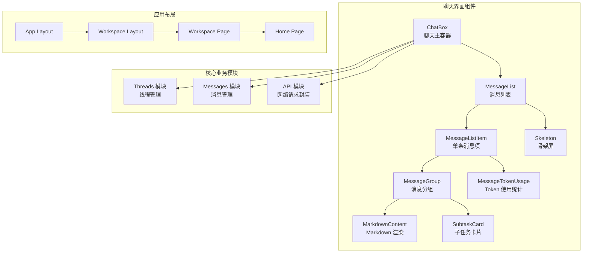
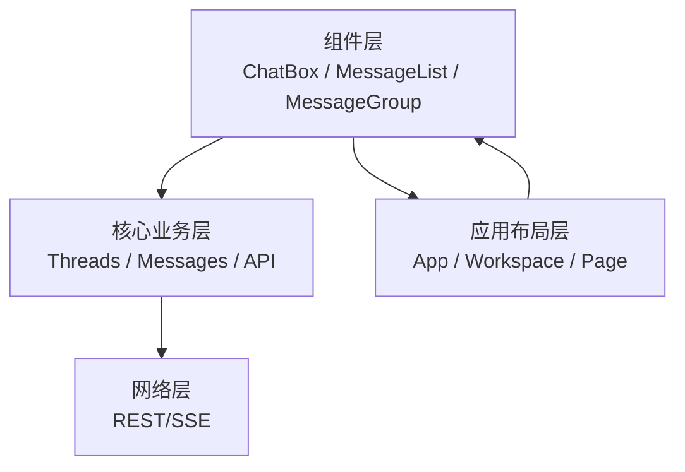
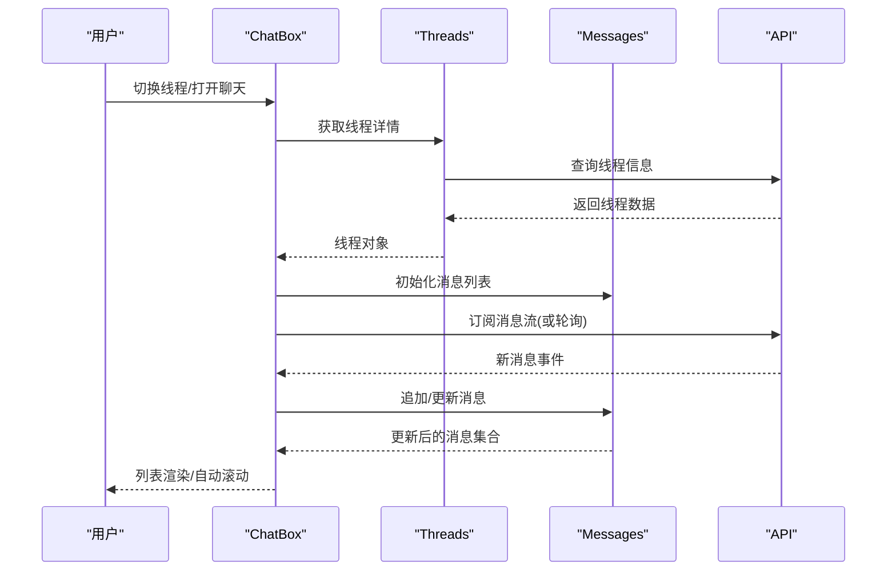
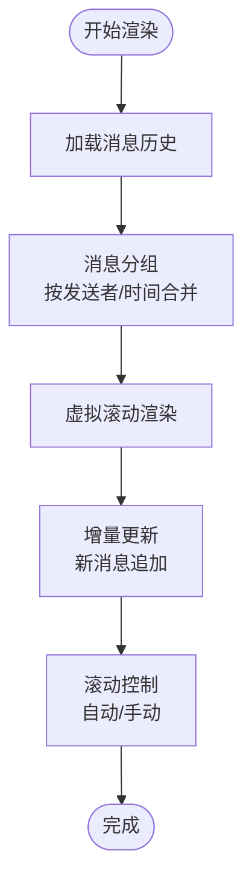
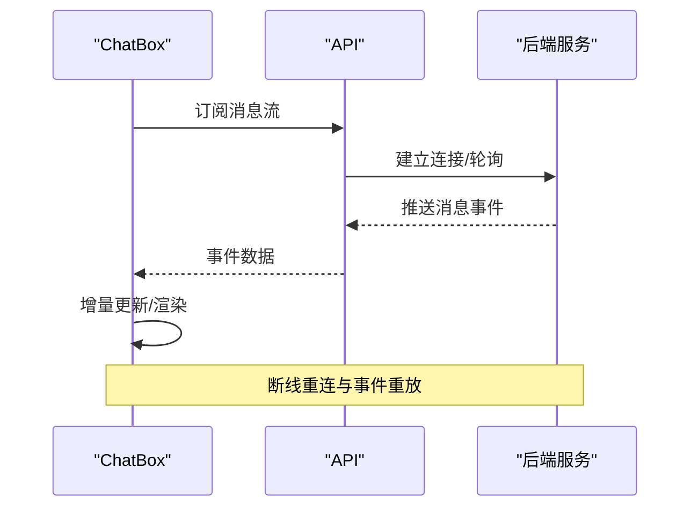
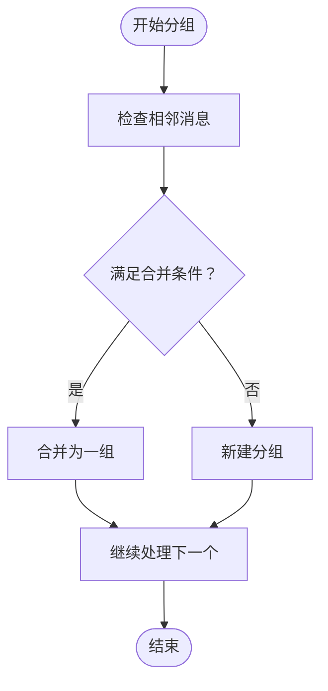
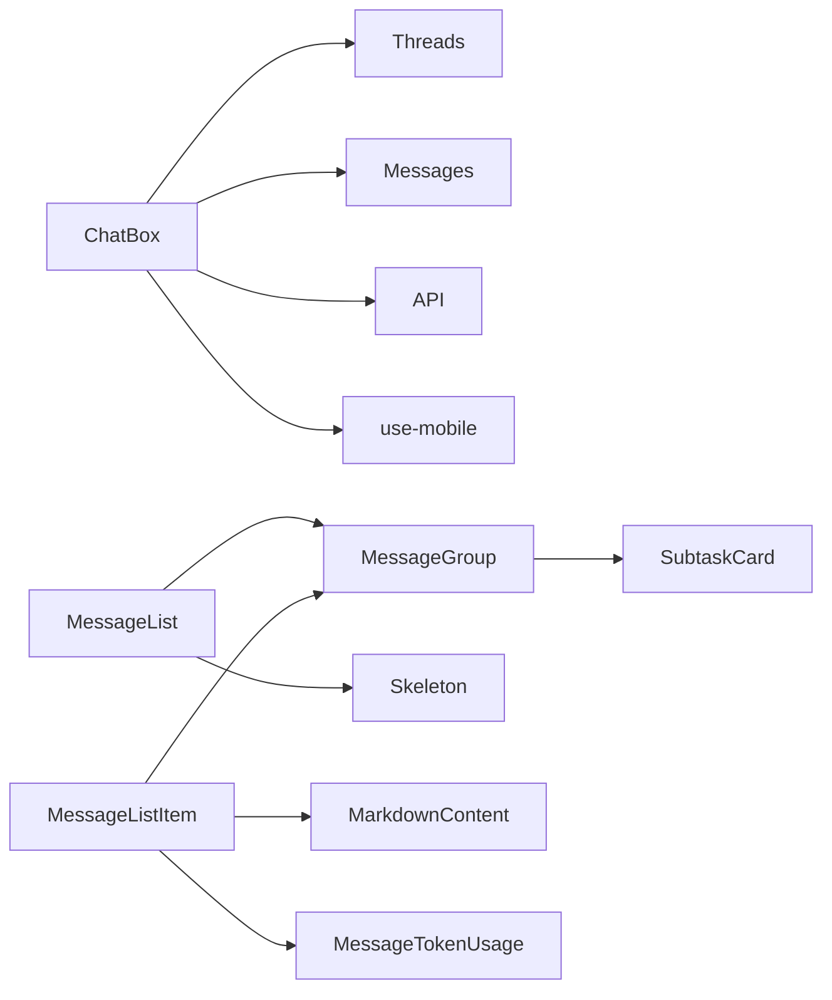

# 聊天界面系统

<cite>
**本文档引用的文件**
- [chat-box.tsx](file://frontend/src/components/workspace/chats/chat-box.tsx)
- [markdown-content.tsx](file://frontend/src/components/workspace/messages/markdown-content.tsx)
- [message-group.tsx](file://frontend/src/components/workspace/messages/message-group.tsx)
- [message-list-item.tsx](file://frontend/src/components/workspace/messages/message-list-item.tsx)
- [message-list.tsx](file://frontend/src/components/workspace/messages/message-list.tsx)
- [message-token-usage.tsx](file://frontend/src/components/workspace/messages/message-token-usage.tsx)
- [skeleton.tsx](file://frontend/src/components/workspace/messages/skeleton.tsx)
- [subtask-card.tsx](file://frontend/src/components/workspace/messages/subtask-card.tsx)
- [threads.ts](file://frontend/src/core/threads/threads.ts)
- [messages.ts](file://frontend/src/core/messages/messages.ts)
- [api.ts](file://frontend/src/core/api/api.ts)
- [use-mobile.ts](file://frontend/src/hooks/use-mobile.ts)
- [layout.tsx](file://frontend/src/app/layout.tsx)
- [page.tsx](file://frontend/src/app/page.tsx)
- [workspace-layout.tsx](file://frontend/src/app/workspace/layout.tsx)
- [workspace-page.tsx](file://frontend/src/app/workspace/page.tsx)
- [chat.spec.ts](file://frontend/tests/e2e/chat.spec.ts)
- [thread-history.spec.ts](file://frontend/tests/e2e/thread-history.spec.ts)
- [chat-thread-init-ordering.spec.ts](file://frontend/tests/e2e/chat-thread-init-ordering.spec.ts)
</cite>

## 目录
1. [简介](#简介)
2. [项目结构](#项目结构)
3. [核心组件](#核心组件)
4. [架构总览](#架构总览)
5. [详细组件分析](#详细组件分析)
6. [依赖关系分析](#依赖关系分析)
7. [性能考虑](#性能考虑)
8. [故障排除指南](#故障排除指南)
9. [结论](#结论)

## 简介
本文件面向 DeerFlow 的聊天界面系统，提供从架构到实现细节的全面技术文档。重点覆盖 ChatBox 组件、消息列表渲染机制、输入框设计、实时消息同步、消息状态管理、消息分组算法、Markdown 内容渲染、消息交互逻辑、聊天模式切换、线程管理、消息历史加载与增量更新、以及消息发送/接收/编辑/删除的完整流程。同时给出组件使用示例、状态管理模式和性能优化策略。

## 项目结构
前端聊天界面位于 `frontend/src/components/workspace/chats/` 和 `frontend/src/components/workspace/messages/` 目录下，配合核心业务模块（threads、messages、api）完成线程与消息的生命周期管理。测试用例位于 `frontend/tests/e2e/`，涵盖聊天与线程历史的关键场景。

**图表来源**
- [chat-box.tsx:1-200](file://frontend/src/components/workspace/chats/chat-box.tsx#L1-L200)
- [message-list.tsx:1-200](file://frontend/src/components/workspace/messages/message-list.tsx#L1-L200)
- [message-list-item.tsx:1-200](file://frontend/src/components/workspace/messages/message-list-item.tsx#L1-L200)
- [message-group.tsx:1-200](file://frontend/src/components/workspace/messages/message-group.tsx#L1-L200)
- [markdown-content.tsx:1-200](file://frontend/src/components/workspace/messages/markdown-content.tsx#L1-L200)
- [message-token-usage.tsx:1-200](file://frontend/src/components/workspace/messages/message-token-usage.tsx#L1-L200)
- [skeleton.tsx:1-200](file://frontend/src/components/workspace/messages/skeleton.tsx#L1-L200)
- [subtask-card.tsx:1-200](file://frontend/src/components/workspace/messages/subtask-card.tsx#L1-L200)
- [threads.ts:1-200](file://frontend/src/core/threads/threads.ts#L1-L200)
- [messages.ts:1-200](file://frontend/src/core/messages/messages.ts#L1-L200)
- [api.ts:1-200](file://frontend/src/core/api/api.ts#L1-L200)
- [layout.tsx:1-200](file://frontend/src/app/layout.tsx#L1-L200)
- [workspace-layout.tsx:1-200](file://frontend/src/app/workspace/layout.tsx#L1-L200)
- [workspace-page.tsx:1-200](file://frontend/src/app/workspace/page.tsx#L1-L200)
- [page.tsx:1-200](file://frontend/src/app/page.tsx#L1-L200)

**章节来源**
- [chat-box.tsx:1-200](file://frontend/src/components/workspace/chats/chat-box.tsx#L1-L200)
- [message-list.tsx:1-200](file://frontend/src/components/workspace/messages/message-list.tsx#L1-L200)
- [threads.ts:1-200](file://frontend/src/core/threads/threads.ts#L1-L200)
- [messages.ts:1-200](file://frontend/src/core/messages/messages.ts#L1-L200)
- [api.ts:1-200](file://frontend/src/core/api/api.ts#L1-L200)
- [layout.tsx:1-200](file://frontend/src/app/layout.tsx#L1-L200)
- [workspace-layout.tsx:1-200](file://frontend/src/app/workspace/layout.tsx#L1-L200)
- [workspace-page.tsx:1-200](file://frontend/src/app/workspace/page.tsx#L1-L200)
- [page.tsx:1-200](file://frontend/src/app/page.tsx#L1-L200)

## 核心组件
- ChatBox：聊天主容器，负责线程切换、输入处理、实时流式响应、滚动控制、移动端适配等。
- MessageList：消息列表渲染器，支持虚拟滚动、增量更新、骨架屏占位。
- MessageListItem：单条消息项，承载消息内容、操作按钮、Token 使用统计。
- MessageGroup：消息分组器，按发送者、时间、状态合并相邻消息，减少 DOM 数量。
- MarkdownContent：Markdown 内容渲染器，支持代码高亮、链接、表格等。
- MessageTokenUsage：Token 使用统计展示，显示提示词/响应 Token 数。
- Skeleton：骨架屏，提升长列表首次加载体验。
- SubtaskCard：子任务卡片，用于展示子任务进度与结果。
- Threads/Messages/API：核心业务模块，提供线程与消息的增删改查、历史加载、增量更新、流式事件订阅等能力。

**章节来源**
- [chat-box.tsx:1-200](file://frontend/src/components/workspace/chats/chat-box.tsx#L1-L200)
- [message-list.tsx:1-200](file://frontend/src/components/workspace/messages/message-list.tsx#L1-L200)
- [message-list-item.tsx:1-200](file://frontend/src/components/workspace/messages/message-list-item.tsx#L1-L200)
- [message-group.tsx:1-200](file://frontend/src/components/workspace/messages/message-group.tsx#L1-L200)
- [markdown-content.tsx:1-200](file://frontend/src/components/workspace/messages/markdown-content.tsx#L1-L200)
- [message-token-usage.tsx:1-200](file://frontend/src/components/workspace/messages/message-token-usage.tsx#L1-L200)
- [skeleton.tsx:1-200](file://frontend/src/components/workspace/messages/skeleton.tsx#L1-L200)
- [subtask-card.tsx:1-200](file://frontend/src/components/workspace/messages/subtask-card.tsx#L1-L200)
- [threads.ts:1-200](file://frontend/src/core/threads/threads.ts#L1-L200)
- [messages.ts:1-200](file://frontend/src/core/messages/messages.ts#L1-L200)
- [api.ts:1-200](file://frontend/src/core/api/api.ts#L1-L200)

## 架构总览
聊天界面采用“组件层 + 核心业务层 + 应用布局层”的三层架构：
- 组件层：负责 UI 呈现与用户交互，如 ChatBox、MessageList、MessageGroup 等。
- 核心业务层：封装线程与消息的 CRUD、历史加载、增量更新、流式事件订阅等。
- 应用布局层：路由与页面组织，确保聊天界面在工作区中正确挂载。

**图表来源**
- [chat-box.tsx:1-200](file://frontend/src/components/workspace/chats/chat-box.tsx#L1-L200)
- [threads.ts:1-200](file://frontend/src/core/threads/threads.ts#L1-L200)
- [messages.ts:1-200](file://frontend/src/core/messages/messages.ts#L1-L200)
- [api.ts:1-200](file://frontend/src/core/api/api.ts#L1-L200)
- [layout.tsx:1-200](file://frontend/src/app/layout.tsx#L1-L200)
- [workspace-layout.tsx:1-200](file://frontend/src/app/workspace/layout.tsx#L1-L200)
- [workspace-page.tsx:1-200](file://frontend/src/app/workspace/page.tsx#L1-L200)
- [page.tsx:1-200](file://frontend/src/app/page.tsx#L1-L200)

## 详细组件分析

### ChatBox 组件
职责与特性：
- 线程切换：根据当前线程 ID 加载消息历史并进入实时监听模式。
- 输入处理：支持文本输入、快捷键提交、移动端软键盘行为。
- 实时同步：通过 SSE 或轮询订阅消息增量更新，自动追加新消息。
- 滚动控制：智能滚动到底部，避免打断用户阅读；在用户手动滚动时暂停自动滚动。
- 移动端适配：检测移动端设备，调整输入区域与按钮布局。
- 错误处理：网络异常、权限不足、服务不可用等情况下的降级与重试。

**图表来源**
- [chat-box.tsx:1-200](file://frontend/src/components/workspace/chats/chat-box.tsx#L1-L200)
- [threads.ts:1-200](file://frontend/src/core/threads/threads.ts#L1-L200)
- [messages.ts:1-200](file://frontend/src/core/messages/messages.ts#L1-L200)
- [api.ts:1-200](file://frontend/src/core/api/api.ts#L1-L200)

**章节来源**
- [chat-box.tsx:1-200](file://frontend/src/components/workspace/chats/chat-box.tsx#L1-L200)
- [use-mobile.ts:1-200](file://frontend/src/hooks/use-mobile.ts#L1-L200)

### 消息列表渲染机制
- 虚拟滚动：对超长消息列表启用虚拟滚动，仅渲染可视区域内的元素，显著降低 DOM 压力。
- 增量更新：基于消息 ID 的去重与插入排序，保证消息顺序与唯一性。
- 骨架屏：首次加载时显示骨架屏，提升感知性能。
- 分组渲染：MessageGroup 将相邻相同发送者的消息合并，减少重复头像与时间戳渲染。

**图表来源**
- [message-list.tsx:1-200](file://frontend/src/components/workspace/messages/message-list.tsx#L1-L200)
- [message-group.tsx:1-200](file://frontend/src/components/workspace/messages/message-group.tsx#L1-L200)
- [skeleton.tsx:1-200](file://frontend/src/components/workspace/messages/skeleton.tsx#L1-L200)

**章节来源**
- [message-list.tsx:1-200](file://frontend/src/components/workspace/messages/message-list.tsx#L1-L200)
- [message-group.tsx:1-200](file://frontend/src/components/workspace/messages/message-group.tsx#L1-L200)
- [skeleton.tsx:1-200](file://frontend/src/components/workspace/messages/skeleton.tsx#L1-L200)

### 输入框设计与交互
- 多行输入：支持多行文本输入，回车换行，Shift+Enter 换行。
- 快捷键：Enter 提交，Ctrl/Cmd+Enter 强制提交。
- 提示与建议：结合输入建议扩展，提供上下文相关的补全提示。
- 发送状态：发送中禁用提交按钮，显示加载指示；失败时展示错误提示并允许重试。
- 移动端优化：软键盘弹出时自适应布局，底部安全区处理。

**章节来源**
- [chat-box.tsx:1-200](file://frontend/src/components/workspace/chats/chat-box.tsx#L1-L200)
- [use-mobile.ts:1-200](file://frontend/src/hooks/use-mobile.ts#L1-L200)

### 实时消息同步
- 流式传输：通过 SSE 或长轮询订阅消息增量事件，实时推送新消息。
- 增量更新：客户端维护消息 ID 集合，去重后按时间戳插入，保持有序。
- 容错与重连：网络中断后自动重连，重放未确认事件，保证消息不丢失。
- 幂等性：服务端保证消息幂等写入，客户端避免重复渲染。

**图表来源**
- [chat-box.tsx:1-200](file://frontend/src/components/workspace/chats/chat-box.tsx#L1-L200)
- [api.ts:1-200](file://frontend/src/core/api/api.ts#L1-L200)

**章节来源**
- [chat-box.tsx:1-200](file://frontend/src/components/workspace/chats/chat-box.tsx#L1-L200)
- [api.ts:1-200](file://frontend/src/core/api/api.ts#L1-L200)

### 消息状态管理
- 状态类型：待发送、发送中、已发送、失败、已编辑、已删除。
- 状态流转：发送前校验，成功后标记为已发送；失败时保留重试入口。
- 乐观更新：在等待响应期间先本地渲染，收到确认后再修正状态。
- 并发控制：防止同一消息并发发送，避免重复提交。

**章节来源**
- [messages.ts:1-200](file://frontend/src/core/messages/messages.ts#L1-L200)
- [chat-box.tsx:1-200](file://frontend/src/components/workspace/chats/chat-box.tsx#L1-L200)

### 消息分组算法
- 合并条件：同一发送者、时间间隔小于阈值、消息类型兼容。
- 分组策略：将多个相邻消息合并为一个分组，仅渲染一次头像与时间，内部按条目渲染。
- 性能收益：减少 DOM 节点数量，提升渲染性能与可读性。

**图表来源**
- [message-group.tsx:1-200](file://frontend/src/components/workspace/messages/message-group.tsx#L1-L200)

**章节来源**
- [message-group.tsx:1-200](file://frontend/src/components/workspace/messages/message-group.tsx#L1-L200)

### Markdown 内容渲染
- 支持语法：标题、列表、链接、代码块、表格、加粗、斜体等。
- 安全策略：过滤危险标签与脚本，启用白名单渲染。
- 代码高亮：集成语法高亮库，按语言自动着色。
- 可访问性：为图片提供替代文本，为表格提供标题。

**章节来源**
- [markdown-content.tsx:1-200](file://frontend/src/components/workspace/messages/markdown-content.tsx#L1-L200)

### 消息交互逻辑
- 编辑：点击编辑按钮进入编辑态，支持撤销与保存。
- 删除：二次确认后删除消息，同时清理关联的子任务卡片。
- 复制：复制消息内容，支持纯文本与 Markdown。
- 导出：导出消息为 Markdown 文件，便于归档。

**章节来源**
- [message-list-item.tsx:1-200](file://frontend/src/components/workspace/messages/message-list-item.tsx#L1-L200)
- [subtask-card.tsx:1-200](file://frontend/src/components/workspace/messages/subtask-card.tsx#L1-L200)

### 聊天模式切换与线程管理
- 模式切换：支持对话模式与知识库检索模式，切换时重置输入与历史。
- 线程创建：首次打开时自动创建线程并初始化消息列表。
- 历史加载：按页加载历史消息，支持上拉加载更多。
- 线程元数据：显示线程标题、创建时间、最后活跃时间等。

**章节来源**
- [threads.ts:1-200](file://frontend/src/core/threads/threads.ts#L1-L200)
- [chat-box.tsx:1-200](file://frontend/src/components/workspace/chats/chat-box.tsx#L1-L200)

### 消息历史加载与增量更新
- 分页加载：每次加载固定数量的历史消息，按时间倒序排列。
- 增量更新：新消息到达时插入到合适位置，保持时间顺序。
- 本地缓存：缓存最近 N 条消息，减少重复请求。

**章节来源**
- [messages.ts:1-200](file://frontend/src/core/messages/messages.ts#L1-L200)
- [chat-box.tsx:1-200](file://frontend/src/components/workspace/chats/chat-box.tsx#L1-L200)

### 组件使用示例
- 在工作区页面中引入 ChatBox，并传入当前线程 ID。
- 通过 Threads 模块初始化线程，再交给 ChatBox 管理。
- 使用 API 模块配置认证与基础路径，确保消息流正常建立。

**章节来源**
- [workspace-page.tsx:1-200](file://frontend/src/app/workspace/page.tsx#L1-L200)
- [chat-box.tsx:1-200](file://frontend/src/components/workspace/chats/chat-box.tsx#L1-L200)
- [api.ts:1-200](file://frontend/src/core/api/api.ts#L1-L200)

## 依赖关系分析
组件间依赖与耦合：
- ChatBox 依赖 Threads、Messages、API 与移动端检测 Hook。
- MessageList 依赖 MessageGroup、Skeleton 与虚拟滚动实现。
- MessageListItem 依赖 MessageGroup、MarkdownContent、MessageTokenUsage。
- MarkdownContent 依赖渲染库与安全策略。
- 子系统之间通过 API 模块解耦，避免直接耦合后端接口。

**图表来源**
- [chat-box.tsx:1-200](file://frontend/src/components/workspace/chats/chat-box.tsx#L1-L200)
- [message-list.tsx:1-200](file://frontend/src/components/workspace/messages/message-list.tsx#L1-L200)
- [message-list-item.tsx:1-200](file://frontend/src/components/workspace/messages/message-list-item.tsx#L1-L200)
- [message-group.tsx:1-200](file://frontend/src/components/workspace/messages/message-group.tsx#L1-L200)
- [markdown-content.tsx:1-200](file://frontend/src/components/workspace/messages/markdown-content.tsx#L1-L200)
- [message-token-usage.tsx:1-200](file://frontend/src/components/workspace/messages/message-token-usage.tsx#L1-L200)
- [skeleton.tsx:1-200](file://frontend/src/components/workspace/messages/skeleton.tsx#L1-L200)
- [subtask-card.tsx:1-200](file://frontend/src/components/workspace/messages/subtask-card.tsx#L1-L200)
- [use-mobile.ts:1-200](file://frontend/src/hooks/use-mobile.ts#L1-L200)

**章节来源**
- [chat-box.tsx:1-200](file://frontend/src/components/workspace/chats/chat-box.tsx#L1-L200)
- [message-list.tsx:1-200](file://frontend/src/components/workspace/messages/message-list.tsx#L1-L200)
- [message-list-item.tsx:1-200](file://frontend/src/components/workspace/messages/message-list-item.tsx#L1-L200)
- [message-group.tsx:1-200](file://frontend/src/components/workspace/messages/message-group.tsx#L1-L200)
- [markdown-content.tsx:1-200](file://frontend/src/components/workspace/messages/markdown-content.tsx#L1-L200)
- [message-token-usage.tsx:1-200](file://frontend/src/components/workspace/messages/message-token-usage.tsx#L1-L200)
- [skeleton.tsx:1-200](file://frontend/src/components/workspace/messages/skeleton.tsx#L1-L200)
- [subtask-card.tsx:1-200](file://frontend/src/components/workspace/messages/subtask-card.tsx#L1-L200)
- [use-mobile.ts:1-200](file://frontend/src/hooks/use-mobile.ts#L1-L200)

## 性能考虑
- 虚拟滚动：仅渲染可见区域，消息数量增长时仍保持流畅。
- 增量更新：避免整列表重绘，只更新新增与变更节点。
- 骨架屏：首屏快速响应，降低感知延迟。
- 图片懒加载：消息中的图片采用懒加载，减少初始渲染压力。
- 缓存策略：本地缓存最近消息，减少网络往返。
- 事件节流：输入与滚动事件进行节流/防抖，避免高频触发。

[本节为通用性能指导，无需特定文件引用]

## 故障排除指南
- 无法连接消息流：检查网络连通性与认证令牌；查看 API 层错误日志；尝试断线重连。
- 消息重复：确认服务端幂等写入与客户端去重逻辑；检查事件重放是否正确。
- 渲染卡顿：开启虚拟滚动与骨架屏；减少一次性渲染的消息数量；优化 Markdown 渲染。
- 移动端输入问题：检查软键盘遮挡与布局适配；验证移动端 Hook 的返回值。
- 编辑/删除异常：确认权限与线程归属；查看后端返回的状态码与错误信息。

**章节来源**
- [chat-box.tsx:1-200](file://frontend/src/components/workspace/chats/chat-box.tsx#L1-L200)
- [api.ts:1-200](file://frontend/src/core/api/api.ts#L1-L200)

## 结论
DeerFlow 的聊天界面系统以 ChatBox 为核心，结合消息分组、虚拟滚动、实时流式同步与完善的交互逻辑，实现了高性能、可扩展且用户体验良好的聊天功能。通过清晰的模块划分与稳健的错误处理机制，系统能够在复杂场景下保持稳定运行。建议在实际部署中关注网络稳定性、缓存策略与移动端适配，持续优化渲染性能与交互响应速度。