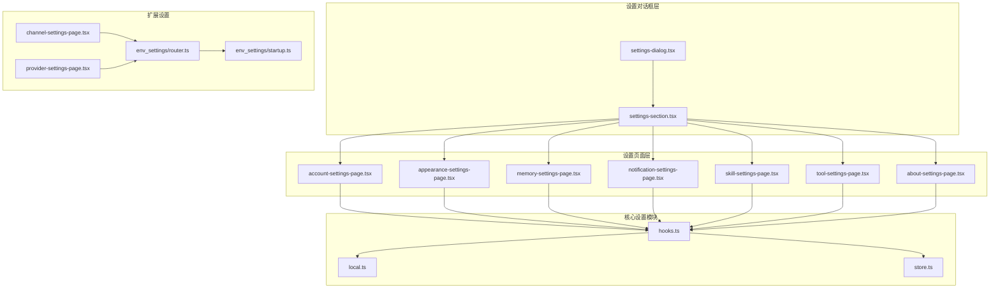
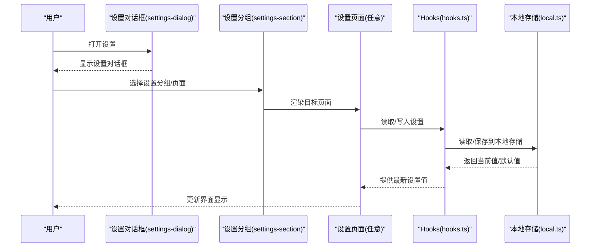
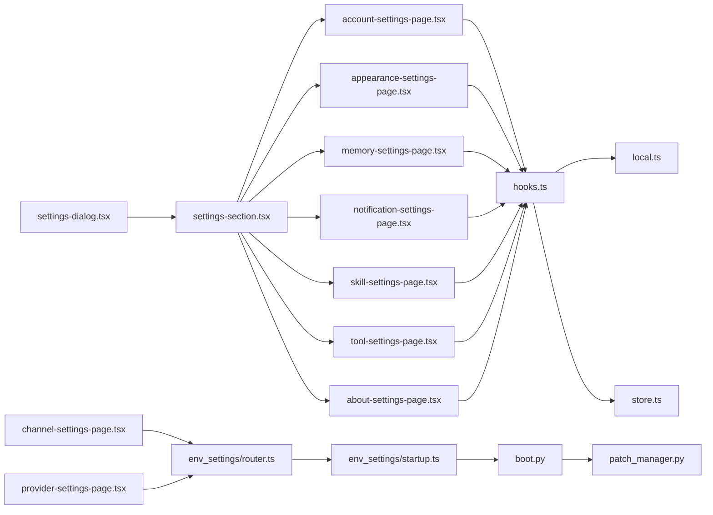

# 设置系统

<cite>
**本文引用的文件**
- [settings-dialog.tsx](file://frontend/src/components/workspace/settings/settings-dialog.tsx)
- [settings-section.tsx](file://frontend/src/components/workspace/settings/settings-section.tsx)
- [account-settings-page.tsx](file://frontend/src/components/workspace/settings/account-settings-page.tsx)
- [appearance-settings-page.tsx](file://frontend/src/components/workspace/settings/appearance-settings-page.tsx)
- [memory-settings-page.tsx](file://frontend/src/components/workspace/settings/memory-settings-page.tsx)
- [notification-settings-page.tsx](file://frontend/src/components/workspace/settings/notification-settings-page.tsx)
- [skill-settings-page.tsx](file://frontend/src/components/workspace/settings/skill-settings-page.tsx)
- [tool-settings-page.tsx](file://frontend/src/components/workspace/settings/tool-settings-page.tsx)
- [about-settings-page.tsx](file://frontend/src/components/workspace/settings/about-settings-page.tsx)
- [index.ts](file://frontend/src/components/workspace/settings/index.ts)
- [hooks.ts](file://frontend/src/core/settings/hooks.ts)
- [local.ts](file://frontend/src/core/settings/local.ts)
- [store.ts](file://frontend/src/core/settings/store.ts)
- [env-settings-page.tsx](file://frontend/extensions/env-settings/channel-settings-page.tsx)
- [provider-settings-page.tsx](file://frontend/extensions/env-settings/provider-settings-page.tsx)
- [router.ts](file://deerflow_extensions/env_settings/router.ts)
- [startup.ts](file://deerflow_extensions/env_settings/startup.ts)
- [boot.py](file://deerflow_extensions/boot.py)
- [patch_manager.py](file://deerflow_extensions/patch_manager.py)
- [extensions_config.example.json](file://extensions_config.example.json)
</cite>

## 目录
1. [简介](#简介)
2. [项目结构](#项目结构)
3. [核心组件](#核心组件)
4. [架构总览](#架构总览)
5. [详细组件分析](#详细组件分析)
6. [依赖关系分析](#依赖关系分析)
7. [性能考虑](#性能考虑)
8. [故障排除指南](#故障排除指南)
9. [结论](#结论)
10. [附录](#附录)

## 简介
本文件为 DeerFlow 设置系统的详细技术文档，覆盖设置对话框设计、设置分组管理、页面路由机制，以及账户设置、外观设置、内存设置、通知设置、技能设置、工具设置、关于页面等具体页面的实现方式。同时阐述设置数据的本地持久化、默认值管理与设置验证机制，并讨论响应式设计、主题切换与国际化支持的实现方案。最后给出设置扩展点、自定义设置项与设置导入导出的实现建议。

## 项目结构
前端设置系统主要由以下部分组成：
- 设置对话框与分组：负责承载设置页面、组织导航与布局。
- 具体设置页面：账户、外观、内存、通知、技能、工具、关于等。
- 核心设置模块：提供本地存储、状态管理与钩子函数。
- 扩展设置：环境变量与 Provider 的设置页面及路由。
- 路由与启动：扩展加载、路由注册与运行时初始化。

图表来源
- [settings-dialog.tsx](file://frontend/src/components/workspace/settings/settings-dialog.tsx)
- [settings-section.tsx](file://frontend/src/components/workspace/settings/settings-section.tsx)
- [account-settings-page.tsx](file://frontend/src/components/workspace/settings/account-settings-page.tsx)
- [appearance-settings-page.tsx](file://frontend/src/components/workspace/settings/appearance-settings-page.tsx)
- [memory-settings-page.tsx](file://frontend/src/components/workspace/settings/memory-settings-page.tsx)
- [notification-settings-page.tsx](file://frontend/src/components/workspace/settings/notification-settings-page.tsx)
- [skill-settings-page.tsx](file://frontend/src/components/workspace/settings/skill-settings-page.tsx)
- [tool-settings-page.tsx](file://frontend/src/components/workspace/settings/tool-settings-page.tsx)
- [about-settings-page.tsx](file://frontend/src/components/workspace/settings/about-settings-page.tsx)
- [hooks.ts](file://frontend/src/core/settings/hooks.ts)
- [local.ts](file://frontend/src/core/settings/local.ts)
- [store.ts](file://frontend/src/core/settings/store.ts)
- [env-settings-page.tsx](file://frontend/extensions/env-settings/channel-settings-page.tsx)
- [provider-settings-page.tsx](file://frontend/extensions/env-settings/provider-settings-page.tsx)
- [router.ts](file://deerflow_extensions/env_settings/router.ts)
- [startup.ts](file://deerflow_extensions/env_settings/startup.ts)

章节来源
- [settings-dialog.tsx](file://frontend/src/components/workspace/settings/settings-dialog.tsx)
- [settings-section.tsx](file://frontend/src/components/workspace/settings/settings-section.tsx)
- [index.ts](file://frontend/src/components/workspace/settings/index.ts)

## 核心组件
- 设置对话框（settings-dialog.tsx）：作为设置入口容器，负责打开/关闭、尺寸控制、键盘交互与遮罩层管理。
- 设置分组（settings-section.tsx）：用于组织设置页面的导航与内容区域，支持分组标题与图标展示。
- 核心设置模块：
  - hooks.ts：封装设置相关的 React Hooks，如 useSettingsStore、useSettingValue 等，统一访问与更新设置。
  - local.ts：提供本地存储接口，负责设置的序列化/反序列化与默认值合并。
  - store.ts：定义设置状态结构、初始状态与 reducer，管理全局设置状态树。

章节来源
- [hooks.ts](file://frontend/src/core/settings/hooks.ts)
- [local.ts](file://frontend/src/core/settings/local.ts)
- [store.ts](file://frontend/src/core/settings/store.ts)

## 架构总览
设置系统采用“对话框 + 分组 + 页面”的三层结构：
- 对话框层：承载设置 UI，提供统一的打开/关闭与键盘快捷键支持。
- 分组层：以侧边导航或标签页形式组织设置页面，支持当前选中项高亮与路由联动。
- 页面层：每个设置页面独立实现，共享核心设置模块提供的状态与存储能力。

图表来源
- [settings-dialog.tsx](file://frontend/src/components/workspace/settings/settings-dialog.tsx)
- [settings-section.tsx](file://frontend/src/components/workspace/settings/settings-section.tsx)
- [hooks.ts](file://frontend/src/core/settings/hooks.ts)
- [local.ts](file://frontend/src/core/settings/local.ts)

## 详细组件分析

### 设置对话框与分组
- 设置对话框（settings-dialog.tsx）
  - 功能：控制设置窗口的显示/隐藏、尺寸调整、键盘事件（Esc 关闭）、点击遮罩关闭。
  - 交互：通过全局状态或 props 控制可见性；支持多语言提示与无障碍属性。
- 设置分组（settings-section.tsx）
  - 功能：渲染设置导航列表，支持当前激活项高亮、图标与标题展示；与路由联动实现页面跳转。

章节来源
- [settings-dialog.tsx](file://frontend/src/components/workspace/settings/settings-dialog.tsx)
- [settings-section.tsx](file://frontend/src/components/workspace/settings/settings-section.tsx)

### 账户设置页面（account-settings-page.tsx）
- 功能：允许用户修改账户信息（如用户名、邮箱等），进行密码修改与安全设置。
- 数据流：从 hooks.ts 读取当前账户信息，提交后调用本地存储与后端 API（若存在）。
- 验证：表单字段校验（必填、格式、长度等），错误提示与防重复提交。
- 国际化：文案按语言切换，错误消息与按钮文本支持多语言。

章节来源
- [account-settings-page.tsx](file://frontend/src/components/workspace/settings/account-settings-page.tsx)
- [hooks.ts](file://frontend/src/core/settings/hooks.ts)

### 外观设置页面（appearance-settings-page.tsx）
- 功能：主题切换（明/暗/自动）、字体大小、行高、代码块样式等。
- 实现：通过 hooks.ts 写入主题偏好，local.ts 持久化；实时生效并通过全局样式注入或 CSS 变量驱动。
- 响应式：在小屏设备上适配紧凑布局与折叠菜单。

章节来源
- [appearance-settings-page.tsx](file://frontend/src/components/workspace/settings/appearance-settings-page.tsx)
- [hooks.ts](file://frontend/src/core/settings/hooks.ts)
- [local.ts](file://frontend/src/core/settings/local.ts)

### 内存设置页面（memory-settings-page.tsx）
- 功能：配置运行时内存参数（如最大历史条数、缓存策略、过期时间等）。
- 数据流：读取当前内存配置 → 用户编辑 → 校验数值范围 → 写回本地存储。
- 验证：数值合法性检查、上下界限制、与系统资源的兼容性提示。
- 导入/导出：支持 JSON 格式的配置导入与导出，便于迁移与备份。

章节来源
- [memory-settings-page.tsx](file://frontend/src/components/workspace/settings/memory-settings-page.tsx)
- [hooks.ts](file://frontend/src/core/settings/hooks.ts)
- [local.ts](file://frontend/src/core/settings/local.ts)

### 通知设置页面（notification-settings-page.tsx）
- 功能：控制通知类型（消息到达、任务完成、系统提醒等）与推送渠道。
- 实现：基于 hooks.ts 维护通知开关与偏好；local.ts 持久化；可结合浏览器通知 API 或服务端推送。
- 权限处理：首次启用时请求权限，失败时引导用户手动开启。

章节来源
- [notification-settings-page.tsx](file://frontend/src/components/workspace/settings/notification-settings-page.tsx)
- [hooks.ts](file://frontend/src/core/settings/hooks.ts)
- [local.ts](file://frontend/src/core/settings/local.ts)

### 技能设置页面（skill-settings-page.tsx）
- 功能：管理内置与自定义技能的启用/禁用、排序与参数配置。
- 数据流：读取技能清单 → 用户操作 → 更新本地存储 → 触发重载或重启相关服务。
- 验证：参数类型与范围校验，错误提示与回滚机制。

章节来源
- [skill-settings-page.tsx](file://frontend/src/components/workspace/settings/skill-settings-page.tsx)
- [hooks.ts](file://frontend/src/core/settings/hooks.ts)
- [local.ts](file://frontend/src/core/settings/local.ts)

### 工具设置页面（tool-settings-page.tsx）
- 功能：配置外部工具（如搜索引擎、图像生成、文件上传等）的参数与凭据。
- 安全：敏感字段（如密钥）不直接显示，支持遮罩与一次性复制；保存前进行必要校验。
- 集成：与后端网关或 MCP 服务器交互，确保工具可用性与连通性测试。

章节来源
- [tool-settings-page.tsx](file://frontend/src/components/workspace/settings/tool-settings-page.tsx)
- [hooks.ts](file://frontend/src/core/settings/hooks.ts)
- [local.ts](file://frontend/src/core/settings/local.ts)

### 关于页面（about-settings-page.tsx）
- 功能：展示版本信息、许可证、致谢与帮助链接。
- 国际化：版本号与文案按语言切换；支持复制版本信息与导出诊断信息。

章节来源
- [about-settings-page.tsx](file://frontend/src/components/workspace/settings/about-settings-page.tsx)

### 扩展设置：环境变量与 Provider
- 环境变量设置页面（channel-settings-page.tsx）
  - 功能：配置通道（Channel）相关的环境变量与运行参数。
  - 路由：通过 env_settings/router.ts 注册路由，支持按需加载。
- Provider 设置页面（provider-settings-page.tsx）
  - 功能：配置第三方 Provider 的连接参数与认证信息。
  - 启动：env_settings/startup.ts 在应用启动时初始化扩展路由与依赖。
- 扩展加载：boot.py 与 patch_manager.py 负责扩展的发现、加载与生命周期管理。

章节来源
- [env-settings-page.tsx](file://frontend/extensions/env-settings/channel-settings-page.tsx)
- [provider-settings-page.tsx](file://frontend/extensions/env-settings/provider-settings-page.tsx)
- [router.ts](file://deerflow_extensions/env_settings/router.ts)
- [startup.ts](file://deerflow_extensions/env_settings/startup.ts)
- [boot.py](file://deerflow_extensions/boot.py)
- [patch_manager.py](file://deerflow_extensions/patch_manager.py)

## 依赖关系分析
设置系统的核心依赖关系如下：
- 设置对话框与分组依赖于各设置页面组件。
- 各设置页面依赖 hooks.ts 提供的状态访问与更新能力。
- hooks.ts 依赖 local.ts 进行本地持久化，依赖 store.ts 管理状态树。
- 扩展设置页面依赖 env_settings/router.ts 与 env_settings/startup.ts 进行路由注册与启动初始化。
- 扩展加载由 boot.py 与 patch_manager.py 管理。

图表来源
- [settings-dialog.tsx](file://frontend/src/components/workspace/settings/settings-dialog.tsx)
- [settings-section.tsx](file://frontend/src/components/workspace/settings/settings-section.tsx)
- [account-settings-page.tsx](file://frontend/src/components/workspace/settings/account-settings-page.tsx)
- [appearance-settings-page.tsx](file://frontend/src/components/workspace/settings/appearance-settings-page.tsx)
- [memory-settings-page.tsx](file://frontend/src/components/workspace/settings/memory-settings-page.tsx)
- [notification-settings-page.tsx](file://frontend/src/components/workspace/settings/notification-settings-page.tsx)
- [skill-settings-page.tsx](file://frontend/src/components/workspace/settings/skill-settings-page.tsx)
- [tool-settings-page.tsx](file://frontend/src/components/workspace/settings/tool-settings-page.tsx)
- [about-settings-page.tsx](file://frontend/src/components/workspace/settings/about-settings-page.tsx)
- [hooks.ts](file://frontend/src/core/settings/hooks.ts)
- [local.ts](file://frontend/src/core/settings/local.ts)
- [store.ts](file://frontend/src/core/settings/store.ts)
- [env-settings-page.tsx](file://frontend/extensions/env-settings/channel-settings-page.tsx)
- [provider-settings-page.tsx](file://frontend/extensions/env-settings/provider-settings-page.tsx)
- [router.ts](file://deerflow_extensions/env_settings/router.ts)
- [startup.ts](file://deerflow_extensions/env_settings/startup.ts)
- [boot.py](file://deerflow_extensions/boot.py)
- [patch_manager.py](file://deerflow_extensions/patch_manager.py)

章节来源
- [index.ts](file://frontend/src/components/workspace/settings/index.ts)

## 性能考虑
- 状态粒度：将设置拆分为细粒度状态，避免不必要的重渲染；仅在相关设置变更时触发页面更新。
- 本地存储优化：对大对象进行分段存储或延迟写入，减少主线程阻塞。
- 路由懒加载：扩展设置页面按需加载，降低首屏负载。
- 主题切换：使用 CSS 变量与浅色/深色类名切换，避免频繁重排。
- 缓存策略：对远程配置与工具连通性进行短期缓存，提升用户体验。

## 故障排除指南
- 设置无法保存
  - 检查 local.ts 的序列化/反序列化是否异常；确认浏览器存储权限与容量。
  - 查看 hooks.ts 中的写入逻辑与错误回调。
- 设置未生效
  - 确认 store.ts 的状态更新流程；检查主题切换是否正确应用到全局样式。
- 扩展设置不可见
  - 检查 env_settings/router.ts 是否正确注册；确认 env_settings/startup.ts 是否在启动阶段执行。
  - 核对 boot.py 与 patch_manager.py 的扩展加载日志。
- 表单校验失败
  - 检查各设置页面的输入校验规则与错误提示文案；确保与国际化资源一致。

章节来源
- [local.ts](file://frontend/src/core/settings/local.ts)
- [hooks.ts](file://frontend/src/core/settings/hooks.ts)
- [store.ts](file://frontend/src/core/settings/store.ts)
- [router.ts](file://deerflow_extensions/env_settings/router.ts)
- [startup.ts](file://deerflow_extensions/env_settings/startup.ts)
- [boot.py](file://deerflow_extensions/boot.py)
- [patch_manager.py](file://deerflow_extensions/patch_manager.py)

## 结论
DeerFlow 的设置系统以清晰的分层架构实现了对话框、分组与页面的解耦，配合统一的 hooks.ts 与 local.ts/ store.ts，提供了良好的可维护性与扩展性。通过路由懒加载与扩展机制，系统能够灵活地集成更多设置项与第三方能力。未来可在设置导入导出、批量配置与更细粒度的权限控制方面进一步增强。

## 附录

### 设置数据持久化与默认值管理
- 默认值：在 store.ts 中定义初始状态，local.ts 在读取失败时回退到默认值。
- 持久化：通过 local.ts 将设置序列化到本地存储；写入时进行类型与范围校验。
- 版本兼容：新增字段时保留向后兼容策略，避免破坏旧配置。

章节来源
- [store.ts](file://frontend/src/core/settings/store.ts)
- [local.ts](file://frontend/src/core/settings/local.ts)

### 设置验证机制
- 字段级校验：必填、格式、长度、数值范围等。
- 业务规则：如内存设置的上下界、工具参数的有效性。
- 错误反馈：即时提示与焦点定位，支持批量错误汇总。

章节来源
- [account-settings-page.tsx](file://frontend/src/components/workspace/settings/account-settings-page.tsx)
- [memory-settings-page.tsx](file://frontend/src/components/workspace/settings/memory-settings-page.tsx)
- [tool-settings-page.tsx](file://frontend/src/components/workspace/settings/tool-settings-page.tsx)

### 响应式设计与主题切换
- 响应式：在小屏设备上采用折叠导航与紧凑布局。
- 主题：支持明/暗/自动模式，CSS 变量与类名切换相结合，保证切换流畅。

章节来源
- [appearance-settings-page.tsx](file://frontend/src/components/workspace/settings/appearance-settings-page.tsx)

### 国际化支持
- 文案：所有设置页面的文案均支持多语言切换。
- 时间/数字格式：根据语言环境自动格式化日期与数值。

章节来源
- [account-settings-page.tsx](file://frontend/src/components/workspace/settings/account-settings-page.tsx)
- [about-settings-page.tsx](file://frontend/src/components/workspace/settings/about-settings-page.tsx)

### 设置扩展点与自定义设置项
- 扩展注册：通过 env_settings/router.ts 注册新设置页面路由。
- 启动初始化：env_settings/startup.ts 在应用启动时加载扩展。
- 配置示例：extensions_config.example.json 提供扩展配置模板。

章节来源
- [router.ts](file://deerflow_extensions/env_settings/router.ts)
- [startup.ts](file://deerflow_extensions/env_settings/startup.ts)
- [extensions_config.example.json](file://extensions_config.example.json)

### 设置导入导出实现方案
- 导出：将当前设置序列化为 JSON 文件，包含版本信息与元数据。
- 导入：解析 JSON 并与默认值合并，进行字段校验与兼容性检查；失败时提供回滚与错误提示。
- 安全：敏感字段（如密钥）在导入时要求二次确认或加密存储。

章节来源
- [memory-settings-page.tsx](file://frontend/src/components/workspace/settings/memory-settings-page.tsx)
- [tool-settings-page.tsx](file://frontend/src/components/workspace/settings/tool-settings-page.tsx)