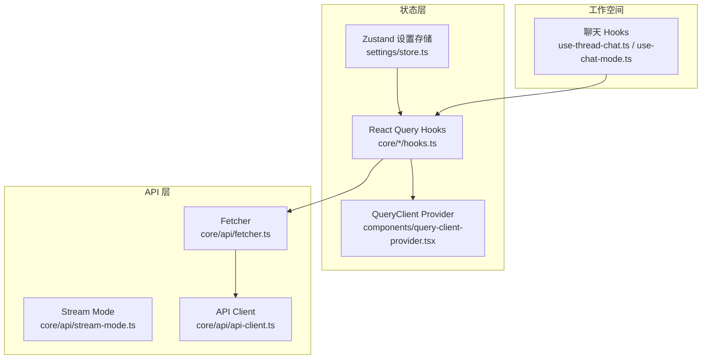
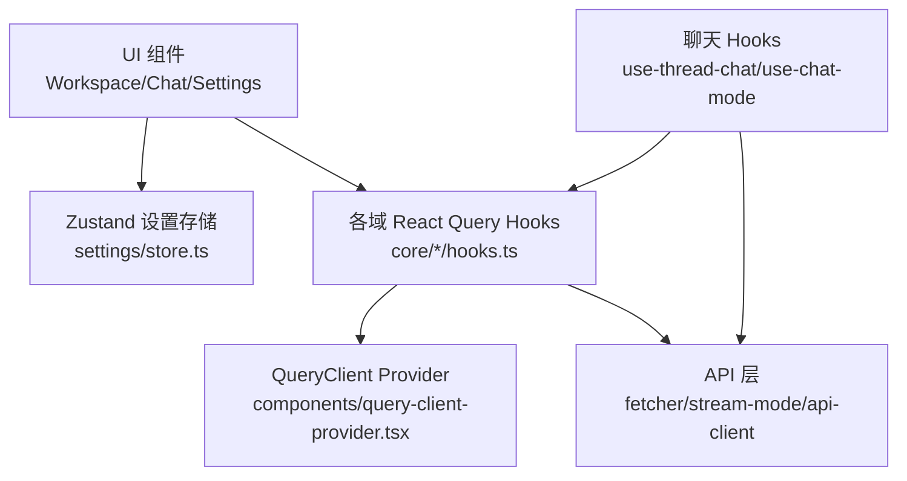
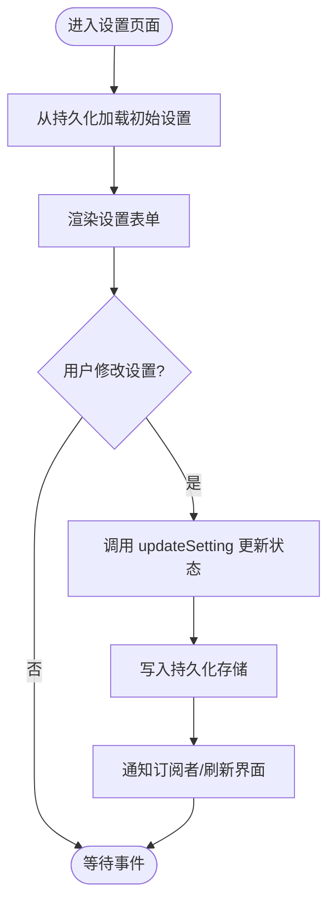
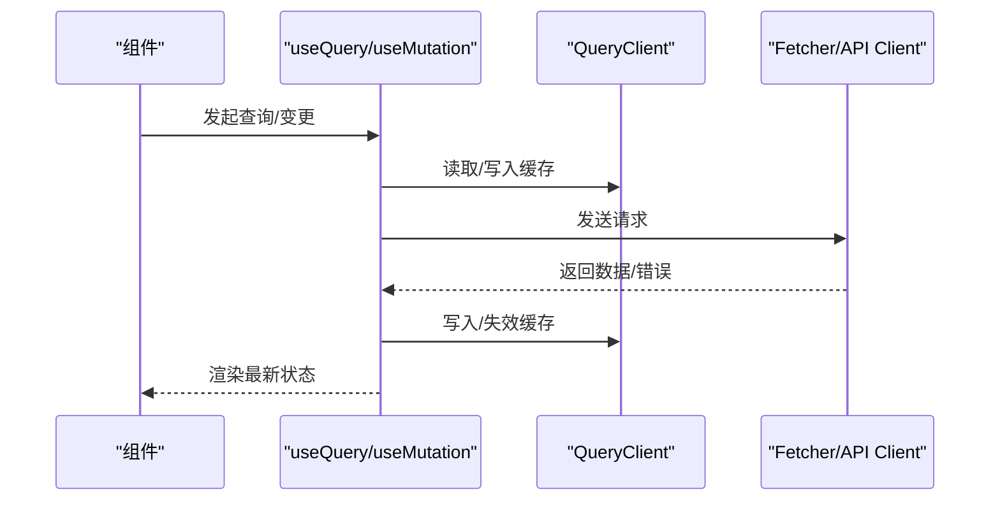
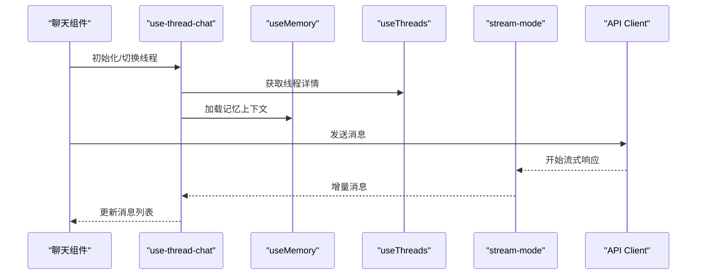
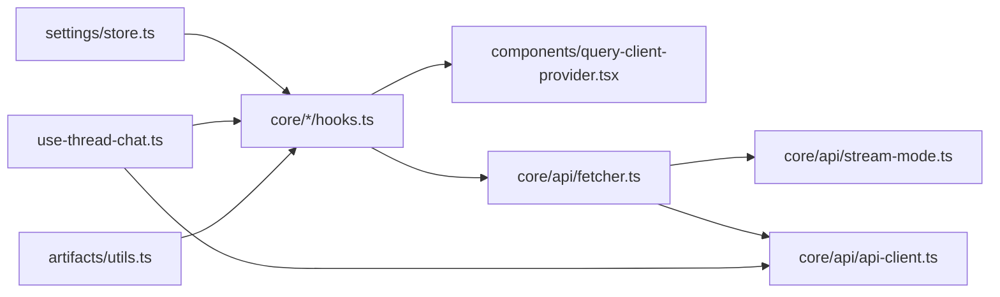

# 状态管理

<cite>
**本文引用的文件**
- [frontend/src/core/settings/store.ts](file://frontend/src/core/settings/store.ts)
- [frontend/src/core/settings/hooks.ts](file://frontend/src/core/settings/hooks.ts)
- [frontend/src/core/threads/hooks.ts](file://frontend/src/core/threads/hooks.ts)
- [frontend/src/core/memory/hooks.ts](file://frontend/src/core/memory/hooks.ts)
- [frontend/src/core/agents/hooks.ts](file://frontend/src/core/agents/hooks.ts)
- [frontend/src/core/models/hooks.ts](file://frontend/src/core/models/hooks.ts)
- [frontend/src/core/artifacts/hooks.ts](file://frontend/src/core/artifacts/hooks.ts)
- [frontend/src/core/skills/hooks.ts](file://frontend/src/core/skills/hooks.ts)
- [frontend/src/core/mcp/hooks.ts](file://frontend/src/core/mcp/hooks.ts)
- [frontend/src/core/uploads/hooks.ts](file://frontend/src/core/uploads/hooks.ts)
- [frontend/src/components/query-client-provider.tsx](file://frontend/src/components/query-client-provider.tsx)
- [frontend/src/core/api/fetcher.ts](file://frontend/src/core/api/fetcher.ts)
- [frontend/src/core/api/stream-mode.ts](file://frontend/src/core/api/stream-mode.ts)
- [frontend/src/core/api/api-client.ts](file://frontend/src/core/api/api-client.ts)
- [frontend/src/core/auth/AuthProvider.tsx](file://frontend/src/core/auth/AuthProvider.tsx)
- [frontend/src/core/i18n/hooks.ts](file://frontend/src/core/i18n/hooks.ts)
- [frontend/src/core/notification/hooks.ts](file://frontend/src/core/notification/hooks.ts)
- [frontend/src/components/workspace/chats/use-thread-chat.ts](file://frontend/src/components/workspace/chats/use-thread-chat.ts)
- [frontend/src/components/workspace/chats/use-chat-mode.ts](file://frontend/src/components/workspace/chats/use-chat-mode.ts)
- [frontend/src/core/threads/types.ts](file://frontend/src/core/threads/types.ts)
- [frontend/src/core/memory/types.ts](file://frontend/src/core/memory/types.ts)
- [frontend/src/core/agents/types.ts](file://frontend/src/core/agents/types.ts)
- [frontend/src/core/models/types.ts](file://frontend/src/core/models/types.ts)
- [frontend/src/core/artifacts/utils.ts](file://frontend/src/core/artifacts/utils.ts)
- [frontend/src/core/tasks/context.tsx](file://frontend/src/core/tasks/context.tsx)
- [frontend/src/core/tasks/types.ts](file://frontend/src/core/tasks/types.ts)
- [frontend/src/core/messages/usage.ts](file://frontend/src/core/messages/usage.ts)
- [frontend/src/core/messages/usage-model.ts](file://frontend/src/core/messages/usage-model.ts)
- [frontend/src/core/todos/types.ts](file://frontend/src/core/todos/types.ts)
- [frontend/src/core/settings/local.ts](file://frontend/src/core/settings/local.ts)
- [frontend/src/core/settings/index.ts](file://frontend/src/core/settings/index.ts)
- [frontend/src/core/threads/index.ts](file://frontend/src/core/threads/index.ts)
- [frontend/src/core/memory/index.ts](file://frontend/src/core/memory/index.ts)
- [frontend/src/core/agents/index.ts](file://frontend/src/core/agents/index.ts)
- [frontend/src/core/models/index.ts](file://frontend/src/core/models/index.ts)
- [frontend/src/core/artifacts/index.ts](file://frontend/src/core/artifacts/index.ts)
- [frontend/src/core/skills/index.ts](file://frontend/src/core/skills/index.ts)
- [frontend/src/core/mcp/index.ts](file://frontend/src/core/mcp/index.ts)
- [frontend/src/core/uploads/index.ts](file://frontend/src/core/uploads/index.ts)
</cite>

## 目录
1. 引言
2. 项目结构
3. 核心组件
4. 架构总览
5. 组件详细分析
6. 依赖关系分析
7. 性能考量
8. 故障排查指南
9. 结论
10. 附录

## 引言
本文件系统性梳理 DeerFlow 前端的状态管理方案，重点覆盖以下方面：
- Zustand 全局状态：全局状态设计、状态订阅机制、副作用处理与持久化
- React Query 数据获取与缓存：查询配置、缓存失效策略、乐观更新
- 工作空间状态、聊天状态、用户状态、设置状态的管理架构
- 跨组件通信、异步操作最佳实践、性能优化与调试方法

## 项目结构
前端状态管理主要分布在以下区域：
- 核心域 hooks 层：围绕 threads、memory、agents、models、artifacts、skills、mcp、uploads 等领域提供 React Query hooks
- 设置域：settings/store.ts 提供 Zustand 全局状态，settings/hooks.ts 暴露读写接口
- 查询客户端：components/query-client-provider.tsx 提供 React Query 客户端与 Provider
- API 层：core/api 下统一封装 fetcher、stream-mode、api-client
- 工作空间聊天：components/workspace/chats 下的 use-thread-chat、use-chat-mode 等
- 国际化与通知：i18n、notification hooks
- 类型与上下文：各域 types.ts、tasks/context.tsx、messages usage 等

图表来源
- [frontend/src/core/settings/store.ts](file://frontend/src/core/settings/store.ts)
- [frontend/src/core/settings/hooks.ts](file://frontend/src/core/settings/hooks.ts)
- [frontend/src/components/query-client-provider.tsx](file://frontend/src/components/query-client-provider.tsx)
- [frontend/src/core/api/fetcher.ts](file://frontend/src/core/api/fetcher.ts)
- [frontend/src/core/api/stream-mode.ts](file://frontend/src/core/api/stream-mode.ts)
- [frontend/src/core/api/api-client.ts](file://frontend/src/core/api/api-client.ts)
- [frontend/src/components/workspace/chats/use-thread-chat.ts](file://frontend/src/components/workspace/chats/use-thread-chat.ts)
- [frontend/src/components/workspace/chats/use-chat-mode.ts](file://frontend/src/components/workspace/chats/use-chat-mode.ts)

章节来源
- [frontend/src/core/settings/store.ts](file://frontend/src/core/settings/store.ts)
- [frontend/src/core/settings/hooks.ts](file://frontend/src/core/settings/hooks.ts)
- [frontend/src/components/query-client-provider.tsx](file://frontend/src/components/query-client-provider.tsx)
- [frontend/src/core/api/fetcher.ts](file://frontend/src/core/api/fetcher.ts)
- [frontend/src/core/api/stream-mode.ts](file://frontend/src/core/api/stream-mode.ts)
- [frontend/src/core/api/api-client.ts](file://frontend/src/core/api/api-client.ts)
- [frontend/src/components/workspace/chats/use-thread-chat.ts](file://frontend/src/components/workspace/chats/use-thread-chat.ts)
- [frontend/src/components/workspace/chats/use-chat-mode.ts](file://frontend/src/components/workspace/chats/use-chat-mode.ts)

## 核心组件
- Zustand 设置存储（settings/store.ts）
  - 设计要点：集中式设置状态（如主题、语言、通知偏好等），支持持久化到本地存储
  - 订阅机制：通过 hooks.ts 暴露读写函数，组件可按需订阅片段
  - 副作用：在变更时触发持久化写入与跨组件同步
- React Query 查询客户端（components/query-client-provider.tsx）
  - 设计要点：统一配置默认查询选项、重试策略、缓存时间、网络模式
  - 订阅机制：通过 useQuery/useMutation/useQueryClient 在组件中订阅与触发
  - 副作用：自动缓存管理、并发去重、后台刷新、错误传播

章节来源
- [frontend/src/core/settings/store.ts](file://frontend/src/core/settings/store.ts)
- [frontend/src/core/settings/hooks.ts](file://frontend/src/core/settings/hooks.ts)
- [frontend/src/components/query-client-provider.tsx](file://frontend/src/components/query-client-provider.tsx)

## 架构总览
下图展示前端状态管理的整体交互：Zustand 设置存储与 React Query 查询层协同工作，API 层负责数据访问，工作空间聊天与各业务域 hooks 进行状态订阅与副作用处理。

图表来源
- [frontend/src/core/settings/store.ts](file://frontend/src/core/settings/store.ts)
- [frontend/src/core/settings/hooks.ts](file://frontend/src/core/settings/hooks.ts)
- [frontend/src/components/query-client-provider.tsx](file://frontend/src/components/query-client-provider.tsx)
- [frontend/src/core/api/fetcher.ts](file://frontend/src/core/api/fetcher.ts)
- [frontend/src/core/api/stream-mode.ts](file://frontend/src/core/api/stream-mode.ts)
- [frontend/src/core/api/api-client.ts](file://frontend/src/core/api/api-client.ts)
- [frontend/src/components/workspace/chats/use-thread-chat.ts](file://frontend/src/components/workspace/chats/use-thread-chat.ts)
- [frontend/src/components/workspace/chats/use-chat-mode.ts](file://frontend/src/components/workspace/chats/use-chat-mode.ts)

## 组件详细分析

### Zustand 设置存储（settings/store.ts）
- 全局状态设计
  - 状态切片：语言、主题、通知开关、记忆偏好等
  - 默认值与校验：确保初始值合法，避免运行期异常
  - 持久化策略：写入 localStorage 或 sessionStorage，重启后恢复
- 订阅机制
  - hooks.ts 暴露 useSettings、updateSetting 等方法，组件通过其读取/更新
  - 支持细粒度订阅，仅在相关字段变化时重渲染
- 副作用处理
  - 变更时触发同步写入持久化存储
  - 可选地广播到其他监听者（如主题切换影响全局样式）

图表来源
- [frontend/src/core/settings/store.ts](file://frontend/src/core/settings/store.ts)
- [frontend/src/core/settings/hooks.ts](file://frontend/src/core/settings/hooks.ts)

章节来源
- [frontend/src/core/settings/store.ts](file://frontend/src/core/settings/store.ts)
- [frontend/src/core/settings/hooks.ts](file://frontend/src/core/settings/hooks.ts)

### React Query 数据获取与缓存（core/*/hooks.ts）
- 查询配置
  - 默认查询选项：staleTime、gcTime、retry、refetchOnWindowFocus 等
  - 查询键：基于参数组合生成稳定键，避免重复请求与缓存污染
- 缓存失效策略
  - 主动失效：useQueryClient.invalidateQueries 触发
  - 条件失效：根据 mutation 结果选择性失效相关查询
  - 背景刷新：refetchOnWindowFocus、refetchOnReconnect
- 乐观更新
  - 使用 useMutation 的 optimisticData 与 rollbackOnError
  - 先本地更新视图，失败时回滚，成功时再对齐服务端

图表来源
- [frontend/src/components/query-client-provider.tsx](file://frontend/src/components/query-client-provider.tsx)
- [frontend/src/core/api/fetcher.ts](file://frontend/src/core/api/fetcher.ts)
- [frontend/src/core/api/api-client.ts](file://frontend/src/core/api/api-client.ts)

章节来源
- [frontend/src/components/query-client-provider.tsx](file://frontend/src/components/query-client-provider.tsx)
- [frontend/src/core/api/fetcher.ts](file://frontend/src/core/api/fetcher.ts)
- [frontend/src/core/api/api-client.ts](file://frontend/src/core/api/api-client.ts)

### 工作空间聊天状态（use-thread-chat、use-chat-mode）
- 状态职责
  - 当前线程消息列表、输入框内容、发送状态、流式输出进度
  - 聊天模式（普通/计划/工具）与上下文切换
- 订阅与副作用
  - 订阅 threads 与 memory 的查询结果，保持 UI 与数据一致
  - 流式响应通过 stream-mode 推送增量内容，实时更新消息列表
  - 错误时回退到非流式或提示用户重试

图表来源
- [frontend/src/components/workspace/chats/use-thread-chat.ts](file://frontend/src/components/workspace/chats/use-thread-chat.ts)
- [frontend/src/components/workspace/chats/use-chat-mode.ts](file://frontend/src/components/workspace/chats/use-chat-mode.ts)
- [frontend/src/core/threads/hooks.ts](file://frontend/src/core/threads/hooks.ts)
- [frontend/src/core/memory/hooks.ts](file://frontend/src/core/memory/hooks.ts)
- [frontend/src/core/api/stream-mode.ts](file://frontend/src/core/api/stream-mode.ts)
- [frontend/src/core/api/api-client.ts](file://frontend/src/core/api/api-client.ts)

章节来源
- [frontend/src/components/workspace/chats/use-thread-chat.ts](file://frontend/src/components/workspace/chats/use-thread-chat.ts)
- [frontend/src/components/workspace/chats/use-chat-mode.ts](file://frontend/src/components/workspace/chats/use-chat-mode.ts)
- [frontend/src/core/threads/hooks.ts](file://frontend/src/core/threads/hooks.ts)
- [frontend/src/core/memory/hooks.ts](file://frontend/src/core/memory/hooks.ts)
- [frontend/src/core/api/stream-mode.ts](file://frontend/src/core/api/stream-mode.ts)
- [frontend/src/core/api/api-client.ts](file://frontend/src/core/api/api-client.ts)

### 用户状态与认证（AuthProvider）
- 状态职责：登录态、用户信息、权限令牌
- 订阅机制：Provider 包裹应用，子树通过 hooks 访问
- 副作用：登录/登出时更新本地状态并同步到后端；鉴权失败时跳转登录页

章节来源
- [frontend/src/core/auth/AuthProvider.tsx](file://frontend/src/core/auth/AuthProvider.tsx)

### 国际化与通知（i18n、notification hooks）
- 国际化：locale 切换、翻译加载、Cookie 同步
- 通知：全局通知队列、类型化消息、自动消失与手动关闭

章节来源
- [frontend/src/core/i18n/hooks.ts](file://frontend/src/core/i18n/hooks.ts)
- [frontend/src/core/notification/hooks.ts](file://frontend/src/core/notification/hooks.ts)

### 各域状态（threads、memory、agents、models、artifacts、skills、mcp、uploads）
- threads：线程列表、消息分组、导出、Token 使用统计
- memory：记忆上下文、检索与注入
- agents/models：可用代理与模型列表、默认选择
- artifacts：产物预览、下载、类型识别
- skills/mcp：技能注册、工具调用、MCP 会话
- uploads：文件上传、验证、提示词关联

章节来源
- [frontend/src/core/threads/hooks.ts](file://frontend/src/core/threads/hooks.ts)
- [frontend/src/core/memory/hooks.ts](file://frontend/src/core/memory/hooks.ts)
- [frontend/src/core/agents/hooks.ts](file://frontend/src/core/agents/hooks.ts)
- [frontend/src/core/models/hooks.ts](file://frontend/src/core/models/hooks.ts)
- [frontend/src/core/artifacts/hooks.ts](file://frontend/src/core/artifacts/hooks.ts)
- [frontend/src/core/skills/hooks.ts](file://frontend/src/core/skills/hooks.ts)
- [frontend/src/core/mcp/hooks.ts](file://frontend/src/core/mcp/hooks.ts)
- [frontend/src/core/uploads/hooks.ts](file://frontend/src/core/uploads/hooks.ts)

## 依赖关系分析
- Zustand 与 React Query 的协作
  - settings/store.ts 作为“轻量全局状态”，不替代 Query 的缓存能力
  - 各域 hooks 专注数据获取与缓存，设置状态用于 UI 行为控制
- API 层解耦
  - fetcher 封装通用请求逻辑，stream-mode 处理流式响应
  - api-client 提供统一的端点与错误处理
- 工作空间与各域的耦合
  - 聊天组件依赖 threads 与 memory 的查询结果
  - artifacts 依赖 artifacts/utils 的类型与预览逻辑

图表来源
- [frontend/src/core/settings/store.ts](file://frontend/src/core/settings/store.ts)
- [frontend/src/core/settings/hooks.ts](file://frontend/src/core/settings/hooks.ts)
- [frontend/src/components/query-client-provider.tsx](file://frontend/src/components/query-client-provider.tsx)
- [frontend/src/core/api/fetcher.ts](file://frontend/src/core/api/fetcher.ts)
- [frontend/src/core/api/stream-mode.ts](file://frontend/src/core/api/stream-mode.ts)
- [frontend/src/core/api/api-client.ts](file://frontend/src/core/api/api-client.ts)
- [frontend/src/components/workspace/chats/use-thread-chat.ts](file://frontend/src/components/workspace/chats/use-thread-chat.ts)
- [frontend/src/core/artifacts/utils.ts](file://frontend/src/core/artifacts/utils.ts)

章节来源
- [frontend/src/core/settings/store.ts](file://frontend/src/core/settings/store.ts)
- [frontend/src/core/settings/hooks.ts](file://frontend/src/core/settings/hooks.ts)
- [frontend/src/components/query-client-provider.tsx](file://frontend/src/components/query-client-provider.tsx)
- [frontend/src/core/api/fetcher.ts](file://frontend/src/core/api/fetcher.ts)
- [frontend/src/core/api/stream-mode.ts](file://frontend/src/core/api/stream-mode.ts)
- [frontend/src/core/api/api-client.ts](file://frontend/src/core/api/api-client.ts)
- [frontend/src/components/workspace/chats/use-thread-chat.ts](file://frontend/src/components/workspace/chats/use-thread-chat.ts)
- [frontend/src/core/artifacts/utils.ts](file://frontend/src/core/artifacts/utils.ts)

## 性能考量
- 查询缓存
  - 合理设置 staleTime 与 gcTime，减少不必要的请求
  - 使用查询键的稳定组合，避免缓存碎片化
- 并发与去重
  - React Query 自动去重相同查询键的请求
  - 合理使用 refetchOnWindowFocus 与 refetchOnReconnect
- 流式渲染
  - 使用 stream-mode 实现增量渲染，降低首屏延迟
- 本地持久化
  - settings/store.ts 将高频 UI 设置持久化，减少初始化开销
- 组件订阅粒度
  - 使用 hooks.ts 的细粒度订阅，避免无关重渲染

## 故障排查指南
- 查询未生效或缓存异常
  - 检查查询键是否稳定且唯一
  - 确认 QueryClient 配置与 Provider 是否正确包裹
- 流式响应中断
  - 检查 stream-mode 的连接与断线重连逻辑
  - 确认后端流式输出格式与超时设置
- 乐观更新回滚问题
  - 确保 useMutation 的 optimisticData 与 rollbackOnError 正确配置
  - 在 mutation 成功后执行 invalidateQueries 对齐服务端状态
- 设置状态不同步
  - 检查 settings/store.ts 的持久化写入时机与订阅回调
  - 确认 hooks.ts 的读写函数是否被正确调用

章节来源
- [frontend/src/components/query-client-provider.tsx](file://frontend/src/components/query-client-provider.tsx)
- [frontend/src/core/api/stream-mode.ts](file://frontend/src/core/api/stream-mode.ts)
- [frontend/src/core/settings/store.ts](file://frontend/src/core/settings/store.ts)
- [frontend/src/core/settings/hooks.ts](file://frontend/src/core/settings/hooks.ts)

## 结论
DeerFlow 前端采用“Zustand + React Query”的混合状态管理方案：Zustand 负责轻量、高频的 UI 设置与行为状态，React Query 负责复杂的数据获取、缓存与一致性。通过清晰的查询键设计、合理的缓存策略与流式渲染，系统在易用性与性能之间取得平衡。建议在后续迭代中持续完善查询键稳定性、优化流式体验，并加强跨组件通信的可观测性与调试工具。

## 附录
- 最佳实践清单
  - 为每个查询定义稳定且语义化的查询键
  - 使用 useQueryClient 精准失效与刷新
  - 在高频 UI 设置上启用持久化
  - 为长耗时操作提供加载反馈与取消能力
  - 为流式场景提供断线重连与错误兜底
- 相关类型与上下文
  - threads/types.ts、memory/types.ts、agents/types.ts、models/types.ts
  - tasks/context.tsx、tasks/types.ts
  - messages/usage.ts、messages/usage-model.ts
  - todos/types.ts
  - settings/local.ts、settings/index.ts

章节来源
- [frontend/src/core/threads/types.ts](file://frontend/src/core/threads/types.ts)
- [frontend/src/core/memory/types.ts](file://frontend/src/core/memory/types.ts)
- [frontend/src/core/agents/types.ts](file://frontend/src/core/agents/types.ts)
- [frontend/src/core/models/types.ts](file://frontend/src/core/models/types.ts)
- [frontend/src/core/tasks/context.tsx](file://frontend/src/core/tasks/context.tsx)
- [frontend/src/core/tasks/types.ts](file://frontend/src/core/tasks/types.ts)
- [frontend/src/core/messages/usage.ts](file://frontend/src/core/messages/usage.ts)
- [frontend/src/core/messages/usage-model.ts](file://frontend/src/core/messages/usage-model.ts)
- [frontend/src/core/todos/types.ts](file://frontend/src/core/todos/types.ts)
- [frontend/src/core/settings/local.ts](file://frontend/src/core/settings/local.ts)
- [frontend/src/core/settings/index.ts](file://frontend/src/core/settings/index.ts)
- [frontend/src/core/threads/index.ts](file://frontend/src/core/threads/index.ts)
- [frontend/src/core/memory/index.ts](file://frontend/src/core/memory/index.ts)
- [frontend/src/core/agents/index.ts](file://frontend/src/core/agents/index.ts)
- [frontend/src/core/models/index.ts](file://frontend/src/core/models/index.ts)
- [frontend/src/core/artifacts/index.ts](file://frontend/src/core/artifacts/index.ts)
- [frontend/src/core/skills/index.ts](file://frontend/src/core/skills/index.ts)
- [frontend/src/core/mcp/index.ts](file://frontend/src/core/mcp/index.ts)
- [frontend/src/core/uploads/index.ts](file://frontend/src/core/uploads/index.ts)