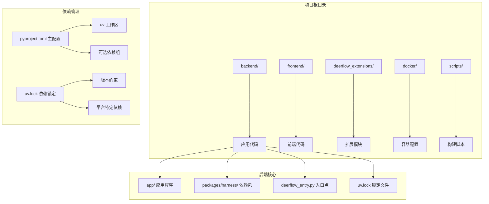
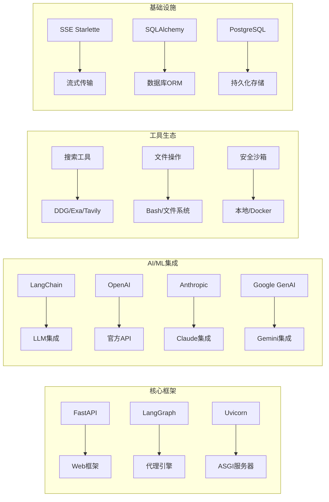
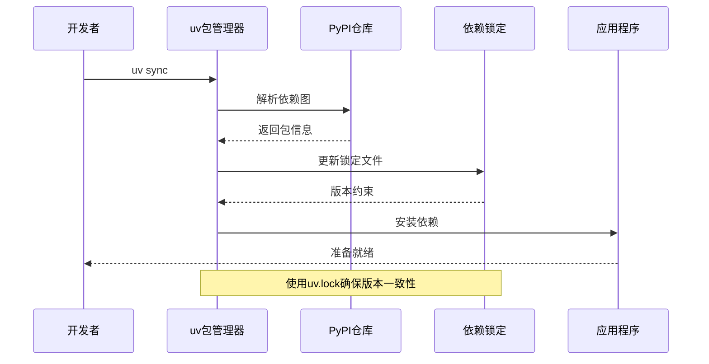
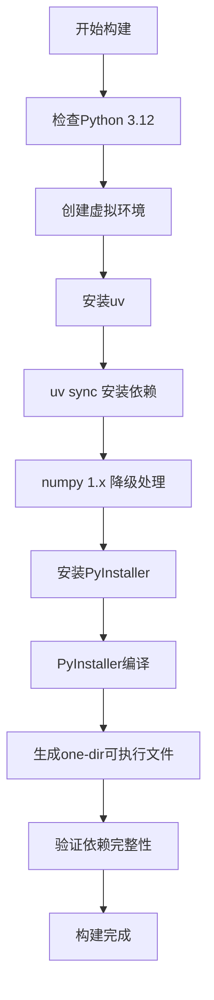
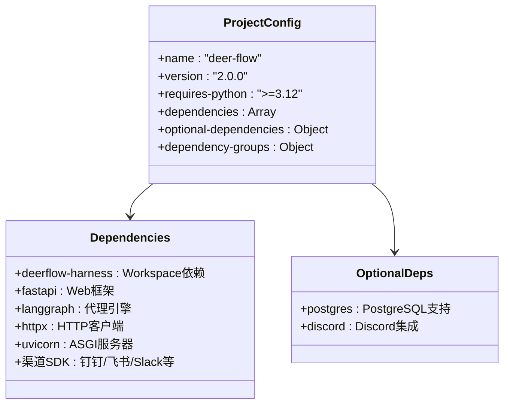
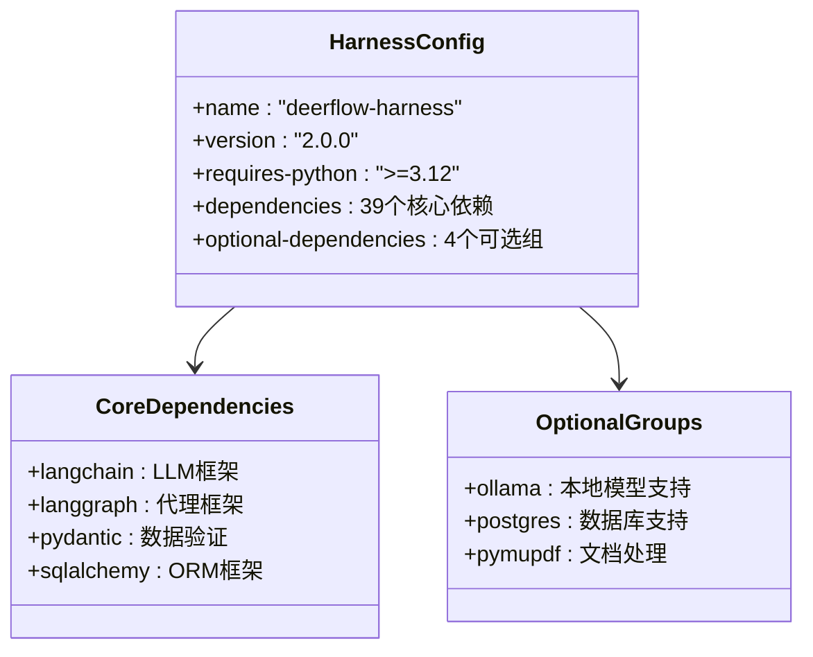
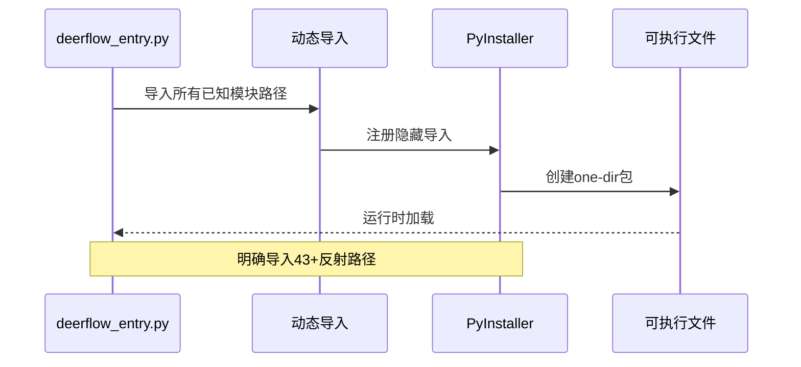
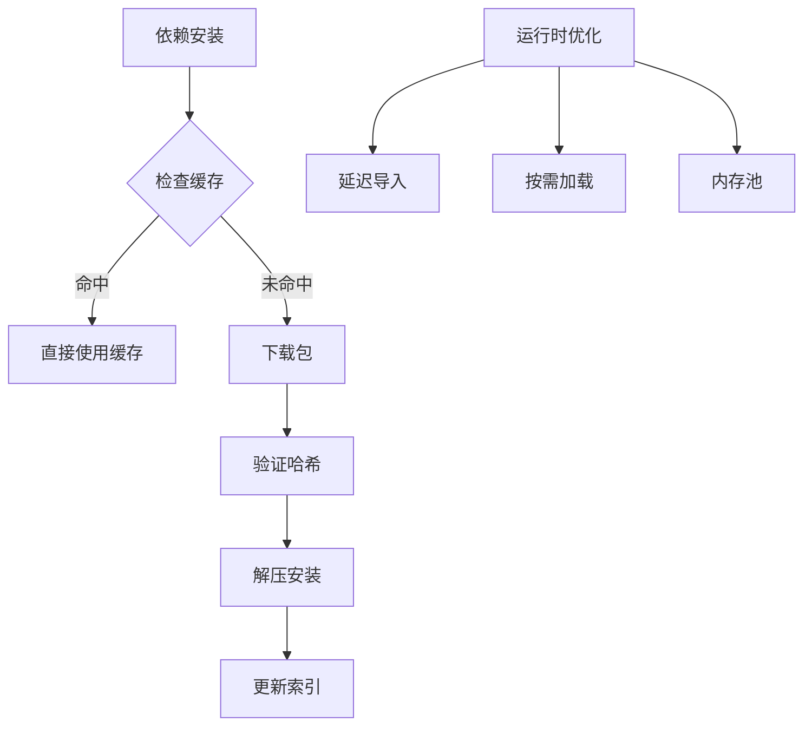
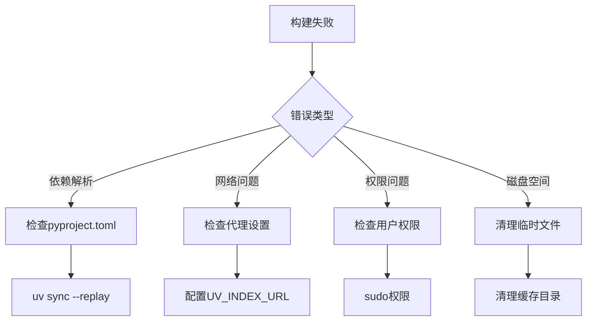

# Python依赖管理

<cite>
**本文档引用的文件**
- [backend/pyproject.toml](file://backend/pyproject.toml)
- [backend/packages/harness/pyproject.toml](file://backend/packages/harness/pyproject.toml)
- [backend/uv.lock](file://backend/uv.lock)
- [backend/Makefile](file://backend/Makefile)
- [backend/scripts/build-backend-on-server.sh](file://backend/scripts/build-backend-on-server.sh)
- [backend/deerflow_entry.py](file://backend/deerflow_entry.py)
- [backend/Dockerfile](file://backend/Dockerfile)
- [docker/docker-compose.yaml](file://docker/docker-compose.yaml)
- [config.example.yaml](file://config.example.yaml)
</cite>

## 目录
1. [简介](#简介)
2. [项目结构](#项目结构)
3. [核心组件](#核心组件)
4. [架构概览](#架构概览)
5. [详细组件分析](#详细组件分析)
6. [依赖关系分析](#依赖关系分析)
7. [性能考虑](#性能考虑)
8. [故障排除指南](#故障排除指南)
9. [结论](#结论)

## 简介

DeerFlow是一个基于LangGraph的AI代理系统，采用现代Python依赖管理策略。该项目使用uv作为包管理器，结合Poetry风格的配置文件和锁定机制，实现了高效的依赖管理和构建流程。

该项目的核心特点包括：
- 使用uv进行快速依赖解析和安装
- 采用工作区(workspace)模式管理多包项目
- 支持多种部署方式（开发、生产、容器化）
- 提供完整的依赖锁定机制确保一致性

## 项目结构

DeerFlow采用分层项目结构，主要包含以下关键部分：



**图表来源**
- [backend/pyproject.toml:1-58](file://backend/pyproject.toml#L1-L58)
- [backend/packages/harness/pyproject.toml:1-57](file://backend/packages/harness/pyproject.toml#L1-L57)

**章节来源**
- [backend/pyproject.toml:1-58](file://backend/pyproject.toml#L1-L58)
- [backend/packages/harness/pyproject.toml:1-57](file://backend/packages/harness/pyproject.toml#L1-L57)

## 核心组件

### 依赖管理工具链

DeerFlow使用现代化的Python依赖管理工具链：

| 组件 | 版本 | 用途 |
|------|------|------|
| Python | >=3.12 | 运行时环境 |
| uv | 最新版 | 包管理器和构建工具 |
| Poetry风格 | 配置格式 | 依赖声明和管理 |
| Lock文件 | uv.lock | 依赖版本锁定 |

### 主要依赖类别



**图表来源**
- [backend/pyproject.toml:7-26](file://backend/pyproject.toml#L7-L26)
- [backend/packages/harness/pyproject.toml:6-39](file://backend/packages/harness/pyproject.toml#L6-L39)

**章节来源**
- [backend/pyproject.toml:1-58](file://backend/pyproject.toml#L1-L58)
- [backend/packages/harness/pyproject.toml:1-57](file://backend/packages/harness/pyproject.toml#L1-L57)

## 架构概览

### 依赖管理架构



**图表来源**
- [backend/Makefile:1-25](file://backend/Makefile#L1-L25)
- [backend/uv.lock:1-17](file://backend/uv.lock#L1-L17)

### 构建流程



**图表来源**
- [backend/scripts/build-backend-on-server.sh:64-168](file://backend/scripts/build-backend-on-server.sh#L64-L168)
- [backend/scripts/build-backend-on-server.sh:187-197](file://backend/scripts/build-backend-on-server.sh#L187-L197)

**章节来源**
- [backend/scripts/build-backend-on-server.sh:1-394](file://backend/scripts/build-backend-on-server.sh#L1-L394)

## 详细组件分析

### 主项目配置分析

主项目配置文件定义了核心依赖和服务配置：



**图表来源**
- [backend/pyproject.toml:1-58](file://backend/pyproject.toml#L1-L58)

### Harness包配置分析

Harness包作为核心依赖库，提供了丰富的AI/ML集成能力：



**图表来源**
- [backend/packages/harness/pyproject.toml:1-57](file://backend/packages/harness/pyproject.toml#L1-L57)

**章节来源**
- [backend/packages/harness/pyproject.toml:1-57](file://backend/packages/harness/pyproject.toml#L1-L57)

### 依赖锁定机制

uv.lock文件提供了精确的依赖版本控制：

```mermaid
graph TB
subgraph "锁定文件结构"
A[version: 1] --> B[revision: 3]
A --> C[requires-python: ">=3.12"]
A --> D[resolution-markers]
A --> E[manifest.members]
end
subgraph "包条目"
F[[package]] --> G[name: "agent-client-protocol"]
F --> H[version: "0.9.0"]
F --> I[source: PyPI registry]
F --> J[dependencies: 数组]
F --> K[sdist/wheels: 发布信息]
end
subgraph "平台特定"
L[python_full_version >= '3.14'] --> M[Windows/macOS/Linux]
N[python_full_version == '3.13.*'] --> O[不同架构支持]
P[python_full_version < '3.13'] --> Q[兼容性标记]
end
```

**图表来源**
- [backend/uv.lock:1-11](file://backend/uv.lock#L1-L11)
- [backend/uv.lock:19-43](file://backend/uv.lock#L19-L43)

**章节来源**
- [backend/uv.lock:1-549](file://backend/uv.lock#L1-L549)

### 构建入口点分析

deerflow_entry.py作为PyInstaller的入口点，确保所有动态导入的模块都能被正确打包：



**图表来源**
- [backend/deerflow_entry.py:1-184](file://backend/deerflow_entry.py#L1-L184)

**章节来源**
- [backend/deerflow_entry.py:1-184](file://backend/deerflow_entry.py#L1-L184)

## 依赖关系分析

### 依赖层次结构

```mermaid
graph TD
subgraph "应用层"
A[deer-flow] --> B[deerflow-harness]
end
subgraph "核心框架层"
B --> C[langgraph >=1.1.9]
B --> D[langchain >=1.2.15]
B --> E[fastapi >=0.115.0]
B --> F[sqlalchemy >=2.0,<3.0]
end
subgraph "AI/ML层"
C --> G[langchain-openai]
C --> H[langchain-anthropic]
C --> I[langchain-deepseek]
C --> J[langchain-google-genai]
end
subgraph "工具层"
B --> K[langchain-community]
B --> L[langchain-experimental]
B --> M[langchain-agents]
end
subgraph "基础设施层"
E --> N[uvicorn[standard] >=0.34.0]
E --> O[sse-starlette >=2.1.0]
F --> P[asyncpg >=0.29]
F --> Q[alembic >=1.13]
end
```

**图表来源**
- [backend/pyproject.toml:7-39](file://backend/pyproject.toml#L7-L39)
- [backend/packages/harness/pyproject.toml:6-39](file://backend/packages/harness/pyproject.toml#L6-L39)

### 可选依赖分析

```mermaid
graph LR
subgraph "可选依赖组"
A[postgres] --> B[asyncpg >=0.29]
A --> C[langgraph-checkpoint-postgres >=3.0.5]
A --> D[psycopg[binary] >=3.3.3]
A --> E[psycopg-pool >=3.3.0]
F[discord] --> G[discord.py >=2.7.0]
H[ollama] --> I[langchain-ollama >=0.3.0]
J[pymupdf] --> K[pymupdf4llm >=0.0.17]
end
```

**图表来源**
- [backend/pyproject.toml:28-49](file://backend/pyproject.toml#L28-L49)
- [backend/packages/harness/pyproject.toml:41-49](file://backend/packages/harness/pyproject.toml#L41-L49)

**章节来源**
- [backend/pyproject.toml:28-49](file://backend/pyproject.toml#L28-L49)
- [backend/packages/harness/pyproject.toml:41-49](file://backend/packages/harness/pyproject.toml#L41-L49)

## 性能考虑

### 依赖优化策略

1. **版本锁定优势**
   - 确保所有环境使用相同版本
   - 避免"依赖地狱"问题
   - 提高构建可重复性

2. **平台特定优化**
   - 针对不同Python版本提供优化包
   - 支持多种操作系统架构
   - 自动选择最佳wheel包

3. **构建性能**
   - 使用uv的快速依赖解析
   - 缓存机制减少重复下载
   - 并行安装提高效率

### 内存和CPU优化



## 故障排除指南

### 常见依赖问题

| 问题类型 | 症状 | 解决方案 |
|----------|------|----------|
| 版本冲突 | 安装失败或运行时错误 | 清理缓存并重新安装 |
| 平台不兼容 | wheel包不匹配 | 检查Python版本和架构 |
| 网络问题 | 下载超时 | 配置镜像源或代理 |
| 权限问题 | 安装失败 | 检查用户权限 |

### 构建问题诊断



**章节来源**
- [backend/Makefile:1-25](file://backend/Makefile#L1-L25)
- [backend/scripts/build-backend-on-server.sh:88-168](file://backend/scripts/build-backend-on-server.sh#L88-L168)

## 结论

DeerFlow的Python依赖管理系统展现了现代Python项目的最佳实践：

1. **工具链现代化**：采用uv作为统一的包管理解决方案
2. **配置标准化**：使用Poetry风格的配置文件，易于理解和维护
3. **版本控制严格**：通过uv.lock确保依赖版本的一致性
4. **构建流程自动化**：从开发到生产的完整自动化流程
5. **多环境支持**：支持开发、测试、生产等多种部署场景

该依赖管理策略为大型Python项目提供了可靠的基础设施，确保了开发效率和运行时稳定性。通过合理使用可选依赖和工作区模式，项目能够在功能完整性和性能之间取得良好平衡。