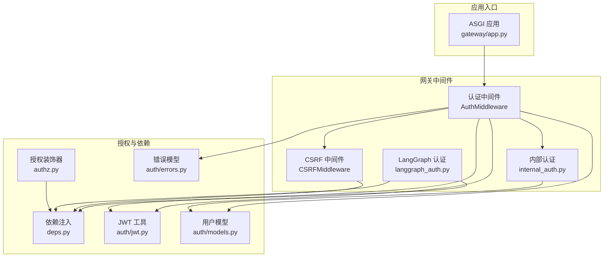
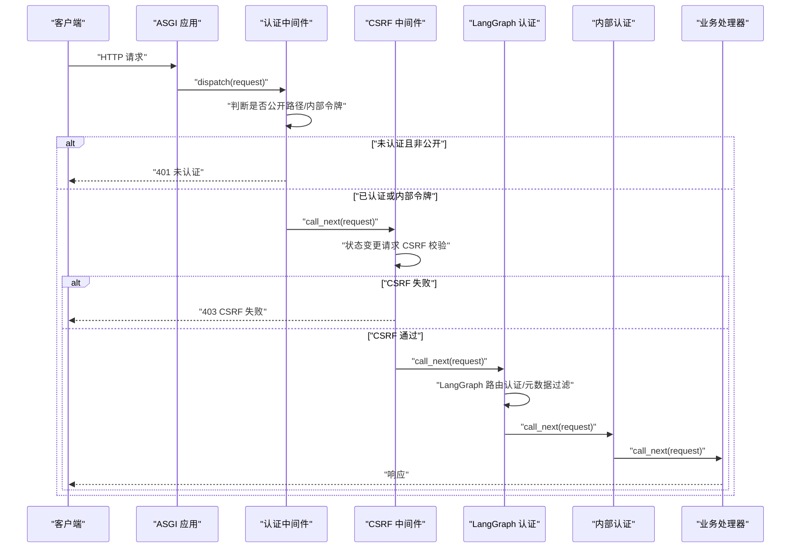
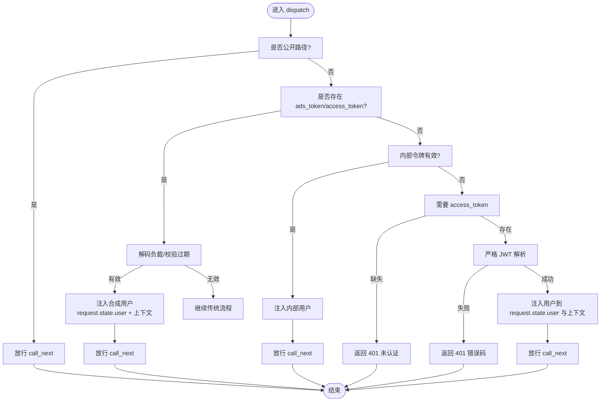
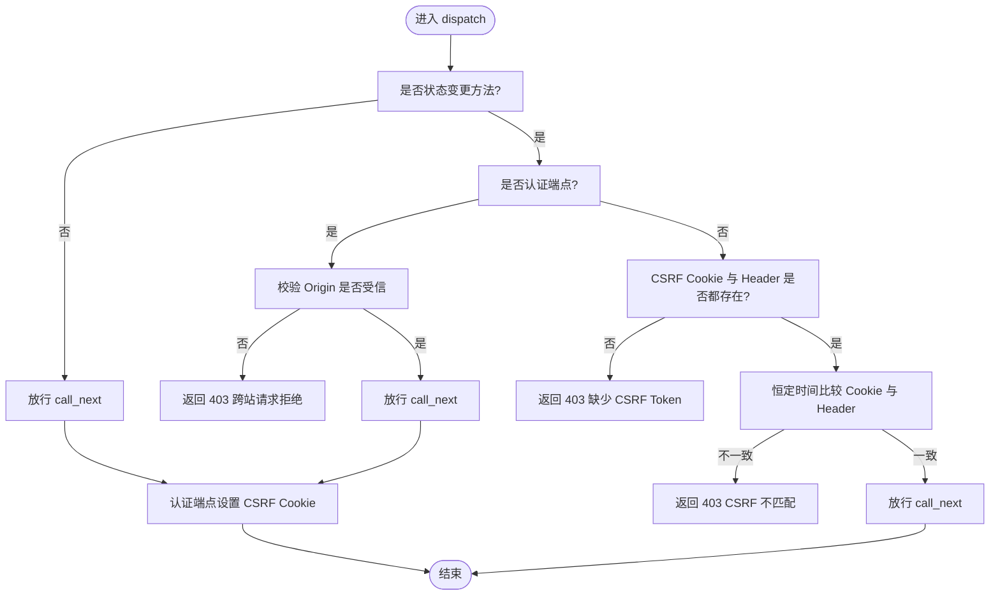
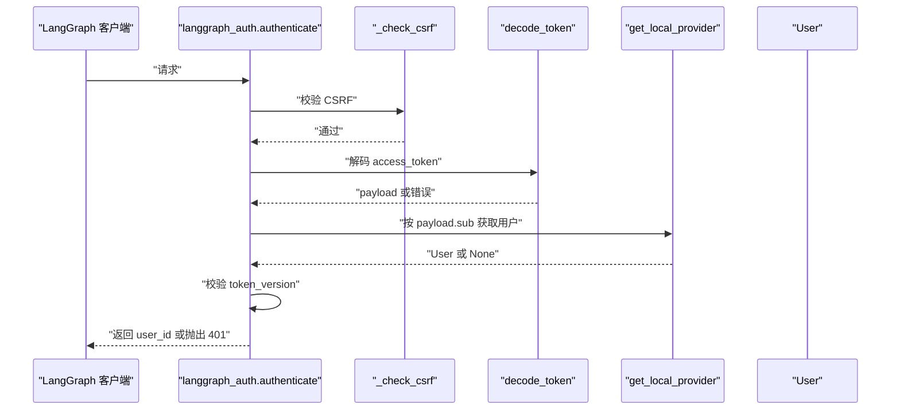
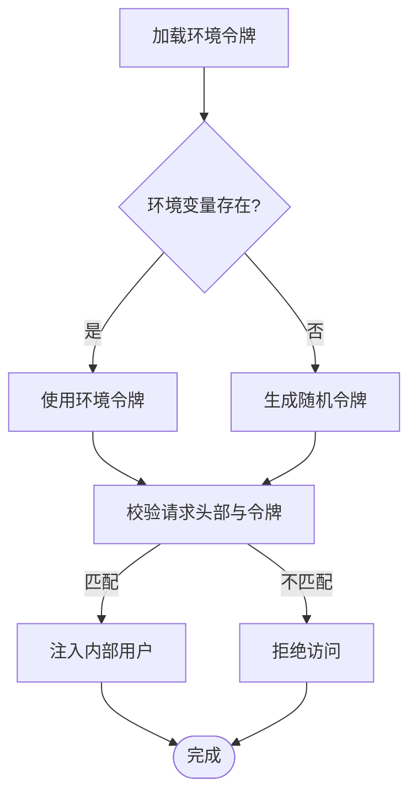
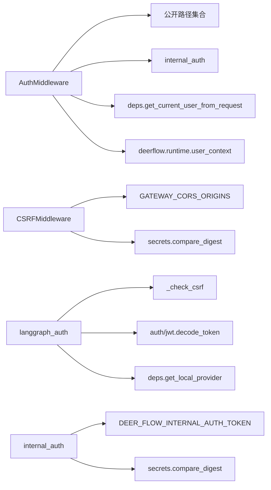

# 中间件系统

<cite>
**本文引用的文件**
- [backend/app/gateway/auth_middleware.py](file://backend/app/gateway/auth_middleware.py)
- [backend/app/gateway/csrf_middleware.py](file://backend/app/gateway/csrf_middleware.py)
- [backend/app/gateway/langgraph_auth.py](file://backend/app/gateway/langgraph_auth.py)
- [backend/app/gateway/internal_auth.py](file://backend/app/gateway/internal_auth.py)
- [backend/app/gateway/authz.py](file://backend/app/gateway/authz.py)
- [backend/app/gateway/deps.py](file://backend/app/gateway/deps.py)
- [backend/app/gateway/auth/errors.py](file://backend/app/gateway/auth/errors.py)
- [backend/app/gateway/auth/jwt.py](file://backend/app/gateway/auth/jwt.py)
- [backend/app/gateway/auth/models.py](file://backend/app/gateway/auth/models.py)
- [backend/app/gateway/app.py](file://backend/app/gateway/app.py)
- [backend/docs/middleware-execution-flow.md](file://backend/docs/middleware-execution-flow.md)
- [backend/tests/test_auth_middleware.py](file://backend/tests/test_auth_middleware.py)
- [backend/tests/test_csrf_middleware.py](file://backend/tests/test_csrf_middleware.py)
- [backend/tests/test_langgraph_auth.py](file://backend/tests/test_langgraph_auth.py)
- [backend/tests/test_internal_auth.py](file://backend/tests/test_internal_auth.py)
</cite>

## 目录
1. [简介](#简介)
2. [项目结构](#项目结构)
3. [核心组件](#核心组件)
4. [架构总览](#架构总览)
5. [详细组件分析](#详细组件分析)
6. [依赖分析](#依赖分析)
7. [性能考虑](#性能考虑)
8. [故障排查指南](#故障排查指南)
9. [结论](#结论)
10. [附录](#附录)

## 简介
本文件为 DeerFlow 中间件系统的权威技术文档，聚焦以下四类中间件的设计与实现：
- 认证中间件：全局严格认证网关，拒绝未认证请求，解析 JWT 并注入用户上下文。
- CSRF 保护中间件：基于双提交 Cookie 的跨站请求伪造防护，覆盖状态变更型请求。
- LangGraph 认证中间件：与网关一致的 JWT/CSRF 规则，保障直连 LangGraph 场景的一致性。
- 内部认证中间件：用于受信内部调用者的令牌校验与合成用户注入。

文档将深入解释中间件的执行顺序、请求拦截机制、身份验证流程与权限检查逻辑，并提供可定制的行为、认证失败处理与安全策略建议，以及性能优化与调试技巧。

## 项目结构
中间件位于后端网关模块中，围绕 FastAPI/Starlette 的中间件基础设施构建，配合授权装饰器与依赖注入完成端到端的安全控制链。

图示来源
- [backend/app/gateway/auth_middleware.py:1-160](file://backend/app/gateway/auth_middleware.py#L1-L160)
- [backend/app/gateway/csrf_middleware.py:1-238](file://backend/app/gateway/csrf_middleware.py#L1-L238)
- [backend/app/gateway/langgraph_auth.py:1-111](file://backend/app/gateway/langgraph_auth.py#L1-L111)
- [backend/app/gateway/internal_auth.py:1-38](file://backend/app/gateway/internal_auth.py#L1-L38)
- [backend/app/gateway/authz.py:1-224](file://backend/app/gateway/authz.py#L1-L224)
- [backend/app/gateway/deps.py](file://backend/app/gateway/deps.py)
- [backend/app/gateway/auth/errors.py](file://backend/app/gateway/auth/errors.py)
- [backend/app/gateway/auth/jwt.py](file://backend/app/gateway/auth/jwt.py)
- [backend/app/gateway/auth/models.py](file://backend/app/gateway/auth/models.py)
- [backend/app/gateway/app.py](file://backend/app/gateway/app.py)

章节来源
- [backend/app/gateway/auth_middleware.py:1-160](file://backend/app/gateway/auth_middleware.py#L1-L160)
- [backend/app/gateway/csrf_middleware.py:1-238](file://backend/app/gateway/csrf_middleware.py#L1-L238)
- [backend/app/gateway/langgraph_auth.py:1-111](file://backend/app/gateway/langgraph_auth.py#L1-L111)
- [backend/app/gateway/internal_auth.py:1-38](file://backend/app/gateway/internal_auth.py#L1-L38)
- [backend/app/gateway/authz.py:1-224](file://backend/app/gateway/authz.py#L1-L224)
- [backend/app/gateway/app.py](file://backend/app/gateway/app.py)

## 核心组件
- 认证中间件（AuthMiddleware）：非公开路径强制会话 Cookie 校验与严格 JWT 解码，失败返回 401；成功后在请求状态与运行时上下文中注入用户对象，供下游仓库层的“所有者过滤”自动生效。
- CSRF 中间件（CSRFMiddleware）：对状态变更型请求进行双提交 Cookie 校验；对认证端点在首次调用时允许无 CSRF（避免首次登录丢失令牌），同时限制跨站来源；认证端点在设置会话时回写 CSRF Cookie。
- LangGraph 认证中间件：通过装饰器注册认证与元数据过滤，复用网关相同的 JWT/CSRF 规则，确保直连 LangGraph 服务时与网关一致。
- 内部认证中间件（internal_auth）：通过环境变量或随机令牌配置内部调用令牌，支持受信内部组件以统一头部进行认证，并注入合成用户。

章节来源
- [backend/app/gateway/auth_middleware.py:53-160](file://backend/app/gateway/auth_middleware.py#L53-L160)
- [backend/app/gateway/csrf_middleware.py:175-238](file://backend/app/gateway/csrf_middleware.py#L175-L238)
- [backend/app/gateway/langgraph_auth.py:57-111](file://backend/app/gateway/langgraph_auth.py#L57-L111)
- [backend/app/gateway/internal_auth.py:11-38](file://backend/app/gateway/internal_auth.py#L11-L38)

## 架构总览
下图展示中间件在请求生命周期中的执行顺序与职责边界。认证中间件作为全局安全网关，优先于其他中间件执行；CSRF 中间件随后拦截状态变更请求；LangGraph 认证与内部认证分别服务于外部直连与内部信任调用场景。

图示来源
- [backend/app/gateway/auth_middleware.py:76-160](file://backend/app/gateway/auth_middleware.py#L76-L160)
- [backend/app/gateway/csrf_middleware.py:181-229](file://backend/app/gateway/csrf_middleware.py#L181-L229)
- [backend/app/gateway/langgraph_auth.py:57-111](file://backend/app/gateway/langgraph_auth.py#L57-L111)
- [backend/app/gateway/internal_auth.py:30-38](file://backend/app/gateway/internal_auth.py#L30-L38)
- [backend/app/gateway/app.py](file://backend/app/gateway/app.py)

## 详细组件分析

### 认证中间件（AuthMiddleware）
- 公开路径豁免：健康检查与 OpenAPI 文档等路径无需认证。
- ADS 令牌兼容：识别 ads_token/access_token 并做基础负载解码与过期校验，若有效则注入合成用户。
- 内部令牌校验：通过固定头部与环境令牌对比，匹配则注入默认内部用户。
- 严格 JWT 校验：对非公开路径要求 access_token，调用严格解析器进行细粒度错误码返回；成功后在请求状态与运行时上下文中注入用户，便于后续仓库层的“所有者过滤”。

图示来源
- [backend/app/gateway/auth_middleware.py:46-160](file://backend/app/gateway/auth_middleware.py#L46-L160)

章节来源
- [backend/app/gateway/auth_middleware.py:24-71](file://backend/app/gateway/auth_middleware.py#L24-L71)
- [backend/app/gateway/auth_middleware.py:76-160](file://backend/app/gateway/auth_middleware.py#L76-L160)
- [backend/app/gateway/auth/errors.py](file://backend/app/gateway/auth/errors.py)
- [backend/app/gateway/deps.py](file://backend/app/gateway/deps.py)
- [backend/app/gateway/auth/models.py](file://backend/app/gateway/auth/models.py)

### CSRF 保护中间件（CSRFMiddleware）
- 状态变更请求：仅对 POST/PUT/DELETE/PATCH 进行 CSRF 校验。
- 认证端点豁免：首次登录/注册/初始化等端点允许无 CSRF（浏览器尚未持有 CSRF Cookie）。
- 跨站来源控制：从环境变量读取受信来源，结合请求头与转发信息规范化校验，拒绝非法 Origin。
- 双提交 Cookie：要求 Cookie 与请求头值一致，使用恒定时比较防止时序攻击；认证端点在设置会话时回写 CSRF Cookie。

图示来源
- [backend/app/gateway/csrf_middleware.py:32-229](file://backend/app/gateway/csrf_middleware.py#L32-L229)

章节来源
- [backend/app/gateway/csrf_middleware.py:17-238](file://backend/app/gateway/csrf_middleware.py#L17-L238)

### LangGraph 认证中间件
- 认证装饰器：在状态变更请求上先执行 CSRF 校验，再校验 access_token 的有效性与用户存在性，最后校验 token_version 一致性。
- 元数据过滤：在写入时注入用户标识，在读取/删除时按用户标识过滤，确保数据隔离与所有权约束。

图示来源
- [backend/app/gateway/langgraph_auth.py:57-96](file://backend/app/gateway/langgraph_auth.py#L57-L96)
- [backend/app/gateway/auth/jwt.py](file://backend/app/gateway/auth/jwt.py)
- [backend/app/gateway/deps.py](file://backend/app/gateway/deps.py)

章节来源
- [backend/app/gateway/langgraph_auth.py:1-111](file://backend/app/gateway/langgraph_auth.py#L1-L111)

### 内部认证中间件
- 环境令牌加载：从环境变量读取内部令牌，不存在时生成随机令牌。
- 头部构造：提供统一头部用于内部调用方携带令牌。
- 令牌校验：使用恒定时间比较确保安全性。
- 合成用户：注入默认内部用户，便于内部通道调用的上下文一致。

图示来源
- [backend/app/gateway/internal_auth.py:15-38](file://backend/app/gateway/internal_auth.py#L15-L38)

章节来源
- [backend/app/gateway/internal_auth.py:1-38](file://backend/app/gateway/internal_auth.py#L1-L38)

## 依赖分析
- 认证中间件依赖：
  - 公开路径白名单与精确豁免集合。
  - ADS 令牌解析与过期校验。
  - 内部令牌校验与合成用户。
  - 严格 JWT 解析器与用户上下文注入。
- CSRF 中间件依赖：
  - 状态变更方法判定与认证端点豁免。
  - CORS 受信来源解析与规范化。
  - 双提交 Cookie 与恒定时间比较。
- LangGraph 认证依赖：
  - CSRF 校验逻辑复用。
  - JWT 解码与用户查询。
- 内部认证依赖：
  - 环境变量与随机令牌生成。
  - 恒定时间比较与上下文注入。

图示来源
- [backend/app/gateway/auth_middleware.py:24-160](file://backend/app/gateway/auth_middleware.py#L24-L160)
- [backend/app/gateway/csrf_middleware.py:48-113](file://backend/app/gateway/csrf_middleware.py#L48-L113)
- [backend/app/gateway/langgraph_auth.py:31-96](file://backend/app/gateway/langgraph_auth.py#L31-L96)
- [backend/app/gateway/internal_auth.py:15-38](file://backend/app/gateway/internal_auth.py#L15-L38)

章节来源
- [backend/app/gateway/auth_middleware.py:1-160](file://backend/app/gateway/auth_middleware.py#L1-L160)
- [backend/app/gateway/csrf_middleware.py:1-238](file://backend/app/gateway/csrf_middleware.py#L1-L238)
- [backend/app/gateway/langgraph_auth.py:1-111](file://backend/app/gateway/langgraph_auth.py#L1-L111)
- [backend/app/gateway/internal_auth.py:1-38](file://backend/app/gateway/internal_auth.py#L1-L38)

## 性能考虑
- 中间件顺序与短路：
  - 认证中间件尽早失败，避免后续中间件与业务处理器的无效开销。
  - CSRF 中间件仅对状态变更请求校验，GET/HEAD/OPTIONS/TRACE 放行。
- 恒定时间比较：
  - 使用恒定时间比较防止时序攻击，避免分支导致的侧信道风险。
- 上下文注入与清理：
  - 认证中间件在请求结束后重置运行时上下文，避免内存泄漏。
- CSRF Cookie 设置：
  - 仅在认证端点设置 CSRF Cookie，减少不必要的响应头开销。
- 环境变量解析：
  - CORS 来源解析与规范化仅在 CSRF 校验时发生，避免重复计算。

章节来源
- [backend/app/gateway/csrf_middleware.py:27-30](file://backend/app/gateway/csrf_middleware.py#L27-L30)
- [backend/app/gateway/csrf_middleware.py:215-227](file://backend/app/gateway/csrf_middleware.py#L215-L227)
- [backend/app/gateway/auth_middleware.py:155-159](file://backend/app/gateway/auth_middleware.py#L155-L159)

## 故障排查指南
- 认证失败（401）：
  - 检查 access_token 是否存在、格式正确、未过期、用户存在且 token_version 一致。
  - 若使用 ADS 令牌，请确认负载中的用户名与过期时间字段。
  - 查看认证中间件对未认证与令牌错误的细粒度错误码映射。
- CSRF 失败（403）：
  - 确认请求方法为状态变更类型，且 CSRF Cookie 与 Header 值一致。
  - 检查认证端点首次调用是否允许无 CSRF（浏览器尚未持有 CSRF Cookie）。
  - 核对 Origin 是否在受信来源列表中，且被正确规范化。
- 内部调用失败：
  - 确认请求头包含固定头部名称，且值与环境令牌一致。
  - 如未设置环境令牌，内部认证模块会生成随机令牌，需同步给调用方。
- 授权装饰器未生效：
  - 确保 @require_auth 在 @require_permission 之前，装饰器链从下至上执行。
  - 检查请求状态中是否已注入 AuthContext。

章节来源
- [backend/app/gateway/auth_middleware.py:117-147](file://backend/app/gateway/auth_middleware.py#L117-L147)
- [backend/app/gateway/csrf_middleware.py:184-211](file://backend/app/gateway/csrf_middleware.py#L184-L211)
- [backend/app/gateway/internal_auth.py:30-32](file://backend/app/gateway/internal_auth.py#L30-L32)
- [backend/app/gateway/authz.py:147-196](file://backend/app/gateway/authz.py#L147-L196)
- [backend/tests/test_auth_middleware.py](file://backend/tests/test_auth_middleware.py)
- [backend/tests/test_csrf_middleware.py](file://backend/tests/test_csrf_middleware.py)
- [backend/tests/test_internal_auth.py](file://backend/tests/test_internal_auth.py)
- [backend/tests/test_langgraph_auth.py](file://backend/tests/test_langgraph_auth.py)

## 结论
DeerFlow 中间件系统通过严格的认证网关、细粒度的 CSRF 保护、LangGraph 兼容认证与内部信任令牌，构建了多层次、可扩展且高性能的安全控制链。认证中间件负责“谁可以访问”，CSRF 中间件负责“如何安全地变更状态”，LangGraph 认证保证直连场景的一致性，内部认证为受信调用提供最小权限入口。配合授权装饰器与上下文注入，系统实现了“认证即授权”的设计目标，既满足功能需求又兼顾安全与性能。

## 附录
- 中间件执行顺序参考：洋葱模型与 before/after 执行序列。
- 配置要点：
  - CSRF 受信来源：通过环境变量配置受信 Origin 列表。
  - 内部令牌：通过环境变量设置固定令牌，或让系统自动生成。
  - ADS 令牌：支持基于负载的用户名与过期时间校验。

章节来源
- [backend/docs/middleware-execution-flow.md:164-224](file://backend/docs/middleware-execution-flow.md#L164-L224)
- [backend/app/gateway/csrf_middleware.py:97-113](file://backend/app/gateway/csrf_middleware.py#L97-L113)
- [backend/app/gateway/internal_auth.py:15-22](file://backend/app/gateway/internal_auth.py#L15-L22)